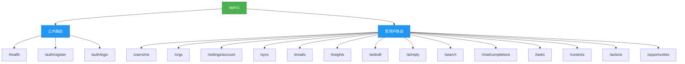
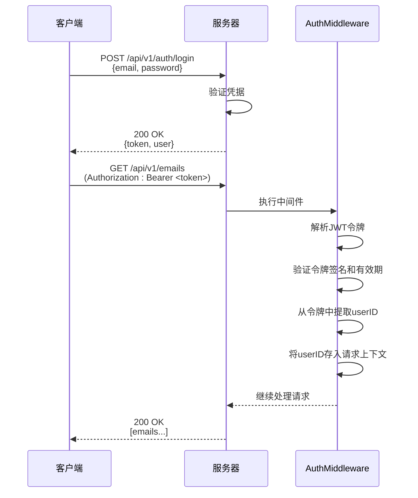

# API参考

<cite>
**本文档中引用的文件**  
- [routes.go](file://backend/internal/router/routes.go)
- [auth.go](file://backend/internal/handler/auth.go)
- [email.go](file://backend/internal/handler/email.go)
- [search.go](file://backend/internal/handler/search.go)
- [ai_draft.go](file://backend/internal/handler/ai_draft.go)
- [context.go](file://backend/internal/handler/context.go)
- [task.go](file://backend/internal/handler/task.go)
- [organization.go](file://backend/internal/handler/organization.go)
- [account.go](file://backend/internal/handler/account.go)
- [auth.go](file://backend/internal/middleware/auth.go)
- [api.ts](file://frontend/src/lib/api.ts)
- [emails.ts](file://frontend/src/lib/api/emails.ts)
- [email.go](file://backend/internal/model/email.go)
- [context.go](file://backend/internal/model/context.go)
- [task.go](file://backend/internal/model/task.go)
</cite>

## 目录
1. [简介](#简介)
2. [API分层结构与路由设计](#api分层结构与路由设计)
3. [认证机制](#认证机制)
4. [核心API端点参考](#核心api端点参考)
   - [认证API](#认证api)
   - [邮件API](#邮件api)
   - [搜索API](#搜索api)
   - [AI草稿API](#ai草稿api)
   - [上下文API](#上下文api)
   - [任务API](#任务api)
   - [组织API](#组织api)
   - [账户API](#账户api)
5. [前端调用示例](#前端调用示例)
6. [错误码参考](#错误码参考)

## 简介
本API参考文档为EchoMind应用的RESTful API提供了权威的技术参考。文档详细描述了所有核心API端点，包括其HTTP方法、URL路径、请求/响应格式、认证方式和可能的错误情况。本文档旨在帮助开发者集成、调试和理解EchoMind后端服务的接口设计。

**API基础URL**: `/api/v1`

**协议**: 所有API均使用HTTPS协议进行安全通信。

**数据格式**: 请求和响应主体均采用JSON格式。

**Section sources**
- [routes.go](file://backend/internal/router/routes.go#L26-L98)

## API分层结构与路由设计
EchoMind的API采用分层路由设计，以`/api/v1`作为版本化基础路径。API分为公共路由和受保护路由两大类：

- **公共路由**：无需身份验证，主要用于健康检查和用户注册/登录。
- **受保护路由**：需要有效的JWT令牌，通过`authMiddleware`中间件保护，覆盖了应用的核心功能。

API端点按功能模块组织，如`/emails`、`/search`、`/ai/draft`等，体现了清晰的领域驱动设计（DDD）原则。



**Diagram sources**
- [routes.go](file://backend/internal/router/routes.go#L26-L98)

## 认证机制
EchoMind API使用JWT（JSON Web Token）进行身份验证。所有受保护的API端点都需要在HTTP请求头中包含一个有效的JWT令牌。

### 认证流程
1.  **获取令牌**：用户通过`POST /api/v1/auth/login`端点使用其凭据（邮箱和密码）登录。
2.  **接收令牌**：服务器验证凭据后，返回一个包含用户信息的JWT令牌。
3.  **使用令牌**：客户端在后续的所有API请求中，在`Authorization`头中包含该令牌，格式为`Bearer <token>`。
4.  **服务器验证**：服务器的`AuthMiddleware`中间件会解析并验证令牌的有效性。

### JWT中间件
`AuthMiddleware`函数负责处理所有受保护路由的认证逻辑。它会：
- 检查请求头中是否存在`Authorization`。
- 验证其格式是否为`Bearer <token>`。
- 使用密钥解析和验证JWT令牌。
- 将用户ID存储在Gin上下文中，供后续处理器使用。



**Diagram sources**
- [auth.go](file://backend/internal/middleware/auth.go#L18-L48)
- [routes.go](file://backend/internal/router/routes.go#L36-L98)

## 核心API端点参考

### 认证API
处理用户注册、登录和资料更新。

#### `POST /auth/register`
注册一个新用户。

- **HTTP方法**: `POST`
- **URL路径**: `/api/v1/auth/register`
- **认证**: 无需
- **请求体 (JSON)**:
  ```json
  {
    "email": "string (required, email)",
    "password": "string (required, min 6 chars)",
    "name": "string"
  }
  ```
- **成功响应 (201 Created)**:
  ```json
  {
    "message": "User registered successfully",
    "token": "string (JWT)",
    "user": {
      "id": "uuid",
      "email": "string",
      "name": "string",
      "role": "string",
      "has_account": "boolean"
    }
  }
  ```
- **可能的错误码**:
  - `400 Bad Request`: 请求体格式错误或缺少必填字段。
  - `409 Conflict`: 用户已存在。

**Section sources**
- [auth.go](file://backend/internal/handler/auth.go#L27-L64)

#### `POST /auth/login`
使用邮箱和密码登录。

- **HTTP方法**: `POST`
- **URL路径**: `/api/v1/auth/login`
- **认证**: 无需
- **请求体 (JSON)**:
  ```json
  {
    "email": "string (required, email)",
    "password": "string (required)"
  }
  ```
- **成功响应 (200 OK)**:
  ```json
  {
    "token": "string (JWT)",
    "user": {
      "id": "uuid",
      "email": "string",
      "name": "string",
      "role": "string",
      "has_account": "boolean"
    }
  }
  ```
- **可能的错误码**:
  - `400 Bad Request`: 请求体格式错误。
  - `401 Unauthorized`: 凭据无效。

**Section sources**
- [auth.go](file://backend/internal/handler/auth.go#L71-L88)

#### `PATCH /users/me`
更新当前认证用户的角色和姓名。

- **HTTP方法**: `PATCH`
- **URL路径**: `/api/v1/users/me`
- **认证**: 需要JWT
- **请求头**: `Authorization: Bearer <token>`
- **请求体 (JSON)**:
  ```json
  {
    "role": "string (optional, oneof: executive, manager, dealmaker)",
    "name": "string (optional, max 100 chars)"
  }
  ```
- **成功响应 (200 OK)**:
  ```json
  {
    "message": "User profile updated successfully"
  }
  ```
- **可能的错误码**:
  - `400 Bad Request`: 请求体格式错误。
  - `401 Unauthorized`: 令牌无效或缺失。

**Section sources**
- [auth.go](file://backend/internal/handler/auth.go#L106-L126)

### 邮件API
管理用户的邮件数据。

#### `GET /emails`
获取用户的邮件列表。

- **HTTP方法**: `GET`
- **URL路径**: `/api/v1/emails`
- **认证**: 需要JWT
- **请求头**: `Authorization: Bearer <token>`
- **查询参数**:
  - `limit` (int, default=50): 返回邮件的最大数量。
  - `offset` (int, default=0): 用于分页的偏移量。
  - `context_id` (string): 按上下文ID过滤。
  - `folder` (string): 按文件夹过滤（如INBOX）。
  - `category` (string): 按类别过滤（如Work, Newsletter）。
  - `filter` (string): 通用过滤器。
- **成功响应 (200 OK)**: 返回一个`Email`对象数组。
- **可能的错误码**:
  - `400 Bad Request`: 查询参数格式错误。
  - `401 Unauthorized`: 令牌无效。

**Section sources**
- [email.go](file://backend/internal/handler/email.go#L30-L63)

#### `GET /emails/:id`
获取单封邮件的详细信息。

- **HTTP方法**: `GET`
- **URL路径**: `/api/v1/emails/{id}`
- **认证**: 需要JWT
- **请求头**: `Authorization: Bearer <token>`
- **路径参数**:
  - `id` (string): 邮件的UUID。
- **成功响应 (200 OK)**: 返回一个`Email`对象。
- **可能的错误码**:
  - `400 Bad Request`: ID格式无效。
  - `401 Unauthorized`: 令牌无效。
  - `404 Not Found`: 邮件不存在或无权访问。

**Section sources**
- [email.go](file://backend/internal/handler/email.go#L65-L91)

#### `DELETE /emails/all`
删除用户的所有邮件。

- **HTTP方法**: `DELETE`
- **URL路径**: `/api/v1/emails/all`
- **认证**: 需要JWT
- **请求头**: `Authorization: Bearer <token>`
- **成功响应 (200 OK)**:
  ```json
  {
    "message": "All emails deleted successfully"
  }
  ```
- **可能的错误码**:
  - `401 Unauthorized`: 令牌无效。
  - `500 Internal Server Error`: 删除失败。

**Section sources**
- [email.go](file://backend/internal/handler/email.go#L93-L107)

### 搜索API
在用户的邮件中执行语义搜索。

#### `GET /search`
在用户的邮件中搜索。

- **HTTP方法**: `GET`
- **URL路径**: `/api/v1/search`
- **认证**: 需要JWT
- **请求头**: `Authorization: Bearer <token>`
- **查询参数**:
  - `q` (string, required): 搜索查询。
  - `sender` (string): 按发件人过滤。
  - `context_id` (string): 按上下文ID过滤。
  - `start_date` (string, format=YYYY-MM-DD): 按开始日期过滤。
  - `end_date` (string, format=YYYY-MM-DD): 按结束日期过滤。
  - `limit` (int, default=10, max=100): 返回结果的最大数量。
- **成功响应 (200 OK)**:
  ```json
  {
    "query": "string",
    "results": [
      {
        "email_id": "uuid",
        "subject": "string",
        "snippet": "string",
        "sender": "string",
        "date": "string (ISO 8601)",
        "score": "number"
      }
    ],
    "count": "number"
  }
  ```
- **可能的错误码**:
  - `400 Bad Request`: `q`参数缺失或格式错误。
  - `401 Unauthorized`: 令牌无效。
  - `500 Internal Server Error`: 搜索失败。

**Section sources**
- [search.go](file://backend/internal/handler/search.go#L32-L127)

### AI草稿API
利用AI生成邮件回复草稿。

#### `POST /ai/draft`
根据提供的邮件内容和用户提示生成回复草稿。

- **HTTP方法**: `POST`
- **URL路径**: `/api/v1/ai/draft`
- **认证**: 需要JWT
- **请求头**: `Authorization: Bearer <token>`
- **请求体 (JSON)**:
  ```json
  {
    "emailContent": "string (required)",
    "userPrompt": "string (required)"
  }
  ```
- **成功响应 (200 OK)**:
  ```json
  {
    "draft": "string"
  }
  ```
- **可能的错误码**:
  - `400 Bad Request`: 请求体格式错误。
  - `401 Unauthorized`: 令牌无效。
  - `500 Internal Server Error`: AI生成失败。

**Section sources**
- [ai_draft.go](file://backend/internal/handler/ai_draft.go#L39-L54)

#### `POST /ai/reply`
为指定邮件生成AI回复。

- **HTTP方法**: `POST`
- **URL路径**: `/api/v1/ai/reply`
- **认证**: 需要JWT
- **请求头**: `Authorization: Bearer <token>`
- **请求体 (JSON)**:
  ```json
  {
    "emailId": "string (required, UUID)",
    "tone": "string (optional, e.g., professional, casual)",
    "context": "string (optional, e.g., brief, detailed)"
  }
  ```
- **成功响应 (200 OK)**:
  ```json
  {
    "reply": "string",
    "confidence": "number (0.0 - 1.0)"
  }
  ```
- **可能的错误码**:
  - `400 Bad Request`: `emailId`格式无效。
  - `401 Unauthorized`: 令牌无效。
  - `404 Not Found`: 邮件不存在。
  - `500 Internal Server Error`: AI生成失败。

**Section sources**
- [ai_draft.go](file://backend/internal/handler/ai_draft.go#L56-L102)

### 上下文API
管理用户的智能上下文（如项目、主题）。

#### `POST /contexts`
创建一个新的上下文。

- **HTTP方法**: `POST`
- **URL路径**: `/api/v1/contexts`
- **认证**: 需要JWT
- **请求头**: `Authorization: Bearer <token>`
- **请求体 (JSON)**:
  ```json
  {
    "name": "string (required)",
    "color": "string (optional)",
    "keywords": ["string"],
    "stakeholders": ["string"]
  }
  ```
- **成功响应 (201 Created)**: 返回创建的`Context`对象。
- **可能的错误码**:
  - `400 Bad Request`: 请求体格式错误。
  - `401 Unauthorized`: 令牌无效。

**Section sources**
- [context.go](file://backend/internal/handler/context.go#L20-L37)

#### `GET /contexts`
获取用户的所有上下文。

- **HTTP方法**: `GET`
- **URL路径**: `/api/v1/contexts`
- **认证**: 需要JWT
- **请求头**: `Authorization: Bearer <token>`
- **成功响应 (200 OK)**: 返回一个`Context`对象数组。
- **可能的错误码**:
  - `401 Unauthorized`: 令牌无效。

**Section sources**
- [context.go](file://backend/internal/handler/context.go#L39-L50)

#### `PATCH /contexts/:id`
更新一个上下文。

- **HTTP方法**: `PATCH`
- **URL路径**: `/api/v1/contexts/{id}`
- **认证**: 需要JWT
- **请求头**: `Authorization: Bearer <token>`
- **路径参数**:
  - `id` (string): 上下文的UUID。
- **请求体 (JSON)**: 与`POST /contexts`相同。
- **成功响应 (200 OK)**: 返回更新后的`Context`对象。
- **可能的错误码**:
  - `400 Bad Request`: ID或请求体格式错误。
  - `401 Unauthorized`: 令牌无效。

**Section sources**
- [context.go](file://backend/internal/handler/context.go#L52-L75)

#### `DELETE /contexts/:id`
删除一个上下文。

- **HTTP方法**: `DELETE`
- **URL路径**: `/api/v1/contexts/{id}`
- **认证**: 需要JWT
- **请求头**: `Authorization: Bearer <token>`
- **路径参数**:
  - `id` (string): 上下文的UUID。
- **成功响应 (204 No Content)**: 无响应体。
- **可能的错误码**:
  - `400 Bad Request`: ID格式无效。
  - `401 Unauthorized`: 令牌无效。

**Section sources**
- [context.go](file://backend/internal/handler/context.go#L77-L93)

### 任务API
管理用户的任务。

#### `POST /tasks`
创建一个新任务。

- **HTTP方法**: `POST`
- **URL路径**: `/api/v1/tasks`
- **认证**: 需要JWT
- **请求头**: `Authorization: Bearer <token>`
- **请求体 (JSON)**:
  ```json
  {
    "title": "string (required)",
    "description": "string",
    "source_email_id": "uuid",
    "due_date": "string (RFC3339)"
  }
  ```
- **成功响应 (201 Created)**: 返回创建的`Task`对象。
- **可能的错误码**:
  - `400 Bad Request`: 请求体格式错误。
  - `401 Unauthorized`: 令牌无效。

**Section sources**
- [task.go](file://backend/internal/handler/task.go#L52-L68)

#### `GET /tasks`
获取用户的任务列表。

- **HTTP方法**: `GET`
- **URL路径**: `/api/v1/tasks`
- **认证**: 需要JWT
- **请求头**: `Authorization: Bearer <token>`
- **查询参数**:
  - `status` (string): 按状态过滤（todo, in_progress, done）。
  - `priority` (string): 按优先级过滤（high, medium, low）。
  - `limit` (int, default=20): 返回任务的最大数量。
  - `offset` (int, default=0): 用于分页的偏移量。
- **成功响应 (200 OK)**: 返回一个`Task`对象数组。
- **可能的错误码**:
  - `401 Unauthorized`: 令牌无效。

**Section sources**
- [task.go](file://backend/internal/handler/task.go#L83-L107)

#### `PATCH /tasks/:id/status`
更新任务的状态。

- **HTTP方法**: `PATCH`
- **URL路径**: `/api/v1/tasks/{id}/status`
- **认证**: 需要JWT
- **请求头**: `Authorization: Bearer <token>`
- **路径参数**:
  - `id` (string): 任务的UUID。
- **请求体 (JSON)**:
  ```json
  {
    "status": "string (required, oneof: todo, in_progress, done)"
  }
  ```
- **成功响应 (200 OK)**: 无响应体。
- **可能的错误码**:
  - `400 Bad Request`: ID或请求体格式错误。
  - `401 Unauthorized`: 令牌无效。
  - `404 Not Found`: 任务不存在或无权访问。

**Section sources**
- [task.go](file://backend/internal/handler/task.go#L122-L147)

#### `PATCH /tasks/:id`
更新任务的其他字段。

- **HTTP方法**: `PATCH`
- **URL路径**: `/api/v1/tasks/{id}`
- **认证**: 需要JWT
- **请求头**: `Authorization: Bearer <token>`
- **路径参数**:
  - `id` (string): 任务的UUID。
- **请求体 (JSON)**:
  ```json
  {
    "title": "string",
    "description": "string",
    "priority": "string (oneof: high, medium, low)",
    "due_date": "string (RFC3339)"
  }
  ```
- **成功响应 (200 OK)**: 无响应体。
- **可能的错误码**:
  - `400 Bad Request`: ID或请求体格式错误。
  - `401 Unauthorized`: 令牌无效。
  - `404 Not Found`: 任务不存在或无权访问。

**Section sources**
- [task.go](file://backend/internal/handler/task.go#L162-L201)

#### `DELETE /tasks/:id`
删除一个任务。

- **HTTP方法**: `DELETE`
- **URL路径**: `/api/v1/tasks/{id}`
- **认证**: 需要JWT
- **请求头**: `Authorization: Bearer <token>`
- **路径参数**:
  - `id` (string): 任务的UUID。
- **成功响应 (204 No Content)**: 无响应体。
- **可能的错误码**:
  - `400 Bad Request`: ID格式无效。
  - `401 Unauthorized`: 令牌无效。
  - `404 Not Found`: 任务不存在或无权访问。

**Section sources**
- [task.go](file://backend/internal/handler/task.go#L215-L234)

### 组织API
管理用户所属的组织。

#### `POST /orgs`
为用户创建一个新组织。

- **HTTP方法**: `POST`
- **URL路径**: `/api/v1/orgs`
- **认证**: 需要JWT
- **请求头**: `Authorization: Bearer <token>`
- **请求体 (JSON)**:
  ```json
  {
    "name": "string (required)"
  }
  ```
- **成功响应 (201 Created)**: 返回创建的组织对象。
- **可能的错误码**:
  - `400 Bad Request`: 请求体格式错误。
  - `401 Unauthorized`: 令牌无效。

**Section sources**
- [organization.go](file://backend/internal/handler/organization.go#L20-L39)

#### `GET /orgs`
获取用户所属的所有组织。

- **HTTP方法**: `GET`
- **URL路径**: `/api/v1/orgs`
- **认证**: 需要JWT
- **请求头**: `Authorization: Bearer <token>`
- **成功响应 (200 OK)**: 返回一个组织对象数组。
- **可能的错误码**:
  - `401 Unauthorized`: 令牌无效。

**Section sources**
- [organization.go](file://backend/internal/handler/organization.go#L41-L52)

#### `GET /orgs/:id`
获取指定组织的详细信息。

- **HTTP方法**: `GET`
- **URL路径**: `/api/v1/orgs/{id}`
- **认证**: 需要JWT
- **请求头**: `Authorization: Bearer <token>`
- **路径参数**:
  - `id` (string): 组织的UUID。
- **成功响应 (200 OK)**: 返回组织对象。
- **可能的错误码**:
  - `400 Bad Request`: ID格式无效。
  - `401 Unauthorized`: 令牌无效。
  - `404 Not Found`: 组织不存在或无权访问。

**Section sources**
- [organization.go](file://backend/internal/handler/organization.go#L54-L74)

#### `GET /orgs/:id/members`
获取指定组织的所有成员。

- **HTTP方法**: `GET`
- **URL路径**: `/api/v1/orgs/{id}/members`
- **认证**: 需要JWT
- **请求头**: `Authorization: Bearer <token>`
- **路径参数**:
  - `id` (string): 组织的UUID。
- **成功响应 (200 OK)**: 返回一个成员对象数组。
- **可能的错误码**:
  - `400 Bad Request`: ID格式无效。
  - `401 Unauthorized`: 令牌无效。
  - `500 Internal Server Error`: 获取成员失败。

**Section sources**
- [organization.go](file://backend/internal/handler/organization.go#L76-L95)

### 账户API
管理用户的邮件账户连接。

#### `POST /settings/account`
连接或更新用户的邮件账户。

- **HTTP方法**: `POST`
- **URL路径**: `/api/v1/settings/account`
- **认证**: 需要JWT
- **请求头**: `Authorization: Bearer <token>`
- **请求体 (JSON)**:
  ```json
  {
    "email": "string (required)",
    "password": "string (required)",
    "server_address": "string (required)",
    "server_port": "number (required)",
    "username": "string (required)"
  }
  ```
- **成功响应 (200 OK)**:
  ```json
  {
    "message": "Account connected successfully",
    "account_id": "uuid"
  }
  ```
- **可能的错误码**:
  - `400 Bad Request`: 请求体格式错误或连接失败。
  - `401 Unauthorized`: 令牌无效。

**Section sources**
- [account.go](file://backend/internal/handler/account.go#L25-L46)

#### `GET /settings/account`
获取用户邮件账户的当前状态。

- **HTTP方法**: `GET`
- **URL路径**: `/api/v1/settings/account`
- **认证**: 需要JWT
- **请求头**: `Authorization: Bearer <token>`
- **成功响应 (200 OK)**:
  ```json
  {
    "has_account": "boolean",
    "email": "string",
    "server_address": "string",
    "server_port": "number",
    "username": "string",
    "is_connected": "boolean",
    "last_sync_at": "string (ISO 8601)",
    "error_message": "string"
  }
  ```
- **可能的错误码**:
  - `401 Unauthorized`: 令牌无效。

**Section sources**
- [account.go](file://backend/internal/handler/account.go#L48-L79)

#### `DELETE /settings/account`
断开用户的邮件账户连接。

- **HTTP方法**: `DELETE`
- **URL路径**: `/api/v1/settings/account`
- **认证**: 需要JWT
- **请求头**: `Authorization: Bearer <token>`
- **成功响应 (200 OK)**:
  ```json
  {
    "message": "Account disconnected successfully"
  }
  ```
- **可能的错误码**:
  - `401 Unauthorized`: 令牌无效。
  - `404 Not Found`: 未找到要断开的账户。

**Section sources**
- [account.go](file://backend/internal/handler/account.go#L81-L99)

## 前端调用示例
以下示例展示了如何在前端代码中调用EchoMind API。

### 初始化API客户端
前端使用Axios创建了一个全局的API客户端，它会自动处理JWT令牌的注入和401错误的处理。

```typescript
// src/lib/api.ts
import axios from 'axios';
import { useAuthStore } from '@/store/auth';

const apiClient = axios.create({
    baseURL: process.env.NEXT_PUBLIC_API_URL || '/api/v1',
    headers: {
        'Content-Type': 'application/json',
    },
});

// 请求拦截器：自动添加JWT令牌
apiClient.interceptors.request.use(
    (config) => {
        const token = useAuthStore.getState().token;
        if (token) {
            config.headers.Authorization = `Bearer ${token}`;
        }
        return config;
    },
    (error) => Promise.reject(error)
);

// 响应拦截器：处理401错误
apiClient.interceptors.response.use(
    (response) => response,
    (error) => {
        if (error.response?.status === 401) {
            useAuthStore.getState().logout();
        }
        return Promise.reject(error);
    }
);

export const api = apiClient;
```

### 调用搜索API
```typescript
// src/lib/api.ts
export const searchEmails = async (query: string, limit: number = 10): Promise<SearchResponse> => {
    const params: Record<string, string | number> = { q: query, limit };
    const response = await api.get<SearchResponse>('/search', { params });
    return response.data;
};

// 在组件中使用
const results = await searchEmails("关于季度报告的邮件");
```

### 调用邮件API
```typescript
// src/lib/api/emails.ts
export const EmailAPI = {
  list: async (params?: { limit?: number; offset?: number; context_id?: string }): Promise<Email[]> => {
    const response = await api.get('/emails', { params });
    return response.data;
  },

  get: async (id: string): Promise<Email> => {
    const response = await api.get(`/emails/${id}`);
    return response.data;
  },
};

// 在组件中使用
const emails = await EmailAPI.list({ limit: 20, context_id: "context-uuid" });
const email = await EmailAPI.get("email-uuid");
```

**Section sources**
- [api.ts](file://frontend/src/lib/api.ts#L1-L72)
- [emails.ts](file://frontend/src/lib/api/emails.ts#L1-L30)

## 错误码参考
本节列出了API可能返回的通用HTTP状态码及其含义。

| 状态码 | 名称 | 含义 |
| :--- | :--- | :--- |
| `200` | OK | 请求成功。 |
| `201` | Created | 资源创建成功。 |
| `204` | No Content | 请求成功，但无返回内容。 |
| `400` | Bad Request | 请求格式错误，或包含无效参数。 |
| `401` | Unauthorized | 请求需要身份验证，或提供的令牌无效。 |
| `404` | Not Found | 请求的资源不存在。 |
| `409` | Conflict | 请求与当前状态冲突（如用户已存在）。 |
| `500` | Internal Server Error | 服务器内部错误。 |

**Section sources**
- [auth.go](file://backend/internal/handler/auth.go#L37-L38)
- [auth.go](file://backend/internal/handler/auth.go#L81-L82)
- [email.go](file://backend/internal/handler/email.go#L82-L83)
- [search.go](file://backend/internal/handler/search.go#L111-L112)