# 上下文与操作API

<cite>
**本文档中引用的文件**
- [backend/internal/handler/context.go](file://backend/internal/handler/context.go)
- [backend/internal/model/context.go](file://backend/internal/model/context.go)
- [backend/internal/model/context_input.go](file://backend/internal/model/context_input.go)
- [backend/internal/handler/action.go](file://backend/internal/handler/action.go)
- [backend/internal/service/action.go](file://backend/internal/service/action.go)
- [backend/internal/service/context.go](file://backend/internal/service/context.go)
- [backend/internal/router/routes.go](file://backend/internal/router/routes.go)
- [backend/pkg/event/bus/bus.go](file://backend/pkg/event/bus/bus.go)
- [frontend/src/lib/api/contexts.ts](file://frontend/src/lib/api/contexts.ts)
- [frontend/src/lib/api/actions.ts](file://frontend/src/lib/api/actions.ts)
- [backend/internal/listener/email_listeners.go](file://backend/internal/listener/email_listeners.go)
- [backend/internal/tasks/analyze.go](file://backend/internal/tasks/analyze.go)
- [backend/cmd/backfill_contexts/main.go](file://backend/cmd/backfill_contexts/main.go)
</cite>

## 目录
1. [简介](#简介)
2. [项目结构概览](#项目结构概览)
3. [上下文API详解](#上下文api详解)
4. [操作API详解](#操作api详解)
5. [系统架构分析](#系统架构分析)
6. [事件总线集成](#事件总线集成)
7. [数据模型设计](#数据模型设计)
8. [最佳实践指南](#最佳实践指南)
9. [故障排除](#故障排除)
10. [总结](#总结)

## 简介

EchoMind是一个智能邮件管理系统，提供了强大的上下文管理和用户操作API。该系统允许用户创建自定义的邮件分组（上下文），并通过智能算法自动将邮件分配到相应的上下文中。同时，系统提供了三种核心操作：批准（approve）、稍后处理（snooze）和忽略（dismiss），这些操作反映了用户对智能建议的反馈，并触发后续处理流程。

### 核心概念

**上下文（Context）**：用户自定义的邮件分组，用于组织和管理邮件。每个上下文包含名称、颜色标识、关键词规则和利益相关者列表。

**操作（Action）**：用户对智能建议的反馈机制，包括：
- **批准（Approve）**：标记邮件为已完成，通常会归档邮件
- **稍后处理（Snooze）**：延迟处理邮件，设置特定时间恢复
- **忽略（Dismiss）**：从智能推荐中移除邮件

## 项目结构概览

系统采用分层架构设计，主要分为以下几个层次：

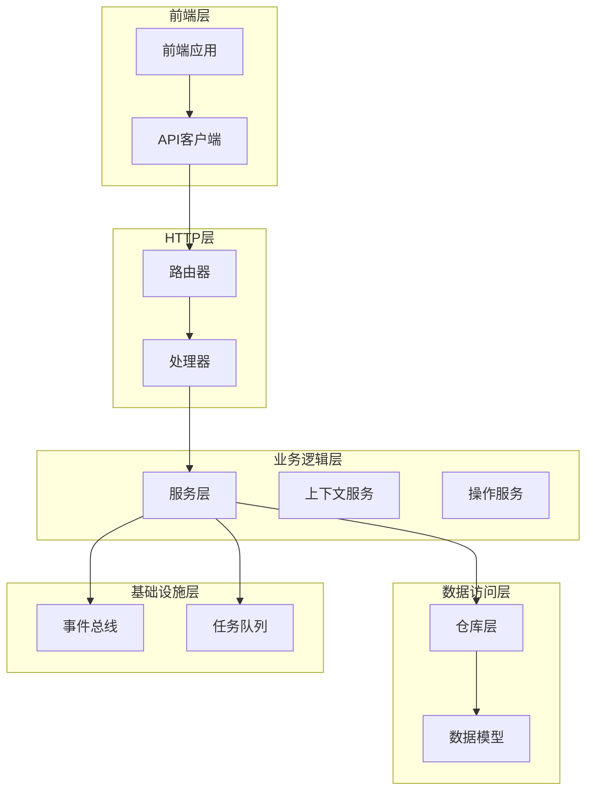

**图表来源**
- [backend/internal/router/routes.go](file://backend/internal/router/routes.go#L26-L98)
- [backend/internal/handler/context.go](file://backend/internal/handler/context.go#L12-L18)
- [backend/internal/handler/action.go](file://backend/internal/handler/action.go#L12-L18)

## 上下文API详解

### 创建上下文组 - POST /api/v1/contexts

创建新的邮件分组上下文，支持关键词匹配和利益相关者识别。

#### 请求格式

```typescript
interface ContextInput {
  name: string;           // 上下文名称（必填，最大100字符）
  color: string;          // 颜色标识（可选，最大20字符）
  keywords: string[];     // 关键词列表
  stakeholders: string[]; // 利益相关者邮箱列表
}
```

#### 示例请求

```json
{
  "name": "重要项目",
  "color": "blue",
  "keywords": ["Project Alpha", "Q4 Budget", "财务报告"],
  "stakeholders": ["boss@example.com", "team@company.com"]
}
```

#### 响应格式

```json
{
  "id": "550e8400-e29b-41d4-a716-446655440000",
  "name": "重要项目",
  "color": "blue",
  "keywords": ["Project Alpha", "Q4 Budget", "财务报告"],
  "stakeholders": ["boss@example.com", "team@company.com"],
  "createdAt": "2024-01-15T10:30:00Z",
  "updatedAt": "2024-01-15T10:30:00Z"
}
```

#### 处理流程

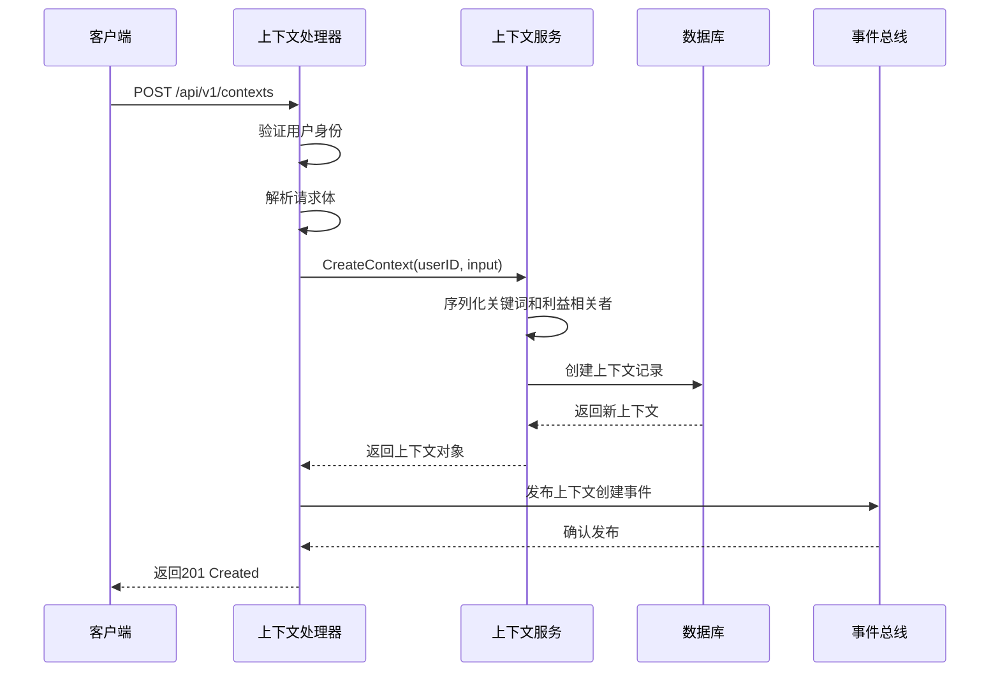

**图表来源**
- [backend/internal/handler/context.go](file://backend/internal/handler/context.go#L21-L36)
- [backend/internal/service/context.go](file://backend/internal/service/context.go#L22-L46)

**节来源**
- [backend/internal/handler/context.go](file://backend/internal/handler/context.go#L21-L36)
- [backend/internal/model/context_input.go](file://backend/internal/model/context_input.go#L4-L9)

### 列出上下文 - GET /api/v1/contexts

获取当前用户的全部上下文列表，按创建时间降序排列。

#### 响应格式

```json
[
  {
    "id": "550e8400-e29b-41d4-a716-446655440000",
    "name": "重要项目",
    "color": "blue",
    "keywords": ["Project Alpha", "Q4 Budget"],
    "stakeholders": ["boss@example.com"],
    "createdAt": "2024-01-15T10:30:00Z",
    "updatedAt": "2024-01-15T10:30:00Z"
  },
  {
    "id": "550e8400-e29b-41d4-a716-446655440001",
    "name": "日常事务",
    "color": "green",
    "keywords": ["会议", "日程安排"],
    "stakeholders": [],
    "createdAt": "2024-01-14T09:15:00Z",
    "updatedAt": "2024-01-14T09:15:00Z"
  }
]
```

#### 处理流程

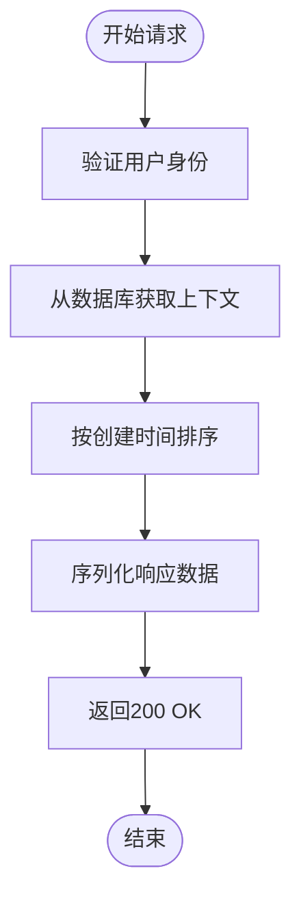

**图表来源**
- [backend/internal/handler/context.go](file://backend/internal/handler/context.go#L39-L49)
- [backend/internal/service/context.go](file://backend/internal/service/context.go#L49-L55)

**节来源**
- [backend/internal/handler/context.go](file://backend/internal/handler/context.go#L39-L49)
- [backend/internal/service/context.go](file://backend/internal/service/context.go#L49-L55)

### 更新上下文 - PATCH /api/v1/contexts/:id

修改现有上下文的属性，支持部分更新。

#### 请求参数

- **路径参数**：`:id` - 上下文唯一标识符
- **请求体**：同创建请求的结构

#### 处理流程

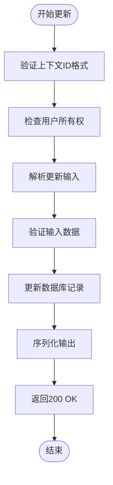

**图表来源**
- [backend/internal/handler/context.go](file://backend/internal/handler/context.go#L52-L74)
- [backend/internal/service/context.go](file://backend/internal/service/context.go#L67-L92)

**节来源**
- [backend/internal/handler/context.go](file://backend/internal/handler/context.go#L52-L74)
- [backend/internal/service/context.go](file://backend/internal/service/context.go#L67-L92)

### 删除上下文 - DELETE /api/v1/contexts/:id

删除指定的上下文及其关联关系。

#### 处理流程

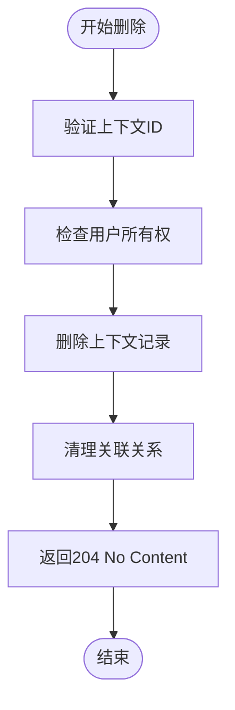

**图表来源**
- [backend/internal/handler/context.go](file://backend/internal/handler/context.go#L77-L92)
- [backend/internal/service/context.go](file://backend/internal/service/context.go#L95-L104)

**节来源**
- [backend/internal/handler/context.go](file://backend/internal/handler/context.go#L77-L92)
- [backend/internal/service/context.go](file://backend/internal/service/context.go#L95-L104)

## 操作API详解

### 批准邮件 - POST /api/v1/actions/approve

标记邮件为已处理完成，通常会归档邮件。

#### 请求格式

```typescript
interface ApproveRequest {
  email_id: string; // 邮件唯一标识符（必填）
}
```

#### 示例请求

```json
{
  "email_id": "550e8400-e29b-41d4-a716-446655440000"
}
```

#### 响应格式

```json
{
  "status": "approved"
}
```

#### 处理流程

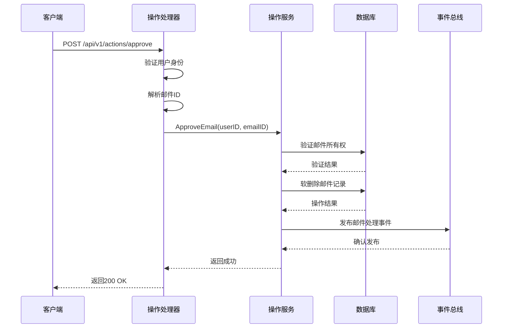

**图表来源**
- [backend/internal/handler/action.go](file://backend/internal/handler/action.go#L33-L53)
- [backend/internal/service/action.go](file://backend/internal/service/action.go#L20-L48)

**节来源**
- [backend/internal/handler/action.go](file://backend/internal/handler/action.go#L33-L53)
- [backend/internal/service/action.go](file://backend/internal/service/action.go#L20-L48)

### 稍后处理 - POST /api/v1/actions/snooze

延迟处理邮件，设置特定时间恢复显示。

#### 请求格式

```typescript
interface SnoozeRequest {
  email_id: string;     // 邮件唯一标识符（必填）
  duration?: string;    // 延迟时长："4h", "tomorrow", "next_week" 或 ISO 时间戳
}
```

#### 支持的持续时间格式

| 格式 | 描述 | 示例 |
|------|------|------|
| `"4h"` | 4小时后 | 默认延迟时间 |
| `"tomorrow"` | 明天早上9点 | 自动调整到工作日 |
| `"next_week"` | 下周一早上9点 | 自动调整到工作日 |
| `"ISO时间戳"` | 具体时间 | `2024-01-15T09:00:00Z` |

#### 示例请求

```json
{
  "email_id": "550e8400-e29b-41d4-a716-446655440000",
  "duration": "tomorrow"
}
```

#### 响应格式

```json
{
  "status": "snoozed",
  "until": "2024-01-16T09:00:00Z"
}
```

#### 处理流程

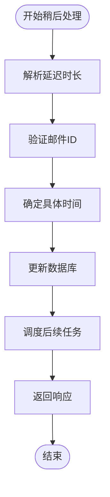

**图表来源**
- [backend/internal/handler/action.go](file://backend/internal/handler/action.go#L56-L100)
- [backend/internal/service/action.go](file://backend/internal/service/action.go#L51-L63)

**节来源**
- [backend/internal/handler/action.go](file://backend/internal/handler/action.go#L56-L100)
- [backend/internal/service/action.go](file://backend/internal/service/action.go#L51-L63)

### 忽略邮件 - POST /api/v1/actions/dismiss

从智能推荐中移除邮件，降低其紧急程度。

#### 请求格式

```typescript
interface DismissRequest {
  email_id: string; // 邮件唯一标识符（必填）
}
```

#### 示例请求

```json
{
  "email_id": "550e8400-e29b-41d4-a716-446655440000"
}
```

#### 响应格式

```json
{
  "status": "dismissed"
}
```

#### 处理流程

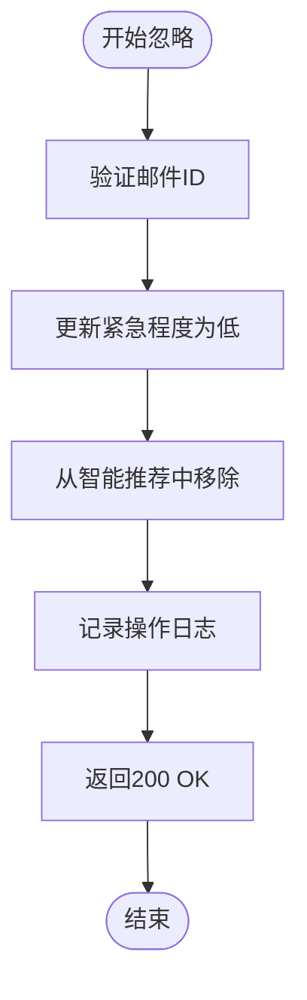

**图表来源**
- [backend/internal/handler/action.go](file://backend/internal/handler/action.go#L103-L123)
- [backend/internal/service/action.go](file://backend/internal/service/action.go#L66-L78)

**节来源**
- [backend/internal/handler/action.go](file://backend/internal/handler/action.go#L103-L123)
- [backend/internal/service/action.go](file://backend/internal/service/action.go#L66-L78)

## 系统架构分析

### 整体架构图

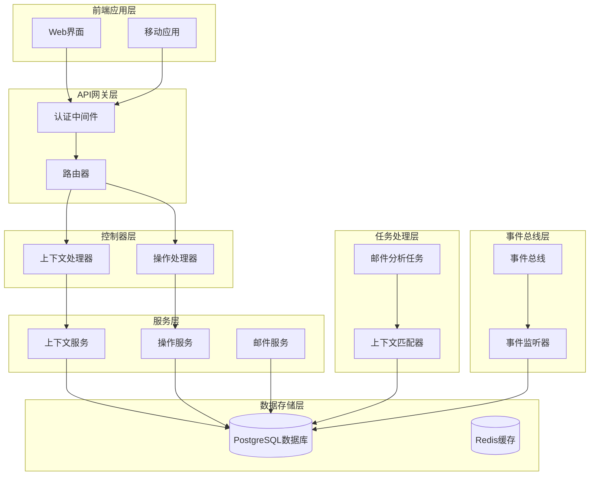

**图表来源**
- [backend/internal/router/routes.go](file://backend/internal/router/routes.go#L26-L98)
- [backend/internal/handler/context.go](file://backend/internal/handler/context.go#L12-L18)
- [backend/internal/handler/action.go](file://backend/internal/handler/action.go#L12-L18)

### 上下文匹配算法

系统使用智能算法自动将邮件分配到合适的上下文中：

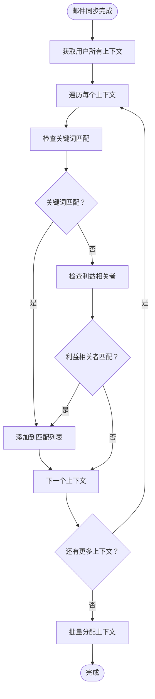

**图表来源**
- [backend/internal/service/context.go](file://backend/internal/service/context.go#L107-L151)
- [backend/internal/tasks/analyze.go](file://backend/internal/tasks/analyze.go#L153-L166)

**节来源**
- [backend/internal/service/context.go](file://backend/internal/service/context.go#L107-L151)
- [backend/internal/tasks/analyze.go](file://backend/internal/tasks/analyze.go#L153-L166)

## 事件总线集成

### 事件总线架构

系统使用事件驱动架构，通过事件总线实现组件间的解耦：

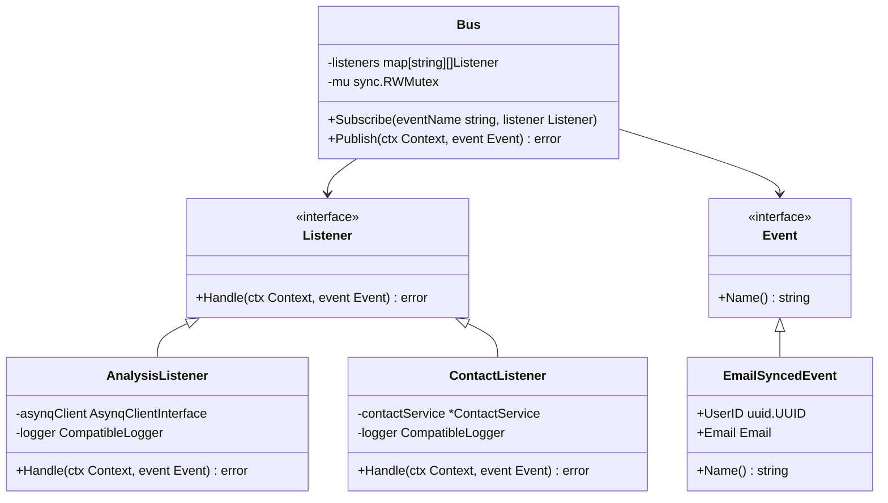

**图表来源**
- [backend/pkg/event/bus/bus.go](file://backend/pkg/event/bus/bus.go#L8-L62)
- [backend/internal/listener/email_listeners.go](file://backend/internal/listener/email_listeners.go#L22-L115)

### 事件处理流程

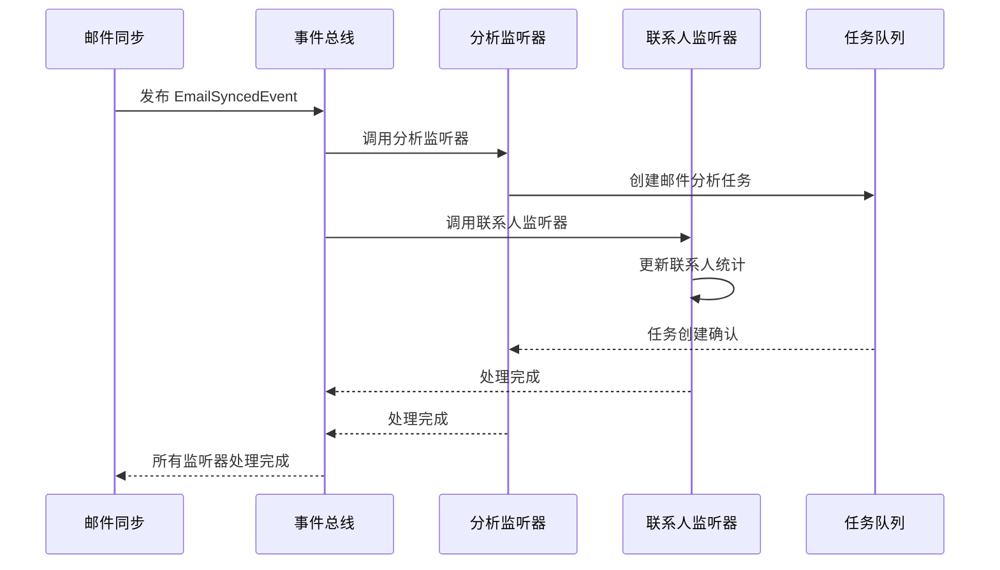

**图表来源**
- [backend/internal/listener/email_listeners.go](file://backend/internal/listener/email_listeners.go#L35-L65)
- [backend/internal/listener/email_listeners.go](file://backend/internal/listener/email_listeners.go#L80-L101)

**节来源**
- [backend/pkg/event/bus/bus.go](file://backend/pkg/event/bus/bus.go#L8-L62)
- [backend/internal/listener/email_listeners.go](file://backend/internal/listener/email_listeners.go#L35-L101)

## 数据模型设计

### 上下文数据模型

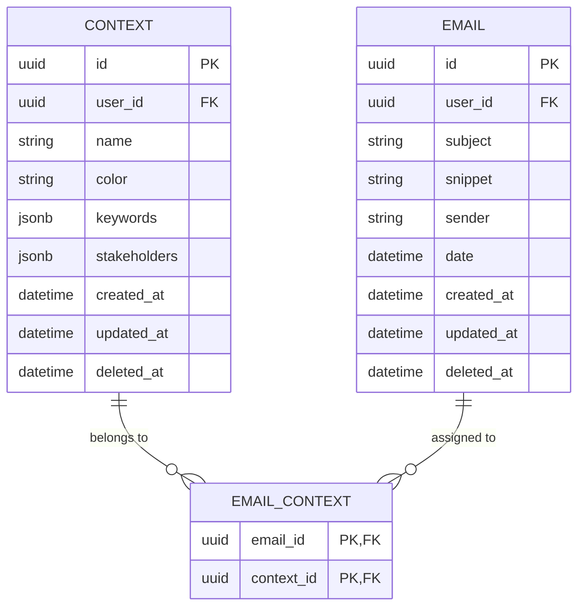

**图表来源**
- [backend/internal/model/context.go](file://backend/internal/model/context.go#L11-L30)

### 操作状态转换

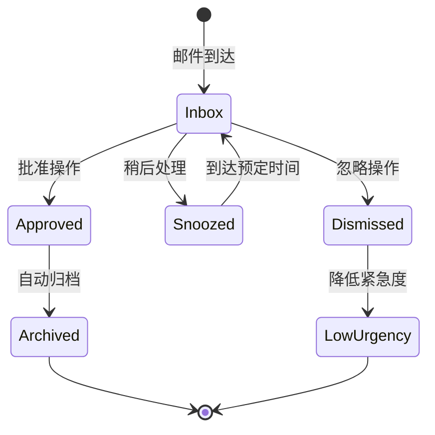

**节来源**
- [backend/internal/model/context.go](file://backend/internal/model/context.go#L11-L30)
- [backend/internal/service/action.go](file://backend/internal/service/action.go#L20-L78)

## 最佳实践指南

### 上下文创建最佳实践

1. **命名规范**：使用清晰、描述性的名称，避免过于宽泛或模糊的术语
2. **关键词策略**：
   - 包含具体的项目名称、产品名称
   - 使用行业术语和专业词汇
   - 避免过于通用的词语
3. **利益相关者管理**：
   - 包含直接负责人的邮箱地址
   - 考虑团队协作成员
   - 定期更新联系人列表

### 操作使用指南

1. **批准操作**：
   - 仅用于真正完成的任务
   - 确保邮件内容已妥善处理
   - 可能触发自动化工作流

2. **稍后处理**：
   - 设置合理的延迟时间
   - 考虑工作日程安排
   - 避免过长的延迟时间

3. **忽略操作**：
   - 用于不重要的邮件
   - 不影响长期邮件管理
   - 可重新激活被忽略的邮件

### 性能优化建议

1. **批量操作**：对于大量邮件的操作，考虑使用批量API
2. **缓存策略**：对频繁访问的上下文信息进行缓存
3. **异步处理**：大型操作使用后台任务处理

## 故障排除

### 常见问题及解决方案

#### 上下文创建失败

**问题症状**：
- HTTP 400 错误
- 输入验证失败

**可能原因**：
- 上下文名称为空或过长
- 关键词列表包含无效字符
- 利益相关者邮箱格式错误

**解决方案**：
- 检查输入数据格式
- 验证字段长度限制
- 使用正确的邮箱格式

#### 邮件分配不准确

**问题症状**：
- 邮件未分配到正确上下文
- 分配过多或过少的邮件

**可能原因**：
- 关键词匹配规则过于宽松或严格
- 利益相关者列表不完整
- 上下文数量过多导致冲突

**解决方案**：
- 调整关键词精确度
- 完善利益相关者列表
- 合理规划上下文结构

#### 操作执行超时

**问题症状**：
- 操作请求长时间无响应
- 服务器超时错误

**可能原因**：
- 数据库连接问题
- 事件总线阻塞
- 后台任务积压

**解决方案**：
- 检查数据库连接状态
- 监控事件总线性能
- 清理积压任务

**节来源**
- [backend/internal/handler/context.go](file://backend/internal/handler/context.go#L24-L28)
- [backend/internal/service/context.go](file://backend/internal/service/context.go#L107-L151)

## 总结

EchoMind的上下文与操作API提供了一个强大而灵活的邮件管理系统框架。通过上下文功能，用户可以创建个性化的邮件分组，实现智能化的邮件分类和管理。操作API则提供了用户反馈机制，使系统能够根据用户的实际行为不断优化智能建议。

### 主要特性

1. **智能上下文匹配**：基于关键词和利益相关者的自动邮件分类
2. **灵活的操作选项**：三种基本操作满足不同场景需求
3. **事件驱动架构**：通过事件总线实现组件解耦和扩展性
4. **实时反馈机制**：用户操作立即反映到系统行为中
5. **可扩展的设计**：支持自定义上下文规则和操作类型

### 技术优势

- **模块化架构**：清晰的分层设计便于维护和扩展
- **异步处理**：大量数据处理使用后台任务队列
- **强一致性**：关键操作保证数据完整性
- **高性能**：合理使用缓存和索引优化查询性能

这套API设计不仅满足了当前的功能需求，还为未来的功能扩展和系统优化奠定了坚实的基础。通过持续的迭代和改进，EchoMind将成为一个更加智能和高效的邮件管理平台。