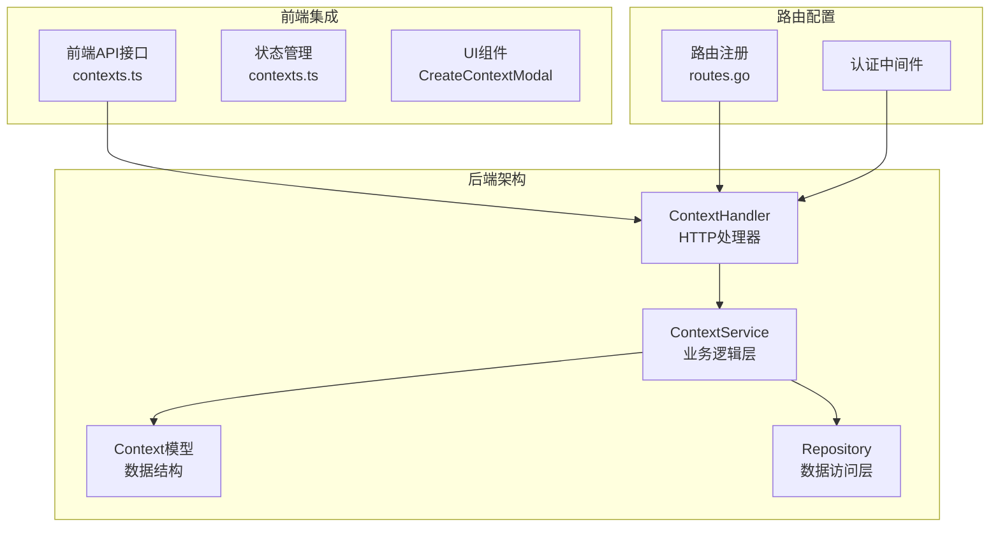
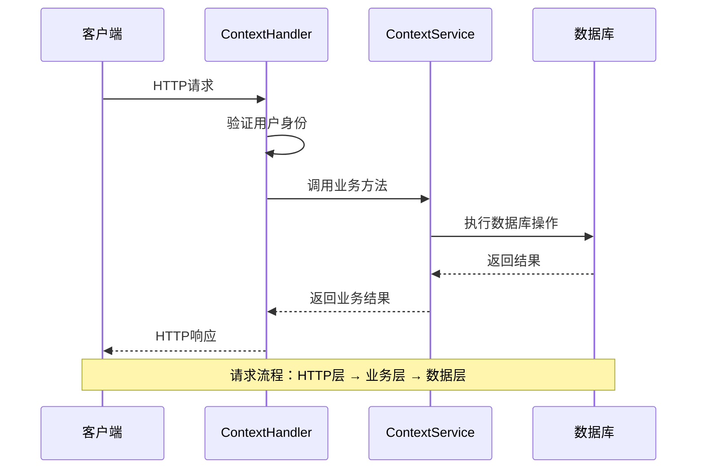
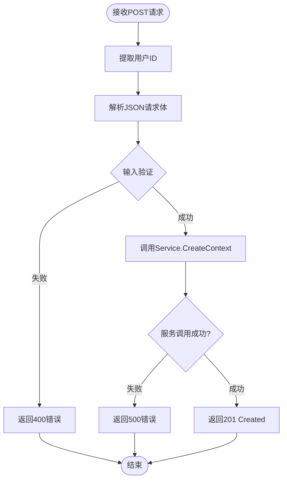
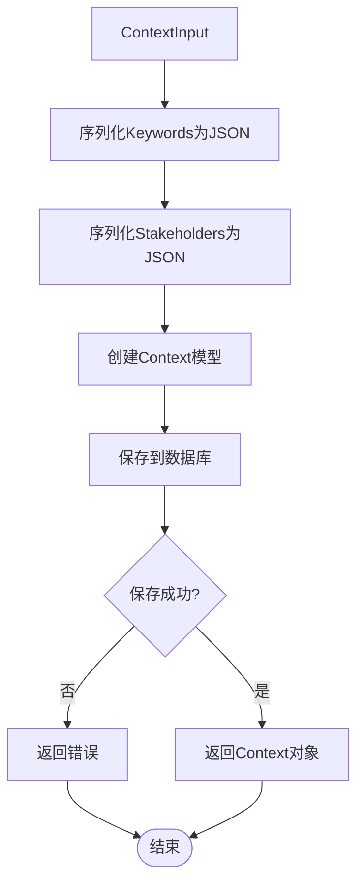
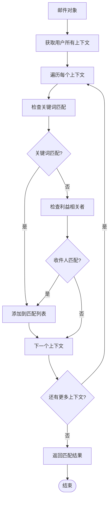
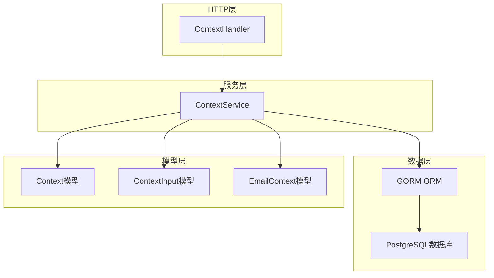

# 上下文管理API详细文档

<cite>
**本文档中引用的文件**
- [context.go](file://backend/internal/handler/context.go)
- [context.go](file://backend/internal/model/context.go)
- [context_input.go](file://backend/internal/model/context_input.go)
- [context.go](file://backend/internal/service/context.go)
- [context_test.go](file://backend/internal/service/context_test.go)
- [routes.go](file://backend/internal/router/routes.go)
- [contexts.ts](file://frontend/src/lib/api/contexts.ts)
</cite>

## 目录
1. [简介](#简介)
2. [项目结构](#项目结构)
3. [核心组件](#核心组件)
4. [架构概览](#架构概览)
5. [详细组件分析](#详细组件分析)
6. [API端点详解](#api端点详解)
7. [数据模型](#数据模型)
8. [依赖关系分析](#依赖关系分析)
9. [性能考虑](#性能考虑)
10. [故障排除指南](#故障排除指南)
11. [结论](#结论)

## 简介

上下文管理API是EchoMind系统中用于组织和管理用户邮件分组的核心功能模块。该系统通过"上下文"(Context)这一概念，允许用户创建自定义的邮件分类和组织方式，支持基于关键词、收件人等规则自动匹配邮件，并提供完整的CRUD操作接口。

上下文系统的核心价值在于：
- **智能邮件组织**：通过关键词和收件人规则自动分类邮件
- **灵活的标签系统**：支持颜色标记和自定义名称
- **自动化匹配**：基于邮件内容和发件人自动关联上下文
- **完整的生命周期管理**：支持创建、查询、更新和删除操作

## 项目结构

上下文管理功能在项目中的组织结构如下：



**图表来源**
- [context.go](file://backend/internal/handler/context.go#L12-L18)
- [context.go](file://backend/internal/model/context.go#L11-L30)
- [context.go](file://backend/internal/service/context.go#L14-L20)

**章节来源**
- [context.go](file://backend/internal/handler/context.go#L1-L94)
- [routes.go](file://backend/internal/router/routes.go#L79-L84)

## 核心组件

### ContextHandler 结构体

ContextHandler是上下文管理API的主要HTTP处理器，负责处理所有与上下文相关的HTTP请求。它包含一个指向ContextService的引用，实现了四个核心方法：

- **CreateContext**：创建新的上下文
- **ListContexts**：列出用户的所有上下文
- **UpdateContext**：更新现有上下文
- **DeleteContext**：删除指定上下文

### ContextService 服务层

ContextService提供了业务逻辑的核心实现，直接与数据库交互，处理以下关键操作：

- **CreateContext**：创建新上下文并存储到数据库
- **ListContexts**：检索用户的所有上下文
- **UpdateContext**：更新现有上下文信息
- **DeleteContext**：删除指定上下文
- **MatchContexts**：根据邮件内容匹配相关上下文
- **AssignContextsToEmail**：将上下文分配给邮件

### Context 模型

Context模型定义了上下文在数据库中的结构，支持复杂的邮件匹配规则：

- **ID**：唯一标识符，使用UUID
- **UserID**：关联的用户ID
- **Name**：上下文名称
- **Color**：显示颜色
- **Keywords**：关键词数组（JSON存储）
- **Stakeholders**：利益相关者邮箱数组（JSON存储）

**章节来源**
- [context.go](file://backend/internal/handler/context.go#L12-L18)
- [context.go](file://backend/internal/service/context.go#L14-L20)
- [context.go](file://backend/internal/model/context.go#L11-L30)

## 架构概览

上下文管理系统采用经典的三层架构模式，清晰分离关注点：



**图表来源**
- [context.go](file://backend/internal/handler/context.go#L20-L37)
- [context.go](file://backend/internal/service/context.go#L22-L47)

系统的核心设计原则：
- **单一职责**：每个组件只负责特定的功能领域
- **依赖注入**：通过构造函数注入依赖，便于测试
- **错误处理**：统一的错误处理机制
- **数据验证**：输入验证确保数据完整性

## 详细组件分析

### ContextHandler 处理器分析

ContextHandler作为HTTP层的入口，负责处理来自客户端的请求并返回适当的响应。

#### 创建上下文 (CreateContext)



**图表来源**
- [context.go](file://backend/internal/handler/context.go#L20-L37)

#### 列出上下文 (ListContexts)

该方法相对简单，主要负责从数据库中检索当前用户的上下文列表。

#### 更新上下文 (UpdateContext)

更新操作需要额外的ID验证步骤，确保用户只能修改自己的上下文。

#### 删除上下文 (DeleteContext)

删除操作同样需要验证上下文的所有权，防止越权访问。

**章节来源**
- [context.go](file://backend/internal/handler/context.go#L20-L94)

### ContextService 服务层分析

ContextService是业务逻辑的核心，实现了所有上下文相关的业务规则。

#### 创建上下文流程



**图表来源**
- [context.go](file://backend/internal/service/context.go#L22-L47)

#### 上下文匹配算法

ContextService的MatchContexts方法实现了智能的邮件匹配算法：



**图表来源**
- [context.go](file://backend/internal/service/context.go#L107-L152)

**章节来源**
- [context.go](file://backend/internal/service/context.go#L22-L169)

## API端点详解

### 创建上下文 (/api/v1/contexts)

**HTTP方法**: POST  
**URL路径**: `/api/v1/contexts`  
**认证要求**: 需要用户登录

#### 请求参数
- **请求头**: `Content-Type: application/json`
- **请求体**: JSON格式的ContextInput对象

#### 请求体模式

```json
{
  "name": "项目Alpha",
  "color": "blue",
  "keywords": ["Project Alpha", "Q4 Budget"],
  "stakeholders": ["boss@example.com", "team@example.com"]
}
```

#### 响应状态码
- **201 Created**: 上下文创建成功
- **400 Bad Request**: 请求格式错误或验证失败
- **500 Internal Server Error**: 服务器内部错误

#### 响应体
成功时返回完整的Context对象：

```json
{
  "ID": "123e4567-e89b-12d3-a456-426614174000",
  "Name": "项目Alpha",
  "Color": "blue",
  "Keywords": ["Project Alpha", "Q4 Budget"],
  "Stakeholders": ["boss@example.com", "team@example.com"],
  "CreatedAt": "2024-01-15T10:30:00Z",
  "UpdatedAt": "2024-01-15T10:30:00Z"
}
```

### 列出上下文 (/api/v1/contexts)

**HTTP方法**: GET  
**URL路径**: `/api/v1/contexts`  
**认证要求**: 需要用户登录

#### 请求参数
无特殊参数

#### 响应状态码
- **200 OK**: 成功获取上下文列表
- **500 Internal Server Error**: 服务器内部错误

#### 响应体
返回上下文数组：

```json
[
  {
    "ID": "123e4567-e89b-12d3-a456-426614174000",
    "Name": "项目Alpha",
    "Color": "blue",
    "Keywords": ["Project Alpha", "Q4 Budget"],
    "Stakeholders": ["boss@example.com"],
    "CreatedAt": "2024-01-15T10:30:00Z",
    "UpdatedAt": "2024-01-15T10:30:00Z"
  },
  {
    "ID": "123e4567-e89b-12d3-a456-426614174001",
    "Name": "日常事务",
    "Color": "green",
    "Keywords": ["日常", "工作"],
    "Stakeholders": [],
    "CreatedAt": "2024-01-14T09:15:00Z",
    "UpdatedAt": "2024-01-14T09:15:00Z"
  }
]
```

### 更新上下文 (/api/v1/contexts/:id)

**HTTP方法**: PATCH  
**URL路径**: `/api/v1/contexts/:id`  
**认证要求**: 需要用户登录

#### 路径参数
- **id**: 上下文的唯一标识符(UUID格式)

#### 请求参数
- **请求头**: `Content-Type: application/json`
- **请求体**: 可选字段的ContextInput对象

#### 请求体模式
可以只更新部分字段：

```json
{
  "name": "更新后的项目名称",
  "color": "purple",
  "keywords": ["新关键词1", "新关键词2"]
}
```

#### 响应状态码
- **200 OK**: 上下文更新成功
- **400 Bad Request**: 无效的上下文ID
- **500 Internal Server Error**: 服务器内部错误

### 删除上下文 (/api/v1/contexts/:id)

**HTTP方法**: DELETE  
**URL路径**: `/api/v1/contexts/:id`  
**认证要求**: 需要用户登录

#### 路径参数
- **id**: 要删除的上下文的唯一标识符

#### 响应状态码
- **204 No Content**: 上下文删除成功
- **400 Bad Request**: 无效的上下文ID
- **500 Internal Server Error**: 服务器内部错误

**章节来源**
- [routes.go](file://backend/internal/router/routes.go#L79-L84)
- [context.go](file://backend/internal/handler/context.go#L20-L94)

## 数据模型

### ContextInput 模型

ContextInput是API输入的数据模型，定义了创建和更新上下文时的验证规则：

| 字段名 | 类型 | 必填 | 长度限制 | 描述 |
|--------|------|------|----------|------|
| name | string | 是 | 最大100字符 | 上下文名称 |
| color | string | 否 | 最大20字符 | 显示颜色 |
| keywords | []string | 否 | 无限制 | 关键词数组 |
| stakeholders | []string | 否 | 无限制 | 利益相关者邮箱地址 |

#### 验证规则

- **name字段**: 必填且最大长度为100字符
- **color字段**: 可选，最大长度为20字符
- **keywords字段**: 可选，字符串数组
- **stakeholders字段**: 可选，邮箱地址数组

### Context 模型

Context模型是数据库中的实体映射：

| 字段名 | 类型 | 约束 | 描述 |
|--------|------|------|------|
| ID | UUID | 主键 | 唯一标识符 |
| UserID | UUID | 外键，非空，索引 | 关联用户 |
| Name | string | 非空，varchar(100) | 上下文名称 |
| Color | string | 默认'blue'，varchar(20) | 显示颜色 |
| Keywords | JSON | JSONB类型 | 关键词数组 |
| Stakeholders | JSON | JSONB类型 | 利益相关者数组 |
| CreatedAt | datetime | 自动设置 | 创建时间 |
| UpdatedAt | datetime | 自动更新 | 更新时间 |
| DeletedAt | datetime | 软删除索引 | 删除时间 |

### EmailContext 关联模型

EmailContext模型建立了邮件和上下文之间的多对多关系：

| 字段名 | 类型 | 约束 | 描述 |
|--------|------|------|------|
| EmailID | UUID | 主键，外键 | 关联邮件ID |
| ContextID | UUID | 主键，外键 | 关联上下文ID |

**章节来源**
- [context_input.go](file://backend/internal/model/context_input.go#L3-L10)
- [context.go](file://backend/internal/model/context.go#L11-L30)

## 依赖关系分析

上下文管理系统的依赖关系展现了清晰的分层架构：



**图表来源**
- [context.go](file://backend/internal/handler/context.go#L12-L18)
- [context.go](file://backend/internal/service/context.go#L14-L20)

### 组件耦合分析

- **松耦合设计**: Handler和Service之间通过接口解耦
- **依赖注入**: 使用构造函数注入数据库连接
- **单一职责**: 每个组件专注于特定功能领域
- **可测试性**: 清晰的依赖关系便于单元测试

### 外部依赖

- **Gin框架**: HTTP路由和请求处理
- **GORM**: 对象关系映射
- **UUID库**: 唯一标识符生成
- **JSON库**: 数据序列化和反序列化

**章节来源**
- [context.go](file://backend/internal/handler/context.go#L12-L18)
- [context.go](file://backend/internal/service/context.go#L14-L20)

## 性能考虑

### 查询优化

- **索引策略**: 在UserID字段上建立索引以加速查询
- **软删除**: 使用gorm.DeletedAt字段进行软删除
- **批量操作**: 在AssignContextsToEmail中使用批量插入

### 缓存策略

虽然当前实现没有缓存，但可以考虑以下优化：
- **上下文列表缓存**: 缓存用户的上下文列表
- **匹配结果缓存**: 缓存邮件匹配结果
- **预编译查询**: 预编译常用的数据库查询

### 并发处理

- **数据库连接池**: 使用GORM的连接池管理
- **事务控制**: 在复杂操作中使用事务保证一致性
- **乐观锁**: 在更新操作中避免并发冲突

## 故障排除指南

### 常见错误及解决方案

#### 400 Bad Request 错误

**可能原因**:
- 请求体格式不正确
- 必填字段缺失
- 字段长度超出限制

**解决方案**:
- 检查JSON格式是否正确
- 验证必填字段是否存在
- 确认字段长度符合要求

#### 401 Unauthorized 错误

**可能原因**:
- 用户未登录
- 认证令牌过期

**解决方案**:
- 重新登录获取有效令牌
- 检查Authorization头是否正确设置

#### 404 Not Found 错误

**可能原因**:
- 上下文ID不存在
- 用户无权限访问

**解决方案**:
- 验证上下文ID的有效性
- 确认用户对该上下文有访问权限

#### 500 Internal Server Error

**可能原因**:
- 数据库连接问题
- 业务逻辑异常
- 数据验证失败

**解决方案**:
- 检查数据库连接状态
- 查看服务器日志获取详细错误信息
- 验证输入数据的完整性

### 调试技巧

1. **启用调试日志**: 在开发环境中启用详细的请求日志
2. **单元测试**: 运行服务层的单元测试验证功能
3. **数据库检查**: 直接查询数据库确认数据状态
4. **API测试**: 使用Postman等工具手动测试API

**章节来源**
- [context.go](file://backend/internal/handler/context.go#L24-L37)
- [context.go](file://backend/internal/service/context.go#L22-L47)

## 结论

上下文管理API是一个设计良好的模块化系统，具有以下特点：

### 优势

1. **清晰的架构**: 三层架构分离关注点，便于维护和扩展
2. **完整的CRUD**: 提供了全面的上下文生命周期管理
3. **智能匹配**: 基于关键词和收件人的自动匹配算法
4. **RESTful设计**: 符合REST API设计原则
5. **强类型支持**: TypeScript前端类型定义确保类型安全

### 扩展建议

1. **搜索功能**: 添加全文搜索支持
2. **高级匹配**: 支持正则表达式匹配
3. **批量操作**: 支持批量创建、更新和删除
4. **导入导出**: 支持上下文的导入导出功能
5. **可视化界面**: 提供上下文管理的图形界面

### 最佳实践

1. **输入验证**: 始终验证用户输入
2. **错误处理**: 提供有意义的错误信息
3. **安全性**: 确保用户只能访问自己的数据
4. **性能监控**: 监控API的响应时间和错误率
5. **文档维护**: 保持API文档的及时更新

这个上下文管理系统为用户提供了强大的邮件组织能力，通过智能匹配算法和灵活的配置选项，能够显著提升用户的邮件管理工作效率。