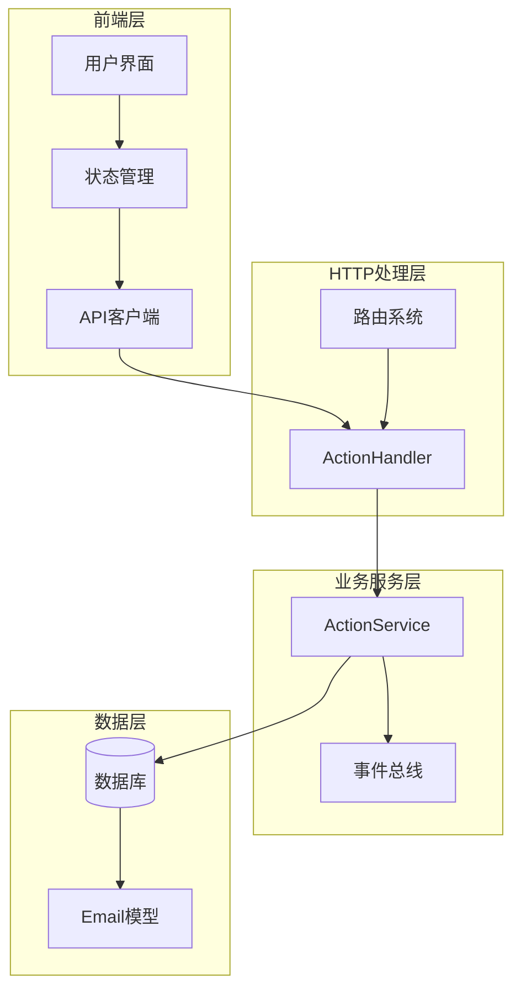
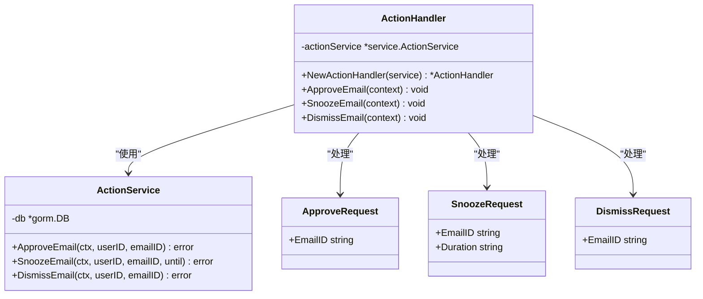
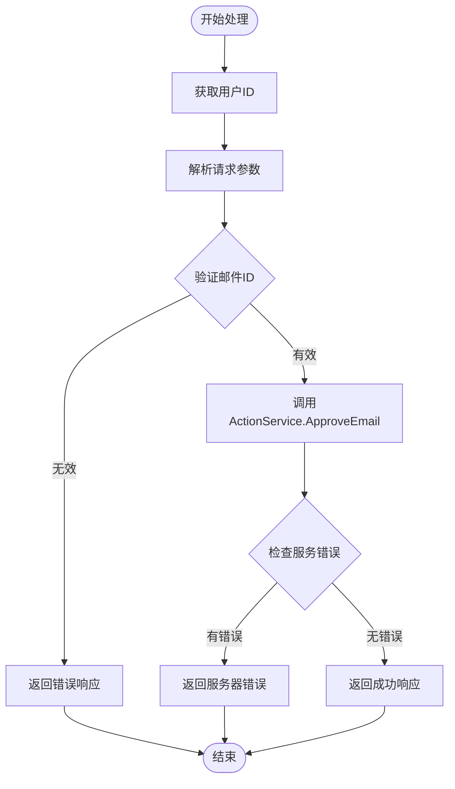
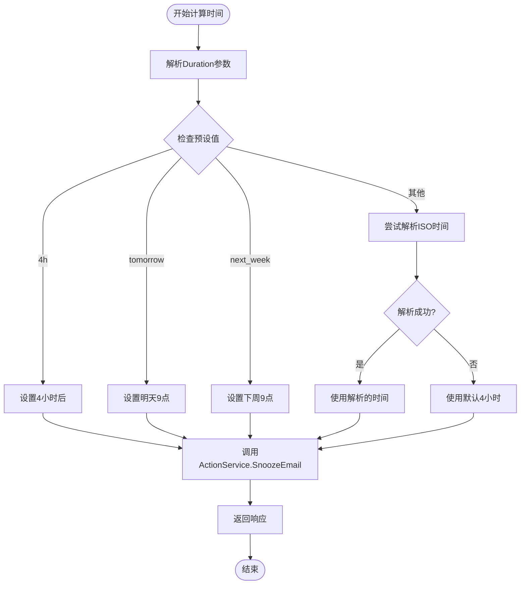
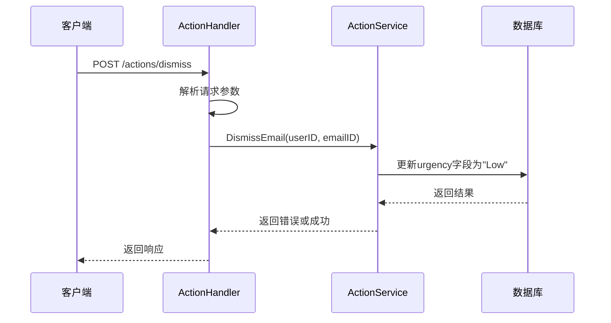
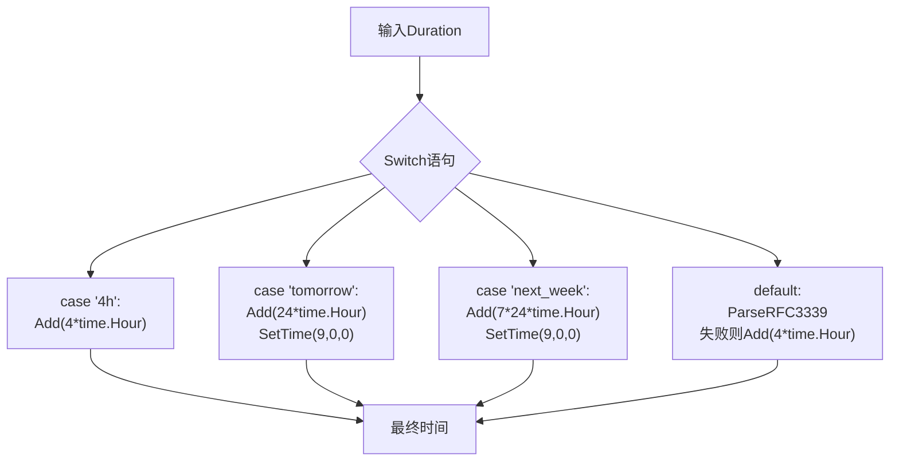
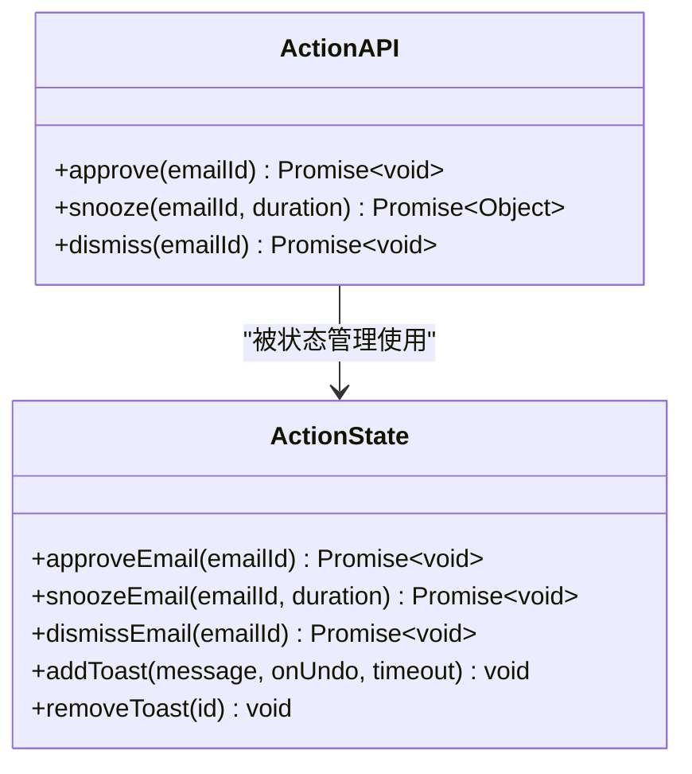
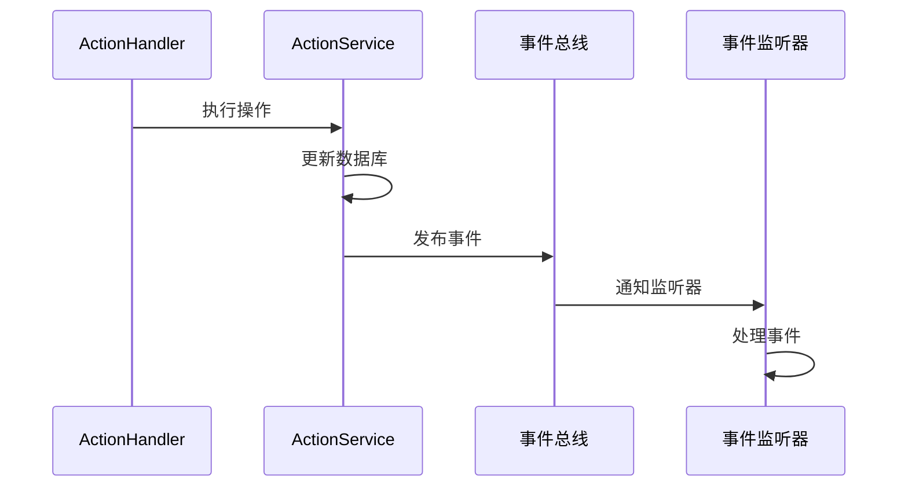

# 用户操作API详细文档

<cite>
**本文档中引用的文件**
- [action.go](file://backend/internal/handler/action.go)
- [action.go](file://backend/internal/service/action.go)
- [routes.go](file://backend/internal/router/routes.go)
- [email.go](file://backend/internal/model/email.go)
- [bus.go](file://backend/pkg/event/bus/bus.go)
- [actions.ts](file://frontend/src/lib/api/actions.ts)
- [actions.ts](file://frontend/src/lib/store/actions.ts)
- [container.go](file://backend/internal/app/container.go)
- [main.go](file://backend/cmd/main.go)
</cite>

## 目录
1. [简介](#简介)
2. [系统架构概览](#系统架构概览)
3. [ActionHandler结构体详解](#actionhandler结构体详解)
4. [核心操作方法](#核心操作方法)
5. [请求响应模式](#请求响应模式)
6. [时间计算逻辑](#时间计算逻辑)
7. [前端集成](#前端集成)
8. [错误处理与验证](#错误处理与验证)
9. [扩展性考虑](#扩展性考虑)
10. [总结](#总结)

## 简介

EchoMind的用户操作API提供了三个核心功能，允许用户对AI智能建议进行反馈和管理：**Approve（批准）**、**Snooze（推迟）**和**Dismiss（忽略）**。这些操作构成了用户与智能邮件系统交互的重要反馈机制，直接影响邮件的状态管理和后续的AI洞察生成。

该API采用分层架构设计，包含HTTP处理器层、服务层和数据访问层，确保了良好的可维护性和扩展性。所有操作都通过统一的事件总线机制发布事件，支持系统的异步响应和状态同步。

## 系统架构概览



**图表来源**
- [action.go](file://backend/internal/handler/action.go#L12-L18)
- [action.go](file://backend/internal/service/action.go#L12-L14)
- [routes.go](file://backend/internal/router/routes.go#L85-L88)

**章节来源**
- [action.go](file://backend/internal/handler/action.go#L1-L125)
- [action.go](file://backend/internal/service/action.go#L1-L80)
- [routes.go](file://backend/internal/router/routes.go#L1-L99)

## ActionHandler结构体详解

ActionHandler是用户操作API的核心HTTP处理器，负责接收和处理来自客户端的用户操作请求。

### 结构体定义



**图表来源**
- [action.go](file://backend/internal/handler/action.go#L12-L31)
- [action.go](file://backend/internal/service/action.go#L12-L18)

### 核心字段说明

| 字段 | 类型 | 描述 | 必需性 |
|------|------|------|--------|
| actionService | *service.ActionService | ActionService实例，负责业务逻辑处理 | 是 |

### 初始化方法

ActionHandler通过工厂函数`NewActionHandler`进行初始化，接受一个ActionService实例作为依赖注入参数。

**章节来源**
- [action.go](file://backend/internal/handler/action.go#L12-L18)

## 核心操作方法

### ApproveEmail - 批准邮件操作

ApproveEmail方法实现了邮件的批准和归档功能，是用户确认邮件已处理完成的主要途径。

#### 方法签名
```go
func (h *ActionHandler) ApproveEmail(c *gin.Context)
```

#### 处理流程



**图表来源**
- [action.go](file://backend/internal/handler/action.go#L34-L53)

#### 业务逻辑

ApproveEmail操作执行以下步骤：
1. **所有权验证**：确保当前用户有权操作指定的邮件
2. **归档处理**：将邮件标记为已处理并从收件箱中移除
3. **状态更新**：更新邮件的处理状态

在实际实现中，ApproveEmail通常对应于GORM的软删除操作，将邮件从可见列表中移除但保留其历史记录。

**章节来源**
- [action.go](file://backend/internal/handler/action.go#L34-L53)
- [action.go](file://backend/internal/service/action.go#L20-L49)

### SnoozeEmail - 推迟邮件操作

SnoozeEmail方法允许用户将邮件推迟到未来的某个时间点，支持多种时间格式和预设选项。

#### 方法签名
```go
func (h *ActionHandler) SnoozeEmail(c *gin.Context)
```

#### 时间计算逻辑

Snooze操作支持多种时间格式：



**图表来源**
- [action.go](file://backend/internal/handler/action.go#L71-L99)

#### 支持的时间格式

| 格式 | 示例 | 行为描述 |
|------|------|----------|
| 预设值 | "4h" | 推迟到4小时后 |
| 预设值 | "tomorrow" | 明天上午9点 |
| 预设值 | "next_week" | 下周周一上午9点 |
| 自定义时间 | "2024-12-25T09:00:00Z" | 指定的具体时间 |

**章节来源**
- [action.go](file://backend/internal/handler/action.go#L56-L101)
- [action.go](file://backend/internal/service/action.go#L51-L64)

### DismissEmail - 忽略邮件操作

DismissEmail方法将邮件从智能信息流中移除，降低其紧急程度，使其不再出现在高优先级列表中。

#### 方法签名
```go
func (h *ActionHandler) DismissEmail(c *gin.Context)
```

#### 处理逻辑



**图表来源**
- [action.go](file://backend/internal/handler/action.go#L103-L124)
- [action.go](file://backend/internal/service/action.go#L66-L79)

**章节来源**
- [action.go](file://backend/internal/handler/action.go#L103-L124)
- [action.go](file://backend/internal/service/action.go#L66-L79)

## 请求响应模式

### ApproveRequest结构

ApproveRequest用于ApproveEmail操作的请求参数：

| 字段名 | 类型 | JSON标签 | 验证规则 | 描述 |
|--------|------|----------|----------|------|
| EmailID | string | email_id | required | 要批准的邮件UUID标识符 |

### SnoozeRequest结构

SnoozeRequest用于SnoozeEmail操作的请求参数：

| 字段名 | 类型 | JSON标签 | 验证规则 | 描述 |
|--------|------|----------|----------|------|
| EmailID | string | email_id | required | 要推迟的邮件UUID标识符 |
| Duration | string | duration | - | 推迟时间，支持预设值或ISO时间格式 |

### DismissRequest结构

DismissRequest用于DismissEmail操作的请求参数：

| 字段名 | 类型 | JSON标签 | 验证规则 | 描述 |
|--------|------|----------|----------|------|
| EmailID | string | email_id | required | 要忽略的邮件UUID标识符 |

### 响应格式

所有操作都遵循统一的成功响应格式：

```json
{
  "status": "操作状态",
  "until": "可选：推迟操作的时间戳"
}
```

**章节来源**
- [action.go](file://backend/internal/handler/action.go#L20-L31)

## 时间计算逻辑

### Snooze操作中的时间处理

SnoozeEmail方法中的时间计算逻辑体现了系统对用户友好性的考虑：

#### 预设时间处理



**图表来源**
- [action.go](file://backend/internal/handler/action.go#L75-L92)

#### 时间精度控制

系统在处理预设时间时会精确到当天的9点，这符合大多数用户的日常工作习惯：

- **明天**：自动设置为次日早上9点
- **下周**：自动设置为下周一早上9点
- **自定义时间**：支持ISO 8601标准格式

**章节来源**
- [action.go](file://backend/internal/handler/action.go#L75-L92)

## 前端集成

### API客户端封装

前端通过专门的ActionAPI模块封装了所有用户操作的HTTP请求：



**图表来源**
- [actions.ts](file://frontend/src/lib/api/actions.ts#L3-L15)
- [actions.ts](file://frontend/src/lib/store/actions.ts#L18-L22)

### 状态管理集成

前端状态管理采用了乐观更新策略，提升用户体验：

1. **乐观UI更新**：立即更新本地状态，无需等待服务器响应
2. **错误回滚**：如果操作失败，自动恢复到原始状态
3. **撤销机制**：提供撤销操作的功能，支持用户纠正误操作

**章节来源**
- [actions.ts](file://frontend/src/lib/api/actions.ts#L1-L16)
- [actions.ts](file://frontend/src/lib/store/actions.ts#L1-L135)

## 错误处理与验证

### 输入验证

系统在多个层次实施输入验证：

#### HTTP层验证
- **必需字段检查**：使用Gin框架的绑定验证
- **UUID格式验证**：确保邮件ID格式正确
- **请求体解析**：验证JSON格式的有效性

#### 业务层验证
- **所有权验证**：确保用户只能操作自己的邮件
- **记录存在性检查**：验证邮件记录确实存在
- **权限验证**：检查用户是否有权执行特定操作

### 错误响应格式

| HTTP状态码 | 错误类型 | 响应内容 | 使用场景 |
|------------|----------|----------|----------|
| 400 | Bad Request | {"error": "错误描述"} | 参数验证失败 |
| 500 | Internal Server Error | {"error": "错误描述"} | 服务器内部错误 |

**章节来源**
- [action.go](file://backend/internal/handler/action.go#L37-L40)
- [action.go](file://backend/internal/service/action.go#L24-L26)

## 扩展性考虑

### 事件总线集成

虽然当前实现中ActionService没有直接使用事件总线，但系统架构已经为未来的事件驱动扩展预留了空间：



**图表来源**
- [bus.go](file://backend/pkg/event/bus/bus.go#L48-L62)

### 可扩展的操作类型

当前的架构设计支持添加新的用户操作类型：

1. **新操作类型**：如标记重要性、批量操作等
2. **条件逻辑扩展**：基于邮件属性的智能决策
3. **外部系统集成**：与CRM、项目管理工具的集成

### 性能优化

系统在设计时考虑了性能优化：

- **数据库索引**：Email表的多字段索引支持快速查询
- **事务处理**：确保操作的原子性
- **连接池管理**：GORM的连接池配置

**章节来源**
- [email.go](file://backend/internal/model/email.go#L32-L33)
- [bus.go](file://backend/pkg/event/bus/bus.go#L1-L63)

## 总结

EchoMind的用户操作API通过ActionHandler和ActionService的分层设计，提供了一个完整、可靠且用户友好的邮件操作接口。三个核心操作（Approve、Snooze、Dismiss）不仅满足了基本的邮件管理需求，还为未来的功能扩展奠定了坚实的基础。

### 主要特性

1. **统一的API设计**：一致的请求响应模式和错误处理
2. **灵活的时间管理**：支持多种时间格式和预设选项
3. **用户友好的体验**：乐观更新和撤销机制
4. **可扩展的架构**：事件总线和模块化设计
5. **完善的验证机制**：多层次的输入验证和错误处理

### 技术优势

- **分层架构**：清晰的职责分离和依赖注入
- **类型安全**：Go语言的强类型系统保证安全性
- **并发安全**：Gin框架和GORM的并发处理能力
- **测试友好**：模块化设计便于单元测试和集成测试

这个API设计充分体现了现代Web应用的最佳实践，为用户提供高效、可靠的邮件管理体验，同时为系统的持续发展提供了良好的技术基础。