# 任务与机会API

<cite>
**本文档中引用的文件**
- [backend/internal/handler/task.go](file://backend/internal/handler/task.go)
- [backend/internal/model/task.go](file://backend/internal/model/task.go)
- [backend/internal/service/task.go](file://backend/internal/service/task.go)
- [backend/internal/handler/opportunity_handler.go](file://backend/internal/handler/opportunity_handler.go)
- [backend/internal/model/opportunity.go](file://backend/internal/model/opportunity.go)
- [backend/internal/service/opportunity.go](file://backend/internal/service/opportunity.go)
- [backend/internal/router/routes.go](file://backend/internal/router/routes.go)
- [frontend/src/lib/api/tasks.ts](file://frontend/src/lib/api/tasks.ts)
- [frontend/src/store/task.ts](file://frontend/src/store/task.ts)
- [frontend/src/hooks/useOpportunities.ts](file://frontend/src/hooks/useOpportunities.ts)
- [frontend/src/types/opportunity.ts](file://frontend/src/types/opportunity.ts)
- [frontend/src/app/dashboard/email/[id]/page.tsx](file://frontend/src/app/dashboard/email/[id]/page.tsx)
</cite>

## 目录
1. [简介](#简介)
2. [系统架构概览](#系统架构概览)
3. [任务管理API](#任务管理api)
4. [机会管理API](#机会管理api)
5. [数据模型详解](#数据模型详解)
6. [状态机与业务逻辑](#状态机与业务逻辑)
7. [前端集成示例](#前端集成示例)
8. [邮件上下文关联](#邮件上下文关联)
9. [最佳实践与性能考虑](#最佳实践与性能考虑)
10. [故障排除指南](#故障排除指南)

## 简介

EchoMind是一个智能邮件管理系统，提供了强大的任务管理和机会管理功能。该系统通过AI分析邮件内容，自动提取行动项并创建相应的任务，同时支持手动创建和管理商业机会。本文档详细介绍了任务与机会相关的API接口、数据模型以及前端集成方式。

## 系统架构概览

系统采用前后端分离架构，后端基于Go语言和Gin框架构建RESTful API，前端使用Next.js和React技术栈。

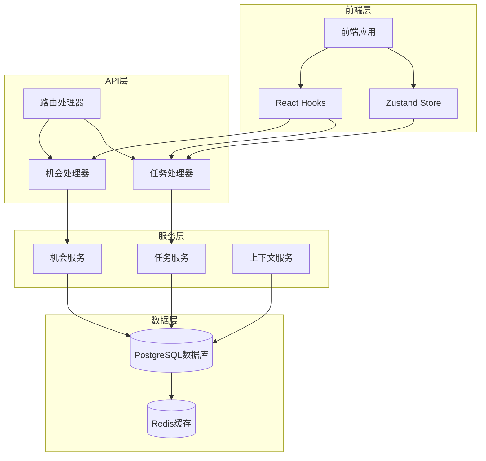

**图表来源**
- [backend/internal/router/routes.go](file://backend/internal/router/routes.go#L26-L98)
- [frontend/src/store/task.ts](file://frontend/src/store/task.ts#L16-L34)

## 任务管理API

### 创建任务

**端点**: `POST /api/v1/tasks`

创建新的任务，可以从邮件中提取行动项或手动创建。

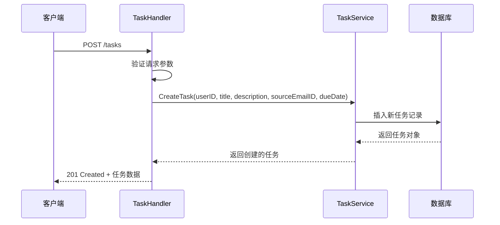

**图表来源**
- [backend/internal/handler/task.go](file://backend/internal/handler/task.go#L52-L67)
- [backend/internal/service/task.go](file://backend/internal/service/task.go#L22-L41)

**请求格式**:
```typescript
interface CreateTaskPayload {
    title: string;           // 必需 - 任务标题
    description?: string;    // 可选 - 任务描述
    source_email_id?: string; // 可选 - 来源邮件ID
    due_date?: string;       // 可选 - 截止日期 (ISO 8601格式)
}
```

**响应格式**:
```typescript
interface Task {
    id: string;              // 任务唯一标识符
    title: string;           // 任务标题
    description?: string;    // 任务描述
    status: 'todo' | 'in_progress' | 'done'; // 任务状态
    priority: 'high' | 'medium' | 'low';     // 任务优先级
    due_date?: string;       // 截止日期
    source_email_id?: string; // 来源邮件ID
    created_at: string;      // 创建时间
    updated_at: string;      // 更新时间
}
```

**节来源**
- [backend/internal/handler/task.go](file://backend/internal/handler/task.go#L22-L28)
- [backend/internal/model/task.go](file://backend/internal/model/task.go#L22-L44)

### 列出任务

**端点**: `GET /api/v1/tasks`

获取用户的所有任务，支持多种过滤和分页选项。

**查询参数**:
- `status`: 过滤特定状态的任务 (`todo`, `in_progress`, `done`)
- `priority`: 过滤特定优先级的任务 (`high`, `medium`, `low`)
- `limit`: 结果数量限制 (默认20)
- `offset`: 分页偏移量

**响应格式**:
```typescript
Task[]
```

**节来源**
- [backend/internal/handler/task.go](file://backend/internal/handler/task.go#L70-L106)

### 更新任务

**端点**: `PATCH /api/v1/tasks/:id`

更新任务的特定字段。

**请求格式**:
```typescript
interface UpdateTaskPayload {
    title?: string;          // 新标题
    description?: string;    // 新描述
    priority?: 'high' | 'medium' | 'low'; // 新优先级
    due_date?: string;       // 新截止日期
}
```

**节来源**
- [backend/internal/handler/task.go](file://backend/internal/handler/task.go#L149-L200)

### 更新任务状态

**端点**: `PATCH /api/v1/tasks/:id/status`

更新任务的状态（待办、进行中、已完成）。

**请求格式**:
```typescript
interface UpdateTaskStatusPayload {
    status: 'todo' | 'in_progress' | 'done';
}
```

**节来源**
- [backend/internal/handler/task.go](file://backend/internal/handler/task.go#L109-L147)

### 删除任务

**端点**: `DELETE /api/v1/tasks/:id`

删除指定的任务。

**节来源**
- [backend/internal/handler/task.go](file://backend/internal/handler/task.go#L203-L234)

## 机会管理API

### 创建机会

**端点**: `POST /api/v1/opportunities`

创建新的商业机会。

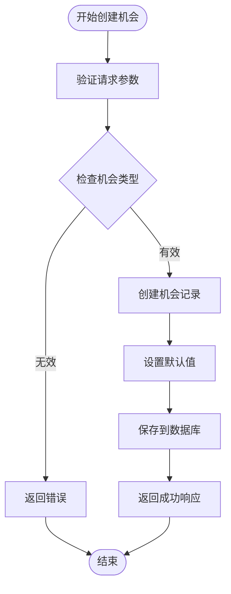

**图表来源**
- [backend/internal/handler/opportunity_handler.go](file://backend/internal/handler/opportunity_handler.go#L36-L75)

**请求格式**:
```typescript
interface CreateOpportunityRequest {
    title: string;                    // 必需 - 机会标题
    description?: string;             // 可选 - 机会描述
    company: string;                  // 必需 - 公司名称
    value?: string;                   // 可选 - 机会价值
    type?: 'buying' | 'partnership' | 'renewal' | 'strategic'; // 机会类型
    confidence?: number;              // 可选 - 置信度 (0-100)
    source_email_id?: string;         // 可选 - 来源邮件ID
}
```

**节来源**
- [backend/internal/handler/opportunity_handler.go](file://backend/internal/handler/opportunity_handler.go#L293-L302)

### 列出机会

**端点**: `GET /api/v1/opportunities`

获取用户的商业机会列表，支持过滤和分页。

**查询参数**:
- `status`: 过滤状态 (`new`, `active`, `won`, `lost`, `on_hold`)
- `type`: 过滤类型 (`buying`, `partnership`, `renewal`, `strategic`)
- `limit`: 结果数量限制 (默认20)
- `offset`: 分页偏移量

**节来源**
- [backend/internal/handler/opportunity_handler.go](file://backend/internal/handler/opportunity_handler.go#L78-L130)

### 获取单个机会

**端点**: `GET /api/v1/opportunities/:id`

获取特定的商业机会详情。

**节来源**
- [backend/internal/handler/opportunity_handler.go](file://backend/internal/handler/opportunity_handler.go#L133-L165)

### 更新机会

**端点**: `PATCH /api/v1/opportunities/:id`

更新商业机会的字段。

**请求格式**:
```typescript
interface UpdateOpportunityRequest {
    title?: string;
    description?: string;
    value?: string;
    status?: 'new' | 'active' | 'won' | 'lost' | 'on_hold';
    confidence?: number;
}
```

**节来源**
- [backend/internal/handler/opportunity_handler.go](file://backend/internal/handler/opportunity_handler.go#L168-L235)

### 删除机会

**端点**: `DELETE /api/v1/opportunities/:id`

删除指定的商业机会。

**节来源**
- [backend/internal/handler/opportunity_handler.go](file://backend/internal/handler/opportunity_handler.go#L238-L269)

## 数据模型详解

### 任务数据模型

任务模型包含了完整的任务信息和关联关系：

```mermaid
erDiagram
TASK {
uuid id PK
uuid user_id FK
uuid source_email_id FK
uuid context_id FK
string title
text description
varchar status
varchar priority
datetime due_date
boolean notify_we_chat
datetime created_at
datetime updated_at
deleted_at
}
EMAIL {
uuid id PK
uuid user_id FK
string subject
text body_text
string sender
datetime date
}
CONTEXT {
uuid id PK
uuid user_id FK
string name
string color
json keywords
json stakeholders
}
TASK ||--|| EMAIL : "source_email_id"
TASK ||--|| CONTEXT : "context_id"
```

**图表来源**
- [backend/internal/model/task.go](file://backend/internal/model/task.go#L22-L44)

**核心字段说明**:
- `id`: 任务唯一标识符 (UUID)
- `user_id`: 关联的用户ID
- `source_email_id`: 来源邮件ID (可选)
- `context_id`: 关联的上下文ID (可选)
- `title`: 任务标题
- `description`: 任务描述
- `status`: 任务状态 (todo/in_progress/done)
- `priority`: 任务优先级 (high/medium/low)
- `due_date`: 截止日期
- `notify_we_chat`: 微信通知标志

**节来源**
- [backend/internal/model/task.go](file://backend/internal/model/task.go#L22-L44)

### 机会数据模型

机会模型设计用于商业销售场景：

```mermaid
erDiagram
OPPORTUNITY {
string id PK
string title
text description
string company
string value
opportunity_type type
opportunity_status status
int confidence
string user_id FK
string team_id FK
string org_id FK
uuid source_email_id FK
datetime created_at
datetime updated_at
deleted_at
}
CONTACT {
string id PK
string name
string email
string phone
}
ACTIVITY {
string id PK
string opportunity_id FK
string user_id FK
string type
string title
text description
datetime created_at
datetime updated_at
}
OPPORTUNITY ||--o{ ACTIVITY : "has_activities"
OPPORTUNITY ||--o{ OPPORTUNITY_CONTACT : "has_contacts"
OPPORTUNITY_CONTACT }o--|| CONTACT : "contact"
```

**图表来源**
- [backend/internal/model/opportunity.go](file://backend/internal/model/opportunity.go#L30-L88)

**核心字段说明**:
- `id`: 机会唯一标识符 (UUID)
- `title`: 机会标题
- `description`: 机会描述
- `company`: 目标公司
- `value`: 机会价值
- `type`: 机会类型 (buying/partnership/renewal/strategic)
- `status`: 机会状态 (new/active/won/lost/on_hold)
- `confidence`: 置信度 (0-100)
- `user_id/team_id/org_id`: 用户/团队/组织关联
- `source_email_id`: 来源邮件ID

**节来源**
- [backend/internal/model/opportunity.go](file://backend/internal/model/opportunity.go#L30-L88)

## 状态机与业务逻辑

### 任务状态机

任务状态遵循严格的转换规则：

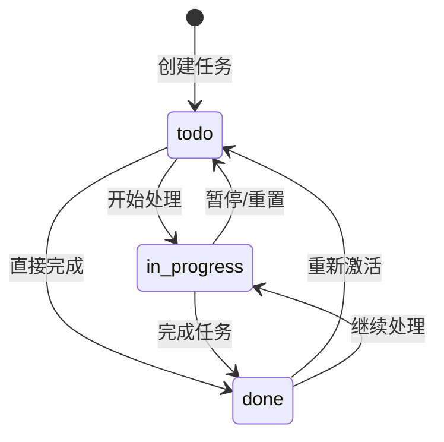

**状态转换规则**:
- `todo` → `in_progress`: 用户开始处理任务
- `todo` → `done`: 用户标记任务为已完成
- `in_progress` → `todo`: 用户暂停任务或重置状态
- `in_progress` → `done`: 用户完成任务
- `done` → `todo`: 用户重新激活已完成的任务
- `done` → `in_progress`: 用户继续处理已完成的任务

**节来源**
- [backend/internal/model/task.go](file://backend/internal/model/task.go#L12-L20)
- [backend/internal/service/task.go](file://backend/internal/service/task.go#L83-L96)

### 机会状态机

机会状态反映了销售流程的不同阶段：

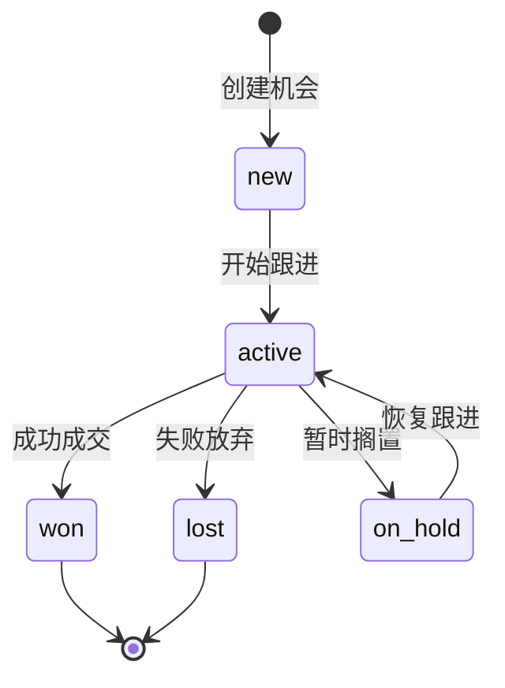

**状态含义**:
- `new`: 新建机会，尚未开始跟进
- `active`: 正在积极跟进
- `won`: 已成功成交
- `lost`: 已失败放弃
- `on_hold`: 暂时搁置，等待时机

**节来源**
- [backend/internal/model/opportunity.go](file://backend/internal/model/opportunity.go#L20-L28)

## 前端集成示例

### 使用Zustand管理任务状态

前端使用Zustand作为状态管理工具，提供响应式的任务状态管理：

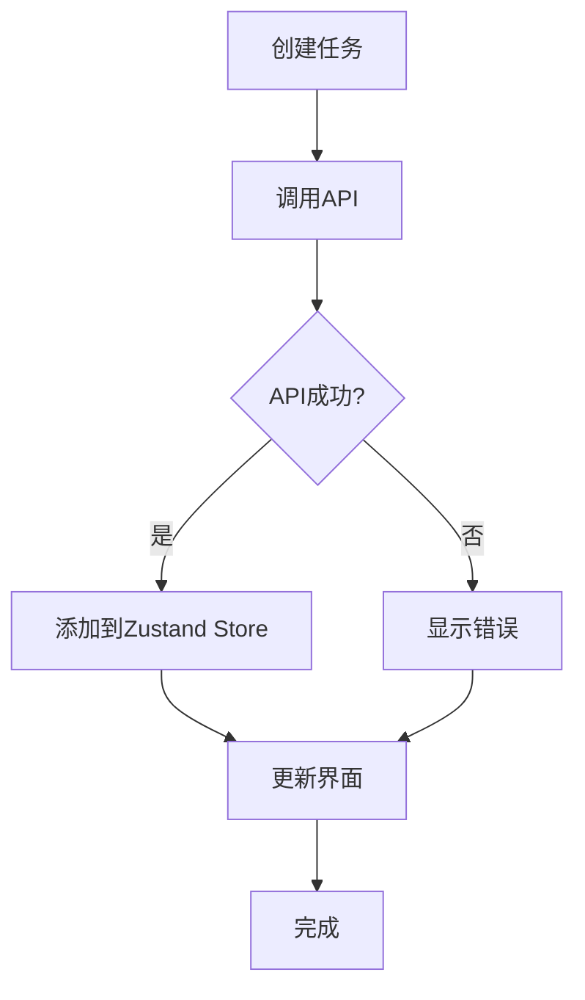

**图表来源**
- [frontend/src/store/task.ts](file://frontend/src/store/task.ts#L16-L34)

**Store定义**:
```typescript
interface TaskState {
  tasks: Task[];
  isLoading: boolean;
  error: string | null;
  setTasks: (tasks: Task[]) => void;
  addTask: (task: Task) => void;
  updateTask: (updatedTask: Task) => void;
  removeTask: (taskId: string) => void;
  setLoading: (loading: boolean) => void;
  setError: (error: string | null) => void;
}
```

**节来源**
- [frontend/src/store/task.ts](file://frontend/src/store/task.ts#L4-L34)

### React Hook集成

使用React Query进行API调用和状态管理：

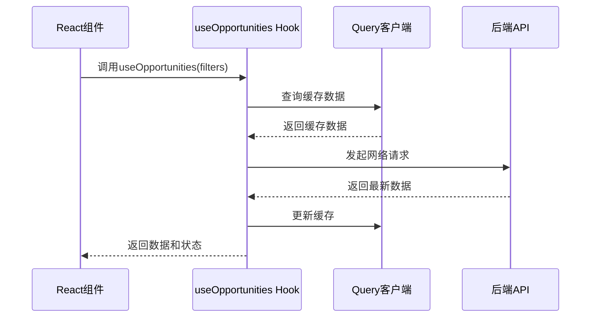

**图表来源**
- [frontend/src/hooks/useOpportunities.ts](file://frontend/src/hooks/useOpportunities.ts#L1-L92)

**机会管理Hook**:
```typescript
export const useOpportunities = (filters?: {
  status?: string;
  type?: string;
  limit?: number;
  offset?: number;
}) => {
  return useQuery({
    queryKey: ['opportunities', filters],
    queryFn: async (): Promise<Opportunity[]> => {
      const params = new URLSearchParams();
      if (filters?.status) params.append('status', filters.status);
      if (filters?.type) params.append('type', filters.type);
      const { data } = await api.get(`/opportunities?${params}`);
      return data;
    },
    staleTime: 5 * 60 * 1000, // 5分钟
    refetchInterval: 2 * 60 * 1000, // 2分钟
  });
};
```

**节来源**
- [frontend/src/hooks/useOpportunities.ts](file://frontend/src/hooks/useOpportunities.ts#L1-L92)

### 邮件中的智能操作

系统支持从邮件中直接创建任务：

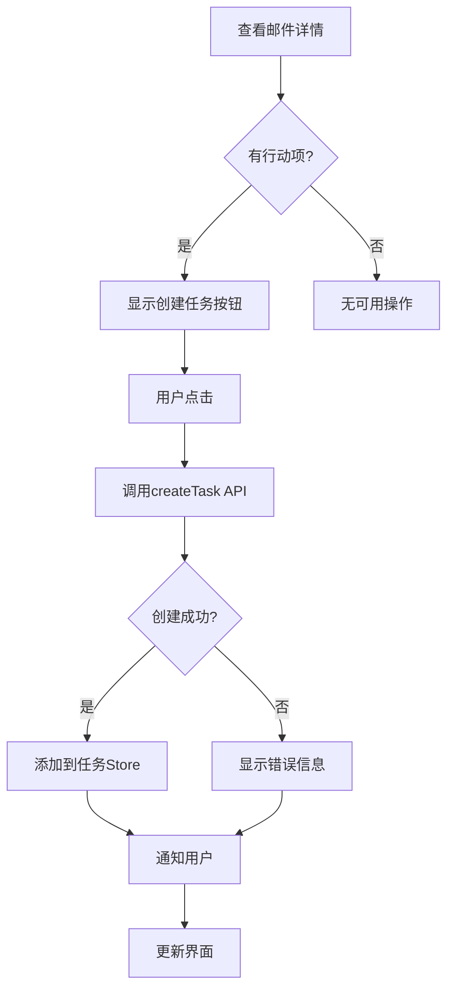

**图表来源**
- [frontend/src/app/dashboard/email/[id]/page.tsx](file://frontend/src/app/dashboard/email/[id]/page.tsx#L72-L86)

**智能操作处理**:
```typescript
const handleSmartAction = async (action: SmartAction) => {
  if (action.type === 'create_task') {
    try {
      const newTask = await createTask({
        title: action.data.title || t('emailDetail.createTaskDefault'),
        description: `From email: ${email?.Subject || ''}`,
        source_email_id: email?.ID,
        due_date: action.data.deadline,
      });
      addTask(newTask);
      alert(t('emailDetail.taskCreatedSuccess'));
    } catch (err: unknown) {
      console.error("Failed to create task:", err);
      alert(t('emailDetail.taskCreatedError'));
    }
  }
};
```

**节来源**
- [frontend/src/app/dashboard/email/[id]/page.tsx](file://frontend/src/app/dashboard/email/[id]/page.tsx#L72-L86)

## 邮件上下文关联

### 自动任务创建机制

系统通过AI分析邮件内容，自动提取行动项并创建相应任务：

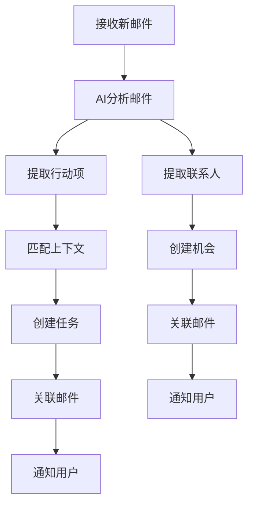

**图表来源**
- [frontend/src/app/dashboard/email/[id]/page.tsx](file://frontend/src/app/dashboard/email/[id]/page.tsx#L1-L167)

### 上下文匹配算法

系统使用关键词和发件人匹配算法来识别邮件所属的上下文：

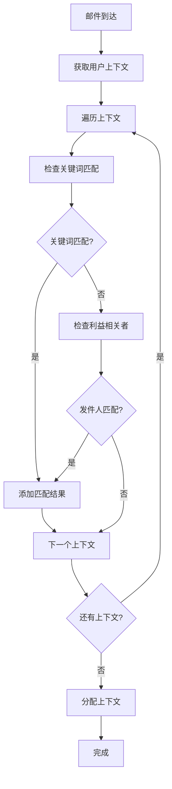

**图表来源**
- [backend/internal/service/context.go](file://backend/internal/service/context.go#L107-L168)

**匹配逻辑**:
- **关键词匹配**: 检查邮件主题和摘要是否包含上下文关键词
- **发件人匹配**: 检查邮件发件人是否在上下文的利益相关者列表中
- **多维度匹配**: 支持同时基于关键词和发件人的双重匹配

**节来源**
- [backend/internal/service/context.go](file://backend/internal/service/context.go#L107-L168)

### 机会与邮件关联

商业机会可以直接关联到邮件，形成完整的业务线索跟踪：

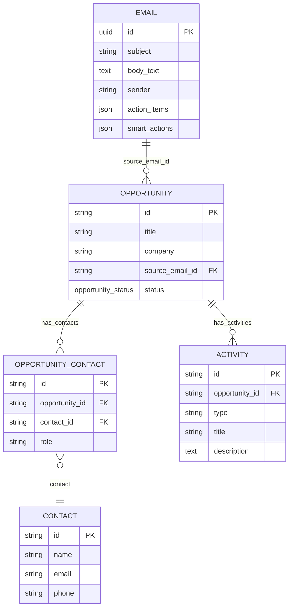

**图表来源**
- [backend/internal/model/opportunity.go](file://backend/internal/model/opportunity.go#L48-L88)

## 最佳实践与性能考虑

### API调用优化

1. **批量操作**: 对于大量任务或机会的操作，建议使用批量API
2. **分页策略**: 默认每页20条，合理设置limit和offset参数
3. **缓存策略**: 使用React Query的缓存机制减少重复请求
4. **错误处理**: 实现完善的错误边界和重试机制

### 状态管理最佳实践

1. **单一数据源**: 使用Zustand作为任务状态的单一数据源
2. **状态同步**: API调用成功后及时更新本地状态
3. **乐观更新**: 在网络请求前先更新UI状态，提升用户体验
4. **状态清理**: 删除操作后及时清理相关状态

### 性能监控

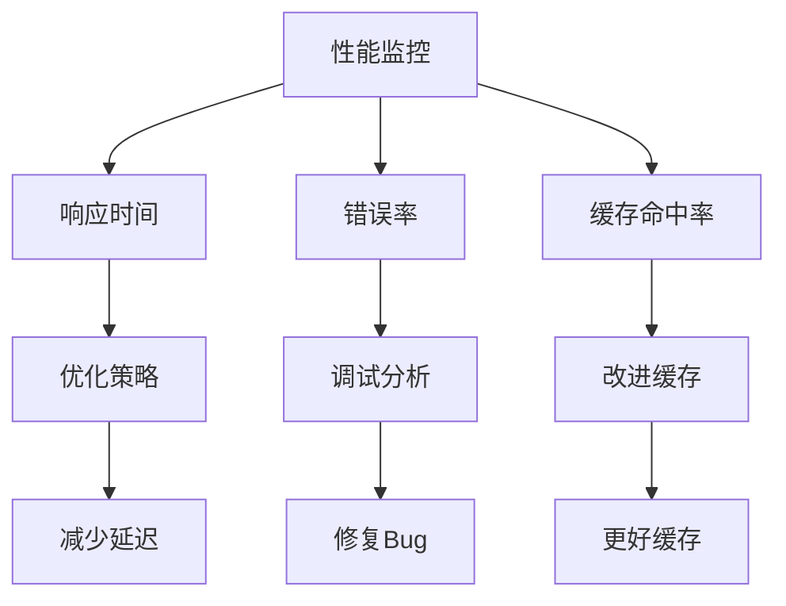

## 故障排除指南

### 常见问题及解决方案

**任务创建失败**
- 检查必填字段是否完整
- 验证用户权限和认证状态
- 确认数据库连接正常

**机会状态更新异常**
- 验证状态转换是否符合业务规则
- 检查权限验证逻辑
- 确认数据一致性

**邮件关联问题**
- 检查邮件ID的有效性
- 验证上下文匹配逻辑
- 确认关联关系的完整性

### 调试技巧

1. **日志记录**: 后端启用详细的API调用日志
2. **断点调试**: 前端使用浏览器开发者工具
3. **网络监控**: 使用浏览器网络面板检查API请求
4. **状态检查**: 使用Redux DevTools检查状态变化

**节来源**
- [backend/internal/handler/task.go](file://backend/internal/handler/task.go#L55-L67)
- [backend/internal/service/task.go](file://backend/internal/service/task.go#L22-L41)

## 总结

EchoMind的任务与机会管理系统提供了完整的业务自动化解决方案。通过智能的邮件分析、灵活的任务管理、专业的销售机会跟踪，帮助企业提高工作效率和销售转化率。系统的模块化设计确保了良好的可扩展性和维护性，而完善的API文档和前端集成示例则降低了开发门槛。