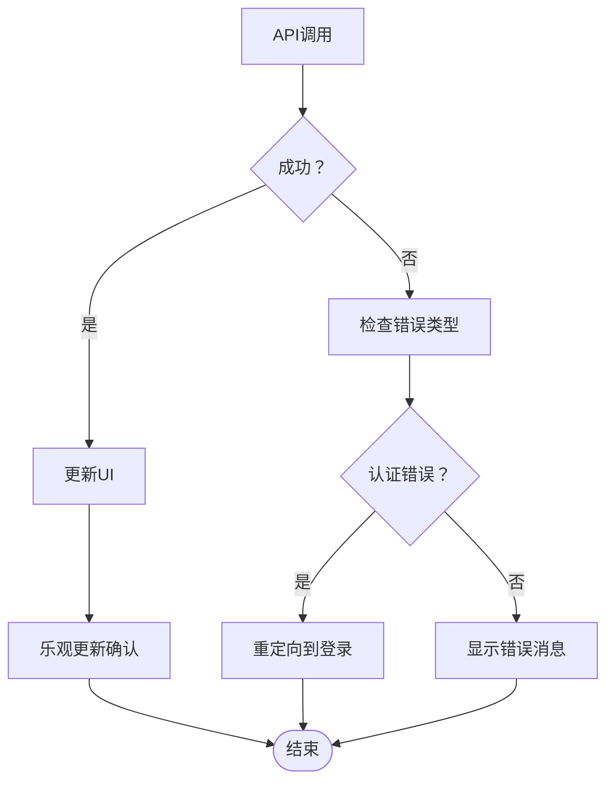

# 任务管理API详细文档

<cite>
**本文档中引用的文件**
- [task.go](file://backend/internal/model/task.go)
- [task.go](file://backend/internal/handler/task.go)
- [task.go](file://backend/internal/service/task.go)
- [tasks.ts](file://frontend/src/lib/api/tasks.ts)
- [task.ts](file://frontend/src/store/task.ts)
- [routes.go](file://backend/internal/router/routes.go)
- [page.tsx](file://frontend/src/app/dashboard/email/[id]/page.tsx)
- [TaskWidget.tsx](file://frontend/src/components/widgets/TaskWidget.tsx)
- [README.md](file://README.md)
</cite>

## 目录
1. [简介](#简介)
2. [项目架构概览](#项目架构概览)
3. [任务数据模型](#任务数据模型)
4. [API端点详解](#api端点详解)
5. [任务状态机](#任务状态机)
6. [前端集成](#前端集成)
7. [邮件上下文关联](#邮件上下文关联)
8. [错误处理](#错误处理)
9. [最佳实践](#最佳实践)
10. [故障排除指南](#故障排除指南)

## 简介

EchoMind的任务管理系统是一个智能的个人生产力工具，旨在帮助用户从电子邮件和其他上下文中提取行动项并创建任务。该系统提供了完整的RESTful API接口，支持任务的创建、查询、更新和删除操作，同时具备智能的状态管理和上下文关联功能。

### 核心特性

- **智能任务创建**：从电子邮件中自动提取行动项并创建任务
- **灵活的任务状态管理**：支持待办、进行中、已完成三种状态
- **优先级管理**：高、中、低三个优先级级别
- **截止日期跟踪**：支持设置任务截止日期
- **上下文关联**：任务与原始邮件和项目上下文的关联
- **实时状态同步**：前端通过Zustand store实现实时状态管理

## 项目架构概览

任务管理系统采用分层架构设计，确保了良好的可维护性和扩展性：


**图表来源**
- [routes.go](file://backend/internal/router/routes.go#L27-L98)
- [task.go](file://backend/internal/handler/task.go#L14-L20)
- [task.go](file://backend/internal/service/task.go#L14-L20)

**章节来源**
- [routes.go](file://backend/internal/router/routes.go#L1-L99)
- [README.md](file://README.md#L1-L175)

## 任务数据模型

任务数据模型定义了任务的核心属性和约束条件，支持完整的任务生命周期管理。

### 数据模型结构


**图表来源**
- [task.go](file://backend/internal/model/task.go#L22-L44)

### 字段详细说明

| 字段名 | 类型 | 必填 | 默认值 | 描述 |
|--------|------|------|--------|------|
| ID | UUID | 是 | 自动生成 | 任务唯一标识符 |
| UserID | UUID | 是 | - | 关联的用户ID |
| Title | string | 是 | - | 任务标题，必填 |
| Description | string | 否 | - | 任务描述，支持富文本 |
| Status | TaskStatus | 否 | "todo" | 任务状态，默认为待办 |
| Priority | TaskPriority | 否 | "medium" | 任务优先级，默认为中等 |
| DueDate | Time | 否 | - | 截止日期，可为空 |
| SourceEmailID | UUID | 否 | - | 来源邮件ID，用于上下文关联 |
| ContextID | UUID | 否 | - | 项目上下文ID |
| CreatedAt | Time | 是 | 自动设置 | 创建时间 |
| UpdatedAt | Time | 是 | 自动更新 | 更新时间 |

**章节来源**
- [task.go](file://backend/internal/model/task.go#L1-L45)

## API端点详解

### POST /api/v1/tasks - 创建任务

创建新的任务，支持从邮件或其他上下文中创建任务。

#### 请求格式

```json
{
  "title": "完成项目报告",
  "description": "准备季度业务报告，包含财务数据和市场分析",
  "source_email_id": "123e4567-e89b-12d3-a456-426614174000",
  "due_date": "2024-12-15T17:00:00Z"
}
```

#### 响应格式

成功响应（201 Created）：
```json
{
  "id": "123e4567-e89b-12d3-a456-426614174000",
  "title": "完成项目报告",
  "description": "准备季度业务报告，包含财务数据和市场分析",
  "status": "todo",
  "priority": "medium",
  "due_date": "2024-12-15T17:00:00Z",
  "source_email_id": "123e4567-e89b-12d3-a456-426614174000",
  "created_at": "2024-12-01T10:00:00Z",
  "updated_at": "2024-12-01T10:00:00Z"
}
```

#### 错误响应

- 400 Bad Request：请求参数无效
- 401 Unauthorized：未认证用户
- 500 Internal Server Error：服务器内部错误

### GET /api/v1/tasks - 列出任务

获取用户的任务列表，支持多种过滤和排序选项。

#### 查询参数

| 参数名 | 类型 | 描述 |
|--------|------|------|
| status | string | 按状态过滤：todo, in_progress, done |
| priority | string | 按优先级过滤：high, medium, low |
| limit | int | 结果数量限制，默认20 |
| offset | int | 分页偏移量，默认0 |

#### 示例请求

```bash
GET /api/v1/tasks?status=todo&priority=high&limit=10&offset=0
```

#### 响应格式

```json
[
  {
    "id": "123e4567-e89b-12d3-a456-426614174000",
    "title": "完成项目报告",
    "description": "准备季度业务报告",
    "status": "todo",
    "priority": "high",
    "due_date": "2024-12-15T17:00:00Z",
    "created_at": "2024-12-01T10:00:00Z",
    "updated_at": "2024-12-01T10:00:00Z"
  }
]
```

### PATCH /api/v1/tasks/:id - 更新任务

更新任务的特定字段，支持部分更新。

#### 请求格式

```json
{
  "title": "完成项目报告（修订版）",
  "description": "准备季度业务报告，重点分析市场趋势",
  "priority": "high",
  "due_date": "2024-12-16T17:00:00Z"
}
```

#### 响应格式

- 200 OK：任务更新成功
- 400 Bad Request：请求参数无效
- 404 Not Found：任务不存在或无权限访问
- 500 Internal Server Error：服务器内部错误

### PATCH /api/v1/tasks/:id/status - 更新任务状态

更新任务的状态，支持状态机转换。

#### 请求格式

```json
{
  "status": "done"
}
```

#### 状态转换规则

- 从 `todo` 可以转换为 `in_progress` 或 `done`
- 从 `in_progress` 可以转换为 `done`
- 从 `done` 可以转换回 `todo`

#### 响应格式

- 200 OK：状态更新成功
- 400 Bad Request：无效的状态值
- 404 Not Found：任务不存在或无权限访问
- 500 Internal Server Error：服务器内部错误

### DELETE /api/v1/tasks/:id - 删除任务

删除指定的任务。

#### 响应格式

- 204 No Content：任务删除成功
- 404 Not Found：任务不存在或无权限访问
- 500 Internal Server Error：服务器内部错误

**章节来源**
- [task.go](file://backend/internal/handler/task.go#L41-L235)
- [routes.go](file://backend/internal/router/routes.go#L72-L77)

## 任务状态机

任务状态机定义了任务在不同状态之间的合法转换路径，确保任务管理的逻辑一致性。

### 状态定义


**图表来源**
- [task.go](file://backend/internal/model/task.go#L13-L15)

### 状态转换验证

后端服务实现了严格的状态转换验证机制：


**图表来源**
- [task.go](file://backend/internal/service/task.go#L72-L96)

### 业务逻辑规则

1. **状态转换合法性检查**：只有符合状态机规则的转换才被允许
2. **权限验证**：确保用户只能操作自己拥有的任务
3. **原子性保证**：状态更新操作具有事务性，确保数据一致性

**章节来源**
- [task.go](file://backend/internal/service/task.go#L72-L96)

## 前端集成

前端使用Zustand状态管理库来维护任务的本地状态，确保UI与API的实时同步。

### Zustand Store 架构


**图表来源**
- [task.ts](file://frontend/src/store/task.ts#L4-L34)

### API 集成模式

前端通过标准化的API客户端与后端通信：


**图表来源**
- [tasks.ts](file://frontend/src/lib/api/tasks.ts#L33-L57)
- [task.ts](file://frontend/src/store/task.ts#L16-L34)

### 实时状态同步

前端实现了乐观更新和错误回滚机制：

1. **乐观更新**：UI立即反映API调用结果
2. **错误处理**：API失败时自动回滚到原始状态
3. **状态一致性**：确保本地状态与服务器状态保持一致

**章节来源**
- [tasks.ts](file://frontend/src/lib/api/tasks.ts#L1-L58)
- [task.ts](file://frontend/src/store/task.ts#L1-L35)

## 邮件上下文关联

任务系统与邮件上下文深度集成，支持从电子邮件中自动提取行动项并创建相关任务。

### 邮件处理流程


**图表来源**
- [page.tsx](file://frontend/src/app/dashboard/email/[id]/page.tsx#L72-L86)

### 智能动作集成

系统能够识别邮件中的智能动作并提供一键创建任务的功能：

```typescript
// 智能动作处理示例
const handleSmartAction = async (action: SmartAction) => {
  if (action.type === 'create_task') {
    const newTask = await createTask({
      title: action.data.title || "默认任务标题",
      description: `来自邮件：${email?.Subject}`,
      source_email_id: email?.ID,
      due_date: action.data.deadline,
    });
    addTask(newTask); // 添加到Zustand store
  }
};
```

### 上下文关联机制

1. **邮件ID关联**：任务通过SourceEmailID字段与原始邮件建立关联
2. **智能标签**：根据邮件内容自动生成任务标签
3. **优先级推断**：基于邮件紧急程度自动设置任务优先级
4. **截止日期提取**：从邮件内容中提取截止日期信息

**章节来源**
- [page.tsx](file://frontend/src/app/dashboard/email/[id]/page.tsx#L1-L167)

## 错误处理

系统实现了全面的错误处理机制，确保用户体验的连续性和数据的完整性。

### 错误分类

| 错误类型 | HTTP状态码 | 描述 | 处理方式 |
|----------|------------|------|----------|
| 认证错误 | 401 | 用户未认证 | 引导用户重新登录 |
| 权限错误 | 403 | 无访问权限 | 显示权限不足提示 |
| 资源不存在 | 404 | 任务不存在 | 显示资源不存在消息 |
| 参数错误 | 400 | 请求参数无效 | 显示具体参数错误 |
| 服务器错误 | 500 | 内部服务器错误 | 显示通用错误消息 |

### 前端错误处理策略



**图表来源**
- [task.go](file://backend/internal/handler/task.go#L137-L143)

### 错误恢复机制

1. **自动重试**：对于临时性错误，系统会自动重试
2. **用户反馈**：提供清晰的错误信息和解决建议
3. **状态回滚**：API调用失败时自动回滚到之前状态
4. **日志记录**：详细的错误日志便于问题诊断

**章节来源**
- [task.go](file://backend/internal/handler/task.go#L55-L67)
- [task.go](file://backend/internal/handler/task.go#L137-L143)

## 最佳实践

### API 使用建议

1. **批量操作**：对于大量任务操作，考虑使用批量API
2. **缓存策略**：合理使用前端缓存减少不必要的API调用
3. **错误边界**：在组件层面实现错误边界处理
4. **加载状态**：始终显示适当的加载状态

### 性能优化

1. **分页查询**：对于大量任务，使用分页查询避免性能问题
2. **条件过滤**：合理使用查询参数减少数据传输
3. **状态管理**：使用局部状态管理减少全局状态复杂度
4. **网络优化**：实现请求去重和智能缓存

### 安全考虑

1. **输入验证**：严格验证所有用户输入
2. **权限控制**：确保用户只能访问自己的任务
3. **数据加密**：敏感数据在传输和存储时进行加密
4. **审计日志**：记录重要的操作以便审计

## 故障排除指南

### 常见问题及解决方案

#### 任务创建失败

**症状**：创建任务时返回400错误
**可能原因**：
- 必填字段缺失
- 标题过长
- 无效的日期格式

**解决方案**：
1. 检查请求体中的必填字段
2. 验证日期格式是否符合RFC3339标准
3. 确保标题长度不超过数据库限制

#### 任务状态更新异常

**症状**：状态更新返回400错误
**可能原因**：
- 无效的状态值
- 状态转换不合法
- 权限不足

**解决方案**：
1. 确认状态值为有效的枚举值
2. 检查当前状态是否允许转换
3. 验证用户权限

#### 前端状态不同步

**症状**：UI显示的任务状态与实际不符
**可能原因**：
- API调用失败但UI未正确回滚
- 并发更新冲突
- 网络延迟导致状态不一致

**解决方案**：
1. 实现乐观更新的错误回滚机制
2. 使用版本号或时间戳检测并发冲突
3. 实现状态同步机制

### 调试技巧

1. **浏览器开发者工具**：检查网络请求和响应
2. **API文档**：参考完整的API规范
3. **日志分析**：查看后端日志定位问题
4. **单元测试**：编写测试用例验证功能

**章节来源**
- [task.go](file://backend/internal/handler/task.go#L55-L67)
- [task.go](file://backend/internal/service/task.go#L22-L41)