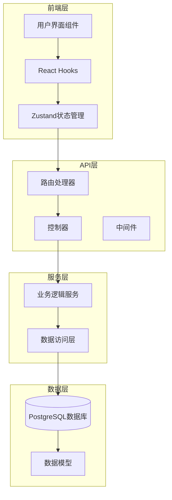
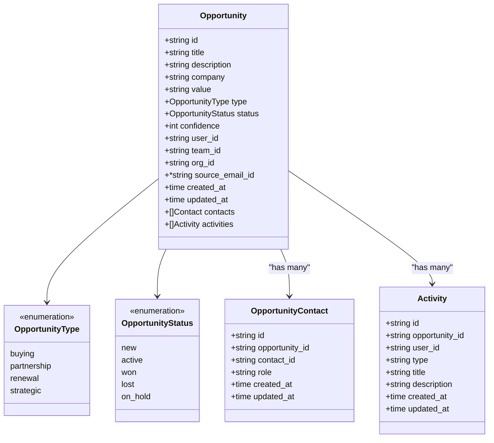
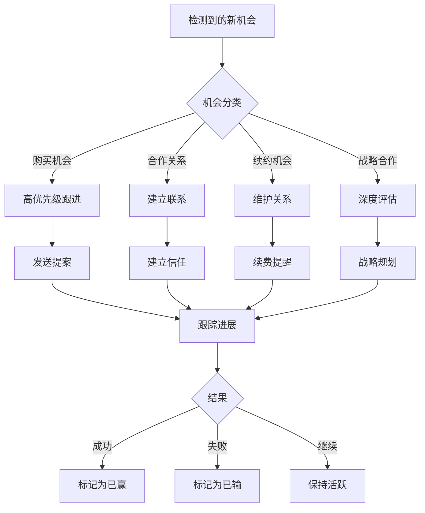

# 机会管理API

<cite>
**本文档中引用的文件**
- [opportunity.go](file://backend/internal/model/opportunity.go)
- [opportunity_handler.go](file://backend/internal/handler/opportunity_handler.go)
- [opportunity.go](file://backend/internal/service/opportunity.go)
- [routes.go](file://backend/internal/router/routes.go)
- [opportunity.ts](file://frontend/src/types/opportunity.ts)
- [useOpportunities.ts](file://frontend/src/hooks/useOpportunities.ts)
- [opportunityStore.ts](file://frontend/src/store/opportunityStore.ts)
- [DealmakerView.tsx](file://frontend/src/components/dashboard/DealmakerView.tsx)
- [ManagerView.tsx](file://frontend/src/components/dashboard/ManagerView.tsx)
- [api.ts](file://frontend/src/lib/api.ts)
</cite>

## 目录
1. [简介](#简介)
2. [项目架构概述](#项目架构概述)
3. [数据模型](#数据模型)
4. [API端点详解](#api端点详解)
5. [前端集成指南](#前端集成指南)
6. [销售漏斗与业务机会概览](#销售漏斗与业务机会概览)
7. [错误处理与最佳实践](#错误处理与最佳实践)
8. [总结](#总结)

## 简介

EchoMind是一个基于AI的企业沟通平台，提供了完整的机会管理功能来支持销售团队的业务发展。该系统通过RESTful API接口实现了机会的全生命周期管理，包括创建、查询、更新和删除操作，并集成了智能销售漏斗分析功能。

机会管理系统的核心价值在于：
- **自动化机会识别**：从邮件内容中自动提取潜在商业机会
- **多维度销售漏斗**：提供不同角色视角的业务洞察
- **实时数据分析**：支持实时的销售绩效监控
- **智能预测**：基于置信度和历史数据进行销售预测

## 项目架构概述

系统采用前后端分离架构，后端基于Go语言和Gin框架构建，前端使用React和TypeScript技术栈。



**图表来源**
- [routes.go](file://backend/internal/router/routes.go#L27-L98)
- [opportunity_handler.go](file://backend/internal/handler/opportunity_handler.go#L13-L21)
- [opportunityStore.ts](file://frontend/src/store/opportunityStore.ts#L58-L220)

**章节来源**
- [routes.go](file://backend/internal/router/routes.go#L1-L99)
- [opportunity_handler.go](file://backend/internal/handler/opportunity_handler.go#L1-L312)

## 数据模型

### 核心机会实体

机会（Opportunity）是系统中的核心业务实体，包含了完整的商业机会信息。



**图表来源**
- [opportunity.go](file://backend/internal/model/opportunity.go#L30-L89)

### 字段详细说明

| 字段名 | 类型 | 必填 | 默认值 | 描述 |
|--------|------|------|--------|------|
| id | UUID | 是 | 自动生成 | 机会唯一标识符 |
| title | String | 是 | - | 机会标题，最大500字符 |
| description | Text | 否 | - | 机会详细描述 |
| company | String | 是 | - | 公司名称，最大200字符 |
| value | String | 否 | - | 机会价值，格式化字符串 |
| type | OpportunityType | 否 | "buying" | 机会类型 |
| status | OpportunityStatus | 否 | "new" | 机会状态 |
| confidence | Integer | 否 | 0 | 置信度百分比（0-100） |
| user_id | UUID | 是 | - | 创建者用户ID |
| team_id | UUID | 否 | - | 所属团队ID |
| org_id | UUID | 否 | - | 所属组织ID |
| source_email_id | UUID | 否 | - | 来源邮件ID |

### 机会类型枚举

| 类型 | 值 | 业务含义 |
|------|-----|----------|
| 购买 | `buying` | 客户购买产品或服务 |
| 合作 | `partnership` | 建立合作伙伴关系 |
| 续约 | `renewal` | 现有合同续期 |
| 战略 | `strategic` | 战略性合作机会 |

### 机会状态枚举

| 状态 | 值 | 业务含义 |
|------|-----|----------|
| 新建 | `new` | 刚创建的机会 |
| 活跃 | `active` | 正在跟进中的机会 |
| 已赢 | `won` | 成功达成的交易 |
| 已输 | `lost` | 失败的交易 |
| 暂停 | `on_hold` | 暂时搁置的机会 |

**章节来源**
- [opportunity.go](file://backend/internal/model/opportunity.go#L1-L89)

## API端点详解

### 1. 创建机会 - POST /api/v1/opportunities

创建新的业务机会。

#### 请求参数

```typescript
interface CreateOpportunityRequest {
  title: string;           // 必填，机会标题
  description?: string;    // 可选，详细描述
  company: string;         // 必填，公司名称
  value?: string;          // 可选，价值描述
  type?: 'buying' | 'partnership' | 'renewal' | 'strategic';  // 可选，机会类型
  confidence?: number;     // 可选，置信度（0-100）
  source_email_id?: string;  // 可选，来源邮件ID
}
```

#### 响应示例

成功响应（201 Created）：
```json
{
  "id": "123e4567-e89b-12d3-a456-426614174000",
  "title": "企业级AI解决方案采购",
  "description": "某大型制造企业寻求AI解决方案提升生产效率",
  "company": "智能制造有限公司",
  "value": "$500,000+",
  "type": "buying",
  "status": "new",
  "confidence": 85,
  "user_id": "789e0123-e456-7890-abcd-ef1234567890",
  "team_id": "abc12345-6789-0123-4567-89abcdef1234",
  "org_id": "def56789-0123-4567-89ab-cdef12345678",
  "source_email_id": "xyz98765-4321-fedc-ba98-7654321fedcba",
  "created_at": "2024-01-15T10:30:00Z",
  "updated_at": "2024-01-15T10:30:00Z"
}
```

#### 错误响应

| 状态码 | 错误信息 | 描述 |
|--------|----------|------|
| 400 | "Invalid opportunity type" | 提供了无效的机会类型 |
| 400 | "Invalid opportunity status" | 提供了无效的机会状态 |
| 401 | "Unauthorized" | 用户未认证 |
| 500 | "Failed to create opportunity" | 服务器内部错误 |

**章节来源**
- [opportunity_handler.go](file://backend/internal/handler/opportunity_handler.go#L23-L76)

### 2. 获取机会列表 - GET /api/v1/opportunities

获取当前用户的业务机会列表，支持多种过滤和分页参数。

#### 查询参数

| 参数名 | 类型 | 默认值 | 描述 |
|--------|------|--------|------|
| status | string | - | 按状态过滤：new, active, won, lost, on_hold |
| type | string | - | 按类型过滤：buying, partnership, renewal, strategic |
| limit | integer | 20 | 最大返回数量 |
| offset | integer | 0 | 跳过的记录数 |

#### 响应示例

```json
[
  {
    "id": "123e4567-e89b-12d3-a456-426614174000",
    "title": "企业级AI解决方案采购",
    "company": "智能制造有限公司",
    "value": "$500,000+",
    "type": "buying",
    "status": "active",
    "confidence": 85,
    "created_at": "2024-01-15T10:30:00Z"
  },
  {
    "id": "567890ab-cdef-1234-5678-9abcdef12345",
    "title": "年度合作伙伴协议",
    "company": "科技发展集团",
    "value": "$200,000",
    "type": "partnership",
    "status": "new",
    "confidence": 70,
    "created_at": "2024-01-14T15:20:00Z"
  }
]
```

#### 使用示例

```javascript
// 获取所有活跃机会
const activeOpportunities = await api.get('/opportunities?status=active');

// 获取前10个购买类型机会
const buyingOpportunities = await api.get('/opportunities?type=buying&limit=10');

// 分页获取机会
const page1 = await api.get('/opportunities?limit=20&offset=0');
const page2 = await api.get('/opportunities?limit=20&offset=20');
```

**章节来源**
- [opportunity_handler.go](file://backend/internal/handler/opportunity_handler.go#L78-L131)
- [useOpportunities.ts](file://frontend/src/hooks/useOpportunities.ts#L5-L42)

### 3. 获取单个机会 - GET /api/v1/opportunities/:id

根据ID获取特定的业务机会详情。

#### 路径参数

| 参数名 | 类型 | 必填 | 描述 |
|--------|------|------|------|
| id | string | 是 | 机会的UUID标识符 |

#### 响应示例

```json
{
  "id": "123e4567-e89b-12d3-a456-426614174000",
  "title": "企业级AI解决方案采购",
  "description": "某大型制造企业寻求AI解决方案提升生产效率",
  "company": "智能制造有限公司",
  "value": "$500,000+",
  "type": "buying",
  "status": "active",
  "confidence": 85,
  "user_id": "789e0123-e456-7890-abcd-ef1234567890",
  "team_id": "abc12345-6789-0123-4567-89abcdef1234",
  "org_id": "def56789-0123-4567-89ab-cdef12345678",
  "source_email_id": "xyz98765-4321-fedc-ba98-7654321fedcba",
  "created_at": "2024-01-15T10:30:00Z",
  "updated_at": "2024-01-15T14:45:00Z",
  "contacts": [
    {
      "id": "contact-001",
      "name": "张三",
      "email": "zhangsan@smarttech.com",
      "role": "决策者"
    }
  ],
  "activities": [
    {
      "id": "activity-001",
      "type": "email",
      "title": "发送提案",
      "description": "向客户发送AI解决方案提案",
      "created_at": "2024-01-15T11:00:00Z"
    }
  ]
}
```

#### 错误响应

| 状态码 | 错误信息 | 描述 |
|--------|----------|------|
| 400 | "Opportunity ID is required" | 缺少机会ID参数 |
| 404 | "Opportunity not found" | 未找到指定机会 |
| 401 | "Unauthorized" | 用户未认证 |
| 500 | "Failed to get opportunity" | 服务器内部错误 |

**章节来源**
- [opportunity_handler.go](file://backend/internal/handler/opportunity_handler.go#L133-L166)

### 4. 更新机会 - PATCH /api/v1/opportunities/:id

更新现有业务机会的部分或全部字段。

#### 请求参数

```typescript
interface UpdateOpportunityRequest {
  title?: string;          // 可选，机会标题
  description?: string;    // 可选，详细描述
  value?: string;          // 可选，价值描述
  status?: 'new' | 'active' | 'won' | 'lost' | 'on_hold';  // 可选，机会状态
  confidence?: number;     // 可选，置信度（0-100）
}
```

#### 响应示例

```json
{
  "id": "123e4567-e89b-12d3-a456-426614174000",
  "title": "企业级AI解决方案采购",
  "description": "某大型制造企业寻求AI解决方案提升生产效率",
  "company": "智能制造有限公司",
  "value": "$500,000+",
  "type": "buying",
  "status": "active",      // 状态已更新
  "confidence": 90,        // 置信度提高
  "user_id": "789e0123-e456-7890-abcd-ef1234567890",
  "team_id": "abc12345-6789-0123-4567-89abcdef1234",
  "org_id": "def56789-0123-4567-89ab-cdef12345678",
  "source_email_id": "xyz98765-4321-fedc-ba98-7654321fedcba",
  "created_at": "2024-01-15T10:30:00Z",
  "updated_at": "2024-01-15T16:00:00Z"
}
```

#### 错误响应

| 状态码 | 错误信息 | 描述 |
|--------|----------|------|
| 400 | "Opportunity ID is required" | 缺少机会ID参数 |
| 400 | "No fields to update" | 没有提供要更新的字段 |
| 400 | "Invalid opportunity status" | 提供了无效的状态值 |
| 404 | "Opportunity not found" | 未找到指定机会 |
| 401 | "Unauthorized" | 用户未认证 |
| 500 | "Failed to update opportunity" | 服务器内部错误 |

**章节来源**
- [opportunity_handler.go](file://backend/internal/handler/opportunity_handler.go#L169-L236)

### 5. 删除机会 - DELETE /api/v1/opportunities/:id

删除指定的业务机会。

#### 响应

成功删除返回204 No Content状态码，不包含响应体。

#### 错误响应

| 状态码 | 错误信息 | 描述 |
|--------|----------|------|
| 400 | "Opportunity ID is required" | 缺少机会ID参数 |
| 404 | "Opportunity not found" | 未找到指定机会 |
| 401 | "Unauthorized" | 用户未认证 |
| 500 | "Failed to delete opportunity" | 服务器内部错误 |

**章节来源**
- [opportunity_handler.go](file://backend/internal/handler/opportunity_handler.go#L238-L271)

## 前端集成指南

### React Hook集成

系统提供了专门的React Hooks来简化API调用：

```typescript
// 获取机会列表
const { data: opportunities, isLoading, error } = useOpportunities({
  status: 'active',
  type: 'buying',
  limit: 20,
  offset: 0
});

// 获取单个机会
const { data: opportunity, isLoading: loading } = useOpportunity('123e4567-e89b-12d3-a456-426614174000');

// 创建机会
const { mutate: createOpportunity } = useCreateOpportunity();

// 更新机会
const { mutate: updateOpportunity } = useUpdateOpportunity();

// 删除机会
const { mutate: deleteOpportunity } = useDeleteOpportunity();
```

### Zustand状态管理

对于需要全局状态管理的应用场景，可以使用Zustand store：

```typescript
// 使用机会store
const { 
  opportunities, 
  isLoading, 
  error,
  fetchOpportunities,
  createOpportunity,
  updateOpportunity,
  deleteOpportunity 
} = useOpportunityStore();

// 获取机会列表
await fetchOpportunities({ 
  status: 'active', 
  limit: 10 
});

// 创建新机会
await createOpportunity({
  title: '新业务机会',
  company: '测试公司',
  type: 'buying'
});
```

### API客户端封装

前端API客户端提供了统一的请求处理机制：

```typescript
// 自动添加认证头和组织ID
const api = {
  get: (url: string, config?: AxiosRequestConfig) => 
    axios.get(`/api/v1${url}`, config),
  post: (url: string, data: any, config?: AxiosRequestConfig) => 
    axios.post(`/api/v1${url}`, data, config),
  patch: (url: string, data: any, config?: AxiosRequestConfig) => 
    axios.patch(`/api/v1${url}`, data, config),
  delete: (url: string, config?: AxiosRequestConfig) => 
    axios.delete(`/api/v1${url}`, config)
};
```

**章节来源**
- [useOpportunities.ts](file://frontend/src/hooks/useOpportunities.ts#L1-L92)
- [opportunityStore.ts](file://frontend/src/store/opportunityStore.ts#L58-L220)
- [api.ts](file://frontend/src/lib/api.ts#L1-L72)

## 销售漏斗与业务机会概览

### 不同角色视角的销售漏斗

系统为不同角色提供了定制化的销售漏斗视图：

#### 1. 销售员视角（DealmakerView）

销售员视角专注于个人销售机会和即时行动项。



**图表来源**
- [DealmakerView.tsx](file://frontend/src/components/dashboard/DealmakerView.tsx#L1-L150)

#### 2. 经理视角（ManagerView）

经理视角关注团队整体绩效和任务管理。

#### 3. 高管视角（ExecutiveView）

高管视角提供全局业务洞察和趋势分析。

### 实时销售漏斗组件

#### 销售员仪表板组件

```typescript
// DealmakerView组件结构
export function DealmakerView() {
  // 获取最近10个机会
  const { data: opportunities = [], isLoading: opportunitiesLoading } = useOpportunities({ limit: 10 });
  
  // 获取雷达图数据
  const { data: radarData = [], isLoading: radarLoading } = useDealmakerRadar();
  
  // 渲染机会列表
  const displayOpportunities = opportunities.map(opp => ({
    id: parseInt(opp.id, 10),
    title: opp.title,
    company: opp.company,
    value: opp.value,
    confidence: opp.confidence,
    type: opp.type
  }));
  
  // 渲染雷达图数据
  const displayRadarData = radarData.map(item => ({
    subject: item.category,
    A: item.value,
    fullMark: item.fullMark
  }));
}
```

#### 关键指标监控

| 指标类型 | 数据来源 | 更新频率 | 用途 |
|----------|----------|----------|------|
| 机会总数 | 数据库统计 | 实时 | 整体业务规模 |
| 状态分布 | 数据库查询 | 5分钟 | 销售阶段分析 |
| 类型分布 | 数据库查询 | 5分钟 | 业务重点识别 |
| 置信度分布 | 数据库查询 | 5分钟 | 风险评估 |

**章节来源**
- [DealmakerView.tsx](file://frontend/src/components/dashboard/DealmakerView.tsx#L8-L150)
- [ManagerView.tsx](file://frontend/src/components/dashboard/ManagerView.tsx#L1-L131)

## 错误处理与最佳实践

### 错误处理策略

#### 前端错误处理

```typescript
// 使用React Query的错误处理
const { data, error, isLoading } = useOpportunities({
  status: 'active'
});

if (error) {
  console.error('获取机会失败:', error);
  // 显示友好的错误消息给用户
  toast.error('无法加载业务机会，请稍后重试');
}

if (isLoading) {
  return <Spinner />;
}
```

#### 状态码处理

| 状态码 | 处理方式 | 用户体验 |
|--------|----------|----------|
| 2xx | 正常显示数据 | 无提示 |
| 401 | 自动登出 | 重定向到登录页 |
| 404 | 显示资源不存在 | 友好提示 |
| 5xx | 显示服务器错误 | 提供重试选项 |

### 性能优化建议

#### 1. 缓存策略

```typescript
// React Query缓存配置
const { data } = useOpportunities({
  queryKey: ['opportunities', filters],
  staleTime: 5 * 60 * 1000, // 5分钟
  refetchInterval: 2 * 60 * 1000, // 2分钟自动刷新
});
```

#### 2. 分页优化

```typescript
// 实现无限滚动
const { data: opportunities, fetchNextPage, hasNextPage } = useOpportunities({
  limit: 20,
  offset: 0
});

// 滚动到底部时加载更多
useEffect(() => {
  if (hasNextPage && isNearBottom) {
    fetchNextPage();
  }
}, [isNearBottom, hasNextPage]);
```

#### 3. 并发控制

```typescript
// 防止频繁操作
const { mutate: updateOpportunity, isLoading } = useUpdateOpportunity();

const handleUpdate = useCallback(async (data) => {
  if (isLoading) return;
  updateOpportunity(data);
}, [isLoading, updateOpportunity]);
```

### 安全最佳实践

#### 1. 输入验证

```typescript
// 后端输入验证
func (h *OpportunityHandler) CreateOpportunity(c *gin.Context) {
  var req CreateOpportunityRequest
  if err := c.ShouldBindJSON(&req); err != nil {
    c.JSON(http.StatusBadRequest, gin.H{"error": err.Error()})
    return
  }
  
  // 验证机会类型
  oppType := model.OpportunityType(req.Type)
  if !isValidOpportunityType(oppType) {
    c.JSON(http.StatusBadRequest, gin.H{"error": "Invalid opportunity type"})
    return
  }
}
```

#### 2. 权限控制

```typescript
// 基于用户ID的权限检查
func (s *OpportunityService) GetOpportunityByID(ctx context.Context, userID, id string) (*model.Opportunity, error) {
  var opportunity model.Opportunity
  err := s.db.WithContext(ctx).
    Where("id = ? AND user_id = ?", id, userID).
    First(&opportunity).Error
  
  if err != nil {
    if err == gorm.ErrRecordNotFound {
      return nil, fmt.Errorf("opportunity not found")
    }
    return nil, fmt.Errorf("failed to get opportunity: %w", err)
  }
  
  return &opportunity, nil
}
```

**章节来源**
- [opportunity_handler.go](file://backend/internal/handler/opportunity_handler.go#L44-L76)
- [opportunity.go](file://backend/internal/service/opportunity.go#L80-L91)

## 总结

EchoMind的机会管理API提供了一个完整而强大的业务机会管理解决方案。通过RESTful API设计，系统实现了以下核心功能：

### 主要特性

1. **完整的CRUD操作**：支持机会的创建、查询、更新和删除
2. **灵活的过滤和分页**：支持按状态、类型、分页等多种查询条件
3. **多角色视图**：为不同角色提供定制化的销售漏斗分析
4. **实时数据更新**：支持实时的销售绩效监控和分析
5. **智能预测功能**：基于置信度和历史数据进行销售预测

### 技术优势

- **前后端分离**：清晰的职责划分，便于维护和扩展
- **类型安全**：完整的TypeScript类型定义确保开发质量
- **状态管理**：集成React Query和Zustand提供优秀的用户体验
- **错误处理**：完善的错误处理机制和用户友好的反馈

### 应用场景

该API特别适用于：
- 销售团队的CRM系统
- 企业销售漏斗分析
- 业务机会管理和跟踪
- 销售绩效监控和报告
- 智能销售预测和规划

通过这套完整的API解决方案，企业可以有效地管理业务机会，提升销售效率，并获得深入的业务洞察。