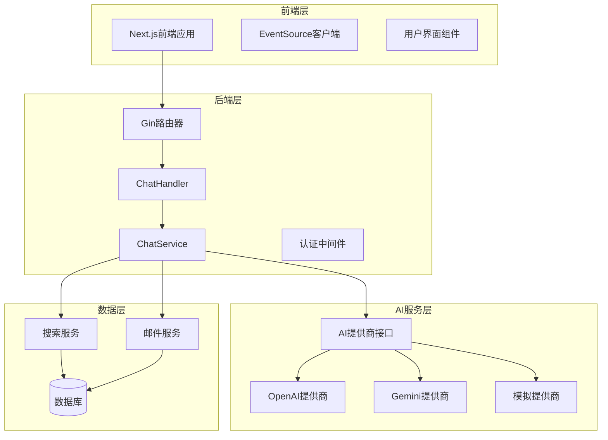
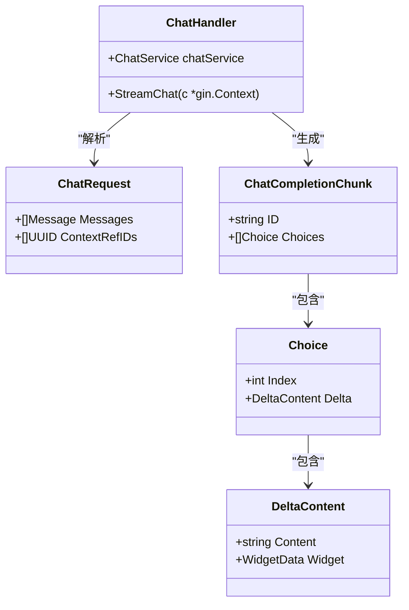
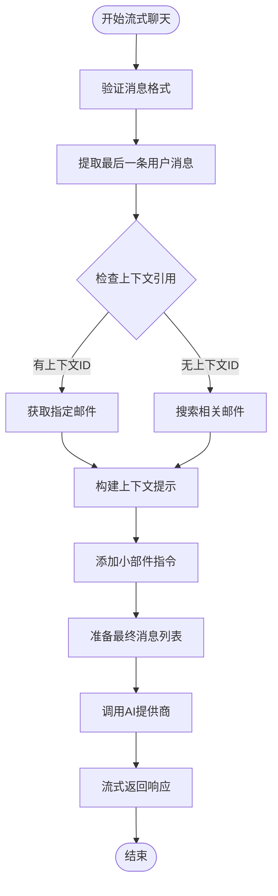
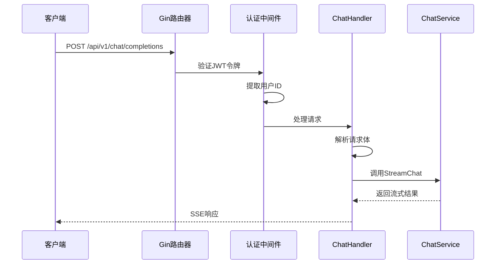
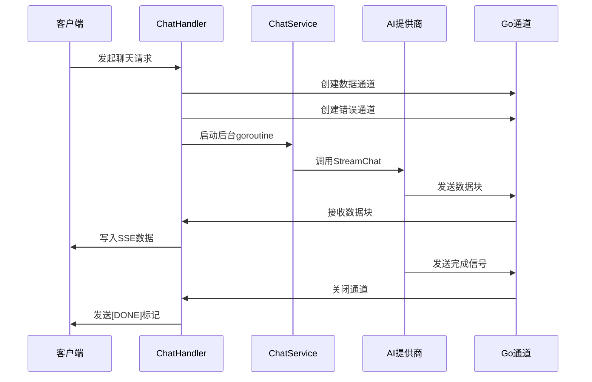
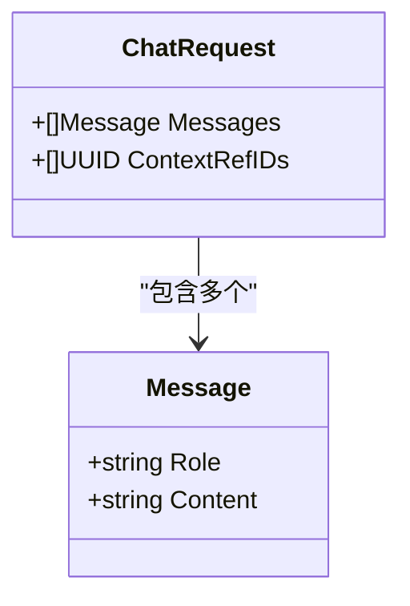
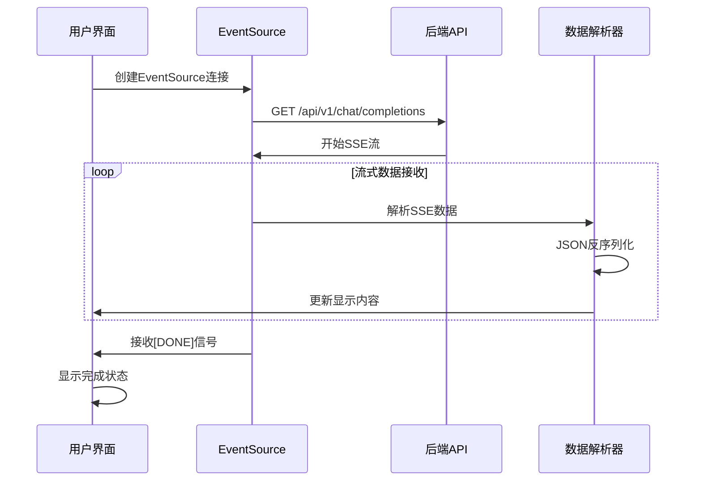
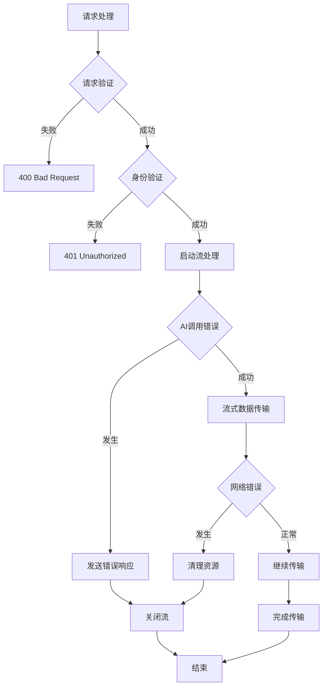
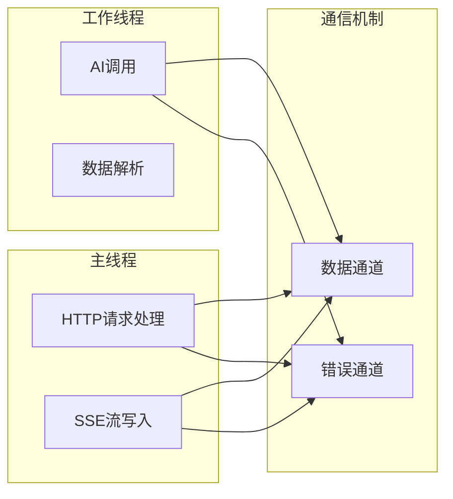

# AI聊天API全面文档

<cite>
**本文档中引用的文件**
- [chat.go](file://backend/internal/handler/chat.go)
- [chat.go](file://backend/internal/service/chat.go)
- [provider.go](file://backend/pkg/ai/provider.go)
- [openai/provider.go](file://backend/pkg/ai/openai/provider.go)
- [gemini/provider.go](file://backend/pkg/ai/gemini/provider.go)
- [CopilotChat.tsx](file://frontend/src/components/copilot/CopilotChat.tsx)
- [routes.go](file://backend/internal/router/routes.go)
- [chat_test.go](file://backend/internal/service/chat_test.go)
</cite>

## 目录
1. [简介](#简介)
2. [项目架构概览](#项目架构概览)
3. [核心组件分析](#核心组件分析)
4. [POST /api/v1/chat/completions端点详解](#post-apiv1chatcompletions端点详解)
5. [服务器发送事件(SSE)实现](#服务器发送事件sse实现)
6. [请求结构与响应机制](#请求结构与响应机制)
7. [前端EventSource集成](#前端eventsource集成)
8. [错误处理与超时策略](#错误处理与超时策略)
9. [性能优化与最佳实践](#性能优化与最佳实践)
10. [故障排除指南](#故障排除指南)
11. [总结](#总结)

## 简介

EchoMind AI聊天系统是一个基于现代Web技术构建的实时对话平台，采用服务器发送事件(SSE)技术实现实时流式响应。该系统支持多种AI提供商（OpenAI、Gemini等），并通过RAG（检索增强生成）技术提供智能上下文感知的对话体验。

本文档重点介绍POST /api/v1/chat/completions端点的实现，详细说明其如何通过SSE技术提供逐字生成的响应，以及前后端的完整集成方案。

## 项目架构概览

系统采用分层架构设计，主要包含以下层次：



**图表来源**
- [chat.go](file://backend/internal/handler/chat.go#L1-L104)
- [chat.go](file://backend/internal/service/chat.go#L1-L119)
- [routes.go](file://backend/internal/router/routes.go#L1-L99)

**章节来源**
- [chat.go](file://backend/internal/handler/chat.go#L1-L104)
- [chat.go](file://backend/internal/service/chat.go#L1-L119)
- [routes.go](file://backend/internal/router/routes.go#L1-L99)

## 核心组件分析

### ChatHandler - 请求处理器

ChatHandler是API的核心入口点，负责处理HTTP请求并协调整个流式响应流程：



**图表来源**
- [chat.go](file://backend/internal/handler/chat.go#L15-L28)
- [provider.go](file://backend/pkg/ai/provider.go#L41-L60)

### ChatService - 业务逻辑层

ChatService实现了复杂的RAG（检索增强生成）逻辑，包括上下文检索、消息预处理和AI调用：



**图表来源**
- [chat.go](file://backend/internal/service/chat.go#L37-L118)

**章节来源**
- [chat.go](file://backend/internal/handler/chat.go#L15-L104)
- [chat.go](file://backend/internal/service/chat.go#L23-L119)

## POST /api/v1/chat/completions端点详解

### 路由注册与中间件

该端点在路由配置中被注册为受保护的路径，需要认证才能访问：



**图表来源**
- [routes.go](file://backend/internal/router/routes.go#L69-L70)
- [chat.go](file://backend/internal/handler/chat.go#L30-L103)

### 请求处理流程

ChatHandler的StreamChat方法实现了完整的请求处理流程：

1. **请求验证**：使用Gin的ShouldBindJSON进行结构化验证
2. **身份认证**：从上下文中提取并验证用户ID
3. **SSE头部设置**：配置适当的HTTP头部以支持流式传输
4. **并发处理**：启动goroutine执行AI调用
5. **流式响应**：使用Gin的Stream方法处理实时数据传输

**章节来源**
- [chat.go](file://backend/internal/handler/chat.go#L30-L103)

## 服务器发送事件(SSE)实现

### SSE消息格式规范

系统严格遵循SSE协议规范，每条消息必须符合以下格式：

| 字段 | 类型 | 描述 | 示例 |
|------|------|------|------|
| data | string | 实际数据内容 | `"data: {\"id\":\"1\",\"choices\":[{\"index\":0,\"delta\":{\"content\":\"Hello\"}}]}"` |
| 结束符 | string | 双换行符表示消息结束 | `"\n\n"` |
| 特殊标记 | string | [DONE]表示流结束 | `"data: [DONE]\n\n"` |

### 流式传输机制



**图表来源**
- [chat.go](file://backend/internal/handler/chat.go#L59-L102)

### 内容类型配置

Handler设置了完整的SSE兼容头部：

| 头部名称 | 值 | 用途 |
|----------|-----|------|
| Content-Type | text/event-stream | 指定SSE内容类型 |
| Cache-Control | no-cache | 禁用缓存 |
| Connection | keep-alive | 保持连接活跃 |
| Transfer-Encoding | chunked | 支持分块传输 |

**章节来源**
- [chat.go](file://backend/internal/handler/chat.go#L49-L54)

## 请求结构与响应机制

### ChatRequest结构定义

请求体包含两个核心字段：



**图表来源**
- [chat.go](file://backend/internal/handler/chat.go#L25-L28)

### 消息历史处理

系统支持完整的对话历史，每个消息包含：
- **Role字段**：标识消息角色（system、user、assistant）
- **Content字段**：实际消息内容
- **上下文引用**：可选的邮件ID列表用于RAG

### 响应数据结构

ChatCompletionChunk是SSE响应的基本单位：

| 字段 | 类型 | 描述 |
|------|------|------|
| id | string | 唯一标识符 |
| choices | []Choice | 选择数组 |
| choice.index | int | 选择索引 |
| choice.delta.content | string | 新增内容 |
| choice.delta.widget | WidgetData | 小部件数据 |

**章节来源**
- [chat.go](file://backend/internal/handler/chat.go#L25-L28)
- [provider.go](file://backend/pkg/ai/provider.go#L41-L60)

## 前端EventSource集成

### JavaScript客户端实现

前端使用标准的EventSource API消费流式响应：



**图表来源**
- [CopilotChat.tsx](file://frontend/src/components/copilot/CopilotChat.tsx#L98-L211)

### 数据处理逻辑

前端实现了复杂的数据处理逻辑：

1. **缓冲区管理**：维护完整响应的缓冲区
2. **小部件检测**：使用正则表达式识别XML小部件标签
3. **增量更新**：仅更新新增内容部分
4. **错误恢复**：优雅处理解析错误和网络中断

### EventSource事件处理

| 事件类型 | 触发条件 | 处理方式 |
|----------|----------|----------|
| message | 接收到有效数据 | 解析并更新UI |
| error | 连接错误或解析失败 | 显示错误消息 |
| [DONE] | 流结束信号 | 标记完成状态 |

**章节来源**
- [CopilotChat.tsx](file://frontend/src/components/copilot/CopilotChat.tsx#L98-L211)

## 错误处理与超时策略

### 多层错误处理机制

系统实现了完整的错误处理链：



**图表来源**
- [chat.go](file://backend/internal/handler/chat.go#L31-L102)

### 超时与连接管理

| 场景 | 超时设置 | 处理策略 |
|------|----------|----------|
| HTTP请求 | Gin默认 | 自动超时控制 |
| AI提供商调用 | 可配置 | 上下文取消机制 |
| 客户端连接 | 浏览器控制 | EventSource自动重连 |
| 数据传输 | 无限制 | 流式处理避免阻塞 |

### 错误响应格式

系统统一使用JSON格式返回错误信息：

```json
{
  "error": "详细的错误描述"
}
```

**章节来源**
- [chat.go](file://backend/internal/handler/chat.go#L32-L46)
- [chat.go](file://backend/internal/handler/chat.go#L73-L78)

## 性能优化与最佳实践

### 并发处理优化

系统采用goroutine和channel实现高效的并发处理：



**图表来源**
- [chat.go](file://backend/internal/handler/chat.go#L59-L102)

### 内存管理策略

1. **通道缓冲**：合理设置channel缓冲区大小
2. **及时关闭**：确保所有资源得到正确释放
3. **对象复用**：重用JSON编码器等昂贵对象
4. **垃圾回收**：避免内存泄漏和频繁GC

### 扩展性考虑

| 组件 | 扩展策略 | 实现方式 |
|------|----------|----------|
| AI提供商 | 接口抽象 | AIProvider接口 |
| 存储后端 | 依赖注入 | ContextSearcher接口 |
| 缓存层 | 中间件模式 | Redis缓存 |
| 监控指标 | Prometheus | 自定义指标 |

**章节来源**
- [chat.go](file://backend/internal/handler/chat.go#L59-L102)
- [chat.go](file://backend/internal/service/chat.go#L23-L35)

## 故障排除指南

### 常见问题诊断

| 问题症状 | 可能原因 | 解决方案 |
|----------|----------|----------|
| 连接超时 | 网络延迟或AI服务不可用 | 检查网络连接和AI提供商状态 |
| 数据不完整 | 网络中断或解析错误 | 实现重试机制和错误恢复 |
| 内存泄漏 | 通道未正确关闭 | 检查defer语句和资源清理 |
| 性能下降 | 并发过多或阻塞操作 | 优化goroutine数量和同步原语 |

### 调试技巧

1. **日志记录**：启用详细的请求和响应日志
2. **监控指标**：跟踪请求延迟和错误率
3. **压力测试**：使用工具测试系统极限
4. **分布式追踪**：使用Jaeger等工具追踪请求链路

### 生产环境部署

| 环境 | 配置要点 | 注意事项 |
|------|----------|----------|
| 开发环境 | 详细日志、断点调试 | 使用模拟AI提供商 |
| 测试环境 | 完整功能、性能测试 | 模拟真实负载 |
| 生产环境 | 监控告警、自动扩缩容 | 安全配置和备份 |

## 总结

EchoMind AI聊天系统通过精心设计的架构实现了高性能的实时对话体验。POST /api/v1/chat/completions端点采用SSE技术提供流畅的用户体验，结合RAG技术和多AI提供商支持，为用户提供了智能化的交互能力。

### 主要优势

1. **实时性**：SSE技术确保毫秒级响应延迟
2. **可扩展性**：模块化设计支持多种AI提供商
3. **可靠性**：完善的错误处理和恢复机制
4. **易用性**：简洁的API设计和丰富的前端集成

### 技术亮点

- **流式架构**：完全异步的处理流程
- **上下文感知**：智能的RAG实现
- **小部件系统**：富媒体内容生成
- **跨平台兼容**：标准SSE协议支持

该系统为现代AI驱动的应用程序提供了一个优秀的参考实现，展示了如何在保证性能的同时提供出色的用户体验。