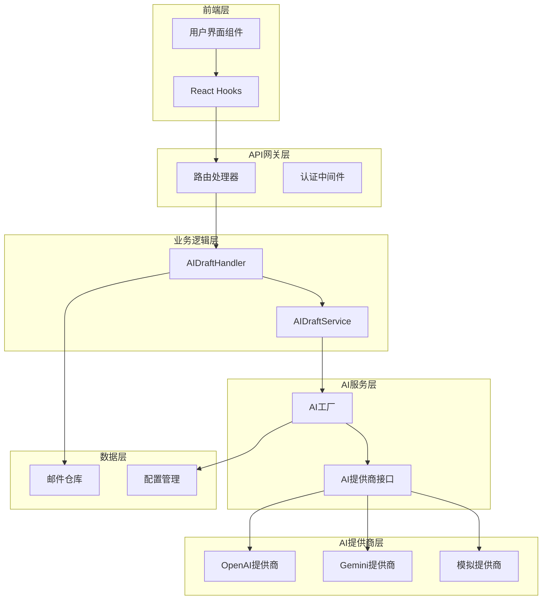
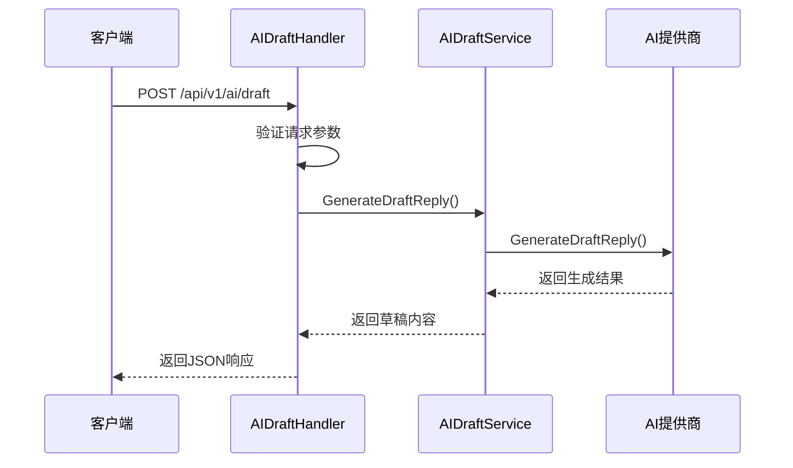
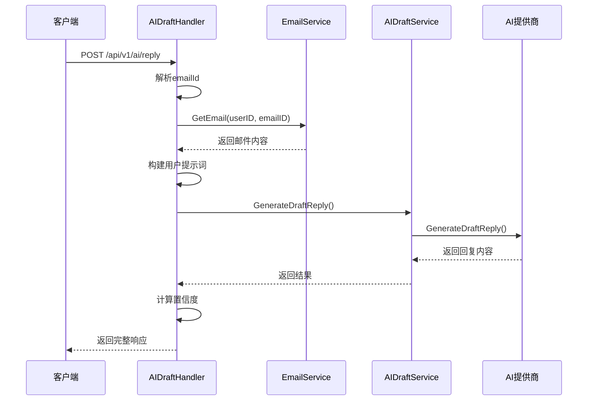
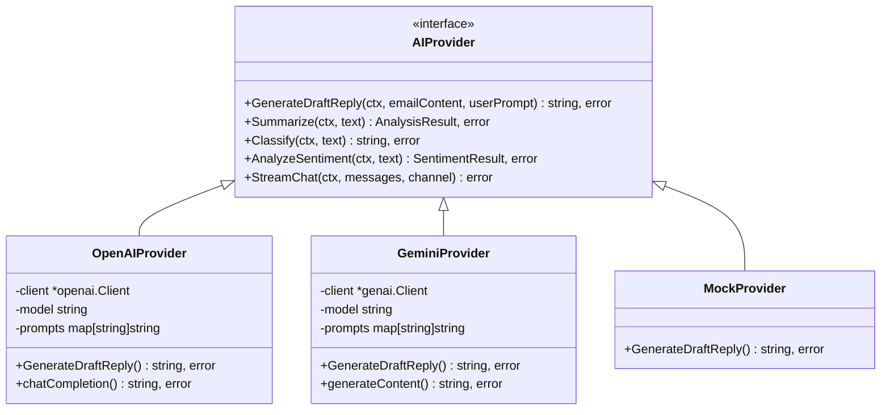
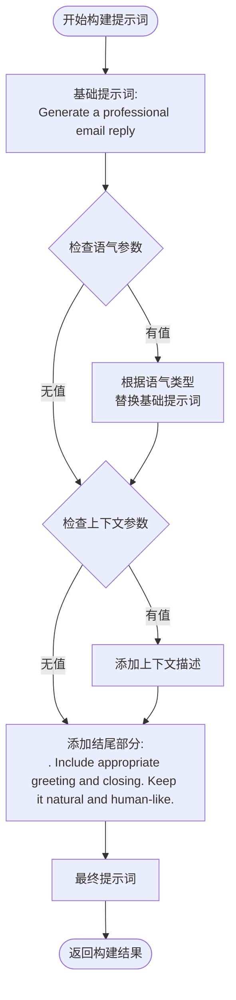
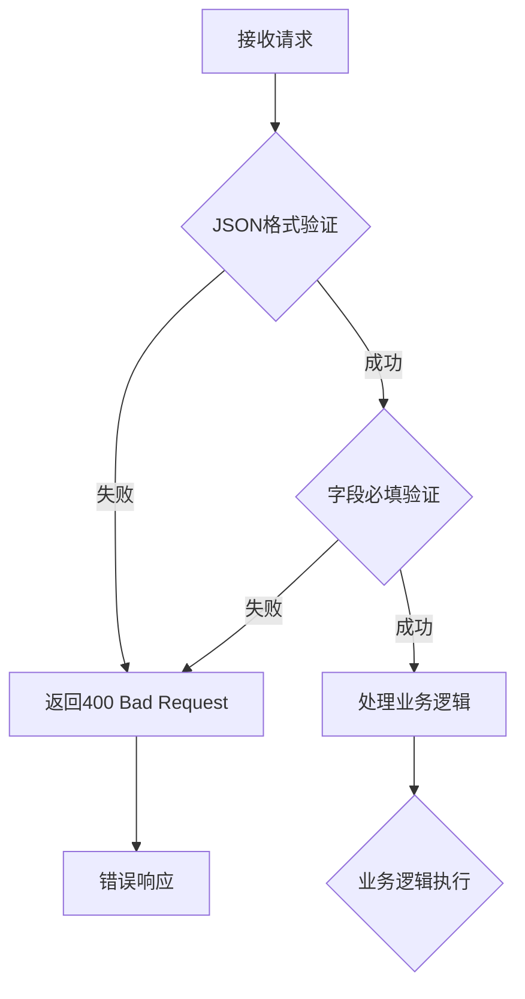
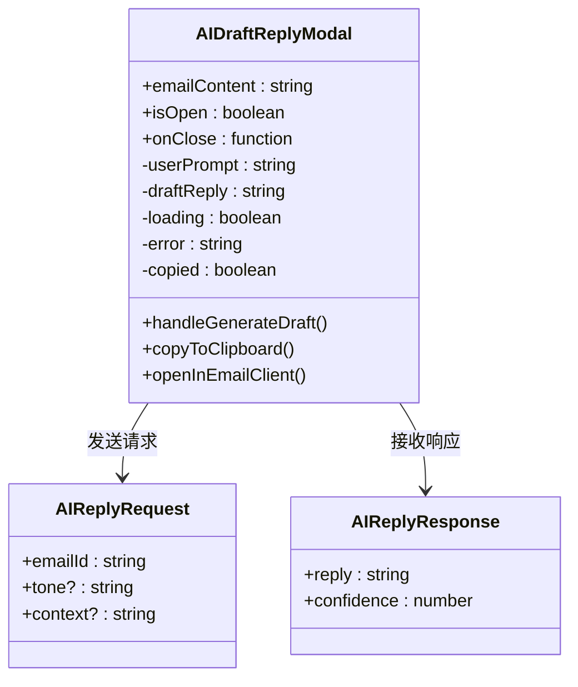

# AI草稿生成功能详细文档

<cite>
**本文档中引用的文件**
- [ai_draft.go](file://backend/internal/handler/ai_draft.go)
- [ai_draft.go](file://backend/internal/service/ai_draft.go)
- [ai_factory.go](file://backend/internal/service/ai_factory.go)
- [provider.go](file://backend/pkg/ai/provider.go)
- [provider.go](file://backend/pkg/ai/openai/provider.go)
- [provider.go](file://backend/pkg/ai/gemini/provider.go)
- [routes.go](file://backend/internal/router/routes.go)
- [AIDraftReplyModal.tsx](file://frontend/src/components/email/AIDraftReplyModal.tsx)
- [useAIReply.ts](file://frontend/src/hooks/useAIReply.ts)
- [email.go](file://backend/internal/model/email.go)
</cite>

## 目录
1. [简介](#简介)
2. [系统架构概览](#系统架构概览)
3. [核心端点详解](#核心端点详解)
4. [AI提供商集成](#ai提供商集成)
5. [提示词构建机制](#提示词构建机制)
6. [错误处理流程](#错误处理流程)
7. [前端集成示例](#前端集成示例)
8. [配置与部署](#配置与部署)
9. [性能考虑](#性能考虑)
10. [故障排除指南](#故障排除指南)

## 简介

AI草稿生成功能是EchoMind平台的核心智能助手功能之一，为用户提供基于人工智能的邮件草稿生成能力。该功能支持两种主要场景：直接生成邮件草稿（POST /api/v1/ai/draft）和基于现有邮件内容的智能回复生成（POST /api/v1/ai/reply）。

该功能采用模块化设计，支持多种AI提供商（OpenAI、Gemini等），通过统一的接口抽象层实现灵活的提供商切换。系统具备完善的错误处理机制和置信度评估功能，确保用户体验的稳定性和可靠性。

## 系统架构概览

AI草稿生成功能采用分层架构设计，从用户界面到AI提供商形成清晰的调用链路：



**图表来源**
- [ai_draft.go](file://backend/internal/handler/ai_draft.go#L27-L37)
- [ai_draft.go](file://backend/internal/service/ai_draft.go#L9-L15)
- [ai_factory.go](file://backend/internal/service/ai_factory.go#L24-L107)

**章节来源**
- [ai_draft.go](file://backend/internal/handler/ai_draft.go#L1-L136)
- [ai_draft.go](file://backend/internal/service/ai_draft.go#L1-L20)
- [ai_factory.go](file://backend/internal/service/ai_factory.go#L1-L107)

## 核心端点详解

### POST /api/v1/ai/draft - 生成草稿

该端点用于直接生成邮件草稿，无需依赖现有邮件内容。

#### 请求结构

| 字段名 | 类型 | 必填 | 描述 |
|--------|------|------|------|
| emailContent | string | 是 | 邮件正文内容 |
| userPrompt | string | 是 | 用户自定义的生成指令 |

#### 响应结构

| 字段名 | 类型 | 描述 |
|--------|------|------|
| draft | string | 生成的邮件草稿内容 |

#### 使用示例

```json
{
  "emailContent": "客户反馈产品存在性能问题，需要尽快解决。",
  "userPrompt": "生成一个专业的技术问题反馈回复，包含解决方案建议。"
}
```

#### 处理流程



**图表来源**
- [ai_draft.go](file://backend/internal/handler/ai_draft.go#L40-L54)

### POST /api/v1/ai/reply - 生成回复

该端点基于现有邮件内容生成智能回复，支持语气和上下文定制。

#### 请求结构

| 字段名 | 类型 | 必填 | 描述 |
|--------|------|------|------|
| emailId | string | 是 | 目标邮件的UUID标识符 |
| tone | string | 否 | 回复语气（professional, casual, friendly, concise） |
| context | string | 否 | 上下文类型（brief, detailed, urgent） |

#### 响应结构

| 字段名 | 类型 | 描述 |
|--------|------|------|
| reply | string | 生成的回复内容 |
| confidence | float | 置信度分数（0.0-1.0） |

#### 使用示例

```json
{
  "emailId": "550e8400-e29b-41d4-a716-446655440000",
  "tone": "concise",
  "context": "urgent"
}
```

#### 处理流程



**图表来源**
- [ai_draft.go](file://backend/internal/handler/ai_draft.go#L57-L102)

**章节来源**
- [ai_draft.go](file://backend/internal/handler/ai_draft.go#L11-L25)
- [ai_draft.go](file://backend/internal/handler/ai_draft.go#L40-L102)

## AI提供商集成

系统支持多种AI提供商，通过统一的接口抽象实现灵活的提供商切换。

### 提供商接口设计



**图表来源**
- [provider.go](file://backend/pkg/ai/provider.go#L6-L18)
- [provider.go](file://backend/pkg/ai/openai/provider.go#L21-L273)
- [provider.go](file://backend/pkg/ai/gemini/provider.go#L23-L313)

### OpenAI提供商实现

OpenAI提供商支持标准的聊天完成API，具备以下特性：

- **模型配置**：支持自定义模型和基础URL
- **嵌入维度**：可配置的向量维度（默认1024）
- **JSON模式**：支持结构化输出格式
- **流式响应**：支持实时流式对话

### Gemini提供商实现

Gemini提供商基于Google的Generative AI API：

- **系统指令**：支持系统级别的指令设置
- **多模态**：原生支持文本和多媒体内容
- **批量嵌入**：高效的批量向量生成
- **Widget数据**：支持富媒体内容嵌入

**章节来源**
- [provider.go](file://backend/pkg/ai/provider.go#L1-L81)
- [provider.go](file://backend/pkg/ai/openai/provider.go#L1-L273)
- [provider.go](file://backend/pkg/ai/gemini/provider.go#L1-L313)

## 提示词构建机制

系统通过`buildPrompt`方法动态构建用户提示词，支持多种语气和上下文组合。

### 语气选项

| 语气值 | 描述 | 示例提示词 |
|--------|------|------------|
| professional | 专业正式 | "Generate a professional and formal email reply" |
| casual | 轻松随意 | "Generate a casual and friendly email reply" |
| friendly | 友好温暖 | "Generate a warm and friendly email reply" |
| concise | 简洁明了 | "Generate a concise and brief email reply" |

### 上下文选项

| 上下文值 | 描述 | 扩展提示词 |
|----------|------|------------|
| brief | 简要概述 | "with brief context" |
| detailed | 详细说明 | "with detailed explanation" |
| urgent | 紧急事项 | "with urgent and clear action items" |

### 提示词构建流程



**图表来源**
- [ai_draft.go](file://backend/internal/handler/ai_draft.go#L105-L134)

**章节来源**
- [ai_draft.go](file://backend/internal/handler/ai_draft.go#L105-L134)

## 错误处理流程

系统实现了多层次的错误处理机制，确保各种异常情况都能得到妥善处理。

### 请求验证错误



### 业务逻辑错误

| 错误类型 | HTTP状态码 | 错误消息 | 处理方式 |
|----------|------------|----------|----------|
| 邮件不存在 | 404 Not Found | "Email not found" | 返回具体错误信息 |
| 无效邮件ID | 400 Bad Request | "Invalid email ID" | 参数验证失败 |
| AI服务调用失败 | 500 Internal Server Error | AI提供商错误信息 | 记录日志并返回 |
| 配置缺失 | 500 Internal Server Error | "Provider configuration not found" | 默认使用模拟提供商 |

### 错误响应结构

```json
{
  "error": "具体的错误描述信息"
}
```

### 前端错误处理

前端通过React Query的错误处理机制捕获和显示错误：

```typescript
const { mutate: generateReply, isError, error } = useAIReply();
// 错误状态自动显示在UI中
```

**章节来源**
- [ai_draft.go](file://backend/internal/handler/ai_draft.go#L42-L50)
- [ai_draft.go](file://backend/internal/handler/ai_draft.go#L59-L77)
- [useAIReply.ts](file://frontend/src/hooks/useAIReply.ts#L29-L31)

## 前端集成示例

### AI草稿生成模态框

前端提供了完整的AI草稿生成界面，集成在邮件详情页面中。

#### 组件结构



**图表来源**
- [AIDraftReplyModal.tsx](file://frontend/src/components/email/AIDraftReplyModal.tsx#L9-L13)
- [useAIReply.ts](file://frontend/src/hooks/useAIReply.ts#L5-L15)

#### 主要功能特性

1. **预览原始邮件**：显示待回复的邮件内容
2. **智能提示词模板**：提供专业、轻松、友好、简洁等预设模板
3. **实时生成**：点击按钮后立即生成AI回复
4. **复制功能**：一键复制生成的回复内容
5. **邮件客户端集成**：直接在邮件客户端中打开回复

#### 使用示例

```typescript
// 在邮件详情页面中使用
<AIDraftReplyModal
  emailContent={currentEmail.bodyText}
  isOpen={isReplyModalOpen}
  onClose={() => setIsReplyModalOpen(false)}
/>
```

### React Query集成

系统使用React Query进行状态管理和错误处理：

```typescript
export const useAIReply = () => {
  return useMutation({
    mutationFn: async (requestData: AIReplyRequest): Promise<AIReplyResponse> => {
      const { data: responseData } = await api.post('/ai/reply', requestData);
      return responseData;
    },
    onSuccess: (responseData) => {
      console.log('AI Reply generated successfully:', {
        length: responseData.reply.length,
        confidence: responseData.confidence
      });
    },
    onError: (error) => {
      console.error('Failed to generate AI reply:', error);
    },
  });
};
```

**章节来源**
- [AIDraftReplyModal.tsx](file://frontend/src/components/email/AIDraftReplyModal.tsx#L1-L230)
- [useAIReply.ts](file://frontend/src/hooks/useAIReply.ts#L1-L33)

## 配置与部署

### AI提供商配置

系统支持多种AI提供商的配置，通过配置文件管理：

```yaml
ai:
  active_services:
    chat: "openai"
    embedding: "openai"
  providers:
    openai:
      protocol: "openai"
      settings:
        api_key: "${OPENAI_API_KEY}"
        model: "gpt-4"
        base_url: "${OPENAI_BASE_URL}"
        embedding_model: "text-embedding-3-small"
        embedding_dimensions: 1024
    gemini:
      protocol: "gemini"
      settings:
        api_key: "${GEMINI_API_KEY}"
        model: "gemini-pro"
        embedding_model: "text-embedding-004"
        embedding_dimensions: 768
```

### 置信度计算

系统实现了简单的置信度计算机制：

```go
// 基础置信度 + 文本长度权重
confidence := 0.85 + (float64(len(replyText)) / 10000.0)
if confidence > 0.99 {
    confidence = 0.99
}
```

该算法考虑了回复长度对置信度的影响，长度越长通常意味着更详细的回复，因此置信度更高。

**章节来源**
- [ai_draft.go](file://backend/internal/handler/ai_draft.go#L90-L94)

## 性能考虑

### 缓存策略

- **提示词缓存**：静态提示词可以缓存在内存中
- **配置缓存**：AI提供商配置定期刷新
- **响应缓存**：对于相同输入的重复请求可考虑缓存

### 并发控制

- **连接池管理**：AI提供商API使用连接池避免资源耗尽
- **超时控制**：设置合理的请求超时时间（建议30秒）
- **重试机制**：网络异常时自动重试（最多3次）

### 资源优化

- **流式处理**：支持大文本的流式处理
- **内存管理**：及时释放不再使用的资源
- **批量操作**：支持批量邮件处理

## 故障排除指南

### 常见问题及解决方案

#### 1. AI提供商连接失败

**症状**：收到"AI service unavailable"错误
**原因**：API密钥无效或网络连接问题
**解决方案**：
- 检查环境变量配置
- 验证API密钥有效性
- 确认网络连接状态

#### 2. 邮件内容为空

**症状**：生成的回复质量差或为空
**原因**：邮件内容提取失败
**解决方案**：
- 检查邮件数据库完整性
- 验证邮件解析逻辑
- 确认邮件ID正确性

#### 3. 置信度过低

**症状**：系统频繁提示"置信度过低"
**原因**：AI模型输出不稳定或提示词不当
**解决方案**：
- 调整提示词模板
- 检查AI模型配置
- 增加训练数据量

#### 4. 前端集成问题

**症状**：AI草稿功能无法正常使用
**原因**：API调用失败或权限问题
**解决方案**：
- 检查网络请求状态码
- 验证用户认证状态
- 查看浏览器控制台错误

### 监控指标

建议监控以下关键指标：

- **API响应时间**：平均响应时间应小于2秒
- **成功率**：API调用成功率应大于95%
- **错误率**：各类错误的发生频率
- **置信度分布**：生成回复的置信度统计

### 日志记录

系统记录关键操作的日志：

```go
// 成功日志
logger.Info("AI draft generated successfully", 
    "length", len(replyText), 
    "confidence", confidence)

// 错误日志  
logger.Error("Failed to generate AI draft", 
    "error", err, 
    "emailID", emailID)
```

**章节来源**
- [ai_draft.go](file://backend/internal/handler/ai_draft.go#L48-L50)
- [ai_draft.go](file://backend/internal/handler/ai_draft.go#L85-L87)