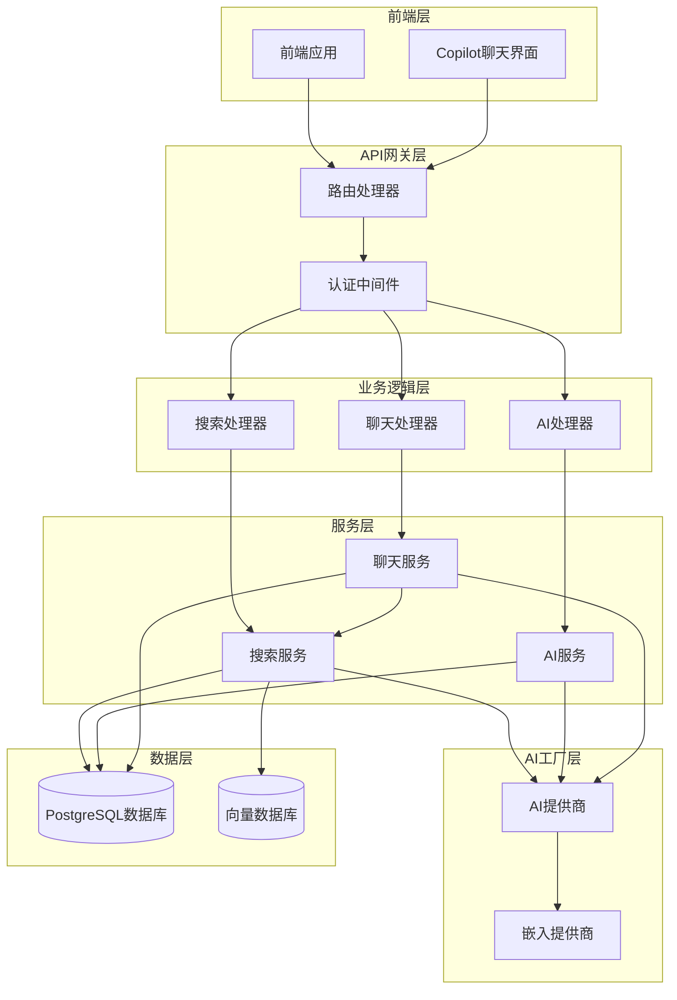
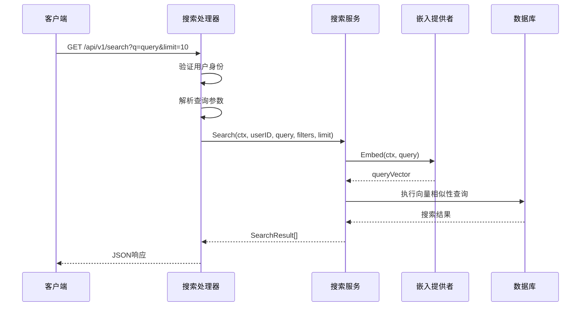
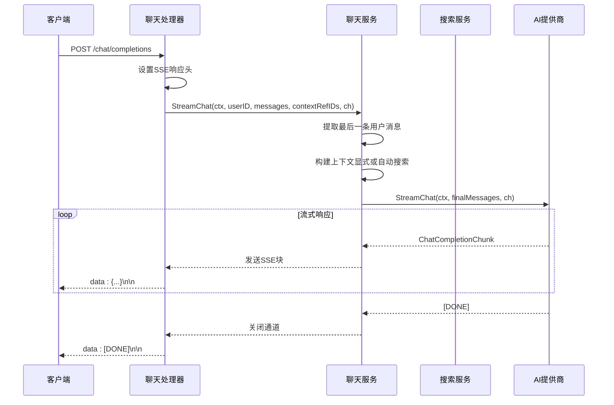
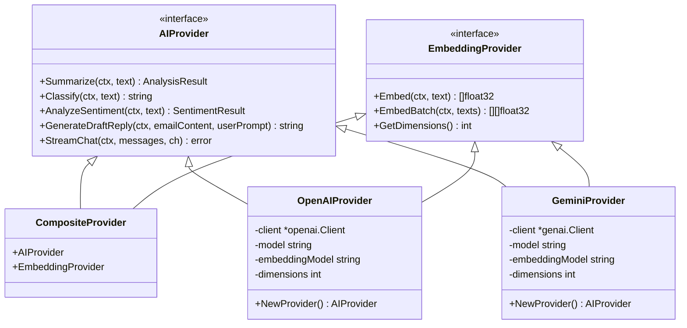

# 搜索与AI功能综合API文档

<cite>
**本文档中引用的文件**
- [search.go](file://backend/internal/handler/search.go)
- [ai_draft.go](file://backend/internal/handler/ai_draft.go)
- [chat.go](file://backend/internal/handler/chat.go)
- [search.go](file://backend/internal/service/search.go)
- [ai_draft.go](file://backend/internal/service/ai_draft.go)
- [chat.go](file://backend/internal/service/chat.go)
- [ai_factory.go](file://backend/internal/service/ai_factory.go)
- [provider.go](file://backend/pkg/ai/provider.go)
- [routes.go](file://backend/internal/router/routes.go)
- [api.ts](file://frontend/src/lib/api.ts)
- [CopilotChat.tsx](file://frontend/src/components/copilot/CopilotChat.tsx)
- [openai/provider.go](file://backend/pkg/ai/openai/provider.go)
- [gemini/provider.go](file://backend/pkg/ai/gemini/provider.go)
</cite>

## 目录
1. [简介](#简介)
2. [项目架构概览](#项目架构概览)
3. [搜索API详解](#搜索api详解)
4. [AI功能API详解](#ai功能api详解)
5. [流式聊天API详解](#流式聊天api详解)
6. [AI工厂与提供商](#ai工厂与提供商)
7. [前端集成指南](#前端集成指南)
8. [错误处理与最佳实践](#错误处理与最佳实践)
9. [总结](#总结)

## 简介

EchoMind是一个集成了先进AI功能的企业级邮件管理系统，提供了强大的搜索能力和智能AI辅助功能。本文档详细介绍了系统的三个核心API端点：语义搜索、AI邮件草稿生成和流式聊天功能。

系统采用模块化设计，支持多种AI提供商（OpenAI和Gemini），并通过向量嵌入技术实现高效的语义搜索。所有AI功能都通过统一的AI工厂模式进行管理，确保了系统的可扩展性和灵活性。

## 项目架构概览

系统采用分层架构设计，主要包含以下组件：



**图表来源**
- [routes.go](file://backend/internal/router/routes.go#L1-L99)
- [search.go](file://backend/internal/handler/search.go#L1-L128)
- [ai_draft.go](file://backend/internal/handler/ai_draft.go#L1-L136)
- [chat.go](file://backend/internal/handler/chat.go#L1-L104)

## 搜索API详解

### GET /api/v1/search - 语义搜索

搜索API提供了基于向量嵌入的语义搜索功能，能够根据用户查询找到最相关的邮件内容。

#### 请求参数

| 参数名 | 类型 | 必需 | 描述 | 示例 |
|--------|------|------|------|------|
| q | string | 是 | 查询字符串，用于生成向量嵌入进行搜索 | "项目进度报告" |
| limit | integer | 否 | 返回结果数量限制，默认为10，最大100 | 20 |
| sender | string | 否 | 发件人邮箱地址过滤器 | "john@example.com" |
| context_id | uuid | 否 | 上下文ID过滤器，关联特定讨论组 | "123e4567-e89b-12d3-a456-426614174000" |
| start_date | date | 否 | 开始日期过滤器（YYYY-MM-DD） | "2024-01-01" |
| end_date | date | 否 | 结束日期过滤器（YYYY-MM-DD） | "2024-12-31" |

#### 响应数据结构

```typescript
interface SearchResponse {
  query: string;           // 原始查询字符串
  results: SearchResult[]; // 搜索结果数组
  count: number;           // 结果总数
}

interface SearchResult {
  email_id: string;       // 邮件唯一标识符
  subject: string;        // 邮件主题
  snippet: string;        // 内容片段
  sender: string;         // 发件人
  date: string;          // 发送时间（ISO格式）
  score: number;         // 相似度分数（0-1）
}
```

#### 搜索流程



**图表来源**
- [search.go](file://backend/internal/handler/search.go#L32-L127)
- [search.go](file://backend/internal/service/search.go#L45-L105)

#### 向量搜索原理

系统使用PostgreSQL的pgvector扩展进行向量相似性搜索：

1. **查询向量化**：将用户查询转换为高维向量
2. **相似性计算**：使用余弦距离计算查询向量与邮件向量的相似度
3. **排序与过滤**：按相似度分数排序，并应用时间范围和发件人过滤
4. **结果返回**：返回前N个最相关的邮件及其相似度分数

**章节来源**
- [search.go](file://backend/internal/handler/search.go#L1-L128)
- [search.go](file://backend/internal/service/search.go#L1-L171)

## AI功能API详解

### POST /api/v1/ai/draft - 生成AI邮件草稿

该API用于根据邮件内容和用户提示生成专业的邮件回复草稿。

#### 请求体结构

```typescript
interface AIDraftRequest {
  emailContent: string;  // 原始邮件内容
  userPrompt: string;    // 用户自定义提示词
}
```

#### 响应数据结构

```typescript
interface AIDraftResponse {
  draft: string;         // 生成的邮件草稿
}
```

#### 使用示例

```json
{
  "emailContent": "尊敬的客户，感谢您对我们产品的关注...",
  "userPrompt": "请以专业且友好的语气回复，强调我们的售后服务优势"
}
```

### POST /api/v1/ai/reply - 生成AI回复

该API专门用于基于现有邮件内容生成回复，支持指定语气和上下文风格。

#### 请求体结构

```typescript
interface AIReplyRequest {
  emailId: string;       // 目标邮件ID
  tone?: string;         // 回复语气："professional", "casual", "friendly", "concise"
  context?: string;      // 上下文风格："brief", "detailed", "urgent"
}
```

#### 响应数据结构

```typescript
interface AIReplyResponse {
  reply: string;         // 生成的回复内容
  confidence: number;    // 置信度评分（0-1）
}
```

#### 语气和上下文构建逻辑

系统会根据用户选择的语气和上下文参数动态构建提示词：

| 语气类型 | 提示词模板 | 适用场景 |
|----------|------------|----------|
| professional | "生成专业正式的邮件回复" | 商务沟通 |
| casual | "生成轻松友好的邮件回复" | 日常交流 |
| friendly | "生成温暖亲切的邮件回复" | 客户关系 |
| concise | "生成简洁明了的邮件回复" | 时间紧迫 |

| 上下文类型 | 提示词模板 | 适用场景 |
|------------|------------|----------|
| brief | "包含简要背景信息" | 简短回复 |
| detailed | "包含详细解释" | 复杂问题 |
| urgent | "包含紧急行动项" | 紧急事项 |

**章节来源**
- [ai_draft.go](file://backend/internal/handler/ai_draft.go#L1-L136)
- [ai_draft.go](file://backend/internal/service/ai_draft.go#L1-L20)

## 流式聊天API详解

### POST /api/v1/chat/completions - 流式聊天

该API提供实时的流式聊天功能，使用Server-Sent Events (SSE) 协议传输逐字响应。

#### 请求体结构

```typescript
interface ChatRequest {
  messages: Message[];           // 对话历史记录
  context_ref_ids?: string[];    // 上下文引用ID列表
}

interface Message {
  role: "system" | "user" | "assistant";  // 角色类型
  content: string;                       // 消息内容
}
```

#### SSE响应格式

服务器使用SSE协议发送流式响应，每条消息格式如下：

```
data: {"id":"chatcmpl-123","choices":[{"index":0,"delta":{"content":"Hello"}}]}

data: {"id":"chatcmpl-123","choices":[{"index":0,"delta":{"content":" world"}}]}

data: [DONE]
```

#### 聊天流程



**图表来源**
- [chat.go](file://backend/internal/handler/chat.go#L30-L103)
- [chat.go](file://backend/internal/service/chat.go#L37-L118)

#### 上下文检索策略

系统采用双重策略进行上下文检索：

1. **显式上下文**（高优先级）：
   - 使用提供的`context_ref_ids`直接检索相关邮件
   - 适用于用户明确指定的上下文

2. **自动搜索**（降级策略）：
   - 使用最后一条用户消息进行语义搜索
   - 自动检索最相关的邮件作为上下文
   - 适用于无明确上下文的情况

#### 流式响应处理

客户端需要正确处理SSE流，包括：

- **消息解析**：解析JSON格式的数据块
- **错误处理**：处理网络错误和AI服务错误
- **超时控制**：设置合理的超时机制防止长时间等待
- **Widget渲染**：识别并渲染AI生成的交互式小部件

**章节来源**
- [chat.go](file://backend/internal/handler/chat.go#L1-L104)
- [chat.go](file://backend/internal/service/chat.go#L1-L119)

## AI工厂与提供商

### AI工厂架构

系统通过AI工厂模式统一管理不同的AI提供商，支持OpenAI和Gemini等平台。



**图表来源**
- [provider.go](file://backend/pkg/ai/provider.go#L1-L81)
- [ai_factory.go](file://backend/internal/service/ai_factory.go#L1-L107)

### OpenAI提供商特性

- **模型支持**：支持GPT-3.5、GPT-4等聊天模型
- **嵌入模型**：支持文本嵌入生成
- **JSON模式**：支持结构化输出
- **流式响应**：完整的流式聊天支持

### Gemini提供商特性

- **模型支持**：支持Gemini Pro系列模型
- **嵌入模型**：支持文本嵌入生成
- **系统指令**：原生支持系统指令
- **多模态**：支持文本和图像输入

**章节来源**
- [ai_factory.go](file://backend/internal/service/ai_factory.go#L1-L107)
- [provider.go](file://backend/pkg/ai/provider.go#L1-L81)

## 前端集成指南

### 使用EventSource调用聊天API

以下是前端使用EventSource调用流式聊天API的完整示例：

```typescript
// 前端EventSource调用示例
async function startChat(messages: Message[], contextIds: string[]) {
  try {
    const response = await fetch('/api/v1/chat/completions', {
      method: 'POST',
      headers: {
        'Content-Type': 'application/json',
        'Authorization': `Bearer ${token}`
      },
      body: JSON.stringify({
        messages,
        context_ref_ids: contextIds
      })
    });

    if (!response.ok) {
      throw new Error(`HTTP error! status: ${response.status}`);
    }

    if (!response.body) {
      throw new Error('No response body');
    }

    // 使用EventSource处理SSE流
    const eventSource = new EventSource(response.url);
    
    eventSource.onmessage = function(event) {
      const data = JSON.parse(event.data);
      
      if (data.error) {
        console.error('AI Error:', data.error);
        // 显示错误信息给用户
        return;
      }
      
      if (data.choices && data.choices[0].delta.content) {
        // 处理文本内容
        const contentChunk = data.choices[0].delta.content;
        updateChatUI(contentChunk);
      }
      
      if (event.data === '[DONE]') {
        // 流结束
        eventSource.close();
        enableInput();
      }
    };

    eventSource.onerror = function(error) {
      console.error('EventSource error:', error);
      eventSource.close();
      showError('聊天连接失败，请重试');
    };

  } catch (error) {
    console.error('Chat initiation failed:', error);
    showError('无法启动聊天，请检查网络连接');
  }
}
```

### 长文本生成的超时处理

为了处理长文本生成过程中的超时问题，建议实现以下机制：

```typescript
class ChatSession {
  private timeoutTimer: NodeJS.Timeout | null = null;
  private readonly TIMEOUT_DURATION = 30000; // 30秒超时
  
  startStreaming() {
    // 启动超时定时器
    this.timeoutTimer = setTimeout(() => {
      this.handleTimeout();
    }, this.TIMEOUT_DURATION);
    
    // 处理接收到的数据
    eventSource.onmessage = (event) => {
      // 重置超时计时器
      if (this.timeoutTimer) {
        clearTimeout(this.timeoutTimer);
      }
      this.timeoutTimer = setTimeout(() => {
        this.handleTimeout();
      }, this.TIMEOUT_DURATION);
      
      // 处理正常数据...
    };
  }
  
  handleTimeout() {
    if (this.timeoutTimer) {
      clearTimeout(this.timeoutTimer);
      this.timeoutTimer = null;
    }
    
    // 关闭EventSource
    if (eventSource) {
      eventSource.close();
    }
    
    // 显示超时错误
    this.showError('聊天响应超时，请重试');
  }
}
```

### 前端状态管理

推荐使用状态管理来处理聊天会话：

```typescript
interface CopilotState {
  messages: CopilotMessage[];
  isChatting: boolean;
  searchResults: SearchResult[];
  error: string | null;
}

// 使用Zustand状态管理
const useCopilotStore = create<CopilotState>((set) => ({
  messages: [],
  isChatting: false,
  searchResults: [],
  error: null,
  
  addMessage: (message) => set((state) => ({
    messages: [...state.messages, message],
    isChatting: true
  })),
  
  setError: (error) => set({ error }),
  reset: () => set({ 
    messages: [], 
    isChatting: false, 
    error: null 
  })
}));
```

**章节来源**
- [CopilotChat.tsx](file://frontend/src/components/copilot/CopilotChat.tsx#L1-L239)
- [api.ts](file://frontend/src/lib/api.ts#L1-L72)

## 错误处理与最佳实践

### 常见错误类型

#### 搜索API错误

| 错误类型 | HTTP状态码 | 描述 | 解决方案 |
|----------|------------|------|----------|
| 认证失败 | 401 | 用户未认证 | 重新登录获取有效令牌 |
| 查询无效 | 400 | 缺少必需的查询参数 | 提供有效的搜索查询 |
| 服务内部错误 | 500 | 搜索服务故障 | 稍后重试或联系支持 |

#### AI API错误

| 错误类型 | HTTP状态码 | 描述 | 解决方案 |
|----------|------------|------|----------|
| AI服务不可用 | 503 | AI提供商服务不可用 | 切换到备用提供商或稍后重试 |
| 请求超时 | 408 | AI处理请求超时 | 减少请求复杂度或增加超时时间 |
| 格式错误 | 400 | 请求格式不正确 | 检查请求参数格式 |

#### 流式聊天错误

| 错误类型 | 描述 | 处理方式 |
|----------|------|----------|
| 连接中断 | 网络不稳定导致连接断开 | 实现自动重连机制 |
| SSE格式错误 | 服务器返回非标准SSE格式 | 添加格式验证和错误恢复 |
| 超时错误 | 响应时间超过阈值 | 设置合理超时时间并显示友好提示 |

### 性能优化建议

#### 搜索性能优化

1. **索引优化**：确保向量索引正确配置
2. **批量处理**：对大量文本使用批量嵌入生成
3. **缓存策略**：缓存常用查询的搜索结果
4. **分页加载**：对于大量结果使用分页机制

#### AI服务优化

1. **并发控制**：限制同时进行的AI请求数量
2. **预热机制**：在低峰期预热AI模型
3. **负载均衡**：在多个AI提供商间分配请求
4. **降级策略**：AI服务不可用时提供基础功能

#### 流式响应优化

1. **缓冲策略**：合理设置SSE缓冲区大小
2. **心跳检测**：定期发送心跳包保持连接活跃
3. **错误恢复**：实现自动重连和状态恢复
4. **资源清理**：及时关闭不再使用的EventSource

### 安全考虑

1. **输入验证**：严格验证所有用户输入
2. **速率限制**：防止API滥用和DDoS攻击
3. **敏感信息过滤**：避免在日志中记录敏感数据
4. **HTTPS强制**：确保所有API通信使用加密连接

## 总结

EchoMind的搜索与AI功能API提供了企业级的智能邮件管理解决方案。通过语义搜索、AI邮件生成和流式聊天三大核心功能，系统实现了：

### 主要特性

1. **智能搜索**：基于向量嵌入的语义搜索，支持复杂的过滤条件
2. **多AI提供商**：统一接口支持OpenAI和Gemini等主流AI平台
3. **流式交互**：实时的聊天体验，支持交互式小部件
4. **上下文感知**：智能的上下文检索和对话管理
5. **可扩展架构**：模块化设计便于功能扩展和维护

### 技术优势

- **高性能**：向量数据库加速语义搜索
- **高可用**：多提供商备份和自动切换
- **易集成**：标准化的RESTful API设计
- **国际化**：支持多语言和本地化

### 应用场景

- **邮件智能分类**：自动识别邮件重要性和类别
- **智能回复生成**：快速生成高质量的邮件回复
- **知识检索**：从历史邮件中提取相关信息
- **协作办公**：团队间的智能信息共享和协作

通过本文档的详细介绍，开发者可以充分理解和利用EchoMind的搜索与AI功能，构建更加智能和高效的企业级应用系统。