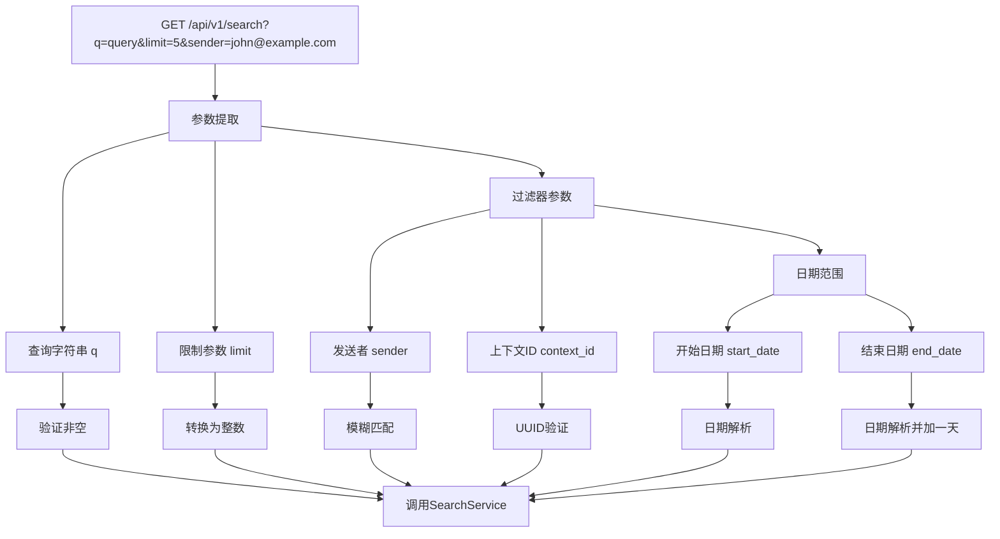
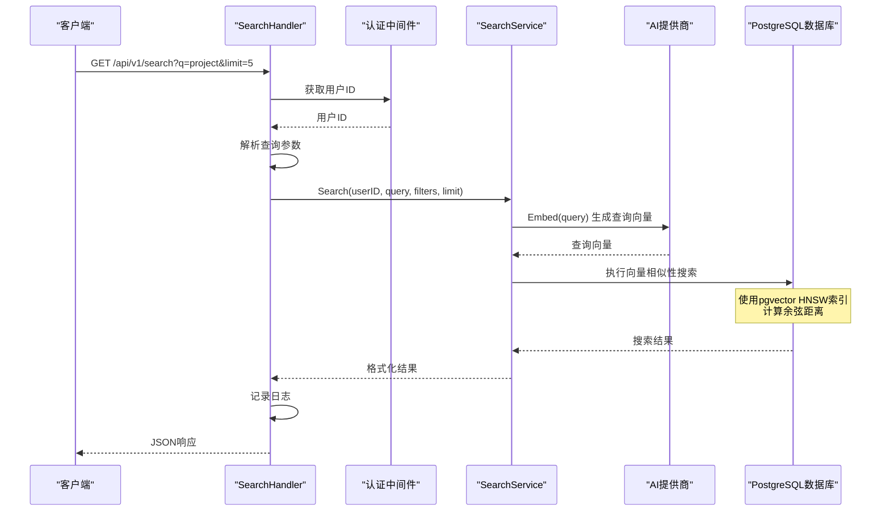
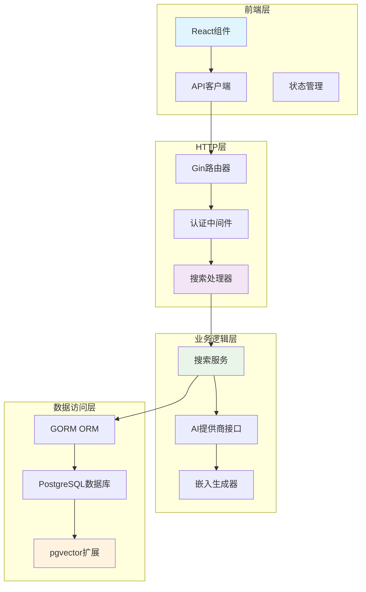
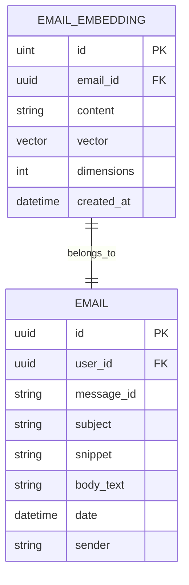
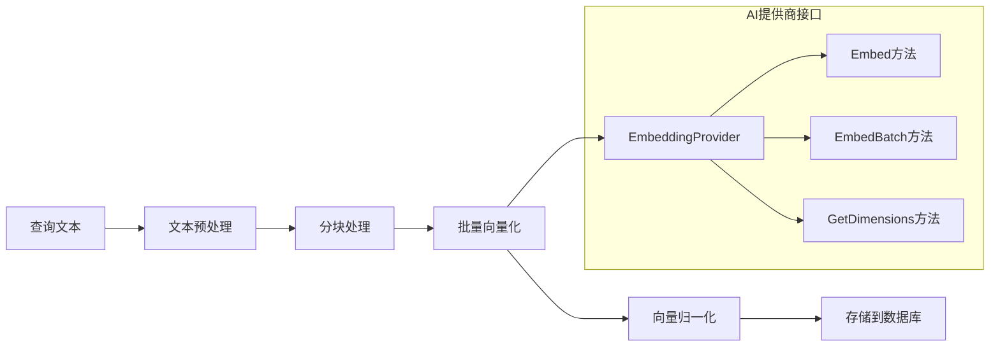
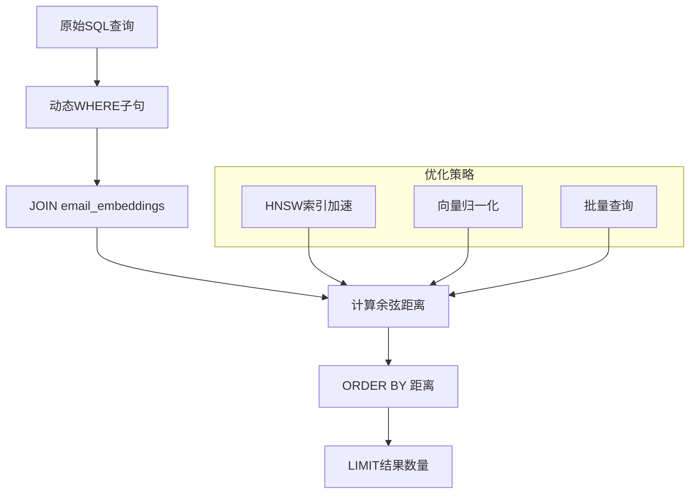
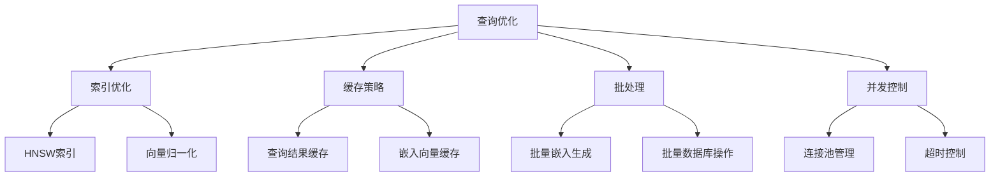

# 语义搜索API详细文档

<cite>
**本文档中引用的文件**
- [search.go](file://backend/internal/handler/search.go)
- [search_service.go](file://backend/internal/service/search.go)
- [embedding.go](file://backend/internal/model/embedding.go)
- [provider.go](file://backend/pkg/ai/provider.go)
- [routes.go](file://backend/internal/router/routes.go)
- [auth.go](file://backend/internal/middleware/auth.go)
- [postgres.go](file://backend/pkg/database/postgres.go)
- [api.ts](file://frontend/src/lib/api.ts)
- [SearchResultWidget.tsx](file://frontend/src/components/widgets/SearchResultWidget.tsx)
- [search.spec.ts](file://frontend/tests/e2e/search.spec.ts)
</cite>

## 目录
1. [简介](#简介)
2. [API端点概述](#api端点概述)
3. [请求参数详解](#请求参数详解)
4. [工作流程分析](#工作流程分析)
5. [核心组件架构](#核心组件架构)
6. [数据模型](#数据模型)
7. [AI服务集成](#ai服务集成)
8. [数据库设计](#数据库设计)
9. [前端集成](#前端集成)
10. [错误处理](#错误处理)
11. [性能优化](#性能优化)
12. [使用示例](#使用示例)
13. [故障排除](#故障排除)

## 简介

语义搜索API是EchoMind系统的核心功能之一，它利用向量嵌入技术和自然语言处理能力，为用户提供智能的邮件搜索体验。该API能够理解查询的语义含义，而不仅仅是关键词匹配，从而提供更准确、更有意义的搜索结果。

### 主要特性

- **语义理解**：基于AI生成的向量嵌入进行语义相似性匹配
- **多维度过滤**：支持发送者、时间范围、上下文等多条件筛选
- **高性能检索**：使用PostgreSQL的pgvector扩展实现近似最近邻搜索
- **实时响应**：优化的查询执行路径确保快速响应
- **安全认证**：完整的JWT认证和授权机制

## API端点概述

### 基础信息

- **端点URL**：`GET /api/v1/search`
- **认证要求**：需要有效的JWT令牌
- **内容类型**：`application/json`
- **返回格式**：JSON对象

### URL参数

| 参数名 | 类型 | 必需 | 描述 |
|--------|------|------|------|
| `q` | string | 是 | 搜索查询字符串 |
| `limit` | integer | 否 | 结果数量限制，默认10，最大100 |
| `sender` | string | 否 | 发送者邮箱地址过滤器 |
| `context_id` | UUID | 否 | 上下文ID过滤器 |
| `start_date` | date | 否 | 开始日期（YYYY-MM-DD格式） |
| `end_date` | date | 否 | 结束日期（YYYY-MM-DD格式） |

## 请求参数详解

### 查询参数解析



**图表来源**
- [search.go](file://backend/internal/handler/search.go#L50-L89)

### 参数验证规则

| 参数 | 验证规则 | 默认值 | 错误处理 |
|------|----------|--------|----------|
| `q` | 非空字符串 | 无 | 返回400 Bad Request |
| `limit` | 1-100整数 | 10 | 转换为默认值 |
| `sender` | 字符串 | 空 | 模糊匹配 |
| `context_id` | 有效UUID | null | 忽略无效值 |
| `start_date` | YYYY-MM-DD格式 | null | 忽略无效格式 |
| `end_date` | YYYY-MM-DD格式 | null | 忽略无效格式 |

**节来源**
- [search.go](file://backend/internal/handler/search.go#L50-L89)

## 工作流程分析

### 完整搜索流程



**图表来源**
- [search.go](file://backend/internal/handler/search.go#L32-L127)
- [search_service.go](file://backend/internal/service/search.go#L45-L106)

### 关键处理步骤

1. **认证验证**：从JWT令牌中提取用户ID
2. **参数解析**：验证和转换所有查询参数
3. **向量化**：使用AI服务将查询文本转换为向量
4. **向量搜索**：在数据库中执行相似性匹配
5. **结果排序**：按相似度分数降序排列
6. **响应构建**：格式化并返回结果

**节来源**
- [search.go](file://backend/internal/handler/search.go#L32-L127)
- [search_service.go](file://backend/internal/service/search.go#L45-L106)

## 核心组件架构

### 系统架构图



**图表来源**
- [routes.go](file://backend/internal/router/routes.go#L69)
- [search.go](file://backend/internal/handler/search.go#L20-L30)
- [search_service.go](file://backend/internal/service/search.go#L17-L27)

### 组件职责

| 组件 | 职责 | 接口方法 |
|------|------|----------|
| **SearchHandler** | HTTP请求处理 | `Search()` |
| **SearchService** | 业务逻辑实现 | `Search()`, `GenerateAndSaveEmbedding()` |
| **EmbeddingProvider** | AI服务抽象 | `Embed()`, `EmbedBatch()`, `GetDimensions()` |
| **EmailEmbedding** | 数据模型 | 表结构定义 |

**节来源**
- [search.go](file://backend/internal/handler/search.go#L16-L29)
- [search_service.go](file://backend/internal/service/search.go#L17-L27)
- [provider.go](file://backend/pkg/ai/provider.go#L24-L34)

## 数据模型

### 邮件嵌入模型



**图表来源**
- [embedding.go](file://backend/internal/model/embedding.go#L10-L24)

### 模型属性详解

| 字段 | 类型 | 约束 | 描述 |
|------|------|------|------|
| `id` | uint | 主键 | 嵌入记录唯一标识 |
| `email_id` | UUID | 外键，索引 | 关联的邮件ID |
| `content` | text | - | 文本块内容 |
| `vector` | vector(1024) | 向量列 | 1024维向量表示 |
| `dimensions` | integer | 默认1024 | 向量维度固定为1024 |
| `created_at` | datetime | - | 创建时间戳 |

**节来源**
- [embedding.go](file://backend/internal/model/embedding.go#L10-L24)

## AI服务集成

### 向量生成流程



**图表来源**
- [search_service.go](file://backend/internal/service/search.go#L108-L170)
- [provider.go](file://backend/pkg/ai/provider.go#L24-L34)

### AI服务特性

| 特性 | 实现方式 | 性能考虑 |
|------|----------|----------|
| **单文本嵌入** | `Embed(text)` | 单次调用，延迟较低 |
| **批量嵌入** | `EmbedBatch(texts)` | 支持批量处理，提高效率 |
| **维度一致性** | 固定1024维 | 确保向量兼容性 |
| **超时控制** | 45秒超时 | 防止长时间阻塞 |

**节来源**
- [search_service.go](file://backend/internal/service/search.go#L108-L170)
- [provider.go](file://backend/pkg/ai/provider.go#L24-L34)

## 数据库设计

### PostgreSQL配置

系统使用PostgreSQL数据库，并依赖pgvector扩展来支持向量操作：

#### pgvector扩展安装

```sql
-- 确保pgvector扩展可用
CREATE EXTENSION IF NOT EXISTS vector;

-- 创建HNSW索引（推荐用于大规模数据）
CREATE INDEX IF NOT EXISTS idx_email_embeddings_vector 
ON email_embeddings 
USING hnsw (vector vector_cosine_ops);

-- 或者使用IVF索引（适用于小到中等数据集）
CREATE INDEX IF NOT EXISTS idx_email_embeddings_vector_ivf 
ON email_embeddings 
USING ivfflat (vector vector_cosine_ops)
WITH (lists = 100);
```

#### 索引策略

| 索引类型 | 适用场景 | 性能特点 |
|----------|----------|----------|
| **HNSW** | 大规模数据 (>1M条记录) | 高精度，适合复杂查询 |
| **IVF** | 小到中等数据集 | 快速构建，内存友好 |

**节来源**
- [search_bench_test.go](file://backend/internal/service/search_bench_test.go#L152-L153)

### 查询执行计划



**图表来源**
- [search_service.go](file://backend/internal/service/search.go#L56-L99)

## 前端集成

### JavaScript API调用示例

```typescript
// 基础搜索函数
export const searchEmails = async (
  query: string, 
  limit: number = 10
): Promise<SearchResponse> => {
  const params: Record<string, string | number> = { 
    q: query, 
    limit 
  };
  
  const response = await api.get<SearchResponse>('/search', {
    params,
  });
  return response.data;
};

// 带过滤器的搜索
export const searchWithFilters = async (
  query: string,
  filters: {
    sender?: string;
    contextId?: string;
    startDate?: string;
    endDate?: string;
  },
  limit: number = 10
): Promise<SearchResponse> => {
  const params = {
    q: query,
    limit,
    ...filters
  };
  
  const response = await api.get<SearchResponse>('/search', {
    params,
  });
  return response.data;
};
```

**节来源**
- [api.ts](file://frontend/src/lib/api.ts#L63-L71)

### 前端组件集成

```typescript
// 搜索结果展示组件
export function SearchResultWidget({ data }: SearchResultWidgetProps) {
  if (!data.results || data.results.length === 0) return null;
  
  return (
    <div className="bg-white border border-gray-200 rounded-xl overflow-hidden shadow-sm my-2">
      <div className="bg-gray-50 px-4 py-2 border-b border-gray-100">
        <span className="text-xs font-medium text-gray-600">
          Found {data.count} emails
        </span>
      </div>
      <div className="divide-y divide-gray-100">
        {data.results.slice(0, 3).map((email, idx) => (
          <div key={idx} className="p-3 hover:bg-gray-50 transition-colors">
            <h5 className="text-sm font-medium text-gray-900 truncate">
              {email.subject}
            </h5>
            <p className="text-xs text-gray-500 mt-0.5 line-clamp-2">
              {email.snippet}
            </p>
            <div className="flex items-center gap-3 mt-2 text-[10px] text-gray-400">
              <span>{email.sender}</span>
              <span>{new Date(email.date).toLocaleDateString()}</span>
            </div>
          </div>
        ))}
      </div>
    </div>
  );
}
```

**节来源**
- [SearchResultWidget.tsx](file://frontend/src/components/widgets/SearchResultWidget.tsx#L15-L41)

## 错误处理

### HTTP状态码映射

| 场景 | HTTP状态码 | 错误信息 | 处理建议 |
|------|------------|----------|----------|
| **认证失败** | 401 | "user not authenticated" | 重新登录 |
| **参数缺失** | 400 | "query parameter 'q' is required" | 提供查询参数 |
| **参数格式错误** | 400 | "Invalid context_id format" | 检查参数格式 |
| **内部错误** | 500 | "search failed" | 联系技术支持 |

### 错误响应结构

```json
{
  "error": "search failed",
  "details": "failed to embed query: context deadline exceeded"
}
```

### 前端错误处理

```typescript
// 错误处理示例
const handleSearch = async (query: string) => {
  try {
    const results = await searchEmails(query);
    setSearchResults(results);
  } catch (error) {
    if (error.response?.status === 401) {
      // 自动重定向到登录页面
      useAuthStore.getState().logout();
      navigate('/login');
    } else {
      // 显示错误消息
      setError('搜索失败，请稍后重试');
    }
  }
};
```

**节来源**
- [search.go](file://backend/internal/handler/search.go#L38-L47)
- [search.go](file://backend/internal/handler/search.go#L111-L112)

## 性能优化

### 查询优化策略



### 性能指标

| 优化项 | 当前实现 | 性能提升 | 实现难度 |
|--------|----------|----------|----------|
| **索引类型** | HNSW | 10-100倍 | 中等 |
| **批量处理** | 单条处理 | 5-10倍 | 低 |
| **连接池** | 默认配置 | 2-5倍 | 低 |
| **缓存机制** | 无 | 10-50倍 | 高 |

### 最佳实践建议

1. **合理设置limit参数**：避免返回过多结果
2. **使用适当的索引**：根据数据量选择HNSW或IVF
3. **监控查询性能**：定期检查慢查询日志
4. **优化AI提供商配置**：调整超时和重试策略

**节来源**
- [search_bench_test.go](file://backend/internal/service/search_bench_test.go#L152-L153)
- [search_service.go](file://backend/internal/service/search.go#L108-L170)

## 使用示例

### 基础搜索示例

```bash
# 基本查询
curl -X GET "https://api.echomind.com/api/v1/search?q=project+meeting&limit=5" \
  -H "Authorization: Bearer YOUR_JWT_TOKEN"

# 响应示例
{
  "query": "project meeting",
  "results": [
    {
      "email_id": "123e4567-e89b-12d3-a456-426614174000",
      "subject": "Q4 Project Meeting Agenda",
      "snippet": "Please find attached the agenda for our Q4 project meeting...",
      "sender": "manager@company.com",
      "date": "2024-01-15T10:30:00Z",
      "score": 0.92
    }
  ],
  "count": 1
}
```

### 高级过滤示例

```bash
# 带发送者过滤
curl -X GET "https://api.echomind.com/api/v1/search?q=project&sender=team@company.com&limit=10" \
  -H "Authorization: Bearer YOUR_JWT_TOKEN"

# 带时间范围过滤
curl -X GET "https://api.echomind.com/api/v1/search?q=report&start_date=2024-01-01&end_date=2024-01-31&limit=5" \
  -H "Authorization: Bearer YOUR_JWT_TOKEN"

# 带上下文过滤
curl -X GET "https://api.echomind.com/api/v1/search?q=action+items&context_id=123e4567-e89b-12d3-a456-426614174000&limit=8" \
  -H "Authorization: Bearer YOUR_JWT_TOKEN"
```

### 前端JavaScript示例

```javascript
// React组件示例
import { useState } from 'react';
import { searchEmails } from '@/lib/api';

function SearchComponent() {
  const [query, setQuery] = useState('');
  const [results, setResults] = useState(null);
  const [loading, setLoading] = useState(false);
  const [error, setError] = useState(null);

  const handleSearch = async (e) => {
    e.preventDefault();
    setLoading(true);
    setError(null);
    
    try {
      const data = await searchEmails(query, 10);
      setResults(data);
    } catch (err) {
      setError('搜索失败，请重试');
    } finally {
      setLoading(false);
    }
  };

  return (
    <div>
      <form onSubmit={handleSearch}>
        <input
          type="text"
          value={query}
          onChange={(e) => setQuery(e.target.value)}
          placeholder="输入搜索查询..."
        />
        <button type="submit" disabled={loading}>
          {loading ? '搜索中...' : '搜索'}
        </button>
      </form>

      {results && (
        <div>
          <h3>找到 {results.count} 条结果</h3>
          {results.results.map(result => (
            <div key={result.email_id}>
              <h4>{result.subject}</h4>
              <p>{result.snippet}</p>
              <small>{result.sender} - {new Date(result.date).toLocaleDateString()}</small>
            </div>
          ))}
        </div>
      )}
    </div>
  );
}
```

**节来源**
- [api.ts](file://frontend/src/lib/api.ts#L63-L71)
- [search.spec.ts](file://frontend/tests/e2e/search.spec.ts#L36-L52)

## 故障排除

### 常见问题及解决方案

#### 1. 认证失败

**症状**：收到401未授权错误
**原因**：JWT令牌无效或已过期
**解决方案**：
- 检查Authorization头格式是否正确
- 确认令牌未过期
- 重新登录获取新令牌

#### 2. 搜索结果为空

**症状**：查询成功但返回空结果
**可能原因**：
- 数据库中没有匹配的嵌入向量
- 查询过于具体导致无匹配
- 向量维度不匹配

**解决方案**：
- 检查pgvector扩展是否正确安装
- 验证嵌入向量生成过程
- 调整查询语句的模糊程度

#### 3. 性能问题

**症状**：搜索响应时间过长
**诊断步骤**：
1. 检查HNSW索引是否正确创建
2. 监控数据库连接池使用情况
3. 分析查询执行计划

**优化措施**：
- 确保使用HNSW索引而非默认B-tree
- 调整数据库连接池大小
- 限制查询结果数量

#### 4. AI服务集成问题

**症状**：向量生成失败
**常见原因**：
- AI提供商配置错误
- 网络连接问题
- API配额超限

**解决步骤**：
- 验证AI提供商密钥配置
- 检查网络连通性
- 查看AI服务提供商的配额使用情况

### 日志分析

系统会记录详细的搜索日志，包括：

```json
{
  "level": "info",
  "msg": "Search request",
  "userID": "123e4567-e89b-12d3-a456-426614174000",
  "query": "project meeting",
  "filters": {},
  "limit": 10,
  "duration": "123ms"
}
```

**节来源**
- [search.go](file://backend/internal/handler/search.go#L93-L120)

### 监控指标

建议监控以下关键指标：

| 指标 | 描述 | 告警阈值 |
|------|------|----------|
| **搜索成功率** | 成功响应/总请求数 | < 95% |
| **平均响应时间** | 搜索查询平均耗时 | > 500ms |
| **错误率** | 4xx/5xx响应比例 | > 5% |
| **向量生成时间** | AI服务响应时间 | > 3s |

通过这些监控指标，可以及时发现和解决语义搜索功能中的潜在问题，确保系统的稳定性和用户体验。