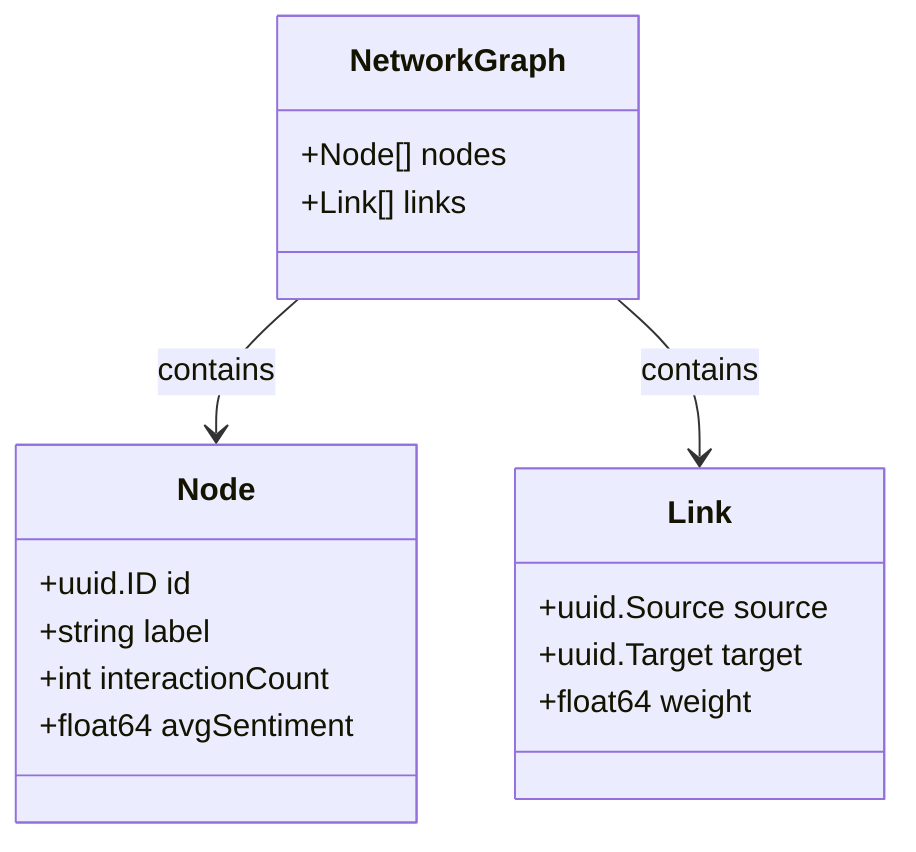
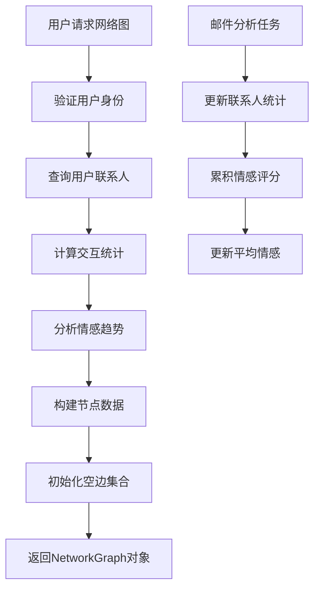
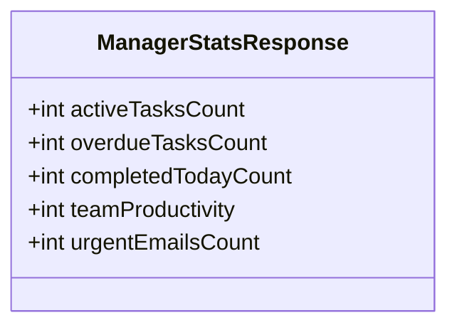
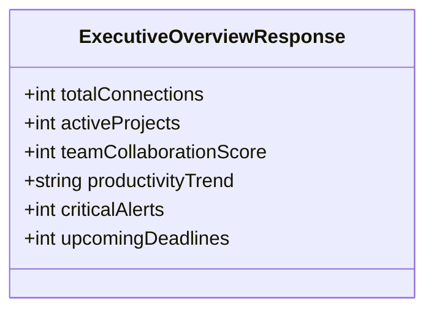
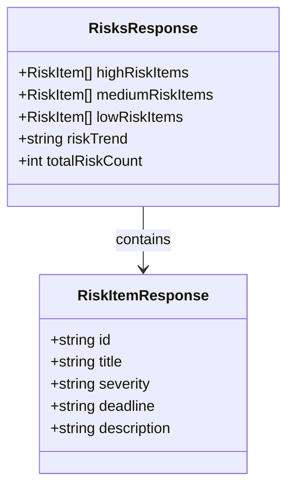
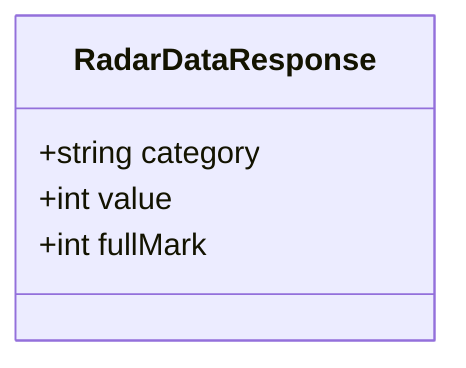
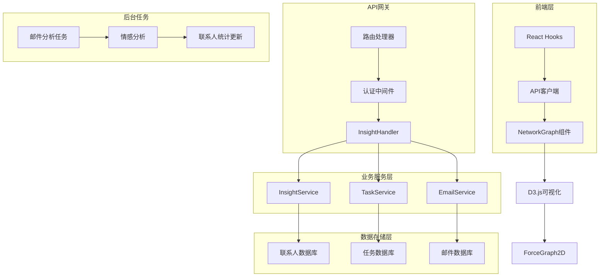

# 洞察与分析API参考

<cite>
**本文档中引用的文件**
- [backend/internal/handler/insight.go](file://backend/internal/handler/insight.go)
- [backend/internal/service/insight.go](file://backend/internal/service/insight.go)
- [backend/internal/tasks/analyze.go](file://backend/internal/tasks/analyze.go)
- [backend/internal/router/routes.go](file://backend/internal/router/routes.go)
- [frontend/src/app/dashboard/insights/NetworkGraphClient.tsx](file://frontend/src/app/dashboard/insights/NetworkGraphClient.tsx)
- [frontend/src/components/insights/NetworkGraph.tsx](file://frontend/src/components/insights/NetworkGraph.tsx)
- [frontend/src/hooks/useManagerStats.ts](file://frontend/src/hooks/useManagerStats.ts)
- [frontend/src/hooks/useExecutiveOverview.ts](file://frontend/src/hooks/useExecutiveOverview.ts)
- [frontend/src/hooks/useRisks.ts](file://frontend/src/hooks/useRisks.ts)
- [frontend/src/hooks/useDealmakerRadar.ts](file://frontend/src/hooks/useDealmakerRadar.ts)
- [frontend/src/lib/api.ts](file://frontend/src/lib/api.ts)
</cite>

## 目录
1. [简介](#简介)
2. [API端点概览](#api端点概览)
3. [网络图数据API](#网络图数据api)
4. [管理者统计API](#管理者统计api)
5. [高管概览API](#高管概览api)
6. [风险识别API](#风险识别api)
7. [交易雷达API](#交易雷达api)
8. [数据流架构](#数据流架构)
9. [前端集成指南](#前端集成指南)
10. [错误处理](#错误处理)

## 简介

EchoMind的洞察与分析功能提供了强大的数据分析能力，通过多个专门的API端点为用户提供深入的业务洞察。这些API涵盖了从联系人网络分析到风险管理的全方位洞察，支持实时数据更新和可视化展示。

## API端点概览

所有洞察API都遵循统一的RESTful设计原则，位于`/api/v1/insights/`路径下：

| 端点 | 方法 | 描述 | 响应格式 |
|------|------|------|----------|
| `/insights/network` | GET | 获取联系人网络图数据 | NetworkGraph |
| `/insights/manager/stats` | GET | 获取管理者统计信息 | ManagerStatsResponse |
| `/insights/executive/overview` | GET | 获取高管概览信息 | ExecutiveOverviewResponse |
| `/insights/risks` | GET | 识别潜在风险 | RisksResponse |
| `/insights/dealmaker/radar` | GET | 获取交易雷达数据 | []RadarDataResponse |

## 网络图数据API

### 端点详情
**GET** `/api/v1/insights/network`

该API用于获取用户的联系人网络图数据，构建可视化的社交网络关系图。

### 请求参数
- **认证**: 需要有效的JWT令牌
- **用户上下文**: 自动从认证令牌中提取用户ID

### 响应结构



**图表来源**
- [backend/internal/service/insight.go](file://backend/internal/service/insight.go#L11-L32)

#### 节点属性详解

| 字段名 | 类型 | 描述 | 示例值 |
|--------|------|------|--------|
| `id` | UUID | 联系人唯一标识符 | `"550e8400-e29b-41d4-a716-446655440000"` |
| `label` | string | 显示名称或电子邮件地址 | `"john.doe@example.com"` |
| `interactionCount` | int | 交互次数统计 | `15` |
| `avgSentiment` | float64 | 平均情感分数（-1.0到1.0） | `0.75` |

#### 边属性详解

| 字段名 | 类型 | 描述 | 示例值 |
|--------|------|------|--------|
| `source` | UUID | 源节点ID | `"550e8400-e29b-41d4-a716-446655440000"` |
| `target` | UUID | 目标节点ID | `"660f9500-f30c-52e5-b827-557766551111"` |
| `weight` | float64 | 关系强度权重 | `0.8` |

### 后台数据生成流程

网络图数据通过以下流程生成：



**图表来源**
- [backend/internal/service/insight.go](file://backend/internal/service/insight.go#L49-L72)
- [backend/internal/tasks/analyze.go](file://backend/internal/tasks/analyze.go#L191-L245)

**章节来源**
- [backend/internal/handler/insight.go](file://backend/internal/handler/insight.go#L31-L42)
- [backend/internal/service/insight.go](file://backend/internal/service/insight.go#L11-L73)

## 管理者统计API

### 端点详情
**GET** `/api/v1/insights/manager/stats`

该API为管理者提供关键的工作效率指标和任务管理统计信息。

### 响应结构



**图表来源**
- [backend/internal/handler/insight.go](file://backend/internal/handler/insight.go#L314-L321)

### 统计指标详解

| 指标名称 | 类型 | 描述 | 计算逻辑 |
|----------|------|------|----------|
| `activeTasksCount` | int | 当前活跃任务数量 | TODO + IN_PROGRESS状态任务总数 |
| `overdueTasksCount` | int | 已逾期任务数量 | 截止日期已过且非完成状态的任务 |
| `completedTodayCount` | int | 今日完成任务数量 | STATUS为DONE且创建日期为当天的任务 |
| `teamProductivity` | int | 团队生产力评分（百分比） | 固定值85（未来可动态计算） |
| `urgentEmailsCount` | int | 紧急邮件数量 | WORK分类且未读的邮件数量 |

### 数据来源

管理者统计数据来源于两个核心服务：
- **任务服务**: 分析用户的待办事项和项目进度
- **邮件服务**: 统计工作邮件的阅读状态和优先级

**章节来源**
- [backend/internal/handler/insight.go](file://backend/internal/handler/insight.go#L44-L94)

## 高管概览API

### 端点详情
**GET** `/api/v1/insights/executive/overview`

该API提供高管级别的业务概览，包括团队协作、项目进展和关键指标。

### 响应结构



**图表来源**
- [backend/internal/handler/insight.go](file://backend/internal/handler/insight.go#L322-L330)

### 关键指标说明

| 指标 | 数值 | 描述 |
|------|------|------|
| `totalConnections` | 1247 | 总联系人数量 |
| `activeProjects` | 8 | 正在进行的项目数量 |
| `teamCollaborationScore` | 92 | 团队协作评分（百分制） |
| `productivityTrend` | "upward" | 生产力趋势（upward/downward/stable） |
| `criticalAlerts` | 2 | 关键警告数量 |
| `upcomingDeadlines` | 5 | 即将到期的截止日期数量 |

**章节来源**
- [backend/internal/handler/insight.go](file://backend/internal/handler/insight.go#L56-L68)

## 风险识别API

### 端点详情
**GET** `/api/v1/insights/risks`

该API识别和分类潜在的业务风险，帮助用户提前采取预防措施。

### 响应结构



**图表来源**
- [backend/internal/handler/insight.go](file://backend/internal/handler/insight.go#L338-L344)
- [backend/internal/handler/insight.go](file://backend/internal/handler/insight.go#L346-L352)

### 风险分类体系

| 严重程度 | 风险类型 | 示例描述 |
|----------|----------|----------|
| 高风险 | 关键客户续约 | 重要客户合同即将到期，需要及时跟进 |
| 高风险 | 项目延期风险 | Q1项目进度落后于计划 |
| 中风险 | 人员变动 | 核心团队成员可能离职 |
| 低风险 | 预算超支 | 部门预算略有超支 |

### 风险趋势分析

系统会根据风险的变化情况自动计算风险趋势：
- **increasing**: 风险数量增加
- **decreasing**: 风险数量减少  
- **stable**: 风险数量保持稳定

**章节来源**
- [backend/internal/handler/insight.go](file://backend/internal/handler/insight.go#L225-L270)

## 交易雷达API

### 端点详情
**GET** `/api/v1/insights/dealmaker/radar`

该API提供交易决策支持的多维度评估数据，采用雷达图形式展示。

### 响应结构



**图表来源**
- [backend/internal/handler/insight.go](file://backend/internal/handler/insight.go#L332-L336)

### 雷达评估维度

| 评估维度 | 当前得分 | 满分 | 描述 |
|----------|----------|------|------|
| 购买意向 | 120 | 150 | 客户购买意愿评估 |
| 合作机会 | 98 | 150 | 可能的合作机会评分 |
| 市场洞察 | 86 | 150 | 市场趋势理解程度 |
| 客户关系 | 130 | 150 | 客户关系质量评估 |
| 竞争优势 | 75 | 150 | 竞争地位分析 |
| 潜在收入 | 110 | 150 | 收入潜力评估 |

### 数据计算逻辑

雷达数据基于以下因素综合计算：
- 历史交易数据
- 市场分析结果
- 客户行为模式
- 竞争情报

**章节来源**
- [backend/internal/handler/insight.go](file://backend/internal/handler/insight.go#L69-L81)

## 数据流架构

### 整体架构图



**图表来源**
- [backend/internal/handler/insight.go](file://backend/internal/handler/insight.go#L12-L16)
- [backend/internal/service/insight.go](file://backend/internal/service/insight.go#L34-L47)
- [backend/internal/tasks/analyze.go](file://backend/internal/tasks/analyze.go#L55-L185)

### 数据处理流程

1. **实时数据收集**: 邮件分析任务自动处理新邮件
2. **统计聚合**: 系统定期更新各类统计指标
3. **缓存策略**: 使用React Query进行智能缓存
4. **增量更新**: 只更新变化的数据部分

**章节来源**
- [backend/internal/tasks/analyze.go](file://backend/internal/tasks/analyze.go#L55-L185)

## 前端集成指南

### 基础集成步骤

#### 1. 安装依赖包

```bash
npm install react-force-graph-2d @tanstack/react-query
```

#### 2. 创建API Hook

```typescript
// useNetworkGraph.ts
import { useQuery } from '@tanstack/react-query'
import api from '@/lib/api'

interface NetworkGraphData {
  nodes: Node[]
  links: Link[]
}

interface Node {
  id: string
  label: string
  interactionCount: number
  avgSentiment: number
}

interface Link {
  source: string
  target: string
  weight: number
}

export const useNetworkGraph = () => {
  return useQuery({
    queryKey: ['network-graph'],
    queryFn: async (): Promise<NetworkGraphData> => {
      const { data } = await api.get('/insights/network')
      return data
    },
    staleTime: 5 * 60 * 1000, // 5分钟
    refetchInterval: 10 * 60 * 1000, // 10分钟
  })
}
```

#### 3. 实现可视化组件

```typescript
// NetworkGraph.tsx
import React, { useEffect, useRef, useState } from 'react'
import ForceGraph2D from 'react-force-graph-2d'
import { useNetworkGraph } from './hooks/useNetworkGraph'

export default function NetworkGraph() {
  const { data, isLoading, error } = useNetworkGraph()
  const fgRef = useRef(null)

  useEffect(() => {
    if (fgRef.current && data) {
      // 自动调整视图
      fgRef.current.zoomToFit(400)
      fgRef.current.d3ReheatSimulation()
    }
  }, [data])

  if (isLoading) return <div>加载中...</div>
  if (error) return <div>加载失败: {error.message}</div>
  if (!data || data.nodes.length === 0) return <div>暂无数据</div>

  return (
    <ForceGraph2D
      ref={fgRef}
      graphData={data}
      nodeId="id"
      nodeLabel={node => `${node.label}\n(${node.interactionCount}次交互)`}
      nodeColor={node => node.avgSentiment > 0.3 ? 'green' : 
                  node.avgSentiment < -0.3 ? 'red' : 'gray'}
      linkColor={() => 'rgba(0,0,0,0.2)'}
      linkWidth={link => link.weight * 0.5}
      nodeCanvasObject={(node, ctx, globalScale) => {
        // 自定义节点绘制逻辑
      }}
    />
  )
}
```

#### 4. 在页面中使用

```typescript
// InsightsPage.tsx
import NetworkGraph from './NetworkGraph'

export default function InsightsPage() {
  return (
    <div className="space-y-6">
      <h1 className="text-2xl font-bold">业务洞察</h1>
      
      <div className="bg-white rounded-lg shadow">
        <h2 className="text-lg font-semibold p-4 border-b">联系人网络</h2>
        <div className="h-96">
          <NetworkGraph />
        </div>
      </div>
    </div>
  )
}
```

### D3.js集成示例

以下是使用D3.js渲染网络图的简化示例：

```javascript
// D3.js 渲染示例
function renderNetworkGraph(data) {
  const width = 800
  const height = 600
  
  const svg = d3.select("#graph-container")
    .append("svg")
    .attr("width", width)
    .attr("height", height)
  
  // 创建力导向图
  const simulation = d3.forceSimulation(data.nodes)
    .force("link", d3.forceLink(data.links).id(d => d.id))
    .force("charge", d3.forceManyBody())
    .force("center", d3.forceCenter(width / 2, height / 2))
  
  // 绘制链接
  const link = svg.append("g")
    .selectAll("line")
    .data(data.links)
    .enter().append("line")
    .attr("stroke", "#999")
    .attr("stroke-opacity", 0.6)
    .attr("stroke-width", d => Math.sqrt(d.value))
  
  // 绘制节点
  const node = svg.append("g")
    .selectAll("circle")
    .data(data.nodes)
    .enter().append("circle")
    .attr("r", 5)
    .attr("fill", d => getColorBySentiment(d.avgSentiment))
    .call(drag(simulation))
  
  // 更新事件
  simulation.on("tick", () => {
    link
      .attr("x1", d => d.source.x)
      .attr("y1", d => d.source.y)
      .attr("x2", d => d.target.x)
      .attr("y2", d => d.target.y)
    
    node
      .attr("cx", d => d.x)
      .attr("cy", d => d.y)
  })
}
```

**章节来源**
- [frontend/src/components/insights/NetworkGraph.tsx](file://frontend/src/components/insights/NetworkGraph.tsx#L1-L153)
- [frontend/src/hooks/useManagerStats.ts](file://frontend/src/hooks/useManagerStats.ts#L1-L22)

## 错误处理

### HTTP状态码

| 状态码 | 描述 | 处理建议 |
|--------|------|----------|
| 200 | 请求成功 | 正常处理响应数据 |
| 401 | 未授权 | 重新登录获取有效令牌 |
| 403 | 权限不足 | 检查用户权限设置 |
| 500 | 服务器内部错误 | 重试请求或联系技术支持 |

### 常见错误场景

1. **网络连接问题**
   ```javascript
   // 前端错误处理示例
   try {
     const response = await api.get('/insights/network')
     setGraphData(response.data)
   } catch (error) {
     if (error.response?.status === 401) {
       // 重新登录
       redirectToLogin()
     } else {
       // 显示错误消息
       setError('无法加载网络图数据，请稍后重试')
     }
   }
   ```

2. **数据格式错误**
   ```javascript
   // 数据验证示例
   const validateNetworkData = (data) => {
     if (!data || !Array.isArray(data.nodes)) {
       throw new Error('无效的网络图数据格式')
     }
     
     // 验证节点必需字段
     data.nodes.forEach(node => {
       if (!node.id || !node.label) {
         throw new Error('节点数据不完整')
       }
     })
   }
   ```

3. **性能优化建议**
   - 使用React Query进行智能缓存
   - 实现数据懒加载
   - 添加加载状态指示器
   - 设置合理的刷新间隔

**章节来源**
- [frontend/src/components/insights/NetworkGraph.tsx](file://frontend/src/components/insights/NetworkGraph.tsx#L54-L61)
- [backend/internal/handler/insight.go](file://backend/internal/handler/insight.go#L35-L42)