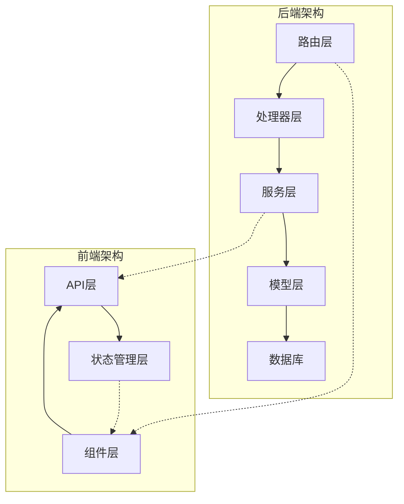
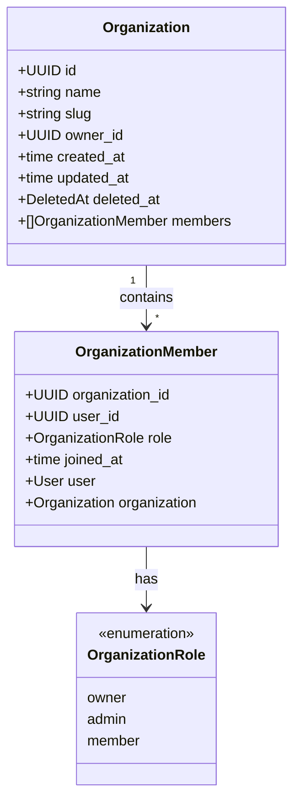
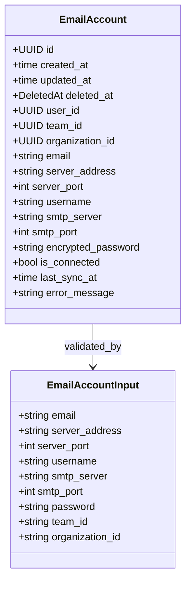
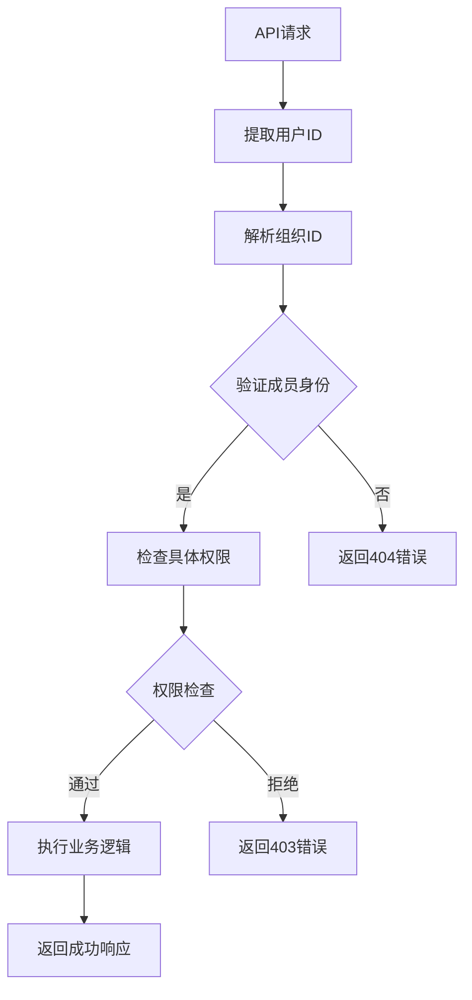
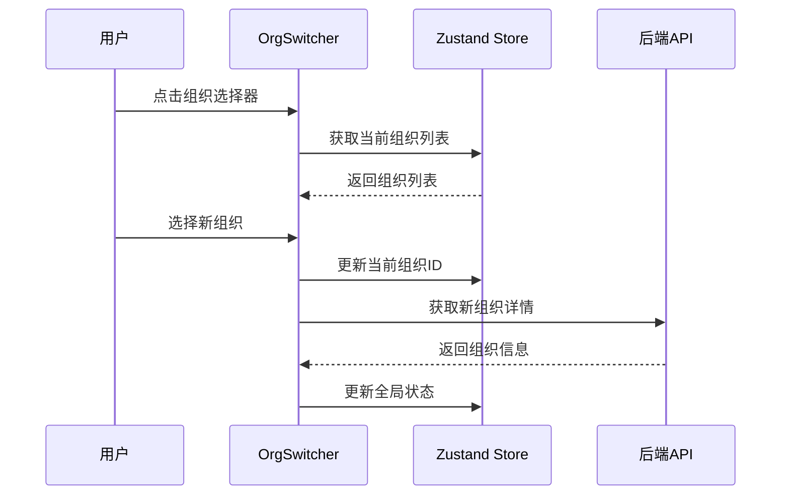
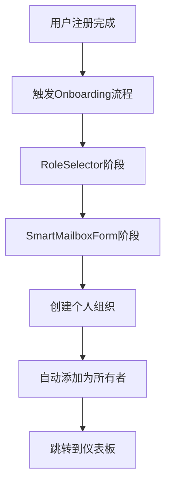
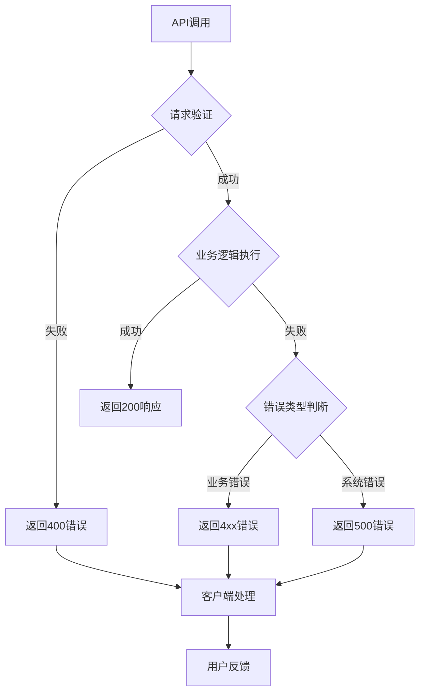

# 组织与账户API

<cite>
**本文档中引用的文件**
- [backend/internal/model/organization.go](file://backend/internal/model/organization.go)
- [backend/internal/model/account_input.go](file://backend/internal/model/account_input.go)
- [backend/internal/model/member.go](file://backend/internal/model/member.go)
- [backend/internal/model/email_account.go](file://backend/internal/model/email_account.go)
- [backend/internal/handler/organization.go](file://backend/internal/handler/organization.go)
- [backend/internal/service/organization.go](file://backend/internal/service/organization.go)
- [backend/internal/router/routes.go](file://backend/internal/router/routes.go)
- [backend/internal/service/account.go](file://backend/internal/service/account.go)
- [frontend/src/lib/api/organization.ts](file://frontend/src/lib/api/organization.ts)
- [frontend/src/lib/store/organization.ts](file://frontend/src/lib/store/organization.ts)
- [frontend/src/components/layout/OrgSwitcher.tsx](file://frontend/src/components/layout/OrgSwitcher.tsx)
- [frontend/src/components/layout/CreateOrganizationModal.tsx](file://frontend/src/components/layout/CreateOrganizationModal.tsx)
- [frontend/src/app/onboarding/OnboardingPageClient.tsx](file://frontend/src/app/onboarding/OnboardingPageClient.tsx)
- [backend/internal/handler/organization_test.go](file://backend/internal/handler/organization_test.go)
</cite>

## 目录
1. [简介](#简介)
2. [项目结构](#项目结构)
3. [核心概念](#核心概念)
4. [API端点详解](#api端点详解)
5. [数据模型](#数据模型)
6. [权限模型](#权限模型)
7. [前端集成](#前端集成)
8. [错误处理](#错误处理)
9. [最佳实践](#最佳实践)
10. [故障排除](#故障排除)

## 简介

EchoMind是一个基于AI的企业邮件管理平台，提供了完整的组织与账户管理体系。该系统支持多组织架构，允许用户在不同的工作空间之间切换，并通过IMAP连接管理多个电子邮件账户。

### 核心特性
- **多组织支持**：每个用户可以拥有多个组织，每个组织代表一个独立的工作空间
- **账户管理**：支持IMAP邮箱账户的连接、同步和管理
- **权限控制**：基于角色的访问控制（RBAC），支持所有者、管理员和普通成员
- **无缝切换**：前端提供组织切换功能，支持快速在不同组织间导航

## 项目结构



**图表来源**
- [backend/internal/router/routes.go](file://backend/internal/router/routes.go#L27-L46)
- [frontend/src/lib/api/organization.ts](file://frontend/src/lib/api/organization.ts#L1-L17)

## 核心概念

### 组织（Organization）
组织代表用户的工作空间，是系统中的主要实体。每个组织都有唯一的标识符、名称和所有者。

### 账户（Account）
账户指代连接的IMAP邮箱，用于邮件同步和管理。每个账户关联到具体的邮箱服务器凭据。

### 成员关系
组织通过成员关系与用户建立联系，支持多种角色和权限级别。

**章节来源**
- [backend/internal/model/organization.go](file://backend/internal/model/organization.go#L10-L21)
- [backend/internal/model/email_account.go](file://backend/internal/model/email_account.go#L10-L35)

## API端点详解

### 创建组织 - POST /api/v1/orgs

创建新的组织并自动添加当前用户为组织所有者。

#### 请求格式
```json
{
  "name": "My Awesome Team"
}
```

#### 响应格式
成功响应：
```json
{
  "id": "550e8400-e29b-41d4-a716-446655440000",
  "name": "My Awesome Team",
  "slug": "my-awesome-team-abc12345",
  "owner_id": "550e8400-e29b-41d4-a716-446655440000",
  "created_at": "2024-01-15T10:30:00Z",
  "updated_at": "2024-01-15T10:30:00Z"
}
```

#### 实现细节
- 自动生成唯一的slug用于URL路由
- 自动添加创建者为组织所有者
- 使用事务确保数据一致性

**章节来源**
- [backend/internal/handler/organization.go](file://backend/internal/handler/organization.go#L20-L39)
- [backend/internal/service/organization.go](file://backend/internal/service/organization.go#L151-L177)

### 列出用户所属组织 - GET /api/v1/orgs

获取当前用户所属的所有组织列表。

#### 响应格式
```json
[
  {
    "id": "550e8400-e29b-41d4-a716-446655440000",
    "name": "My Awesome Team",
    "slug": "my-awesome-team-abc12345",
    "owner_id": "550e8400-e29b-41d4-a716-446655440000",
    "created_at": "2024-01-15T10:30:00Z",
    "updated_at": "2024-01-15T10:30:00Z"
  }
]
```

#### 实现逻辑
- 通过用户ID查询其参与的所有组织
- 使用JOIN操作确保只返回用户有权限访问的组织

**章节来源**
- [backend/internal/handler/organization.go](file://backend/internal/handler/organization.go#L41-L52)
- [backend/internal/service/organization.go](file://backend/internal/service/organization.go#L125-L134)

### 获取特定组织信息 - GET /api/v1/orgs/:id

获取指定组织的详细信息。

#### 参数
- `id`: 组织UUID标识符

#### 响应格式
```json
{
  "id": "550e8400-e29b-41d4-a716-446655440000",
  "name": "My Awesome Team",
  "slug": "my-awesome-team-abc12345",
  "owner_id": "550e8400-e29b-41d4-a716-446655440000",
  "created_at": "2024-01-15T10:30:00Z",
  "updated_at": "2024-01-15T10:30:00Z"
}
```

#### 权限验证
- 验证请求用户是否为组织成员
- 如果不是成员或组织不存在，返回404错误

**章节来源**
- [backend/internal/handler/organization.go](file://backend/internal/handler/organization.go#L54-L74)
- [backend/internal/service/organization.go](file://backend/internal/service/organization.go#L136-L149)

### 获取组织成员列表 - GET /api/v1/orgs/:id/members

获取组织内所有成员的详细信息。

#### 响应格式
```json
[
  {
    "organization_id": "550e8400-e29b-41d4-a716-446655440000",
    "user_id": "550e8400-e29b-41d4-a716-446655440001",
    "role": "owner",
    "joined_at": "2024-01-15T10:30:00Z",
    "user": {
      "id": "550e8400-e29b-41d4-a716-446655440001",
      "name": "John Doe",
      "email": "john@example.com"
    }
  }
]
```

#### 实现特点
- 预加载用户信息以减少数据库查询
- 支持所有组织成员查看成员列表

**章节来源**
- [backend/internal/handler/organization.go](file://backend/internal/handler/organization.go#L76-L95)
- [backend/internal/service/organization.go](file://backend/internal/service/organization.go#L63-L75)

## 数据模型

### 组织模型



**图表来源**
- [backend/internal/model/organization.go](file://backend/internal/model/organization.go#L10-L21)
- [backend/internal/model/member.go](file://backend/internal/model/member.go#L17-L26)

### 账户模型



**图表来源**
- [backend/internal/model/email_account.go](file://backend/internal/model/email_account.go#L10-L35)
- [backend/internal/model/account_input.go](file://backend/internal/model/account_input.go#L4-L14)

**章节来源**
- [backend/internal/model/organization.go](file://backend/internal/model/organization.go#L1-L22)
- [backend/internal/model/member.go](file://backend/internal/model/member.go#L1-L27)
- [backend/internal/model/email_account.go](file://backend/internal/model/email_account.go#L1-L35)

## 权限模型

### 角色定义

系统采用基于角色的访问控制（RBAC）模型：

| 角色 | 权限范围 | 描述 |
|------|----------|------|
| Owner | 完全控制 | 组织的超级管理员，拥有所有权限 |
| Admin | 管理权限 | 可以管理组织设置和成员 |
| Member | 基础权限 | 可以访问组织资源和功能 |

### 权限验证流程



**图表来源**
- [backend/internal/service/organization.go](file://backend/internal/service/organization.go#L136-L149)

**章节来源**
- [backend/internal/model/member.go](file://backend/internal/model/member.go#L11-L15)

## 前端集成

### 创建组织API调用

前端通过专门的API模块调用组织创建功能：

```typescript
// 前端API调用示例
const createOrganization = async (name: string): Promise<Organization> => {
  const response = await api.post<Organization>(`/orgs`, { name });
  return response.data;
};
```

### 组织切换组件



**图表来源**
- [frontend/src/components/layout/OrgSwitcher.tsx](file://frontend/src/components/layout/OrgSwitcher.tsx#L11-L66)
- [frontend/src/lib/store/organization.ts](file://frontend/src/lib/store/organization.ts#L13-L38)

### Onboarding流程中的组织创建

在用户注册后的引导流程中，系统会自动创建个人组织：



**图表来源**
- [frontend/src/app/onboarding/OnboardingPageClient.tsx](file://frontend/src/app/onboarding/OnboardingPageClient.tsx#L12-L71)

**章节来源**
- [frontend/src/lib/api/organization.ts](file://frontend/src/lib/api/organization.ts#L1-L17)
- [frontend/src/components/layout/OrgSwitcher.tsx](file://frontend/src/components/layout/OrgSwitcher.tsx#L1-L66)

## 错误处理

### 常见错误场景

| HTTP状态码 | 错误类型 | 描述 | 解决方案 |
|------------|----------|------|----------|
| 400 | Bad Request | 无效的组织ID或请求格式 | 检查请求参数格式 |
| 404 | Not Found | 组织不存在或访问被拒绝 | 验证组织ID和用户权限 |
| 409 | Conflict | 组织名称冲突 | 提供唯一名称 |
| 500 | Internal Server Error | 服务器内部错误 | 重试请求或联系支持 |

### 名称冲突处理

当尝试创建同名组织时，系统会返回409 Conflict错误：

```json
{
  "error": "organization name already exists"
}
```

### 错误处理最佳实践



**章节来源**
- [backend/internal/handler/organization.go](file://backend/internal/handler/organization.go#L25-L36)
- [backend/internal/handler/organization.go](file://backend/internal/handler/organization.go#L68-L70)

## 最佳实践

### 组织命名规范
- 使用清晰、有意义的名称
- 避免使用特殊字符
- 考虑国际化需求

### 权限管理
- 最小权限原则
- 定期审查成员权限
- 及时移除不再需要的成员

### 性能优化
- 使用预加载减少数据库查询
- 实施适当的缓存策略
- 优化数据库索引

### 安全考虑
- 加密敏感数据
- 实施适当的访问控制
- 定期安全审计

## 故障排除

### 常见问题及解决方案

#### 1. 组织创建失败
**症状**：创建组织时返回500错误
**可能原因**：
- 数据库连接问题
- 并发创建相同名称的组织
- 权限不足

**解决方案**：
- 检查数据库连接状态
- 添加重试机制
- 验证用户权限

#### 2. 组织切换无响应
**症状**：点击组织切换按钮无反应
**可能原因**：
- 前端状态管理问题
- API调用失败
- 网络连接问题

**解决方案**：
- 检查浏览器控制台错误
- 验证网络连接
- 清除浏览器缓存

#### 3. 成员列表为空
**症状**：获取成员列表返回空数组
**可能原因**：
- 用户未加入任何组织
- 查询条件错误
- 数据库连接问题

**解决方案**：
- 验证用户是否已创建组织
- 检查查询逻辑
- 查看数据库日志

**章节来源**
- [backend/internal/handler/organization_test.go](file://backend/internal/handler/organization_test.go#L27-L61)
- [frontend/src/components/layout/CreateOrganizationModal.tsx](file://frontend/src/components/layout/CreateOrganizationModal.tsx#L22-L34)