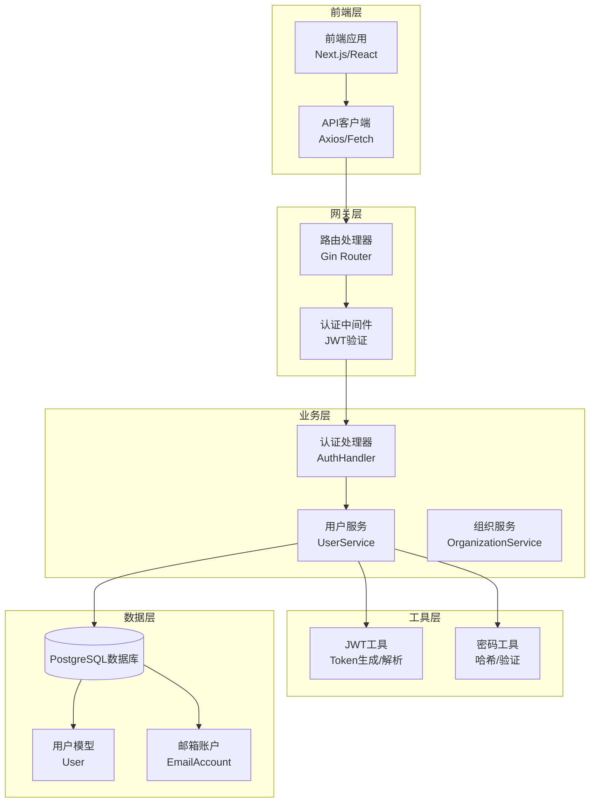
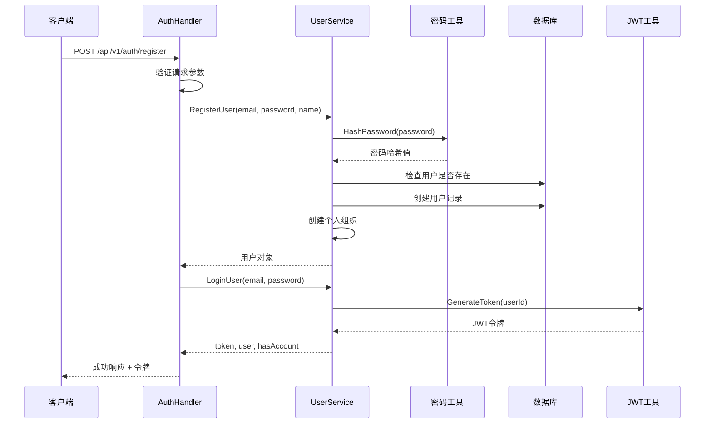
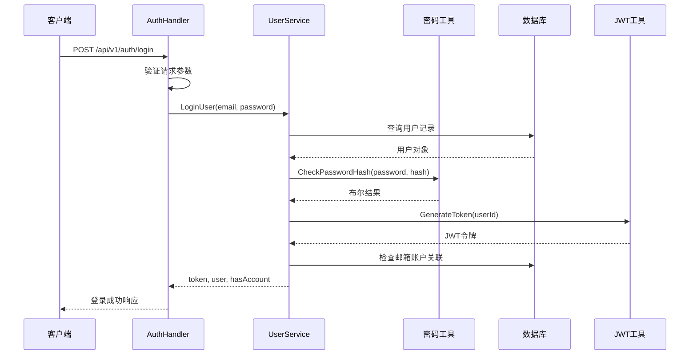
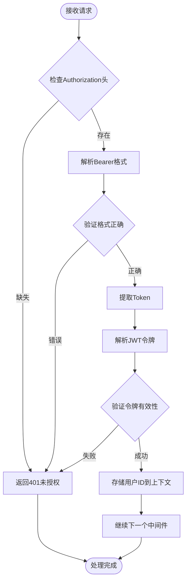
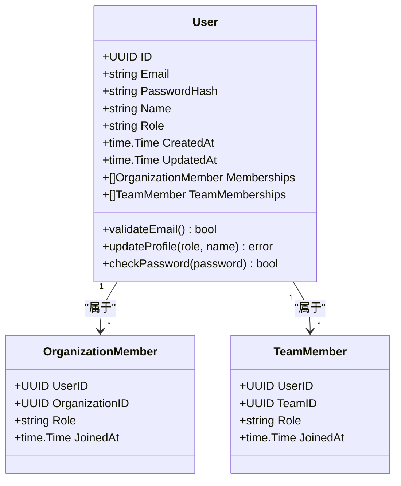
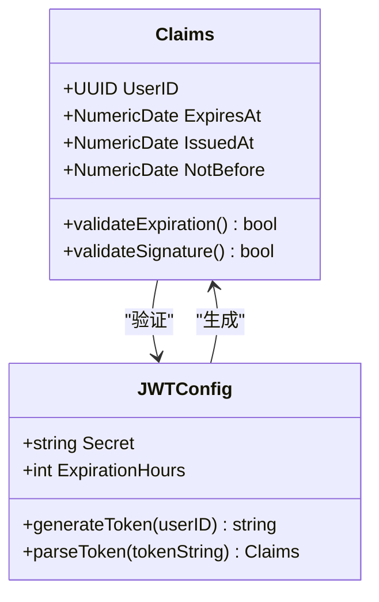
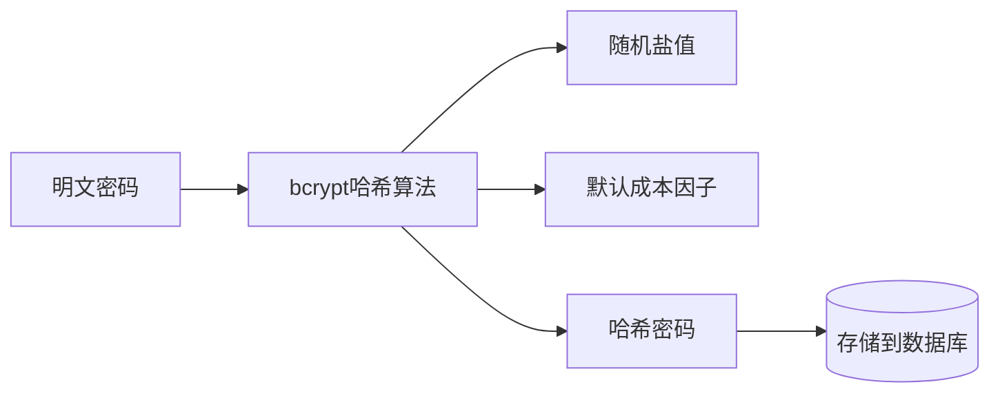
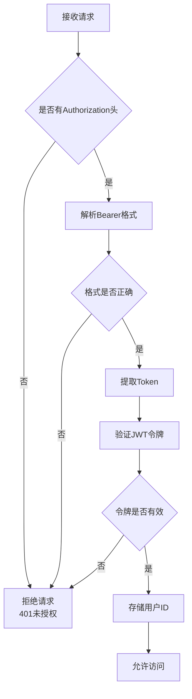

# EchoMind认证API详细文档

<cite>
**本文档中引用的文件**
- [auth.go](file://backend/internal/handler/auth.go)
- [user.go](file://backend/internal/model/user.go)
- [jwt.go](file://backend/pkg/utils/jwt.go)
- [password.go](file://backend/pkg/utils/password.go)
- [routes.go](file://backend/internal/router/routes.go)
- [user.go](file://backend/internal/service/user.go)
- [auth.go](file://backend/internal/middleware/auth.go)
- [app_config.go](file://backend/configs/app_config.go)
- [api.ts](file://frontend/src/lib/api.ts)
- [auth.ts](file://frontend/src/store/auth.ts)
</cite>

## 目录
1. [简介](#简介)
2. [系统架构概览](#系统架构概览)
3. [认证流程](#认证流程)
4. [API端点详情](#api端点详情)
5. [数据模型](#数据模型)
6. [安全机制](#安全机制)
7. [前端集成指南](#前端集成指南)
8. [错误处理](#错误处理)
9. [最佳实践](#最佳实践)
10. [故障排除](#故障排除)

## 简介

EchoMind认证API是一个基于JWT（JSON Web Token）的现代化身份验证系统，为用户提供安全的注册、登录和个人资料管理功能。该系统采用前后端分离架构，后端使用Go语言和Gin框架构建RESTful API，前端使用TypeScript和React技术栈。

### 核心特性
- **JWT令牌认证**：使用HS256算法签名的安全令牌
- **密码哈希保护**：bcrypt算法确保密码安全
- **角色权限控制**：支持执行者、经理、交易员等角色
- **自动账户关联检测**：识别用户是否已连接邮箱账户
- **会话管理**：可配置的令牌过期时间

## 系统架构概览



**图表来源**
- [routes.go](file://backend/internal/router/routes.go#L26-L99)
- [auth.go](file://backend/internal/handler/auth.go#L11-L19)
- [user.go](file://backend/internal/service/user.go#L21-L35)

## 认证流程

### 用户注册流程



**图表来源**
- [auth.go](file://backend/internal/handler/auth.go#L28-L63)
- [user.go](file://backend/internal/service/user.go#L38-L78)

### 用户登录流程



**图表来源**
- [auth.go](file://backend/internal/handler/auth.go#L72-L98)
- [user.go](file://backend/internal/service/user.go#L81-L109)

### 请求认证流程



**图表来源**
- [auth.go](file://backend/internal/middleware/auth.go#L19-L46)

**节来源**
- [auth.go](file://backend/internal/handler/auth.go#L1-L127)
- [user.go](file://backend/internal/service/user.go#L1-L140)
- [auth.go](file://backend/internal/middleware/auth.go#L1-L60)

## API端点详情

### POST /api/v1/auth/register - 用户注册

#### HTTP方法和URL
- **方法**: `POST`
- **完整URL**: `/api/v1/auth/register`
- **内容类型**: `application/json`

#### 请求体JSON Schema

| 字段名 | 类型 | 必填 | 长度限制 | 描述 |
|--------|------|------|----------|------|
| email | string | 是 | 最大255字符 | 用户邮箱地址，必须唯一且有效 |
| password | string | 是 | 最小6字符 | 用户密码，系统自动进行哈希处理 |
| name | string | 否 | 最大100字符 | 用户姓名或昵称 |

#### 请求示例
```json
{
  "email": "user@example.com",
  "password": "securePassword123",
  "name": "张三"
}
```

#### 响应格式

##### 成功响应 (201 Created)
```json
{
  "message": "User registered successfully",
  "token": "eyJhbGciOiJIUzI1NiIsInR5cCI6IkpXVCJ9...",
  "user": {
    "id": "550e8400-e29b-41d4-a716-446655440000",
    "email": "user@example.com",
    "name": "张三",
    "role": "manager",
    "has_account": false
  }
}
```

##### 错误响应 (400 Bad Request)
```json
{
  "error": "Invalid request parameters"
}
```

##### 错误响应 (409 Conflict)
```json
{
  "error": "user with this email already exists"
}
```

##### 错误响应 (500 Internal Server Error)
```json
{
  "error": "Failed to register user"
}
```

#### 状态码说明
- **201**: 注册成功，返回JWT令牌和用户信息
- **400**: 请求参数无效或格式不正确
- **409**: 用户邮箱已存在
- **500**: 服务器内部错误

### POST /api/v1/auth/login - 用户登录

#### HTTP方法和URL
- **方法**: `POST`
- **完整URL**: `/api/v1/auth/login`
- **内容类型**: `application/json`

#### 请求体JSON Schema

| 字段名 | 类型 | 必填 | 描述 |
|--------|------|------|------|
| email | string | 是 | 用户邮箱地址 |
| password | string | 是 | 用户密码 |

#### 请求示例
```json
{
  "email": "user@example.com",
  "password": "securePassword123"
}
```

#### 响应格式

##### 成功响应 (200 OK)
```json
{
  "token": "eyJhbGciOiJIUzI1NiIsInR5cCI6IkpXVCJ9...",
  "user": {
    "id": "550e8400-e29b-41d4-a716-446655440000",
    "email": "user@example.com",
    "name": "张三",
    "role": "manager",
    "has_account": true
  }
}
```

##### 错误响应 (401 Unauthorized)
```json
{
  "error": "invalid credentials"
}
```

##### 错误响应 (500 Internal Server Error)
```json
{
  "error": "Failed to login user"
}
```

#### 状态码说明
- **200**: 登录成功，返回JWT令牌和用户信息
- **401**: 凭据无效（邮箱不存在或密码错误）
- **500**: 服务器内部错误

### PATCH /api/v1/users/me - 更新用户资料

#### HTTP方法和URL
- **方法**: `PATCH`
- **完整URL**: `/api/v1/users/me`
- **内容类型**: `application/json`
- **认证**: 需要有效的JWT令牌

#### 请求头
| 头部名称 | 值 | 描述 |
|----------|-----|------|
| Authorization | Bearer {token} | 包含JWT令牌的授权头 |

#### 请求体JSON Schema

| 字段名 | 类型 | 可选 | 枚举值 | 描述 |
|--------|------|------|--------|------|
| role | string | 是 | executive, manager, dealmaker | 用户角色 |
| name | string | 是 | 最大100字符 | 用户姓名 |

#### 请求示例
```json
{
  "role": "executive",
  "name": "李四"
}
```

#### 响应格式

##### 成功响应 (200 OK)
```json
{
  "message": "User profile updated successfully"
}
```

##### 错误响应 (400 Bad Request)
```json
{
  "error": "Invalid request parameters"
}
```

##### 错误响应 (401 Unauthorized)
```json
{
  "error": "User ID not found in context"
}
```

##### 错误响应 (500 Internal Server Error)
```json
{
  "error": "Failed to update user profile"
}
```

#### 状态码说明
- **200**: 用户资料更新成功
- **400**: 请求参数无效
- **401**: 未授权访问（缺少有效令牌）
- **500**: 服务器内部错误

**节来源**
- [auth.go](file://backend/internal/handler/auth.go#L21-L127)
- [routes.go](file://backend/internal/router/routes.go#L31-L39)

## 数据模型

### 用户模型 (User)



**图表来源**
- [user.go](file://backend/internal/model/user.go#L9-L22)

### JWT声明结构



**图表来源**
- [jwt.go](file://backend/pkg/utils/jwt.go#L10-L13)
- [app_config.go](file://backend/configs/app_config.go#L22-L25)

### 数据库表结构

| 字段名 | 数据类型 | 约束 | 描述 |
|--------|----------|------|------|
| id | uuid | PRIMARY KEY | 用户唯一标识符 |
| email | varchar(255) | UNIQUE, NOT NULL | 用户邮箱地址 |
| password_hash | varchar(255) | NOT NULL | bcrypt哈希后的密码 |
| name | varchar(100) | DEFAULT '' | 用户姓名 |
| role | varchar(50) | DEFAULT 'manager', NOT NULL | 用户角色 |
| created_at | timestamp | NOT NULL | 创建时间 |
| updated_at | timestamp | NOT NULL | 更新时间 |

**节来源**
- [user.go](file://backend/internal/model/user.go#L1-L23)
- [jwt.go](file://backend/pkg/utils/jwt.go#L1-L52)

## 安全机制

### 密码安全

#### 密码哈希处理
系统使用bcrypt算法对用户密码进行安全哈希处理：



**图表来源**
- [password.go](file://backend/pkg/utils/password.go#L7-L14)

#### 密码验证流程
- **输入**: 明文密码
- **处理**: 使用相同盐值和成本因子重新计算哈希
- **比较**: 安全地比较两个哈希值（避免时序攻击）

### JWT令牌安全

#### 令牌生成
- **算法**: HS256（HMAC SHA-256）
- **密钥**: 配置文件中定义的密钥
- **有效期**: 可配置，默认值可在JWTConfig中设置
- **声明**: 包含用户ID和标准JWT声明

#### 令牌验证
- **签名验证**: 确保令牌未被篡改
- **过期时间检查**: 验证令牌是否仍在有效期内
- **格式验证**: 确保令牌符合JWT规范

### 认证中间件安全



**图表来源**
- [auth.go](file://backend/internal/middleware/auth.go#L19-L46)

### 其他安全措施

#### 输入验证
- **邮箱格式验证**: 使用正则表达式验证邮箱格式
- **密码长度限制**: 最小6字符
- **角色枚举验证**: 严格限制角色值范围

#### 错误处理
- **统一错误响应**: 避免泄露敏感信息
- **日志记录**: 记录认证相关事件但不记录密码
- **速率限制**: 虽然代码中未显示，建议在网关层实现

**节来源**
- [password.go](file://backend/pkg/utils/password.go#L1-L21)
- [jwt.go](file://backend/pkg/utils/jwt.go#L1-L52)
- [auth.go](file://backend/internal/middleware/auth.go#L1-L60)

## 前端集成指南

### 使用Axios集成

#### 安装依赖
```bash
npm install axios
# 或
yarn add axios
```

#### API客户端配置
```typescript
// src/lib/api.ts
import axios from 'axios';
import { useAuthStore } from '@/store/auth';

const apiClient = axios.create({
    baseURL: process.env.NEXT_PUBLIC_API_URL || '/api/v1',
    headers: {
        'Content-Type': 'application/json',
    },
});

// 请求拦截器
apiClient.interceptors.request.use(
    (config) => {
        const token = useAuthStore.getState().token;
        if (token) {
            config.headers.Authorization = `Bearer ${token}`;
        }
        
        const currentOrgId = useOrganizationStore.getState().currentOrgId;
        if (currentOrgId) {
            config.headers['X-Organization-ID'] = currentOrgId;
        }
        
        return config;
    },
    (error) => Promise.reject(error)
);

// 响应拦截器
apiClient.interceptors.response.use(
    (response) => response,
    (error) => {
        if (error.response?.status === 401) {
            useAuthStore.getState().logout();
            useOrganizationStore.getState().clearOrganizations();
        }
        return Promise.reject(error);
    }
);

export const api = apiClient;
export default apiClient;
```

**图表来源**
- [api.ts](file://frontend/src/lib/api.ts#L1-L72)

#### 认证状态管理
```typescript
// src/store/auth.ts
import { create } from 'zustand';
import { persist } from 'zustand/middleware';
import { api } from '@/lib/api';

interface User {
    id: string;
    email: string;
    name?: string;
    role?: string;
    has_account?: boolean;
}

interface AuthState {
    user: User | null;
    token: string | null;
    isAuthenticated: boolean;
    isHydrated: boolean;
    setAuth: (token: string, user: User) => void;
    logout: () => void;
    setHydrated: () => void;
    login: (email: string, password: string) => Promise<void>;
    register: (name: string, email: string, password: string) => Promise<void>;
    updateUser: (updates: Partial<User>) => void;
}

export const useAuthStore = create<AuthState>()(
    persist(
        (set) => ({
            user: null,
            token: null,
            isAuthenticated: false,
            isHydrated: false,
            
            setAuth: (token, user) => set({ token, user, isAuthenticated: true }),
            logout: () => set({ token: null, user: null, isAuthenticated: false }),
            setHydrated: () => set({ isHydrated: true }),
            
            login: async (email, password) => {
                try {
                    const response = await api.post('/auth/login', { email, password });
                    const { token, user } = response.data;
                    set({ token, user, isAuthenticated: true });
                } catch (error) {
                    throw error;
                }
            },
            
            register: async (name, email, password) => {
                try {
                    const response = await api.post('/auth/register', { name, email, password });
                    const { token, user } = response.data;
                    set({ token, user, isAuthenticated: true });
                } catch (error) {
                    throw error;
                }
            },
        }),
        {
            name: 'auth-storage',
            onRehydrateStorage: () => (state) => {
                state?.setHydrated();
            },
        }
    )
);
```

**图表来源**
- [auth.ts](file://frontend/src/store/auth.ts#L1-L68)

### 使用Fetch集成

#### 基础认证函数
```typescript
// 基础API函数
async function apiRequest<T>(
    endpoint: string, 
    method: 'GET' | 'POST' | 'PATCH' | 'DELETE' = 'GET',
    data?: any
): Promise<T> {
    const token = localStorage.getItem('token');
    const headers: HeadersInit = {
        'Content-Type': 'application/json',
    };
    
    if (token) {
        headers['Authorization'] = `Bearer ${token}`;
    }
    
    const response = await fetch(`/api/v1${endpoint}`, {
        method,
        headers,
        body: data ? JSON.stringify(data) : undefined,
    });
    
    if (!response.ok) {
        if (response.status === 401) {
            // 清除本地存储的认证信息
            localStorage.removeItem('token');
            localStorage.removeItem('user');
            window.location.href = '/login';
        }
        throw new Error(`HTTP error! status: ${response.status}`);
    }
    
    return response.json();
}

// 认证相关函数
export const authApi = {
    login: async (email: string, password: string) => {
        const response = await apiRequest<{
            token: string;
            user: {
                id: string;
                email: string;
                name: string;
                role: string;
                has_account: boolean;
            };
        }>('/auth/login', 'POST', { email, password });
        
        // 存储认证信息
        localStorage.setItem('token', response.token);
        localStorage.setItem('user', JSON.stringify(response.user));
        
        return response;
    },
    
    register: async (name: string, email: string, password: string) => {
        const response = await apiRequest<{
            message: string;
            token: string;
            user: {
                id: string;
                email: string;
                name: string;
                role: string;
                has_account: boolean;
            };
        }>('/auth/register', 'POST', { name, email, password });
        
        localStorage.setItem('token', response.token);
        localStorage.setItem('user', JSON.stringify(response.user));
        
        return response;
    },
    
    updateProfile: async (updates: { role?: string; name?: string }) => {
        const response = await apiRequest<{ message: string }>('/users/me', 'PATCH', updates);
        return response;
    }
};
```

### JWT存储与刷新策略

#### 本地存储策略
```typescript
// 安全的JWT存储
class SecureTokenStorage {
    private static TOKEN_KEY = 'auth_token';
    private static USER_KEY = 'auth_user';
    
    static saveToken(token: string, user: any) {
        // 使用HttpOnly Cookie（如果可能）或安全的LocalStorage
        localStorage.setItem(this.TOKEN_KEY, token);
        localStorage.setItem(this.USER_KEY, JSON.stringify(user));
    }
    
    static getToken(): string | null {
        return localStorage.getItem(this.TOKEN_KEY);
    }
    
    static getUser(): any | null {
        const userStr = localStorage.getItem(this.USER_KEY);
        return userStr ? JSON.parse(userStr) : null;
    }
    
    static clear() {
        localStorage.removeItem(this.TOKEN_KEY);
        localStorage.removeItem(this.USER_KEY);
    }
}
```

#### 自动刷新机制
```typescript
// 令牌刷新中间件
class TokenRefreshMiddleware {
    private static REFRESH_THRESHOLD = 300; // 5分钟
    
    static async refreshIfNeeded(api: any) {
        const token = SecureTokenStorage.getToken();
        if (!token) return false;
        
        const decoded = this.decodeToken(token);
        if (!decoded) return false;
        
        const now = Math.floor(Date.now() / 1000);
        const exp = decoded.exp || 0;
        
        if (exp - now <= this.REFRESH_THRESHOLD) {
            try {
                const newToken = await this.refreshToken();
                SecureTokenStorage.saveToken(newToken, SecureTokenStorage.getUser());
                return true;
            } catch (error) {
                console.error('Token refresh failed:', error);
                return false;
            }
        }
        
        return false;
    }
    
    private static decodeToken(token: string) {
        try {
            const base64Url = token.split('.')[1];
            const base64 = base64Url.replace(/-/g, '+').replace(/_/g, '/');
            const jsonPayload = decodeURIComponent(
                atob(base64).split('').map(c => '%' + ('00' + c.charCodeAt(0).toString(16)).slice(-2)).join('')
            );
            return JSON.parse(jsonPayload);
        } catch (error) {
            return null;
        }
    }
    
    private static async refreshToken(): Promise<string> {
        // 实现令牌刷新逻辑
        const response = await fetch('/api/v1/auth/refresh', {
            method: 'POST',
            headers: {
                'Content-Type': 'application/json',
                'Authorization': `Bearer ${SecureTokenStorage.getToken()}`
            }
        });
        
        if (!response.ok) {
            throw new Error('Failed to refresh token');
        }
        
        const data = await response.json();
        return data.token;
    }
}
```

**节来源**
- [api.ts](file://frontend/src/lib/api.ts#L1-L72)
- [auth.ts](file://frontend/src/store/auth.ts#L1-L68)

## 错误处理

### 错误响应格式

所有API端点都遵循统一的错误响应格式：

```typescript
interface ErrorResponse {
    error: string;
}
```

### 常见错误场景

#### 注册错误

| 错误代码 | HTTP状态码 | 错误描述 | 解决方案 |
|----------|------------|----------|----------|
| DUPLICATE_EMAIL | 409 | 邮箱已被注册 | 提示用户使用其他邮箱或找回密码 |
| INVALID_EMAIL | 400 | 邮箱格式无效 | 指导用户输入正确的邮箱格式 |
| WEAK_PASSWORD | 400 | 密码强度不足 | 提示用户设置更复杂的密码 |
| DATABASE_ERROR | 500 | 数据库操作失败 | 联系管理员或稍后重试 |

#### 登录错误

| 错误代码 | HTTP状态码 | 错误描述 | 解决方案 |
|----------|------------|----------|----------|
| INVALID_CREDENTIALS | 401 | 用户名或密码错误 | 检查输入的邮箱和密码 |
| ACCOUNT_LOCKED | 401 | 账户被锁定 | 等待一段时间后重试或联系支持 |
| SERVER_ERROR | 500 | 服务器内部错误 | 稍后重试或联系技术支持 |

#### 用户资料更新错误

| 错误代码 | HTTP状态码 | 错误描述 | 解决方案 |
|----------|------------|----------|----------|
| UNAUTHORIZED | 401 | 未授权访问 | 确保提供了有效的认证令牌 |
| INVALID_ROLE | 400 | 角色值无效 | 使用允许的角色值（executive, manager, dealmaker） |
| DATABASE_ERROR | 500 | 数据库更新失败 | 联系管理员或稍后重试 |

### 前端错误处理

#### Axios拦截器错误处理
```typescript
apiClient.interceptors.response.use(
    (response) => response,
    (error) => {
        const { response } = error;
        
        switch (response?.status) {
            case 400:
                // 显示具体的错误消息给用户
                toast.error(response.data.error || '请求参数错误');
                break;
                
            case 401:
                // 自动登出并重定向
                useAuthStore.getState().logout();
                toast.warning('会话已过期，请重新登录');
                window.location.href = '/login';
                break;
                
            case 409:
                toast.error('该邮箱已被注册');
                break;
                
            case 500:
                toast.error('服务器内部错误，请稍后重试');
                break;
                
            default:
                toast.error('发生未知错误');
        }
        
        return Promise.reject(error);
    }
);
```

#### 表单验证错误处理
```typescript
// 表单提交时的验证
const handleSubmit = async (formData: FormData) => {
    try {
        // 前端基本验证
        if (!isValidEmail(formData.email)) {
            throw new Error('请输入有效的邮箱地址');
        }
        
        if (formData.password.length < 6) {
            throw new Error('密码至少需要6个字符');
        }
        
        // 发送请求
        const result = await authApi.register(
            formData.name,
            formData.email,
            formData.password
        );
        
        // 处理成功响应
        toast.success('注册成功！');
        
    } catch (error) {
        if (error instanceof Error) {
            toast.error(error.message);
        } else {
            toast.error('注册失败，请重试');
        }
    }
};
```

**节来源**
- [auth.go](file://backend/internal/handler/auth.go#L29-L63)
- [user.go](file://backend/internal/service/user.go#L16-L19)

## 最佳实践

### 密码安全最佳实践

#### 密码强度要求
- **最小长度**: 8-12字符（推荐）
- **复杂性要求**: 至少包含大写字母、小写字母、数字和特殊字符
- **避免常见密码**: 不使用"123456"、"password"等常见密码
- **定期更换**: 建议用户定期更换密码

#### 密码处理建议
```typescript
// 密码强度验证函数
function validatePasswordStrength(password: string): {
    isValid: boolean;
    errors: string[];
} {
    const errors: string[] = [];
    
    // 长度检查
    if (password.length < 8) {
        errors.push('密码至少需要8个字符');
    }
    
    // 复杂性检查
    if (!/[A-Z]/.test(password)) {
        errors.push('需要包含大写字母');
    }
    if (!/[a-z]/.test(password)) {
        errors.push('需要包含小写字母');
    }
    if (!/[0-9]/.test(password)) {
        errors.push('需要包含数字');
    }
    if (!/[!@#$%^&*(),.?":{}|<>]/.test(password)) {
        errors.push('需要包含特殊字符');
    }
    
    return {
        isValid: errors.length === 0,
        errors
    };
}
```

### 认证安全最佳实践

#### 令牌管理
- **短期令牌**: 使用较短的有效期（如1小时）
- **刷新令牌**: 实现refresh token机制
- **安全存储**: 在浏览器中使用HttpOnly cookie或安全的LocalStorage
- **自动清理**: 用户登出时立即清除令牌

#### 防止暴力破解
```typescript
// 客户端防暴力破解
class RateLimiter {
    private static MAX_ATTEMPTS = 5;
    private static LOCKOUT_DURATION = 300000; // 5分钟
    
    static async login(email: string, password: string): Promise<any> {
        const attempts = this.getAttempts(email);
        
        if (attempts >= this.MAX_ATTEMPTS) {
            const lastAttempt = this.getLastAttempt(email);
            const timeDiff = Date.now() - lastAttempt;
            
            if (timeDiff < this.LOCKOUT_DURATION) {
                throw new Error(`请等待 ${Math.ceil((this.LOCKOUT_DURATION - timeDiff) / 1000)} 秒后重试`);
            }
            
            // 重置尝试次数
            this.resetAttempts(email);
        }
        
        try {
            const result = await api.post('/auth/login', { email, password });
            this.resetAttempts(email);
            return result;
        } catch (error) {
            this.recordAttempt(email);
            throw error;
        }
    }
    
    private static getAttempts(email: string): number {
        const attempts = localStorage.getItem(`login_attempts_${email}`);
        return attempts ? parseInt(attempts) : 0;
    }
    
    private static recordAttempt(email: string): void {
        const attempts = this.getAttempts(email) + 1;
        localStorage.setItem(`login_attempts_${email}`, attempts.toString());
    }
    
    private static resetAttempts(email: string): void {
        localStorage.removeItem(`login_attempts_${email}`);
    }
    
    private static getLastAttempt(email: string): number {
        const timestamp = localStorage.getItem(`last_attempt_${email}`);
        return timestamp ? parseInt(timestamp) : 0;
    }
}
```

#### HTTPS强制使用
```typescript
// 确保所有认证请求都通过HTTPS发送
const apiClient = axios.create({
    baseURL: process.env.NODE_ENV === 'production' 
        ? 'https://api.yourdomain.com/api/v1'
        : '/api/v1',
    // 其他配置...
});
```

### 性能优化最佳实践

#### 缓存策略
```typescript
// 用户信息缓存
class UserCache {
    private static CACHE_TTL = 300000; // 5分钟
    
    static getCachedUser(): User | null {
        const cached = localStorage.getItem('cached_user');
        if (!cached) return null;
        
        const { data, timestamp } = JSON.parse(cached);
        if (Date.now() - timestamp > this.CACHE_TTL) {
            localStorage.removeItem('cached_user');
            return null;
        }
        
        return data;
    }
    
    static cacheUser(user: User): void {
        localStorage.setItem('cached_user', JSON.stringify({
            data: user,
            timestamp: Date.now()
        }));
    }
}
```

#### 连接池优化
```typescript
// 配置连接池
const apiClient = axios.create({
    // 其他配置...
    
    // 连接超时设置
    timeout: 10000,
    
    // 最大重试次数
    maxRetry: 3,
    
    // 重试间隔
    retryDelay: 1000,
    
    // 并发请求限制
    concurrency: 5,
});
```

### 开发环境最佳实践

#### 环境变量管理
```typescript
// 环境配置
const config = {
    development: {
        apiUrl: 'http://localhost:8080/api/v1',
        enableLogging: true,
        autoLogin: true,
    },
    production: {
        apiUrl: 'https://api.yourdomain.com/api/v1',
        enableLogging: false,
        autoLogin: false,
    }
};

const currentConfig = config[process.env.NODE_ENV as keyof typeof config];
```

#### 调试工具
```typescript
// 调试中间件
class DebugMiddleware {
    static setup(api: any) {
        if (process.env.NODE_ENV === 'development') {
            api.interceptors.request.use((config: any) => {
                console.log('API Request:', {
                    url: config.url,
                    method: config.method,
                    data: config.data,
                    timestamp: new Date().toISOString()
                });
                return config;
            });
            
            api.interceptors.response.use((response: any) => {
                console.log('API Response:', {
                    status: response.status,
                    data: response.data,
                    duration: `${Date.now() - response.config._startTime}ms`
                });
                return response;
            }, (error: any) => {
                console.error('API Error:', {
                    status: error.response?.status,
                    error: error.response?.data,
                    url: error.config.url
                });
                return Promise.reject(error);
            });
        }
    }
}
```

## 故障排除

### 常见问题及解决方案

#### 1. 登录失败

**问题症状**:
- 输入正确的邮箱和密码但无法登录
- 返回"invalid credentials"错误

**排查步骤**:
1. 检查邮箱格式是否正确
2. 确认密码是否区分大小写
3. 验证网络连接是否正常
4. 检查服务器是否正常运行

**解决方案**:
```typescript
// 登录调试函数
async function debugLogin(email: string, password: string) {
    try {
        // 前端验证
        if (!email.includes('@')) {
            console.error('无效的邮箱格式');
            return;
        }
        
        if (password.length < 6) {
            console.error('密码太短');
            return;
        }
        
        // 发送请求
        const response = await api.post('/auth/login', { email, password });
        console.log('登录成功:', response.data);
        
    } catch (error) {
        console.error('登录失败:', error);
        
        // 检查错误类型
        if (error.response) {
            console.error('服务器错误:', error.response.status);
            console.error('错误信息:', error.response.data.error);
        }
    }
}
```

#### 2. 令牌过期

**问题症状**:
- 已登录的用户突然被登出
- API请求返回401错误

**解决方案**:
```typescript
// 自动令牌刷新
class TokenManager {
    private static REFRESH_THRESHOLD = 300; // 5分钟
    
    static async handleExpiredToken(error: any): Promise<boolean> {
        if (error.response?.status !== 401) return false;
        
        try {
            // 尝试刷新令牌
            const newToken = await this.refreshToken();
            localStorage.setItem('token', newToken);
            
            // 重试原始请求
            return true;
        } catch (refreshError) {
            // 刷新失败，强制登出
            this.logout();
            return false;
        }
    }
    
    private static async refreshToken(): Promise<string> {
        const response = await api.post('/auth/refresh', {
            token: localStorage.getItem('token')
        });
        return response.data.token;
    }
    
    private static logout() {
        localStorage.removeItem('token');
        localStorage.removeItem('user');
        window.location.href = '/login';
    }
}
```

#### 3. 注册邮箱冲突

**问题症状**:
- 使用未注册的邮箱但收到"邮箱已存在"错误

**排查步骤**:
1. 检查邮箱拼写是否正确
2. 确认数据库中确实存在该邮箱
3. 检查是否有缓存问题

**解决方案**:
```typescript
// 邮箱可用性检查
async function checkEmailAvailability(email: string): Promise<boolean> {
    try {
        // 这里应该调用后端API检查邮箱是否可用
        // 由于我们没有这个API，这里只是演示
        const response = await api.get('/auth/check-email', { params: { email } });
        return response.data.available;
    } catch (error) {
        console.warn('无法检查邮箱可用性:', error);
        return true; // 默认认为可用
    }
}
```

#### 4. 前端认证状态不同步

**问题症状**:
- 登录后页面仍然显示未登录状态
- 用户信息不正确

**解决方案**:
```typescript
// 强制同步认证状态
class AuthSync {
    static async forceSync(): Promise<void> {
        try {
            // 获取当前用户信息
            const response = await api.get('/users/me');
            
            // 更新状态
            useAuthStore.getState().setAuth(
                localStorage.getItem('token') || '',
                response.data
            );
            
        } catch (error) {
            // 如果获取用户信息失败，可能是令牌无效
            useAuthStore.getState().logout();
        }
    }
}
```

### 调试工具

#### API请求调试
```typescript
// 完整的API调试工具
class APIDebugger {
    static setup() {
        // 请求拦截器
        api.interceptors.request.use((config) => {
            config._startTime = Date.now();
            console.group(`🚀 API Request: ${config.method?.toUpperCase()} ${config.url}`);
            console.log('Headers:', config.headers);
            console.log('Body:', config.data);
            console.groupEnd();
            return config;
        });
        
        // 响应拦截器
        api.interceptors.response.use(
            (response) => {
                const duration = Date.now() - response.config._startTime;
                console.group(`✅ API Response: ${response.status} ${response.config.url}`);
                console.log('Duration:', `${duration}ms`);
                console.log('Data:', response.data);
                console.groupEnd();
                return response;
            },
            (error) => {
                const duration = Date.now() - error.config._startTime;
                console.group(`❌ API Error: ${error.response?.status} ${error.config.url}`);
                console.log('Duration:', `${duration}ms`);
                console.log('Error:', error.message);
                console.log('Response:', error.response?.data);
                console.groupEnd();
                return Promise.reject(error);
            }
        );
    }
}
```

#### 浏览器开发者工具

**Local Storage检查**:
```javascript
// 检查认证信息
console.log('Token:', localStorage.getItem('token'));
console.log('User:', JSON.parse(localStorage.getItem('user')));

// 检查API响应
fetch('/api/v1/users/me', {
    headers: {
        'Authorization': `Bearer ${localStorage.getItem('token')}`
    }
}).then(response => response.json())
  .then(data => console.log('用户信息:', data));
```

**节来源**
- [auth.go](file://backend/internal/handler/auth.go#L29-L63)
- [user.go](file://backend/internal/service/user.go#L81-L109)

## 结论

EchoMind认证API提供了一个安全、可靠且易于使用的身份验证解决方案。通过JWT令牌认证、bcrypt密码哈希、完善的错误处理和前端集成支持，该系统能够满足现代Web应用的身份验证需求。

### 主要优势
- **安全性**: 使用行业标准的JWT和bcrypt算法
- **易用性**: 简洁的API设计和完整的前端集成示例
- **可靠性**: 完善的错误处理和状态管理
- **可扩展性**: 模块化设计便于功能扩展

### 后续改进方向
- 实现双因素认证（2FA）
- 添加登录活动监控
- 实现密码重置功能
- 增加多设备管理功能

通过遵循本文档中的最佳实践和指导原则，开发团队可以快速集成并部署一个高质量的认证系统。