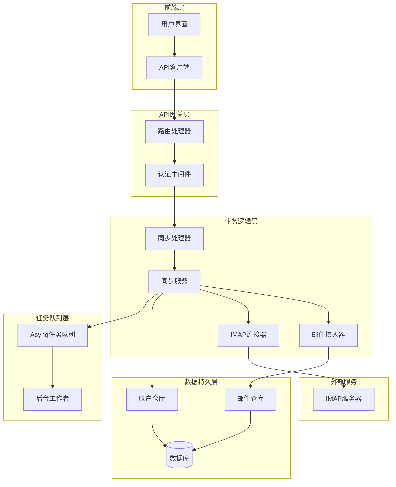
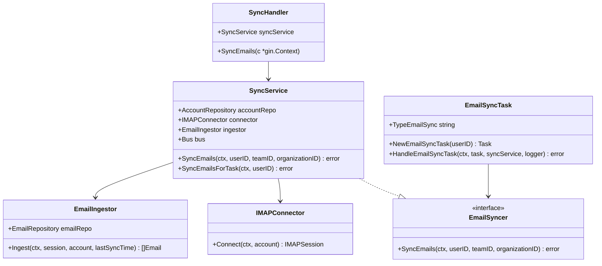
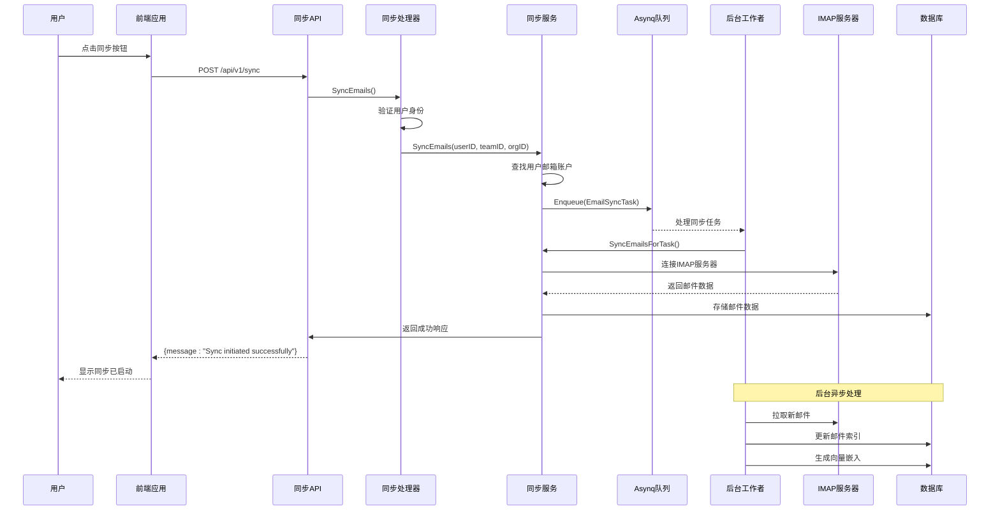
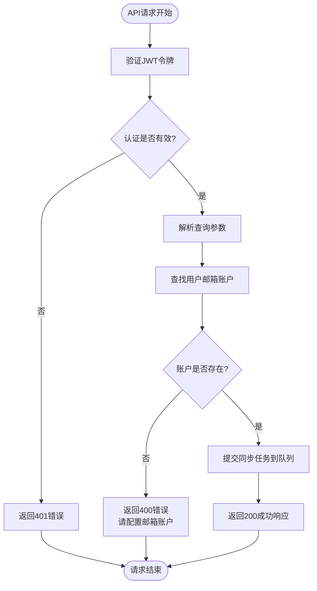
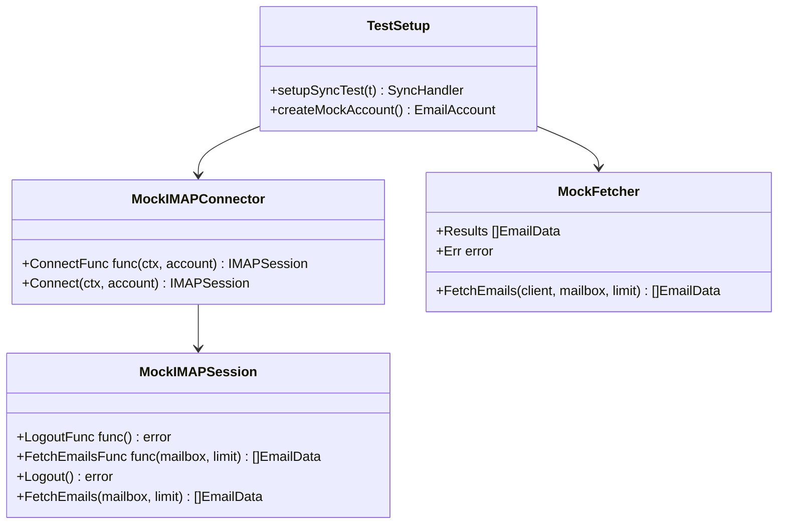

# 同步管理

<cite>
**本文档中引用的文件**
- [sync.go](file://backend/internal/handler/sync.go)
- [sync_test.go](file://backend/internal/handler/sync_test.go)
- [sync.go](file://backend/internal/service/sync.go)
- [sync_test.go](file://backend/internal/service/sync_test.go)
- [sync.go](file://backend/internal/tasks/sync.go)
- [routes.go](file://backend/internal/router/routes.go)
- [email_account.go](file://backend/internal/model/email_account.go)
- [email_ingestor.go](file://backend/internal/service/email_ingestor.go)
- [imap_connector.go](file://backend/internal/service/imap_connector.go)
- [ConnectionTab.tsx](file://frontend/src/components/settings/ConnectionTab.tsx)
- [main.go](file://backend/cmd/worker/main.go)
</cite>

## 目录
1. [简介](#简介)
2. [API端点概述](#api端点概述)
3. [详细API规范](#详细api规范)
4. [架构设计](#架构设计)
5. [完整同步流程](#完整同步流程)
6. [错误处理](#错误处理)
7. [前端集成示例](#前端集成示例)
8. [测试用例分析](#测试用例分析)
9. [最佳实践](#最佳实践)
10. [故障排除](#故障排除)

## 简介

同步管理功能提供了手动触发用户邮件同步的API接口，支持通过POST `/api/v1/sync`端点发起邮件同步任务。该系统采用异步架构设计，通过Asynq任务队列实现邮件数据的后台处理，确保用户体验的流畅性。

## API端点概述

### 端点信息
- **URL**: `/api/v1/sync`
- **方法**: `POST`
- **认证**: 需要有效的JWT令牌
- **内容类型**: `application/json`

### 查询参数

| 参数名 | 类型 | 必需 | 描述 |
|--------|------|------|------|
| `team_id` | UUID字符串 | 否 | 团队标识符，用于团队级别的邮件同步 |
| `organization_id` | UUID字符串 | 否 | 组织标识符，用于组织级别的邮件同步 |

## 详细API规范

### 请求格式

```http
POST /api/v1/sync?team_id=team-uuid&organization_id=org-uuid
Authorization: Bearer <jwt-token>
Content-Type: application/json
```

### 成功响应

当同步任务成功提交时，API返回：
```json
{
  "message": "Sync initiated successfully"
}
```

**HTTP状态码**: `200 OK`

### 错误响应

#### 用户未配置邮箱账户
当用户尚未配置邮箱账户时：
```json
{
  "error": "Please configure your email account in Settings first."
}
```

**HTTP状态码**: `400 Bad Request`

#### 认证失败
当JWT令牌无效或缺失时：
```json
{
  "error": "User ID not found in context"
}
```

**HTTP状态码**: `401 Unauthorized`

#### 内部服务器错误
当系统内部发生错误时：
```json
{
  "error": "详细错误信息"
}
```

**HTTP状态码**: `500 Internal Server Error`

**节来源**
- [sync.go](file://backend/internal/handler/sync.go#L26-L57)

## 架构设计

### 系统架构图



**图表来源**
- [sync.go](file://backend/internal/handler/sync.go#L14-L22)
- [sync.go](file://backend/internal/service/sync.go#L78-L101)
- [main.go](file://backend/cmd/worker/main.go#L53-L83)

### 核心组件关系



**图表来源**
- [sync.go](file://backend/internal/handler/sync.go#L14-L22)
- [sync.go](file://backend/internal/service/sync.go#L78-L101)
- [sync.go](file://backend/internal/tasks/sync.go#L21-L24)

**节来源**
- [sync.go](file://backend/internal/handler/sync.go#L1-L59)
- [sync.go](file://backend/internal/service/sync.go#L1-L178)

## 完整同步流程

### 异步处理机制

同步管理API采用异步处理模式，其核心特点包括：

1. **即时响应**: API调用立即返回，不等待同步完成
2. **任务队列**: 将同步任务提交到Asynq队列进行后台处理
3. **状态追踪**: 通过账户状态间接监控同步进度

### 流程图



**图表来源**
- [sync.go](file://backend/internal/handler/sync.go#L47-L57)
- [sync.go](file://backend/internal/service/sync.go#L105-L156)
- [sync.go](file://backend/internal/tasks/sync.go#L36-L53)

### 详细处理步骤

#### 1. API调用阶段
- 验证用户JWT令牌
- 解析可选的团队和组织ID参数
- 调用同步服务处理请求

#### 2. 服务层处理
- 查找用户配置的邮箱账户
- 验证账户配置完整性
- 提交同步任务到Asynq队列

#### 3. 后台任务处理
- 后台工作者从队列获取任务
- 建立IMAP连接
- 拉取邮件数据
- 解析邮件内容
- 存储到数据库
- 生成向量嵌入
- 发布事件通知

**节来源**
- [sync.go](file://backend/internal/handler/sync.go#L26-L57)
- [sync.go](file://backend/internal/service/sync.go#L105-L156)
- [sync.go](file://backend/internal/tasks/sync.go#L36-L53)

## 错误处理

### 错误类型定义

系统定义了以下错误类型：

| 错误类型 | 错误信息 | HTTP状态码 | 触发条件 |
|----------|----------|------------|----------|
| `ErrAccountNotConfigured` | "Please configure your email account in Settings first." | 400 | 用户未配置邮箱账户 |
| `gorm.ErrRecordNotFound` | "failed to retrieve email account" | 500 | 数据库记录不存在 |
| `context deadline exceeded` | "context deadline exceeded" | 500 | 连接超时 |
| `authentication failed` | "authentication failed" | 500 | 认证失败 |

### 错误处理流程



**图表来源**
- [sync.go](file://backend/internal/handler/sync.go#L47-L57)

**节来源**
- [sync.go](file://backend/internal/handler/sync.go#L47-L57)
- [sync.go](file://backend/internal/service/sync.go#L23)

## 前端集成示例

### 基本同步功能实现

以下是前端集成同步功能的完整示例：

```typescript
// 前端同步状态轮询示例
import { useState, useEffect } from 'react';
import { api } from '@/lib/api';

interface AccountStatus {
  has_account: boolean;
  is_connected?: boolean;
  last_sync_at?: string;
  error_message?: string;
}

export function useSyncStatus() {
  const [isSyncing, setIsSyncing] = useState(false);
  const [accountStatus, setAccountStatus] = useState<AccountStatus | null>(null);
  
  // 获取账户状态
  const fetchAccountStatus = async () => {
    try {
      const response = await api.get<AccountStatus>('/settings/account');
      setAccountStatus(response.data);
    } catch (error) {
      console.error('获取账户状态失败:', error);
      setAccountStatus({ has_account: false });
    }
  };
  
  // 执行同步操作
  const handleSyncNow = async () => {
    setIsSyncing(true);
    try {
      await api.post('/sync');
      // 同步成功后刷新状态
      await fetchAccountStatus();
    } catch (error: any) {
      if (error.response?.status === 400) {
        // 用户未配置邮箱账户
        console.error('邮箱账户未配置');
      } else {
        console.error('同步失败:', error);
      }
    } finally {
      setIsSyncing(false);
    }
  };
  
  // 定期轮询同步状态
  useEffect(() => {
    const interval = setInterval(() => {
      fetchAccountStatus();
    }, 30000); // 每30秒轮询一次
    
    return () => clearInterval(interval);
  }, []);
  
  return {
    isSyncing,
    accountStatus,
    handleSyncNow,
    fetchAccountStatus
  };
}
```

### 连接状态显示组件

```typescript
// 连接状态显示组件
import { ConnectionTab } from '@/components/settings/ConnectionTab';

function EmailSyncStatus() {
  const {
    isSyncing,
    accountStatus,
    handleSyncNow,
    fetchAccountStatus
  } = useSyncStatus();
  
  return (
    <div className="bg-white p-6 rounded-lg shadow-sm">
      <div className="flex items-center justify-between mb-4">
        <h3 className="text-lg font-semibold">邮件同步状态</h3>
        <button
          onClick={handleSyncNow}
          disabled={isSyncing}
          className="px-4 py-2 bg-blue-600 text-white rounded-lg hover:bg-blue-700 disabled:opacity-50"
        >
          {isSyncing ? '正在同步...' : '立即同步'}
        </button>
      </div>
      
      {accountStatus?.has_account ? (
        <div className="space-y-2">
          <div className="flex items-center text-green-600">
            <CheckIcon className="w-4 h-4 mr-2" />
            <span>已连接到邮箱服务器</span>
          </div>
          
          {accountStatus.last_sync_at && (
            <div className="text-sm text-gray-500">
              最后同步时间: {new Date(accountStatus.last_sync_at).toLocaleString()}
            </div>
          )}
          
          {accountStatus.error_message && (
            <div className="text-sm text-red-600">
              错误: {accountStatus.error_message}
            </div>
          )}
        </div>
      ) : (
        <div className="text-gray-500">
          邮箱账户未配置，请先设置您的邮箱连接
        </div>
      )}
    </div>
  );
}
```

**节来源**
- [ConnectionTab.tsx](file://frontend/src/components/settings/ConnectionTab.tsx#L34-L66)

## 测试用例分析

### 单元测试覆盖

系统包含完整的单元测试，涵盖以下场景：

#### 成功场景测试
- 用户配置了邮箱账户时的同步成功
- 不同查询参数组合的处理
- 异步任务队列的正确提交

#### 错误场景测试
- 用户未配置邮箱账户的情况
- JWT认证失败的处理
- 数据库查询异常的处理

### 测试数据结构



**图表来源**
- [sync_test.go](file://backend/internal/handler/sync_test.go#L59-L69)
- [sync_test.go](file://backend/internal/service/sync_test.go#L26-L56)

### 关键测试用例

#### 测试同步成功
```go
func TestSyncHandler_Success(t *testing.T) {
    // 设置测试环境
    syncHandler, db, mockConfig := setupSyncTest(t)
    
    // 创建测试用户和邮箱账户
    userID := uuid.New()
    // ... 创建并保存邮箱账户 ...
    
    // 执行同步请求
    syncHandler.SyncEmails(context.Background(), userID, nil, nil)
    
    // 验证响应
    assert.Equal(t, http.StatusOK, w.Code)
    var response map[string]string
    json.Unmarshal(w.Body.Bytes(), &response)
    assert.Equal(t, "Sync initiated successfully", response["message"])
}
```

#### 测试账户未配置情况
```go
func TestSyncHandler_NoAccount(t *testing.T) {
    syncHandler, _, _ := setupSyncTest(t)
    
    // 创建用户但不配置邮箱账户
    userID := uuid.New()
    
    // 执行同步请求
    syncHandler.SyncEmails(context.Background(), userID, nil, nil)
    
    // 验证错误响应
    assert.Equal(t, http.StatusBadRequest, w.Code)
    var response map[string]string
    json.Unmarshal(w.Body.Bytes(), &response)
    assert.Equal(t, "Please configure your email account in Settings first.", response["error"])
}
```

**节来源**
- [sync_test.go](file://backend/internal/handler/sync_test.go#L115-L168)
- [sync_test.go](file://backend/internal/service/sync_test.go#L58-L169)

## 最佳实践

### API使用建议

1. **及时响应**: 同步API应快速响应，避免长时间阻塞
2. **状态轮询**: 前端应定期轮询账户状态以了解同步进度
3. **错误处理**: 完善的错误处理机制，提供清晰的用户反馈
4. **并发控制**: 合理控制同步频率，避免过于频繁的请求

### 性能优化

1. **异步处理**: 利用Asynq队列实现真正的异步处理
2. **连接池**: IMAP连接应使用连接池管理
3. **批量处理**: 邮件数据应批量处理以提高效率
4. **缓存策略**: 合理使用缓存减少重复查询

### 安全考虑

1. **认证验证**: 严格验证JWT令牌的有效性
2. **权限控制**: 确保用户只能访问自己的邮箱数据
3. **密码安全**: 敏感信息应加密存储
4. **审计日志**: 记录关键操作以便审计

## 故障排除

### 常见问题及解决方案

#### 1. 同步失败
**症状**: API返回400错误，提示"请配置邮箱账户"
**原因**: 用户未在设置中配置邮箱账户
**解决方案**: 引导用户完成邮箱账户配置

#### 2. 连接超时
**症状**: 同步过程中断，出现网络超时
**原因**: IMAP服务器响应缓慢或网络不稳定
**解决方案**: 实现重试机制和超时处理

#### 3. 权限不足
**症状**: IMAP认证失败
**原因**: 邮箱账户凭据错误或服务器拒绝访问
**解决方案**: 验证账户信息并检查服务器设置

#### 4. 队列积压
**症状**: 同步任务长时间未处理
**原因**: 后台工作者处理能力不足
**解决方案**: 增加工作者实例或优化处理逻辑

### 监控指标

建议监控以下关键指标：
- API响应时间
- 同步成功率
- 队列积压数量
- 错误率统计
- 资源使用情况

**节来源**
- [sync.go](file://backend/internal/handler/sync.go#L47-L57)
- [main.go](file://backend/cmd/worker/main.go#L53-L83)