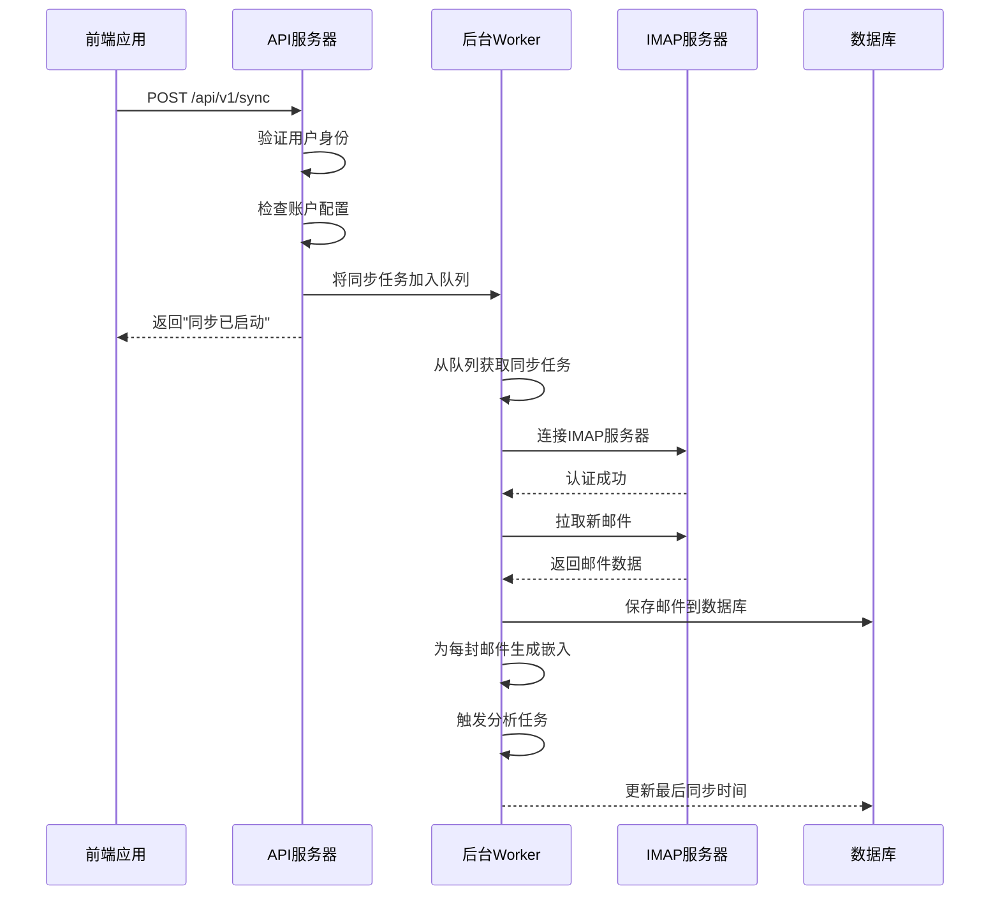

# 邮件与同步API

<cite>
**本文档中引用的文件**  
- [email.go](file://backend/internal/handler/email.go)
- [account.go](file://backend/internal/handler/account.go)
- [sync.go](file://backend/internal/handler/sync.go)
- [email.go](file://backend/internal/model/email.go)
- [email_account.go](file://backend/internal/model/email_account.go)
- [delete_all_emails.sh](file://scripts/delete_all_emails.sh)
- [emails.ts](file://frontend/src/lib/api/emails.ts)
</cite>

## 目录
1. [简介](#简介)
2. [核心API端点](#核心api端点)
3. [邮件数据结构](#邮件数据结构)
4. [同步流程](#同步流程)
5. [前端调用示例](#前端调用示例)
6. [清理脚本说明](#清理脚本说明)

## 简介
本API文档详细描述了邮件管理与同步功能的核心端点。系统通过IMAP协议连接用户邮箱，实现邮件的拉取、存储和智能分析。所有API端点均需用户认证，通过JWT令牌进行访问控制。

## 核心API端点

### 获取邮件列表 (GET /api/v1/emails)
获取当前用户的邮件列表，支持分页和过滤。

**请求参数**
- `limit` (可选): 每页数量，默认50
- `offset` (可选): 偏移量，默认0
- `context_id` (可选): 上下文ID过滤
- `folder` (可选): 文件夹过滤 (INBOX, snoozed, trash)
- `category` (可选): 分类过滤 (Work, Newsletter, Personal)
- `filter` (可选): 自定义过滤

**响应状态码**
- `200`: 成功，返回邮件数组
- `401`: 未授权，用户未登录
- `400`: 参数无效
- `500`: 服务器内部错误

**Section sources**
- [email.go](file://backend/internal/handler/email.go#L30-L63)

### 获取单封邮件 (GET /api/v1/emails/:id)
获取指定ID的邮件详情。

**路径参数**
- `id`: 邮件UUID

**响应状态码**
- `200`: 成功，返回邮件对象
- `401`: 未授权，用户未登录
- `400`: 邮件ID格式无效
- `404`: 邮件不存在或无访问权限
- `500`: 服务器内部错误

**Section sources**
- [email.go](file://backend/internal/handler/email.go#L65-L91)

### 清空所有邮件 (DELETE /api/v1/emails/all)
删除当前用户的所有邮件数据。

**响应状态码**
- `200`: 成功，所有邮件已删除
- `401`: 未授权，用户未登录
- `500`: 删除失败

**Section sources**
- [email.go](file://backend/internal/handler/email.go#L93-L107)

### 连接邮箱账户 (POST /api/v1/settings/account)
连接并保存用户的邮箱账户配置。

**请求体**
```json
{
  "email": "string",
  "server_address": "string",
  "server_port": "number",
  "username": "string",
  "password": "string"
}
```

**响应状态码**
- `200`: 成功，账户已连接
- `401`: 未授权，用户未登录
- `400`: 请求参数无效或连接失败

**Section sources**
- [account.go](file://backend/internal/handler/account.go#L25-L46)

### 获取账户状态 (GET /api/v1/settings/account)
获取当前用户的邮箱账户连接状态。

**响应结构**
```json
{
  "has_account": "boolean",
  "email": "string",
  "server_address": "string",
  "server_port": "number",
  "username": "string",
  "is_connected": "boolean",
  "last_sync_at": "string",
  "error_message": "string"
}
```

**响应状态码**
- `200`: 成功，返回账户状态
- `401`: 未授权，用户未登录

**Section sources**
- [account.go](file://backend/internal/handler/account.go#L48-L79)

### 断开账户连接 (DELETE /api/v1/settings/account)
断开当前用户的邮箱账户连接。

**响应状态码**
- `200`: 成功，账户已断开
- `401`: 未授权，用户未登录
- `404`: 未找到要断开的账户
- `500`: 服务器内部错误

**Section sources**
- [account.go](file://backend/internal/handler/account.go#L81-L99)

### 手动触发同步 (POST /api/v1/sync)
手动触发邮件同步流程。

**查询参数**
- `team_id` (可选): 团队ID
- `organization_id` (可选): 组织ID

**响应状态码**
- `200`: 成功，同步已启动
- `400`: 账户未配置，请先在设置中配置邮箱账户
- `401`: 未授权，用户未登录
- `500`: 同步服务内部错误

**Section sources**
- [sync.go](file://backend/internal/handler/sync.go#L25-L58)

## 邮件数据结构

### 邮件对象 (Email)
表示存储在数据库中的邮件消息。

**字段说明**
- `ID`: UUID主键
- `CreatedAt`: 创建时间
- `UpdatedAt`: 更新时间
- `DeletedAt`: 软删除时间戳
- `UserID`: 用户ID，外键
- `AccountID`: 邮箱账户ID，外键
- `MessageID`: 消息ID，唯一索引
- `Subject`: 邮件主题
- `Sender`: 发件人信息
- `Date`: 邮件发送时间
- `Snippet`: 邮件摘要
- `BodyText`: 纯文本内容
- `BodyHTML`: HTML内容
- `IsRead`: 是否已读
- `Folder`: 文件夹 (INBOX, snoozed, trash)
- `Summary`: AI生成的摘要
- `Category`: 分类 (Work, Newsletter, Personal)
- `Sentiment`: 情感分析 (Positive, Neutral, Negative)
- `Urgency`: 紧急程度 (High, Medium, Low)
- `SnoozedUntil`: 延迟显示时间
- `ActionItems`: 提取的任务项 (JSON)
- `SmartActions`: 结构化智能操作 (JSON)

**Section sources**
- [email.go](file://backend/internal/model/email.go#L11-L37)

## 同步流程

### 后台同步架构


**Diagram sources**
- [sync.go](file://backend/internal/handler/sync.go#L25-L58)
- [sync.go](file://backend/internal/service/sync.go#L104-L157)
- [sync.go](file://backend/cmd/worker/main.go#L78-L84)

**Section sources**
- [sync.go](file://backend/internal/handler/sync.go#L25-L58)
- [sync.go](file://backend/internal/service/sync.go#L104-L157)

## 前端调用示例

### 调用同步API并轮询状态
```typescript
// 前端API定义
export const EmailAPI = {
  // 触发同步
  sync: async (): Promise<{ message: string }> => {
    const response = await api.post('/sync');
    return response.data;
  },
  
  // 获取邮件列表
  list: async (params?: { limit?: number; offset?: number }): Promise<Email[]> => {
    const response = await api.get('/emails', { params });
    return response.data;
  }
};

// 在React组件中使用
const handleSync = async () => {
  setSyncLoading(true);
  try {
    // 触发同步
    await EmailAPI.sync();
    toast.success('同步已启动');
    
    // 轮询获取最新邮件
    const pollInterval = setInterval(async () => {
      try {
        const emails = await EmailAPI.list({ limit: 10 });
        if (emails.length > 0) {
          // 检测到新邮件，停止轮询
          clearInterval(pollInterval);
          setSyncLoading(false);
          refreshEmailList();
        }
      } catch (error) {
        console.error('轮询失败:', error);
      }
    }, 3000); // 每3秒轮询一次
    
    // 设置最大等待时间
    setTimeout(() => {
      clearInterval(pollInterval);
      setSyncLoading(false);
    }, 30000); // 最多等待30秒
    
  } catch (error: unknown) {
    console.error("同步错误:", error);
    if (isAxiosError(error) && error.response?.status === 400) {
      // 账户未配置
      showConfigureAccountDialog();
    } else {
      toast.error('同步失败');
    }
    setSyncLoading(false);
  }
};
```

**Section sources**
- [page.tsx](file://frontend/src/app/dashboard/inbox/page.tsx#L86-L155)
- [InitialSync.tsx](file://frontend/src/components/onboarding/InitialSync.tsx#L38-L43)
- [emails.ts](file://frontend/src/lib/api/emails.ts#L19-L28)

## 清理脚本说明

### delete_all_emails.sh 脚本
该脚本用于删除数据库中所有邮件及相关数据。

**脚本功能**
- 删除 `emails` 表中的所有记录
- 通过外键约束级联删除 `email_embeddings`
- 将 `tasks` 表中关联邮件的字段设为NULL
- 重新整理数据库空间

**关联API端点**
- 该脚本与 `DELETE /api/v1/emails/all` 端点功能相似，但直接操作数据库
- API端点通过服务层逻辑删除，而脚本直接执行SQL命令
- 两者都确保数据的一致性和完整性

**使用注意事项**
- 执行前需要设置 `PGPASSWORD` 环境变量
- 脚本会提示确认，防止误操作
- 建议在维护窗口期执行

**Section sources**
- [delete_all_emails.sh](file://scripts/delete_all_emails.sh#L1-L98)
- [email.go](file://backend/internal/handler/email.go#L93-L107)