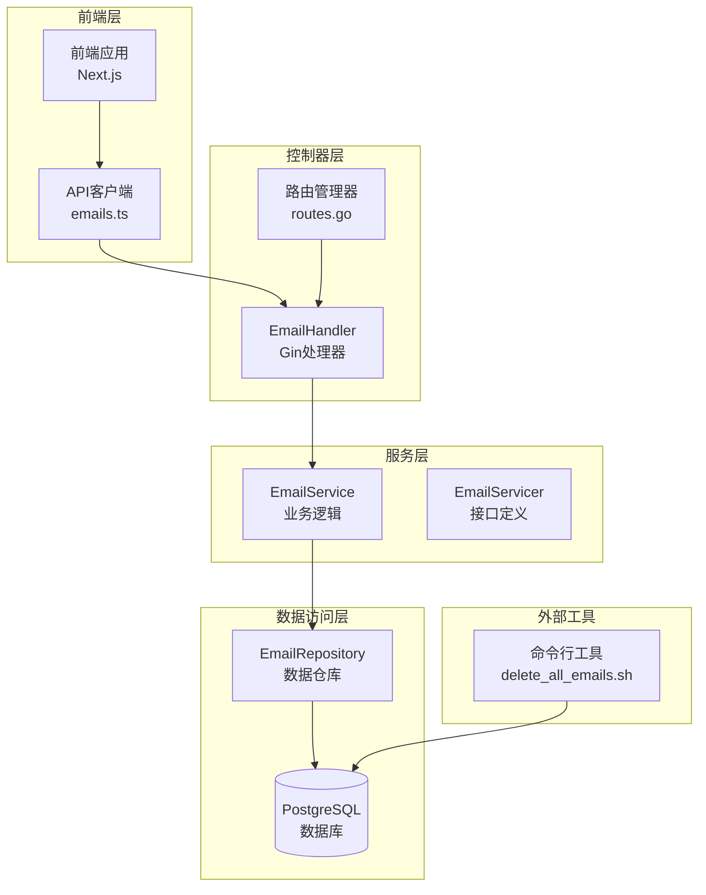
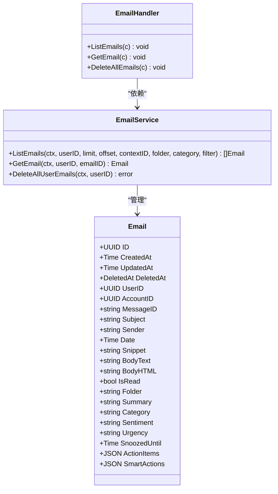
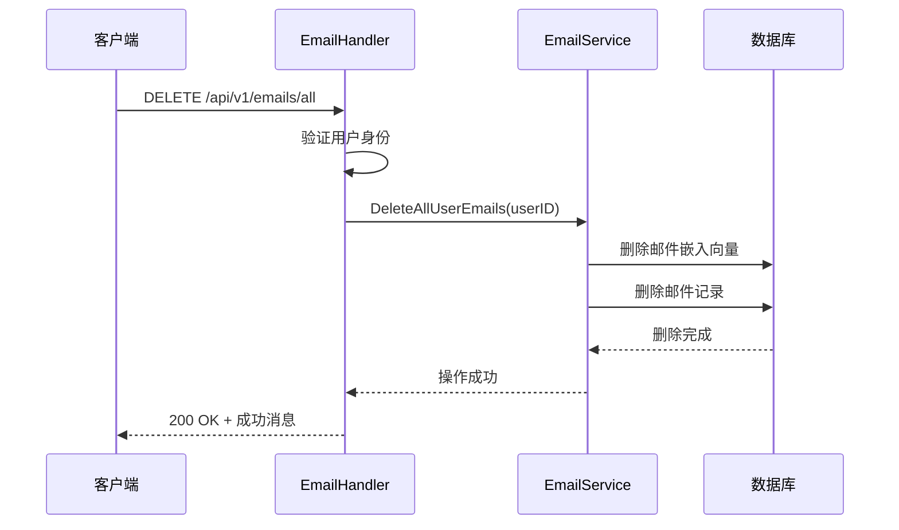

# 邮件管理API文档

<cite>
**本文档中引用的文件**
- [backend/internal/handler/email.go](file://backend/internal/handler/email.go)
- [backend/internal/service/email.go](file://backend/internal/service/email.go)
- [backend/internal/model/email.go](file://backend/internal/model/email.go)
- [backend/internal/router/routes.go](file://backend/internal/router/routes.go)
- [frontend/src/lib/api/emails.ts](file://frontend/src/lib/api/emails.ts)
- [scripts/delete_all_emails.sh](file://scripts/delete_all_emails.sh)
- [backend/internal/handler/email_test.go](file://backend/internal/handler/email_test.go)
- [backend/internal/model/email_test.go](file://backend/internal/model/email_test.go)
- [backend/internal/repository/email_repository.go](file://backend/internal/repository/email_repository.go)
</cite>

## 目录
1. [简介](#简介)
2. [项目架构概览](#项目架构概览)
3. [核心数据模型](#核心数据模型)
4. [API端点详解](#api端点详解)
5. [前端集成](#前端集成)
6. [错误处理](#错误处理)
7. [性能考虑](#性能考虑)
8. [故障排除指南](#故障排除指南)
9. [总结](#总结)

## 简介

邮件管理功能是EchoMind系统的核心组件之一，提供了完整的邮件生命周期管理能力。该功能基于Go语言的Gin框架构建，采用分层架构设计，支持邮件列表查询、详情获取和批量删除操作。系统集成了AI驱动的邮件分类、情感分析和智能摘要生成功能，为用户提供智能化的邮件管理体验。

## 项目架构概览

邮件管理系统采用经典的三层架构模式，确保了良好的可维护性和扩展性：



**图表来源**
- [backend/internal/handler/email.go](file://backend/internal/handler/email.go#L1-L108)
- [backend/internal/router/routes.go](file://backend/internal/router/routes.go#L26-L99)

**章节来源**
- [backend/internal/handler/email.go](file://backend/internal/handler/email.go#L1-L108)
- [backend/internal/service/email.go](file://backend/internal/service/email.go#L1-L126)
- [backend/internal/model/email.go](file://backend/internal/model/email.go#L1-L37)

## 核心数据模型

### Email实体结构

邮件实体包含了丰富的元数据信息，支持复杂的查询和分析需求：



**图表来源**
- [backend/internal/model/email.go](file://backend/internal/model/email.go#L11-L37)
- [backend/internal/service/email.go](file://backend/internal/service/email.go#L13-L126)

### 核心字段说明

| 字段名 | 类型 | 描述 | 必填 |
|--------|------|------|------|
| ID | UUID | 邮件唯一标识符 | 是 |
| UserID | UUID | 所属用户ID | 是 |
| MessageID | string | 原始邮件Message-ID | 是 |
| Subject | string | 邮件主题 | 否 |
| Sender | string | 发件人地址 | 否 |
| Date | DateTime | 邮件发送时间 | 是 |
| BodyText | string | 纯文本内容 | 否 |
| BodyHTML | string | HTML格式内容 | 否 |
| Summary | string | AI生成的邮件摘要 | 否 |
| Category | string | 邮件分类（Work、Personal等） | 否 |
| Sentiment | string | 情感分析结果（Positive、Neutral、Negative） | 否 |
| Urgency | string | 紧急程度（High、Medium、Low） | 否 |
| Folder | string | 文件夹类型（INBOX、Trash等） | 否 |
| IsRead | bool | 是否已读 | 否 |
| SnoozedUntil | DateTime | 推迟显示到的时间 | 否 |

**章节来源**
- [backend/internal/model/email.go](file://backend/internal/model/email.go#L11-L37)

## API端点详解

### 1. 获取邮件列表 - GET /api/v1/emails

#### 功能描述
列出指定用户的邮件列表，支持分页、过滤和排序功能。

#### 请求参数

| 参数名 | 类型 | 位置 | 描述 | 默认值 |
|--------|------|------|------|--------|
| limit | number | 查询参数 | 每页显示数量 | 50 |
| offset | number | 查询参数 | 跳过的记录数 | 0 |
| context_id | string | 查询参数 | 上下文ID过滤 | 无 |
| folder | string | 查询参数 | 文件夹类型 | 无 |
| category | string | 查询参数 | 邮件分类 | 无 |
| filter | string | 查询参数 | 智能过滤器 | 无 |

#### 支持的文件夹类型
- `inbox`: 收件箱（默认）
- `snoozed`: 推迟的邮件
- `trash`: 已删除邮件
- `drafts`: 草稿邮件
- `sent`: 已发送邮件

#### 支持的过滤选项
- `smart`: 智能过滤（高优先级邮件）

#### 请求示例
```bash
curl -X GET "https://api.echomind.com/api/v1/emails?limit=20&offset=0&folder=inbox&category=Work" \
  -H "Authorization: Bearer YOUR_TOKEN"
```

#### 响应结构
```json
[
  {
    "ID": "550e8400-e29b-41d4-a716-446655440000",
    "Subject": "项目进度更新",
    "Sender": "manager@company.com",
    "Snippet": "各位同事，这是本周的项目进度报告...",
    "BodyText": "尊敬的团队成员，...",
    "Date": "2024-01-15T10:30:00Z",
    "Summary": "本周项目按计划推进，主要完成了A模块开发。",
    "Category": "Work",
    "Sentiment": "Neutral",
    "Urgency": "Medium",
    "IsRead": false,
    "ActionItems": [],
    "SmartActions": {}
  }
]
```

#### 分页机制
系统使用传统的偏移量分页方式：
- `limit`: 控制每页返回的记录数
- `offset`: 控制跳过多少条记录
- 示例：第2页的数据 `limit=20&offset=20`

**章节来源**
- [backend/internal/handler/email.go](file://backend/internal/handler/email.go#L30-L62)
- [backend/internal/service/email.go](file://backend/internal/service/email.go#L25-L75)

### 2. 获取单封邮件详情 - GET /api/v1/emails/:id

#### 功能描述
根据邮件ID获取指定邮件的完整详情信息。

#### 路径参数

| 参数名 | 类型 | 描述 |
|--------|------|------|
| id | string | 邮件唯一标识符（UUID格式） |

#### 请求示例
```bash
curl -X GET "https://api.echomind.com/api/v1/emails/550e8400-e29b-41d4-a716-446655440000" \
  -H "Authorization: Bearer YOUR_TOKEN"
```

#### 响应结构
```json
{
  "ID": "550e8400-e29b-41d4-a716-446655440000",
  "Subject": "重要会议通知",
  "Sender": "ceo@company.com",
  "Date": "2024-01-15T09:00:00Z",
  "BodyText": "各位同事，...",
  "BodyHTML": "<html><body>...</body></html>",
  "Summary": "本周五上午10点召开重要项目评审会。",
  "Category": "Work",
  "Sentiment": "Positive",
  "Urgency": "High",
  "IsRead": true,
  "ActionItems": [
    "准备项目进展报告",
    "确认参会人员名单"
  ],
  "SmartActions": {
    "auto_reply": {
      "enabled": true,
      "template": "收到您的邮件，将在会议前回复详细信息。"
    }
  }
}
```

#### 错误响应
- `404 Not Found`: 邮件不存在或不属于当前用户
- `400 Bad Request`: 邮件ID格式无效

**章节来源**
- [backend/internal/handler/email.go](file://backend/internal/handler/email.go#L65-L90)
- [backend/internal/service/email.go](file://backend/internal/service/email.go#L78-L88)

### 3. 清空所有邮件 - DELETE /api/v1/emails/all

#### 功能描述
删除当前用户的所有邮件及相关数据，包括邮件嵌入向量和关联的任务。

#### 安全特性
此操作具有以下安全特性：
- **不可逆性**: 删除后无法恢复
- **级联删除**: 自动清理相关数据
- **事务保护**: 使用数据库事务确保一致性
- **权限验证**: 只能删除自己的邮件

#### 删除流程


**图表来源**
- [backend/internal/handler/email.go](file://backend/internal/handler/email.go#L93-L107)
- [backend/internal/service/email.go](file://backend/internal/service/email.go#L112-L125)

#### 响应结构
```json
{
  "message": "All emails deleted successfully"
}
```

#### 级联删除行为
1. **邮件嵌入向量**: 通过显式SQL删除，确保数据完整性
2. **邮件记录**: 通过GORM删除，保留外键约束
3. **关联任务**: 将`source_email_id`设置为NULL而非级联删除

#### 命令行调用示例
系统提供了专门的Shell脚本来执行此操作：

```bash
# 设置数据库连接环境变量
export PGPASSWORD=your_password
./scripts/delete_all_emails.sh
```

脚本执行的安全检查：
- 连接测试
- 数据统计
- 用户确认
- 事务保护

**章节来源**
- [backend/internal/handler/email.go](file://backend/internal/handler/email.go#L93-L107)
- [backend/internal/service/email.go](file://backend/internal/service/email.go#L112-L125)
- [scripts/delete_all_emails.sh](file://scripts/delete_all_emails.sh#L1-L98)

## 前端集成

### TypeScript接口定义

前端通过标准化的TypeScript接口与后端API交互：

```typescript
export interface Email {
  ID: string;
  Subject: string;
  Sender: string;
  Snippet: string;
  BodyText: string;
  Date: string;
  Summary: string;
  Category: string;
  Sentiment: string;
  Urgency: string;
  IsRead: boolean;
  ActionItems: string[];
  SmartActions: Record<string, unknown>;
}
```

### API调用示例

前端通过封装的API客户端进行调用：

```typescript
// 列出邮件
const emails = await EmailAPI.list({
  limit: 20,
  offset: 0,
  folder: 'inbox',
  category: 'Work'
});

// 获取单封邮件
const email = await EmailAPI.get('550e8400-e29b-41d4-a716-446655440000');
```

### 前端路由集成

邮件管理功能与前端路由系统的集成：

```mermaid
graph LR
subgraph "前端路由"
Inbox[inbox/]
EmailDetail[email/[id]/]
end
subgraph "API调用"
ListAPI[list API]
DetailAPI[get API]
end
Inbox --> ListAPI
EmailDetail --> DetailAPI
```

**图表来源**
- [frontend/src/lib/api/emails.ts](file://frontend/src/lib/api/emails.ts#L19-L29)

**章节来源**
- [frontend/src/lib/api/emails.ts](file://frontend/src/lib/api/emails.ts#L1-L30)

## 错误处理

### HTTP状态码

| 状态码 | 场景 | 响应格式 |
|--------|------|----------|
| 200 | 成功 | JSON响应 |
| 400 | 请求参数错误 | `{"error": "错误描述"}` |
| 401 | 未授权 | `{"error": "User ID not found in context"}` |
| 404 | 邮件不存在 | `{"error": "Email not found or not accessible"}` |
| 500 | 服务器内部错误 | `{"error": "错误描述"}` |

### 常见错误场景

1. **无效的邮件ID格式**
   ```json
   {
     "error": "Invalid email ID format"
   }
   ```

2. **超出限制范围**
   ```json
   {
     "error": "Invalid limit parameter"
   }
   ```

3. **邮件不存在**
   ```json
   {
     "error": "Email not found or not accessible"
   }
   ```

4. **删除失败**
   ```json
   {
     "error": "Failed to delete all emails",
     "details": "数据库错误详情"
   }
   ```

**章节来源**
- [backend/internal/handler/email.go](file://backend/internal/handler/email.go#L34-L61)
- [backend/internal/handler/email.go](file://backend/internal/handler/email.go#L75-L90)
- [backend/internal/handler/email.go](file://backend/internal/handler/email.go#L101-L107)

## 性能考虑

### 查询优化策略

1. **索引优化**
   - `user_id`字段建立索引
   - `message_id`字段唯一索引
   - `date`字段索引用于排序
   - `snoozed_until`字段索引用于推迟邮件查询

2. **分页优化**
   - 使用LIMIT/OFFSET进行高效分页
   - 避免大偏移量查询
   - 考虑使用游标分页替代

3. **查询过滤**
   - 条件查询时使用适当的WHERE子句
   - 智能过滤器减少不必要的计算

### 缓存策略

虽然当前实现没有缓存层，但可以考虑以下优化：
- 邮件列表结果缓存
- 频繁访问的邮件详情缓存
- 分类统计结果缓存

### 大数据量处理

对于大量邮件的处理建议：
- 实施增量加载
- 使用后台任务处理批量操作
- 考虑数据归档策略

## 故障排除指南

### 常见问题及解决方案

#### 1. 认证失败
**症状**: 返回401状态码
**原因**: 缺少有效的认证令牌
**解决**: 确保请求头包含正确的Bearer令牌

#### 2. 邮件不存在
**症状**: 返回404状态码
**原因**: 邮件ID无效或不属于当前用户
**解决**: 验证邮件ID正确性，确保用户权限

#### 3. 删除操作失败
**症状**: 返回500状态码
**原因**: 数据库连接问题或约束冲突
**解决**: 检查数据库连接，查看具体错误日志

#### 4. 分页参数错误
**症状**: 返回400状态码
**原因**: limit或offset参数格式不正确
**解决**: 确保参数为非负整数

### 调试技巧

1. **启用详细日志**
   ```go
   // 在handler中添加日志
   log.Printf("Processing email request for user: %s", userID)
   ```

2. **监控数据库查询**
   ```sql
   -- 启用查询日志
   SET log_statement = 'all';
   ```

3. **性能分析**
   ```go
   // 添加性能计时
   start := time.Now()
   // ... 执行操作
   log.Printf("Operation took %v", time.Since(start))
   ```

**章节来源**
- [backend/internal/handler/email.go](file://backend/internal/handler/email.go#L34-L61)
- [backend/internal/service/email.go](file://backend/internal/service/email.go#L25-L75)

## 总结

EchoMind的邮件管理功能提供了完整而强大的邮件处理能力，具有以下特点：

### 技术优势
- **分层架构**: 清晰的职责分离，便于维护和扩展
- **类型安全**: 完整的TypeScript接口定义
- **错误处理**: 全面的错误响应机制
- **安全性**: 完整的用户权限验证

### 功能特性
- **灵活查询**: 支持多种过滤和排序选项
- **智能分类**: AI驱动的情感分析和分类
- **批量操作**: 安全的批量删除功能
- **前后端集成**: 完整的前端API支持

### 扩展建议
1. **性能优化**: 考虑引入缓存层
2. **功能增强**: 添加邮件搜索和标签功能
3. **用户体验**: 实现无限滚动加载
4. **监控告警**: 添加详细的API使用统计

该邮件管理系统为现代办公应用提供了坚实的技术基础，能够满足企业级应用的各种需求。