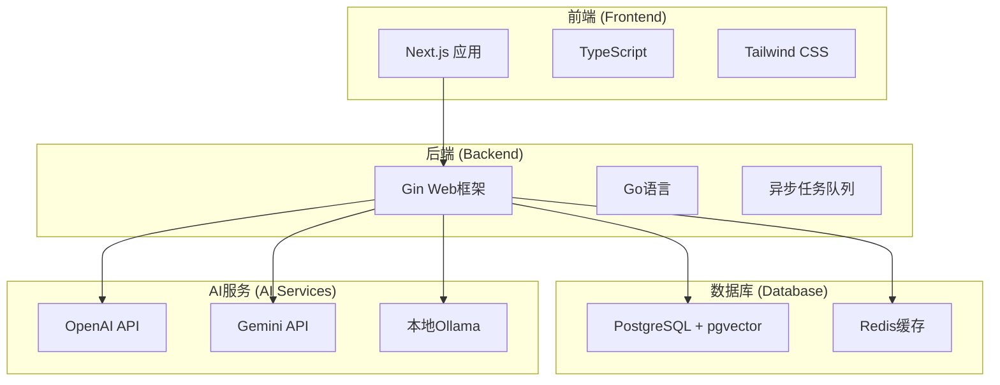

# 快速入门

<cite>
**本文档中引用的文件**
- [README.md](file://README.md)
- [README.zh.md](file://README.zh.md)
- [Makefile](file://Makefile)
- [scripts/dev.sh](file://scripts/dev.sh)
- [backend/configs/config.example.yaml](file://backend/configs/config.example.yaml)
- [backend/configs/logger.example.yaml](file://backend/configs/logger.example.yaml)
- [deploy/docker-compose.yml](file://deploy/docker-compose.yml)
- [backend/cmd/main.go](file://backend/cmd/main.go)
- [frontend/package.json](file://frontend/package.json)
- [backend/configs/validate_config.sh](file://backend/configs/validate_config.sh)
</cite>

## 目录
1. [简介](#简介)
2. [系统要求](#系统要求)
3. [项目结构概览](#项目结构概览)
4. [克隆和初始化](#克隆和初始化)
5. [配置环境变量](#配置环境变量)
6. [启动开发环境](#启动开发环境)
7. [详细启动步骤](#详细启动步骤)
8. [验证安装](#验证安装)
9. [常见问题排查](#常见问题排查)
10. [故障排除指南](#故障排除指南)
11. [后续步骤](#后续步骤)

## 简介

EchoMind 是一款智能的、具备情境感知能力的个人助理，能够深度融入您的数字生活（从电子邮件开始），为您创建一个可搜索的、智能化的知识库。它能帮助您保持条理，即时找到所需信息，并从日常沟通中获得洞见。

本快速入门指南将指导您如何在本地环境中设置和运行 EchoMind，涵盖从克隆仓库到启动完整开发环境的所有必要步骤。

## 系统要求

在开始之前，请确保您的系统满足以下要求：

### 必需工具
- **Go**: 版本 1.22 或更高
- **Node.js**: 版本 18+ 及 [pnpm](https://pnpm.io/installation)
- **Docker**: 包括 Docker Compose
- **make**: GNU make 工具

### 推荐配置
- **内存**: 至少 4GB RAM
- **存储**: 至少 2GB 可用磁盘空间
- **网络**: 稳定的互联网连接（用于下载依赖和AI服务）

**节来源**
- [README.md](file://README.md#L49-L56)
- [README.zh.md](file://README.zh.md#L54-L61)

## 项目结构概览

EchoMind 采用现代化的前后端分离架构：



**图表来源**
- [README.md](file://README.md#L33-L42)
- [deploy/docker-compose.yml](file://deploy/docker-compose.yml#L1-L22)

**节来源**
- [README.md](file://README.md#L23-L42)

## 克隆和初始化

### 第一步：克隆仓库

```bash
# 克隆 EchoMind 仓库
git clone https://github.com/your-username/echomind.git
cd echomind
```

**重要提示**: 请将 `your-username` 替换为实际的代码仓库所有者用户名。

### 第二步：项目初始化

使用 Makefile 的初始化命令自动安装所有必要的依赖：

```bash
# 安装后端和前端依赖
make init
```

该命令将执行以下操作：
- 下载 Go 模块依赖
- 安装 Node.js 依赖
- 创建必要的目录结构

**节来源**
- [README.md](file://README.md#L59-L63)
- [README.zh.md](file://README.zh.md#L64-L69)
- [Makefile](file://Makefile#L188-L197)

## 配置环境变量

EchoMind 使用 YAML 配置文件来管理各种设置。您需要复制示例配置文件并填写必要的凭据。

### 复制配置文件

```bash
# 复制配置文件
cp backend/configs/config.example.yaml backend/configs/config.yaml
cp backend/configs/logger.example.yaml backend/configs/logger.yaml
```

### 配置文件详解

#### 主配置文件 (`config.yaml`)

主配置文件包含以下关键部分：

| 配置项 | 描述 | 默认值 | 必需 |
|--------|------|--------|------|
| `server.port` | 后端API端口 | 8080 | ✓ |
| `server.jwt.secret` | JWT签名密钥 | - | ✓ |
| `database.dsn` | 数据库连接字符串 | - | ✓ |
| `security.encryption_key` | 加密密钥 | - | ✓ |
| `redis.addr` | Redis地址 | localhost:6380 | ✓ |

#### AI服务配置

EchoMind 支持多种AI服务提供商：

| 服务类型 | 推荐配置 | API密钥来源 |
|----------|----------|-------------|
| 聊天服务 | deepseek 或 openai_small | DeepSeek API 或 OpenAI API |
| 嵌入服务 | siliconflow 或 openai_small | SiliconFlow API 或 OpenAI API |

**节来源**
- [README.md](file://README.md#L66-L72)
- [README.zh.md](file://README.zh.md#L71-L78)
- [backend/configs/config.example.yaml](file://backend/configs/config.example.yaml#L1-L180)

### 配置验证脚本

EchoMind 提供了一个配置验证脚本来帮助您检查配置文件的有效性：

```bash
# 运行配置验证
./backend/configs/validate_config.sh
```

该脚本会检查：
- YAML 语法正确性
- 敏感数据泄露风险
- 必需字段完整性
- AI提供商配置有效性
- 嵌入维度一致性

**节来源**
- [backend/configs/validate_config.sh](file://backend/configs/validate_config.sh#L1-L141)

## 启动开发环境

EchoMind 提供了多种方式来启动开发环境，您可以选择最适合您需求的方法。

### 方法一：使用 Makefile（推荐）

```bash
# 完整启动开发环境
make dev
```

这个命令会按顺序执行以下步骤：
1. 清理旧日志
2. 检查系统健康状况
3. 启动基础设施服务（数据库、Redis）
4. 等待数据库就绪
5. 启动后端服务器
6. 启动后台工作进程
7. 启动前端开发服务器

### 方法二：使用脚本文件

```bash
# 使用开发脚本启动
./scripts/dev.sh
```

### 方法三：手动启动各组件

如果您需要更精细的控制，可以手动启动各个组件：

```bash
# 1. 启动数据库和Redis
make docker-up

# 2. 初始化数据库
make db-init

# 3. 启动后端服务
make run-be

# 4. 启动后台工作进程
make run-worker

# 5. 启动前端
cd frontend && pnpm dev
```

**节来源**
- [README.md](file://README.md#L74-L97)
- [README.zh.md](file://README.zh.md#L79-L102)
- [Makefile](file://Makefile#L204-L209)
- [scripts/dev.sh](file://scripts/dev.sh#L1-L55)

## 详细启动步骤

### 步骤 1：启动基础设施

```bash
# 启动数据库和Redis容器
make docker-up
```

**预期输出**：
```
Starting infrastructure services...
✅ Infrastructure services started
```

### 步骤 2：等待数据库就绪

系统会自动等待数据库启动完成，通常需要几秒钟时间。

### 步骤 3：初始化数据库

```bash
# 运行数据库迁移
make db-init
```

**预期输出**：
```
Database Initialization
✅ Database initialized
```

### 步骤 4：启动后端服务

```bash
# 启动后端API服务器
make run-be
```

**预期输出**：
```
Starting backend server...
✅ Backend started (PID: 12345) with log: logs/backend.log
```

### 步骤 5：启动后台工作进程

```bash
# 启动异步任务处理器
make run-worker
```

**预期输出**：
```
Starting worker with dedicated log file...
✅ Worker started (PID: 67890) with log: logs/worker.log
```

### 步骤 6：启动前端应用

```bash
# 在新终端中启动前端
cd frontend
pnpm install
pnpm dev
```

**预期输出**：
```
Ready on http://localhost:3000
```

### 服务访问地址

- **后端 API**: `http://localhost:8080`
- **前端应用**: `http://localhost:3000`
- **API健康检查**: `http://localhost:8080/health`

**节来源**
- [Makefile](file://Makefile#L283-L339)
- [backend/cmd/main.go](file://backend/cmd/main.go#L110-L137)

## 验证安装

### 系统健康检查

使用内置的健康检查功能验证所有服务是否正常运行：

```bash
# 运行全面的健康检查
make health-check
```

**预期输出**：
```
System Health Check
Checking system requirements...
✅ Go 1.22.x
✅ Node.js 18.x
✅ pnpm
✅ Docker
✅ Docker Compose

Services Status:
Backend (8080): 🟢 Running
Frontend (3000): 🟢 Running
Postgres (5432): 🟢 Running
Redis (6380): 🟢 Running

Configuration:
Environment: development
Config File: backend/configs/config.yaml
✅ Config file exists

Directories:
✅ Backend directory
✅ Frontend directory
✅ Deploy directory
```

### API端点测试

```bash
# 检查后端健康状态
curl -s http://localhost:8080/health | jq

# 预期输出：
{
  "status": "ok",
  "services": {
    "database": "connected",
    "pgvector": "0.7.5"
  }
}
```

### 日志监控

```bash
# 实时查看后端日志
make watch-logs SERVICE=backend

# 实时查看所有服务日志
make watch-logs
```

**节来源**
- [Makefile](file://Makefile#L143-L183)

## 常见问题排查

### 数据库连接问题

**问题**: 数据库无法连接
**解决方案**:
```bash
# 检查数据库状态
make status

# 重新启动数据库
make stop-infra
make docker-up

# 检查数据库日志
make logs SERVICE=backend | grep -i "database"
```

### AI服务配置错误

**问题**: AI服务调用失败
**解决方案**:
1. 检查配置文件中的API密钥
2. 验证网络连接
3. 使用配置验证脚本

```bash
# 验证配置
./backend/configs/validate_config.sh
```

### 端口冲突

**问题**: 端口被占用
**解决方案**:
```bash
# 检查端口占用情况
lsof -i:8080  # 后端端口
lsof -i:3000  # 前端端口

# 杀死占用进程
kill -9 <PID>
```

### 内存不足

**问题**: 启动时内存不足
**解决方案**:
1. 关闭其他应用程序释放内存
2. 调整Docker内存限制
3. 使用轻量级AI模型

**节来源**
- [Makefile](file://Makefile#L143-L183)

## 故障排除指南

### 诊断命令集合

#### 系统状态检查
```bash
# 完整系统诊断
make doctor

# 服务状态检查
make status

# 健康检查
make health-check
```

#### 日志分析
```bash
# 查看最近的日志
make logs

# 实时监控日志
make watch-logs

# 查看特定服务日志
make logs SERVICE=backend
make logs SERVICE=worker
make logs SERVICE=frontend
```

#### 数据库维护
```bash
# 备份数据库
make backup-db

# 恢复数据库
make restore-db BACKUP_FILE=backup_*.sql

# 数据库shell
make db-shell

# Redis shell
make redis-shell
```

#### 性能分析
```bash
# 运行测试
make test
make test-fe

# 代码格式化
make format

# 安全扫描
make security-scan
```

### 常见错误及解决方案

| 错误类型 | 症状 | 解决方案 |
|----------|------|----------|
| 配置错误 | 应用启动失败 | 运行 `./backend/configs/validate_config.sh` 检查配置 |
| 网络错误 | AI服务调用失败 | 检查网络连接和API密钥 |
| 数据库错误 | 连接超时 | 检查数据库状态和连接字符串 |
| 内存错误 | 启动缓慢或失败 | 释放内存或调整配置 |
| 权限错误 | 文件访问被拒绝 | 检查文件权限和用户组 |

### 日志位置

- **后端日志**: `logs/backend.log`
- **工作进程日志**: `logs/worker.log`
- **前端日志**: `logs/frontend.log`
- **数据库迁移日志**: `logs/migration.log`

**节来源**
- [Makefile](file://Makefile#L455-L499)

## 后续步骤

### 开发工作流

1. **日常开发**:
   ```bash
   # 重启应用（保留数据库）
   make reload
   
   # 完全重启（包括数据库）
   make restart
   ```

2. **测试**:
   ```bash
   # 运行后端测试
   make test
   
   # 运行前端测试
   cd frontend && pnpm test
   ```

3. **代码质量**:
   ```bash
   # 代码格式化
   make format
   
   # 代码检查
   make lint
   make lint-fe
   ```

### 生产部署

当您准备好部署到生产环境时：

```bash
# 构建生产版本
make build

# 部署到生产环境
make deploy
```

### 进阶配置

- **环境变量**: 通过环境变量覆盖配置文件设置
- **监控**: 配置日志提供者（Elasticsearch、Grafana Loki等）
- **性能优化**: 调整并发设置和资源限制

**节来源**
- [README.md](file://README.md#L100-L110)
- [README.zh.md](file://README.zh.md#L105-L117)

## 结论

通过本快速入门指南，您应该已经成功在本地环境中设置了 EchoMind 开发环境。现在您可以：

1. 访问前端应用：`http://localhost:3000`
2. 使用后端API：`http://localhost:8080`
3. 开始探索 EchoMind 的智能功能

如遇到任何问题，请参考故障排除指南或查阅项目的完整文档。祝您开发愉快！