# 上下文与联系人模型

<cite>
**本文档中引用的文件**
- [context.go](file://backend/internal/model/context.go)
- [contact.go](file://backend/internal/model/contact.go)
- [context_input.go](file://backend/internal/model/context_input.go)
- [account_input.go](file://backend/internal/model/account_input.go)
- [context.go](file://backend/internal/service/context.go)
- [contact.go](file://backend/internal/service/contact.go)
- [context.go](file://backend/internal/handler/context.go)
- [account.go](file://backend/internal/handler/account.go)
- [chat.go](file://backend/internal/service/chat.go)
- [ai_draft.go](file://backend/internal/service/ai_draft.go)
- [email.go](file://backend/internal/model/email.go)
- [provider.go](file://backend/pkg/ai/provider.go)
- [main.go](file://backend/cmd/backfill_contexts/main.go)
</cite>

## 目录
1. [简介](#简介)
2. [项目结构概览](#项目结构概览)
3. [核心数据模型](#核心数据模型)
4. [架构设计](#架构设计)
5. [详细组件分析](#详细组件分析)
6. [数据流分析](#数据流分析)
7. [性能优化策略](#性能优化策略)
8. [故障排除指南](#故障排除指南)
9. [结论](#结论)

## 简介

EchoMind是一个基于人工智能的邮件管理和协作平台，其核心功能围绕上下文理解和智能联系人管理展开。系统通过Context实体实现智能上下文组织，通过Contact实体扩展为包含社交图谱属性的智能联系人，为用户提供个性化的AI回复生成能力。

本文档深入解析EchoMind的上下文理解机制，重点关注Context和Contact实体的设计目的与实现细节，以及它们在AI回复生成过程中的作用。

## 项目结构概览

EchoMind采用分层架构设计，主要包含以下核心模块：

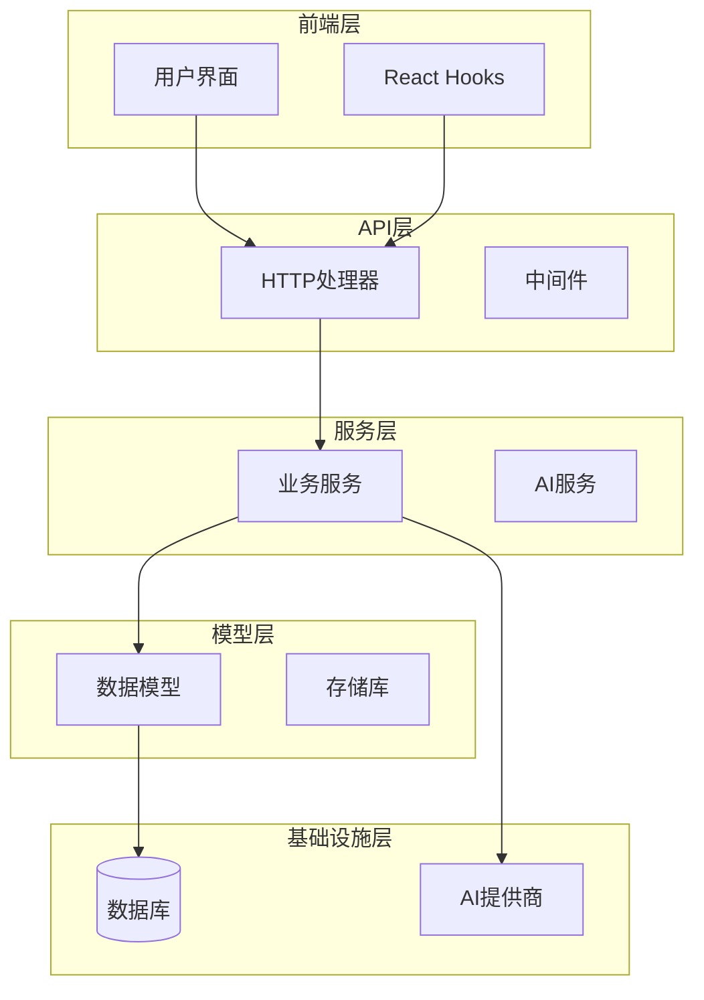

**图表来源**
- [context.go](file://backend/internal/model/context.go#L1-L30)
- [contact.go](file://backend/internal/model/contact.go#L1-L27)
- [context.go](file://backend/internal/service/context.go#L1-L169)

## 核心数据模型

### Context实体设计

Context实体是EchoMind上下文理解机制的核心，用于组织邮件和任务的智能上下文。

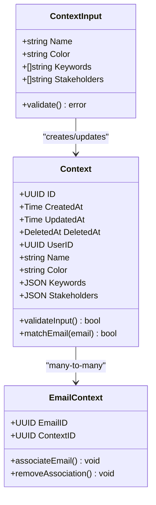

**图表来源**
- [context.go](file://backend/internal/model/context.go#L11-L30)
- [context_input.go](file://backend/internal/model/context_input.go#L4-L10)

#### Context实体属性详解

| 属性名 | 类型 | 约束 | 描述 |
|--------|------|------|------|
| ID | UUID | 主键 | 唯一标识符 |
| UserID | UUID | 非空，索引 | 关联的用户ID |
| Name | string | 非空，最大100字符 | 上下文名称 |
| Color | string | 默认'blue'，最大20字符 | 显示颜色 |
| Keywords | JSON | JSONB类型 | 关键词列表，用于邮件匹配 |
| Stakeholders | JSON | JSONB类型 | 利益相关者邮箱列表 |

**章节来源**
- [context.go](file://backend/internal/model/context.go#L11-L30)

### Contact实体设计

Contact实体扩展为包含社交图谱属性的智能联系人，支持团队共享和私有化管理。

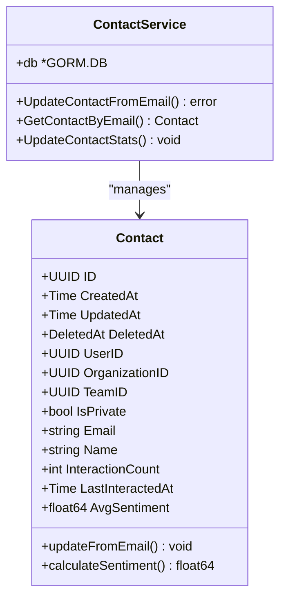

**图表来源**
- [contact.go](file://backend/internal/model/contact.go#L10-L27)
- [contact.go](file://backend/internal/service/contact.go#L12-L40)

#### Contact实体属性详解

| 属性名 | 类型 | 约束 | 描述 |
|--------|------|------|------|
| UserID | UUID | 可空，索引 | 用户所有者（可为空） |
| OrganizationID | UUID | 可空，索引 | 组织ID（共享时设置） |
| TeamID | UUID | 可空，索引 | 团队ID（共享时设置） |
| IsPrivate | bool | 默认true | 私有标志 |
| Email | string | 非空 | 联系人邮箱 |
| Name | string | 可空 | 联系人姓名 |
| InteractionCount | int | 默认0，非空 | 交互次数 |
| LastInteractedAt | Time | 可空 | 最后交互时间 |
| AvgSentiment | float64 | 默认0.0，范围-1.0到1.0 | 平均情感值 |

**章节来源**
- [contact.go](file://backend/internal/model/contact.go#L10-L27)

### 输入模型设计

#### ContextInput模型

ContextInput定义了创建或更新上下文的输入结构，确保数据验证和完整性。

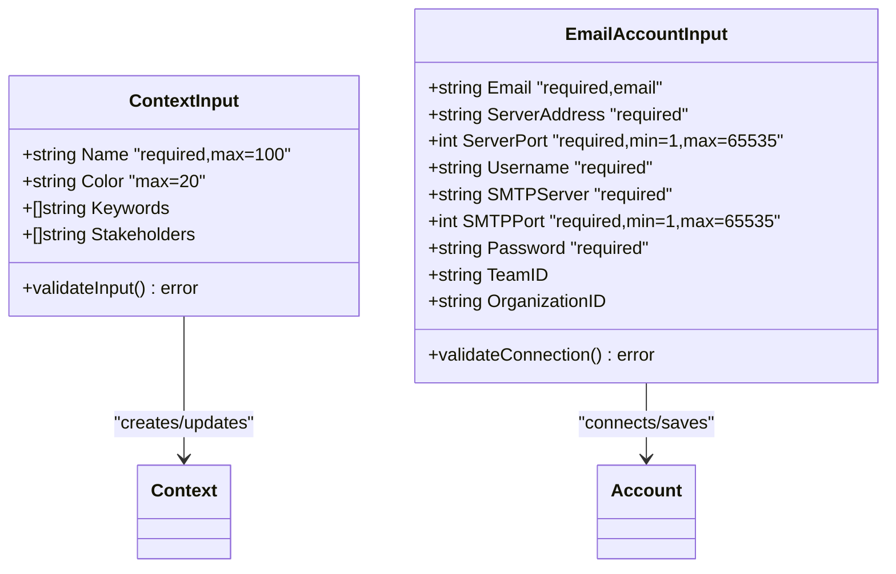

**图表来源**
- [context_input.go](file://backend/internal/model/context_input.go#L4-L10)
- [account_input.go](file://backend/internal/model/account_input.go#L4-L15)

**章节来源**
- [context_input.go](file://backend/internal/model/context_input.go#L4-L10)
- [account_input.go](file://backend/internal/model/account_input.go#L4-L15)

## 架构设计

EchoMind采用典型的三层架构模式，结合领域驱动设计原则：

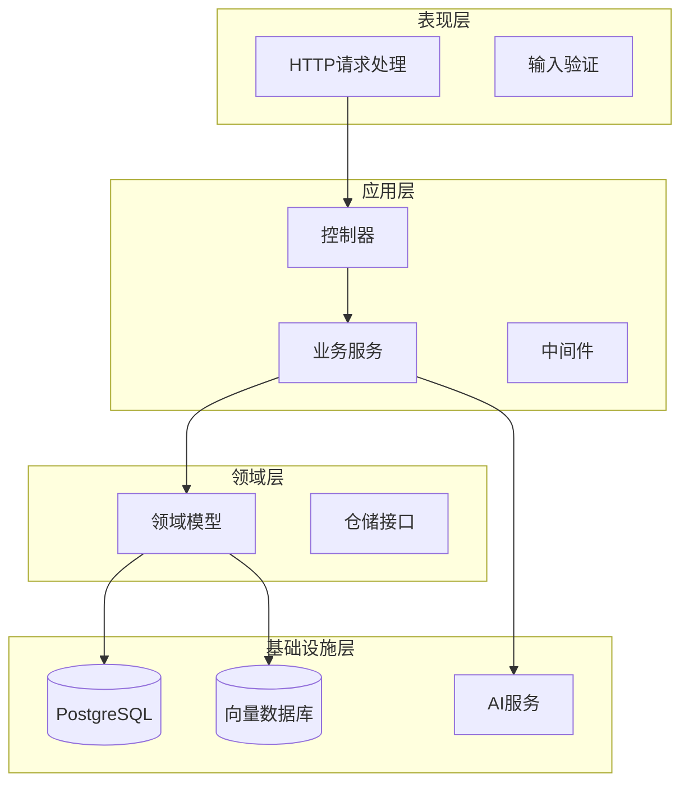

**图表来源**
- [context.go](file://backend/internal/handler/context.go#L12-L18)
- [context.go](file://backend/internal/service/context.go#L14-L20)

## 详细组件分析

### Context服务组件

Context服务负责上下文的生命周期管理，包括创建、查询、更新和删除操作。

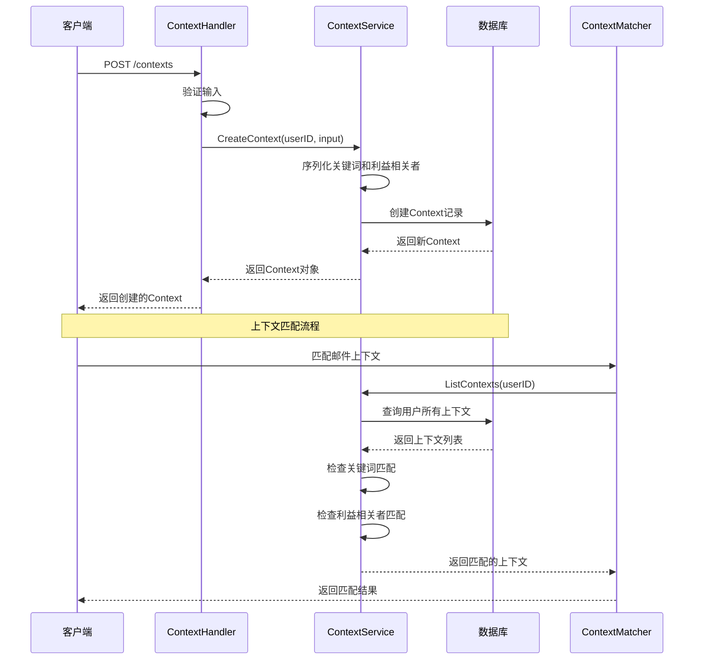

**图表来源**
- [context.go](file://backend/internal/handler/context.go#L21-L37)
- [context.go](file://backend/internal/service/context.go#L22-L47)
- [context.go](file://backend/internal/service/context.go#L107-L152)

#### Context匹配算法

Context匹配算法是系统的核心功能之一，基于关键词和利益相关者进行智能匹配：

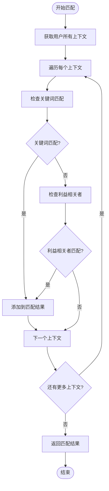

**图表来源**
- [context.go](file://backend/internal/service/context.go#L107-L152)

**章节来源**
- [context.go](file://backend/internal/service/context.go#L22-L169)

### Contact服务组件

Contact服务负责智能联系人的管理和维护，支持自动更新和统计计算。

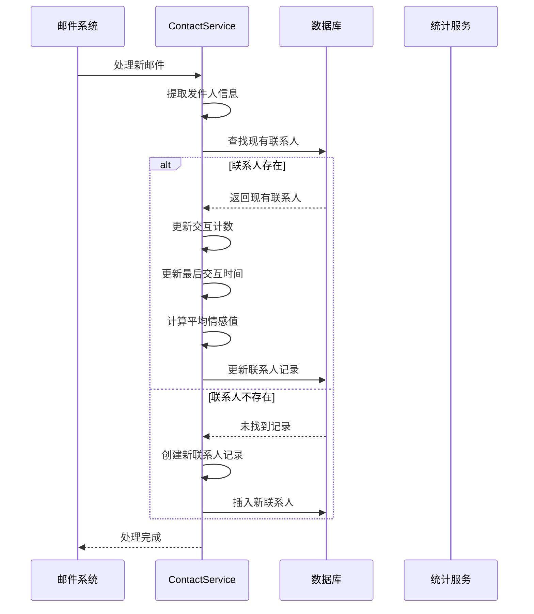

**图表来源**
- [contact.go](file://backend/internal/service/contact.go#L20-L40)

**章节来源**
- [contact.go](file://backend/internal/service/contact.go#L12-L40)

### AI回复生成组件

AI回复生成是基于上下文理解的核心功能，通过多层上下文提取和融合实现智能回复。

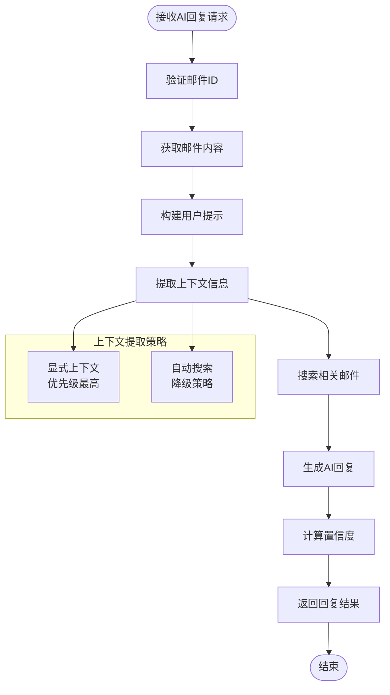

**图表来源**
- [ai_draft.go](file://backend/internal/service/ai_draft.go#L17-L20)
- [chat.go](file://backend/internal/service/chat.go#L52-L80)

**章节来源**
- [ai_draft.go](file://backend/internal/service/ai_draft.go#L1-L20)
- [chat.go](file://backend/internal/service/chat.go#L37-L119)

## 数据流分析

### 基于上下文的AI回复生成流程

当用户请求AI回复时，系统会执行以下数据流处理：

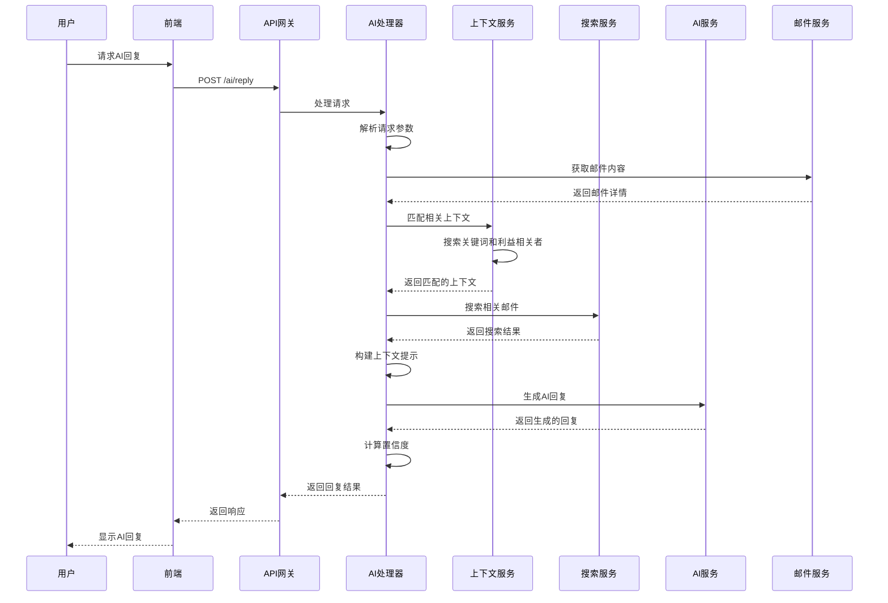

**图表来源**
- [ai_draft.go](file://backend/internal/handler/ai_draft.go#L57-L102)
- [context.go](file://backend/internal/service/context.go#L107-L152)

### 自动上下文分配流程

系统通过后台任务自动为历史邮件分配合适的上下文：

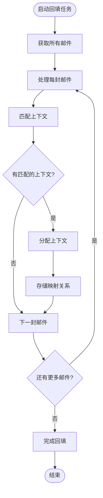

**图表来源**
- [main.go](file://backend/cmd/backfill_contexts/main.go#L36-L67)

**章节来源**
- [main.go](file://backend/cmd/backfill_contexts/main.go#L1-L73)

## 性能优化策略

### 数据库索引策略

为了优化查询性能，系统采用以下索引策略：

| 表名 | 索引字段 | 索引类型 | 用途 |
|------|----------|----------|------|
| contexts | user_id | 单列索引 | 用户上下文查询 |
| contexts | deleted_at | 单列索引 | 软删除过滤 |
| contacts | email | 单列索引 | 联系人查找 |
| contacts | user_id | 单列索引 | 用户联系人查询 |
| email_contexts | email_id | 复合索引 | 邮件-上下文关联查询 |
| email_contexts | context_id | 复合索引 | 上下文-邮件关联查询 |

### 向量搜索优化

对于向量相似性搜索，系统采用HNSW算法优化：

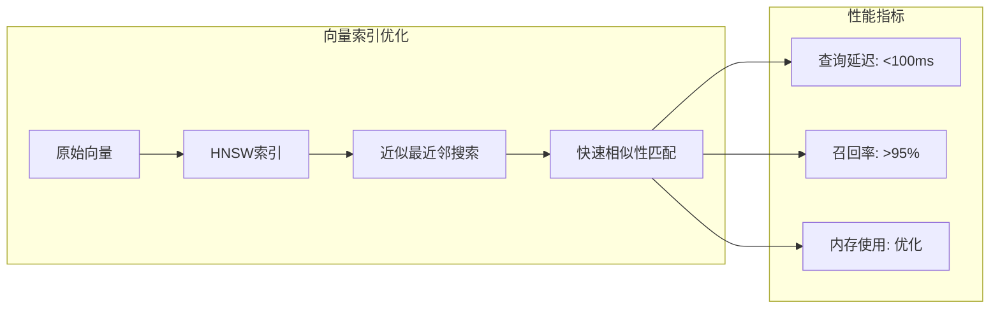

### 缓存策略

系统采用多层缓存策略提升性能：

1. **Redis缓存**：用户上下文和联系人信息
2. **内存缓存**：频繁访问的配置和元数据
3. **数据库连接池**：减少连接开销

### 批处理优化

对于大量数据处理，系统采用批处理策略：

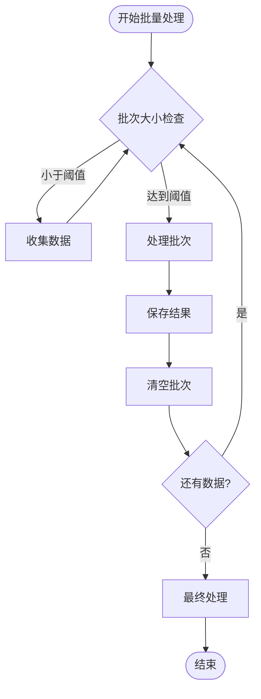

## 故障排除指南

### 常见问题及解决方案

#### 上下文匹配失败

**问题描述**：邮件无法匹配到任何上下文

**排查步骤**：
1. 检查上下文关键词是否正确设置
2. 验证邮件发送者是否在利益相关者列表中
3. 确认用户权限和上下文可见性

**解决方案**：
```sql
-- 检查上下文配置
SELECT id, name, keywords, stakeholders 
FROM contexts 
WHERE user_id = 'user_uuid';

-- 检查邮件匹配规则
SELECT * FROM email_contexts 
WHERE email_id = 'email_uuid';
```

#### 联系人统计异常

**问题描述**：联系人交互统计不准确

**排查步骤**：
1. 检查邮件处理日志
2. 验证联系人更新逻辑
3. 确认时间戳准确性

**解决方案**：
```sql
-- 验证联系人统计
SELECT email, interaction_count, last_interacted_at, avg_sentiment 
FROM contacts 
ORDER BY interaction_count DESC;
```

#### AI回复质量不佳

**问题描述**：AI生成的回复质量不符合预期

**排查步骤**：
1. 检查上下文提取是否充分
2. 验证提示工程是否合理
3. 确认AI模型配置

**章节来源**
- [context.go](file://backend/internal/service/context.go#L107-L152)
- [contact.go](file://backend/internal/service/contact.go#L20-L40)

## 结论

EchoMind的上下文理解机制通过精心设计的Context和Contact实体，实现了智能化的邮件管理和AI回复生成功能。系统的核心优势包括：

1. **智能上下文组织**：通过关键词和利益相关者匹配，实现自动化的邮件分类和组织
2. **社交图谱扩展**：Contact实体支持团队共享和个人化管理，增强协作能力
3. **多层上下文提取**：结合显式上下文和自动搜索，提供丰富的AI回复背景
4. **高性能架构**：采用索引优化、向量搜索和缓存策略，确保系统响应速度

未来发展方向：
- 增强自然语言理解能力
- 扩展多模态内容处理
- 优化个性化推荐算法
- 加强隐私保护和数据安全

通过持续的技术创新和架构优化，EchoMind将继续为用户提供更加智能和高效的邮件管理体验。