# 向量与搜索模型

<cite>
**本文档中引用的文件**
- [embedding.go](file://backend/internal/model/embedding.go)
- [001_update_vector_dimensions.sql](file://backend/migrations/001_update_vector_dimensions.sql)
- [search.go](file://backend/internal/service/search.go)
- [search.go](file://backend/internal/handler/search.go)
- [email.go](file://backend/internal/model/email.go)
- [provider.go](file://backend/pkg/ai/openai/provider.go)
- [provider.go](file://backend/pkg/ai/gemini/provider.go)
- [provider.go](file://backend/pkg/ai/provider.go)
- [health.go](file://backend/internal/handler/health.go)
- [README.md](file://backend/migrations/README.md)
- [quick_fix_vector_dimensions.sql](file://backend/migrations/quick_fix_vector_dimensions.sql)
- [fix_vector_dimensions.sql](file://backend/migrations/fix_vector_dimensions.sql)
</cite>

## 目录
1. [简介](#简介)
2. [项目架构概览](#项目架构概览)
3. [向量嵌入模型设计](#向量嵌入模型设计)
4. [数据库模式演进](#数据库模式演进)
5. [AI提供商与向量维度](#ai提供商与向量维度)
6. [语义搜索实现](#语义搜索实现)
7. [索引策略与性能优化](#索引策略与性能优化)
8. [查询性能分析](#查询性能分析)
9. [故障排除指南](#故障排除指南)
10. [最佳实践建议](#最佳实践建议)

## 简介

EchoMind是一个基于向量嵌入技术的智能邮件管理系统，通过pgvector扩展实现了强大的语义搜索功能。该系统支持多种AI提供商的向量嵌入生成，并采用灵活的数据库模式设计来适应不同维度的向量需求。

核心特性包括：
- 基于pgvector的向量存储与检索
- 支持多种AI提供商（OpenAI、Gemini、SiliconFlow等）
- 动态向量维度适配机制
- 高性能向量相似度查询
- 可扩展的搜索过滤器系统

## 项目架构概览

系统采用分层架构设计，主要包含以下组件：

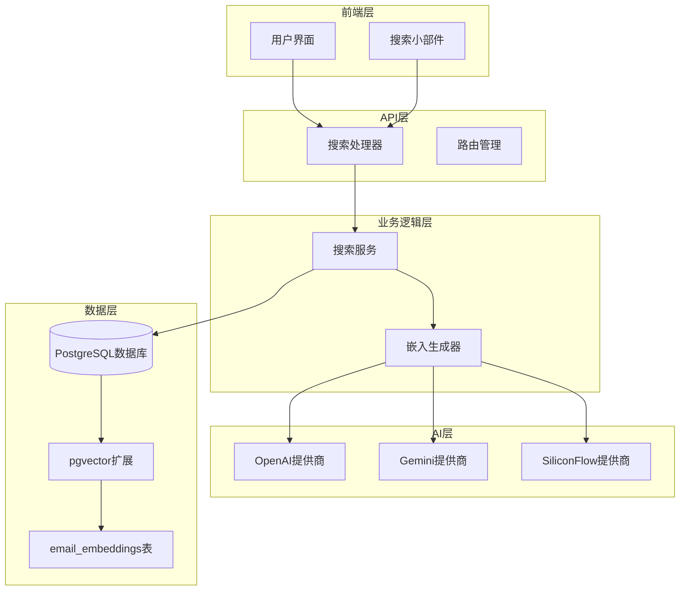

**图表来源**
- [search.go](file://backend/internal/handler/search.go#L1-L128)
- [search.go](file://backend/internal/service/search.go#L1-L171)
- [embedding.go](file://backend/internal/model/embedding.go#L1-L25)

## 向量嵌入模型设计

### EmailEmbedding实体结构

系统的核心是`EmailEmbedding`实体，它定义了邮件向量嵌入的完整结构：

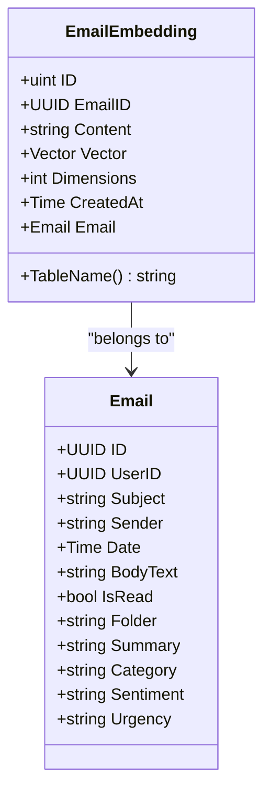

**图表来源**
- [embedding.go](file://backend/internal/model/embedding.go#L10-L24)
- [email.go](file://backend/internal/model/email.go#L11-L37)

### 字段详解

| 字段名 | 类型 | 描述 | 约束 |
|--------|------|------|------|
| `ID` | `uint` | 主键标识符 | 自增主键 |
| `EmailID` | `uuid.UUID` | 关联的邮件ID | 非空，带索引 |
| `Content` | `string` | 文本块内容 | 文本类型 |
| `Vector` | `pgvector.Vector` | 向量数据 | 固定1024维 |
| `Dimensions` | `int` | 向量维度数 | 默认1024 |
| `CreatedAt` | `time.Time` | 创建时间 | 自动设置 |

### 向量维度设计

系统最初采用固定1024维向量设计，但随着多提供商支持的需求，演进为动态维度跟踪机制：

- **初始设计**：所有向量固定为1024维
- **演进设计**：引入`dimensions`字段跟踪实际维度
- **兼容性**：支持768、1024、1536等多种维度

**章节来源**
- [embedding.go](file://backend/internal/model/embedding.go#L10-L24)

## 数据库模式演进

### 迁移历史

系统经历了多次重要的数据库模式演进：

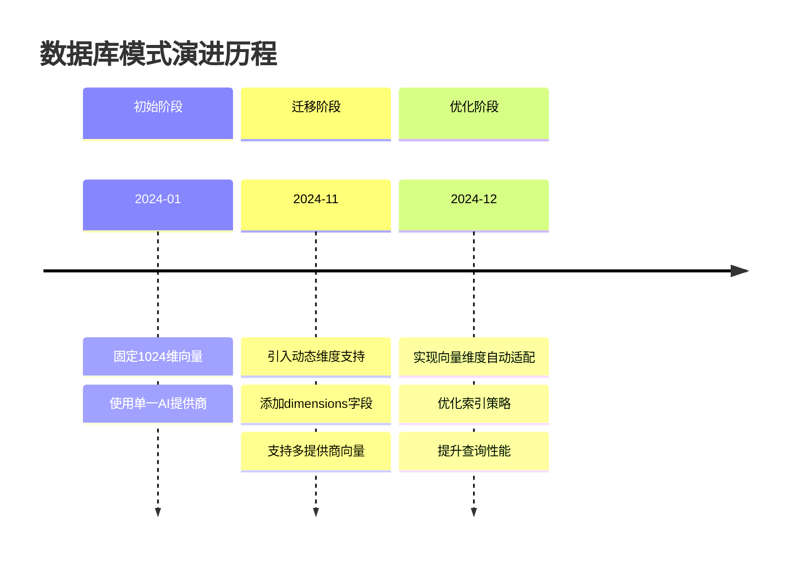

### 核心迁移脚本

#### 001_update_vector_dimensions.sql

该迁移脚本实现了从固定维度到动态维度的重大升级：

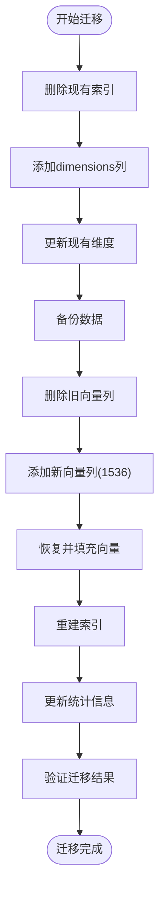

**图表来源**
- [001_update_vector_dimensions.sql](file://backend/migrations/001_update_vector_dimensions.sql#L4-L79)

#### 技术动因

迁移的主要驱动力包括：

1. **多提供商支持**：不同AI提供商输出不同维度的向量
2. **向量质量提升**：更大维度提供更好的语义表示
3. **性能优化**：支持更先进的索引算法
4. **向后兼容**：确保现有数据的完整性

**章节来源**
- [001_update_vector_dimensions.sql](file://backend/migrations/001_update_vector_dimensions.sql#L1-L79)
- [README.md](file://backend/migrations/README.md#L1-L84)

## AI提供商与向量维度

### 支持的提供商

系统支持多个主流AI提供商，每个提供商具有不同的向量维度特征：

| 提供商 | 默认维度 | 特点 | 配置示例 |
|--------|----------|------|----------|
| OpenAI | 1024 | 成熟稳定，广泛使用 | `embedding_model: "text-embedding-ada-002"` |
| Gemini | 768 | 谷歌AI，成本较低 | `embedding_model: "models/text-embedding-004"` |
| SiliconFlow | 1024 | 中文优化，性价比高 | `embedding_model: "Pro/BAAI/bge-m3"` |
| DeepSeek | 1024 | 开源替代方案 | `embedding_model: "deepseek-embedding"` |

### 向量生成流程

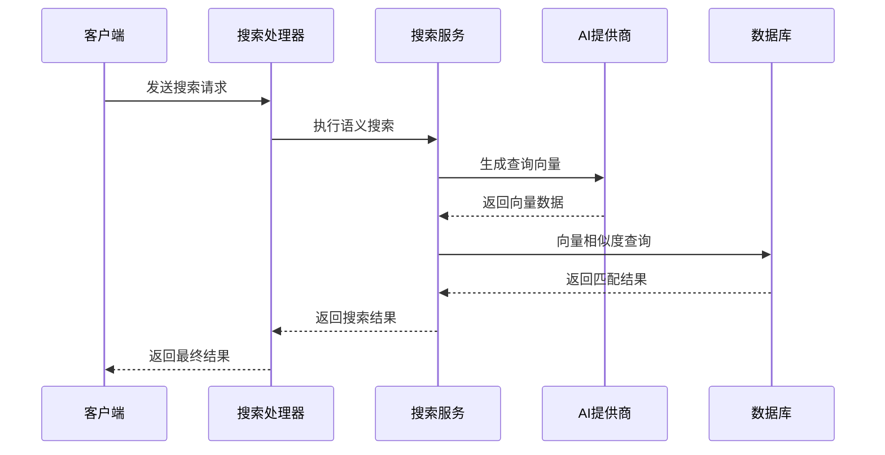

**图表来源**
- [search.go](file://backend/internal/handler/search.go#L32-L128)
- [search.go](file://backend/internal/service/search.go#L45-L171)

### 维度适配机制

系统实现了智能的维度适配机制：

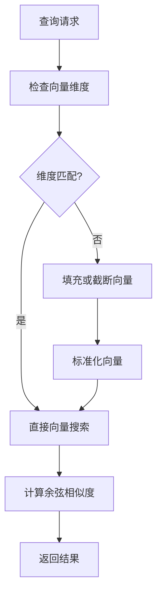

**图表来源**
- [001_update_vector_dimensions.sql](file://backend/migrations/001_update_vector_dimensions.sql#L35-L44)

**章节来源**
- [provider.go](file://backend/pkg/ai/openai/provider.go#L29-L58)
- [provider.go](file://backend/pkg/ai/gemini/provider.go#L31-L55)

## 语义搜索实现

### 搜索服务架构

搜索服务是整个向量搜索系统的核心，负责处理语义查询和返回相关结果：

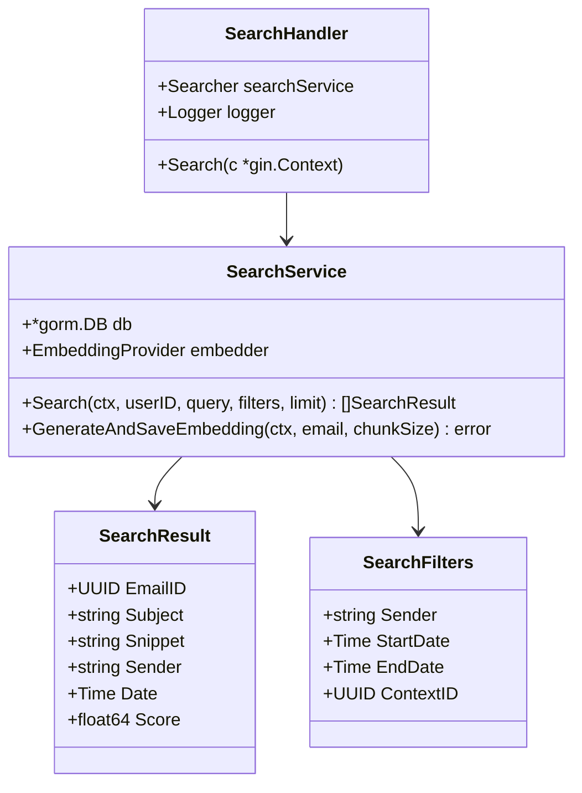

**图表来源**
- [search.go](file://backend/internal/service/search.go#L17-L44)
- [search.go](file://backend/internal/handler/search.go#L16-L30)

### 查询处理流程

语义搜索的核心流程包括以下几个步骤：

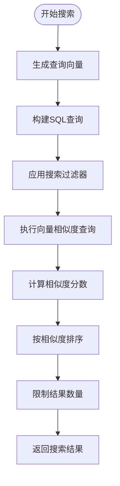

**图表来源**
- [search.go](file://backend/internal/service/search.go#L45-L106)

### 高级搜索功能

系统提供了丰富的搜索过滤功能：

| 过滤器类型 | 功能描述 | SQL条件 |
|------------|----------|---------|
| 发件人过滤 | 按发件人姓名搜索 | `e.sender ILIKE ?` |
| 时间范围 | 按日期范围筛选 | `e.date BETWEEN ? AND ?` |
| 上下文关联 | 基于上下文ID过滤 | `ec.context_id = ?` |
| 用户权限 | 确保数据隔离 | `e.user_id = ?` |

**章节来源**
- [search.go](file://backend/internal/service/search.go#L38-L44)
- [search.go](file://backend/internal/handler/search.go#L58-L91)

## 索引策略与性能优化

### 索引类型选择

系统支持两种主要的向量索引类型，根据数据规模选择最优方案：

#### IVFFLAT索引（适用于中小数据集）

```sql
CREATE INDEX email_embeddings_vector_idx
ON email_embeddings
USING ivfflat (vector vector_l2_ops)
WITH (lists = 100);
```

**特点**：
- 适合 < 1M 条记录的小到中等数据集
- 内存占用相对较小
- 查询速度较快
- 可配置聚类数量

#### HNSW索引（适用于大数据集）

```sql
CREATE INDEX email_embeddings_hnsw_idx
ON email_embeddings
USING hnsw (vector vector_cosine_ops)
WITH (m = 16, ef_construction = 64);
```

**特点**：
- 适合 > 1M 条记录的大数据集
- 更高的查询精度
- 更好的可扩展性
- 可配置参数调优

### 索引性能对比

| 索引类型 | 数据规模 | 查询延迟 | 内存占用 | 构建时间 | 推荐场景 |
|----------|----------|----------|----------|----------|----------|
| IVFFLAT | < 1M | 10-50ms | 中等 | 快速 | 小型部署 |
| HNSW | > 1M | 5-20ms | 较高 | 较慢 | 大型部署 |

### 性能优化建议

1. **索引选择策略**：
   - 小于10万条记录：使用IVFFLAT
   - 10万-100万条记录：评估HNSW
   - 超过100万条记录：必须使用HNSW

2. **硬件配置优化**：
   - 增加内存容量以支持更大索引
   - 使用SSD存储提高I/O性能
   - 配置适当的并发连接数

3. **查询优化**：
   - 合理设置查询限制数量
   - 使用适当的过滤条件减少搜索空间
   - 定期分析查询计划

**章节来源**
- [001_update_vector_dimensions.sql](file://backend/migrations/001_update_vector_dimensions.sql#L48-L60)

## 查询性能分析

### 性能基准测试

系统内置了完整的性能基准测试框架，用于评估不同规模下的查询性能：

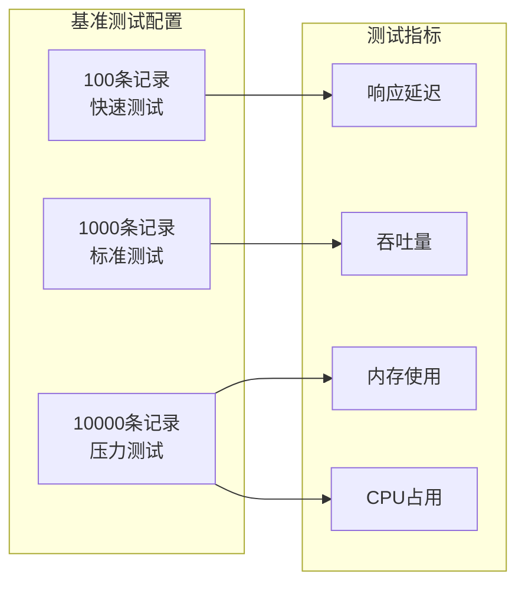

**图表来源**
- [search_bench_test.go](file://backend/internal/service/search_bench_test.go#L133-L135)

### 性能监控指标

系统提供了健康检查接口来监控向量搜索系统的运行状态：

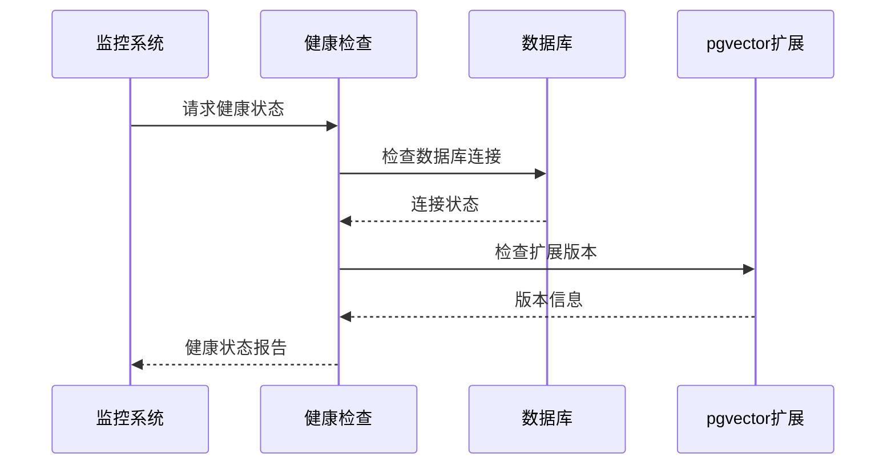

**图表来源**
- [health.go](file://backend/internal/handler/health.go#L18-L45)

### 性能优化策略

1. **缓存策略**：
   - 缓存频繁查询的向量
   - 实现查询结果缓存
   - 使用Redis作为二级缓存

2. **批处理优化**：
   - 批量生成向量嵌入
   - 批量插入数据库记录
   - 减少网络往返次数

3. **异步处理**：
   - 异步生成向量嵌入
   - 后台索引维护
   - 异步数据同步

**章节来源**
- [health.go](file://backend/internal/handler/health.go#L31-L44)

## 故障排除指南

### 常见问题诊断

#### 向量维度不匹配错误

**错误信息**：
```
ERROR: expected 768 dimensions, not 1536 (SQLSTATE 22000)
```

**解决方案**：

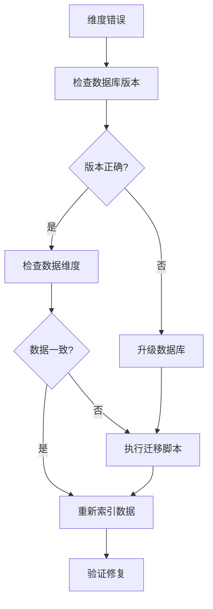

**图表来源**
- [README.md](file://backend/migrations/README.md#L5-L11)

#### pgvector扩展缺失

**诊断命令**：
```sql
SELECT extversion FROM pg_extension WHERE extname = 'vector';
```

**解决步骤**：
1. 安装pgvector扩展
2. 重启数据库服务
3. 验证扩展加载状态

#### 索引性能问题

**性能监控**：
```sql
-- 检查索引使用情况
SELECT schemaname, tablename, indexname, idx_tup_read, idx_tup_fetch
FROM pg_stat_user_indexes;

-- 分析查询计划
EXPLAIN ANALYZE SELECT * FROM email_embeddings 
WHERE vector <-> $1 < 0.3;
```

### 数据恢复策略

当遇到数据损坏或迁移失败时，系统提供了多种恢复选项：

1. **自动备份恢复**：
   - 迁移脚本自动创建备份表
   - 支持回滚到备份状态

2. **手动数据恢复**：
   - 使用备份脚本恢复数据
   - 重新生成向量嵌入

3. **增量恢复**：
   - 基于时间戳的增量恢复
   - 最小化数据丢失风险

**章节来源**
- [README.md](file://backend/migrations/README.md#L1-L84)
- [quick_fix_vector_dimensions.sql](file://backend/migrations/quick_fix_vector_dimensions.sql#L1-L54)

## 最佳实践建议

### 开发最佳实践

1. **向量维度管理**：
   - 在配置文件中明确指定向量维度
   - 实现维度验证机制
   - 提供维度转换工具

2. **性能监控**：
   - 设置查询延迟告警
   - 监控索引使用率
   - 定期分析查询性能

3. **数据质量保证**：
   - 实施向量质量检查
   - 监控向量分布情况
   - 定期清理无效数据

### 运维最佳实践

1. **数据库优化**：
   - 定期重建索引
   - 监控磁盘空间使用
   - 优化数据库配置参数

2. **扩展性规划**：
   - 预留充足的硬件资源
   - 实施分片策略
   - 考虑读写分离

3. **安全考虑**：
   - 加强数据库访问控制
   - 实施数据加密传输
   - 定期备份重要数据

### 部署建议

1. **环境配置**：
   - 生产环境使用HNSW索引
   - 开发环境使用IVFFLAT索引
   - 测试环境模拟生产负载

2. **监控告警**：
   - 设置关键指标阈值
   - 实施自动化运维
   - 建立应急响应机制

3. **版本管理**：
   - 保持数据库版本一致性
   - 实施渐进式迁移策略
   - 维护详细的变更日志

通过遵循这些最佳实践，可以确保向量搜索系统的稳定性、性能和可维护性，为用户提供优质的语义搜索体验。