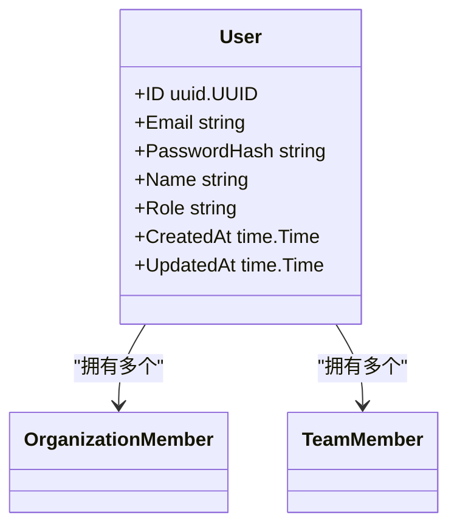
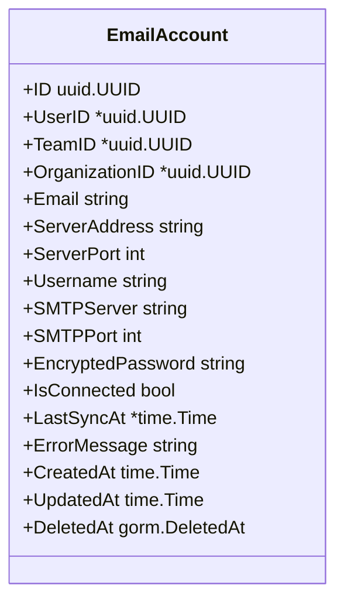
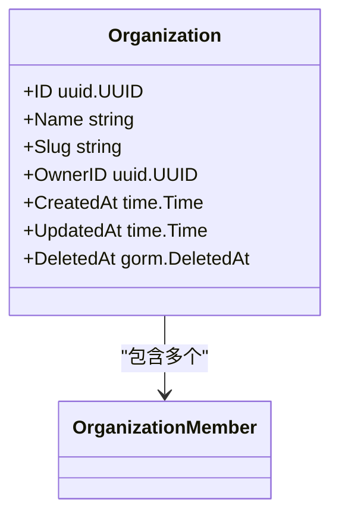
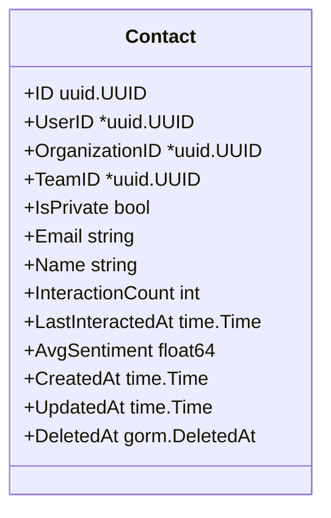
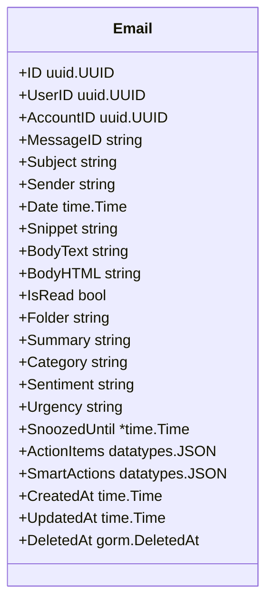
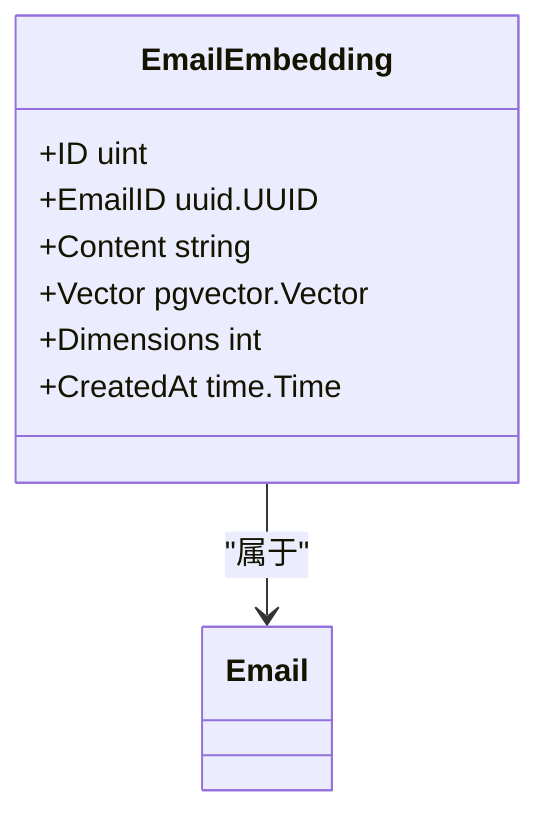
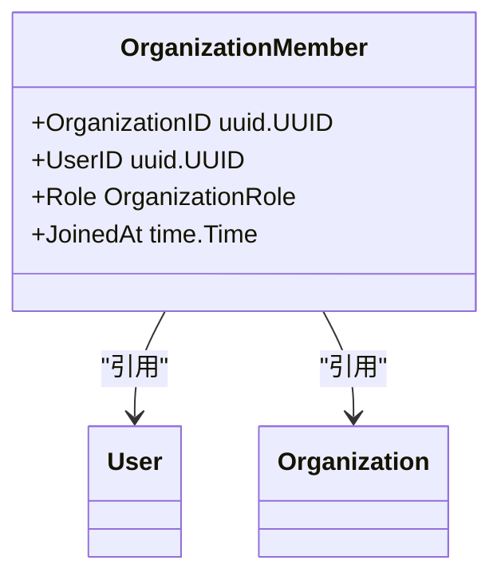
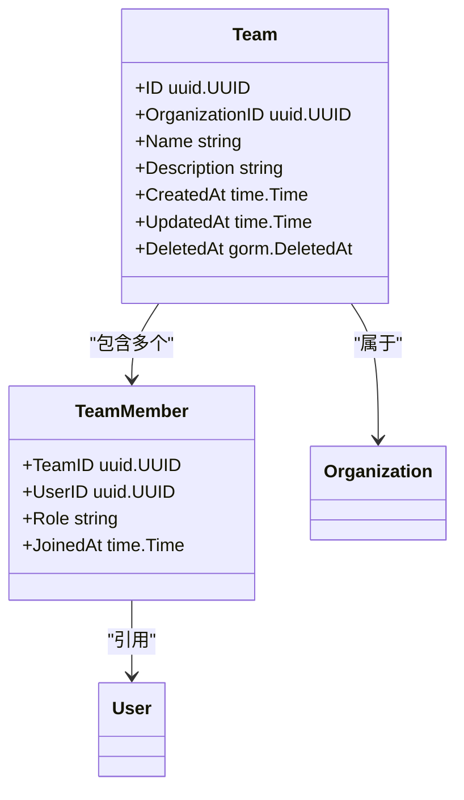
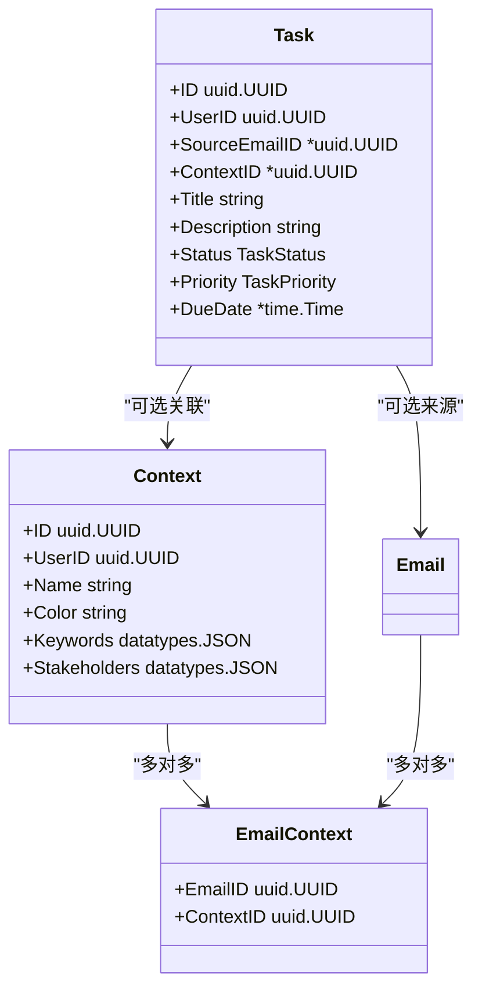

# 数据模型

<cite>
**本文档中引用的文件**
- [user.go](file://backend/internal/model/user.go)
- [email.go](file://backend/internal/model/email.go)
- [email_account.go](file://backend/internal/model/email_account.go)
- [organization.go](file://backend/internal/model/organization.go)
- [contact.go](file://backend/internal/model/contact.go)
- [embedding.go](file://backend/internal/model/embedding.go)
- [team.go](file://backend/internal/model/team.go)
- [member.go](file://backend/internal/model/member.go)
- [context.go](file://backend/internal/model/context.go)
- [task.go](file://backend/internal/model/task.go)
- [README.md](file://backend/migrations/README.md)
- [001_update_vector_dimensions.sql](file://backend/migrations/001_update_vector_dimensions.sql)
- [fix_vector_dimensions.sql](file://backend/migrations/fix_vector_dimensions.sql)
- [quick_fix_vector_dimensions.sql](file://backend/migrations/quick_fix_vector_dimensions.sql)
- [postgres.go](file://backend/pkg/database/postgres.go)
- [main.go](file://backend/cmd/db_init/main.go)
</cite>

## 目录
1. [简介](#简介)
2. [核心实体模型](#核心实体模型)
3. [向量嵌入模型](#向量嵌入模型)
4. [关联关系与数据结构](#关联关系与数据结构)
5. [数据库迁移与演进](#数据库迁移与演进)
6. [数据访问与初始化](#数据访问与初始化)
7. [总结](#总结)

## 简介
EchoMind 是一个智能邮件管理系统，其数据模型围绕用户、邮件、组织、联系人等核心实体构建。本文档详细描述了系统的数据库 Schema，包括主要实体的字段定义、数据类型、主外键关系和约束条件。特别关注向量嵌入（Embedding）表的设计及其与邮件表的关联机制，并结合迁移脚本说明数据库的演进过程，为开发者提供数据访问和查询的坚实基础。

**Section sources**
- [user.go](file://backend/internal/model/user.go#L1-L23)
- [email.go](file://backend/internal/model/email.go#L1-L37)

## 核心实体模型

### 用户 (User)
`User` 实体表示系统中的注册用户，包含身份认证和基本信息。

**字段说明：**
- `ID`: UUID 类型，主键
- `Email`: 字符串，唯一索引，非空
- `PasswordHash`: 字符串，存储 bcrypt 加密后的密码
- `Name`: 用户姓名
- `Role`: 角色字段，默认为 "manager"
- `CreatedAt` / `UpdatedAt`: 时间戳

**关联关系：**
- 一个用户可属于多个组织（通过 `Memberships`）
- 一个用户可加入多个团队（通过 `TeamMemberships`）



**Diagram sources**
- [user.go](file://backend/internal/model/user.go#L1-L23)

**Section sources**
- [user.go](file://backend/internal/model/user.go#L1-L23)

### 邮件账户 (EmailAccount)
`EmailAccount` 表示用户配置的用于 IMAP 同步的邮箱账户。

**字段说明：**
- `UserID` / `TeamID` / `OrganizationID`: 可为空的外键，支持个人、团队或组织级别的账户
- `Email`: 邮箱地址
- `ServerAddress` / `ServerPort`: IMAP 服务器信息
- `Username` / `EncryptedPassword`: 登录凭证（密码已加密）
- `SMTPServer` / `SMTPPort`: 发件服务器配置
- `IsConnected`: 连接状态标志
- `LastSyncAt`: 上次同步时间
- `ErrorMessage`: 最近一次失败的错误信息



**Diagram sources**
- [email_account.go](file://backend/internal/model/email_account.go#L1-L35)

**Section sources**
- [email_account.go](file://backend/internal/model/email_account.go#L1-L35)

### 组织 (Organization)
`Organization` 表示用户所属的组织单位。

**字段说明：**
- `ID`: UUID 主键
- `Name`: 组织名称，非空
- `Slug`: URL 路由用的唯一标识
- `OwnerID`: 组织所有者 ID
- `CreatedAt` / `UpdatedAt` / `DeletedAt`: 时间戳

**关联关系：**
- 一个组织包含多个成员（`Members`）



**Diagram sources**
- [organization.go](file://backend/internal/model/organization.go#L1-L22)

**Section sources**
- [organization.go](file://backend/internal/model/organization.go#L1-L22)

### 联系人 (Contact)
`Contact` 表示用户的联系人信息。

**字段说明：**
- `UserID` / `TeamID` / `OrganizationID`: 所属范围外键
- `IsPrivate`: 是否为私有联系人
- `Email`: 邮箱地址，非空
- `Name`: 联系人姓名
- `InteractionCount`: 交互次数统计
- `LastInteractedAt`: 最后互动时间
- `AvgSentiment`: 平均情感得分（-1.0 到 1.0）



**Diagram sources**
- [contact.go](file://backend/internal/model/contact.go#L1-L27)

**Section sources**
- [contact.go](file://backend/internal/model/contact.go#L1-L27)

### 邮件 (Email)
`Email` 表示存储在数据库中的邮件消息。

**字段说明：**
- `UserID`: 所属用户
- `AccountID`: 关联的邮箱账户
- `MessageID`: 唯一消息 ID
- `Subject` / `Sender` / `Date`: 邮件基本信息
- `BodyText` / `BodyHTML`: 正文内容
- `IsRead`: 是否已读
- `Folder`: 文件夹分类
- `Summary`: AI 生成的摘要
- `Category` / `Sentiment` / `Urgency`: 分类与情绪分析
- `SnoozedUntil`: 延迟提醒时间
- `ActionItems` / `SmartActions`: JSON 格式的任务与智能操作



**Diagram sources**
- [email.go](file://backend/internal/model/email.go#L1-L37)

**Section sources**
- [email.go](file://backend/internal/model/email.go#L1-L37)

## 向量嵌入模型

### 邮件嵌入 (EmailEmbedding)
`EmailEmbedding` 表用于存储邮件内容的向量表示，支持语义搜索功能。

**字段说明：**
- `ID`: 自增主键
- `EmailID`: 关联的邮件 ID，带级联删除约束
- `Content`: 原始文本片段
- `Vector`: 向量数据，类型为 `vector(1536)`
- `Dimensions`: 实际维度数，默认 1024
- `CreatedAt`: 创建时间

**特殊设计：**
- 使用 `pgvector` 扩展支持向量存储
- `Vector` 字段固定为 1536 维度以兼容不同 AI 提供商（Gemini 768, SiliconFlow 1024, OpenAI 1536）
- 通过 `dimensions` 字段记录实际向量维度，实现向后兼容



**Diagram sources**
- [embedding.go](file://backend/internal/model/embedding.go#L1-L25)

**Section sources**
- [embedding.go](file://backend/internal/model/embedding.go#L1-L25)

## 关联关系与数据结构

### 组织成员 (OrganizationMember)
多对多关系表，连接用户与组织。

**字段说明：**
- 复合主键：`OrganizationID` + `UserID`
- `Role`: 成员角色（owner/admin/member）
- `JoinedAt`: 加入时间



**Diagram sources**
- [member.go](file://backend/internal/model/member.go#L1-L27)

**Section sources**
- [member.go](file://backend/internal/model/member.go#L1-L27)

### 团队 (Team) 与团队成员 (TeamMember)
类似组织结构，支持团队级别的资源管理。



**Section sources**
- [team.go](file://backend/internal/model/team.go#L1-L23)
- [team_member.go](file://backend/internal/model/team_member.go#L1-L25)

### 上下文 (Context) 与任务 (Task)
支持项目/主题级别的邮件和任务组织。



**Section sources**
- [context.go](file://backend/internal/model/context.go#L1-L30)
- [task.go](file://backend/internal/model/task.go#L1-L45)

## 数据库迁移与演进

### 向量维度迁移
由于 AI 提供商的嵌入向量维度不同（768/1024/1536），系统通过迁移脚本统一升级到 1536 维度。

**主要迁移脚本：**
- `001_update_vector_dimensions.sql`: 完整迁移流程，包括备份、维度转换、索引重建
- `fix_vector_dimensions.sql`: 简化版本，直接删除旧表并重建
- `quick_fix_vector_dimensions.sql`: 快速修复脚本，添加维度跟踪并调整向量列

**迁移步骤：**
1. 备份现有 `email_embeddings` 表
2. 删除旧的向量索引
3. 添加 `dimensions` 字段记录原始维度
4. 将 `vector` 列改为 `vector(1536)` 类型
5. 对小于 1536 的向量进行零填充，对更大的向量进行截断
6. 重建 IVFFLAT 或 HNSW 索引

**注意事项：**
- 迁移会删除现有嵌入数据，需重新生成
- 必须执行 `make reindex` 重新生成所有嵌入向量
- 服务需要重启以应用新表结构

```mermaid
flowchart TD
A[开始迁移] --> B[备份 email_embeddings]
B --> C[删除旧索引]
C --> D[添加 dimensions 字段]
D --> E[更新维度值]
E --> F[删除旧 vector 列]
F --> G[添加 vector(1536) 列]
G --> H[填充/截断向量]
H --> I[重建索引]
I --> J[验证迁移]
J --> K[完成]
```

**Diagram sources**
- [001_update_vector_dimensions.sql](file://backend/migrations/001_update_vector_dimensions.sql#L1-L79)
- [fix_vector_dimensions.sql](file://backend/migrations/fix_vector_dimensions.sql#L1-L15)
- [quick_fix_vector_dimensions.sql](file://backend/migrations/quick_fix_vector_dimensions.sql#L1-L54)

**Section sources**
- [README.md](file://backend/migrations/README.md#L1-L116)

## 数据访问与初始化

### 数据库连接
使用 GORM 作为 ORM 框架，通过 `postgres.go` 初始化 PostgreSQL 连接。

```go
func New(dsn string) (*gorm.DB, error) {
	db, err := gorm.Open(postgres.Open(dsn), &gorm.Config{})
	if err != nil {
		return nil, fmt.Errorf("failed to connect to database: %w", err)
	}
	return db, nil
}
```

### 数据库初始化
通过 `db_init/main.go` 执行数据库初始化，包括：
- 自动创建表结构
- 设置 PostgreSQL 扩展（如 pgvector）
- 应用初始迁移

**Makefile 集成：**
```makefile
db-init: docker-up wait-for-db
	cd backend && go run cmd/db_init/main.go
```

**Section sources**
- [postgres.go](file://backend/pkg/database/postgres.go#L1-L17)
- [main.go](file://backend/cmd/db_init/main.go#L1-L29)

## 总结
EchoMind 的数据模型设计充分考虑了现代智能邮件系统的需求，通过清晰的实体划分和灵活的关联关系支持复杂的业务场景。向量嵌入表的设计体现了对多 AI 提供商兼容性的考量，而完善的迁移脚本确保了数据库架构的平滑演进。开发者在进行数据访问时，应遵循 GORM 的约定，并注意向量数据的特殊处理要求。