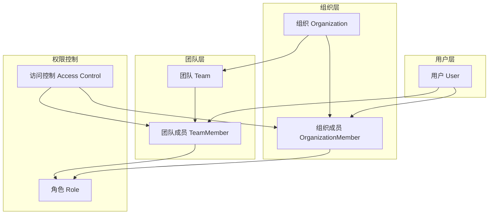
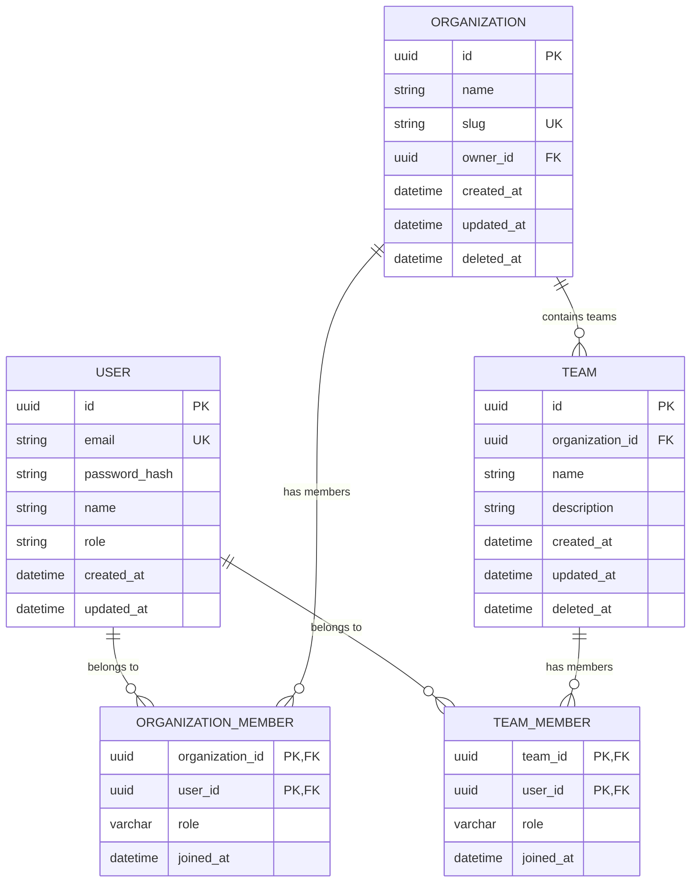
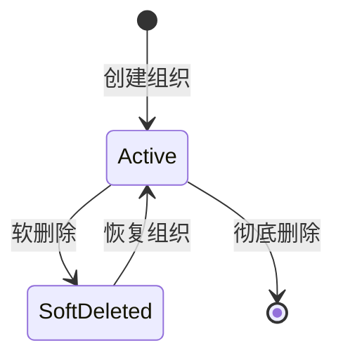
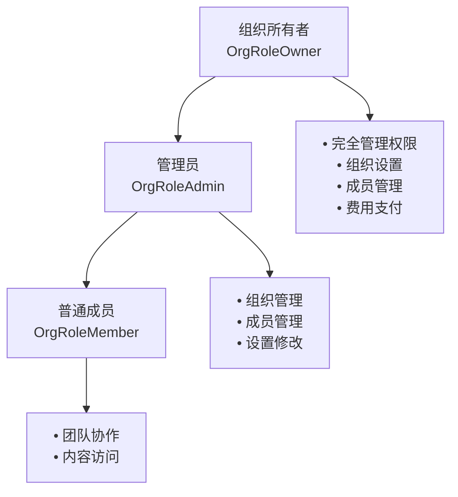
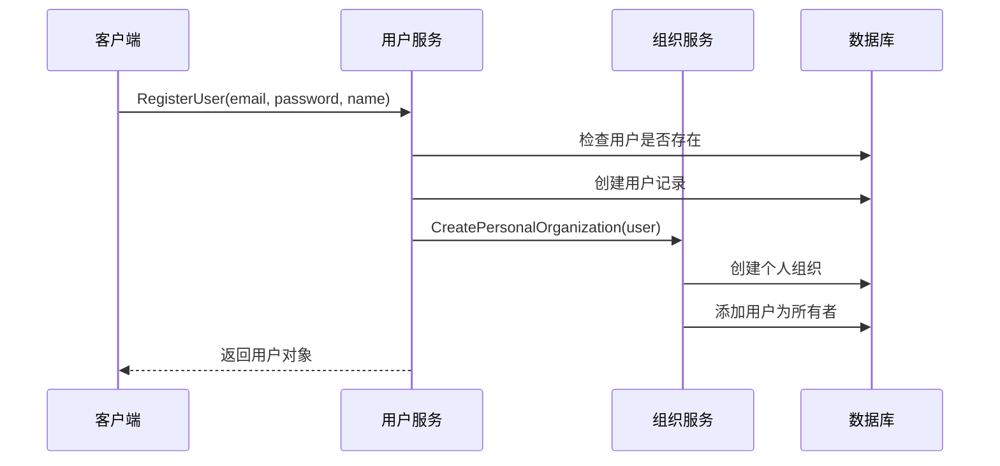
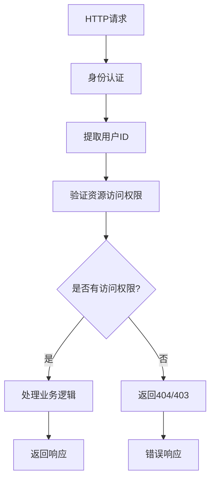

# 用户与组织模型

<cite>
**本文档引用的文件**
- [user.go](file://backend/internal/model/user.go)
- [organization.go](file://backend/internal/model/organization.go)
- [team.go](file://backend/internal/model/team.go)
- [member.go](file://backend/internal/model/member.go)
- [team_member.go](file://backend/internal/model/team_member.go)
- [user.go](file://backend/internal/service/user.go)
- [organization.go](file://backend/internal/service/organization.go)
- [auth.go](file://backend/internal/middleware/auth.go)
- [CreateOrganizationModal.tsx](file://frontend/src/components/layout/CreateOrganizationModal.tsx)
- [organization.ts](file://frontend/src/lib/api/organization.ts)
</cite>

## 目录
1. [简介](#简介)
2. [系统架构概览](#系统架构概览)
3. [核心数据模型](#核心数据模型)
4. [实体关系图](#实体关系图)
5. [详细模型分析](#详细模型分析)
6. [服务层实现](#服务层实现)
7. [多租户架构设计](#多租户架构设计)
8. [权限管理机制](#权限管理机制)
9. [数据访问模式](#数据访问模式)
10. [最佳实践与建议](#最佳实践与建议)

## 简介

EchoMind采用基于用户-组织-团队的三层权限管理体系，实现了完整的多租户架构。该系统通过清晰的角色分工和严格的访问控制，确保了数据的安全隔离和高效的协作管理。

核心设计理念：
- **用户中心**：每个注册用户都拥有独立的个人工作空间
- **组织隔离**：不同组织间的数据完全隔离
- **团队协作**：支持跨组织的临时团队协作
- **权限分级**：细粒度的角色权限控制

## 系统架构概览



**图表来源**
- [user.go](file://backend/internal/model/user.go#L10-L22)
- [organization.go](file://backend/internal/model/organization.go#L10-L21)
- [team.go](file://backend/internal/model/team.go#L10-L22)
- [member.go](file://backend/internal/model/member.go#L17-L26)
- [team_member.go](file://backend/internal/model/team_member.go#L9-L18)

## 核心数据模型

### User（用户）模型

用户是系统的基本实体，代表注册的个体用户。

| 字段名 | 数据类型 | 约束 | 描述 |
|--------|----------|------|------|
| ID | UUID | 主键，非空 | 用户唯一标识符 |
| Email | String | 唯一索引，非空 | 用户邮箱地址 |
| PasswordHash | String | 非空 | BCrypt加密的密码哈希 |
| Name | String | 最大长度100 | 用户显示名称 |
| Role | String | 默认'manager' | 用户角色类型 |
| CreatedAt | DateTime | 自动创建时间 | 用户创建时间 |
| UpdatedAt | DateTime | 自动更新时间 | 用户最后修改时间 |

**字段来源**
- [user.go](file://backend/internal/model/user.go#L11-L15)

### Organization（组织）模型

组织代表一个独立的业务实体或团队，是数据隔离的基本单位。

| 字段名 | 数据类型 | 约束 | 描述 |
|--------|----------|------|------|
| ID | UUID | 主键，非空 | 组织唯一标识符 |
| Name | String | 非空 | 组织显示名称 |
| Slug | String | 唯一索引，非空 | URL友好格式的组织标识 |
| OwnerID | UUID | 非空 | 组织所有者用户ID |
| CreatedAt | DateTime | 自动创建时间 | 组织创建时间 |
| UpdatedAt | DateTime | 自动更新时间 | 组织最后修改时间 |
| DeletedAt | DateTime | 软删除索引 | 组织逻辑删除标记 |

**字段来源**
- [organization.go](file://backend/internal/model/organization.go#L11-L17)

### Team（团队）模型

团队是组织内的协作小组，支持跨组织的临时协作。

| 字段名 | 数据类型 | 约束 | 描述 |
|--------|----------|------|------|
| ID | UUID | 主键，非空 | 团队唯一标识符 |
| OrganizationID | UUID | 非空，索引 | 所属组织ID |
| Name | String | 非空 | 团队显示名称 |
| Description | String | 可为空 | 团队描述信息 |
| CreatedAt | DateTime | 自动创建时间 | 团队创建时间 |
| UpdatedAt | DateTime | 自动更新时间 | 团队最后修改时间 |
| DeletedAt | DateTime | 软删除索引 | 团队逻辑删除标记 |

**字段来源**
- [team.go](file://backend/internal/model/team.go#L11-L17)

### OrganizationMember（组织成员）模型

组织成员关系实体，记录用户在组织中的角色和加入时间。

| 字段名 | 数据类型 | 约束 | 描述 |
|--------|----------|------|------|
| OrganizationID | UUID | 主键，外键 | 组织ID |
| UserID | UUID | 主键，外键 | 用户ID |
| Role | OrganizationRole | 默认'member' | 在组织中的角色 |
| JoinedAt | DateTime | 自动创建时间 | 加入组织时间 |

**字段来源**
- [member.go](file://backend/internal/model/member.go#L18-L21)

### TeamMember（团队成员）模型

团队成员关系实体，记录用户在团队中的角色和加入时间。

| 字段名 | 数据类型 | 约束 | 描述 |
|--------|----------|------|------|
| TeamID | UUID | 主键，外键 | 团队ID |
| UserID | UUID | 主键，外键 | 用户ID |
| Role | OrganizationRole | 默认'member' | 在团队中的角色 |
| JoinedAt | DateTime | 自动创建时间 | 加入团队时间 |

**字段来源**
- [team_member.go](file://backend/internal/model/team_member.go#L10-L13)

## 实体关系图



**图表来源**
- [user.go](file://backend/internal/model/user.go#L19-L21)
- [organization.go](file://backend/internal/model/organization.go#L19-L20)
- [team.go](file://backend/internal/model/team.go#L19-L21)
- [member.go](file://backend/internal/model/member.go#L24-L25)
- [team_member.go](file://backend/internal/model/team_member.go#L16-L17)

## 详细模型分析

### 用户模型深度解析

用户模型采用了标准的身份认证设计，支持多种用户角色和状态管理。

#### 关联关系设计
- **Memberships**: 用户与组织的多对多关系，通过OrganizationMember实体实现
- **TeamMemberships**: 用户与团队的多对多关系，通过TeamMember实体实现

#### 角色扩展性
用户角色目前包含：
- `manager`: 默认管理角色
- 可扩展其他角色类型，如`admin`、`viewer`等

**节来源**
- [user.go](file://backend/internal/model/user.go#L10-L22)

### 组织模型深度解析

组织模型实现了完整的业务实体管理，支持软删除和层级结构。

#### 核心特性
- **个人组织**: 每个用户都有自动创建的个人组织
- **组织所有者**: 明确的所有权机制
- **URL友好标识**: 通过Slug字段支持友好的URL路由
- **软删除支持**: 使用DeletedAt字段实现逻辑删除

#### 生命周期管理


**节来源**
- [organization.go](file://backend/internal/model/organization.go#L10-L21)

### 团队模型深度解析

团队模型支持灵活的协作模式，可以在单一组织内或跨组织建立临时协作组。

#### 设计特点
- **组织绑定**: 团队必须属于特定组织
- **软删除**: 支持逻辑删除以保留历史数据
- **描述字段**: 提供详细的团队说明
- **跨组织协作**: 团队成员可以来自不同组织

**节来源**
- [team.go](file://backend/internal/model/team.go#L10-L22)

### 权限角色系统

#### 组织角色层次


**图表来源**
- [member.go](file://backend/internal/model/member.go#L11-L15)

#### 团队角色继承
团队成员角色直接继承自组织角色，支持：
- `owner`: 团队所有者
- `admin`: 团队管理员  
- `member`: 团队普通成员

**节来源**
- [team_member.go](file://backend/internal/model/team_member.go#L12)

## 服务层实现

### 用户服务（UserService）

用户服务负责用户生命周期管理和身份认证。

#### 核心功能
- **用户注册**: 包含自动创建个人组织的事务处理
- **用户登录**: JWT令牌生成和密码验证
- **用户资料更新**: 支持角色和姓名的动态更新
- **用户查询**: 基于ID的用户信息检索

#### 注册流程


**图表来源**
- [user.go](file://backend/internal/service/user.go#L38-L78)

**节来源**
- [user.go](file://backend/internal/service/user.go#L1-L140)

### 组织服务（OrganizationService）

组织服务提供完整的组织管理功能，包括成员关系管理。

#### 核心功能
- **组织创建**: 支持个人组织和团队组织
- **成员管理**: 添加、查询组织成员
- **权限验证**: 基于用户ID的组织访问控制
- **迁移工具**: 确保所有用户都有组织归属

#### 成员查询优化
服务层提供了预加载用户信息的查询方法，避免N+1查询问题：

**节来源**
- [organization.go](file://backend/internal/service/organization.go#L1-L178)

### 查询优化策略

#### 预加载机制
```go
// 获取组织成员并预加载用户信息
err := s.db.WithContext(ctx).
    Preload("User").
    Where("organization_id = ?", orgID).
    Find(&members).Error
```

#### 关联查询模式
```go
// 获取用户所属的所有组织
err := s.db.WithContext(ctx).
    Joins("JOIN organization_members ON organization_members.organization_id = organizations.id").
    Where("organization_members.user_id = ?", userID).
    Find(&orgs).Error
```

## 多租户架构设计

### 数据隔离策略

EchoMind采用严格的多租户隔离策略，确保不同组织间的数据完全独立。

#### 隔离级别
1. **数据库级隔离**: 不同租户使用不同的数据库实例
2. **应用级隔离**: 通过中间件验证用户访问权限
3. **查询级隔离**: 所有查询都包含租户标识符

#### 访问控制流程


**图表来源**
- [auth.go](file://backend/internal/middleware/auth.go#L18-L46)

### 租户标识传递

#### 中间件模式
系统通过JWT令牌传递用户身份，在每个请求中验证租户访问权限：

**节来源**
- [auth.go](file://backend/internal/middleware/auth.go#L14-L60)

#### 请求上下文管理
```go
// 从Gin上下文中提取用户ID
userID, ok := c.Get(ContextUserIDKey)
if !ok {
    return uuid.Nil, false
}

uuidUserID, ok := userID.(uuid.UUID)
return uuidUserID, ok
```

### 数据一致性保证

#### 事务边界
- **用户注册**: 用户创建 + 个人组织创建在同一事务中
- **组织创建**: 组织创建 + 初始成员添加在同一事务中
- **成员变更**: 成员添加/删除在同一事务中完成

#### 并发控制
- **唯一约束**: 邮箱地址、组织Slug等字段的唯一性约束
- **乐观锁**: 使用CreatedAt/UpdatedAt字段检测并发冲突
- **软删除**: 避免物理删除影响数据完整性

## 权限管理机制

### 角色权限矩阵

| 操作类型 | 组织所有者 | 组织管理员 | 普通成员 | 访客 |
|----------|------------|------------|----------|------|
| 查看组织详情 | ✓ | ✓ | ✓ | ✗ |
| 编辑组织设置 | ✓ | ✓ | ✗ | ✗ |
| 添加成员 | ✓ | ✓ | ✗ | ✗ |
| 移除成员 | ✓ | ✓ | ✗ | ✗ |
| 创建团队 | ✓ | ✓ | ✓ | ✗ |
| 编辑团队 | ✓ | ✓ | ✓ | ✗ |
| 删除团队 | ✓ | ✓ | ✗ | ✗ |

### 权限验证实现

#### 组织级权限
```go
// 验证用户是否为组织成员
func (s *OrganizationService) GetOrganizationByID(ctx context.Context, orgID, userID uuid.UUID) (*model.Organization, error) {
    var org model.Organization
    err := s.db.WithContext(ctx).
        Joins("JOIN organization_members ON organization_members.organization_id = organizations.id").
        Where("organizations.id = ? AND organization_members.user_id = ?", orgID, userID).
        First(&org).Error
    return &org, err
}
```

#### 团队级权限
团队权限基于组织角色继承，同时支持团队级别的特殊权限设置。

### 访问控制最佳实践

#### 1. 最小权限原则
- 新用户默认只有基本的成员权限
- 特殊权限需要明确申请和审批
- 定期审查用户权限分配

#### 2. 权限分离
- 组织所有者专注于战略决策
- 管理员负责日常运营
- 普通成员专注于具体任务

#### 3. 权限审计
- 记录所有权限变更操作
- 定期生成权限使用报告
- 监控异常权限访问行为

## 数据访问模式

### Repository模式实现

虽然当前代码中没有显式的Repository接口，但服务层已经实现了类似的功能：

#### 查询模式
```go
// 获取用户组织列表
func (s *OrganizationService) GetUserOrganizations(ctx context.Context, userID uuid.UUID) ([]model.Organization, error) {
    var orgs []model.Organization
    err := s.db.WithContext(ctx).
        Joins("JOIN organization_members ON organization_members.organization_id = organizations.id").
        Where("organization_members.user_id = ?", userID).
        Find(&orgs).Error
    return orgs, err
}
```

#### 关联查询优化
```go
// 获取组织成员并预加载用户信息
func (s *OrganizationService) GetOrganizationMembers(ctx context.Context, orgID uuid.UUID) ([]model.OrganizationMember, error) {
    var members []model.OrganizationMember
    err := s.db.WithContext(ctx).
        Preload("User").
        Where("organization_id = ?", orgID).
        Find(&members).Error
    return members, err
}
```

### 缓存策略

#### 用户信息缓存
- **用户基本信息**: 缓存在Redis中，减少数据库查询
- **组织列表**: 用户切换组织时更新缓存
- **权限信息**: 基于角色的权限配置缓存

#### 查询结果缓存
- **组织成员列表**: 缓存预加载的用户信息
- **团队成员列表**: 缓存团队成员关系
- **用户组织映射**: 缓存用户所属组织列表

### 性能优化技巧

#### N+1查询问题解决
通过GORM的Preload功能避免N+1查询：
```go
// 错误做法：会产生N+1查询
for _, member := range members {
    db.Load(&member.User)
}

// 正确做法：一次性预加载
db.Preload("User").Find(&members)
```

#### 分页查询优化
```go
// 大数据集分页查询
func (s *OrganizationService) GetOrganizationMembersPaginated(ctx context.Context, orgID uuid.UUID, page, pageSize int) ([]model.OrganizationMember, error) {
    var members []model.OrganizationMember
    offset := (page - 1) * pageSize
    
    err := s.db.WithContext(ctx).
        Preload("User").
        Where("organization_id = ?", orgID).
        Offset(offset).Limit(pageSize).
        Find(&members).Error
        
    return members, err
}
```

## 最佳实践与建议

### 开发建议

#### 1. 数据模型设计
- **字段命名**: 使用清晰的驼峰命名法
- **约束定义**: 充分利用数据库约束保证数据完整性
- **索引策略**: 为经常查询的字段创建适当索引
- **软删除**: 对于重要数据使用软删除而非物理删除

#### 2. 服务层设计
- **事务边界**: 明确事务的开始和结束点
- **错误处理**: 提供有意义的错误信息和错误码
- **日志记录**: 记录关键操作的日志信息
- **性能监控**: 监控查询性能和响应时间

#### 3. 安全考虑
- **输入验证**: 对所有用户输入进行严格验证
- **权限检查**: 在每个关键操作前进行权限验证
- **敏感数据**: 对密码等敏感数据进行加密存储
- **审计日志**: 记录所有敏感操作的审计信息

### 部署建议

#### 1. 数据库配置
- **连接池**: 合理配置数据库连接池大小
- **索引优化**: 定期分析查询计划并优化索引
- **备份策略**: 建立完善的数据库备份和恢复机制
- **监控告警**: 监控数据库性能指标和异常情况

#### 2. 应用部署
- **负载均衡**: 使用负载均衡器分发请求
- **缓存层**: 部署Redis等缓存服务
- **监控系统**: 部署APM监控系统
- **日志聚合**: 集中收集和分析应用日志

#### 3. 安全加固
- **HTTPS**: 强制使用HTTPS传输
- **CORS**: 正确配置跨域资源共享
- **CSRF防护**: 实现CSRF令牌验证
- **安全头**: 设置适当的安全HTTP头

### 扩展性考虑

#### 1. 水平扩展
- **读写分离**: 将读操作和写操作分离到不同的数据库实例
- **分库分表**: 根据业务需求进行数据库分片
- **微服务化**: 将大型单体应用拆分为多个微服务

#### 2. 功能扩展
- **插件系统**: 设计可扩展的插件架构
- **事件驱动**: 使用事件总线支持异步处理
- **API版本**: 为API提供版本控制机制

#### 3. 技术栈演进
- **语言选择**: 根据业务需求选择合适的技术栈
- **框架升级**: 定期评估和升级技术框架
- **云原生**: 逐步向云原生架构迁移

通过遵循这些最佳实践，可以构建一个稳定、安全、高性能的多租户用户组织管理系统，为业务发展提供坚实的技术基础。