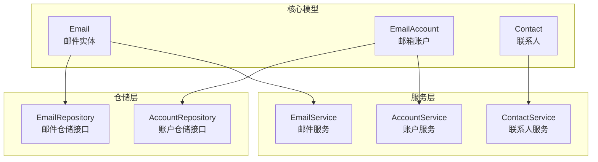
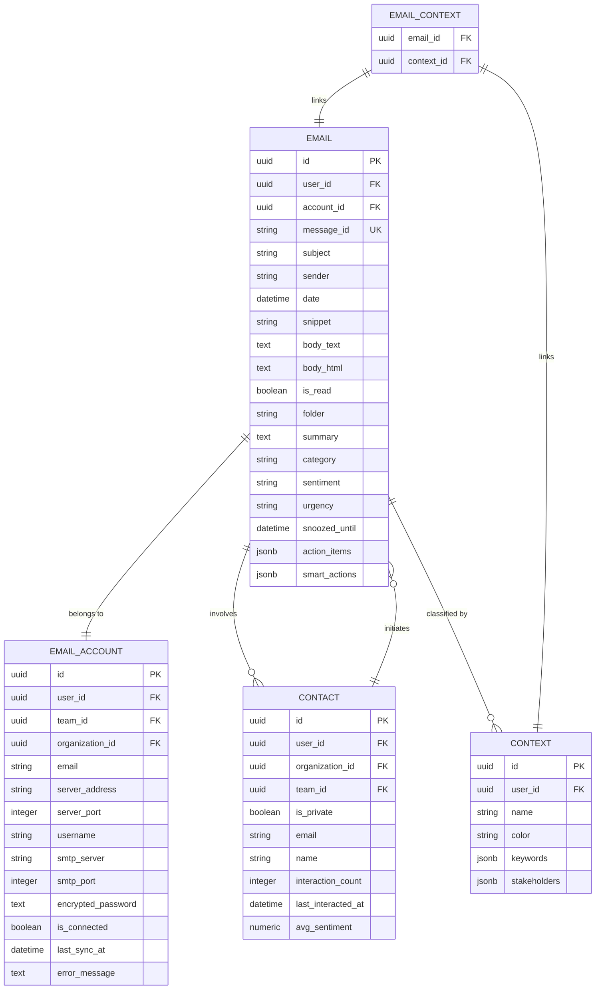
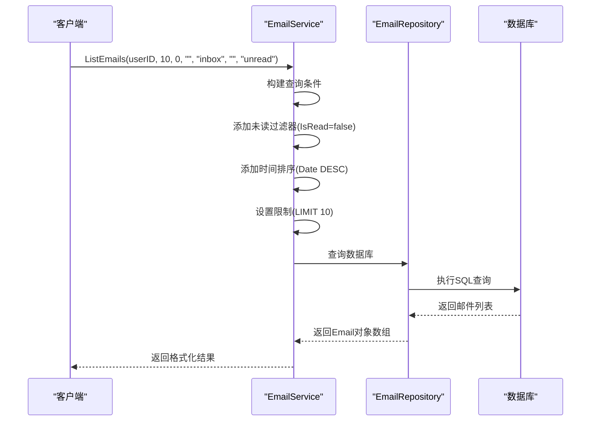
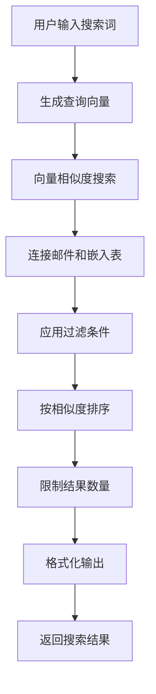
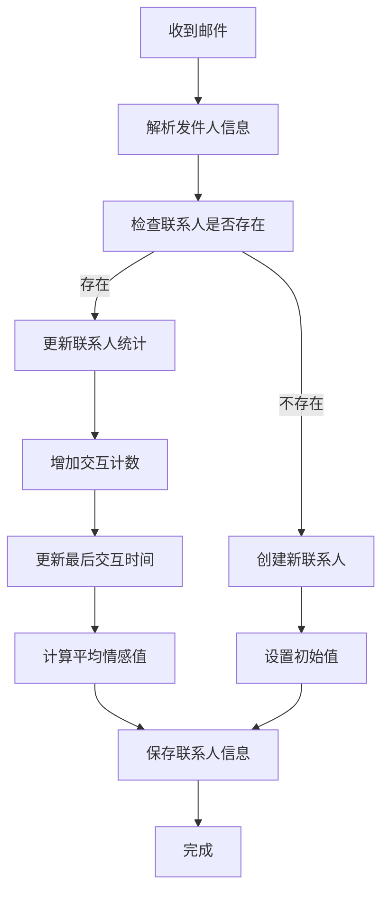
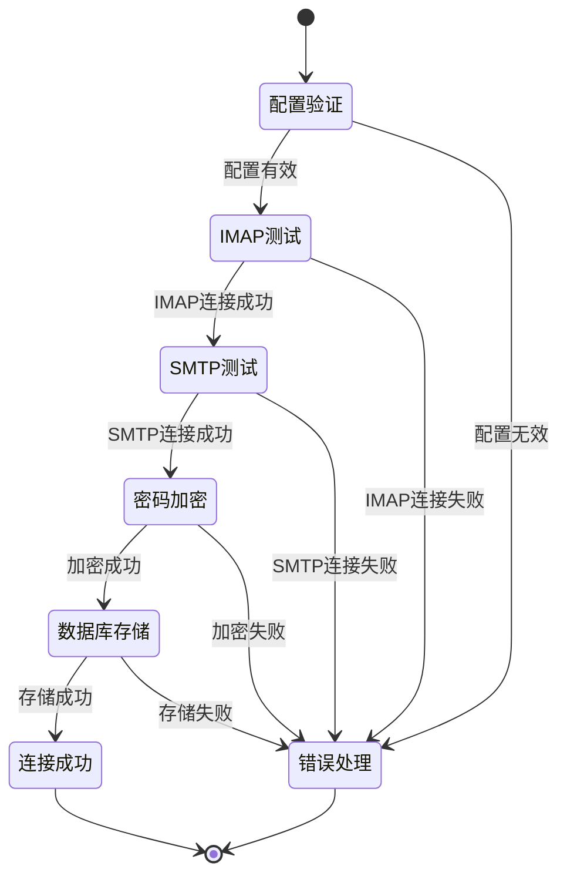
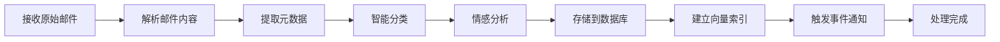

# 邮件与账户模型

<cite>
**本文档中引用的文件**
- [email.go](file://backend/internal/model/email.go)
- [email_account.go](file://backend/internal/model/email_account.go)
- [contact.go](file://backend/internal/model/contact.go)
- [email_repository.go](file://backend/internal/repository/email_repository.go)
- [email.go](file://backend/internal/service/email.go)
- [account.go](file://backend/internal/service/account.go)
- [contact.go](file://backend/internal/service/contact.go)
- [search.go](file://backend/internal/service/search.go)
- [context.go](file://backend/internal/model/context.go)
- [analyze.go](file://backend/internal/tasks/analyze.go)
</cite>

## 目录
1. [简介](#简介)
2. [项目结构概览](#项目结构概览)
3. [核心数据模型](#核心数据模型)
4. [模型关系架构](#模型关系架构)
5. [详细模型分析](#详细模型分析)
6. [查询场景示例](#查询场景示例)
7. [业务逻辑实现](#业务逻辑实现)
8. [性能考虑](#性能考虑)
9. [故障排除指南](#故障排除指南)
10. [总结](#总结)

## 简介

本文档详细介绍了EchoMind邮件系统的核心数据模型，重点分析Email、EmailAccount和Contact三个核心实体的设计与实现。该系统采用现代化的微服务架构，通过GORM ORM框架实现数据库操作，支持IMAP协议的邮件同步，并提供了智能的邮件分类、情感分析和搜索功能。

## 项目结构概览

邮件系统的核心模型位于`backend/internal/model/`目录下，包含以下关键文件：

**图表来源**
- [email.go](file://backend/internal/model/email.go#L1-L37)
- [email_account.go](file://backend/internal/model/email_account.go#L1-L35)
- [contact.go](file://backend/internal/model/contact.go#L1-L27)

## 核心数据模型

### Email实体设计

Email实体是系统中最复杂的模型，包含了邮件的完整信息：

| 字段名 | 类型 | 约束 | 描述 |
|--------|------|------|------|
| ID | UUID | 主键 | 唯一标识邮件的UUID |
| UserID | UUID | 非空 | 关联的用户ID |
| AccountID | UUID | 索引 | 关联的邮箱账户ID |
| MessageID | String | 唯一索引，非空 | 邮件的唯一消息ID |
| Subject | String | 可选 | 邮件主题 |
| Sender | String | 可选 | 发件人地址 |
| Date | DateTime | 可选 | 邮件发送时间 |
| Snippet | String | 可选 | 邮件内容摘要 |
| BodyText | Text | 可选 | 纯文本邮件内容 |
| BodyHTML | Text | 可选 | HTML格式邮件内容 |
| IsRead | Boolean | 默认false | 是否已读标记 |
| Folder | String | 默认'INBOX' | 邮件文件夹 |
| Summary | Text | 可选 | AI生成的邮件摘要 |
| Category | String | 最大50字符 | 邮件分类（Work, Newsletter, Personal等） |
| Sentiment | String | 最大50字符 | 情感分析结果（Positive, Neutral, Negative） |
| Urgency | String | 最大50字符 | 紧急程度（High, Medium, Low） |
| SnoozedUntil | DateTime | 索引 | 推迟显示的时间点 |
| ActionItems | JSONB | 可选 | 提取的任务项 |
| SmartActions | JSONB | 可选 | 结构化的智能操作 |

**节来源**
- [email.go](file://backend/internal/model/email.go#L12-L36)

### EmailAccount实体设计

EmailAccount模型负责存储用户的邮箱配置和认证信息：

| 字段名 | 类型 | 约束 | 描述 |
|--------|------|------|------|
| ID | UUID | 主键 | 唯一标识邮箱账户的UUID |
| UserID | UUID | 索引，可空 | 用户ID（用户级所有权） |
| TeamID | UUID | 索引，可空 | 团队ID（团队级所有权） |
| OrganizationID | UUID | 索引，可空 | 组织ID（组织级所有权） |
| Email | String | 非空 | 邮箱地址 |
| ServerAddress | String | 非空 | IMAP服务器地址 |
| ServerPort | Integer | 默认993 | IMAP服务器端口 |
| Username | String | 非空 | IMAP登录用户名 |
| SMTPServer | String | 默认'' | SMTP服务器地址 |
| SMTPPort | Integer | 默认587 | SMTP服务器端口 |
| EncryptedPassword | Text | 非空 | 加密后的密码 |
| IsConnected | Boolean | 默认false | 连接状态标志 |
| LastSyncAt | DateTime | 可空 | 最后同步时间 |
| ErrorMessage | Text | 可选 | 最后失败的错误信息 |

**节来源**
- [email_account.go](file://backend/internal/model/email_account.go#L11-L34)

### Contact实体设计

Contact模型记录通信双方的关系和交互历史：

| 字段名 | 类型 | 约束 | 描述 |
|--------|------|------|------|
| ID | UUID | 主键 | 唯一标识联系人的UUID |
| UserID | UUID | 索引，可空 | 用户ID（用户级所有权） |
| OrganizationID | UUID | 索引，可空 | 组织ID（组织级所有权） |
| TeamID | UUID | 索引，可空 | 团队ID（团队级所有权） |
| IsPrivate | Boolean | 默认true | 私有标记（true为用户拥有，false为共享） |
| Email | String | 非空 | 联系人邮箱地址 |
| Name | String | 可选 | 联系人姓名 |
| InteractionCount | Integer | 默认0 | 交互次数 |
| LastInteractedAt | DateTime | 可选 | 最后交互时间 |
| AvgSentiment | Numeric(3,2) | 默认0.0 | 平均情感值（范围-1.0到1.0） |

**节来源**
- [contact.go](file://backend/internal/model/contact.go#L10-L26)

## 模型关系架构

系统中的三个核心模型之间存在复杂的关联关系：

**图表来源**
- [email.go](file://backend/internal/model/email.go#L18-L20)
- [email_account.go](file://backend/internal/model/email_account.go#L17-L19)
- [contact.go](file://backend/internal/model/contact.go#L16-L18)
- [context.go](file://backend/internal/model/context.go#L25-L28)

## 详细模型分析

### Email实体深度分析

Email实体采用了丰富的字段设计来支持现代邮件系统的各种功能需求：

#### 核心字段设计
- **MessageID**: 使用唯一索引确保每封邮件在系统中的唯一性
- **UserID + AccountID**: 构成复合外键，确保邮件归属的准确性
- **BodyText vs BodyHTML**: 分离式内容存储，便于不同格式的展示需求

#### 智能化字段
- **Category**: 基于机器学习的邮件分类，支持Work、Newsletter、Personal等预设类别
- **Sentiment**: 情感分析结果，帮助用户快速了解邮件情绪倾向
- **Urgency**: 紧急程度评估，配合智能提醒功能
- **ActionItems**: 从邮件内容中提取的任务项，支持自动化工作流

#### 性能优化字段
- **SnoozedUntil**: 时间索引，支持高效的推迟邮件查询
- **Folder**: 字符串索引，支持文件夹级别的快速筛选

**节来源**
- [email.go](file://backend/internal/model/email.go#L18-L36)

### EmailAccount实体深度分析

EmailAccount模型体现了现代邮件客户端的安全性和灵活性：

#### 多层次所有权设计
系统支持三种所有权级别：
- **用户级所有权**: 默认模式，每个用户独立管理自己的邮箱
- **团队级所有权**: 多个用户共享同一个邮箱账户
- **组织级所有权**: 整个组织共享邮箱资源

#### 安全性设计
- **EncryptedPassword**: 敏感信息加密存储，使用Base64编码的密文
- **动态端口配置**: 支持不同的IMAP和SMTP端口配置
- **连接状态跟踪**: IsConnected、LastSyncAt、ErrorMessage字段完整记录连接状态

#### 协议兼容性
- **IMAP配置**: 支持标准IMAP协议的所有必要参数
- **SMTP配置**: 包含发送邮件所需的所有SMTP信息
- **端口灵活性**: 默认端口设置适应不同邮件服务商的需求

**节来源**
- [email_account.go](file://backend/internal/model/email_account.go#L17-L34)

### Contact实体深度分析

Contact模型实现了智能的联系人管理和社交图谱功能：

#### 关系管理
- **InteractionCount**: 记录与特定联系人的交互次数，支持排序和优先级计算
- **LastInteractedAt**: 时间戳记录，支持最近联系人排序
- **AvgSentiment**: 平均情感值计算，基于历史交互的情感趋势分析

#### 权限控制
- **IsPrivate**: 控制联系人可见性，支持个人和共享两种模式
- **多层级所有权**: 支持用户、团队、组织三级权限控制

#### 智能分析
- **情感趋势**: AvgSentiment字段支持长期情感趋势分析
- **交互频率**: InteractionCount结合时间因素，计算交互活跃度

**节来源**
- [contact.go](file://backend/internal/model/contact.go#L16-L26)

## 查询场景示例

### 场景一：获取某账户最近10封未读邮件及其发件人信息

**图表来源**
- [email.go](file://backend/internal/service/email.go#L25-L75)

**实现代码路径**: [`backend/internal/service/email.go`](file://backend/internal/service/email.go#L25-L75)

### 场景二：基于向量搜索的相关邮件查询

系统支持基于语义相似性的智能搜索：

**图表来源**
- [search.go](file://backend/internal/service/search.go#L45-L105)

**实现代码路径**: [`backend/internal/service/search.go`](file://backend/internal/service/search.go#L45-L105)

### 场景三：联系人交互统计分析

系统自动维护联系人交互统计：

**图表来源**
- [analyze.go](file://backend/internal/tasks/analyze.go#L196-L229)

**实现代码路径**: [`backend/internal/tasks/analyze.go`](file://backend/internal/tasks/analyze.go#L196-L229)

**节来源**
- [email.go](file://backend/internal/service/email.go#L25-L75)
- [search.go](file://backend/internal/service/search.go#L45-L105)
- [analyze.go](file://backend/internal/tasks/analyze.go#L196-L229)

## 业务逻辑实现

### 邮件同步流程

系统通过AccountService管理邮箱账户的生命周期：

**图表来源**
- [account.go](file://backend/internal/service/account.go#L31-L111)

### 邮件处理流水线

邮件从接收、解析到存储的完整流程：

**图表来源**
- [email.go](file://backend/internal/service/email.go#L102-L125)

**节来源**
- [account.go](file://backend/internal/service/account.go#L31-L111)
- [email.go](file://backend/internal/service/email.go#L102-L125)

## 性能考虑

### 数据库优化策略

1. **索引设计**
   - Email表的MessageID字段使用唯一索引
   - AccountID字段添加普通索引支持快速查找
   - SnoozedUntil字段添加时间索引支持高效查询

2. **查询优化**
   - 使用GORM的链式查询构建复杂条件
   - 实现分页查询避免大量数据传输
   - 支持多种过滤条件组合查询

3. **缓存策略**
   - 联系人信息缓存减少重复查询
   - 邮箱账户状态缓存提升响应速度

### 内存管理

1. **对象池化**
   - GORM连接池管理数据库连接
   - 避免频繁的数据库连接创建销毁

2. **批量操作**
   - 支持批量邮件插入和更新
   - 减少网络往返次数

## 故障排除指南

### 常见问题及解决方案

#### 邮箱连接失败
**症状**: EmailAccount.IsConnected为false，ErrorMessage包含具体错误
**解决方案**: 
1. 检查服务器地址和端口配置
2. 验证用户名和密码的正确性
3. 确认防火墙和网络连接

#### 邮件同步中断
**症状**: LastSyncAt时间停滞，ErrorMessage显示超时或认证错误
**解决方案**:
1. 检查网络连接稳定性
2. 验证邮箱账户的访问权限
3. 查看邮箱服务商的限制政策

#### 联系人统计异常
**症状**: InteractionCount不准确，AvgSentiment值异常
**解决方案**:
1. 检查邮件解析逻辑
2. 验证情感分析算法的正确性
3. 确认数据更新的事务一致性

**节来源**
- [account.go](file://backend/internal/service/account.go#L124-L131)

## 总结

EchoMind邮件系统的核心数据模型设计体现了现代邮件应用的最佳实践：

1. **模块化设计**: Email、EmailAccount、Contact三个核心模型职责清晰，耦合度低
2. **智能化功能**: 支持邮件分类、情感分析、智能搜索等AI驱动的功能
3. **安全性保障**: 敏感信息加密存储，多层次权限控制
4. **性能优化**: 合理的索引设计和查询优化策略
5. **扩展性**: 支持用户、团队、组织三级所有权模型

该系统为现代邮件应用提供了完整的基础设施，支持从基础的邮件收发到高级的智能分析和管理功能。通过合理的模型设计和业务逻辑实现，系统能够满足企业级应用的各种需求，同时保持良好的性能和可维护性。