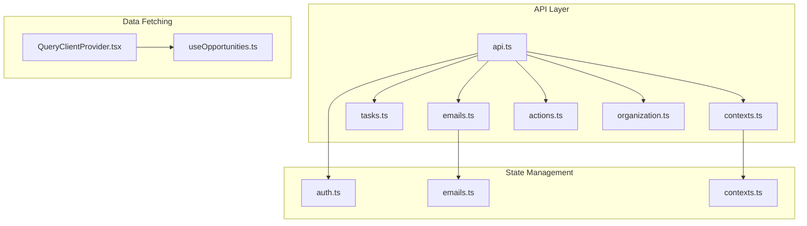
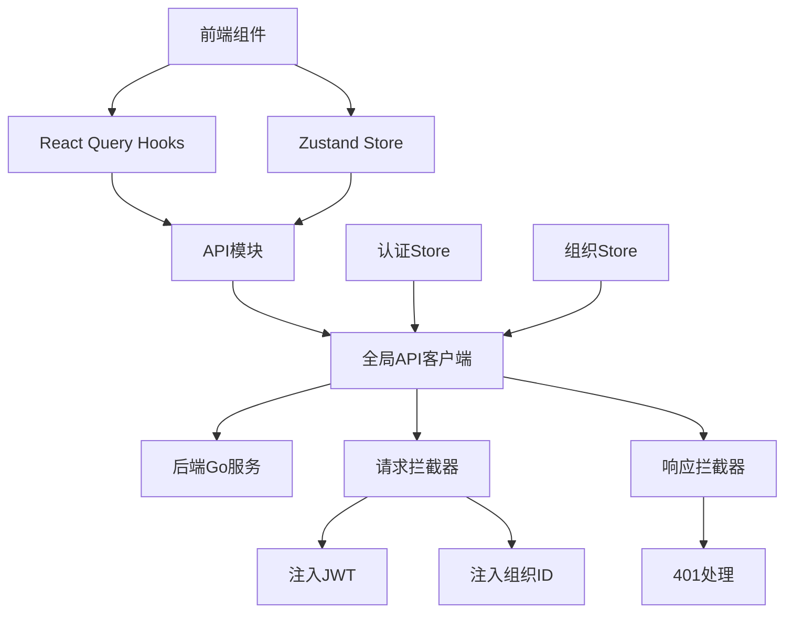
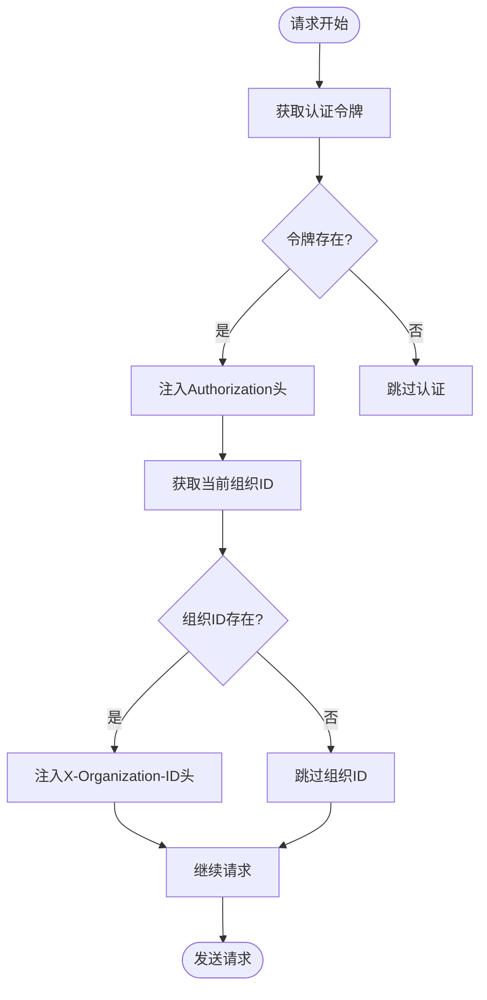
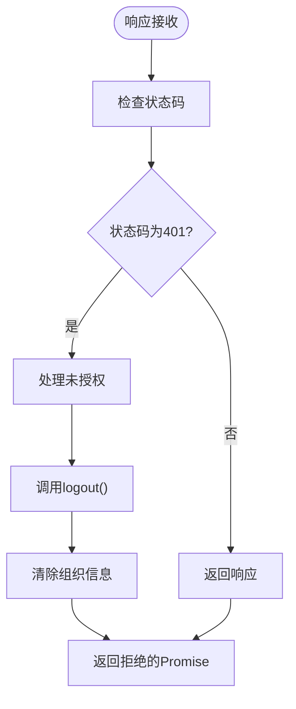
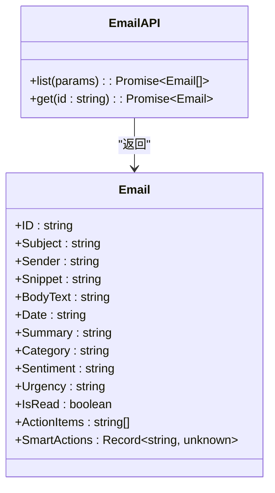
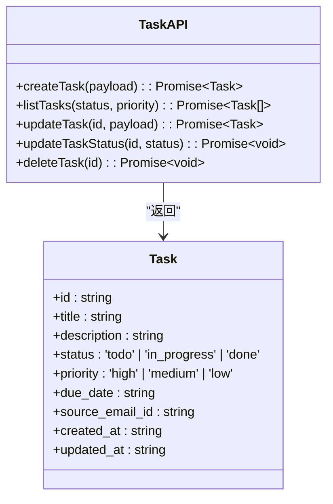
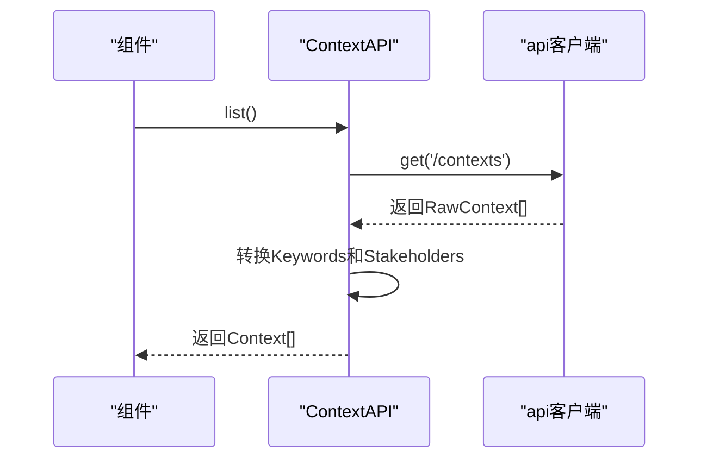
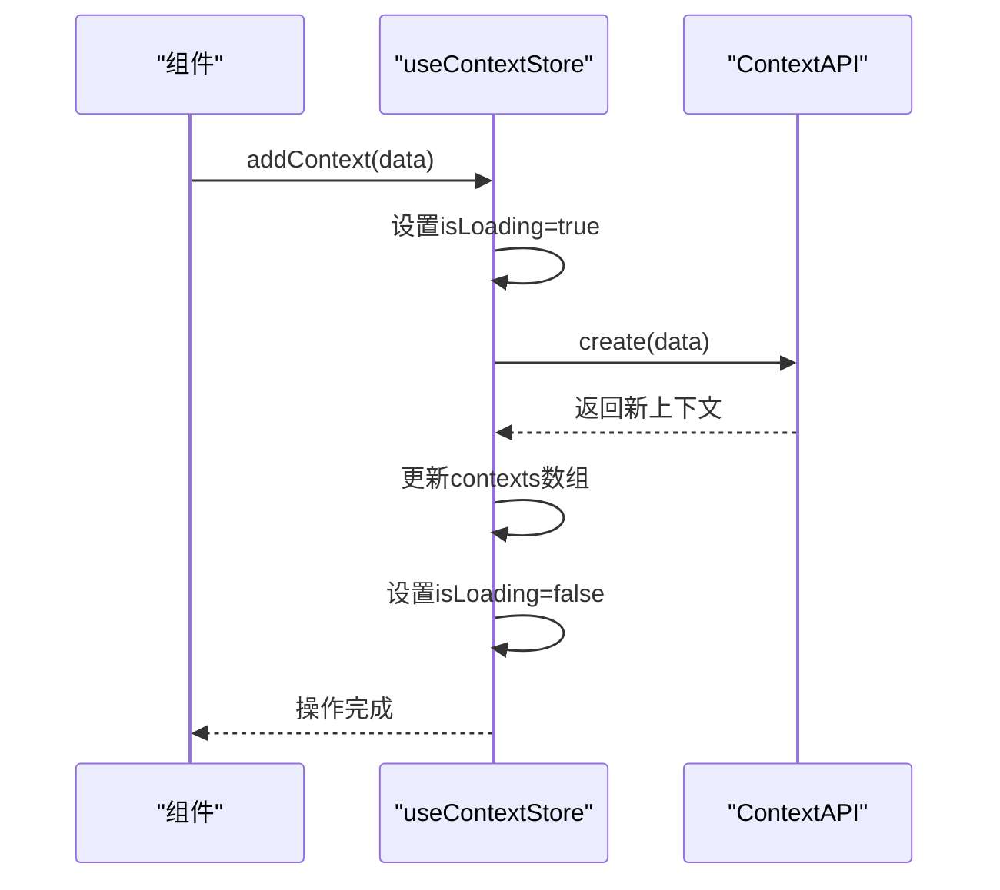
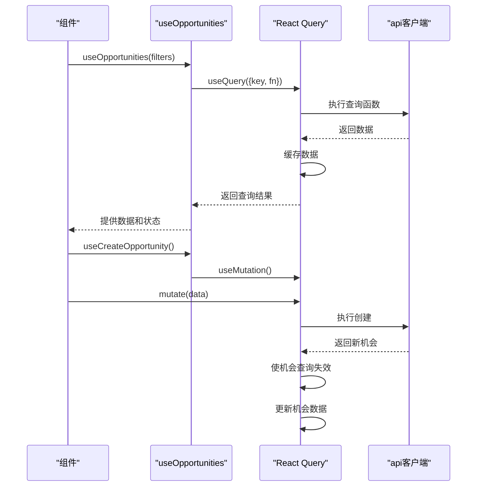
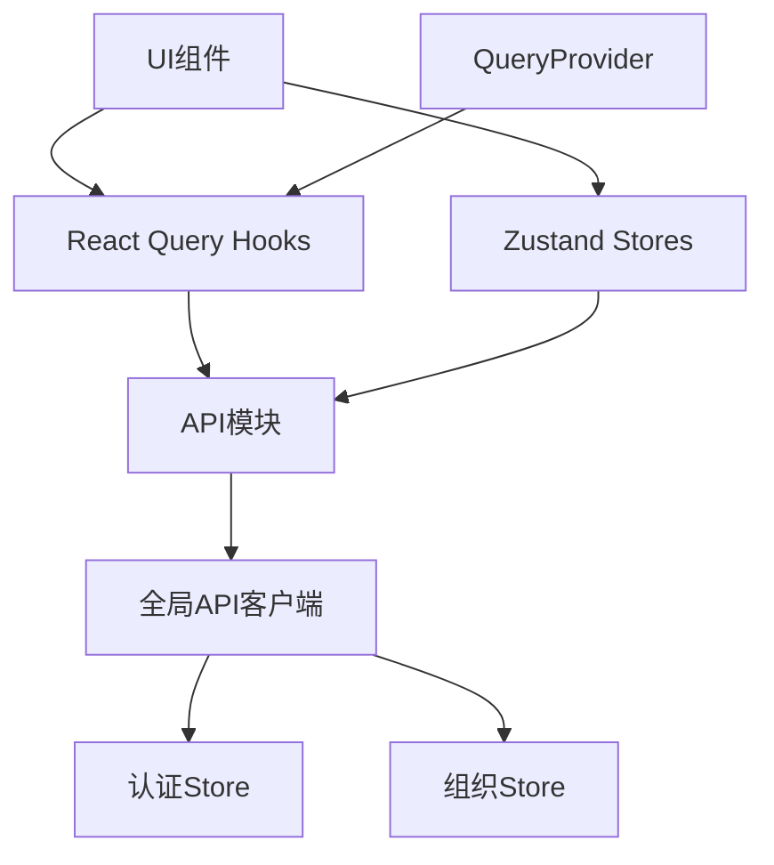

# API客户端与集成

<cite>
**本文档引用的文件**  
- [api.ts](file://frontend/src/lib/api.ts)
- [emails.ts](file://frontend/src/lib/api/emails.ts)
- [tasks.ts](file://frontend/src/lib/api/tasks.ts)
- [contexts.ts](file://frontend/src/lib/api/contexts.ts)
- [actions.ts](file://frontend/src/lib/api/actions.ts)
- [organization.ts](file://frontend/src/lib/api/organization.ts)
- [auth.ts](file://frontend/src/store/auth.ts)
- [QueryClientProvider.tsx](file://frontend/src/components/providers/QueryClientProvider.tsx)
- [useOpportunities.ts](file://frontend/src/hooks/useOpportunities.ts)
- [emails.ts](file://frontend/src/lib/store/emails.ts)
- [contexts.ts](file://frontend/src/lib/store/contexts.ts)
</cite>

## 目录
1. [简介](#简介)
2. [项目结构](#项目结构)
3. [核心组件](#核心组件)
4. [架构概览](#架构概览)
5. [详细组件分析](#详细组件分析)
6. [依赖分析](#依赖分析)
7. [性能考虑](#性能考虑)
8. [故障排除指南](#故障排除指南)
9. [结论](#结论)

## 简介
本文档详细说明了前端应用中API客户端的实现与集成机制，重点阐述了全局API配置、模块化端点定义以及与Zustand状态管理库和React Query的集成方式。文档涵盖了认证、请求拦截、错误处理、数据同步和状态管理的最佳实践。

## 项目结构
前端API相关代码主要位于`frontend/src/lib/api/`目录下，采用模块化设计，每个业务领域（如邮件、任务、上下文）都有独立的API模块。全局配置在`api.ts`中定义，状态管理通过Zustand实现，数据获取与缓存由React Query处理。

**Diagram sources**
- [api.ts](file://frontend/src/lib/api.ts#L1-L72)
- [emails.ts](file://frontend/src/lib/api/emails.ts#L1-L30)
- [contexts.ts](file://frontend/src/lib/api/contexts.ts#L1-L49)
- [QueryClientProvider.tsx](file://frontend/src/components/providers/QueryClientProvider.tsx#L1-L29)

**Section sources**
- [api.ts](file://frontend/src/lib/api.ts#L1-L72)
- [emails.ts](file://frontend/src/lib/api/emails.ts#L1-L30)

## 核心组件
核心API组件包括全局API客户端配置、各业务模块的API函数、状态管理store以及数据获取hooks。这些组件协同工作，实现了前后端的高效通信和本地状态同步。

**Section sources**
- [api.ts](file://frontend/src/lib/api.ts#L1-L72)
- [auth.ts](file://frontend/src/store/auth.ts#L1-L68)
- [QueryClientProvider.tsx](file://frontend/src/components/providers/QueryClientProvider.tsx#L1-L29)

## 架构概览
系统采用分层架构，前端通过Axios封装的API客户端与后端Go服务通信。认证信息通过拦截器自动注入，业务逻辑通过模块化的API函数实现，状态管理采用Zustand，数据获取和缓存使用React Query。

**Diagram sources**
- [api.ts](file://frontend/src/lib/api.ts#L1-L72)
- [auth.ts](file://frontend/src/store/auth.ts#L1-L68)
- [QueryClientProvider.tsx](file://frontend/src/components/providers/QueryClientProvider.tsx#L1-L29)

## 详细组件分析
### 全局API客户端分析
全局API客户端在`api.ts`中定义，使用Axios创建实例，配置基础URL和默认请求头。通过请求拦截器自动注入JWT认证令牌和组织ID，通过响应拦截器处理401未授权错误。

#### 请求拦截器流程

**Diagram sources**
- [api.ts](file://frontend/src/lib/api.ts#L12-L27)

#### 响应拦截器流程

**Diagram sources**
- [api.ts](file://frontend/src/lib/api.ts#L29-L40)

**Section sources**
- [api.ts](file://frontend/src/lib/api.ts#L1-L72)
- [auth.ts](file://frontend/src/store/auth.ts#L1-L68)

### API模块分析
#### 邮件API模块
邮件API模块定义了邮件相关的端点函数，包括获取邮件列表和单个邮件详情。该模块展示了基本的CRUD操作实现。

**Diagram sources**
- [emails.ts](file://frontend/src/lib/api/emails.ts#L1-L30)

#### 任务API模块
任务API模块提供了完整的任务管理功能，包括创建、读取、更新和删除操作，以及专门的状态更新函数。

**Diagram sources**
- [tasks.ts](file://frontend/src/lib/api/tasks.ts#L1-L58)

#### 上下文API模块
上下文API模块处理上下文数据的CRUD操作，并包含数据转换逻辑，将后端返回的JSON字符串解析为数组。

**Diagram sources**
- [contexts.ts](file://frontend/src/lib/api/contexts.ts#L1-L49)

**Section sources**
- [emails.ts](file://frontend/src/lib/api/emails.ts#L1-L30)
- [tasks.ts](file://frontend/src/lib/api/tasks.ts#L1-L58)
- [contexts.ts](file://frontend/src/lib/api/contexts.ts#L1-L49)

### 状态管理集成分析
#### Zustand Store与API集成
Zustand store与API模块紧密集成，store中的异步操作直接调用API函数，并在成功或失败时更新本地状态。

**Diagram sources**
- [contexts.ts](file://frontend/src/lib/store/contexts.ts#L1-L75)

#### React Query集成
React Query提供了更高级的数据获取和缓存机制，与API客户端结合使用，实现了自动重试、数据失效和乐观更新。

**Diagram sources**
- [useOpportunities.ts](file://frontend/src/hooks/useOpportunities.ts#L1-L92)

**Section sources**
- [contexts.ts](file://frontend/src/lib/store/contexts.ts#L1-L75)
- [useOpportunities.ts](file://frontend/src/hooks/useOpportunities.ts#L1-L92)

## 依赖分析
系统各组件之间存在明确的依赖关系，API模块依赖全局API客户端，状态管理store依赖API模块，UI组件依赖store和hooks。

**Diagram sources**
- [api.ts](file://frontend/src/lib/api.ts#L1-L72)
- [auth.ts](file://frontend/src/store/auth.ts#L1-L68)
- [QueryClientProvider.tsx](file://frontend/src/components/providers/QueryClientProvider.tsx#L1-L29)

**Section sources**
- [api.ts](file://frontend/src/lib/api.ts#L1-L72)
- [auth.ts](file://frontend/src/store/auth.ts#L1-L68)

## 性能考虑
系统在性能方面进行了多项优化，包括请求批处理、响应缓存、数据预取和错误重试机制。React Query的默认配置设置了1分钟的staleTime和1次重试，平衡了数据新鲜度和网络请求频率。

## 故障排除指南
常见问题包括认证失效、网络连接错误和数据同步问题。当遇到401错误时，系统会自动清理认证状态并重定向到登录页面。对于网络错误，建议检查API服务状态和网络连接。

**Section sources**
- [api.ts](file://frontend/src/lib/api.ts#L29-L40)
- [auth.ts](file://frontend/src/store/auth.ts#L34-L35)

## 结论
本文档详细介绍了前端API客户端的架构和实现，展示了如何通过Axios、Zustand和React Query构建高效、可靠的前后端通信机制。这种分层架构提供了良好的可维护性和扩展性，为应用的持续发展奠定了坚实基础。