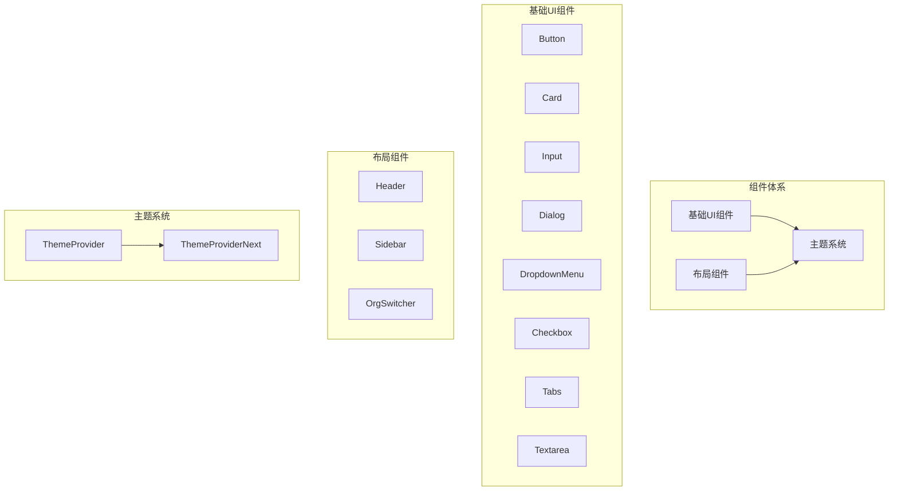
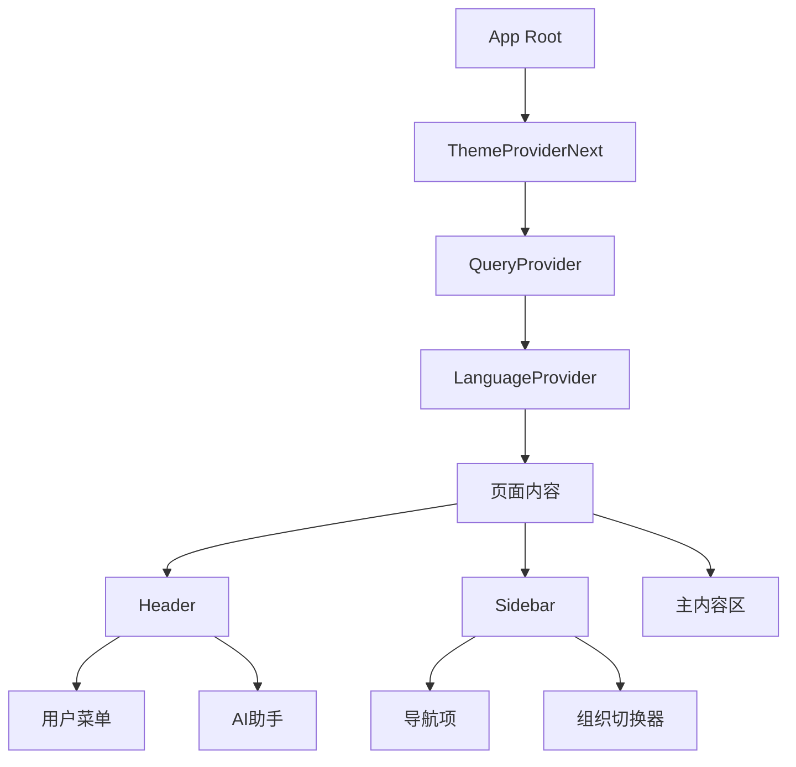
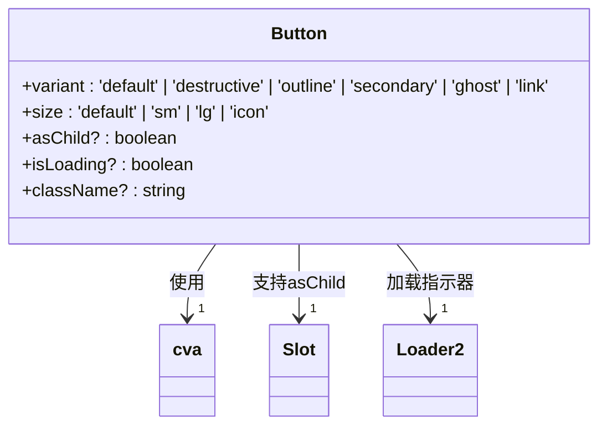
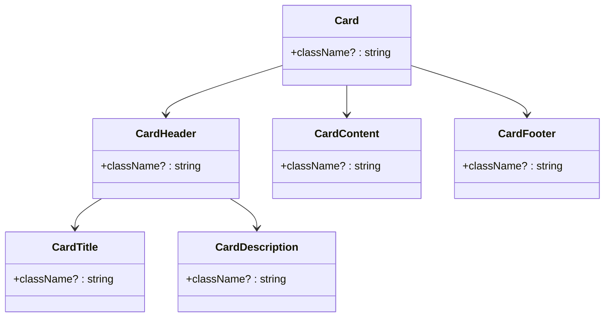
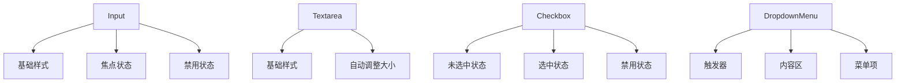
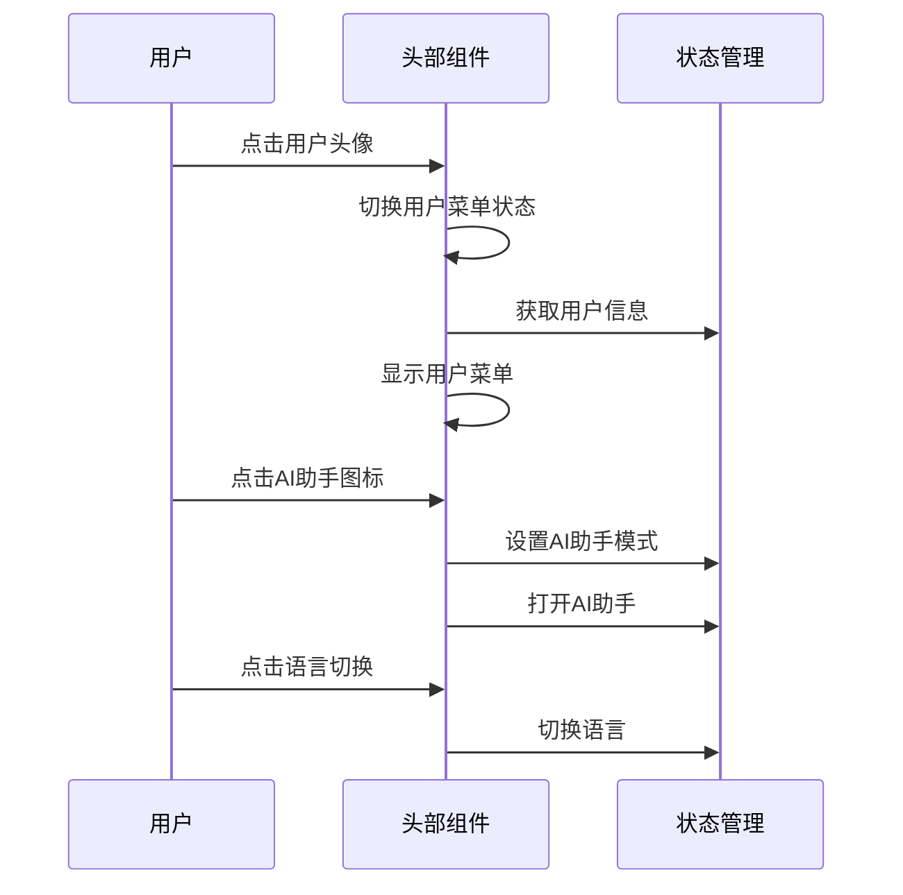
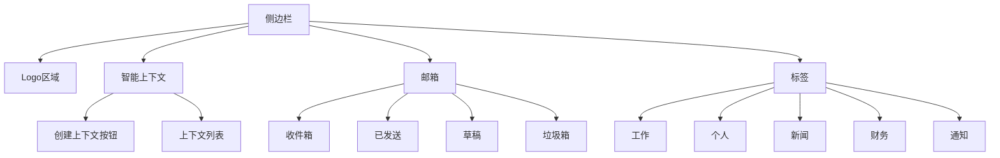
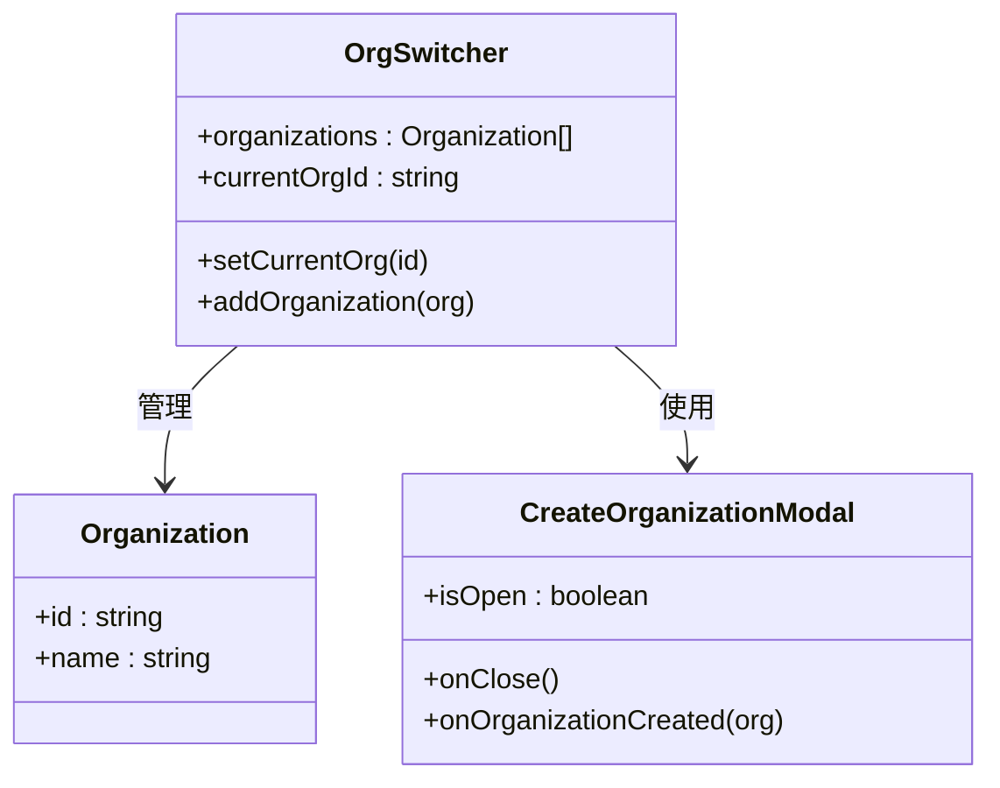
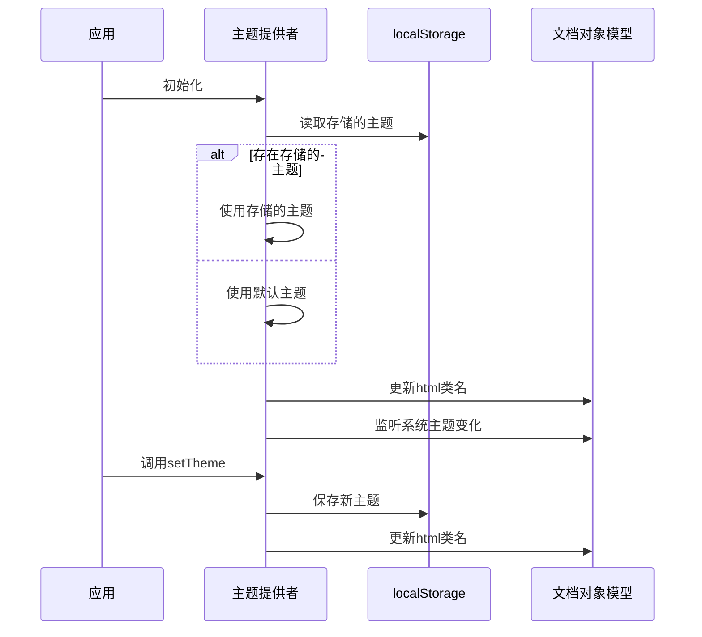
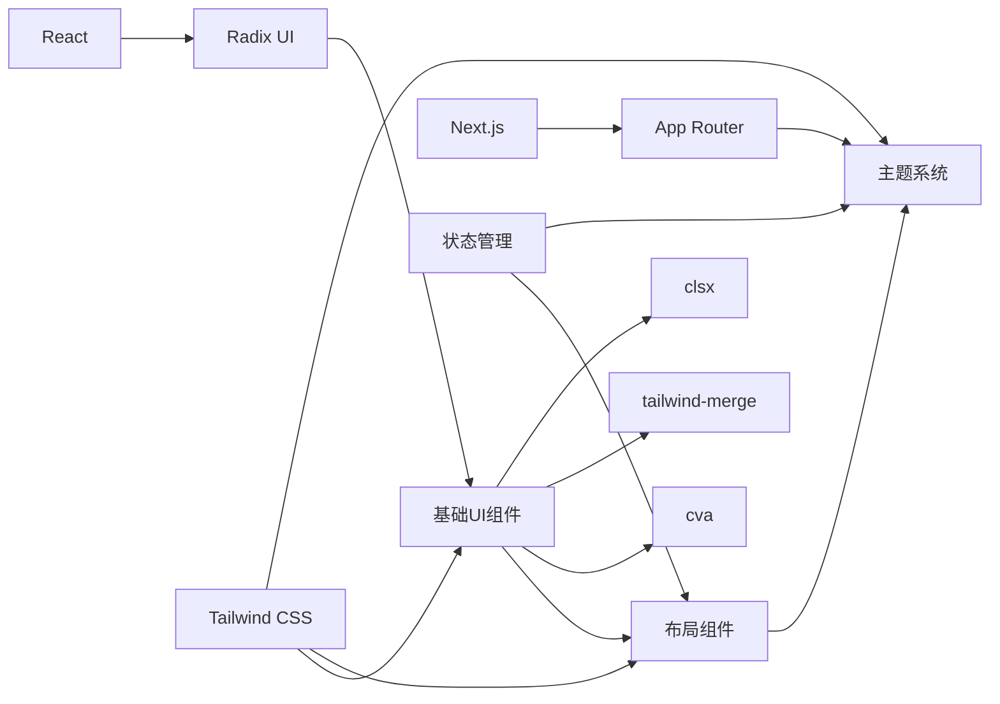

# UI组件体系

<cite>
**本文档引用文件**  
- [Button.tsx](file://frontend/src/components/ui/Button.tsx)
- [Card.tsx](file://frontend/src/components/ui/Card.tsx)
- [Input.tsx](file://frontend/src/components/ui/Input.tsx)
- [Dialog.tsx](file://frontend/src/components/ui/Dialog.tsx)
- [DropdownMenu.tsx](file://frontend/src/components/ui/DropdownMenu.tsx)
- [Checkbox.tsx](file://frontend/src/components/ui/Checkbox.tsx)
- [Tabs.tsx](file://frontend/src/components/ui/Tabs.tsx)
- [Textarea.tsx](file://frontend/src/components/ui/Textarea.tsx)
- [Header.tsx](file://frontend/src/components/layout/Header.tsx)
- [Sidebar.tsx](file://frontend/src/components/layout/Sidebar.tsx)
- [OrgSwitcher.tsx](file://frontend/src/components/layout/OrgSwitcher.tsx)
- [ThemeProvider.tsx](file://frontend/src/components/theme/ThemeProvider.tsx)
- [ThemeProviderNext.tsx](file://frontend/src/components/theme/ThemeProviderNext.tsx)
- [utils.ts](file://frontend/src/lib/utils.ts)
- [tailwind.config.ts](file://frontend/tailwind.config.ts)
- [layout.tsx](file://frontend/src/app/layout.tsx)
</cite>

## 目录
1. [简介](#简介)
2. [项目结构](#项目结构)
3. [核心组件](#核心组件)
4. [架构概览](#架构概览)
5. [详细组件分析](#详细组件分析)
6. [依赖分析](#依赖分析)
7. [性能考虑](#性能考虑)
8. [故障排除指南](#故障排除指南)
9. [结论](#结论)

## 简介
本文档全面阐述EchoMind前端的UI组件体系，聚焦于组件化设计原则、可复用性、响应式布局及主题系统。文档详细解释基础UI组件库的设计与Tailwind CSS的集成方式，分析布局组件的结构与交互逻辑，并深入探讨主题系统如何实现亮暗模式切换。

## 项目结构
EchoMind前端采用清晰的组件化架构，主要分为三个核心部分：基础UI组件（components/ui）、布局组件（components/layout）和主题系统（components/theme）。这种分层设计确保了组件的高度可复用性和维护性。



**图示来源**  
- [Button.tsx](file://frontend/src/components/ui/Button.tsx#L1-L64)
- [Card.tsx](file://frontend/src/components/ui/Card.tsx#L1-L80)
- [Header.tsx](file://frontend/src/components/layout/Header.tsx#L1-L169)
- [ThemeProvider.tsx](file://frontend/src/components/theme/ThemeProvider.tsx#L1-L95)

**本节来源**  
- [frontend/src/components/ui](file://frontend/src/components/ui)
- [frontend/src/components/layout](file://frontend/src/components/layout)
- [frontend/src/components/theme](file://frontend/src/components/theme)

## 核心组件
EchoMind的UI组件体系基于React和Tailwind CSS构建，采用Radix UI作为底层原语，确保了无障碍性和跨浏览器兼容性。所有组件都遵循一致的设计语言和API约定，支持通过props进行高度定制。

**本节来源**  
- [Button.tsx](file://frontend/src/components/ui/Button.tsx#L1-L64)
- [Input.tsx](file://frontend/src/components/ui/Input.tsx#L1-L24)
- [Dialog.tsx](file://frontend/src/components/ui/Dialog.tsx#L1-L122)

## 架构概览
EchoMind的UI架构采用分层设计模式，从基础原子组件到复合布局组件，再到全局主题管理，形成完整的组件体系。该架构与Next.js App Router无缝集成，支持服务端渲染和客户端交互。



**图示来源**  
- [layout.tsx](file://frontend/src/app/layout.tsx#L1-L42)
- [Header.tsx](file://frontend/src/components/layout/Header.tsx#L1-L169)
- [Sidebar.tsx](file://frontend/src/components/layout/Sidebar.tsx#L1-L293)

## 详细组件分析
本节深入分析EchoMind的关键UI组件，包括其设计原则、API接口和使用模式。

### 基础UI组件分析
基础UI组件库提供了一系列可复用的原子组件，这些组件基于Radix UI构建，确保了最佳的可访问性和性能。

#### 按钮组件
按钮组件支持多种变体和尺寸，通过`cva`库实现样式变体管理，并支持加载状态显示。



**图示来源**  
- [Button.tsx](file://frontend/src/components/ui/Button.tsx#L7-L34)
- [utils.ts](file://frontend/src/lib/utils.ts#L4-L6)

#### 卡片组件
卡片组件提供了一套完整的容器解决方案，包括标题、描述、内容和页脚等子组件。



**图示来源**  
- [Card.tsx](file://frontend/src/components/ui/Card.tsx#L5-L79)

#### 表单组件
表单组件包括输入框、文本域、复选框和下拉菜单，提供一致的样式和交互体验。



**图示来源**  
- [Input.tsx](file://frontend/src/components/ui/Input.tsx#L1-L24)
- [Textarea.tsx](file://frontend/src/components/ui/Textarea.tsx#L1-L22)
- [Checkbox.tsx](file://frontend/src/components/ui/Checkbox.tsx#L1-L31)
- [DropdownMenu.tsx](file://frontend/src/components/ui/DropdownMenu.tsx#L1-L187)

**本节来源**  
- [frontend/src/components/ui](file://frontend/src/components/ui)

### 布局组件分析
布局组件负责应用的整体结构和导航，提供一致的用户体验。

#### 头部组件
头部组件包含应用的主要交互元素，包括AI助手、通知、用户菜单和语言切换。



**图示来源**  
- [Header.tsx](file://frontend/src/components/layout/Header.tsx#L1-L169)
- [useCopilotStore.ts](file://frontend/src/store/useCopilotStore.ts)
- [LanguageContext.tsx](file://frontend/src/lib/i18n/LanguageContext.tsx)

#### 侧边栏组件
侧边栏组件提供主要的导航功能，支持智能上下文、邮箱和标签的快速切换。



**图示来源**  
- [Sidebar.tsx](file://frontend/src/components/layout/Sidebar.tsx#L1-L293)
- [CreateContextModal.tsx](file://frontend/src/components/layout/CreateContextModal.tsx)

#### 组织切换器
组织切换器允许用户在不同组织之间切换，支持创建新组织。



**图示来源**  
- [OrgSwitcher.tsx](file://frontend/src/components/layout/OrgSwitcher.tsx#L1-L66)
- [organization.ts](file://frontend/src/lib/store/organization.ts)

**本节来源**  
- [Header.tsx](file://frontend/src/components/layout/Header.tsx#L1-L169)
- [Sidebar.tsx](file://frontend/src/components/layout/Sidebar.tsx#L1-L293)
- [OrgSwitcher.tsx](file://frontend/src/components/layout/OrgSwitcher.tsx#L1-L66)

### 主题系统分析
主题系统实现亮暗模式切换，支持系统偏好、本地存储和手动切换。

#### 主题提供者
ThemeProvider组件管理应用的主题状态，与localStorage集成。



**图示来源**  
- [ThemeProvider.tsx](file://frontend/src/components/theme/ThemeProvider.tsx#L1-L95)
- [tailwind.config.ts](file://frontend/tailwind.config.ts#L1-L61)

#### 主题集成
主题系统与Next.js App Router集成，确保服务端和客户端的一致性。

```mermaid
flowchart TD
A[App Root] --> B[ThemeProviderNext]
B --> C[属性: class]
B --> D[默认主题: system]
B --> E[启用系统主题]
B --> F[禁用过渡]
G[Tailwind配置] --> H[暗模式: class]
G --> I[颜色扩展]
G --> J[圆角扩展]
B --> G : 配合使用
```

**图示来源**  
- [layout.tsx](file://frontend/src/app/layout.tsx#L1-L42)
- [tailwind.config.ts](file://frontend/tailwind.config.ts#L1-L61)

**本节来源**  
- [ThemeProvider.tsx](file://frontend/src/components/theme/ThemeProvider.tsx#L1-L95)
- [ThemeProviderNext.tsx](file://frontend/src/components/theme/ThemeProviderNext.tsx)
- [tailwind.config.ts](file://frontend/tailwind.config.ts#L1-L61)

## 依赖分析
UI组件体系依赖于多个核心库和技术栈，形成完整的开发环境。



**图示来源**  
- [package.json](file://frontend/package.json)
- [tailwind.config.ts](file://frontend/tailwind.config.ts#L1-L61)
- [go.mod](file://backend/go.mod)

**本节来源**  
- [frontend/package.json](file://frontend/package.json)
- [backend/go.mod](file://backend/go.mod)

## 性能考虑
UI组件体系在设计时充分考虑了性能优化，包括：

- **按需加载**：组件采用懒加载策略，减少初始包大小
- **样式优化**：使用tailwind-merge和clsx优化类名处理
- **状态管理**：使用Zustand进行高效的状态管理
- **渲染优化**：避免不必要的重新渲染，使用React.memo等优化技术
- **资源管理**：图标采用按需导入，减少bundle体积

## 故障排除指南
### 常见问题
- **主题不切换**：检查localStorage权限和ThemeProvider的初始化
- **组件样式丢失**：确认Tailwind CSS配置正确，content路径包含组件文件
- **交互无响应**：检查use client指令是否正确添加
- **状态不更新**：验证状态管理store的更新逻辑

### 调试技巧
- 使用浏览器开发者工具检查组件树和状态
- 查看控制台错误信息，定位问题根源
- 检查网络请求，确认资源加载正常
- 验证localStorage中的主题设置

**本节来源**  
- [ThemeProvider.tsx](file://frontend/src/components/theme/ThemeProvider.tsx#L1-L95)
- [layout.tsx](file://frontend/src/app/layout.tsx#L1-L42)

## 结论
EchoMind的UI组件体系展现了现代化前端开发的最佳实践，通过组件化设计、主题系统和响应式布局，提供了优秀的用户体验。该体系具有良好的可扩展性和维护性，为未来功能迭代奠定了坚实基础。