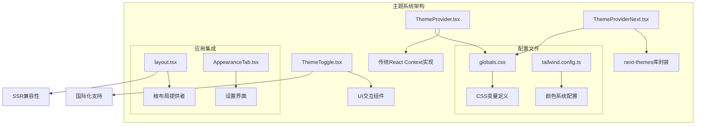
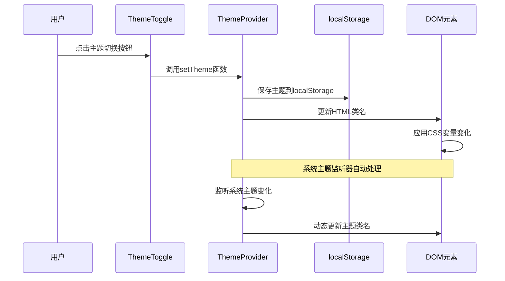
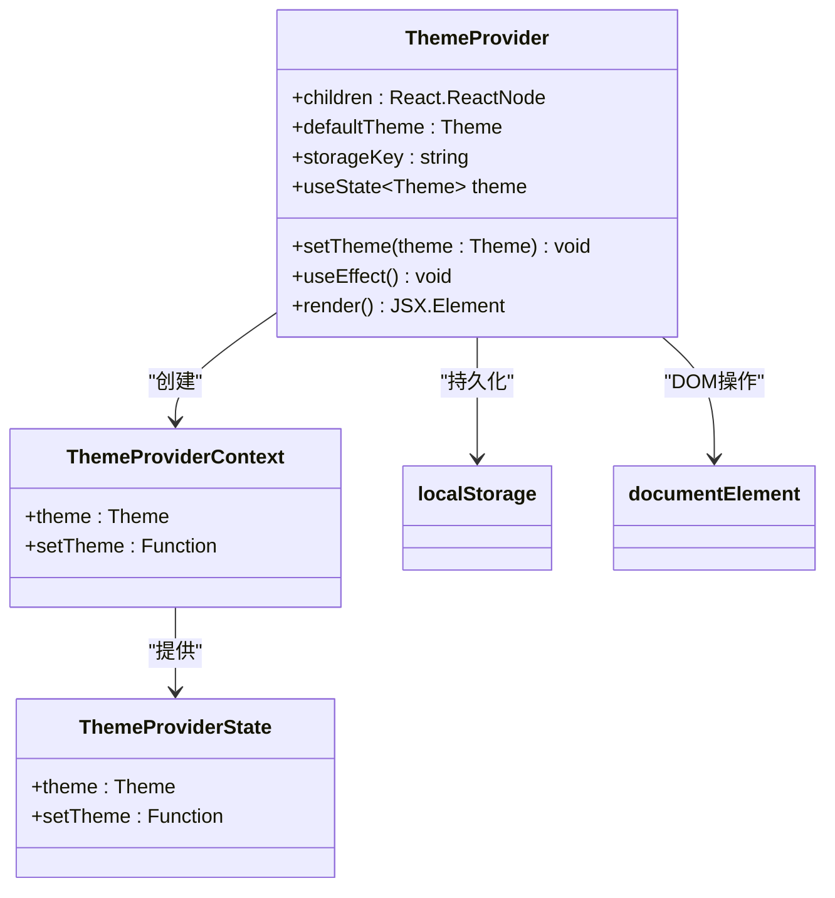
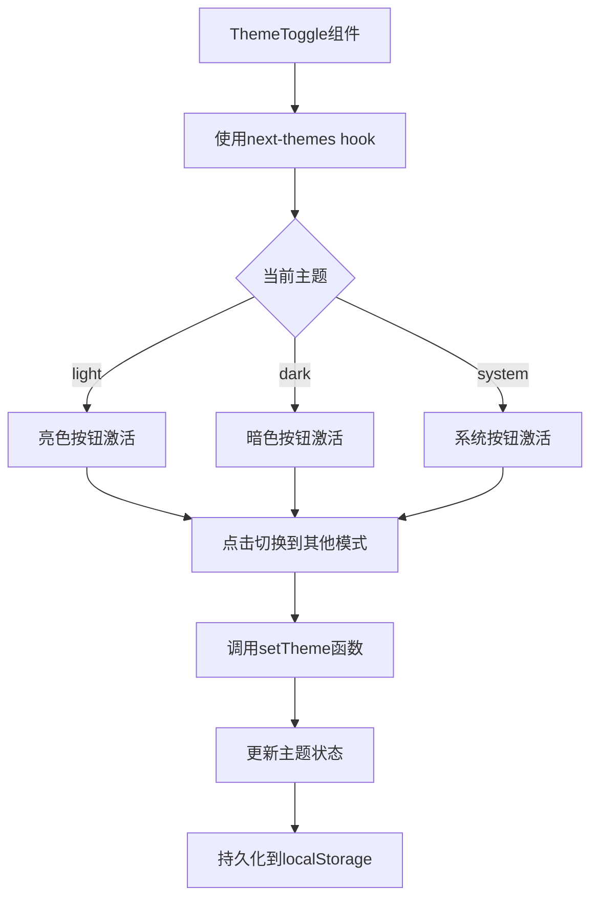
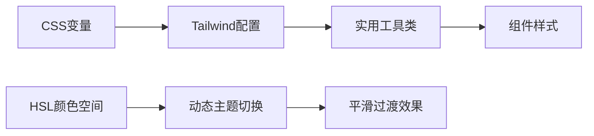
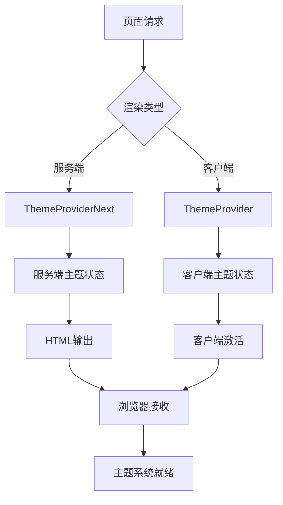

# 主题系统

<cite>
**本文档中引用的文件**
- [ThemeProvider.tsx](file://frontend/src/components/theme/ThemeProvider.tsx)
- [ThemeProviderNext.tsx](file://frontend/src/components/theme/ThemeProviderNext.tsx)
- [ThemeToggle.tsx](file://frontend/src/components/theme/ThemeToggle.tsx)
- [layout.tsx](file://frontend/src/app/layout.tsx)
- [globals.css](file://frontend/src/app/globals.css)
- [tailwind.config.ts](file://frontend/tailwind.config.ts)
- [AppearanceTab.tsx](file://frontend/src/components/settings/AppearanceTab.tsx)
- [package.json](file://frontend/package.json)
</cite>

## 目录
1. [简介](#简介)
2. [项目结构](#项目结构)
3. [核心组件](#核心组件)
4. [架构概览](#架构概览)
5. [详细组件分析](#详细组件分析)
6. [主题变量系统](#主题变量系统)
7. [SSR兼容性](#ssr兼容性)
8. [自定义主题指南](#自定义主题指南)
9. [调试最佳实践](#调试最佳实践)
10. [故障排除指南](#故障排除指南)
11. [总结](#总结)

## 简介

EchoMind的主题系统是一个高度集成的亮暗模式切换解决方案，基于React Context和Tailwind CSS构建，支持用户偏好持久化和系统主题同步。该系统采用双层架构设计：传统的ThemeProvider用于客户端渲染场景，以及基于next-themes库的ThemeProviderNext专门处理Next.js App Router的服务器端渲染（SSR）兼容性。

系统的核心特性包括：
- 支持三种主题模式：亮色（light）、暗色（dark）和系统（system）
- 基于localStorage的用户偏好持久化
- 自动检测系统主题变化
- 完全兼容Next.js App Router的SSR
- 可扩展的主题变量系统
- 组件级别的主题响应式设计

## 项目结构

主题系统的文件组织遵循清晰的模块化原则：



**图表来源**
- [ThemeProvider.tsx](file://frontend/src/components/theme/ThemeProvider.tsx#L1-L95)
- [ThemeProviderNext.tsx](file://frontend/src/components/theme/ThemeProviderNext.tsx#L1-L8)
- [layout.tsx](file://frontend/src/app/layout.tsx#L1-L42)

**章节来源**
- [ThemeProvider.tsx](file://frontend/src/components/theme/ThemeProvider.tsx#L1-L95)
- [ThemeProviderNext.tsx](file://frontend/src/components/theme/ThemeProviderNext.tsx#L1-L8)
- [layout.tsx](file://frontend/src/app/layout.tsx#L1-L42)

## 核心组件

主题系统由三个核心组件构成，每个组件都有特定的职责和功能：

### 主题提供者类型定义

系统定义了三种主题类型：
- `'light'`：强制使用亮色主题
- `'dark'`：强制使用暗色主题  
- `'system'`：跟随系统主题设置

### 存储键配置
默认存储键为`'vite-ui-theme'`，但可以通过`storageKey`属性自定义，确保多实例环境下的数据隔离。

**章节来源**
- [ThemeProvider.tsx](file://frontend/src/components/theme/ThemeProvider.tsx#L5-L11)

## 架构概览

主题系统采用分层架构设计，确保在不同渲染环境下都能正常工作：



**图表来源**
- [ThemeToggle.tsx](file://frontend/src/components/theme/ThemeToggle.tsx#L1-L48)
- [ThemeProvider.tsx](file://frontend/src/components/theme/ThemeProvider.tsx#L73-L78)

## 详细组件分析

### ThemeProvider组件分析

ThemeProvider是主题系统的核心实现，基于React Context提供主题状态管理：

#### 组件架构图



**图表来源**
- [ThemeProvider.tsx](file://frontend/src/components/theme/ThemeProvider.tsx#L22-L24)
- [ThemeProvider.tsx](file://frontend/src/components/theme/ThemeProvider.tsx#L13-L16)

#### 初始化逻辑

组件通过惰性初始化从localStorage恢复用户偏好，确保客户端渲染时的用户体验一致性。

#### 系统主题监听

当主题设置为'system'时，组件会监听`prefers-color-scheme`媒体查询的变化，实现实时的主题同步。

**章节来源**
- [ThemeProvider.tsx](file://frontend/src/components/theme/ThemeProvider.tsx#L25-L95)

### ThemeProviderNext组件分析

ThemeProviderNext是对next-themes库的简单封装，专门处理Next.js的SSR需求：

#### 实现特点

- 使用`'use client'`指令确保客户端执行
- 直接导出next-themes的ThemeProvider组件
- 接受标准的ThemeProviderProps接口

#### SSR兼容性

该组件解决了Next.js App Router中服务端渲染的主题状态注入问题，确保服务端和客户端的主题状态一致。

**章节来源**
- [ThemeProviderNext.tsx](file://frontend/src/components/theme/ThemeProviderNext.tsx#L1-L8)

### ThemeToggle组件分析

ThemeToggle提供了直观的UI交互界面，允许用户在三种主题模式间切换：

#### 组件结构



**图表来源**
- [ThemeToggle.tsx](file://frontend/src/components/theme/ThemeToggle.tsx#L7-L48)

#### 图标设计

组件使用Lucide React图标库，分别用太阳（Sun）、月亮（Moon）和显示器（Monitor）表示不同的主题模式。

#### 国际化支持

通过LanguageContext提供多语言支持，确保不同语言环境下的用户体验一致性。

**章节来源**
- [ThemeToggle.tsx](file://frontend/src/components/theme/ThemeToggle.tsx#L1-L48)

## 主题变量系统

EchoMind采用基于CSS HSL变量的主题系统，提供灵活且可维护的颜色方案：

### CSS变量定义

系统在`:root`选择器中定义了基础颜色变量，在`.dark`类中定义了暗色主题变量：

| 变量名称 | 亮色值 | 暗色值 | 用途 |
|---------|--------|--------|------|
| `--background` | `0 0% 100%` | `224 71% 4%` | 页面背景色 |
| `--foreground` | `240 10% 3.9%` | `213 31% 91%` | 主要文字颜色 |
| `--primary` | `221.2 83.2% 53.3%` | `210 40% 98%` | 主品牌色 |
| `--secondary` | `210 40% 96%` | `215 28% 17%` | 次要品牌色 |
| `--card` | `0 0% 100%` | `224 71% 4%` | 卡片背景色 |
| `--popover` | `0 0% 100%` | `224 71% 4%` | 弹出层背景色 |

### Tailwind CSS集成

在tailwind.config.ts中，系统将CSS变量映射到Tailwind的实用工具类：



**图表来源**
- [tailwind.config.ts](file://frontend/tailwind.config.ts#L12-L46)
- [globals.css](file://frontend/src/app/globals.css#L4-L57)

**章节来源**
- [globals.css](file://frontend/src/app/globals.css#L1-L57)
- [tailwind.config.ts](file://frontend/tailwind.config.ts#L1-L61)

## SSR兼容性

EchoMind的主题系统在Next.js App Router环境中实现了完美的SSR兼容性：

### 服务端主题注入

ThemeProviderNext组件通过next-themes库自动处理服务端的主题状态注入，确保服务端渲染时的主题状态与客户端保持一致。

### Hydration处理

系统通过suppressHydrationWarning属性避免hydration警告，确保服务端和客户端的DOM结构完全匹配。

### 渲染策略



**图表来源**
- [layout.tsx](file://frontend/src/app/layout.tsx#L25-L30)

**章节来源**
- [layout.tsx](file://frontend/src/app/layout.tsx#L1-L42)

## 自定义主题指南

### 扩展主题变量

开发者可以通过修改globals.css文件添加新的主题变量：

1. 在`:root`选择器中添加新变量
2. 在`.dark`选择器中定义对应的暗色版本
3. 在tailwind.config.ts中添加映射

### 自定义颜色方案

系统支持通过HSL颜色空间创建自定义颜色方案：

```typescript
// 示例：添加新的强调色
interface CustomColors {
  accent: {
    DEFAULT: string;
    foreground: string;
  };
  warning: {
    DEFAULT: string;
    foreground: string;
  };
}
```

### 组件主题适配

所有UI组件都应使用CSS变量而非硬编码颜色值，确保主题切换时的视觉一致性。

**章节来源**
- [globals.css](file://frontend/src/app/globals.css#L4-L57)
- [tailwind.config.ts](file://frontend/tailwind.config.ts#L12-L46)

## 调试最佳实践

### 主题加载顺序调试

当遇到主题加载顺序问题时，可以按照以下步骤进行调试：

1. **检查localStorage数据**：确认用户偏好的正确存储
2. **验证CSS变量加载**：确保globals.css正确导入
3. **监控DOM变化**：观察HTML类名的添加和移除
4. **检查媒体查询**：验证系统主题监听器的工作状态

### 常见问题排查

| 问题类型 | 症状 | 解决方案 |
|---------|------|----------|
| 主题不持久化 | 刷新后恢复默认主题 | 检查localStorage访问权限 |
| 系统主题不同步 | 系统切换主题时无反应 | 验证mediaQuery监听器 |
| SSR主题不一致 | 服务端和客户端主题不同 | 检查ThemeProviderNext配置 |
| 样式闪烁 | 首次加载时样式突然变化 | 添加CSS过渡动画 |

### 开发工具使用

推荐使用浏览器开发工具的Elements面板监控CSS变量的变化，以及Console面板查看相关的JavaScript错误。

**章节来源**
- [ThemeProvider.tsx](file://frontend/src/components/theme/ThemeProvider.tsx#L42-L71)

## 故障排除指南

### 常见错误及解决方案

#### 1. useTheme必须在ThemeProvider内使用
**错误信息**：`useTheme must be used within a ThemeProvider`
**原因**：在ThemeProvider外部调用了useTheme hook
**解决方案**：确保在ThemeProvider的子组件中使用useTheme

#### 2. localStorage访问被阻止
**症状**：主题偏好无法保存
**原因**：浏览器隐私设置或安全策略阻止localStorage访问
**解决方案**：添加错误边界处理，提供降级方案

#### 3. SSR hydration mismatch
**症状**：控制台出现hydration警告
**原因**：服务端和客户端渲染的DOM结构不一致
**解决方案**：使用suppressHydrationWarning或调整渲染逻辑

### 性能优化建议

1. **减少不必要的重渲染**：合理使用useMemo和useCallback
2. **优化CSS变量数量**：避免过度细分的颜色变量
3. **延迟加载非关键主题资源**：对于复杂的主题变体采用按需加载

**章节来源**
- [ThemeProvider.tsx](file://frontend/src/components/theme/ThemeProvider.tsx#L88-L95)

## 总结

EchoMind的主题系统展现了现代Web应用中主题管理的最佳实践。通过双层架构设计，系统成功解决了传统React应用和Next.js App Router之间的兼容性挑战。其基于CSS变量的主题系统不仅提供了灵活的定制能力，还确保了良好的性能表现和用户体验。

系统的主要优势包括：
- **无缝的SSR兼容性**：通过ThemeProviderNext完美解决服务端渲染问题
- **智能的用户偏好管理**：基于localStorage的持久化存储
- **实时的系统主题同步**：自动检测并响应系统主题变化
- **可扩展的架构设计**：易于添加新的主题变量和颜色方案
- **完善的调试支持**：提供详细的错误处理和调试工具

这套主题系统为EchoMind提供了坚实的基础，使其能够在各种设备和环境下为用户提供一致且舒适的视觉体验。