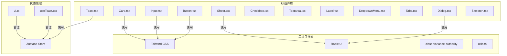
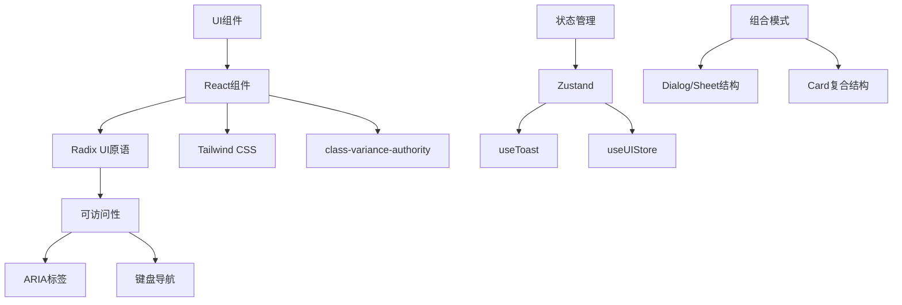
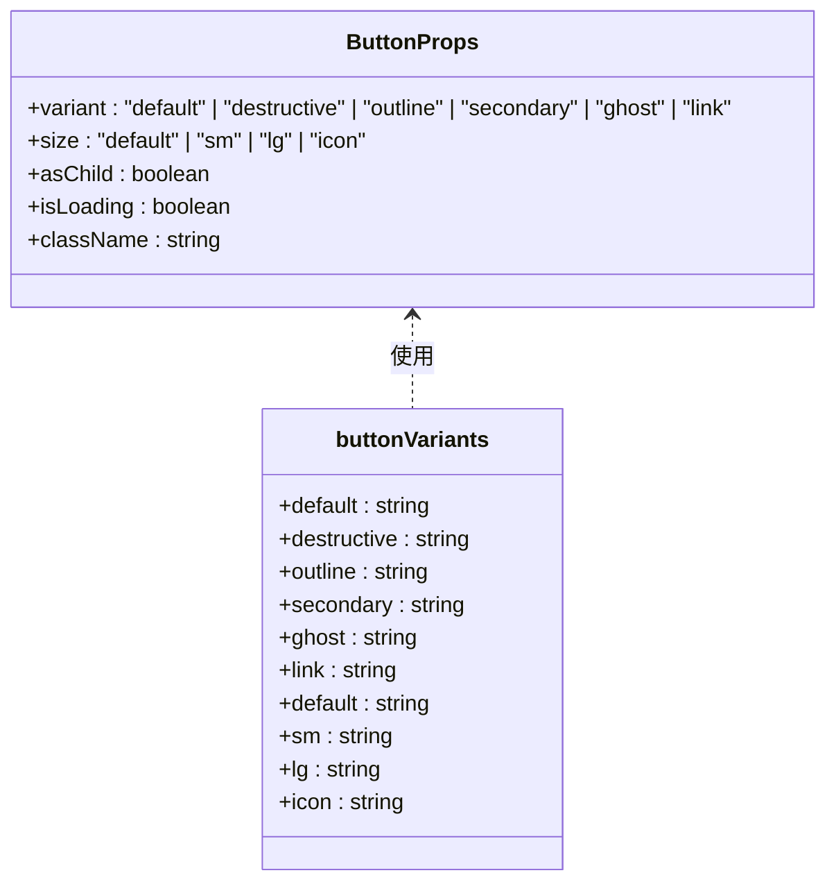
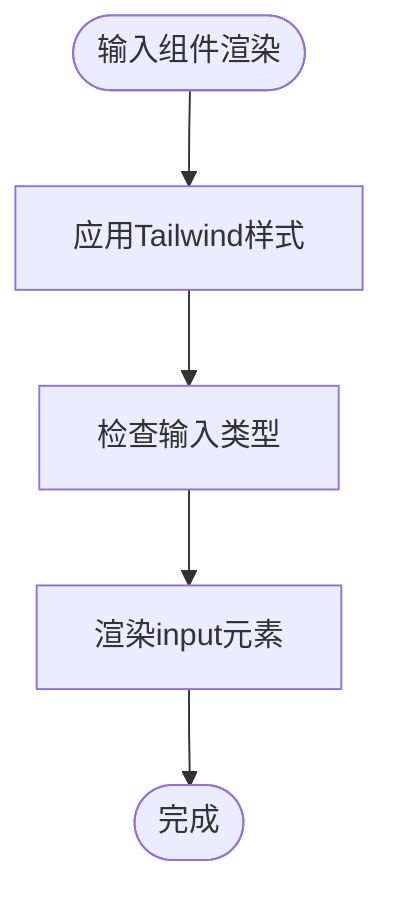
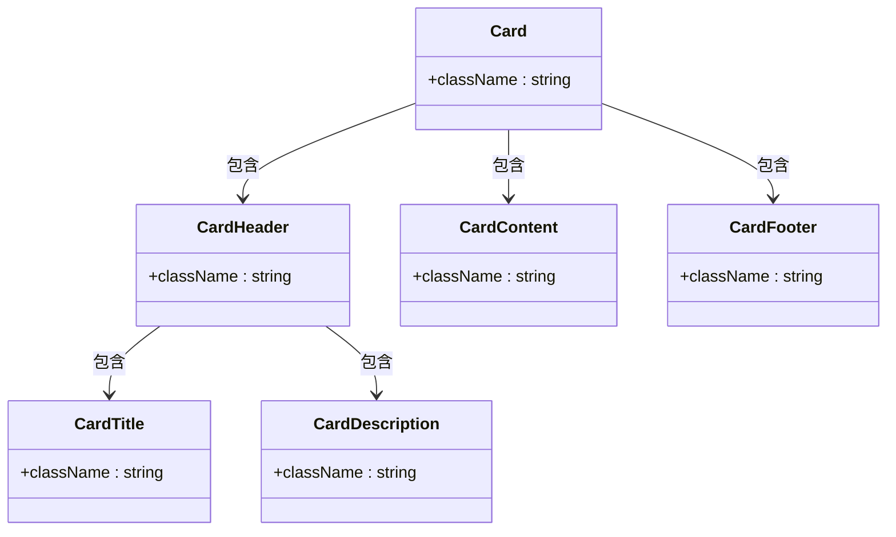
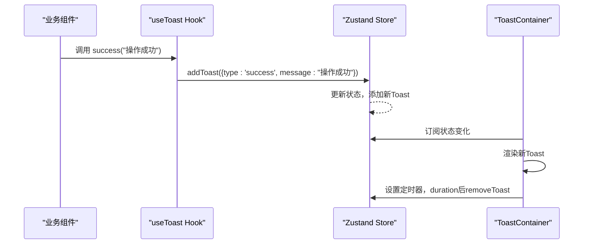
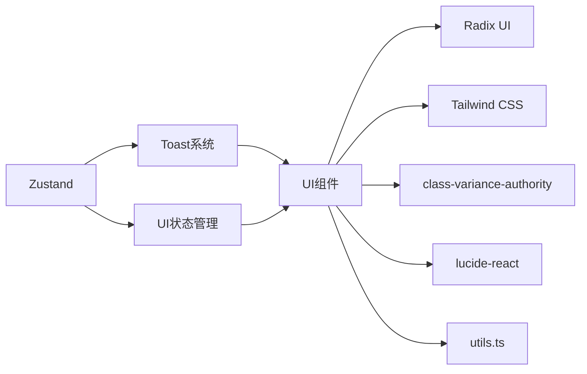

# 基础UI组件

<cite>
**本文档中引用的文件**  
- [Button.tsx](file://frontend/src/components/ui/Button.tsx)
- [Input.tsx](file://frontend/src/components/ui/Input.tsx)
- [Card.tsx](file://frontend/src/components/ui/Card.tsx)
- [Dialog.tsx](file://frontend/src/components/ui/Dialog.tsx)
- [Sheet.tsx](file://frontend/src/components/ui/Sheet.tsx)
- [Checkbox.tsx](file://frontend/src/components/ui/Checkbox.tsx)
- [Textarea.tsx](file://frontend/src/components/ui/Textarea.tsx)
- [Label.tsx](file://frontend/src/components/ui/Label.tsx)
- [DropdownMenu.tsx](file://frontend/src/components/ui/DropdownMenu.tsx)
- [Tabs.tsx](file://frontend/src/components/ui/Tabs.tsx)
- [Toast.tsx](file://frontend/src/components/ui/Toast.tsx)
- [ToastContainer.tsx](file://frontend/src/components/ui/ToastContainer.tsx)
- [useToast.tsx](file://frontend/src/lib/hooks/useToast.tsx)
- [ui.ts](file://frontend/src/store/ui.ts)
- [Skeleton.tsx](file://frontend/src/components/ui/Skeleton.tsx)
</cite>

## 目录
1. [简介](#简介)
2. [项目结构](#项目结构)
3. [核心组件](#核心组件)
4. [架构概述](#架构概述)
5. [详细组件分析](#详细组件分析)
6. [依赖分析](#依赖分析)
7. [性能考虑](#性能考虑)
8. [故障排除指南](#故障排除指南)
9. [结论](#结论)

## 简介
本文档全面介绍EchoMind前端基础UI组件库（components/ui）的设计与实现。该组件库基于React和Tailwind CSS构建，采用原子化设计理念，提供一系列可复用、可访问性强且样式一致的UI组件。文档将深入解析各原子级组件的Props接口、默认样式、可访问性支持及状态管理机制，并阐述组件如何通过组合模式实现高复用性。同时，文档涵盖Toast通知系统与Zustand状态管理的集成方式，以及实际应用场景中的组件组合使用方法。

## 项目结构
EchoMind前端项目采用标准的Next.js应用结构，UI组件集中存放于`frontend/src/components/ui`目录下。每个组件以独立的TypeScript文件实现，遵循一致的命名规范和代码风格。组件库依赖Radix UI作为底层无障碍原语，结合class-variance-authority进行样式变体管理，并通过Tailwind CSS实现原子化样式。



**图示来源**
- [Button.tsx](file://frontend/src/components/ui/Button.tsx)
- [Input.tsx](file://frontend/src/components/ui/Input.tsx)
- [Card.tsx](file://frontend/src/components/ui/Card.tsx)
- [Dialog.tsx](file://frontend/src/components/ui/Dialog.tsx)
- [Sheet.tsx](file://frontend/src/components/ui/Sheet.tsx)
- [Toast.tsx](file://frontend/src/components/ui/Toast.tsx)
- [useToast.tsx](file://frontend/src/lib/hooks/useToast.tsx)
- [ui.ts](file://frontend/src/store/ui.ts)

**本节来源**
- [frontend/src/components/ui](file://frontend/src/components/ui)

## 核心组件
基础UI组件库包含一系列原子级组件，如Button、Input、Card等，它们构成了应用界面的基本构建块。这些组件设计为高度可复用，通过标准化的Props接口和基于Tailwind CSS的样式系统确保视觉一致性。组件均支持无障碍访问（a11y），并采用Composition模式允许灵活的嵌套与组合。

**本节来源**
- [Button.tsx](file://frontend/src/components/ui/Button.tsx#L1-L64)
- [Input.tsx](file://frontend/src/components/ui/Input.tsx#L1-L24)
- [Card.tsx](file://frontend/src/components/ui/Card.tsx#L1-L80)

## 架构概述
UI组件库的架构建立在React组件模型之上，利用Radix UI提供的无障碍原语确保组件的可访问性。样式管理采用class-variance-authority（CVA）定义组件变体，结合Tailwind CSS的实用类实现高效的样式组合。状态管理方面，全局UI状态通过Zustand进行集中管理，而Toast系统则通过自定义Hook实现跨组件通知。



**图示来源**
- [Button.tsx](file://frontend/src/components/ui/Button.tsx)
- [Dialog.tsx](file://frontend/src/components/ui/Dialog.tsx)
- [Sheet.tsx](file://frontend/src/components/ui/Sheet.tsx)
- [useToast.tsx](file://frontend/src/lib/hooks/useToast.tsx)
- [ui.ts](file://frontend/src/store/ui.ts)

## 详细组件分析
本节深入分析关键UI组件的实现细节，包括Props定义、样式机制、可访问性支持及组合模式应用。

### 按钮组件分析
Button组件是应用中最常用的交互元素之一，支持多种视觉变体和尺寸。通过`asChild`属性，组件可将样式应用到任意子元素，实现灵活的组合。



**图示来源**
- [Button.tsx](file://frontend/src/components/ui/Button.tsx#L7-L34)
- [Button.tsx](file://frontend/src/components/ui/Button.tsx#L36-L41)

**本节来源**
- [Button.tsx](file://frontend/src/components/ui/Button.tsx#L1-L64)

### 输入组件分析
Input组件封装了原生HTML输入元素，提供统一的样式和无障碍支持。组件通过`cn`工具函数合并类名，确保样式可扩展性。



**图示来源**
- [Input.tsx](file://frontend/src/components/ui/Input.tsx#L9-L17)

**本节来源**
- [Input.tsx](file://frontend/src/components/ui/Input.tsx#L1-L24)

### 卡片组件分析
Card组件采用复合组件模式，由Card、CardHeader、CardTitle、CardDescription、CardContent和CardFooter等多个子组件构成，支持灵活的内容布局。



**图示来源**
- [Card.tsx](file://frontend/src/components/ui/Card.tsx#L5-L80)

**本节来源**
- [Card.tsx](file://frontend/src/components/ui/Card.tsx#L1-L80)

### 对话框与侧边栏组件分析
Dialog和Sheet组件均基于Radix UI的Dialog原语构建，具有相似的结构但不同的使用场景。Dialog用于模态对话框，而Sheet用于从屏幕边缘滑入的面板。

```mermaid
classDiagram
class Dialog {
+Trigger
+Content
+Overlay
+Close
+Header
+Footer
+Title
+Description
}
class Sheet {
+Trigger
+Content
+Overlay
+Close
+Header
+Footer
+Title
+Description
}
Dialog <|-- Sheet : 结构相似
note right of Dialog
模态对话框，居中显示
end note
note right of Sheet
侧边栏面板，从边缘滑入
end note
```

**图示来源**
- [Dialog.tsx](file://frontend/src/components/ui/Dialog.tsx#L1-L122)
- [Sheet.tsx](file://frontend/src/components/ui/Sheet.tsx#L1-L141)

**本节来源**
- [Dialog.tsx](file://frontend/src/components/ui/Dialog.tsx#L1-L122)
- [Sheet.tsx](file://frontend/src/components/ui/Sheet.tsx#L1-L141)

### Toast通知系统分析
Toast系统通过Zustand状态管理实现跨组件通知，支持多种类型（成功、错误、信息、警告）和自动消失功能。



**图示来源**
- [useToast.tsx](file://frontend/src/lib/hooks/useToast.tsx#L1-L94)
- [ToastContainer.tsx](file://frontend/src/components/ui/ToastContainer.tsx#L1-L58)

**本节来源**
- [useToast.tsx](file://frontend/src/lib/hooks/useToast.tsx#L1-L94)
- [ToastContainer.tsx](file://frontend/src/components/ui/ToastContainer.tsx#L1-L58)

## 依赖分析
UI组件库依赖多个外部库和内部工具，形成清晰的依赖关系网络。



**图示来源**
- [go.mod](file://frontend/package.json)
- [Button.tsx](file://frontend/src/components/ui/Button.tsx)

**本节来源**
- [frontend/package.json](file://frontend/package.json)
- [frontend/src/lib/utils.ts](file://frontend/src/lib/utils.ts)

## 性能考虑
为避免不必要的重渲染，建议在使用UI组件时遵循以下最佳实践：
- 使用React.memo对包含复杂UI组件的父组件进行记忆化
- 避免在渲染时创建内联函数或对象作为Props
- 利用Zustand的选择器功能订阅最小必要状态
- 对于列表渲染，确保使用稳定的key属性

## 故障排除指南
当遇到UI组件相关问题时，可参考以下常见问题及解决方案：
- **组件样式丢失**：检查Tailwind CSS配置是否正确，确保组件类名被正确生成
- **无障碍问题**：验证是否正确使用了ARIA标签和语义化HTML元素
- **状态更新延迟**：检查Zustand状态更新逻辑，确保没有异步更新问题
- **Toast不显示**：确认ToastContainer已正确挂载到DOM树中

**本节来源**
- [ToastContainer.tsx](file://frontend/src/components/ui/ToastContainer.tsx#L7-L57)
- [ui.ts](file://frontend/src/store/ui.ts#L1-L16)

## 结论
EchoMind前端基础UI组件库通过标准化的设计和实现，为应用提供了统一、可访问且高性能的用户界面基础。组件库采用现代React实践，结合Radix UI和Tailwind CSS，实现了高度的可复用性和可维护性。通过Zustand状态管理，实现了跨组件的高效状态同步。建议在开发中充分利用组件的组合模式和预设变体，以保持界面的一致性和开发效率。