# 布局与导航组件

<cite>
**本文档中引用的文件**
- [Header.tsx](file://frontend/src/components/layout/Header.tsx)
- [Sidebar.tsx](file://frontend/src/components/layout/Sidebar.tsx)
- [MobileSidebar.tsx](file://frontend/src/components/layout/MobileSidebar.tsx)
- [OrgSwitcher.tsx](file://frontend/src/components/layout/OrgSwitcher.tsx)
- [CreateContextModal.tsx](file://frontend/src/components/layout/CreateContextModal.tsx)
- [CreateOrganizationModal.tsx](file://frontend/src/components/layout/CreateOrganizationModal.tsx)
- [layout.tsx](file://frontend/src/app/dashboard/layout.tsx)
- [ui.ts](file://frontend/src/store/ui.ts)
- [organization.ts](file://frontend/src/lib/store/organization.ts)
- [contexts.ts](file://frontend/src/lib/store/contexts.ts)
- [Sheet.tsx](file://frontend/src/components/ui/Sheet.tsx)
- [tailwind.config.ts](file://frontend/tailwind.config.ts)
</cite>

## 目录
1. [简介](#简介)
2. [项目结构概览](#项目结构概览)
3. [核心布局组件](#核心布局组件)
4. [响应式设计策略](#响应式设计策略)
5. [组织上下文切换系统](#组织上下文切换系统)
6. [模态对话框组件](#模态对话框组件)
7. [状态管理架构](#状态管理架构)
8. [视觉设计系统](#视觉设计系统)
9. [实战示例](#实战示例)
10. [最佳实践](#最佳实践)

## 简介

EchoMind采用现代化的响应式布局架构，通过精心设计的导航组件体系为用户提供流畅的跨设备体验。本系统基于Next.js App Router构建，结合Tailwind CSS实现一致的视觉层级，并使用Zustand进行状态管理，确保组件间的高效协作。

## 项目结构概览

EchoMind的布局与导航组件采用模块化架构，主要分为以下几个层次：

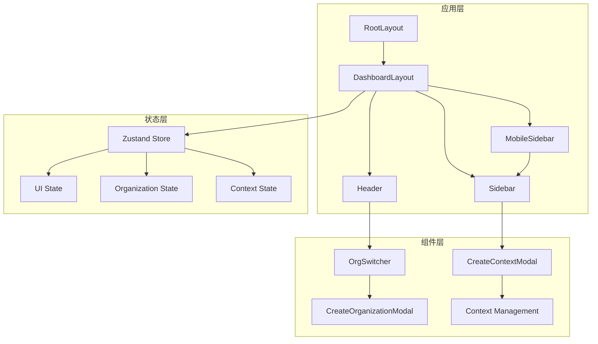

**图表来源**
- [layout.tsx](file://frontend/src/app/layout.tsx#L1-L42)
- [layout.tsx](file://frontend/src/app/dashboard/layout.tsx#L1-L38)

**章节来源**
- [layout.tsx](file://frontend/src/app/layout.tsx#L1-L42)
- [layout.tsx](file://frontend/src/app/dashboard/layout.tsx#L1-L38)

## 核心布局组件

### Header组件 - 桌面端主导航中心

Header组件是桌面端的核心导航中心，采用简洁而功能丰富的设计：

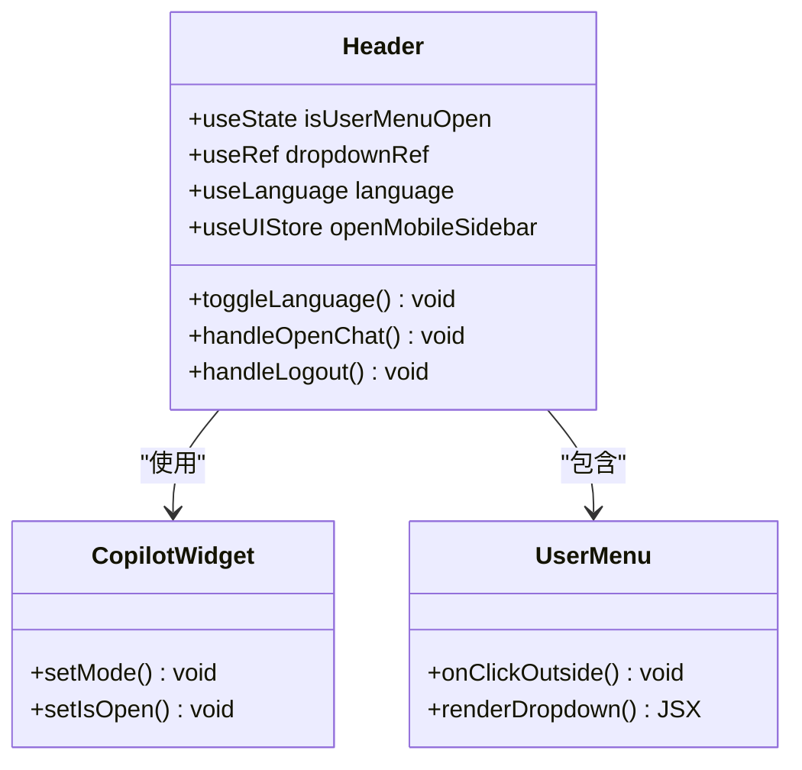

**图表来源**
- [Header.tsx](file://frontend/src/components/layout/Header.tsx#L14-L169)

#### 主要特性

1. **响应式头部设计**：在移动设备上简化为紧凑的导航栏，在桌面端提供完整功能集
2. **智能语言切换**：支持中英文双语切换，提升国际化体验
3. **AI助手集成**：内置Copilot Widget，提供智能对话功能
4. **用户管理**：完整的用户认证和设置功能

**章节来源**
- [Header.tsx](file://frontend/src/components/layout/Header.tsx#L1-L169)

### Sidebar组件 - 桌面端深度导航

Sidebar组件提供桌面端的深度导航功能，包含智能上下文管理和分类导航：

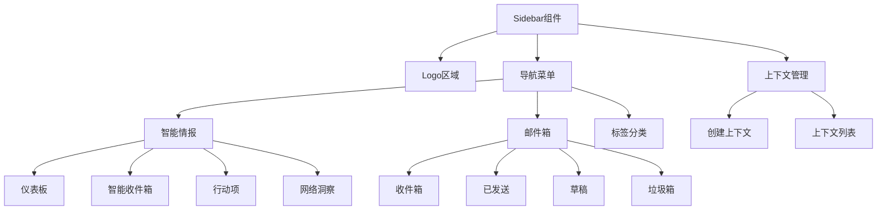

**图表来源**
- [Sidebar.tsx](file://frontend/src/components/layout/Sidebar.tsx#L30-L293)

#### 导航分类系统

1. **智能情报**：核心业务功能导航
2. **邮件箱**：邮件管理功能
3. **标签分类**：邮件分类管理
4. **智能上下文**：个性化内容过滤

**章节来源**
- [Sidebar.tsx](file://frontend/src/components/layout/Sidebar.tsx#L1-L293)

### MobileSidebar组件 - 移动端导航解决方案

MobileSidebar组件基于Radix UI的Sheet组件，提供移动端的沉浸式导航体验：

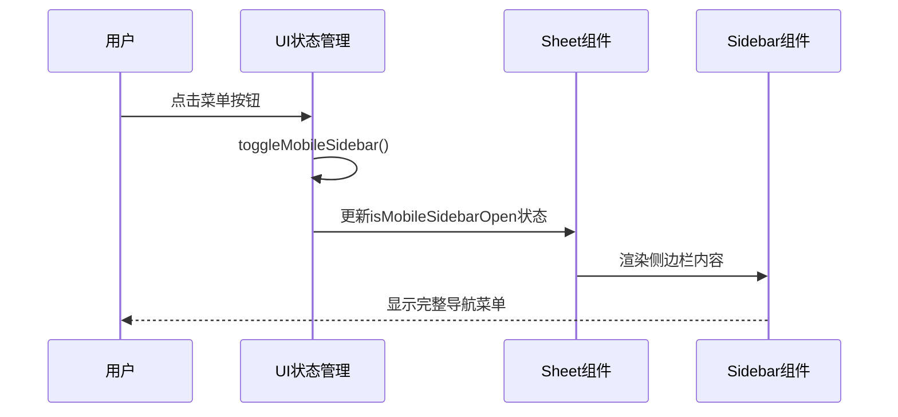

**图表来源**
- [MobileSidebar.tsx](file://frontend/src/components/layout/MobileSidebar.tsx#L8-L22)
- [Sheet.tsx](file://frontend/src/components/ui/Sheet.tsx#L1-L141)

**章节来源**
- [MobileSidebar.tsx](file://frontend/src/components/layout/MobileSidebar.tsx#L1-L23)

## 响应式设计策略

### 断点管理系统

EchoMind采用Tailwind CSS的响应式断点系统，实现精确的设备适配：

| 设备类型 | 断点范围 | 组件表现 |
|---------|---------|---------|
| 移动设备 | < 768px | 简化头部 + MobileSidebar |
| 平板设备 | 768px - 1024px | 混合模式 |
| 桌面设备 | > 1024px | 完整桌面布局 |

### 移动端适配策略

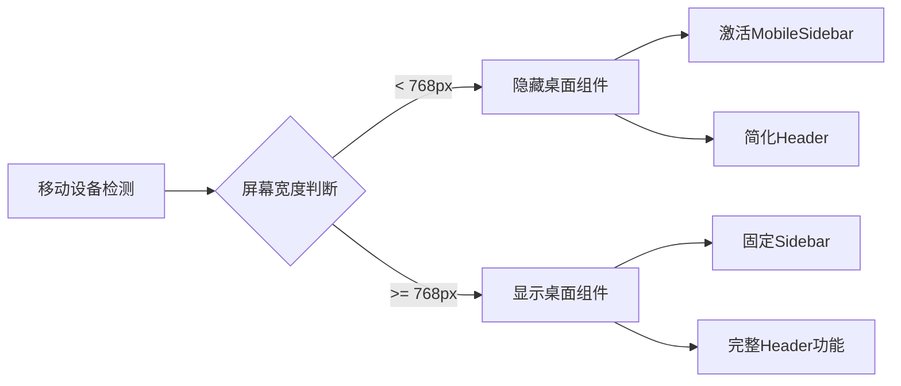

**章节来源**
- [layout.tsx](file://frontend/src/app/dashboard/layout.tsx#L17-L34)
- [ui.ts](file://frontend/src/store/ui.ts#L1-L16)

## 组织上下文切换系统

### OrgSwitcher组件架构

OrgSwitcher组件实现了多组织上下文切换功能，与Zustand的organizationStore深度集成：

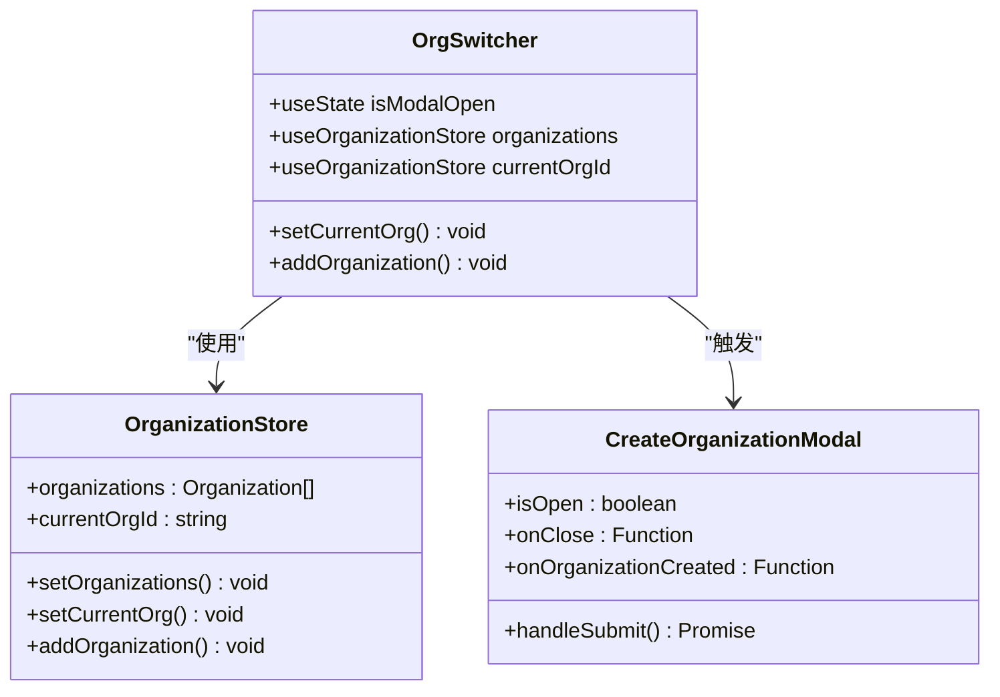

**图表来源**
- [OrgSwitcher.tsx](file://frontend/src/components/layout/OrgSwitcher.tsx#L11-L66)
- [organization.ts](file://frontend/src/lib/store/organization.ts#L13-L37)

### 多组织上下文管理

#### 数据流架构

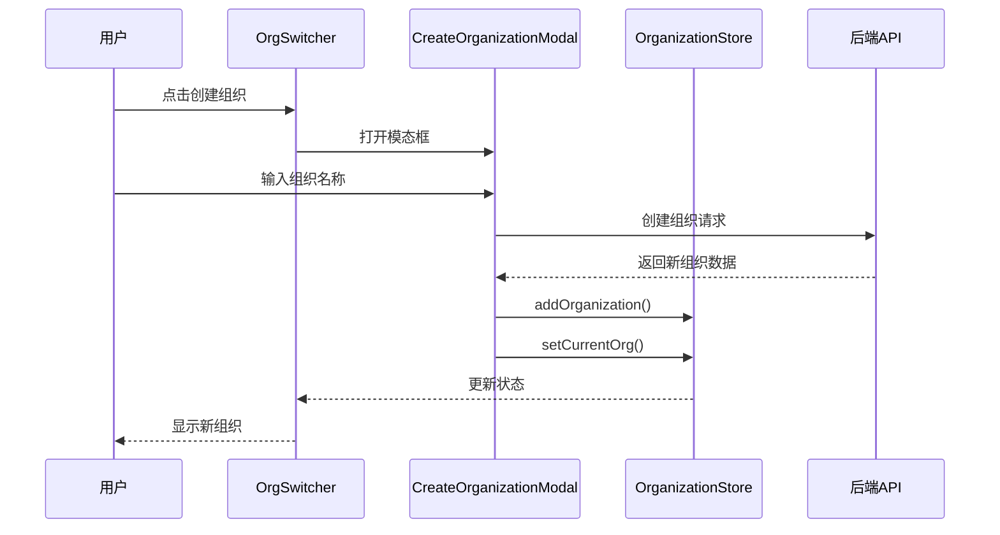

**图表来源**
- [OrgSwitcher.tsx](file://frontend/src/components/layout/OrgSwitcher.tsx#L54-L62)
- [CreateOrganizationModal.tsx](file://frontend/src/components/layout/CreateOrganizationModal.tsx#L17-L69)

**章节来源**
- [OrgSwitcher.tsx](file://frontend/src/components/layout/OrgSwitcher.tsx#L1-L66)
- [organization.ts](file://frontend/src/lib/store/organization.ts#L1-L38)

## 模态对话框组件

### CreateContextModal - 智能上下文创建

CreateContextModal提供了完整的智能上下文创建功能，支持关键词和利益相关者配置：

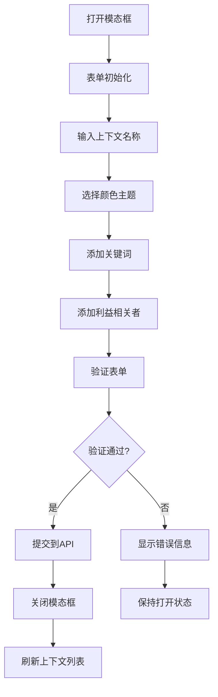

**图表来源**
- [CreateContextModal.tsx](file://frontend/src/components/layout/CreateContextModal.tsx#L23-L213)

#### 表单处理机制

1. **实时验证**：输入过程中的即时反馈
2. **标签管理**：支持关键词和利益相关者的灵活添加删除
3. **颜色主题**：提供五种预设颜色方案
4. **键盘交互**：支持回车键和逗号键确认输入

**章节来源**
- [CreateContextModal.tsx](file://frontend/src/components/layout/CreateContextModal.tsx#L1-L213)

### CreateOrganizationModal - 组织创建

CreateOrganizationModal专注于组织级别的创建功能：

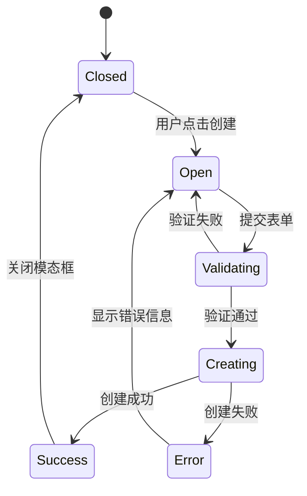

**图表来源**
- [CreateOrganizationModal.tsx](file://frontend/src/components/layout/CreateOrganizationModal.tsx#L17-L69)

**章节来源**
- [CreateOrganizationModal.tsx](file://frontend/src/components/layout/CreateOrganizationModal.tsx#L1-L69)

## 状态管理架构

### Zustand状态管理

EchoMind采用Zustand作为状态管理解决方案，提供轻量级且类型安全的状态管理：

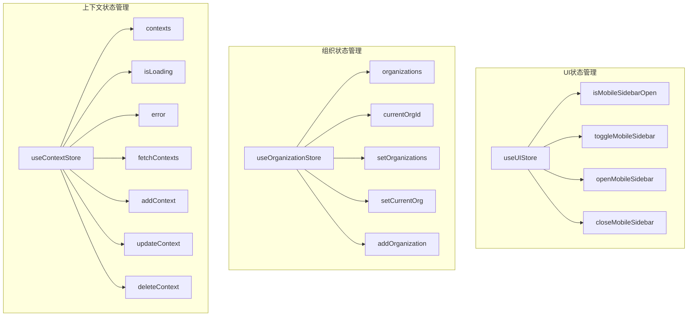

**图表来源**
- [ui.ts](file://frontend/src/store/ui.ts#L3-L15)
- [organization.ts](file://frontend/src/lib/store/organization.ts#L13-L37)
- [contexts.ts](file://frontend/src/lib/store/contexts.ts#L4-L74)

### 状态持久化策略

所有状态管理都采用Zustand的persist中间件，确保用户体验的一致性：

| 存储类型 | 持久化键 | 用途 |
|---------|---------|------|
| UI状态 | 'ui-state' | 导航状态记忆 |
| 组织状态 | 'organization-storage' | 组织信息持久化 |
| 上下文状态 | 'context-storage' | 智能上下文持久化 |

**章节来源**
- [ui.ts](file://frontend/src/store/ui.ts#L1-L16)
- [organization.ts](file://frontend/src/lib/store/organization.ts#L1-L38)
- [contexts.ts](file://frontend/src/lib/store/contexts.ts#L1-L75)

## 视觉设计系统

### Tailwind CSS集成

EchoMind完全基于Tailwind CSS构建，提供一致的视觉设计语言：

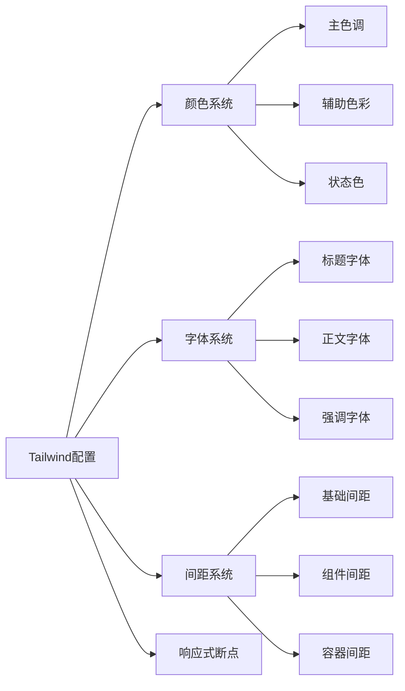

**图表来源**
- [tailwind.config.ts](file://frontend/tailwind.config.ts#L1-L61)

### 视觉层级规范

1. **导航层级**：通过阴影和边框区分不同层级
2. **交互反馈**：悬停、聚焦、激活状态的明确视觉反馈
3. **响应式间距**：根据屏幕尺寸调整间距大小
4. **动画过渡**：平滑的展开收缩动画效果

**章节来源**
- [tailwind.config.ts](file://frontend/tailwind.config.ts#L1-L61)

## 实战示例

### 动态路由更新示例

以下展示了如何通过Next.js App Router实现动态路由更新：

```typescript
// 路由参数处理示例
const pathname = usePathname();
const searchParams = useSearchParams();
const currentContext = searchParams.get('context');

// 导航激活状态判断
const isActive = (href: string, params?: { context?: string }) => {
  if (pathname !== href.split('?')[0]) return false;
  if (params && params.context && currentContext !== params.context) return false;
  return true;
};
```

### 组件集成示例

```typescript
// 在DashboardLayout中集成所有导航组件
export default function DashboardLayout({ children }: { children: React.ReactNode }) {
  return (
    <AuthGuard>
      <div className="flex h-screen bg-slate-50">
        {/* 桌面端固定侧边栏 */}
        <Sidebar className="hidden md:flex" />
        
        {/* 移动端抽屉式导航 */}
        <MobileSidebar />
        
        <main className="flex-1 flex flex-col relative w-full md:ml-64">
          <Header />
          <div className="flex-1 overflow-y-auto scroll-smooth">
            <div className="max-w-7xl mx-auto p-6 md:p-10 w-full">
              {children}
            </div>
          </div>
        </main>
      </div>
    </AuthGuard>
  );
}
```

### 状态管理集成示例

```typescript
// 在组件中使用状态管理
export function ExampleComponent() {
  const { isMobileSidebarOpen, toggleMobileSidebar } = useUIStore();
  const { organizations, currentOrgId, setCurrentOrg } = useOrganizationStore();
  
  return (
    <div>
      {/* 使用UI状态控制移动端导航 */}
      <button onClick={toggleMobileSidebar}>
        {isMobileSidebarOpen ? '关闭' : '打开'}导航
      </button>
      
      {/* 组织切换 */}
      <select 
        value={currentOrgId || ''}
        onChange={(e) => setCurrentOrg(e.target.value)}
      >
        {organizations.map(org => (
          <option key={org.id} value={org.id}>
            {org.name}
          </option>
        ))}
      </select>
    </div>
  );
}
```

## 最佳实践

### 性能优化建议

1. **组件懒加载**：对非关键组件使用React.lazy
2. **状态分割**：避免单一大型状态对象
3. **记忆化**：使用useMemo和useCallback优化渲染
4. **代码分割**：合理使用动态导入

### 可访问性指南

1. **键盘导航**：确保所有交互可通过键盘完成
2. **ARIA标签**：为复杂组件添加适当的ARIA属性
3. **焦点管理**：正确处理模态框的焦点流动
4. **屏幕阅读器**：提供有意义的文本替代

### 测试策略

1. **单元测试**：测试组件的核心逻辑
2. **集成测试**：测试组件间的数据流
3. **端到端测试**：测试完整的用户流程
4. **视觉回归测试**：确保设计一致性

### 维护建议

1. **类型安全**：充分利用TypeScript的类型系统
2. **代码规范**：遵循团队的编码规范
3. **文档维护**：及时更新组件文档
4. **版本控制**：合理使用Git分支和标签

通过以上架构设计和最佳实践，EchoMind的布局与导航组件体系为用户提供了流畅、一致且功能丰富的跨设备体验。这套系统不仅满足了当前的功能需求，还具备良好的扩展性和维护性，为未来的功能迭代奠定了坚实的基础。