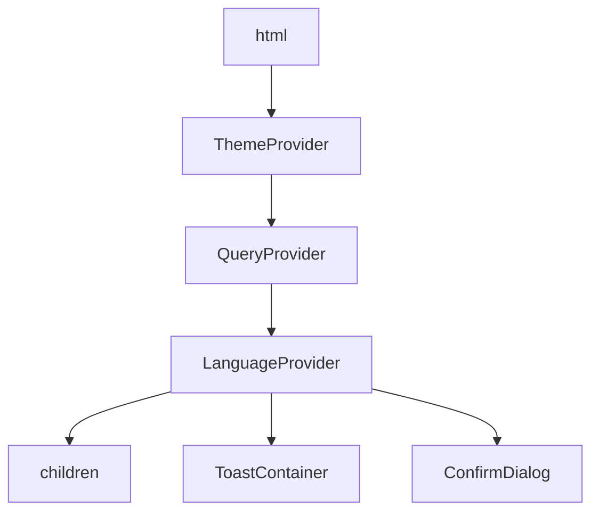
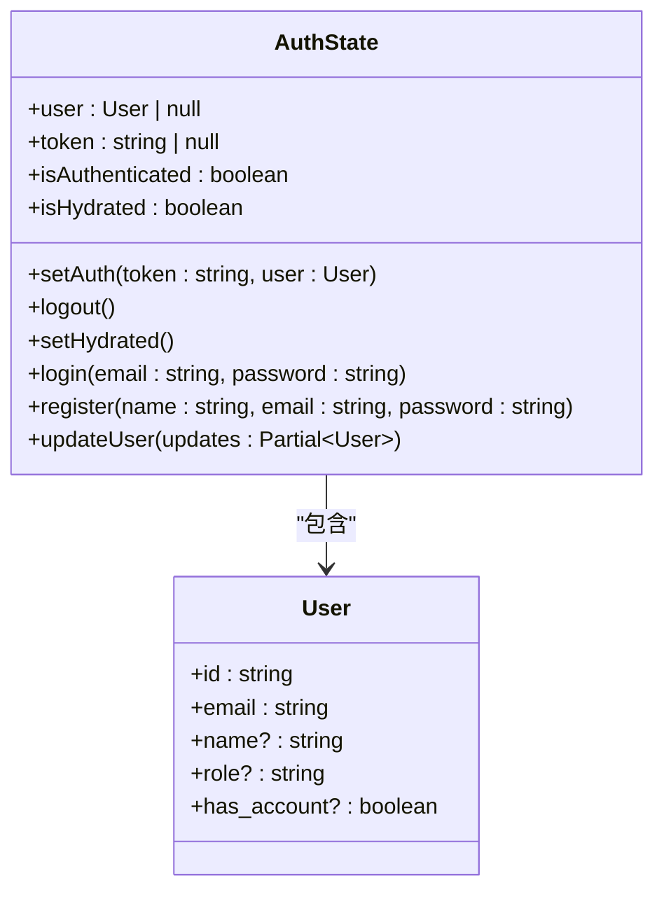
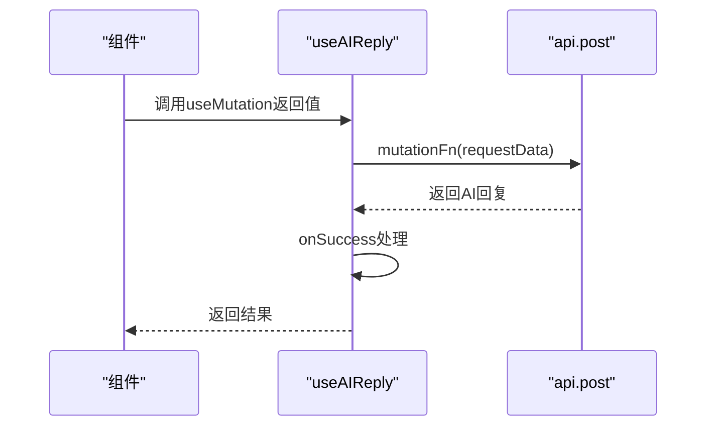
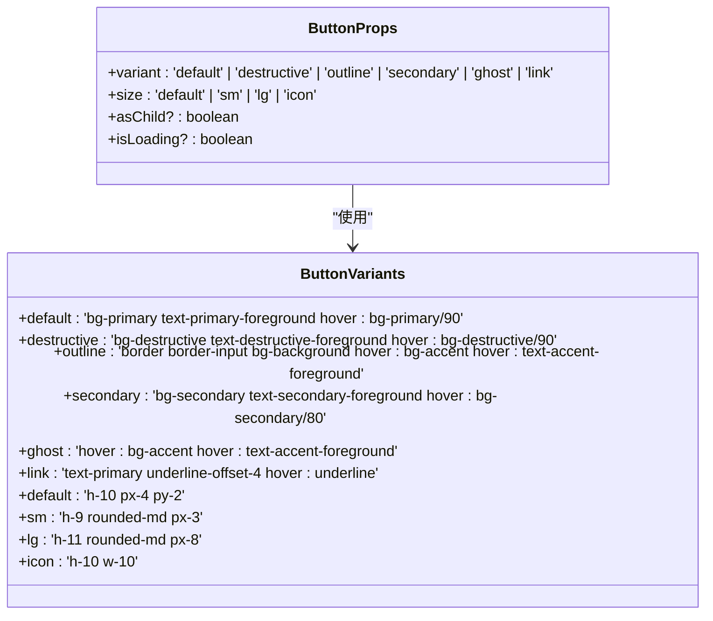
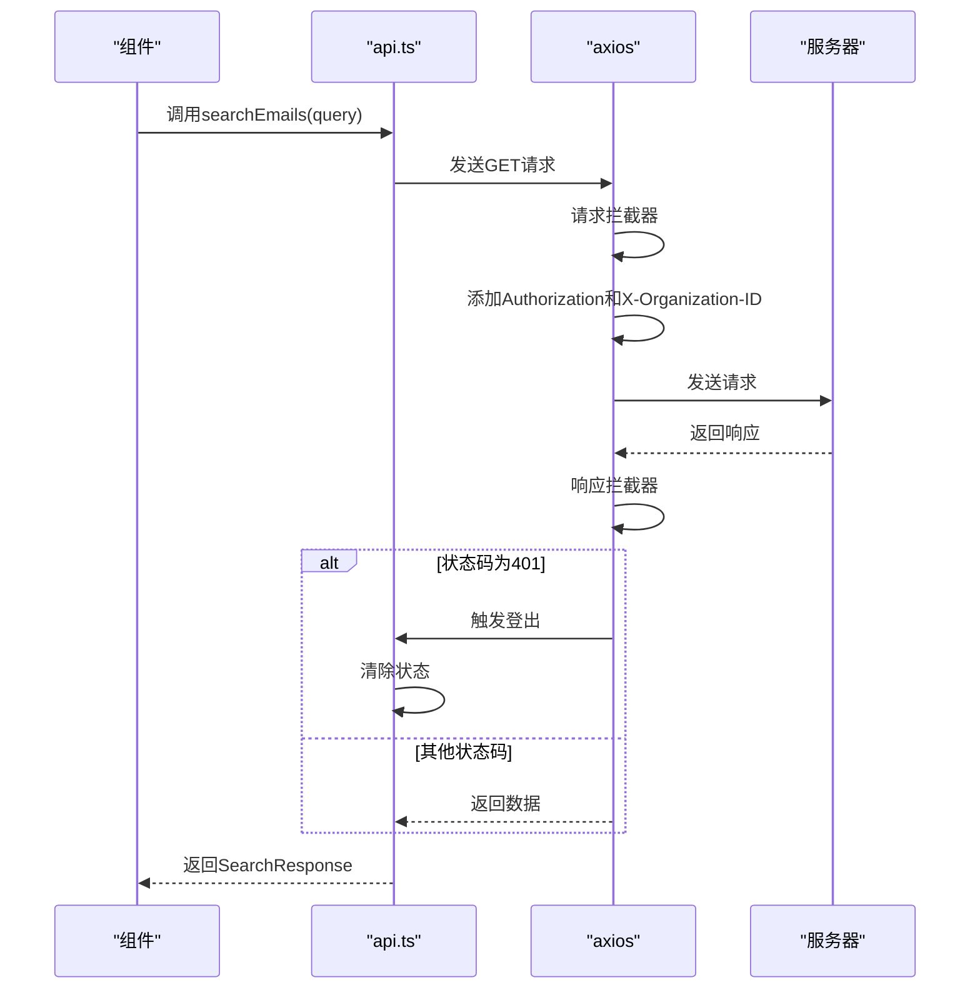

# 前端架构

<cite>
**本文档中引用的文件**  
- [layout.tsx](file://frontend/src/app/layout.tsx)
- [dashboard/layout.tsx](file://frontend/src/app/dashboard/layout.tsx)
- [QueryClientProvider.tsx](file://frontend/src/components/providers/QueryClientProvider.tsx)
- [ThemeProvider.tsx](file://frontend/src/components/theme/ThemeProvider.tsx)
- [LanguageContext.tsx](file://frontend/src/lib/i18n/LanguageContext.tsx)
- [useAIReply.ts](file://frontend/src/hooks/useAIReply.ts)
- [api.ts](file://frontend/src/lib/api.ts)
- [Button.tsx](file://frontend/src/components/ui/Button.tsx)
- [auth.ts](file://frontend/src/store/auth.ts)
- [useCopilotStore.ts](file://frontend/src/store/useCopilotStore.ts)
- [Header.tsx](file://frontend/src/components/layout/Header.tsx)
- [CopilotWidget.tsx](file://frontend/src/components/copilot/CopilotWidget.tsx)
- [index.ts](file://frontend/src/store/index.ts)
</cite>

## 目录
1. [项目结构](#项目结构)
2. [核心布局与全局提供者](#核心布局与全局提供者)
3. [状态管理](#状态管理)
4. [自定义Hook](#自定义hook)
5. [UI组件库设计](#ui组件库设计)
6. [API调用与拦截器](#api调用与拦截器)
7. [开发指南](#开发指南)

## 项目结构

EchoMind的前端应用基于Next.js 16构建，采用App Router架构，实现了清晰的模块化和组件化设计。项目结构遵循功能划分原则，将代码组织为逻辑清晰的目录。

```mermaid
graph TD
A[前端应用] --> B[src]
B --> C[app]
B --> D[components]
B --> E[lib]
B --> F[store]
B --> G[hooks]
C --> C1[auth]
C --> C2[dashboard]
C --> C3[onboarding]
C --> C4[globals.css]
C --> C5[layout.tsx]
D --> D1[auth]
D --> D2[copilot]
D --> D3[dashboard]
D --> D4[email]
D --> D5[insights]
D --> D6[layout]
D --> D7[providers]
D --> D8[settings]
D --> D9[theme]
D --> D10[ui]
D --> D11[widgets]
E --> E1[api]
E --> E2[constants]
E --> E3[hooks]
E --> E4[i18n]
E --> E5[store]
E --> E6[api.ts]
E --> E7[utils.ts]
F --> F1[auth.ts]
F --> F2[index.ts]
F --> F3[onboarding.ts]
F --> F4[opportunityStore.ts]
F --> F5[task.ts]
F --> F6[ui.ts]
F --> F7[useCopilotStore.ts]
G --> G1[useAIReply.ts]
G --> G2[useDealmakerRadar.ts]
G --> G3[useExecutiveOverview.ts]
G --> G4[useManagerStats.ts]
G --> G5[useOnClickOutside.ts]
G --> G6[useOpportunities.ts]
G --> G7[useRisks.ts]
G --> G8[useTrends.ts]
G --> G9[useUserProfile.ts]
```



**Diagram sources**  
- [frontend/src/app](file://frontend/src/app)
- [frontend/src/components](file://frontend/src/components)
- [frontend/src/lib](file://frontend/src/lib)
- [frontend/src/store](file://frontend/src/store)
- [frontend/src/hooks](file://frontend/src/hooks)

**Section sources**  
- [frontend/src/app](file://frontend/src/app)
- [frontend/src/components](file://frontend/src/components)

## 核心布局与全局提供者

应用的核心布局文件`layout.tsx`在根级别集成了多个全局提供者，为整个应用提供统一的上下文环境。这些提供者按特定顺序嵌套，确保依赖关系正确。



### 主题提供者 (ThemeProvider)

`ThemeProvider`基于`next-themes`实现，支持亮色、暗色和系统主题三种模式。它通过`localStorage`持久化用户选择的主题，并在客户端进行水合处理。

**Section sources**  
- [ThemeProvider.tsx](file://frontend/src/components/theme/ThemeProvider.tsx)
- [layout.tsx](file://frontend/src/app/layout.tsx)

### 状态查询提供者 (QueryProvider)

`QueryProvider`封装了`@tanstack/react-query`的`QueryClientProvider`，配置了默认的查询选项，如1分钟的`staleTime`和1次重试机制，优化了数据获取的性能和用户体验。

**Section sources**  
- [QueryClientProvider.tsx](file://frontend/src/components/providers/QueryClientProvider.tsx)
- [layout.tsx](file://frontend/src/app/layout.tsx)

### 国际化提供者 (LanguageProvider)

`LanguageProvider`实现了中英文双语支持，通过`localStorage`保存用户的语言偏好。它提供了`t`函数用于文本翻译，支持嵌套键的查找。

**Section sources**  
- [LanguageContext.tsx](file://frontend/src/lib/i18n/LanguageContext.tsx)
- [layout.tsx](file://frontend/src/app/layout.tsx)

## 状态管理

应用采用Zustand作为状态管理库，结合`zustand/persist`实现状态的持久化存储。状态被组织在`store`目录下，通过`index.ts`统一导出。

### 认证状态 (auth.ts)

`useAuthStore`管理用户的认证状态，包括token、用户信息和认证状态。它使用`persist`中间件将状态存储在`localStorage`中，并在水合完成后标记为已就绪。



**Diagram sources**  
- [auth.ts](file://frontend/src/store/auth.ts)

**Section sources**  
- [auth.ts](file://frontend/src/store/auth.ts)
- [index.ts](file://frontend/src/store/index.ts)

### Copilot状态 (useCopilotStore.ts)

`useCopilotStore`管理Copilot功能的状态，包括打开状态、模式（搜索/聊天/空闲）、查询、搜索结果、聊天消息等。它提供了重置状态的方法，便于在不同场景下使用。

```mermaid
classDiagram
class CopilotState {
+isOpen : boolean
+mode : 'search' | 'chat' | 'idle'
+query : string
+searchResults : SearchResult[]
+isSearching : boolean
+messages : CopilotMessage[]
+isChatting : boolean
+activeContextId : string | null
+setIsOpen(isOpen : boolean)
+setMode(mode : 'search' | 'chat' | 'idle')
+setQuery(query : string)
+setSearchResults(results : SearchResult[])
+setIsSearching(isSearching : boolean)
+addMessage(message : CopilotMessage)
+setMessages(messages : CopilotMessage[])
+setIsChatting(isChatting : boolean)
+setActiveContextId(id : string | null)
+reset()
}
class CopilotMessage {
+role : 'user' | 'assistant' | 'system'
+content : string
+widget? : { type : string, data : Record<string, unknown> }
}
class SearchResult {
+email_id : string
+subject : string
+snippet : string
+sender : string
+date : string
+score : number
}
CopilotState --> CopilotMessage : "包含"
CopilotState --> SearchResult : "包含"
```

**Diagram sources**  
- [useCopilotStore.ts](file://frontend/src/store/useCopilotStore.ts)

**Section sources**  
- [useCopilotStore.ts](file://frontend/src/store/useCopilotStore.ts)
- [index.ts](file://frontend/src/store/index.ts)

## 自定义Hook

应用通过自定义Hook封装业务逻辑，提高代码的复用性和可维护性。

### useAIReply Hook

`useAIReply`是一个基于`@tanstack/react-query`的mutation Hook，用于请求AI生成邮件回复。它封装了API调用、成功和错误处理逻辑。



**Section sources**  
- [useAIReply.ts](file://frontend/src/hooks/useAIReply.ts)

## UI组件库设计

UI组件库位于`components/ui`目录，基于`shadcn/ui`模式构建，提供了可复用的原子化组件。

### 按钮组件 (Button.tsx)

`Button`组件使用`class-variance-authority`定义了多种变体和尺寸，支持加载状态和插槽模式。



**Section sources**  
- [Button.tsx](file://frontend/src/components/ui/Button.tsx)

## API调用与拦截器

应用通过`lib/api.ts`统一管理API调用，使用`axios`作为HTTP客户端，并配置了请求和响应拦截器。

### 请求拦截器

在请求发送前，拦截器会自动添加认证token和组织ID到请求头中，确保每个请求都携带必要的认证信息。

### 响应拦截器

当收到401未授权响应时，拦截器会自动清除认证状态并触发登出流程，确保应用状态的一致性。



**Diagram sources**  
- [api.ts](file://frontend/src/lib/api.ts)

**Section sources**  
- [api.ts](file://frontend/src/lib/api.ts)

## 开发指南

### 页面构建

新页面应创建在`app`目录下的相应路径中，使用Next.js的App Router模式。页面组件应使用`'use client'`指令标记为客户端组件，以便使用React Hook。

### 状态管理

- 对于全局状态，使用Zustand创建store并放置在`store`目录下
- 对于组件本地状态，使用React的`useState`或`useReducer`
- 遵循单一状态源原则，避免状态重复

### API调用

- 所有API调用应通过`lib/api.ts`中定义的函数进行
- 使用`@tanstack/react-query`管理服务端状态
- 在`hooks`目录下创建自定义Hook封装API调用逻辑

### 组件设计

- 遵循原子化设计原则，将UI分解为可复用的小组件
- 组件应尽可能无状态，通过props接收数据和回调
- 复杂组件的状态应提升到父组件或使用自定义Hook管理

**Section sources**  
- [layout.tsx](file://frontend/src/app/layout.tsx)
- [dashboard/layout.tsx](file://frontend/src/app/dashboard/layout.tsx)
- [Header.tsx](file://frontend/src/components/layout/Header.tsx)
- [CopilotWidget.tsx](file://frontend/src/components/copilot/CopilotWidget.tsx)