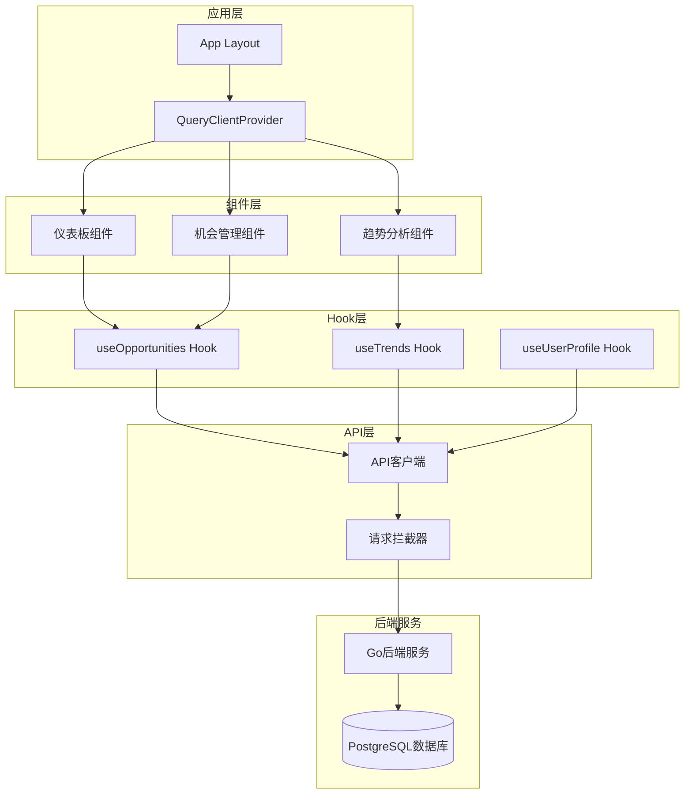
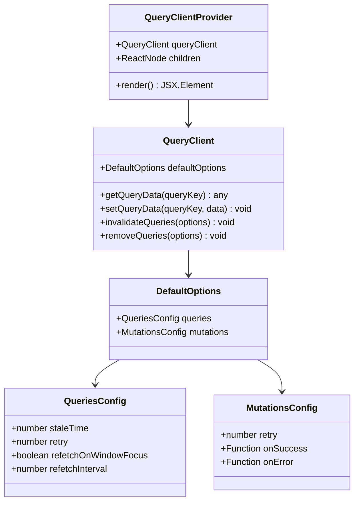
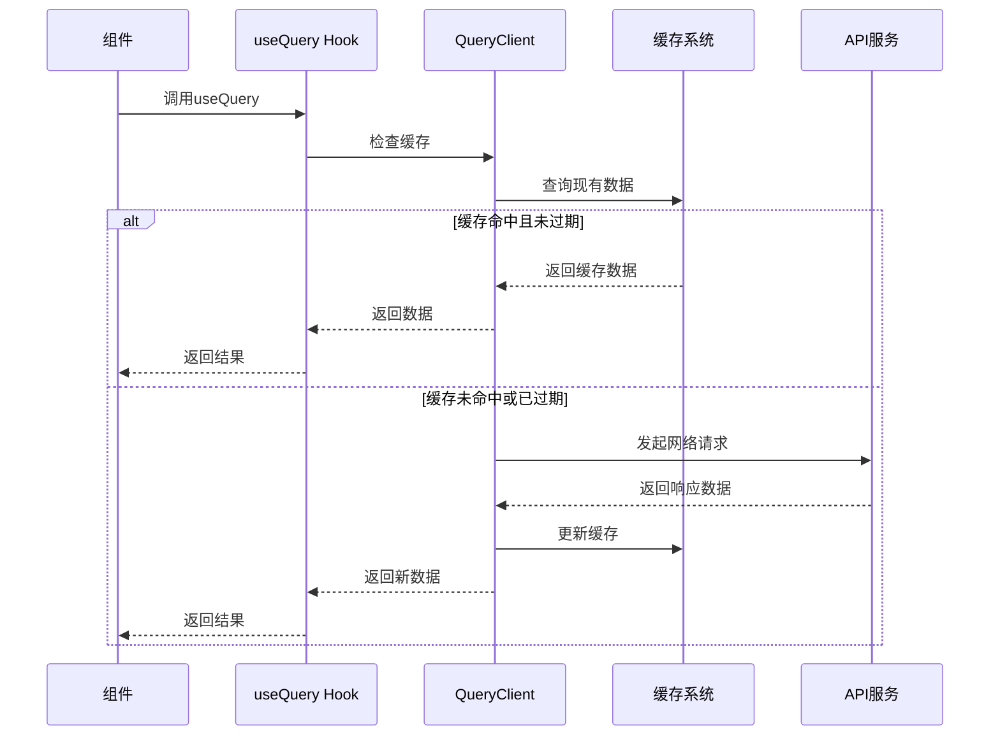
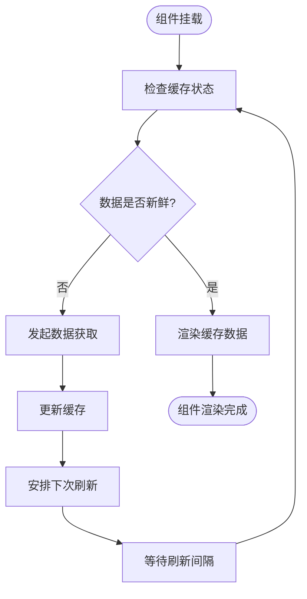
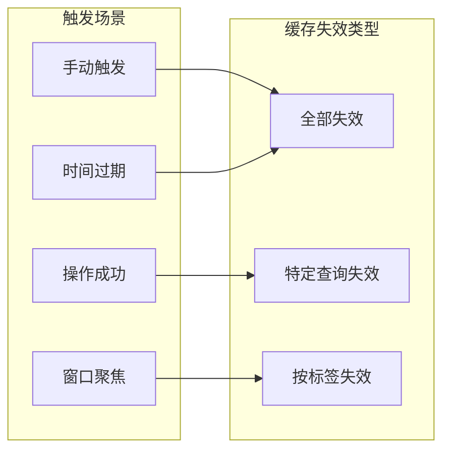
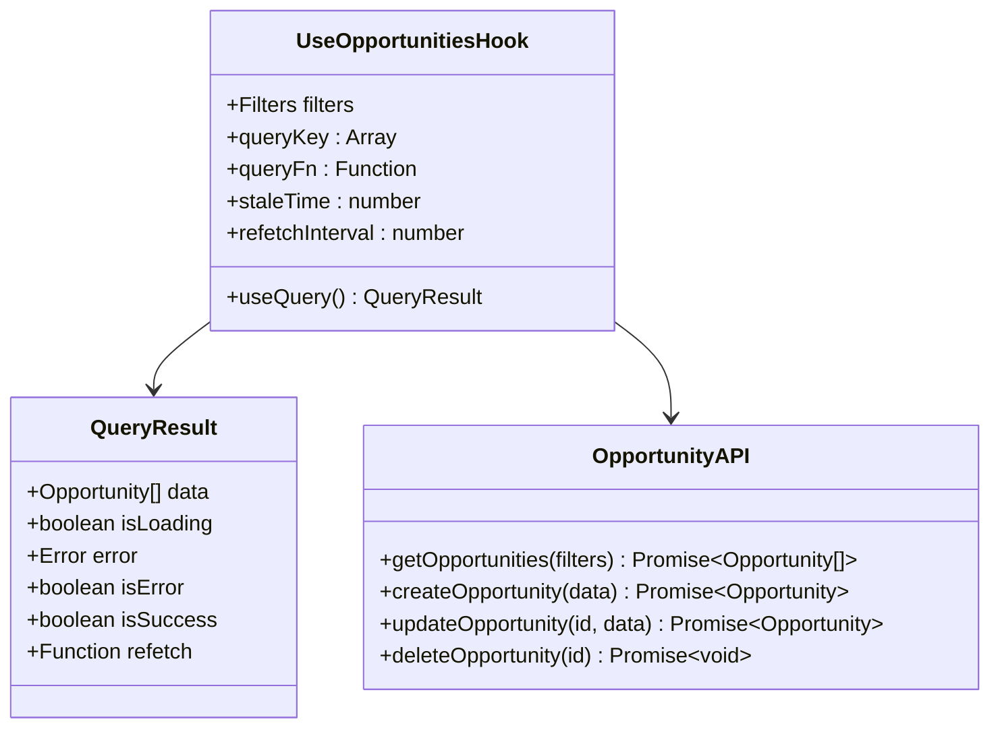
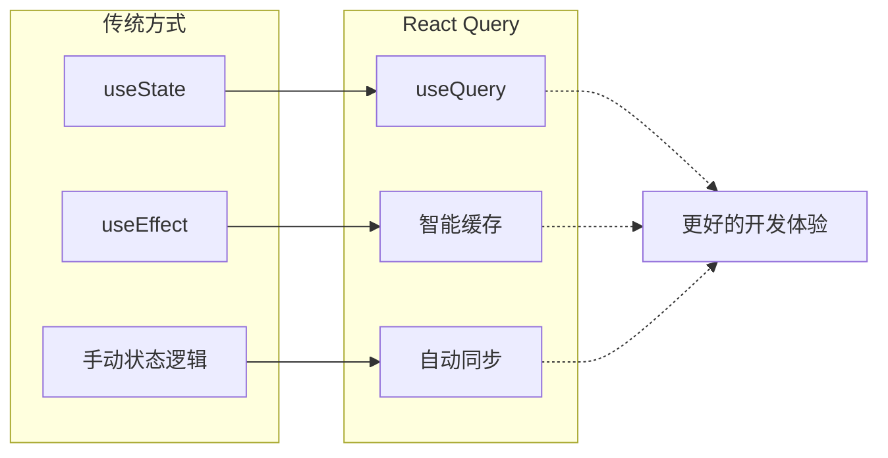
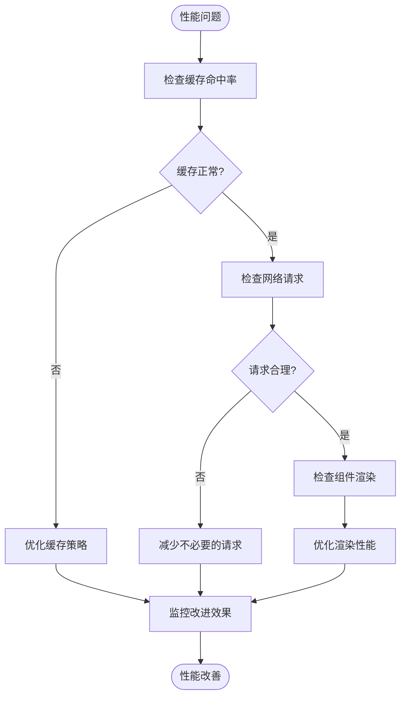

# React Query数据获取

<cite>
**本文档引用的文件**
- [QueryClientProvider.tsx](file://frontend/src/components/providers/QueryClientProvider.tsx)
- [layout.tsx](file://frontend/src/app/layout.tsx)
- [useOpportunities.ts](file://frontend/src/hooks/useOpportunities.ts)
- [api.ts](file://frontend/src/lib/api.ts)
- [opportunity.ts](file://frontend/src/types/opportunity.ts)
- [useTrends.ts](file://frontend/src/hooks/useTrends.ts)
- [useUserProfile.ts](file://frontend/src/hooks/useUserProfile.ts)
- [DealmakerView.tsx](file://frontend/src/components/dashboard/DealmakerView.tsx)
- [package.json](file://frontend/package.json)
</cite>

## 目录
1. [简介](#简介)
2. [项目架构概览](#项目架构概览)
3. [QueryClientProvider配置详解](#queryclientprovider配置详解)
4. [React Query核心功能](#react-query核心功能)
5. [查询键设计与缓存策略](#查询键设计与缓存策略)
6. [实际使用案例分析](#实际使用案例分析)
7. [性能优化策略](#性能优化策略)
8. [与传统状态管理对比](#与传统状态管理对比)
9. [最佳实践建议](#最佳实践建议)
10. [故障排除指南](#故障排除指南)

## 简介

React Query是EchoMind项目中核心的数据获取和状态管理解决方案。它提供了一套完整的工具集，用于处理服务端状态，包括数据获取、缓存、同步和后台更新。通过`QueryClientProvider`组件，React Query在应用根部提供了一个全局的QueryClient实例，实现了统一的数据管理策略。

## 项目架构概览

EchoMind采用现代化的前端架构，结合了Next.js的SSR特性和React Query的强大功能：



**图表来源**
- [layout.tsx](file://frontend/src/app/layout.tsx#L14-L42)
- [QueryClientProvider.tsx](file://frontend/src/components/providers/QueryClientProvider.tsx#L6-L29)

**章节来源**
- [layout.tsx](file://frontend/src/app/layout.tsx#L1-L42)
- [QueryClientProvider.tsx](file://frontend/src/components/providers/QueryClientProvider.tsx#L1-L29)

## QueryClientProvider配置详解

### 全局配置策略

`QueryClientProvider`是React Query在EchoMind中的核心入口点，它在应用根部提供了统一的查询客户端配置：



**图表来源**
- [QueryClientProvider.tsx](file://frontend/src/components/providers/QueryClientProvider.tsx#L7-L22)

### 默认配置参数

EchoMind的React Query配置采用了经过优化的默认值：

| 配置项 | 值 | 说明 | 影响 |
|--------|-----|------|------|
| `staleTime` | 60秒 | 数据过期时间 | 避免SSR后立即重新获取数据 |
| `retry` | 1次 | 失败重试次数 | 提供基本的容错能力 |
| `refetchInterval` | 可选 | 后台刷新间隔 | 实现数据的定期更新 |

### SSR友好配置

配置中的`staleTime: 60 * 1000`特别针对Next.js的服务器端渲染进行了优化，避免了客户端hydration完成后立即触发数据重新获取的问题。

**章节来源**
- [QueryClientProvider.tsx](file://frontend/src/components/providers/QueryClientProvider.tsx#L1-L29)

## React Query核心功能

### 数据获取与缓存

React Query通过`useQuery`钩子实现了智能的数据获取和缓存机制：



**图表来源**
- [useOpportunities.ts](file://frontend/src/hooks/useOpportunities.ts#L11-L26)
- [useTrends.ts](file://frontend/src/hooks/useTrends.ts#L19-L28)

### 状态管理自动化

React Query自动管理以下状态：

- **加载状态**：自动跟踪数据获取进度
- **错误状态**：统一处理API错误
- **成功状态**：缓存和提供最新数据
- **重试逻辑**：自动处理临时性失败

### 后台更新机制

通过`refetchInterval`配置，React Query实现了智能的后台数据更新：



**图表来源**
- [useTrends.ts](file://frontend/src/hooks/useTrends.ts#L25-L27)

**章节来源**
- [useOpportunities.ts](file://frontend/src/hooks/useOpportunities.ts#L1-L92)
- [useTrends.ts](file://frontend/src/hooks/useTrends.ts#L1-L29)

## 查询键设计与缓存策略

### 结构化查询键

EchoMind采用层次化的查询键设计，实现了精确的缓存控制：

| 查询键格式 | 示例 | 用途 | 缓存范围 |
|------------|------|------|----------|
| `['opportunities']` | `['opportunities']` | 获取所有机会列表 | 整个列表缓存 |
| `['opportunities', filters]` | `['opportunities', {status: 'active'}]` | 带过滤条件的机会列表 | 特定过滤条件的缓存 |
| `['opportunity', id]` | `['opportunity', '123']` | 单个机会详情 | 特定ID的缓存 |
| `['trends']` | `['trends']` | 趋势数据分析 | 全局趋势数据 |
| `['user-profile']` | `['user-profile']` | 用户个人资料 | 用户级别缓存 |

### 缓存失效策略

React Query提供了多种缓存失效机制：



**图表来源**
- [useOpportunities.ts](file://frontend/src/hooks/useOpportunities.ts#L50-L51)
- [useOpportunities.ts](file://frontend/src/hooks/useOpportunities.ts#L68-L69)

### 智能缓存更新

通过`useMutation`的成功回调，React Query实现了智能的缓存更新：

- **列表更新**：自动使相关列表失效
- **单条记录更新**：直接更新缓存中的特定数据
- **删除操作**：移除对应的缓存条目

**章节来源**
- [useOpportunities.ts](file://frontend/src/hooks/useOpportunities.ts#L11-L92)

## 实际使用案例分析

### 机会管理场景

以`useOpportunities`为例，展示了完整的React Query使用模式：



**图表来源**
- [useOpportunities.ts](file://frontend/src/hooks/useOpportunities.ts#L5-L27)

### 组件集成模式

在`DealmakerView`组件中，React Query的状态被优雅地集成到UI逻辑中：

- **加载状态管理**：通过`opportunitiesLoading`控制加载指示器
- **错误处理**：自动捕获和显示API错误
- **数据渲染**：根据查询状态动态渲染内容

### 类型安全保证

EchoMind充分利用TypeScript确保类型安全：

- **接口定义**：明确的数据结构规范
- **泛型支持**：自动推导返回类型
- **编译时检查**：防止运行时类型错误

**章节来源**
- [useOpportunities.ts](file://frontend/src/hooks/useOpportunities.ts#L1-L92)
- [DealmakerView.tsx](file://frontend/src/components/dashboard/DealmakerView.tsx#L78-L113)
- [opportunity.ts](file://frontend/src/types/opportunity.ts#L1-L48)

## 性能优化策略

### 缓存时间优化

EchoMind根据不同数据类型的特性设置了合理的缓存时间：

| 数据类型 | 推荐缓存时间 | 原因 | 配置示例 |
|----------|-------------|------|----------|
| 用户资料 | 10分钟 | 用户信息变化较慢 | `staleTime: 10 * 60 * 1000` |
| 机会列表 | 5分钟 | 商机信息需要实时更新 | `staleTime: 5 * 60 * 1000` |
| 趋势数据 | 10分钟 | 分析数据相对稳定 | `staleTime: 10 * 60 * 1000` |
| 实时数据 | 2分钟 | 需要频繁更新 | `refetchInterval: 2 * 60 * 1000` |

### 后台刷新策略

通过`refetchInterval`实现智能的后台数据更新：

```mermaid
gantt
title 数据刷新时间线
dateFormat X
axisFormat %M:%S
section 用户界面
加载数据 :done, 0, 30s
显示数据 :done, 30s, 5m
后台刷新 :active, 5m, 7m
section 缓存管理
缓存过期 :crit, 5m, 10m
自动刷新 :active, 10m, 12m
```

**图表来源**
- [useTrends.ts](file://frontend/src/hooks/useTrends.ts#L25-L27)
- [useOpportunities.ts](file://frontend/src/hooks/useOpportunities.ts#L24-L25)

### 条件查询优化

通过`enabled`选项实现条件查询，避免不必要的网络请求：

```typescript
// 只有在ID存在时才执行查询
return useQuery({
  queryKey: ['opportunity', id],
  queryFn: async () => {
    const { data } = await api.get(`/opportunities/${id}`);
    return data;
  },
  enabled: !!id, // ID不存在时不执行查询
  staleTime: 2 * 60 * 1000,
});
```

### 内存优化

React Query的内存管理策略：

- **自动清理**：过期数据会被自动清理
- **弱引用**：避免内存泄漏
- **增量更新**：只更新变化的部分

**章节来源**
- [useTrends.ts](file://frontend/src/hooks/useTrends.ts#L25-L27)
- [useOpportunities.ts](file://frontend/src/hooks/useOpportunities.ts#L36-L38)
- [useUserProfile.ts](file://frontend/src/hooks/useUserProfile.ts#L23-L24)

## 与传统状态管理对比

### 对比分析

EchoMind中React Query与传统状态管理方案的对比：

| 特性 | React Query | 手动状态管理 | 优势 |
|------|-------------|--------------|------|
| 数据获取 | 自动化 | 手动处理 | 减少样板代码 |
| 缓存管理 | 智能缓存 | 手动缓存 | 避免重复请求 |
| 错误处理 | 统一处理 | 分散处理 | 更好的用户体验 |
| 状态同步 | 自动同步 | 手动同步 | 减少bug |
| 性能优化 | 内置优化 | 需要手动优化 | 开箱即用 |
| 类型安全 | 完整支持 | 需要额外配置 | 编译时检查 |

### 迁移路径

从传统状态管理迁移到React Query的优势：



**图表来源**
- [useOpportunities.ts](file://frontend/src/hooks/useOpportunities.ts#L1-L92)

### 开发效率提升

React Query带来的开发效率提升：

- **减少样板代码**：自动处理加载、错误、重试状态
- **统一的API**：一致的编程模型
- **丰富的功能**：内置的缓存、重试、预取等功能
- **社区支持**：活跃的生态系统

**章节来源**
- [useOpportunities.ts](file://frontend/src/hooks/useOpportunities.ts#L1-L92)

## 最佳实践建议

### 查询键设计原则

1. **唯一性**：确保每个查询键唯一标识特定的数据集
2. **层次性**：使用数组结构表示数据的层次关系
3. **可预测性**：查询键应该直观反映数据的结构
4. **可变性**：包含影响数据的所有变量

### 错误处理策略

```typescript
// 推荐的错误处理模式
const { data, error, isLoading } = useQuery({
  queryKey: ['opportunities'],
  queryFn: async () => {
    const { data } = await api.get('/opportunities');
    return data;
  },
  onError: (error) => {
    // 记录错误日志
    console.error('获取机会失败:', error);
    // 显示用户友好的错误消息
    showToast('无法加载机会数据，请稍后重试');
  },
  retry: 2, // 增加重试次数
});
```

### 性能监控

建议实施以下性能监控措施：

- **查询时间监控**：跟踪查询的响应时间
- **缓存命中率**：监控缓存的有效性
- **网络请求统计**：分析网络请求的频率和成功率

### 测试策略

为React Query编写测试的最佳实践：

- **单元测试**：测试Hook的行为和返回值
- **集成测试**：测试与API的交互
- **快照测试**：验证UI的渲染一致性

## 故障排除指南

### 常见问题及解决方案

| 问题 | 症状 | 解决方案 |
|------|------|----------|
| 缓存不更新 | 数据看起来过期 | 检查`staleTime`设置，必要时手动失效查询 |
| 重复请求 | 同样的请求被多次发送 | 检查查询键是否正确，避免不必要的重新渲染 |
| 内存泄漏 | 应用内存持续增长 | 确保正确清理查询，避免长期持有大量数据 |
| 类型错误 | TypeScript报错 | 检查查询函数的返回类型定义 |

### 调试技巧

1. **启用调试模式**：在开发环境中启用React Query的调试工具
2. **使用DevTools**：利用浏览器的React DevTools查看查询状态
3. **日志记录**：添加适当的日志记录来跟踪查询生命周期
4. **网络面板**：使用浏览器的网络面板监控请求

### 性能诊断

当遇到性能问题时，可以按照以下步骤进行诊断：



**章节来源**
- [QueryClientProvider.tsx](file://frontend/src/components/providers/QueryClientProvider.tsx#L1-L29)
- [useOpportunities.ts](file://frontend/src/hooks/useOpportunities.ts#L1-L92)

## 结论

React Query在EchoMind项目中发挥了关键作用，它不仅简化了数据获取和状态管理的复杂性，还提供了强大的缓存机制和性能优化功能。通过合理的配置和最佳实践的应用，React Query为开发者提供了一个高效、可靠的数据管理解决方案。

随着项目的发展，建议持续关注React Query的新特性，并根据实际需求调整配置策略，以保持应用的最佳性能和用户体验。