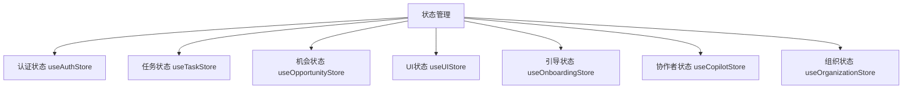
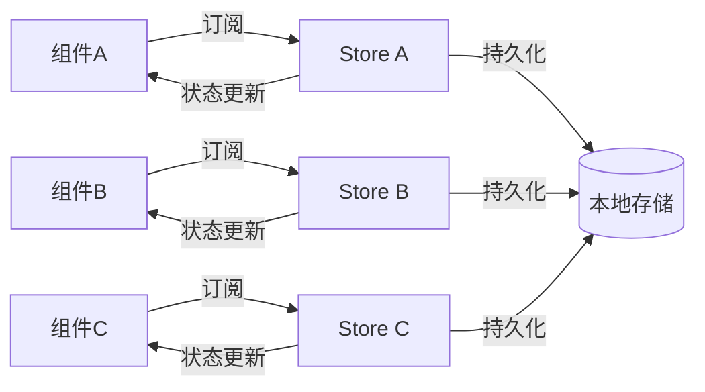
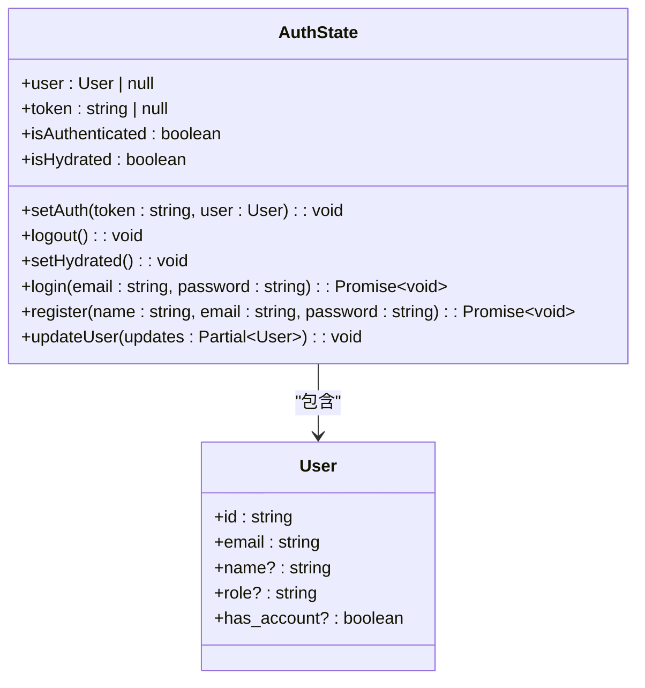
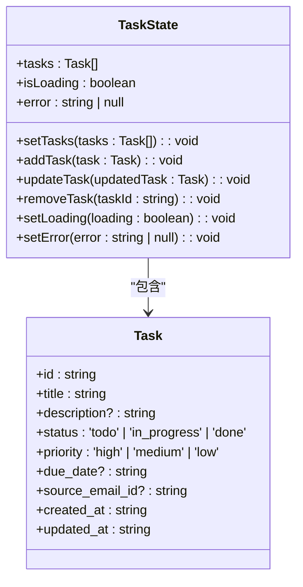
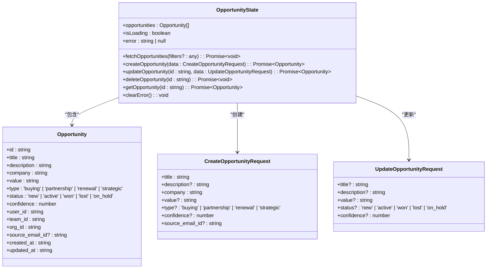
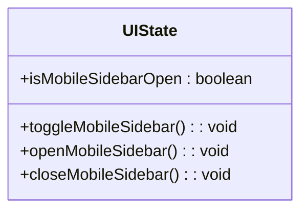
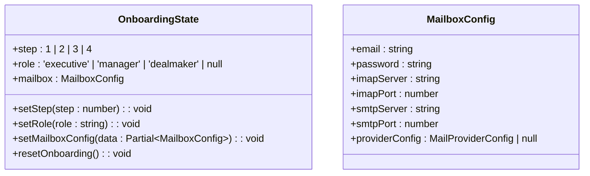
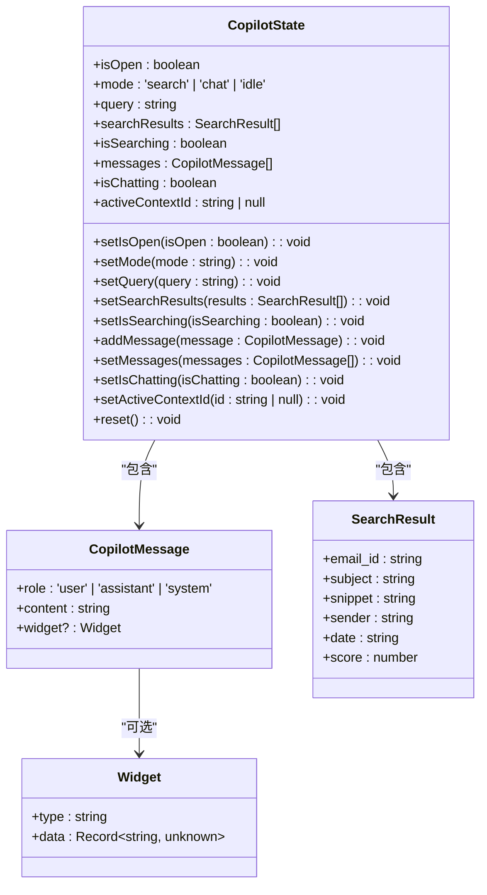
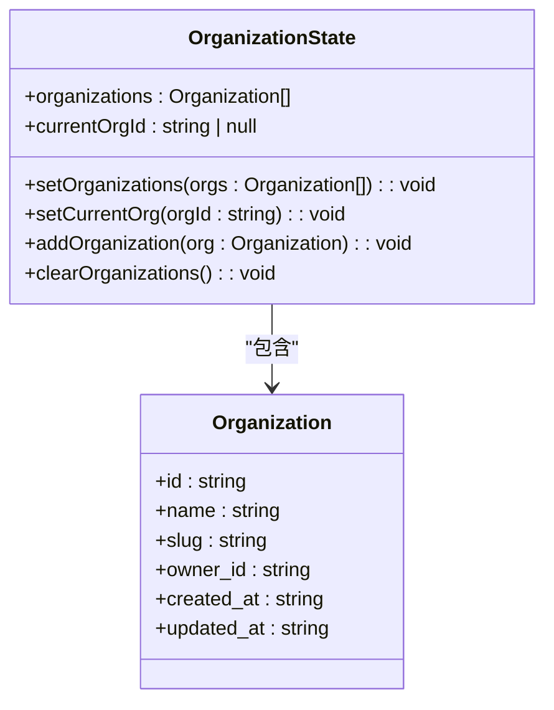

# Zustand状态管理

<cite>
**本文档引用的文件**  
- [auth.ts](file://frontend/src/store/auth.ts)
- [task.ts](file://frontend/src/store/task.ts)
- [opportunityStore.ts](file://frontend/src/store/opportunityStore.ts)
- [ui.ts](file://frontend/src/store/ui.ts)
- [onboarding.ts](file://frontend/src/store/onboarding.ts)
- [useCopilotStore.ts](file://frontend/src/store/useCopilotStore.ts)
- [organization.ts](file://frontend/src/lib/store/organization.ts)
- [tasks.ts](file://frontend/src/lib/api/tasks.ts)
- [opportunity.ts](file://frontend/src/types/opportunity.ts)
- [useToast.tsx](file://frontend/src/lib/hooks/useToast.tsx)
- [CopilotChat.tsx](file://frontend/src/components/copilot/CopilotChat.tsx)
- [CopilotInput.tsx](file://frontend/src/components/copilot/CopilotInput.tsx)
- [dashboard/layout.tsx](file://frontend/src/app/dashboard/layout.tsx)
</cite>

## 目录
1. [简介](#简介)
2. [项目结构](#项目结构)
3. [核心组件](#核心组件)
4. [架构概述](#架构概述)
5. [详细组件分析](#详细组件分析)
6. [依赖分析](#依赖分析)
7. [性能考虑](#性能考虑)
8. [故障排除指南](#故障排除指南)
9. [结论](#结论)

## 简介
本文档详细阐述了EchoMind前端应用中基于Zustand库的全局状态管理实现。文档深入分析了多个核心store模块的设计原理与状态结构，包括用户认证、任务管理、商业机会、UI状态和用户引导等。重点解释了`create`函数如何定义状态和操作方法，以及`persist`中间件如何实现状态的本地持久化。通过代码示例展示了组件如何通过`useStore` Hook订阅状态变化，并详细描述了状态持久化配置的具体应用。

## 项目结构
EchoMind前端的状态管理主要集中在`frontend/src/store`目录下，采用模块化设计，每个store文件负责管理特定领域的应用状态。这种结构提高了代码的可维护性和可测试性。

**图表来源**  
- [auth.ts](file://frontend/src/store/auth.ts)
- [task.ts](file://frontend/src/store/task.ts)
- [opportunityStore.ts](file://frontend/src/store/opportunityStore.ts)
- [ui.ts](file://frontend/src/store/ui.ts)
- [onboarding.ts](file://frontend/src/store/onboarding.ts)
- [useCopilotStore.ts](file://frontend/src/store/useCopilotStore.ts)
- [organization.ts](file://frontend/src/lib/store/organization.ts)

**章节来源**  
- [auth.ts](file://frontend/src/store/auth.ts)
- [task.ts](file://frontend/src/store/task.ts)
- [opportunityStore.ts](file://frontend/src/store/opportunityStore.ts)
- [ui.ts](file://frontend/src/store/ui.ts)

## 核心组件
EchoMind前端的状态管理由多个专门的store组成，每个store都使用Zustand的`create`函数来定义其状态和操作。这些store通过模块化设计，实现了关注点分离，使得状态管理更加清晰和可维护。

**章节来源**  
- [auth.ts](file://frontend/src/store/auth.ts)
- [task.ts](file://frontend/src/store/task.ts)
- [opportunityStore.ts](file://frontend/src/store/opportunityStore.ts)
- [ui.ts](file://frontend/src/store/ui.ts)

## 架构概述
EchoMind的状态管理架构采用中心化的全局状态管理模式，通过Zustand库实现。每个store都是独立的，但可以通过共享状态和操作来协同工作。持久化中间件`persist`被用于关键的store，确保用户状态在页面刷新后得以保留。

**图表来源**  
- [auth.ts](file://frontend/src/store/auth.ts)
- [task.ts](file://frontend/src/store/task.ts)
- [opportunityStore.ts](file://frontend/src/store/opportunityStore.ts)

## 详细组件分析
本节将深入分析EchoMind前端中各个关键状态管理组件的实现细节，包括其状态结构、操作方法和持久化配置。

### 认证状态分析
`useAuthStore`负责管理用户的认证状态，包括用户信息、认证令牌和登录状态。该store使用`persist`中间件将认证信息持久化到本地存储，确保用户在关闭浏览器后仍能保持登录状态。

**图表来源**  
- [auth.ts](file://frontend/src/store/auth.ts#L5-L24)

**章节来源**  
- [auth.ts](file://frontend/src/store/auth.ts#L1-L67)

### 任务状态分析
`useTaskStore`管理应用中的任务数据，包括任务列表、加载状态和错误信息。该store提供了添加、更新和删除任务的操作方法，但不使用持久化，因为任务数据主要从服务器获取。

**图表来源**  
- [task.ts](file://frontend/src/store/task.ts#L4-L14)
- [tasks.ts](file://frontend/src/lib/api/tasks.ts#L3-L13)

**章节来源**  
- [task.ts](file://frontend/src/store/task.ts#L1-L34)

### 机会状态分析
`useOpportunityStore`管理商业机会数据，是应用中功能最复杂的store之一。它不仅管理机会列表，还提供了与服务器交互的完整CRUD操作。该store使用`persist`中间件，并通过`partialize`配置实现了部分持久化，只持久化机会数据。

**图表来源**  
- [opportunityStore.ts](file://frontend/src/store/opportunityStore.ts#L39-L56)
- [opportunity.ts](file://frontend/src/types/opportunity.ts#L1-L34)

**章节来源**  
- [opportunityStore.ts](file://frontend/src/store/opportunityStore.ts#L1-L220)

### UI状态分析
`useUIStore`管理应用的UI状态，如移动设备侧边栏的打开/关闭状态。该store不使用持久化，因为UI状态通常在页面刷新后重置。

**图表来源**  
- [ui.ts](file://frontend/src/store/ui.ts#L3-L8)

**章节来源**  
- [ui.ts](file://frontend/src/store/ui.ts#L1-L16)

### 引导状态分析
`useOnboardingStore`管理用户引导流程的状态，包括当前步骤、用户角色选择和邮箱配置信息。该store在用户完成注册流程时使用。

**图表来源**  
- [onboarding.ts](file://frontend/src/store/onboarding.ts#L4-L23)

**章节来源**  
- [onboarding.ts](file://frontend/src/store/onboarding.ts#L1-L55)

### 协作者状态分析
`useCopilotStore`管理协作者（Copilot）功能的状态，包括搜索、聊天模式、查询和结果等。该store在用户与AI助手交互时使用。

**图表来源**  
- [useCopilotStore.ts](file://frontend/src/store/useCopilotStore.ts#L21-L51)

**章节来源**  
- [useCopilotStore.ts](file://frontend/src/store/useCopilotStore.ts#L1-L81)

### 组织状态分析
`useOrganizationStore`管理用户组织信息，包括组织列表和当前选中的组织。该store使用`persist`中间件将组织信息持久化到本地存储。

**图表来源**  
- [organization.ts](file://frontend/src/lib/store/organization.ts#L13-L20)

**章节来源**  
- [organization.ts](file://frontend/src/lib/store/organization.ts#L1-L38)

## 依赖分析
EchoMind的状态管理组件之间存在清晰的依赖关系。各store独立管理自己的状态，但可以通过共享的API客户端和类型定义进行交互。

```mermaid
graph TD
A[useAuthStore] --> B[api]
C[useTaskStore] --> B[api]
D[useOpportunityStore] --> B[api]
E[useOrganizationStore] --> B[api]
F[useOnboardingStore] --> G[mail_providers]
H[useToastStore] --> I[lucide-react]
J[useCopilotStore] --> K[useAuthStore]
J[useCopilotStore] --> L[useOpportunityStore]
M[组件] --> N[useAuthStore]
M[组件] --> O[useTaskStore]
M[组件] --> P[useOpportunityStore]
M[组件] --> Q[useUIStore]
M[组件] --> R[useOnboardingStore]
M[组件] --> S[useCopilotStore]
M[组件] --> T[useOrganizationStore]
```

**图表来源**  
- [auth.ts](file://frontend/src/store/auth.ts#L3)
- [task.ts](file://frontend/src/store/task.ts#L2)
- [opportunityStore.ts](file://frontend/src/store/opportunityStore.ts#L1)
- [organization.ts](file://frontend/src/lib/store/organization.ts#L2)
- [onboarding.ts](file://frontend/src/store/onboarding.ts#L2)
- [useToast.tsx](file://frontend/src/lib/hooks/useToast.tsx#L2)
- [CopilotChat.tsx](file://frontend/src/components/copilot/CopilotChat.tsx#L97)
- [CopilotInput.tsx](file://frontend/src/components/copilot/CopilotInput.tsx#L45)

**章节来源**  
- [auth.ts](file://frontend/src/store/auth.ts)
- [task.ts](file://frontend/src/store/task.ts)
- [opportunityStore.ts](file://frontend/src/store/opportunityStore.ts)
- [ui.ts](file://frontend/src/store/ui.ts)
- [onboarding.ts](file://frontend/src/store/onboarding.ts)
- [useCopilotStore.ts](file://frontend/src/store/useCopilotStore.ts)
- [organization.ts](file://frontend/src/lib/store/organization.ts)

## 性能考虑
在使用Zustand进行状态管理时，需要注意以下性能优化点：
- 避免在store中存储大量不必要的数据
- 使用`partialize`配置来控制持久化的数据范围
- 在组件中只订阅需要的状态，避免不必要的重新渲染
- 对于频繁更新的状态，考虑使用局部状态而非全局状态

## 故障排除指南
### 状态未正确更新
当状态未正确更新时，检查以下几点：
- 确保在`set`函数中正确地返回了新的状态对象
- 检查是否在异步操作中正确地处理了错误
- 确认组件是否正确地订阅了store的状态

### 持久化失效
当状态持久化失效时，检查以下配置：
- 确认`persist`中间件已正确应用
- 检查`name`配置是否唯一
- 验证`partialize`函数是否正确地选择了要持久化的状态

### 类型定义错误
当出现类型定义错误时，检查以下方面：
- 确认store的状态接口与实际使用一致
- 检查操作方法的参数和返回值类型
- 验证与API交互的数据类型是否匹配

**章节来源**  
- [auth.ts](file://frontend/src/store/auth.ts)
- [task.ts](file://frontend/src/store/task.ts)
- [opportunityStore.ts](file://frontend/src/store/opportunityStore.ts)

## 结论
EchoMind前端的状态管理通过Zustand库实现了高效、可维护的全局状态管理。通过模块化的设计，将不同的状态管理职责分离到独立的store中，提高了代码的可读性和可维护性。持久化中间件的使用确保了关键用户状态的连续性，而清晰的API设计使得组件可以方便地订阅和更新状态。这种架构为应用的扩展和维护提供了坚实的基础。