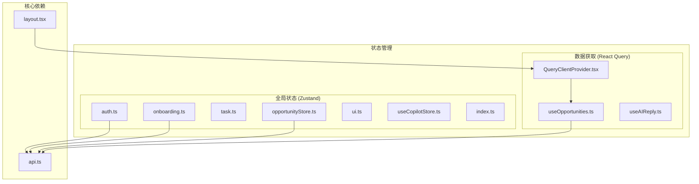
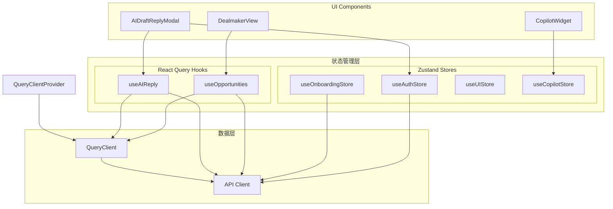
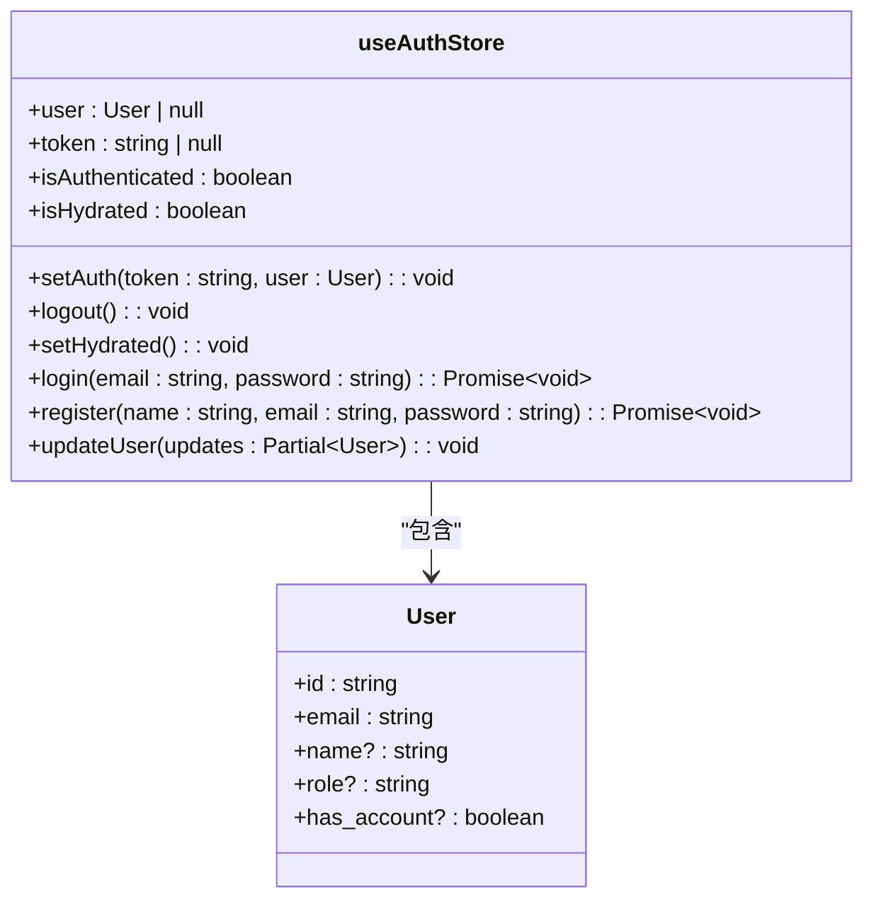
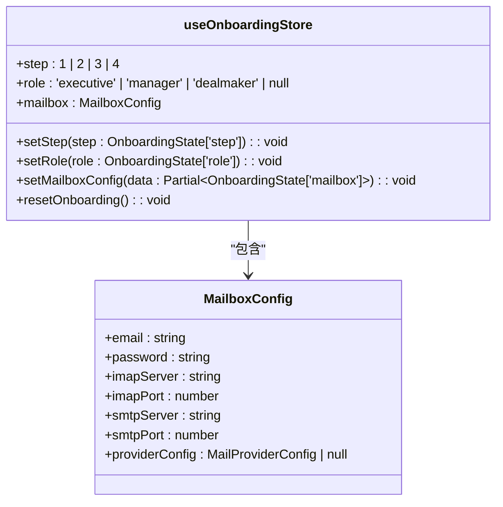
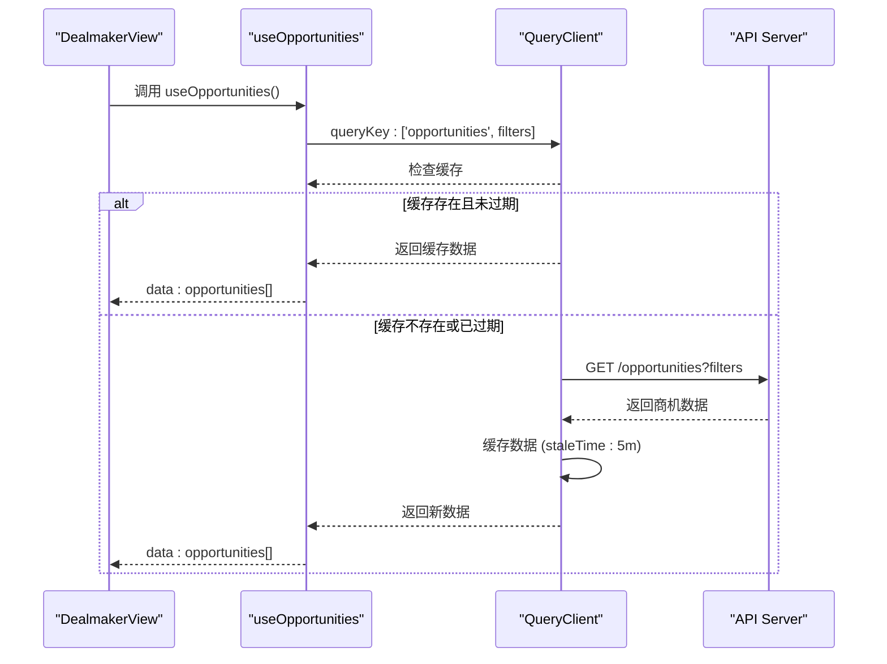
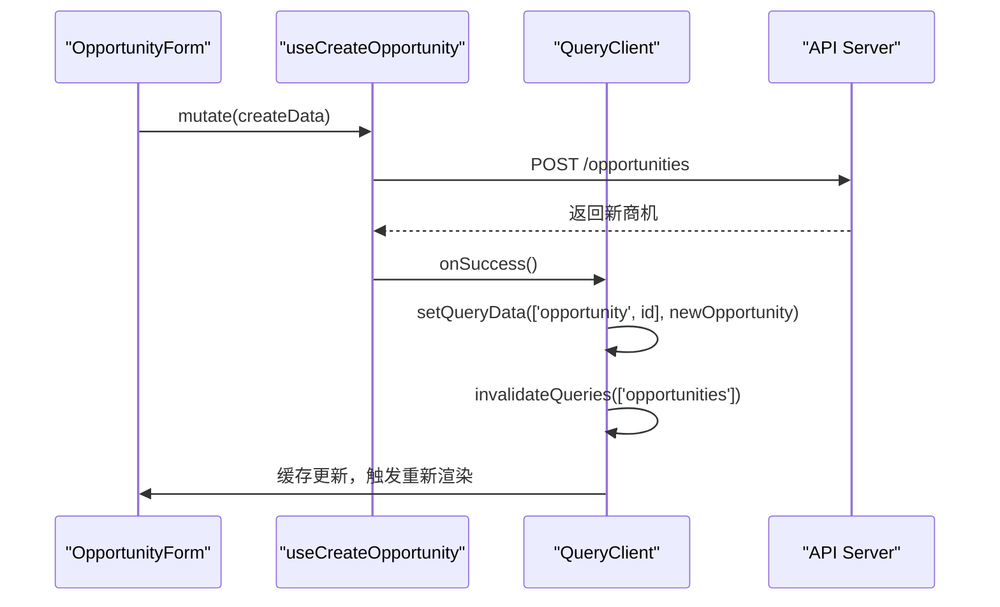
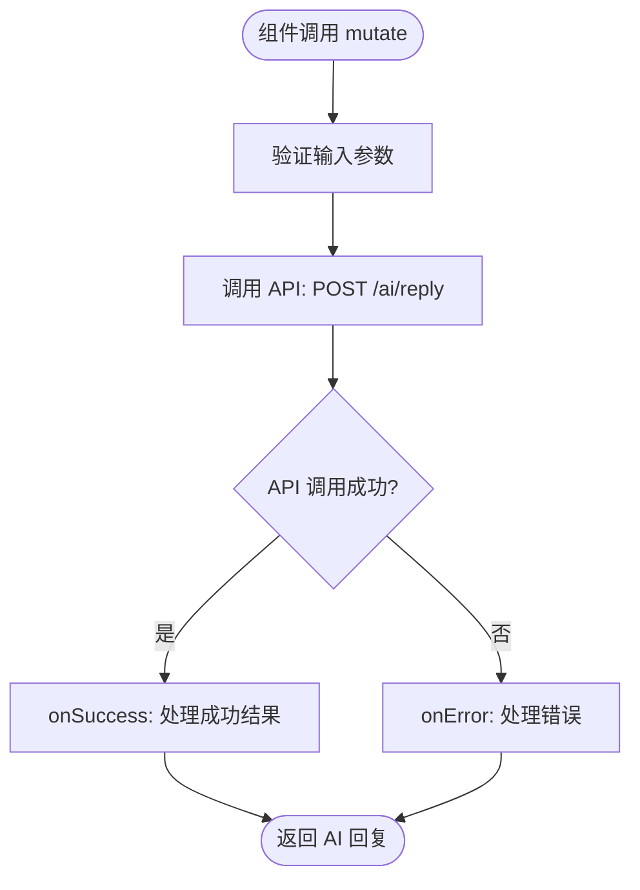
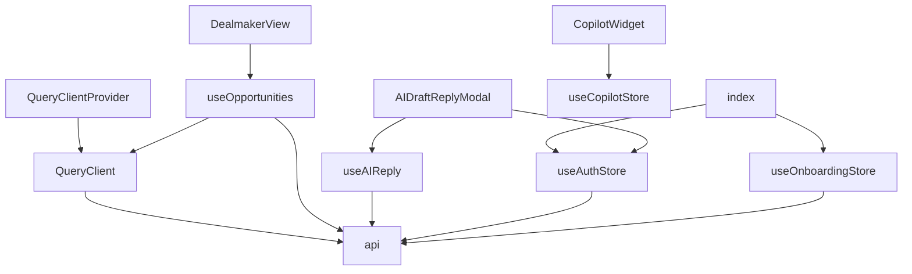

# 状态管理与数据流

<cite>
**本文档引用的文件**  
- [auth.ts](file://frontend/src/store/auth.ts)
- [onboarding.ts](file://frontend/src/store/onboarding.ts)
- [task.ts](file://frontend/src/store/task.ts)
- [opportunityStore.ts](file://frontend/src/store/opportunityStore.ts)
- [ui.ts](file://frontend/src/store/ui.ts)
- [useCopilotStore.ts](file://frontend/src/store/useCopilotStore.ts)
- [index.ts](file://frontend/src/store/index.ts)
- [useAIReply.ts](file://frontend/src/hooks/useAIReply.ts)
- [useOpportunities.ts](file://frontend/src/hooks/useOpportunities.ts)
- [QueryClientProvider.tsx](file://frontend/src/components/providers/QueryClientProvider.tsx)
- [api.ts](file://frontend/src/lib/api.ts)
- [layout.tsx](file://frontend/src/app/layout.tsx)
- [DealmakerView.tsx](file://frontend/src/components/dashboard/DealmakerView.tsx)
- [CopilotWidget.tsx](file://frontend/src/components/copilot/CopilotWidget.tsx)
- [AIDraftReplyModal.tsx](file://frontend/src/components/email/AIDraftReplyModal.tsx)
</cite>

## 目录
1. [简介](#简介)
2. [项目结构](#项目结构)
3. [核心组件](#核心组件)
4. [架构概述](#架构概述)
5. [详细组件分析](#详细组件分析)
6. [依赖分析](#依赖分析)
7. [性能考虑](#性能考虑)
8. [故障排除指南](#故障排除指南)
9. [结论](#结论)

## 简介
EchoMind 前端应用采用 Zustand 和 React Query 两种互补的状态管理方案，构建了一个高效、可维护的响应式系统。Zustand 用于管理全局持久化状态和 UI 状态，而 React Query 则专注于服务器状态的数据获取、缓存和同步。这种分层架构确保了本地状态的即时响应性和服务器状态的一致性与新鲜度。本文档将深入探讨这两种机制的设计、集成方式以及它们如何协同工作，为开发者提供清晰的应用状态管理蓝图。

## 项目结构
EchoMind 前端的状态管理代码遵循清晰的模块化结构，主要分为 `store` 和 `hooks` 两个核心目录。`store` 目录存放使用 Zustand 创建的全局状态存储，每个模块（如 auth、onboarding）拥有独立的 store 文件。`hooks` 目录则封装了业务逻辑和 API 调用，特别是基于 React Query 的自定义 Hook，为组件提供简洁的数据访问接口。

**Diagram sources**
- [frontend/src/store/auth.ts](file://frontend/src/store/auth.ts)
- [frontend/src/store/onboarding.ts](file://frontend/src/store/onboarding.ts)
- [frontend/src/store/opportunityStore.ts](file://frontend/src/store/opportunityStore.ts)
- [frontend/src/hooks/useOpportunities.ts](file://frontend/src/hooks/useOpportunities.ts)
- [frontend/src/hooks/useAIReply.ts](file://frontend/src/hooks/useAIReply.ts)
- [frontend/src/components/providers/QueryClientProvider.tsx](file://frontend/src/components/providers/QueryClientProvider.tsx)
- [frontend/src/lib/api.ts](file://frontend/src/lib/api.ts)
- [frontend/src/app/layout.tsx](file://frontend/src/app/layout.tsx)

**Section sources**
- [frontend/src/store](file://frontend/src/store)
- [frontend/src/hooks](file://frontend/src/hooks)

## 核心组件
EchoMind 的状态管理由两大核心组件构成：基于 Zustand 的全局状态存储和基于 React Query 的数据获取层。`useAuthStore` 和 `useOnboardingStore` 等 Zustand store 负责管理用户认证、引导流程等需要持久化和跨组件共享的状态。`useOpportunities` 和 `useAIReply` 等自定义 Hook 则利用 React Query 管理从后端 API 获取的动态数据，自动处理加载、错误、缓存和后台同步。`QueryClientProvider` 作为 React Query 的根组件，为整个应用提供查询客户端实例。

**Section sources**
- [frontend/src/store/auth.ts](file://frontend/src/store/auth.ts#L1-L68)
- [frontend/src/store/onboarding.ts](file://frontend/src/store/onboarding.ts#L1-L55)
- [frontend/src/hooks/useOpportunities.ts](file://frontend/src/hooks/useOpportunities.ts#L1-L92)
- [frontend/src/hooks/useAIReply.ts](file://frontend/src/hooks/useAIReply.ts#L1-L33)

## 架构概述
EchoMind 的状态管理架构采用分层设计，清晰地分离了客户端状态和服务器状态。在客户端，Zustand store 作为单一状态树，通过 `create` 和 `persist` 中间件实现状态的创建和持久化。在服务器端，React Query 作为数据同步引擎，通过 `useQuery` 和 `useMutation` 等 Hook 管理数据的生命周期。`api.ts` 文件中的 Axios 实例作为统一的 API 客户端，被 Zustand store 和 React Query Hook 共同使用，确保了请求的一致性。`QueryClientProvider` 在应用根组件中被注入，使得所有子组件都能访问到查询功能。

**Diagram sources**
- [frontend/src/store/auth.ts](file://frontend/src/store/auth.ts)
- [frontend/src/store/onboarding.ts](file://frontend/src/store/onboarding.ts)
- [frontend/src/store/ui.ts](file://frontend/src/store/ui.ts)
- [frontend/src/store/useCopilotStore.ts](file://frontend/src/store/useCopilotStore.ts)
- [frontend/src/hooks/useOpportunities.ts](file://frontend/src/hooks/useOpportunities.ts)
- [frontend/src/hooks/useAIReply.ts](file://frontend/src/hooks/useAIReply.ts)
- [frontend/src/lib/api.ts](file://frontend/src/lib/api.ts)
- [frontend/src/components/providers/QueryClientProvider.tsx](file://frontend/src/components/providers/QueryClientProvider.tsx)

## 详细组件分析
本节将深入分析 EchoMind 中关键的状态管理组件，包括 Zustand store 的设计、自定义 Hook 的实现以及它们在实际组件中的应用。

### Zustand Store 分析
EchoMind 使用 Zustand 创建了多个模块化的 store，每个 store 负责管理特定领域的状态。这些 store 通过 `create` 函数定义，并利用 `persist` 中间件实现状态的持久化，确保页面刷新后状态不丢失。

#### 认证状态管理
`useAuthStore` 是应用的核心 store 之一，负责管理用户的登录状态、令牌和用户信息。它通过 `persist` 中间件将状态存储在 `localStorage` 中，键名为 `auth-storage`。该 store 不仅包含状态数据（如 `user`、`token`），还封装了登录、注册和登出等业务逻辑，直接调用 `api` 客户端与后端交互。

**Diagram sources**
- [frontend/src/store/auth.ts](file://frontend/src/store/auth.ts#L1-L68)

**Section sources**
- [frontend/src/store/auth.ts](file://frontend/src/store/auth.ts#L1-L68)

#### 引导流程状态管理
`useOnboardingStore` 专门用于管理新用户的引导流程。它跟踪用户当前所处的步骤（`step`）、选择的角色（`role`）以及邮箱配置信息。该 store 的状态是临时的，不需要持久化，因此没有使用 `persist` 中间件。它提供了一系列动作（如 `setStep`、`setRole`、`setMailboxConfig`）来更新状态，并通过 `resetOnboarding` 方法在流程结束后重置所有状态。

**Diagram sources**
- [frontend/src/store/onboarding.ts](file://frontend/src/store/onboarding.ts#L1-L55)

**Section sources**
- [frontend/src/store/onboarding.ts](file://frontend/src/store/onboarding.ts#L1-L55)

### React Query 数据获取分析
React Query 在 EchoMind 中扮演着数据同步中枢的角色，其 `QueryClientProvider` 为整个应用提供了数据管理能力。

#### 数据获取与缓存机制
`useOpportunities` 是一个典型的 React Query 自定义 Hook，它封装了获取商机列表的逻辑。通过 `useQuery`，它定义了一个查询键 `['opportunities', filters]`，React Query 会根据这个键自动缓存数据。`staleTime` 设置为 5 分钟，意味着在此期间内，后续的查询将直接从缓存返回，不会发起新的网络请求。`refetchInterval` 设置为 2 分钟，确保数据在后台定期刷新，保持新鲜度。

**Diagram sources**
- [frontend/src/hooks/useOpportunities.ts](file://frontend/src/hooks/useOpportunities.ts#L1-L27)
- [frontend/src/components/dashboard/DealmakerView.tsx](file://frontend/src/components/dashboard/DealmakerView.tsx#L1-L150)

**Section sources**
- [frontend/src/hooks/useOpportunities.ts](file://frontend/src/hooks/useOpportunities.ts#L1-L27)

#### 数据更新与同步机制
当需要修改服务器数据时，React Query 的 `useMutation` Hook 确保了本地状态与服务器状态的同步。以 `useCreateOpportunity` 为例，当 `onSuccess` 回调被触发时，它会调用 `queryClient.invalidateQueries` 使 `opportunities` 查询失效，从而触发组件重新获取最新数据。同时，`setQueryData` 方法会立即更新缓存中的数据，实现乐观更新，提升用户体验。

**Diagram sources**
- [frontend/src/hooks/useOpportunities.ts](file://frontend/src/hooks/useOpportunities.ts#L41-L57)
- [frontend/src/components/dashboard/DealmakerView.tsx](file://frontend/src/components/dashboard/DealmakerView.tsx#L1-L150)

**Section sources**
- [frontend/src/hooks/useOpportunities.ts](file://frontend/src/hooks/useOpportunities.ts#L41-L57)

### 自定义 Hook 封装分析
自定义 Hook 是 EchoMind 实现逻辑复用和关注点分离的关键。

#### useAIReply Hook
`useAIReply` Hook 封装了调用 AI 生成邮件回复的业务逻辑。它使用 `useMutation` 来处理这个可能失败的异步操作。`mutationFn` 定义了实际的 API 调用，而 `onSuccess` 和 `onError` 回调则处理成功和失败的情况，通常用于日志记录或用户通知。组件通过调用 `mutate` 函数来触发这个操作。

**Diagram sources**
- [frontend/src/hooks/useAIReply.ts](file://frontend/src/hooks/useAIReply.ts#L1-L33)
- [frontend/src/components/email/AIDraftReplyModal.tsx](file://frontend/src/components/email/AIDraftReplyModal.tsx#L1-L230)

**Section sources**
- [frontend/src/hooks/useAIReply.ts](file://frontend/src/hooks/useAIReply.ts#L1-L33)

## 依赖分析
EchoMind 的状态管理组件之间存在清晰的依赖关系。`QueryClientProvider` 位于依赖链的顶端，为所有使用 React Query 的 Hook 提供服务。`api.ts` 是底层依赖，被 Zustand store 和 React Query Hook 共同依赖，负责处理所有网络请求。Zustand store 之间通过 `index.ts` 文件进行聚合和导出，方便在应用的其他地方统一导入。UI 组件则直接依赖于具体的 store 或 Hook 来获取所需的状态。

**Diagram sources**
- [frontend/src/components/providers/QueryClientProvider.tsx](file://frontend/src/components/providers/QueryClientProvider.tsx)
- [frontend/src/lib/api.ts](file://frontend/src/lib/api.ts)
- [frontend/src/store/index.ts](file://frontend/src/store/index.ts)
- [frontend/src/store/auth.ts](file://frontend/src/store/auth.ts)
- [frontend/src/store/onboarding.ts](file://frontend/src/store/onboarding.ts)
- [frontend/src/hooks/useOpportunities.ts](file://frontend/src/hooks/useOpportunities.ts)
- [frontend/src/hooks/useAIReply.ts](file://frontend/src/hooks/useAIReply.ts)
- [frontend/src/components/dashboard/DealmakerView.tsx](file://frontend/src/components/dashboard/DealmakerView.tsx)
- [frontend/src/components/copilot/CopilotWidget.tsx](file://frontend/src/components/copilot/CopilotWidget.tsx)
- [frontend/src/components/email/AIDraftReplyModal.tsx](file://frontend/src/components/email/AIDraftReplyModal.tsx)

**Section sources**
- [frontend/src/lib/api.ts](file://frontend/src/lib/api.ts)
- [frontend/src/store/index.ts](file://frontend/src/store/index.ts)

## 性能考虑
EchoMind 的状态管理设计充分考虑了性能。Zustand 的原子化更新确保了只有订阅了特定状态的组件才会重新渲染。React Query 的智能缓存机制极大地减少了不必要的网络请求，`staleTime` 和 `refetchInterval` 的合理配置平衡了数据新鲜度和性能。`QueryClientProvider` 在 `layout.tsx` 中被尽早注入，确保了应用启动时数据获取层就绪。对于大型列表，应考虑实现分页和虚拟滚动，以避免一次性渲染过多 DOM 节点。

## 故障排除指南
*   **状态未持久化**：检查 Zustand store 是否正确使用了 `persist` 中间件，并确认 `name` 选项的值是唯一的。
*   **数据未更新**：检查 React Query 的 `queryKey` 是否正确，确保 `invalidateQueries` 调用的键与 `useQuery` 的键匹配。检查网络请求是否成功。
*   **组件未重新渲染**：确认组件是否正确地从 store 或 Hook 中读取了状态。检查 Zustand 的选择器（selector）是否正确。
*   **API 请求 401 错误**：`api.ts` 中的响应拦截器会自动处理 401 错误并调用 `logout`。检查 `useAuthStore` 的 `token` 状态是否正确。
*   **查询客户端未定义**：确保 `QueryClientProvider` 已在应用的根组件或足够高的层级被渲染。

**Section sources**
- [frontend/src/lib/api.ts](file://frontend/src/lib/api.ts#L29-L39)
- [frontend/src/components/providers/QueryClientProvider.tsx](file://frontend/src/components/providers/QueryClientProvider.tsx)

## 结论
EchoMind 通过结合 Zustand 和 React Query，构建了一个强大且灵活的状态管理解决方案。Zustand 以其简洁的 API 和中间件生态，完美地管理了应用的全局客户端状态和 UI 状态。React Query 则作为服务器状态的权威来源，自动化了数据获取、缓存、同步和更新的复杂性。这种组合使得开发者可以专注于业务逻辑的实现，而无需担心状态一致性、网络请求优化和用户体验等底层细节，是现代 React 应用状态管理的一个优秀实践范例。