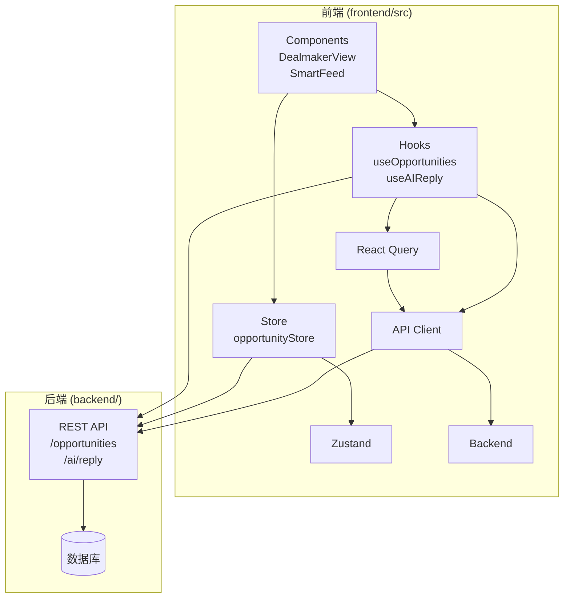
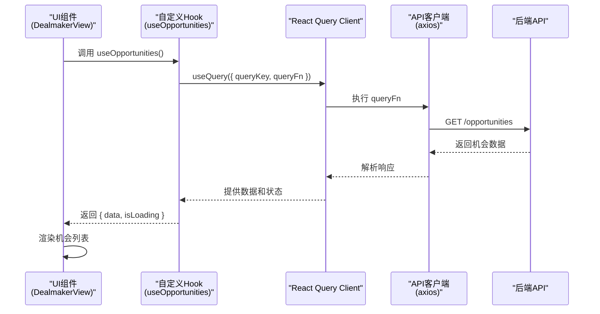
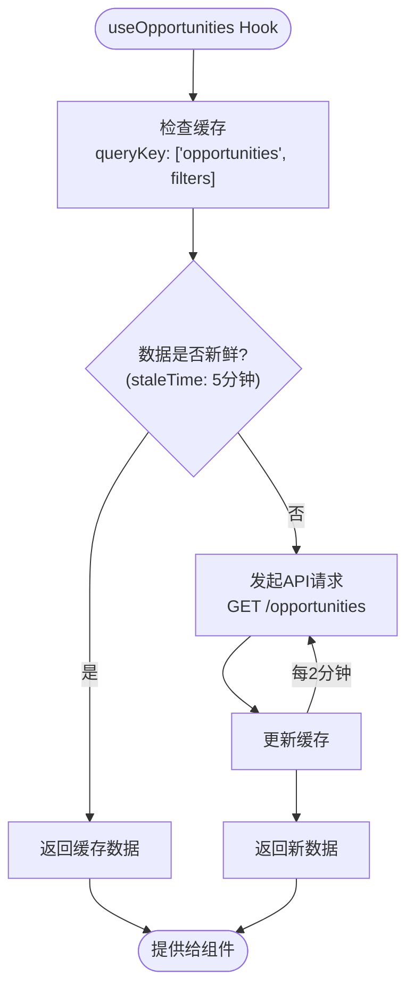
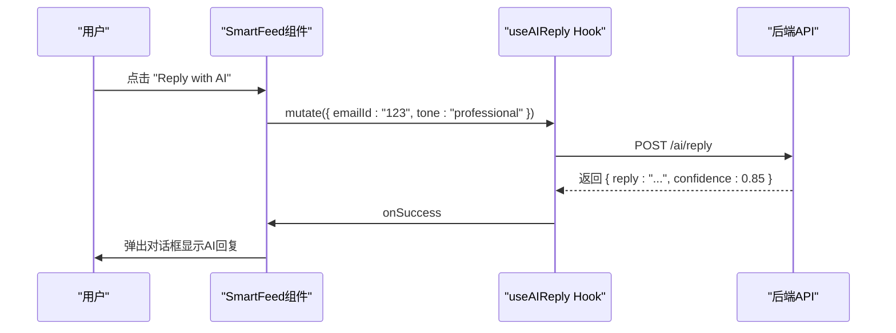
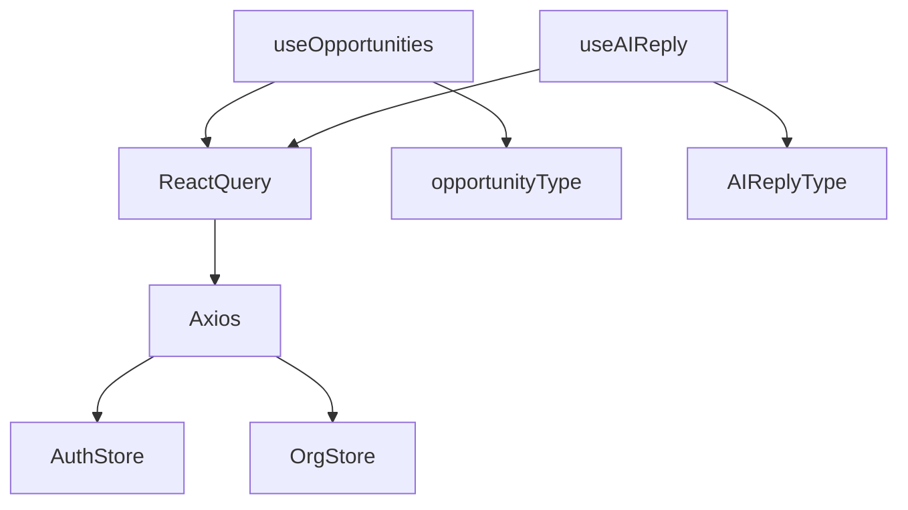

# 自定义Hook与业务逻辑

<cite>
**本文档引用的文件**  
- [useOpportunities.ts](file://frontend/src/hooks/useOpportunities.ts)
- [useAIReply.ts](file://frontend/src/hooks/useAIReply.ts)
- [opportunityStore.ts](file://frontend/src/store/opportunityStore.ts)
- [QueryClientProvider.tsx](file://frontend/src/components/providers/QueryClientProvider.tsx)
- [DealmakerView.tsx](file://frontend/src/components/dashboard/DealmakerView.tsx)
- [SmartFeed.tsx](file://frontend/src/components/dashboard/SmartFeed.tsx)
- [api.ts](file://frontend/src/lib/api.ts)
- [opportunity.ts](file://frontend/src/types/opportunity.ts)
</cite>

## 目录
1. [简介](#简介)
2. [项目结构](#项目结构)
3. [核心组件](#核心组件)
4. [架构概述](#架构概述)
5. [详细组件分析](#详细组件分析)
6. [依赖分析](#依赖分析)
7. [性能考虑](#性能考虑)
8. [故障排除指南](#故障排除指南)
9. [结论](#结论)

## 简介
本文档深入解析 `echomind` 项目中关键的自定义 React Hook，重点分析 `useOpportunities` 和 `useAIReply` 的实现机制。这些 Hook 封装了复杂的业务逻辑和 API 交互，为 UI 组件提供了简洁、可复用的状态管理接口。文档将详细阐述这些 Hook 如何利用 React Query 进行数据获取、缓存管理、自动刷新和突变操作，并与 Zustand store 的关系进行对比，最后提供实际调用示例和最佳实践。

## 项目结构
本项目采用典型的前后端分离架构。前端位于 `frontend/` 目录，使用 Next.js 框架。核心业务逻辑相关的代码主要分布在：
- `frontend/src/hooks/`: 存放所有自定义 Hook，如 `useOpportunities.ts` 和 `useAIReply.ts`。
- `frontend/src/store/`: 使用 Zustand 管理全局状态，如 `opportunityStore.ts`。
- `frontend/src/lib/api/`: 封装了与后端 API 交互的函数。
- `frontend/src/components/`: 包含使用这些 Hook 的 UI 组件。

**Diagram sources**
- [useOpportunities.ts](file://frontend/src/hooks/useOpportunities.ts)
- [useAIReply.ts](file://frontend/src/hooks/useAIReply.ts)
- [opportunityStore.ts](file://frontend/src/store/opportunityStore.ts)
- [DealmakerView.tsx](file://frontend/src/components/dashboard/DealmakerView.tsx)
- [SmartFeed.tsx](file://frontend/src/components/dashboard/SmartFeed.tsx)

**Section sources**
- [useOpportunities.ts](file://frontend/src/hooks/useOpportunities.ts)
- [useAIReply.ts](file://frontend/src/hooks/useAIReply.ts)
- [opportunityStore.ts](file://frontend/src/store/opportunityStore.ts)

## 核心组件
核心组件是 `useOpportunities` 和 `useAIReply` 这两个自定义 Hook。`useOpportunities` 负责管理销售机会（Opportunity）的全生命周期，包括查询、创建、更新和删除。它利用 React Query 的强大功能，实现了数据的自动缓存、去重、后台刷新和突变后的缓存更新。`useAIReply` 则专注于与 AI 服务的交互，通过调用后端 API 为指定邮件生成智能回复草稿。这两个 Hook 都将复杂的异步逻辑和状态管理从 UI 组件中剥离，极大地简化了组件的实现。

**Section sources**
- [useOpportunities.ts](file://frontend/src/hooks/useOpportunities.ts)
- [useAIReply.ts](file://frontend/src/hooks/useAIReply.ts)

## 架构概述
系统的数据流架构清晰。UI 组件通过调用自定义 Hook 来获取数据或触发操作。Hook 内部使用 React Query 的 `useQuery` 和 `useMutation` 来管理异步状态。React Query 会通过 `api` 客户端（基于 Axios）向后端发起 HTTP 请求。请求拦截器会自动注入认证令牌和组织 ID。后端处理请求后返回数据，React Query 将数据缓存到内存中，并更新 UI 组件的状态。对于突变操作（如创建、更新），Hook 的 `onSuccess` 回调会利用 `queryClient` 来更新或使缓存失效，确保 UI 能够实时反映数据变化。

**Diagram sources**
- [useOpportunities.ts](file://frontend/src/hooks/useOpportunities.ts)
- [DealmakerView.tsx](file://frontend/src/components/dashboard/DealmakerView.tsx)
- [api.ts](file://frontend/src/lib/api.ts)

## 详细组件分析
本节将对 `useOpportunities` 和 `useAIReply` 两个核心 Hook 进行深入分析。

### useOpportunities 分析
`useOpportunities` Hook 是一个功能完备的数据访问层，它将对 "机会" 资源的 CRUD 操作封装成一组易于使用的 React Hook。

#### 查询功能
该 Hook 提供了两个查询函数：`useOpportunities` 用于获取机会列表，`useOpportunity` 用于获取单个机会详情。
- **查询键 (queryKey)**: `['opportunities', filters]` 和 `['opportunity', id]`。查询键是 React Query 的核心概念，它唯一标识一个查询。当查询键变化时，React Query 会自动发起新的请求。使用 `filters` 对象作为键的一部分，可以确保不同的筛选条件会触发独立的缓存。
- **请求函数 (queryFn)**: 使用 `api.get` 方法发起 HTTP GET 请求。`queryFn` 是一个异步函数，负责实际的数据获取。
- **缓存策略 (staleTime)**: 设置为 5 分钟（`5 * 60 * 1000`）。这意味着数据在 5 分钟内被视为“新鲜”，组件重新渲染时会直接从缓存读取，而不会发起网络请求，从而提升性能。
- **自动刷新 (refetchInterval)**: 设置为 2 分钟（`2 * 60 * 1000`）。这使得机会列表会每隔 2 分钟自动刷新一次，确保用户看到的是最新数据，无需手动刷新页面。

**Diagram sources**
- [useOpportunities.ts](file://frontend/src/hooks/useOpportunities.ts#L5-L26)

#### 突变功能
该 Hook 提供了 `useCreateOpportunity`、`useUpdateOpportunity` 和 `useDeleteOpportunity` 三个突变 Hook，用于创建、更新和删除机会。
- **突变函数 (mutationFn)**: 分别对应 POST、PATCH 和 DELETE 请求。
- **成功回调 (onSuccess)**: 这是实现“乐观更新”或“缓存同步”的关键。
    - `useCreateOpportunity`: 在成功创建后，调用 `queryClient.invalidateQueries({ queryKey: ['opportunities'] })` 使机会列表的缓存失效，触发列表的重新获取。同时，使用 `queryClient.setQueryData(['opportunity', newOpportunity.id], newOpportunity)` 将新创建的机会直接写入单个机会的缓存中，这样如果用户立即查看该机会的详情页，就能立刻看到数据，无需等待网络请求。
    - `useUpdateOpportunity` 和 `useDeleteOpportunity`: 逻辑类似，更新或删除后都会使列表缓存失效。`useDeleteOpportunity` 还会调用 `queryClient.removeQueries({ queryKey: ['opportunity', id] })` 来清除已删除机会的缓存，避免内存泄漏。
- **错误处理 (onError)**: 在 `onError` 回调中，将错误信息输出到控制台，便于开发和调试。

**Section sources**
- [useOpportunities.ts](file://frontend/src/hooks/useOpportunities.ts#L41-L92)

### useAIReply 分析
`useAIReply` Hook 专注于与 AI 服务的交互，其设计更为简洁。

#### 功能实现
- **突变函数 (mutationFn)**: 调用 `api.post('/ai/reply', requestData)` 向后端 `/ai/reply` 端点发送请求，生成 AI 回复。
- **请求参数**: `AIReplyRequest` 接口定义了 `emailId`（必填）、`tone`（语气）和 `context`（上下文）等参数，允许用户定制回复风格。
- **响应数据**: `AIReplyResponse` 接口包含 `reply`（回复内容）和 `confidence`（置信度）。
- **成功回调 (onSuccess)**: 在控制台记录成功信息，包括回复长度和置信度，用于监控和调试。
- **错误处理 (onError)**: 将错误信息输出到控制台。

#### 与组件的集成
在 `SmartFeed` 组件中，`useAIReply` 被用来为高优先级邮件生成智能回复。当用户点击“Reply with AI”按钮时，会调用 `mutate` 函数。组件通过 `isPending` 状态显示加载动画，并在成功后弹出一个对话框展示 AI 生成的回复和其置信度。

**Diagram sources**
- [useAIReply.ts](file://frontend/src/hooks/useAIReply.ts)
- [SmartFeed.tsx](file://frontend/src/components/dashboard/SmartFeed.tsx#L67-L95)

**Section sources**
- [useAIReply.ts](file://frontend/src/hooks/useAIReply.ts)
- [SmartFeed.tsx](file://frontend/src/components/dashboard/SmartFeed.tsx)

### 与 Zustand Store 的协同
项目中同时存在 `useOpportunities` Hook 和 `opportunityStore.ts`。`useOpportunities` 是当前推荐的、基于 React Query 的现代化数据获取方式。相比之下，`opportunityStore` 使用传统的 `fetch` API 和 Zustand 手动管理状态、加载和错误，代码更为冗长，且缺乏 React Query 提供的内置缓存、自动刷新和智能重试等高级功能。这表明项目正处于从传统状态管理向 React Query 迁移的过程中。`useOpportunities` 不仅可以作为 `opportunityStore` 的替代方案，而且是更优的选择，因为它减少了样板代码，提高了数据一致性和用户体验。

**Section sources**
- [useOpportunities.ts](file://frontend/src/hooks/useOpportunities.ts)
- [opportunityStore.ts](file://frontend/src/store/opportunityStore.ts)

## 依赖分析
`useOpportunities` 和 `useAIReply` 依赖于多个核心库和模块。
- **React Query**: 提供了 `useQuery` 和 `useMutation`，是这些 Hook 的基础。
- **Axios**: 通过 `api` 客户端进行 HTTP 通信。
- **Zustand**: 虽然 Hook 本身不直接依赖 Zustand，但 `api` 客户端的拦截器会从 `authStore` 和 `organizationStore` 中读取认证和组织信息，形成了间接依赖。
- **TypeScript**: 定义了 `Opportunity`、`AIReplyRequest` 等类型，确保了类型安全。

**Diagram sources**
- [useOpportunities.ts](file://frontend/src/hooks/useOpportunities.ts)
- [useAIReply.ts](file://frontend/src/hooks/useAIReply.ts)
- [api.ts](file://frontend/src/lib/api.ts)
- [opportunity.ts](file://frontend/src/types/opportunity.ts)

## 性能考虑
`useOpportunities` Hook 的设计充分考虑了性能。
- **缓存 (staleTime)**: 5分钟的缓存时间减少了不必要的网络请求。
- **自动刷新 (refetchInterval)**: 2分钟的后台刷新确保了数据的实时性，同时避免了过于频繁的请求。
- **智能缓存更新**: 通过 `invalidateQueries` 和 `setQueryData`，在突变后精确地更新缓存，避免了全量数据的重新获取，提升了响应速度。
- **代码分割**: 自定义 Hook 实现了逻辑的复用和关注点分离，使 UI 组件更轻量，更易于维护。

## 故障排除指南
- **Hook 未返回数据**: 检查 `queryKey` 是否正确，确保 `filters` 对象的结构与后端 API 期望的一致。
- **突变操作失败**: 查看浏览器控制台的错误日志。`onError` 回调会输出错误信息。检查网络请求的 payload 和响应状态码。
- **缓存未更新**: 确认 `onSuccess` 回调中的 `queryClient` 方法调用是否正确，特别是 `queryKey` 的拼写和参数。
- **AI 回复生成慢**: 这可能是后端 AI 模型处理时间较长所致，属于正常现象。前端通过 `isPending` 状态提供了加载反馈。

**Section sources**
- [useOpportunities.ts](file://frontend/src/hooks/useOpportunities.ts)
- [useAIReply.ts](file://frontend/src/hooks/useAIReply.ts)

## 结论
`useOpportunities` 和 `useAIReply` 是 `echomind` 项目中优秀的自定义 Hook 实践。它们利用 React Query 的强大功能，将复杂的业务逻辑和 API 交互封装起来，为 UI 组件提供了简洁、声明式的接口。`useOpportunities` 通过查询键、缓存策略和突变后的缓存更新机制，实现了高效、实时的数据管理。`useAIReply` 则简化了与 AI 服务的交互流程。这些 Hook 不仅提升了代码的可复用性和可维护性，也显著改善了用户体验。建议在新功能开发中优先采用这种基于 React Query 的 Hook 模式，逐步替代传统的 Zustand 手动状态管理方式。