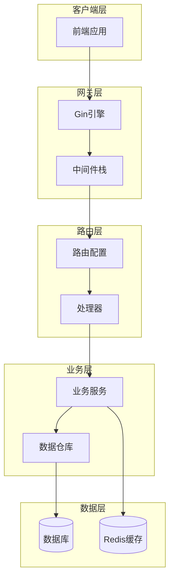
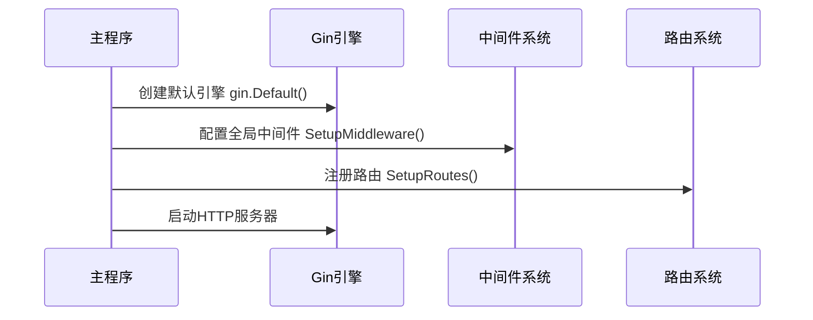
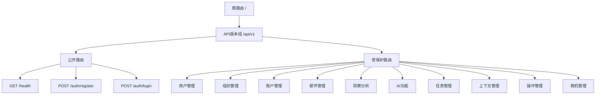
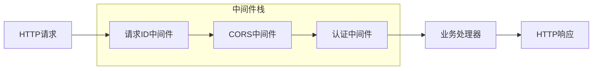
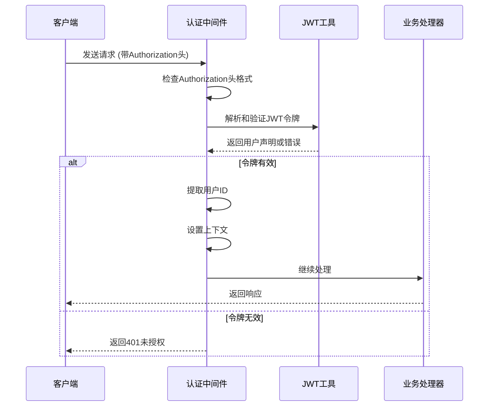
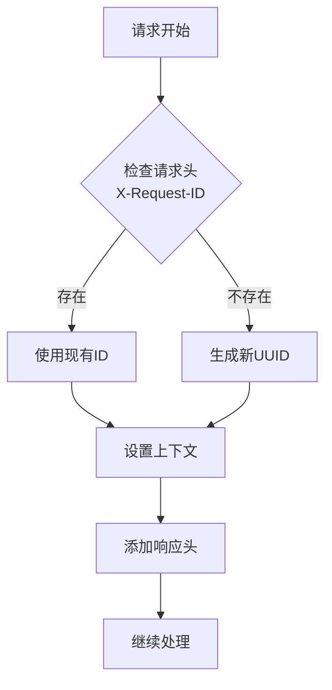
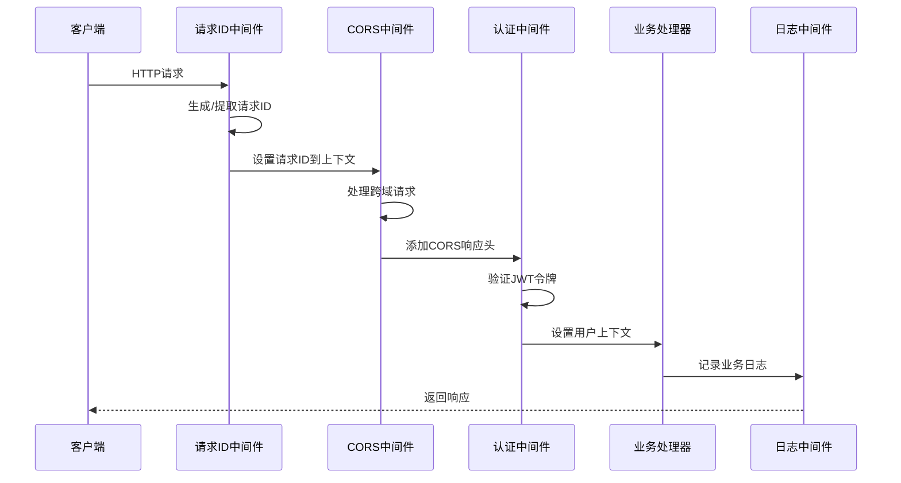

# API路由与中间件

<cite>
**本文档中引用的文件**
- [main.go](file://backend/cmd/main.go)
- [routes.go](file://backend/internal/router/routes.go)
- [middleware.go](file://backend/internal/router/middleware.go)
- [auth.go](file://backend/internal/middleware/auth.go)
- [request_id.go](file://backend/internal/middleware/request_id.go)
- [app_config.go](file://backend/configs/app_config.go)
- [jwt.go](file://backend/pkg/utils/jwt.go)
- [auth.go](file://backend/internal/handler/auth.go)
- [search.go](file://backend/internal/handler/search.go)
</cite>

## 目录
1. [简介](#简介)
2. [项目架构概览](#项目架构概览)
3. [Gin引擎初始化与配置](#gin引擎初始化与配置)
4. [路由系统详解](#路由系统详解)
5. [中间件系统](#中间件系统)
6. [JWT认证中间件](#jwt认证中间件)
7. [请求ID中间件](#请求id中间件)
8. [中间件执行顺序与流程](#中间件执行顺序与流程)
9. [API端点分类](#api端点分类)
10. [添加新路由指南](#添加新路由指南)
11. [自定义中间件开发](#自定义中间件开发)
12. [最佳实践与故障排除](#最佳实践与故障排除)

## 简介

本项目采用基于Gin框架的现代化Web应用架构，提供了完整的API路由管理和中间件系统。该系统通过清晰的分层设计，实现了高效的请求处理流程，支持公开API和受保护API的分离管理，并提供了强大的安全机制和可观测性功能。

## 项目架构概览

系统采用分层架构设计，主要包含以下核心组件：



**图表来源**
- [main.go](file://backend/cmd/main.go#L85-L108)
- [routes.go](file://backend/internal/router/routes.go#L26-L98)

## Gin引擎初始化与配置

### 引擎创建与基础配置

系统在[`main.go`](file://backend/cmd/main.go#L85-L88)中创建Gin引擎并进行基础配置：



**图表来源**
- [main.go](file://backend/cmd/main.go#L85-L108)

### 中间件配置流程

中间件配置通过[`SetupMiddleware`](file://backend/internal/router/middleware.go#L15-L43)函数完成：

1. **环境模式设置**：根据生产环境配置Gin运行模式
2. **代理信任配置**：设置可信代理以正确解析客户端IP
3. **CORS配置**：允许跨域请求，支持开发环境的本地调试
4. **请求ID中间件**：为每个请求生成唯一标识符

**章节来源**
- [main.go](file://backend/cmd/main.go#L85-L108)
- [middleware.go](file://backend/internal/router/middleware.go#L15-L43)

## 路由系统详解

### 路由组织结构

路由系统通过[`SetupRoutes`](file://backend/internal/router/routes.go#L26-L98)函数统一管理所有API端点：



**图表来源**
- [routes.go](file://backend/internal/router/routes.go#L26-L98)

### 路由分组策略

系统采用明确的路由分组策略：

1. **公开路由**：无需认证即可访问的基础API
2. **受保护路由**：需要JWT认证的业务API
3. **版本控制**：统一使用`/api/v1`作为版本前缀

**章节来源**
- [routes.go](file://backend/internal/router/routes.go#L26-L98)

## 中间件系统

### 中间件架构设计

中间件系统采用链式调用模式，每个中间件负责特定的功能：



**图表来源**
- [middleware.go](file://backend/internal/router/middleware.go#L15-L43)

### 核心中间件类型

| 中间件类型 | 功能描述 | 执行位置 | 配置参数 |
|-----------|----------|----------|----------|
| 请求ID中间件 | 生成唯一请求标识符 | 全局 | 自动UUID生成 |
| CORS中间件 | 处理跨域资源共享 | 全局 | 源域名、方法、头部 |
| 认证中间件 | JWT令牌验证 | 受保护路由 | JWT密钥、过期时间 |

**章节来源**
- [middleware.go](file://backend/internal/router/middleware.go#L15-L43)
- [request_id.go](file://backend/internal/middleware/request_id.go#L15-L46)

## JWT认证中间件

### 认证流程设计

JWT认证中间件实现了完整的身份验证流程：



**图表来源**
- [auth.go](file://backend/internal/middleware/auth.go#L18-L46)

### JWT配置与安全

认证中间件依赖于[`JWTConfig`](file://backend/configs/app_config.go#L22-L25)配置：

- **密钥管理**：使用环境变量或配置文件存储JWT密钥
- **过期时间**：可配置的令牌有效期
- **签名算法**：采用HS256对称加密算法

### 用户上下文提取

系统提供了专门的辅助函数[`GetUserIDFromContext`](file://backend/internal/middleware/auth.go#L50-L60)用于从Gin上下文中提取用户信息。

**章节来源**
- [auth.go](file://backend/internal/middleware/auth.go#L18-L60)
- [jwt.go](file://backend/pkg/utils/jwt.go#L15-L52)

## 请求ID中间件

### 请求追踪机制

请求ID中间件为每个HTTP请求生成唯一的追踪标识：



**图表来源**
- [request_id.go](file://backend/internal/middleware/request_id.go#L15-L33)

### 上下文传递机制

请求ID通过Gin上下文在中间件链中传递：

- **存储键名**：`ContextRequestIDKey`
- **响应头**：`X-Request-ID`
- **提取函数**：`GetRequestIDFromContext`

这种设计使得日志记录、错误追踪和性能监控能够基于统一的请求标识符进行关联分析。

**章节来源**
- [request_id.go](file://backend/internal/middleware/request_id.go#L15-L46)

## 中间件执行顺序与流程

### 执行时序图



**图表来源**
- [middleware.go](file://backend/internal/router/middleware.go#L26-L37)
- [main.go](file://backend/cmd/main.go#L85-L108)

### 中间件优先级规则

1. **全局中间件**：按注册顺序执行
2. **路由组中间件**：在路由组内按注册顺序执行
3. **处理器中间件**：在具体路由处理器上单独配置

**章节来源**
- [middleware.go](file://backend/internal/router/middleware.go#L15-L43)

## API端点分类

### 公开API端点

| 端点路径 | HTTP方法 | 功能描述 | 认证要求 |
|---------|----------|----------|----------|
| `/api/v1/health` | GET | 健康检查 | ❌ 无 |
| `/api/v1/auth/register` | POST | 用户注册 | ❌ 无 |
| `/api/v1/auth/login` | POST | 用户登录 | ❌ 无 |

### 受保护API端点

#### 用户管理
- `PATCH /api/v1/users/me` - 更新当前用户资料

#### 组织管理
- `POST /api/v1/orgs` - 创建组织
- `GET /api/v1/orgs` - 获取组织列表
- `GET /api/v1/orgs/:id` - 获取指定组织详情
- `GET /api/v1/orgs/:id/members` - 获取组织成员

#### 账户管理
- `POST /api/v1/settings/account` - 连接并保存账户
- `GET /api/v1/settings/account` - 获取账户状态
- `DELETE /api/v1/settings/account` - 断开账户连接
- `POST /api/v1/sync` - 同步邮件

#### 邮件与洞察
- `GET /api/v1/emails` - 列出邮件
- `GET /api/v1/emails/:id` - 获取邮件详情
- `DELETE /api/v1/emails/all` - 删除所有邮件
- `GET /api/v1/insights/network` - 获取网络图

#### 仪表板洞察
- `GET /api/v1/insights/manager/stats` - 管理员统计
- `GET /api/v1/insights/executive/overview` - 执行官概览
- `GET /api/v1/insights/risks` - 风险分析
- `GET /api/v1/insights/trends` - 趋势分析
- `GET /api/v1/insights/dealmaker/radar` - 商机雷达

#### AI与搜索
- `POST /api/v1/ai/draft` - 生成草稿
- `POST /api/v1/ai/reply` - 生成回复
- `GET /api/v1/search` - 搜索功能
- `POST /api/v1/chat/completions` - 流式聊天

#### 任务管理
- `POST /api/v1/tasks` - 创建任务
- `GET /api/v1/tasks` - 列出任务
- `PATCH /api/v1/tasks/:id` - 更新任务
- `PATCH /api/v1/tasks/:id/status` - 更新任务状态
- `DELETE /api/v1/tasks/:id` - 删除任务

#### 上下文管理
- `POST /api/v1/contexts` - 创建上下文
- `GET /api/v1/contexts` - 列出上下文
- `PATCH /api/v1/contexts/:id` - 更新上下文
- `DELETE /api/v1/contexts/:id` - 删除上下文

#### 操作管理
- `POST /api/v1/actions/approve` - 批准邮件
- `POST /api/v1/actions/snooze` - 推迟邮件
- `POST /api/v1/actions/dismiss` - 忽略邮件

#### 商机管理
- `POST /api/v1/opportunities` - 创建商机
- `GET /api/v1/opportunities` - 列出商机
- `GET /api/v1/opportunities/:id` - 获取商机详情
- `PATCH /api/v1/opportunities/:id` - 更新商机
- `DELETE /api/v1/opportunities/:id` - 删除商机

**章节来源**
- [routes.go](file://backend/internal/router/routes.go#L30-L96)

## 添加新路由指南

### 步骤1：更新处理器结构

在[`Handlers`](file://backend/internal/router/routes.go#L8-L24)结构体中添加新的处理器字段：

```go
type Handlers struct {
    // ... 现有字段
    NewFeature *handler.NewFeatureHandler
}
```

### 步骤2：创建处理器实例

在[`main.go`](file://backend/cmd/main.go#L70-L83)中初始化新的处理器：

```go
newFeatureHandler := handler.NewNewFeatureHandler(serviceInstance)
```

### 步骤3：注册处理器到Handlers结构体

```go
handlers := &router.Handlers{
    // ... 现有处理器
    NewFeature: newFeatureHandler,
}
```

### 步骤4：添加路由配置

在[`SetupRoutes`](file://backend/internal/router/routes.go#L26-L98)函数中添加新的路由：

```go
// 新功能路由
protected.POST("/new-feature", h.NewFeature.CreateResource)
protected.GET("/new-feature", h.NewFeature.ListResources)
protected.GET("/new-feature/:id", h.NewFeature.GetResource)
protected.PATCH("/new-feature/:id", h.NewFeature.UpdateResource)
protected.DELETE("/new-feature/:id", h.NewFeature.DeleteResource)
```

### 步骤5：实现处理器逻辑

创建对应的处理器方法，确保正确处理请求参数和返回响应。

**章节来源**
- [routes.go](file://backend/internal/router/routes.go#L8-L24)
- [main.go](file://backend/cmd/main.go#L70-L83)

## 自定义中间件开发

### 中间件开发模板

```go
package middleware

import (
    "github.com/gin-gonic/gin"
    "net/http"
)

// CustomMiddleware 自定义中间件
func CustomMiddleware() gin.HandlerFunc {
    return func(c *gin.Context) {
        // 在这里执行前置逻辑
        
        // 继续处理请求
        c.Next()
        
        // 在这里执行后置逻辑
    }
}
```

### 中间件集成步骤

1. **创建中间件函数**：实现具体的中间件逻辑
2. **注册中间件**：在[`SetupMiddleware`](file://backend/internal/router/middleware.go#L15-L43)中注册
3. **配置应用范围**：决定是全局应用还是特定路由组应用

### 最佳实践

- **单一职责**：每个中间件只负责一个特定功能
- **错误处理**：适当的错误处理和响应
- **性能考虑**：避免在中间件中执行耗时操作
- **日志记录**：适当的日志记录以便调试和监控

**章节来源**
- [middleware.go](file://backend/internal/router/middleware.go#L15-L43)

## 最佳实践与故障排除

### 性能优化建议

1. **中间件排序**：将最常用的中间件放在前面
2. **条件执行**：使用条件判断减少不必要的处理
3. **资源池化**：对于频繁创建的对象使用对象池

### 安全最佳实践

1. **输入验证**：在业务处理器中进行严格的输入验证
2. **错误信息**：避免在错误响应中泄露敏感信息
3. **CORS配置**：严格控制允许的源域名和方法

### 常见问题排查

| 问题类型 | 症状 | 可能原因 | 解决方案 |
|---------|------|----------|----------|
| 认证失败 | 401未授权错误 | JWT令牌无效或过期 | 检查令牌格式和有效期 |
| CORS错误 | 跨域请求被阻止 | CORS配置不正确 | 验证允许的源和方法 |
| 路由未找到 | 404错误 | 路由配置遗漏 | 检查路由注册代码 |
| 中间件失效 | 功能异常 | 中间件执行顺序错误 | 调整中间件注册顺序 |

### 监控与调试

1. **请求追踪**：利用请求ID中间件进行请求追踪
2. **日志记录**：在关键节点添加日志记录
3. **性能监控**：监控中间件的执行时间和资源消耗

**章节来源**
- [auth.go](file://backend/internal/middleware/auth.go#L18-L46)
- [request_id.go](file://backend/internal/middleware/request_id.go#L15-L46)