# 事件总线集成机制

<cite>
**本文档引用的文件**
- [container.go](file://backend/internal/app/container.go)
- [bus.go](file://backend/pkg/event/bus/bus.go)
- [email_events.go](file://backend/internal/event/email_events.go)
- [email_listeners.go](file://backend/internal/listener/email_listeners.go)
- [sync.go](file://backend/internal/service/sync.go)
- [analyze.go](file://backend/internal/tasks/analyze.go)
- [main.go](file://backend/cmd/main.go)
- [app.go](file://backend/internal/bootstrap/app.go)
</cite>

## 目录
1. [引言](#引言)
2. [项目结构概述](#项目结构概述)
3. [事件总线架构设计](#事件总线架构设计)
4. [依赖注入容器集成](#依赖注入容器集成)
5. [事件监听器注册机制](#事件监听器注册机制)
6. [事件驱动流程分析](#事件驱动流程分析)
7. [性能考虑与优化](#性能考虑与优化)
8. [扩展指南](#扩展指南)
9. [故障排除](#故障排除)
10. [总结](#总结)

## 引言

事件总线（EventBus）是一种强大的设计模式，它通过发布-订阅机制实现了组件间的松耦合通信。在本项目中，事件总线被深度集成到依赖注入容器中，为邮件同步、分析处理等核心业务流程提供了灵活且可扩展的事件驱动架构。

本文档详细阐述了如何在依赖注入容器中集成事件总线，包括`NewContainer`函数中创建`bus.Bus`实例的过程，以及`analysisListener`和`contactListener`两个监听器的注册和工作机制。同时，我们还将探讨事件驱动架构带来的系统优势，以及如何在容器中添加新的事件监听器。

## 项目结构概述

项目的事件总线相关组件分布在以下关键目录中：

```mermaid
graph TB
subgraph "事件总线核心组件"
A[backend/pkg/event/bus/] --> A1[bus.go - 事件总线核心实现]
end
subgraph "事件定义"
B[backend/internal/event/] --> B1[email_events.go - 邮件事件定义]
end
subgraph "监听器实现"
C[backend/internal/listener/] --> C1[email_listeners.go - 邮件监听器]
end
subgraph "服务层"
D[backend/internal/service/] --> D1[sync.go - 同步服务]
D --> D2[analyze.go - 分析任务]
end
subgraph "应用层"
E[backend/internal/app/] --> E1[container.go - 容器管理]
F[backend/cmd/] --> F1[main.go - 应用入口]
end
A1 --> B1
B1 --> C1
C1 --> D1
D1 --> E1
E1 --> F1
```



**图表来源**
- [bus.go](file://backend/pkg/event/bus/bus.go#L1-L63)
- [email_events.go](file://backend/internal/event/email_events.go#L1-L19)
- [email_listeners.go](file://backend/internal/listener/email_listeners.go#L1-L116)
- [sync.go](file://backend/internal/service/sync.go#L1-L178)
- [container.go](file://backend/internal/app/container.go#L1-L122)

## 事件总线架构设计

### 核心接口设计

事件总线采用简洁而强大的接口设计，包含三个核心接口：


**图表来源**
- [bus.go](file://backend/pkg/event/bus/bus.go#L8-L23)
- [email_events.go](file://backend/internal/event/email_events.go#L10-L18)
- [email_listeners.go](file://backend/internal/listener/email_listeners.go#L22-L116)

### 事件总线实现特点

事件总线具有以下关键特性：

1. **线程安全**：使用读写锁保护监听器列表
2. **内存存储**：基于内存的事件总线，适合单进程应用
3. **同步执行**：当前版本采用同步方式执行监听器，确保顺序一致性
4. **简单高效**：最小化复杂度，专注于核心功能

**章节来源**
- [bus.go](file://backend/pkg/event/bus/bus.go#L25-L63)

## 依赖注入容器集成

### 容器初始化流程

在`NewContainer`函数中，事件总线的集成遵循标准的依赖注入模式：


**图表来源**
- [container.go](file://backend/internal/app/container.go#L31-L85)

### 关键集成步骤

1. **创建事件总线实例**：调用`bus.New()`创建新的事件总线
2. **初始化监听器**：分别创建`AnalysisListener`和`ContactListener`
3. **注册监听器**：将监听器订阅到`EmailSyncedEventName`事件
4. **传递依赖**：将事件总线传递给需要的组件

**章节来源**
- [container.go](file://backend/internal/app/container.go#L60-L68)

## 事件监听器注册机制

### AnalysisListener分析监听器

AnalysisListener负责处理邮件分析任务的异步调度：


**图表来源**
- [email_listeners.go](file://backend/internal/listener/email_listeners.go#L35-L66)

### ContactListener联系人监听器

ContactListener负责更新邮件发送者的联系人信息：


**图表来源**
- [email_listeners.go](file://backend/internal/listener/email_listeners.go#L81-L102)

### 监听器注册表

| 监听器名称 | 处理事件 | 主要功能 | 依赖组件 |
|-----------|---------|---------|---------|
| AnalysisListener | EmailSyncedEvent | 创建邮件分析任务 | AsynqClientInterface |
| ContactListener | EmailSyncedEvent | 更新联系人信息 | ContactService |

**章节来源**
- [email_listeners.go](file://backend/internal/listener/email_listeners.go#L22-L116)

## 事件驱动流程分析

### 邮件同步事件流程

当邮件同步完成时，事件驱动的完整流程如下：


**图表来源**
- [sync.go](file://backend/internal/service/sync.go#L141-L154)
- [email_listeners.go](file://backend/internal/listener/email_listeners.go#L35-L102)

### 事件发布机制

在`SyncService.SyncEmails`方法中，事件发布的核心逻辑：


**图表来源**
- [sync.go](file://backend/internal/service/sync.go#L141-L154)

**章节来源**
- [sync.go](file://backend/internal/service/sync.go#L104-L157)

## 性能考虑与优化

### 当前实现特点

1. **同步执行**：所有监听器按顺序同步执行，确保数据一致性
2. **错误处理**：当前版本遇到错误会立即返回，可能影响其他监听器执行
3. **内存效率**：基于内存的存储，避免了网络通信开销

### 优化建议

1. **异步执行**：可以改为并发执行监听器，提高吞吐量
2. **错误隔离**：每个监听器独立执行，一个失败不影响其他
3. **持久化**：对于重要事件，可以考虑持久化存储
4. **负载均衡**：支持多个实例共享事件总线

### 扩展性考虑

事件总线的设计充分考虑了未来的扩展需求：

- 支持多种事件类型的订阅
- 监听器可以独立开发和部署
- 事件格式标准化，便于版本演进

## 扩展指南

### 添加新的事件监听器

要在容器中添加新的事件监听器，请按照以下步骤操作：

#### 步骤1：定义事件类型

```go
// 在backend/internal/event/目录下创建新的事件文件
const NewEventType = "new.event.type"

type NewEvent struct {
    UserID uuid.UUID
    Data   string
}

func (e NewEvent) Name() string {
    return NewEventType
}
```

#### 步骤2：实现监听器

```go
// 在backend/internal/listener/目录下创建监听器
type NewEventListener struct {
    service *SomeService
    logger  CompatibleLogger
}

func NewNewEventListener(service *SomeService, logger echologger.Logger) *NewEventListener {
    return &NewEventListener{
        service: service,
        logger:  echologger.AsZapSugaredLogger(logger),
    }
}

func (l *NewEventListener) Handle(ctx context.Context, e bus.Event) error {
    evt, ok := e.(NewEvent)
    if !ok {
        return fmt.Errorf("invalid event type: %T", e)
    }
    
    // 处理事件逻辑
    return l.service.ProcessNewEvent(ctx, evt.UserID, evt.Data)
}
```

#### 步骤3：在容器中注册

```go
// 在NewContainer函数中添加
newListener := listener.NewNewEventListener(someService, app.Logger)
eventBus.Subscribe(event.NewEventType, newListener)
```

### 添加新的事件类型

1. 在`backend/internal/event/`目录下创建新的事件定义文件
2. 实现`Event`接口的`Name()`方法
3. 在需要的地方创建并发布事件
4. 注册相应的监听器

## 故障排除

### 常见问题及解决方案

#### 1. 监听器未被调用

**症状**：事件发布后，监听器的`Handle`方法没有被执行

**排查步骤**：
- 检查事件名称是否匹配
- 确认监听器已正确注册
- 验证事件总线实例是否一致

**解决方案**：
```go
// 确保使用相同的事件名称常量
fmt.Println("Event name:", event.EmailSyncedEventName)
```

#### 2. 类型断言失败

**症状**：监听器收到事件但类型断言失败

**排查步骤**：
- 检查事件类型是否正确
- 确认事件创建时的数据完整性

**解决方案**：
```go
func (l *AnalysisListener) Handle(ctx context.Context, e bus.Event) error {
    evt, ok := e.(event.EmailSyncedEvent)
    if !ok {
        l.logger.Errorw("Invalid event type received", 
            "expected", reflect.TypeOf(event.EmailSyncedEvent{}),
            "actual", reflect.TypeOf(e))
        return fmt.Errorf("invalid event type: %T", e)
    }
    // 继续处理
}
```

#### 3. 并发问题

**症状**：多线程环境下出现数据竞争或不一致

**排查步骤**：
- 检查事件总线的线程安全性
- 确认监听器内部状态的安全性

**解决方案**：
```go
// 使用适当的同步机制
type SafeListener struct {
    mu      sync.Mutex
    counter int
    // 其他字段...
}
```

### 调试技巧

1. **启用详细日志**：在开发环境中启用调试级别的日志输出
2. **事件追踪**：在事件发布和处理的关键点添加日志
3. **单元测试**：为事件和监听器编写专门的单元测试
4. **监控指标**：添加事件处理的性能指标

**章节来源**
- [email_listeners.go](file://backend/internal/listener/email_listeners.go#L35-L102)

## 总结

事件总线集成机制为本项目提供了强大而灵活的组件解耦能力。通过在依赖注入容器中集成事件总线，我们实现了以下关键优势：

### 架构优势

1. **组件解耦**：邮件同步、分析处理、联系人管理等功能模块完全解耦
2. **可扩展性**：新增功能只需添加新的事件和监听器，无需修改现有代码
3. **异步处理**：支持异步任务处理，提高系统响应性能
4. **错误隔离**：单个监听器的错误不会影响其他功能

### 技术特色

1. **简洁设计**：基于接口的松耦合设计，易于理解和维护
2. **类型安全**：通过接口约束确保类型安全
3. **线程安全**：内置并发控制机制
4. **可测试性**：清晰的接口设计便于单元测试

### 最佳实践

1. **单一职责**：每个监听器只处理一种特定的业务逻辑
2. **错误处理**：完善的错误处理和日志记录机制
3. **依赖注入**：通过依赖注入容器管理组件生命周期
4. **事件命名**：使用清晰、描述性的事件名称

这种事件驱动架构不仅满足了当前的功能需求，还为未来的功能扩展奠定了坚实的基础。开发者可以通过简单的监听器添加机制，轻松扩展系统的功能，而无需担心组件间的耦合问题。