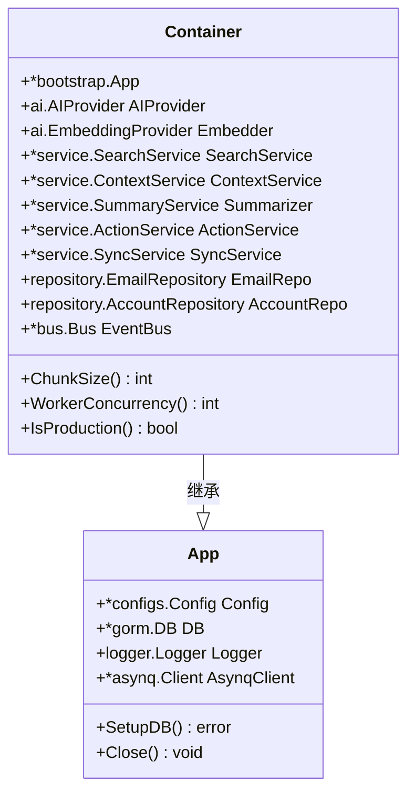
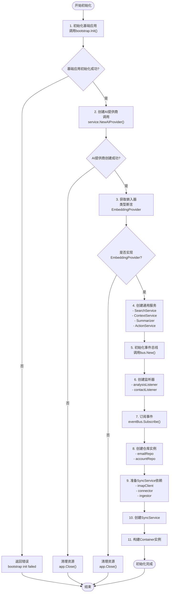
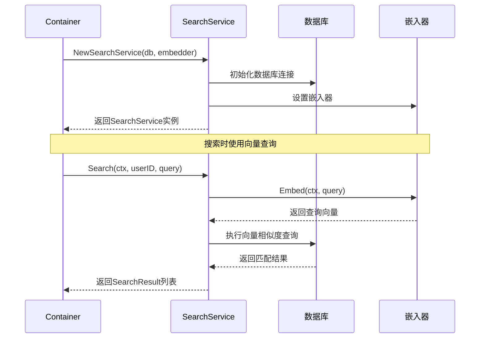
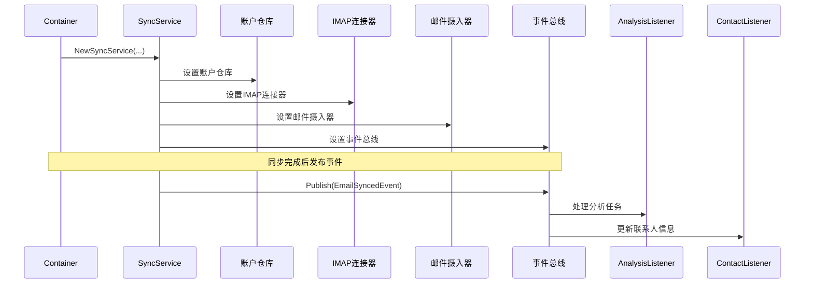
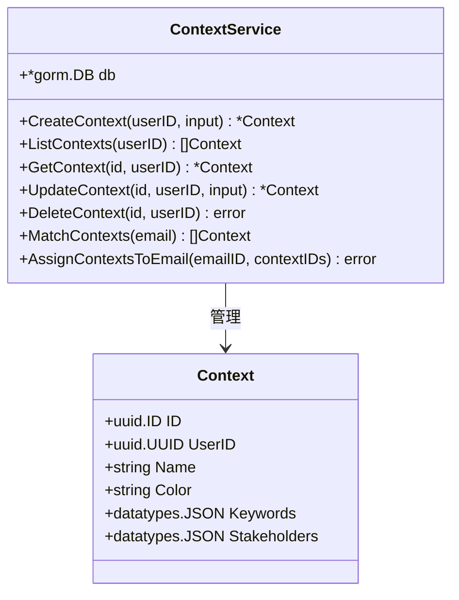
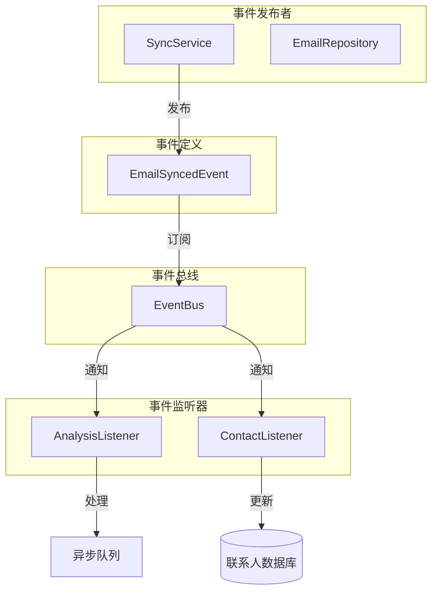
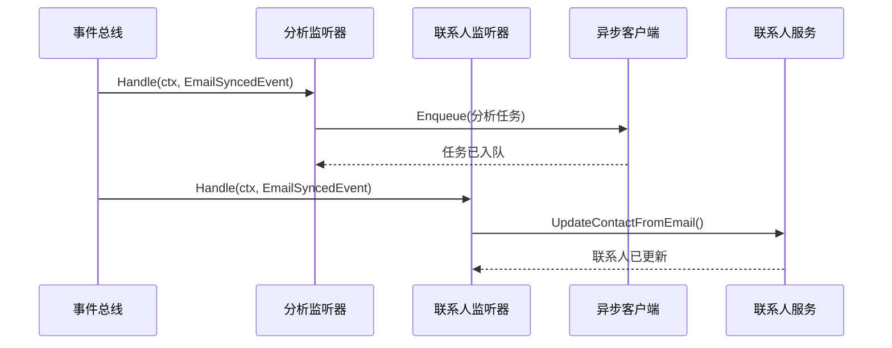

# 依赖注入容器

<cite>
**本文档中引用的文件**
- [container.go](file://backend/internal/app/container.go)
- [app.go](file://backend/internal/bootstrap/app.go)
- [email_events.go](file://backend/internal/event/email_events.go)
- [bus.go](file://backend/pkg/event/bus/bus.go)
- [email_listeners.go](file://backend/internal/listener/email_listeners.go)
- [sync.go](file://backend/internal/service/sync.go)
- [search.go](file://backend/internal/service/search.go)
- [main.go](file://backend/cmd/main.go)
- [worker/main.go](file://backend/cmd/worker/main.go)
- [context.go](file://backend/internal/service/context.go)
- [ai_draft.go](file://backend/internal/service/ai_draft.go)
</cite>

## 目录
1. [简介](#简介)
2. [Container结构体概述](#container结构体概述)
3. [NewContainer函数详解](#newcontainer函数详解)
4. [核心服务初始化流程](#核心服务初始化流程)
5. [事件总线与监听器机制](#事件总线与监听器机制)
6. [依赖注入的优势](#依赖注入的优势)
7. [扩展Container的指南](#扩展container的指南)
8. [最佳实践](#最佳实践)
9. [总结](#总结)

## 简介

依赖注入容器是EchoMind应用程序架构的核心组件，它负责管理所有核心服务的生命周期和依赖关系。通过`Container`结构体和`NewContainer`函数，系统实现了统一的服务注册、初始化和依赖管理机制，大大提高了代码的可测试性和可维护性。

## Container结构体概述

`Container`结构体作为所有核心服务的依赖注入容器，继承自`bootstrap.App`并包含了应用程序所需的所有主要服务实例。



**图表来源**
- [container.go](file://backend/internal/app/container.go#L15-L29)
- [app.go](file://backend/internal/bootstrap/app.go#L17-L22)

### 核心字段说明

| 字段名 | 类型 | 描述 |
|--------|------|------|
| `AIProvider` | `ai.AIProvider` | AI服务提供商，支持多种AI模型 |
| `Embedder` | `ai.EmbeddingProvider` | 嵌入向量生成器，用于文本向量化 |
| `SearchService` | `*service.SearchService` | 搜索服务，基于向量相似度检索邮件 |
| `ContextService` | `*service.ContextService` | 上下文服务，管理用户定义的邮件上下文 |
| `Summarizer` | `*service.SummaryService` | 总结服务，生成邮件摘要 |
| `ActionService` | `*service.ActionService` | 动作服务，处理用户操作建议 |
| `SyncService` | `*service.SyncService` | 同步服务，处理邮件账户同步 |
| `EmailRepo` | `repository.EmailRepository` | 邮件数据访问层 |
| `AccountRepo` | `repository.AccountRepository` | 账户数据访问层 |
| `EventBus` | `*bus.Bus` | 事件总线，实现发布-订阅模式 |

**节来源**
- [container.go](file://backend/internal/app/container.go#L15-L29)

## NewContainer函数详解

`NewContainer`函数是依赖注入容器的核心初始化函数，它按照严格的顺序创建和配置所有核心服务。



**图表来源**
- [container.go](file://backend/internal/app/container.go#L31-L99)

### 初始化步骤详解

#### 第一步：基础应用初始化
```go
app, err := bootstrap.Init(configPath, isProduction)
```
这一步创建了基础的应用实例，包括配置加载、数据库连接、日志系统和Redis客户端。

#### 第二步：AI提供商初始化
```go
aiProvider, err := service.NewAIProvider(&app.Config.AI)
```
创建AI服务提供商，支持OpenAI、Gemini等多种AI模型。

#### 第三步：嵌入器提取
```go
embedder, ok := aiProvider.(ai.EmbeddingProvider)
```
确保AI提供商支持嵌入向量生成功能。

#### 第四步：通用服务创建
```go
searchService := service.NewSearchService(app.DB, embedder)
contextService := service.NewContextService(app.DB)
summarizer := service.NewSummaryService(aiProvider)
actionService := service.NewActionService(app.DB)
```
这些服务构成了应用程序的核心业务逻辑。

#### 第五步：事件总线初始化
```go
eventBus := bus.New()
```
创建内存事件总线，支持发布-订阅模式的消息传递。

**节来源**
- [container.go](file://backend/internal/app/container.go#L31-L99)

## 核心服务初始化流程

### SearchService初始化

`SearchService`负责基于向量相似度的邮件搜索功能：



**图表来源**
- [search.go](file://backend/internal/service/search.go#L17-L26)
- [container.go](file://backend/internal/app/container.go#L54-L56)

### SyncService初始化

`SyncService`处理邮件账户的同步逻辑：



**图表来源**
- [sync.go](file://backend/internal/service/sync.go#L78-L101)
- [container.go](file://backend/internal/app/container.go#L69-L85)

### ContextService初始化

`ContextService`管理用户定义的邮件上下文：



**图表来源**
- [context.go](file://backend/internal/service/context.go#L14-L19)

**节来源**
- [container.go](file://backend/internal/app/container.go#L54-L58)
- [search.go](file://backend/internal/service/search.go#L17-L26)
- [sync.go](file://backend/internal/service/sync.go#L78-L101)
- [context.go](file://backend/internal/service/context.go#L14-L19)

## 事件总线与监听器机制

EchoMind使用事件驱动架构，通过事件总线实现松耦合的组件通信。

### 事件总线架构



**图表来源**
- [bus.go](file://backend/pkg/event/bus/bus.go#L25-L62)
- [email_events.go](file://backend/internal/event/email_events.go#L8-L19)
- [email_listeners.go](file://backend/internal/listener/email_listeners.go#L22-L116)

### 事件订阅机制

#### EmailSyncedEvent事件

当邮件同步完成时，系统会发布`EmailSyncedEvent`事件：

```go
event := event.EmailSyncedEvent{
    UserID: userID,
    Email:  email,
}
if err := s.bus.Publish(ctx, event); err != nil {
    s.logger.Errorw("Failed to publish email synced event",
        "email_id", email.ID,
        "user_id", userID,
        "error", err)
}
```

#### 监听器注册

事件总线会自动将监听器注册到相应的事件名称：

```go
eventBus.Subscribe(event.EmailSyncedEventName, analysisListener)
eventBus.Subscribe(event.EmailSyncedEventName, contactListener)
```

#### 监听器处理流程



**图表来源**
- [sync.go](file://backend/internal/service/sync.go#L142-L154)
- [email_listeners.go](file://backend/internal/listener/email_listeners.go#L35-L102)

**节来源**
- [bus.go](file://backend/pkg/event/bus/bus.go#L25-L62)
- [email_events.go](file://backend/internal/event/email_events.go#L8-L19)
- [email_listeners.go](file://backend/internal/listener/email_listeners.go#L35-L102)

## 依赖注入的优势

### 1. 松耦合设计

通过依赖注入容器，各个组件之间不再直接创建依赖对象，而是通过容器提供的服务实例进行交互。

### 2. 可测试性提升

每个服务都可以轻松地被模拟（mock）或替换，便于单元测试和集成测试。

### 3. 生命周期管理

容器统一管理所有服务的创建、初始化和销毁，确保资源的正确释放。

### 4. 配置集中化

所有服务共享相同的配置源，避免了配置分散的问题。

### 5. 错误处理一致性

容器提供了统一的错误处理和资源清理机制。

## 扩展Container的指南

### 添加新服务到Container

要向Container中添加新的服务，需要修改`NewContainer`函数：

```go
// 1. 在Container结构体中添加字段
type Container struct {
    *bootstrap.App
    AIProvider     ai.AIProvider
    Embedder       ai.EmbeddingProvider
    SearchService  *service.SearchService
    ContextService *service.ContextService
    Summarizer     *service.SummaryService
    ActionService  *service.ActionService
    SyncService    *service.SyncService
    EmailRepo      repository.EmailRepository
    AccountRepo    repository.AccountRepository
    EventBus       *bus.Bus
    // 新增字段
    NewService     *service.NewService
}

// 2. 在NewContainer函数中初始化
func NewContainer(configPath string, isProduction bool) (*Container, error) {
    // ... 现有初始化代码 ...
    
    // 3. 初始化新服务
    newService := service.NewNewService(
        container.Embedder,  // 依赖现有服务
        container.Logger,    // 依赖日志服务
    )
    
    // 4. 注册到Container
    return &Container{
        App:            app,
        AIProvider:     aiProvider,
        Embedder:       embedder,
        SearchService:  searchService,
        ContextService: contextService,
        Summarizer:     summarizer,
        ActionService:  actionService,
        SyncService:    syncService,
        EmailRepo:      emailRepo,
        AccountRepo:    accountRepo,
        EventBus:       eventBus,
        // 注册新服务
        NewService:     newService,
    }, nil
}
```

### 创建新服务的最佳实践

#### 1. 接口优先设计

```go
// 定义服务接口
type NewServiceInterface interface {
    ProcessData(ctx context.Context, data string) (string, error)
    ValidateInput(input string) bool
}

// 实现具体服务
type NewServiceImpl struct {
    embedder ai.EmbeddingProvider
    logger   logger.Logger
}

func NewNewService(embedder ai.EmbeddingProvider, logger logger.Logger) NewServiceInterface {
    return &NewServiceImpl{
        embedder: embedder,
        logger:   logger,
    }
}
```

#### 2. 依赖最小化原则

只注入服务真正需要的依赖项，避免过度耦合。

#### 3. 错误处理标准化

```go
func (s *NewServiceImpl) ProcessData(ctx context.Context, data string) (string, error) {
    if data == "" {
        return "", fmt.Errorf("empty data provided")
    }
    
    // 使用容器提供的日志服务
    s.logger.Debugw("Processing new data",
        "length", len(data),
        "first_chars", data[:min(10, len(data))])
    
    // 处理业务逻辑...
    return processedData, nil
}
```

### 在主程序中使用新服务

```go
// 在main.go中使用新服务
func main() {
    // ... 现有代码 ...
    
    // 初始化新服务
    newService := service.NewNewService(
        container.Embedder,
        container.Logger,
    )
    
    // 创建处理器
    newHandler := handler.NewNewHandler(newService)
    
    // 注册路由
    router.RegisterNewRoute(r, newHandler)
}
```

**节来源**
- [container.go](file://backend/internal/app/container.go#L15-L29)
- [main.go](file://backend/cmd/main.go#L26-L60)

## 最佳实践

### 1. 服务初始化顺序

严格按照依赖关系顺序初始化服务，避免循环依赖。

### 2. 资源清理

确保在容器关闭时正确清理所有资源：

```go
func (c *Container) Close() {
    // 清理顺序很重要
    if c.SyncService != nil {
        c.SyncService.Close()
    }
    if c.EventBus != nil {
        // 清理事件监听器
    }
    c.App.Close()
}
```

### 3. 配置验证

在容器初始化过程中验证关键配置：

```go
func NewContainer(configPath string, isProduction bool) (*Container, error) {
    // 验证必需的配置项
    if container.Config.Database.DSN == "" {
        return nil, fmt.Errorf("database DSN is required")
    }
    
    if len(container.Config.AI.Providers) == 0 {
        return nil, fmt.Errorf("at least one AI provider must be configured")
    }
    
    // ... 其他验证 ...
}
```

### 4. 日志记录

在容器初始化过程中记录关键步骤：

```go
container.Logger.Info("Initializing dependency injection container")
container.Logger.Infof("Using configuration from: %s", configPath)
container.Logger.Infof("Production mode: %v", isProduction)
```

### 5. 错误处理策略

采用分层错误处理：

```go
func NewContainer(configPath string, isProduction bool) (*Container, error) {
    defer func() {
        if err := recover(); err != nil {
            container.Logger.Errorw("Container initialization panicked",
                "error", err,
                "stack", string(debug.Stack()))
        }
    }()
    
    // ... 初始化逻辑 ...
}
```

## 总结

EchoMind的依赖注入容器通过`Container`结构体和`NewContainer`函数，实现了优雅的服务管理和依赖控制。这种设计带来了以下优势：

1. **统一的服务管理**：所有核心服务都在一个地方初始化和管理
2. **清晰的依赖关系**：通过显式的依赖注入，使组件间的依赖关系一目了然
3. **良好的可测试性**：每个服务都可以独立测试，无需完整的容器环境
4. **灵活的扩展性**：可以轻松添加新的服务而不会影响现有代码
5. **一致的错误处理**：统一的错误处理和资源清理机制

通过遵循本文档中的指导原则和最佳实践，开发者可以有效地扩展和维护EchoMind的应用程序架构，确保系统的稳定性和可维护性。