# 依赖注入容器结构

<cite>
**本文档中引用的文件**
- [container.go](file://backend/internal/app/container.go)
- [app.go](file://backend/internal/bootstrap/app.go)
- [search.go](file://backend/internal/service/search.go)
- [sync.go](file://backend/internal/service/sync.go)
- [bus.go](file://backend/pkg/event/bus/bus.go)
- [provider.go](file://backend/pkg/ai/provider.go)
- [ai_factory.go](file://backend/internal/service/ai_factory.go)
- [context.go](file://backend/internal/service/context.go)
- [summary.go](file://backend/internal/service/summary.go)
- [action.go](file://backend/internal/service/action.go)
</cite>

## 目录
1. [简介](#简介)
2. [项目结构概览](#项目结构概览)
3. [Container结构体定义](#container结构体定义)
4. [架构概览](#架构概览)
5. [详细组件分析](#详细组件分析)
6. [依赖关系分析](#依赖关系分析)
7. [性能考虑](#性能考虑)
8. [故障排除指南](#故障排除指南)
9. [结论](#结论)

## 简介

依赖注入容器（Dependency Injection Container）是现代软件架构中的核心组件，它负责管理应用程序中所有服务和组件的生命周期。在EchoMind项目中，`Container`结构体作为依赖注入容器的核心实现，承担着协调各个业务服务、基础设施组件和第三方服务的重要职责。

本文档将深入分析`Container`结构体的设计理念、实现细节以及它如何通过嵌入`*bootstrap.App`来扩展基础应用功能，同时详细介绍各个核心组件字段的作用和相互关系。

## 项目结构概览

EchoMind项目采用分层架构设计，主要包含以下核心模块：

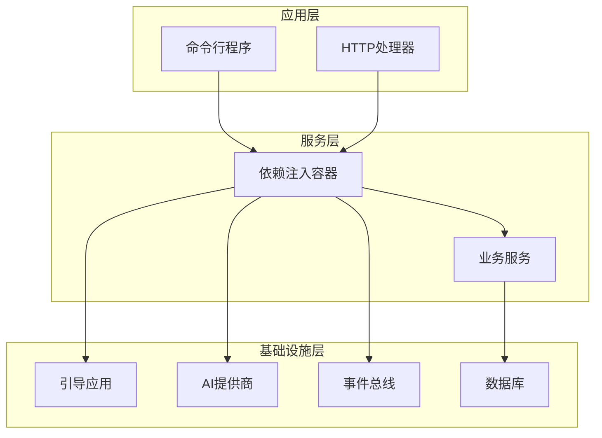

**图表来源**
- [container.go](file://backend/internal/app/container.go#L15-L29)
- [app.go](file://backend/internal/bootstrap/app.go#L17-L22)

**章节来源**
- [container.go](file://backend/internal/app/container.go#L1-L122)
- [app.go](file://backend/internal/bootstrap/app.go#L1-L148)

## Container结构体定义

`Container`结构体是EchoMind项目中依赖注入模式的核心实现，它不仅继承了基础应用功能，还扩展了多个关键业务服务。

### 核心结构定义

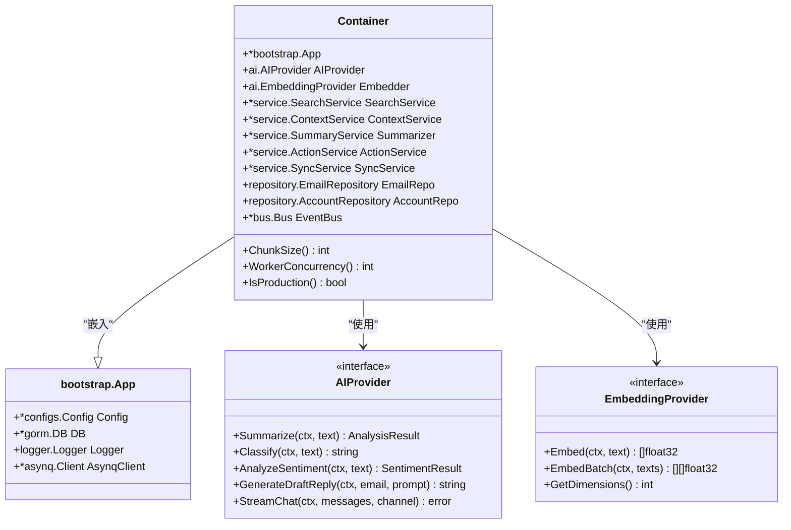

**图表来源**
- [container.go](file://backend/internal/app/container.go#L15-L29)
- [app.go](file://backend/internal/bootstrap/app.go#L17-L22)
- [provider.go](file://backend/pkg/ai/provider.go#L5-L34)

### 字段详解

#### 基础应用字段
- **`*bootstrap.App`**: 继承基础应用功能，包含配置、数据库连接、日志记录器和异步任务客户端
- **`Config`**: 应用配置信息，包括服务器设置、数据库连接和安全配置
- **`DB`**: 数据库连接实例，用于数据持久化操作
- **`Logger`**: 日志记录器，提供结构化日志记录功能
- **`AsynqClient`**: 异步任务队列客户端，用于后台任务处理

#### AI服务字段
- **`AIProvider`**: AI文本生成服务接口，支持摘要生成、情感分析、草稿回复等功能
- **`Embedder`**: 向量嵌入服务接口，用于将文本转换为向量表示，支持语义搜索

#### 业务服务字段
- **`SearchService`**: 语义搜索引擎服务，基于向量相似度进行邮件搜索
- **`ContextService`**: 上下文管理服务，处理用户自定义的邮件分类规则
- **`Summarizer`**: 摘要生成服务，基于AI提供商生成邮件内容摘要
- **`ActionService`**: 邮件操作服务，支持审批、暂存、忽略等邮件处理操作

#### 数据访问字段
- **`EmailRepo`**: 邮件数据访问接口，封装邮件相关的数据库操作
- **`AccountRepo`**: 账户数据访问接口，管理用户邮箱账户配置

#### 事件系统字段
- **`EventBus`**: 事件总线服务，实现发布-订阅模式的事件驱动通信

**章节来源**
- [container.go](file://backend/internal/app/container.go#L15-L29)

## 架构概览

依赖注入容器采用组合模式和工厂模式相结合的设计，通过统一的入口点管理所有应用依赖。

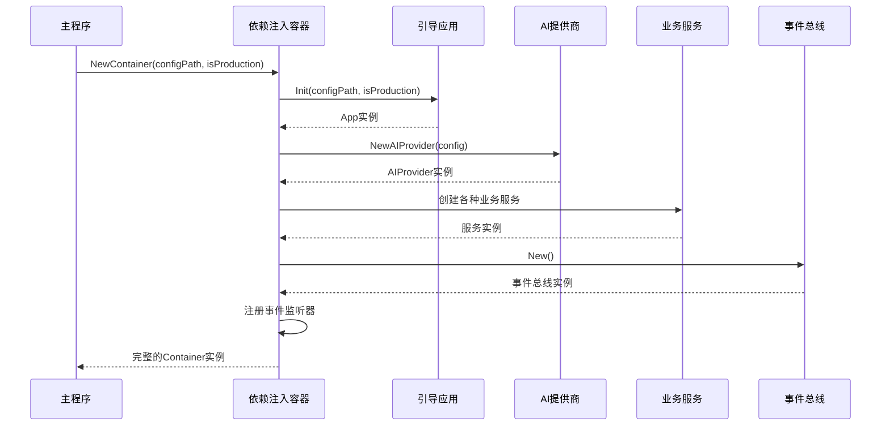

**图表来源**
- [container.go](file://backend/internal/app/container.go#L31-L100)
- [app.go](file://backend/internal/bootstrap/app.go#L24-L103)

**章节来源**
- [container.go](file://backend/internal/app/container.go#L31-L100)

## 详细组件分析

### AI提供商集成

AI提供商是EchoMind项目的核心智能服务组件，通过统一的接口抽象支持多种AI服务提供商。

#### AIProvider接口设计

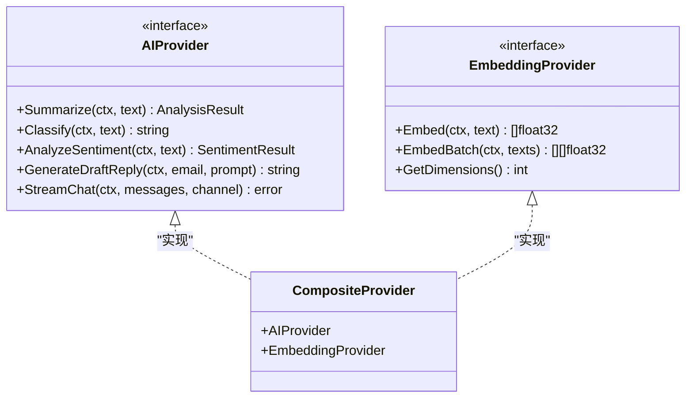

**图表来源**
- [provider.go](file://backend/pkg/ai/provider.go#L5-L34)
- [ai_factory.go](file://backend/internal/service/ai_factory.go#L17-L21)

#### AI提供商工厂实现

AI提供商工厂支持动态选择和配置不同的AI服务提供商，包括OpenAI、Gemini和Mock等。

**章节来源**
- [provider.go](file://backend/pkg/ai/provider.go#L5-L34)
- [ai_factory.go](file://backend/internal/service/ai_factory.go#L23-L96)

### 搜索服务架构

搜索服务是EchoMind项目的核心功能之一，基于向量嵌入技术实现语义搜索。

#### 搜索服务组件图

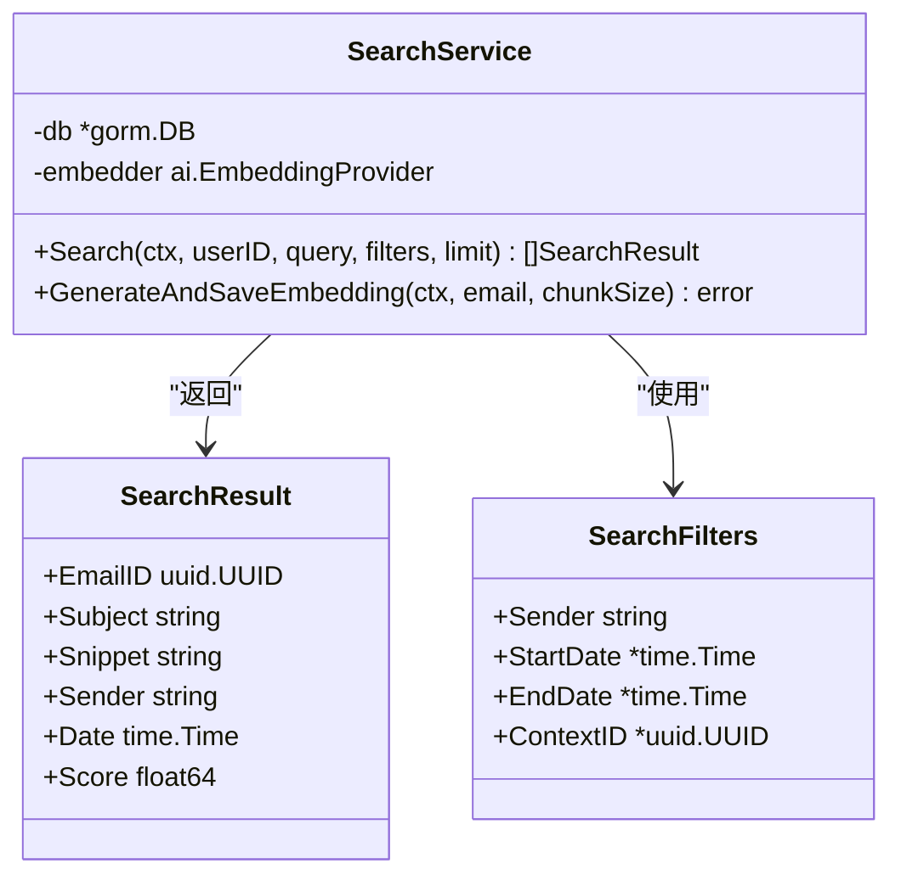

**图表来源**
- [search.go](file://backend/internal/service/search.go#L17-L37)

#### 搜索算法流程

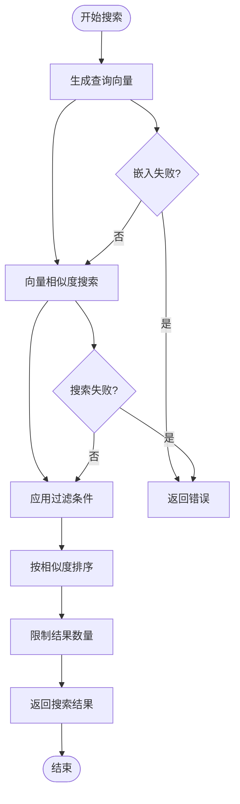

**图表来源**
- [search.go](file://backend/internal/service/search.go#L45-L106)

**章节来源**
- [search.go](file://backend/internal/service/search.go#L17-L171)

### 同步服务设计

同步服务负责管理邮件账户的自动同步流程，包括IMAP连接、邮件获取和事件发布。

#### 同步服务架构

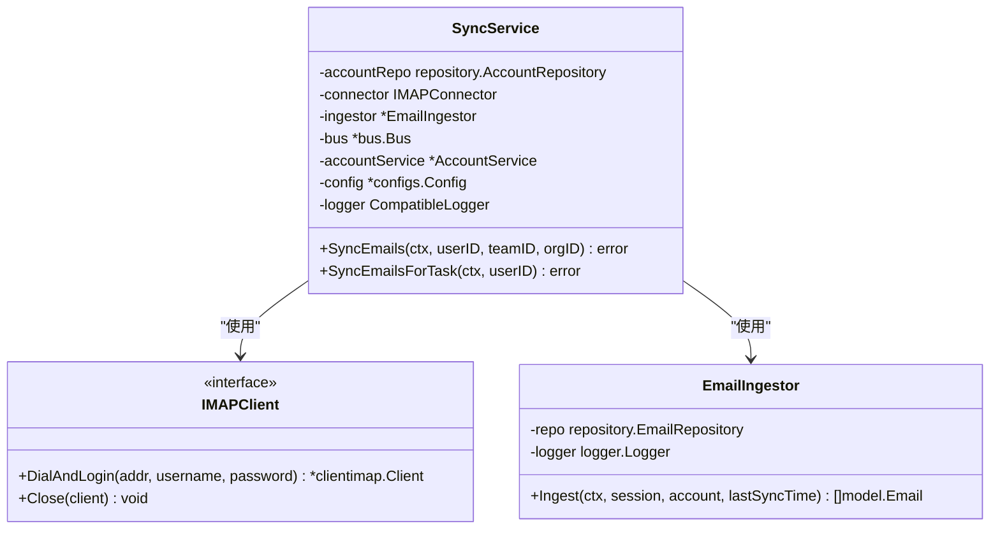

**图表来源**
- [sync.go](file://backend/internal/service/sync.go#L78-L101)

#### 邮件同步流程

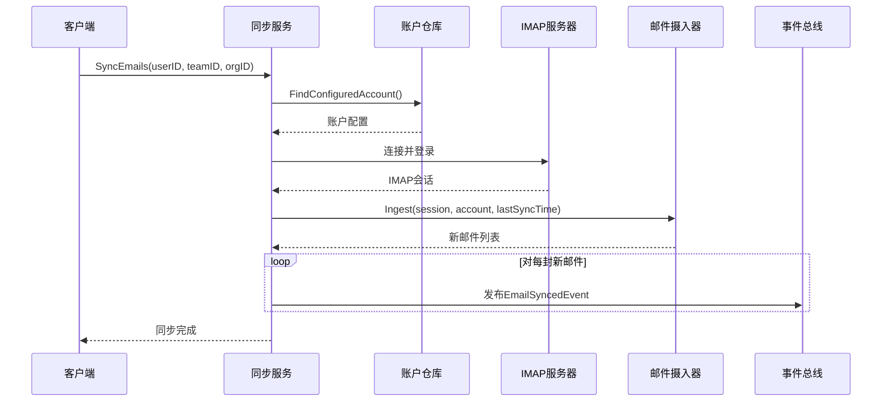

**图表来源**
- [sync.go](file://backend/internal/service/sync.go#L104-L157)

**章节来源**
- [sync.go](file://backend/internal/service/sync.go#L78-L178)

### 事件总线系统

事件总线实现了松耦合的事件驱动架构，支持发布-订阅模式的消息传递。

#### 事件总线组件设计

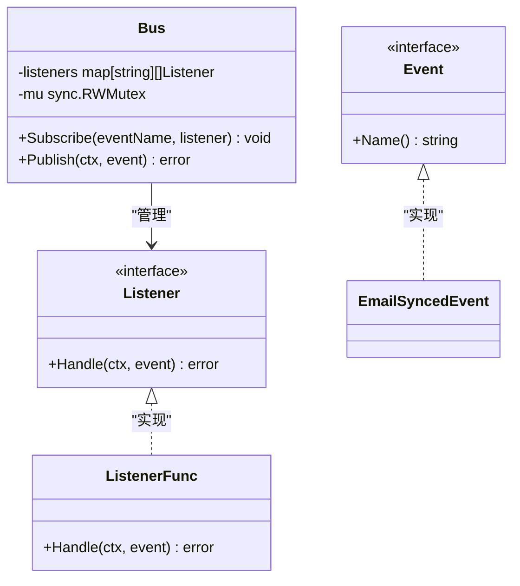

**图表来源**
- [bus.go](file://backend/pkg/event/bus/bus.go#L25-L63)

#### 事件处理流程

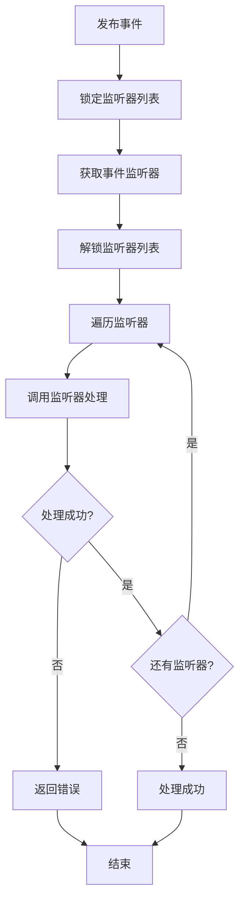

**图表来源**
- [bus.go](file://backend/pkg/event/bus/bus.go#L46-L62)

**章节来源**
- [bus.go](file://backend/pkg/event/bus/bus.go#L1-L63)

### 上下文服务

上下文服务提供了灵活的邮件分类和标签系统，支持基于关键词和利益相关者的智能匹配。

#### 上下文匹配算法

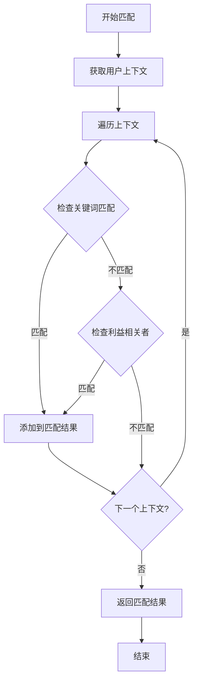

**图表来源**
- [context.go](file://backend/internal/service/context.go#L107-L152)

**章节来源**
- [context.go](file://backend/internal/service/context.go#L14-L169)

### 总结服务

总结服务封装了AI提供商的摘要生成功能，提供统一的接口用于邮件内容分析。

#### 总结服务接口

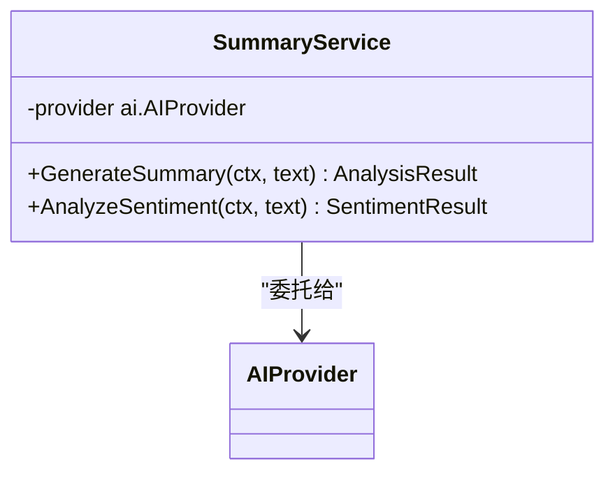

**图表来源**
- [summary.go](file://backend/internal/service/summary.go#L9-L26)

**章节来源**
- [summary.go](file://backend/internal/service/summary.go#L1-L26)

### 动作服务

动作服务提供了邮件的高级操作功能，包括审批、暂存和忽略等。

#### 邮件操作流程

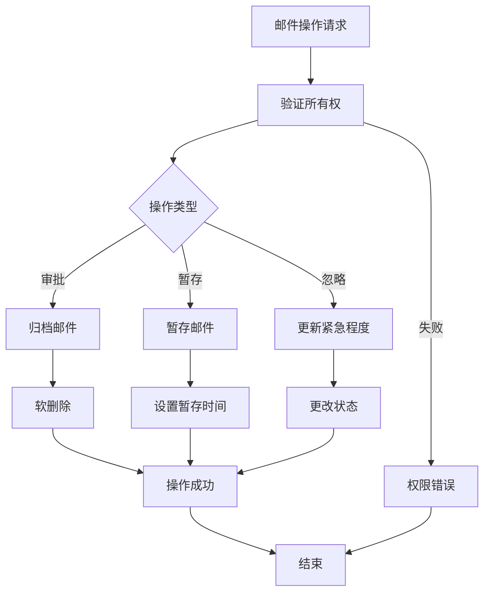

**图表来源**
- [action.go](file://backend/internal/service/action.go#L20-L79)

**章节来源**
- [action.go](file://backend/internal/service/action.go#L1-L80)

## 依赖关系分析

依赖注入容器的依赖关系体现了清晰的分层架构和单一职责原则。

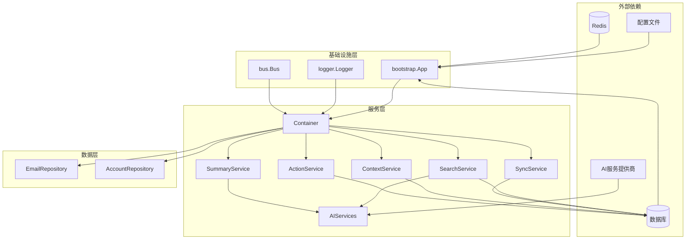

**图表来源**
- [container.go](file://backend/internal/app/container.go#L3-L13)
- [app.go](file://backend/internal/bootstrap/app.go#L1-L148)

### 循环依赖检测

通过分析依赖关系图，可以发现以下特点：

1. **单向依赖**: 所有依赖关系都是单向的，避免了循环依赖问题
2. **接口隔离**: 通过接口抽象，实现了高层模块不依赖低层模块的具体实现
3. **依赖倒置**: 业务服务依赖于抽象接口，而不是具体实现

**章节来源**
- [container.go](file://backend/internal/app/container.go#L1-L122)

## 性能考虑

依赖注入容器在设计时充分考虑了性能优化，采用了多种策略来提升系统响应速度和资源利用率。

### 缓存策略
- **AI提供商缓存**: 复用相同的AI提供商实例，避免重复初始化
- **数据库连接池**: 利用GORM的连接池机制，减少连接建立开销
- **事件监听器缓存**: 预先注册事件监听器，避免运行时查找开销

### 并发处理
- **异步事件处理**: 事件总线支持并发处理多个事件
- **批量操作**: 搜索服务支持批量向量生成，提高处理效率
- **连接复用**: IMAP客户端连接在同步过程中保持复用

### 内存优化
- **延迟初始化**: 非关键服务采用延迟初始化策略
- **对象池**: 对象重用减少GC压力
- **流式处理**: 大数据量处理采用流式方式，控制内存占用

## 故障排除指南

### 常见问题及解决方案

#### AI提供商初始化失败
**症状**: `failed to create AI provider` 错误
**原因**: 配置文件中AI服务提供商设置不正确或网络连接问题
**解决方案**: 
1. 检查配置文件中的AI服务提供商设置
2. 验证API密钥的有效性
3. 确认网络连接正常

#### 数据库连接超时
**症状**: `database connection timeout` 错误
**原因**: 数据库连接池耗尽或数据库服务器负载过高
**解决方案**:
1. 增加数据库连接池大小
2. 优化数据库查询性能
3. 检查数据库服务器资源使用情况

#### 事件处理失败
**症状**: 事件监听器处理异常
**原因**: 监听器逻辑错误或依赖服务不可用
**解决方案**:
1. 检查事件监听器的实现逻辑
2. 验证依赖服务的可用性
3. 添加适当的错误处理和重试机制

**章节来源**
- [container.go](file://backend/internal/app/container.go#L35-L52)
- [app.go](file://backend/internal/bootstrap/app.go#L78-L84)

## 结论

EchoMind项目的依赖注入容器设计体现了现代软件架构的最佳实践，通过以下特点实现了高质量的系统设计：

### 设计优势
1. **松耦合架构**: 通过接口抽象和依赖注入，实现了组件间的松耦合
2. **可测试性**: 清晰的接口定义使得单元测试和集成测试更加容易
3. **可扩展性**: 新的服务可以通过简单的配置添加到容器中
4. **可维护性**: 单一职责原则和清晰的依赖关系提高了代码的可维护性

### 技术创新
1. **复合提供商模式**: 将AI文本生成和向量嵌入能力整合到单一接口中
2. **事件驱动架构**: 实现了高效的异步消息传递机制
3. **工厂模式应用**: 支持多种AI服务提供商的动态切换
4. **延迟初始化**: 优化了启动时间和资源使用

### 最佳实践
1. **配置驱动**: 通过配置文件控制服务行为，提高灵活性
2. **错误处理**: 完善的错误处理和恢复机制
3. **日志记录**: 结构化的日志记录便于问题诊断
4. **监控指标**: 提供了关键性能指标的访问方法

这种设计不仅满足了当前的功能需求，也为未来的功能扩展和技术演进奠定了坚实的基础。通过持续的重构和优化，依赖注入容器将继续发挥其在系统架构中的核心作用。