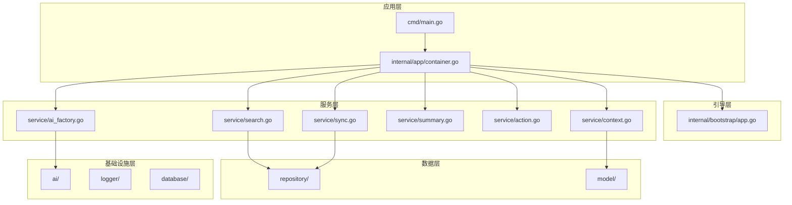
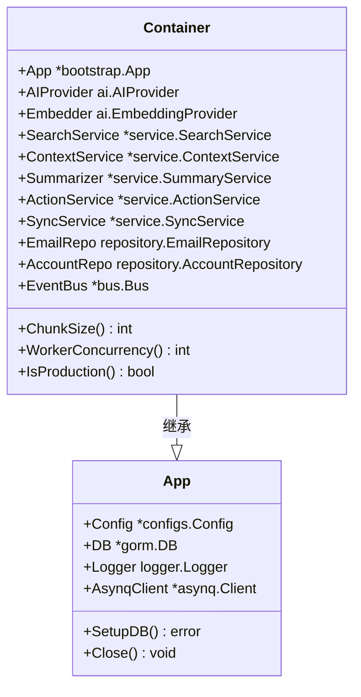
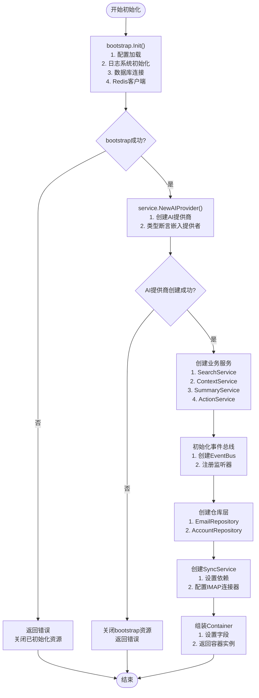
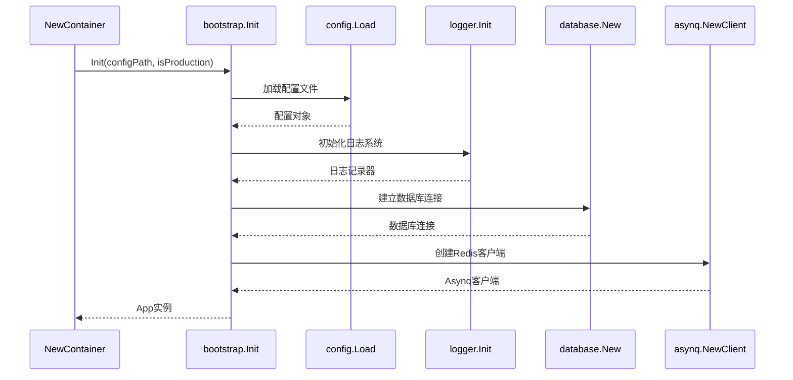
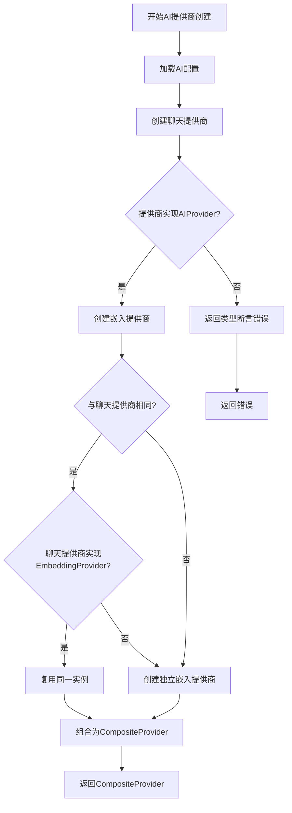
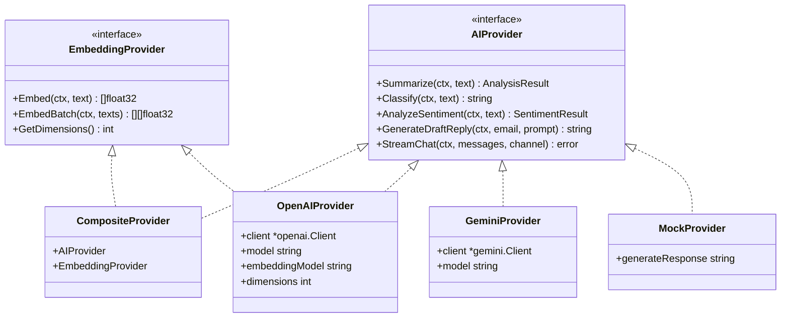
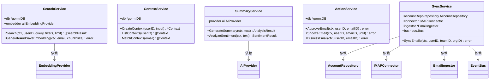
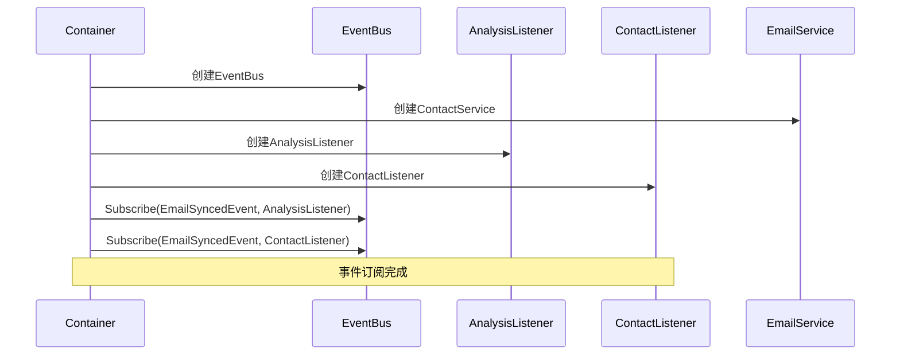
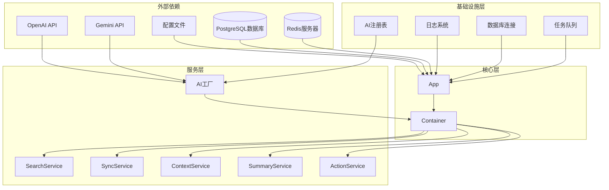
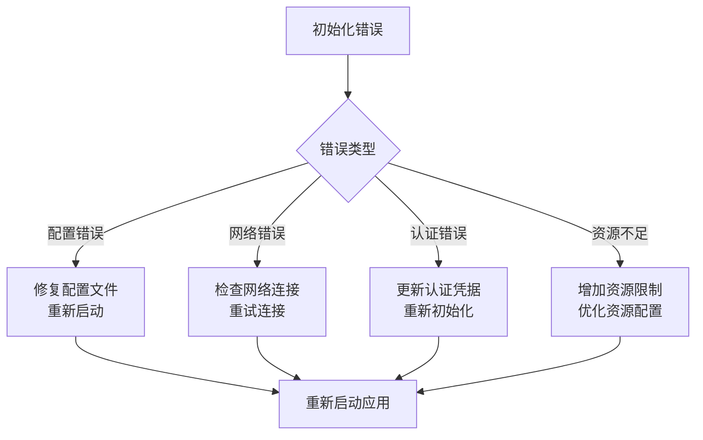

# 容器初始化流程

<cite>
**本文档中引用的文件**
- [backend/internal/app/container.go](file://backend/internal/app/container.go)
- [backend/internal/bootstrap/app.go](file://backend/internal/bootstrap/app.go)
- [backend/cmd/main.go](file://backend/cmd/main.go)
- [backend/internal/service/ai_factory.go](file://backend/internal/service/ai_factory.go)
- [backend/pkg/ai/provider.go](file://backend/pkg/ai/provider.go)
- [backend/internal/service/search.go](file://backend/internal/service/search.go)
- [backend/internal/service/sync.go](file://backend/internal/service/sync.go)
- [backend/internal/service/context.go](file://backend/internal/service/context.go)
- [backend/internal/service/summary.go](file://backend/internal/service/summary.go)
- [backend/internal/service/action.go](file://backend/internal/service/action.go)
- [backend/pkg/ai/registry/registry.go](file://backend/pkg/ai/registry/registry.go)
- [backend/pkg/ai/openai/provider.go](file://backend/pkg/ai/openai/provider.go)
</cite>

## 目录
1. [简介](#简介)
2. [项目结构概览](#项目结构概览)
3. [核心组件分析](#核心组件分析)
4. [架构概览](#架构概览)
5. [详细组件分析](#详细组件分析)
6. [依赖关系分析](#依赖关系分析)
7. [性能考虑](#性能考虑)
8. [故障排除指南](#故障排除指南)
9. [结论](#结论)

## 简介

本文档深入解析了EchoMind项目中`NewContainer`函数的初始化流程，该函数是应用程序启动的核心入口点。从调用`bootstrap.Init`开始，逐步说明配置加载、日志系统初始化、数据库连接建立、AI提供商创建、服务实例化到最终容器组装的全过程。重点描述各阶段的依赖关系与错误处理机制，特别是AI提供商创建失败时如何安全关闭已初始化资源。

## 项目结构概览

EchoMind采用分层架构设计，主要包含以下核心模块：

**图表来源**
- [backend/cmd/main.go](file://backend/cmd/main.go#L1-L137)
- [backend/internal/app/container.go](file://backend/internal/app/container.go#L1-L122)
- [backend/internal/bootstrap/app.go](file://backend/internal/bootstrap/app.go#L1-L148)

## 核心组件分析

### Container结构体

Container是应用程序的依赖注入容器，继承自bootstrap.App并扩展了常用服务：

**图表来源**
- [backend/internal/app/container.go](file://backend/internal/app/container.go#L17-L29)
- [backend/internal/bootstrap/app.go](file://backend/internal/bootstrap/app.go#L17-L22)

**章节来源**
- [backend/internal/app/container.go](file://backend/internal/app/container.go#L17-L29)

## 架构概览

容器初始化流程遵循严格的顺序依赖关系，确保每个阶段的成功完成才能进入下一阶段：

**图表来源**
- [backend/internal/app/container.go](file://backend/internal/app/container.go#L33-L99)
- [backend/internal/bootstrap/app.go](file://backend/internal/bootstrap/app.go#L24-L103)

## 详细组件分析

### 1. Bootstrap初始化阶段

Bootstrap初始化是整个流程的第一步，负责基础基础设施的搭建：

**图表来源**
- [backend/internal/bootstrap/app.go](file://backend/internal/bootstrap/app.go#L24-L103)

#### 配置加载机制

配置加载采用多层次优先级策略：
1. **文件配置**：从指定路径加载YAML配置文件
2. **环境变量覆盖**：从环境变量中读取配置项
3. **默认值回退**：生产环境使用生产配置，开发环境使用开发配置

#### 错误处理机制

Bootstrap阶段的错误处理遵循"失败即回滚"原则：
- 如果任何步骤失败，立即返回错误
- 不需要显式关闭已初始化的资源，因为这些资源在App.Close()中统一管理

**章节来源**
- [backend/internal/bootstrap/app.go](file://backend/internal/bootstrap/app.go#L24-L103)

### 2. AI提供商创建阶段

AI提供商创建是容器初始化的关键环节，涉及复杂的工厂模式和注册机制：

**图表来源**
- [backend/internal/service/ai_factory.go](file://backend/internal/service/ai_factory.go#L24-L96)

#### AI提供商工厂模式

AI提供商采用工厂模式，支持多种AI服务提供商：

**图表来源**
- [backend/pkg/ai/provider.go](file://backend/pkg/ai/provider.go#L5-L34)
- [backend/internal/service/ai_factory.go](file://backend/internal/service/ai_factory.go#L17-L21)

**章节来源**
- [backend/internal/service/ai_factory.go](file://backend/internal/service/ai_factory.go#L24-L96)
- [backend/pkg/ai/provider.go](file://backend/pkg/ai/provider.go#L5-L34)

### 3. 业务服务实例化阶段

业务服务的实例化遵循依赖注入原则，确保服务间的松耦合：

**图表来源**
- [backend/internal/service/search.go](file://backend/internal/service/search.go#L17-L26)
- [backend/internal/service/context.go](file://backend/internal/service/context.go#L14-L19)
- [backend/internal/service/summary.go](file://backend/internal/service/summary.go#L9-L16)
- [backend/internal/service/action.go](file://backend/internal/service/action.go#L12-L16)
- [backend/internal/service/sync.go](file://backend/internal/service/sync.go#L78-L86)

**章节来源**
- [backend/internal/service/search.go](file://backend/internal/service/search.go#L22-L26)
- [backend/internal/service/context.go](file://backend/internal/service/context.go#L18-L19)
- [backend/internal/service/summary.go](file://backend/internal/service/summary.go#L13-L16)
- [backend/internal/service/action.go](file://backend/internal/service/action.go#L16-L18)

### 4. 事件总线与监听器初始化

事件总线系统实现了发布-订阅模式，支持异步事件处理：

**图表来源**
- [backend/internal/app/container.go](file://backend/internal/app/container.go#L60-L68)

**章节来源**
- [backend/internal/app/container.go](file://backend/internal/app/container.go#L60-L68)

## 依赖关系分析

### 完整的依赖关系图

**图表来源**
- [backend/internal/app/container.go](file://backend/internal/app/container.go#L1-L122)
- [backend/internal/bootstrap/app.go](file://backend/internal/bootstrap/app.go#L1-L148)

### 循环依赖检测

系统通过以下机制避免循环依赖：

1. **分层架构**：严格区分应用层、服务层、基础设施层
2. **接口抽象**：使用接口定义服务契约
3. **依赖注入**：通过构造函数传递依赖
4. **工厂模式**：延迟实例化，避免提前加载

**章节来源**
- [backend/internal/app/container.go](file://backend/internal/app/container.go#L1-L122)
- [backend/internal/bootstrap/app.go](file://backend/internal/bootstrap/app.go#L1-L148)

## 性能考虑

### 初始化性能优化

1. **并行初始化**：某些组件可以并行初始化
2. **懒加载**：非关键组件采用懒加载策略
3. **连接池**：数据库和Redis连接使用连接池
4. **缓存机制**：配置和AI模型参数缓存

### 内存管理

1. **资源清理**：实现defer模式确保资源正确释放
2. **垃圾回收**：合理管理大对象的生命周期
3. **内存泄漏防护**：及时关闭网络连接和文件句柄

## 故障排除指南

### 常见初始化错误及解决方案

| 错误类型 | 可能原因 | 解决方案 |
|---------|---------|---------|
| 配置加载失败 | 配置文件格式错误或缺失 | 检查配置文件语法，确保必需字段存在 |
| 数据库连接失败 | DSN格式错误或数据库不可达 | 验证DSN格式，检查网络连接 |
| AI提供商创建失败 | API密钥无效或服务不可用 | 检查API密钥，验证服务可用性 |
| 事件总线初始化失败 | Redis连接问题 | 检查Redis配置和连接状态 |

### 错误恢复机制

**章节来源**
- [backend/internal/app/container.go](file://backend/internal/app/container.go#L36-L51)
- [backend/internal/bootstrap/app.go](file://backend/internal/bootstrap/app.go#L72-L83)

## 结论

EchoMind的容器初始化流程体现了现代Go应用程序的最佳实践：

1. **模块化设计**：清晰的分层架构和职责分离
2. **依赖注入**：灵活的依赖管理和测试友好性
3. **错误处理**：完善的错误传播和资源清理机制
4. **可扩展性**：插件化的AI提供商和事件系统
5. **性能优化**：合理的初始化顺序和资源管理

通过这种设计，应用程序能够：
- 快速启动和优雅关闭
- 处理各种初始化失败场景
- 支持多种AI服务提供商
- 提供稳定的业务服务

这种架构为EchoMind提供了坚实的基础，支持其作为智能邮件管理平台的核心功能需求。