# Handler层

<cite>
**本文档中引用的文件**
- [auth.go](file://backend/internal/handler/auth.go)
- [email.go](file://backend/internal/handler/email.go)
- [search.go](file://backend/internal/handler/search.go)
- [health.go](file://backend/internal/handler/health.go)
- [account.go](file://backend/internal/handler/account.go)
- [context.go](file://backend/internal/handler/context.go)
- [task.go](file://backend/internal/handler/task.go)
- [organization.go](file://backend/internal/handler/organization.go)
- [routes.go](file://backend/internal/router/routes.go)
- [container.go](file://backend/internal/app/container.go)
- [auth.go](file://backend/internal/middleware/auth.go)
- [middleware.go](file://backend/internal/router/middleware.go)
- [main.go](file://backend/cmd/main.go)
</cite>

## 目录
1. [简介](#简介)
2. [项目结构](#项目结构)
3. [核心组件](#核心组件)
4. [架构概览](#架构概览)
5. [详细组件分析](#详细组件分析)
6. [依赖注入机制](#依赖注入机制)
7. [错误处理策略](#错误处理策略)
8. [最佳实践指南](#最佳实践指南)
9. [故障排除指南](#故障排除指南)
10. [总结](#总结)

## 简介

EchoMind后端Handler层是整个应用架构中的API网关，负责接收HTTP请求、解析参数、调用对应Service层方法并返回JSON响应。Handler层采用Go语言和Gin框架实现，遵循分层架构设计原则，实现了清晰的职责分离和依赖管理。

Handler层的主要职责包括：
- 接收和验证HTTP请求参数
- 调用Service层业务逻辑
- 处理错误并返回适当的HTTP响应
- 提供RESTful API接口
- 实现身份验证和授权中间件

## 项目结构

EchoMind的Handler层位于`backend/internal/handler`目录下，包含多个专门的处理程序文件，每个文件负责特定功能域的API接口：

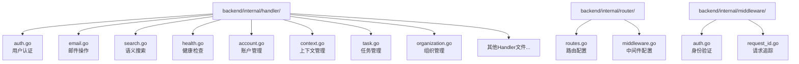

**图表来源**
- [routes.go](file://backend/internal/router/routes.go#L1-L99)
- [auth.go](file://backend/internal/middleware/auth.go#L1-L60)

**章节来源**
- [routes.go](file://backend/internal/router/routes.go#L1-L99)

## 核心组件

### Handler结构体设计

所有Handler都遵循统一的设计模式：包含一个指向Service层的指针字段，通过构造函数进行初始化。

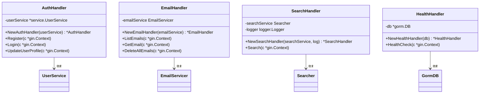

**图表来源**
- [auth.go](file://backend/internal/handler/auth.go#L11-L18)
- [email.go](file://backend/internal/handler/email.go#L22-L28)
- [search.go](file://backend/internal/handler/search.go#L20-L30)
- [health.go](file://backend/internal/handler/health.go#L10-L16)

### 请求结构体设计

Handler层使用结构体来定义API请求的输入格式，支持自动参数验证：

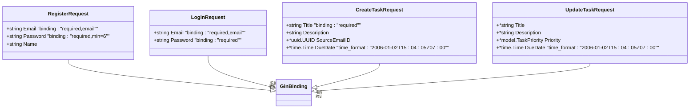

**图表来源**
- [auth.go](file://backend/internal/handler/auth.go#L21-L25)
- [auth.go](file://backend/internal/handler/auth.go#L66-L69)
- [task.go](file://backend/internal/handler/task.go#L23-L28)
- [task.go](file://backend/internal/handler/task.go#L34-L39)

**章节来源**
- [auth.go](file://backend/internal/handler/auth.go#L1-L127)
- [task.go](file://backend/internal/handler/task.go#L1-L235)

## 架构概览

EchoMind的Handler层采用分层架构，通过Gin框架实现RESTful API服务：

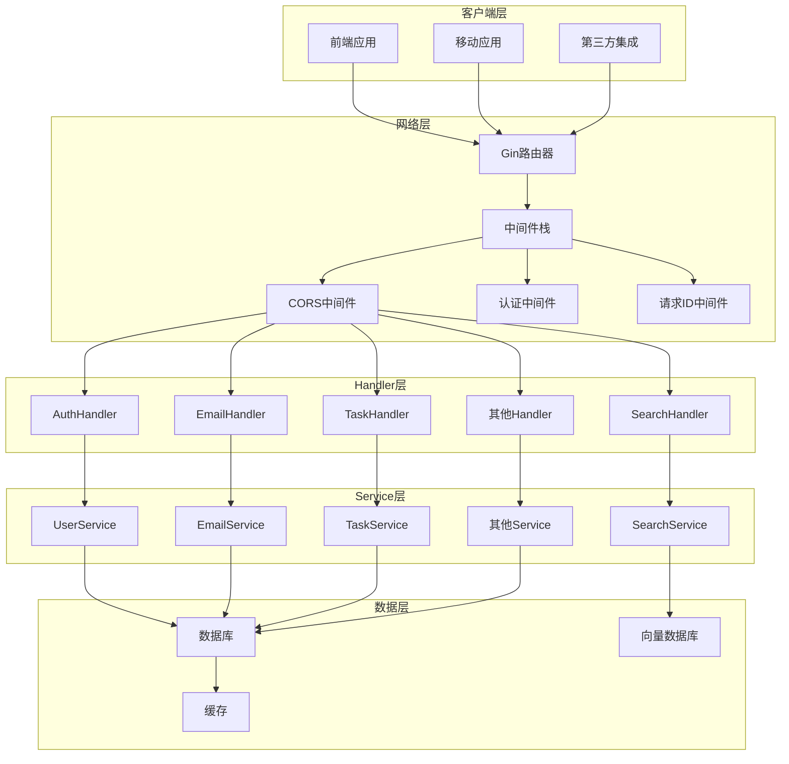

**图表来源**
- [main.go](file://backend/cmd/main.go#L85-L108)
- [routes.go](file://backend/internal/router/routes.go#L26-L98)
- [middleware.go](file://backend/internal/router/middleware.go#L15-L43)

**章节来源**
- [main.go](file://backend/cmd/main.go#L1-L136)
- [routes.go](file://backend/internal/router/routes.go#L1-L99)

## 详细组件分析

### 认证Handler (auth.go)

认证Handler处理用户注册、登录和个人资料更新等核心认证功能：

#### 功能特性
- 用户注册：验证邮箱格式和密码强度，自动登录并返回JWT令牌
- 用户登录：验证凭据，返回JWT令牌和用户信息
- 个人资料更新：支持角色和姓名更新

#### 实现特点
- 使用结构体验证请求参数
- 集成JWT认证中间件
- 自动处理用户状态和账户关联

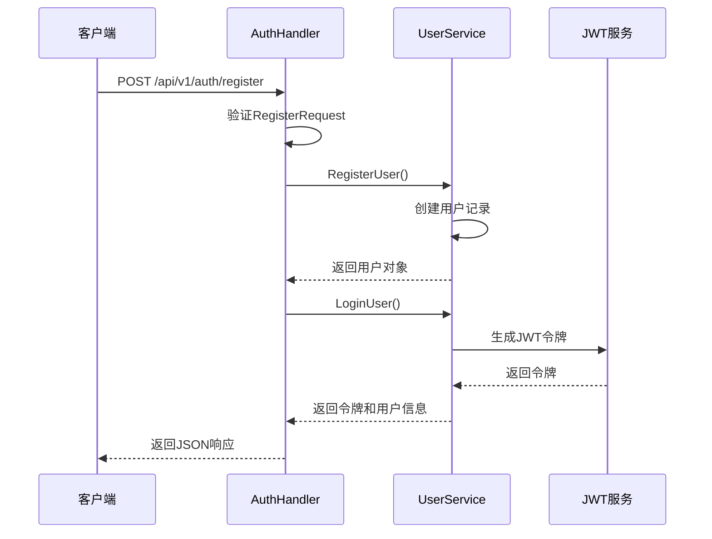

**图表来源**
- [auth.go](file://backend/internal/handler/auth.go#L28-L63)
- [auth.go](file://backend/internal/handler/auth.go#L72-L98)

**章节来源**
- [auth.go](file://backend/internal/handler/auth.go#L1-L127)

### 邮件Handler (email.go)

邮件Handler提供完整的邮件管理功能，包括列表查询、详情获取和批量删除：

#### 核心功能
- 分页查询邮件列表
- 按条件过滤邮件（上下文、文件夹、分类）
- 获取单封邮件详情
- 批量删除用户邮件

#### 参数处理
- 支持多种查询参数（limit、offset、context_id、folder、category、filter）
- 内置参数验证和错误处理
- UUID格式验证

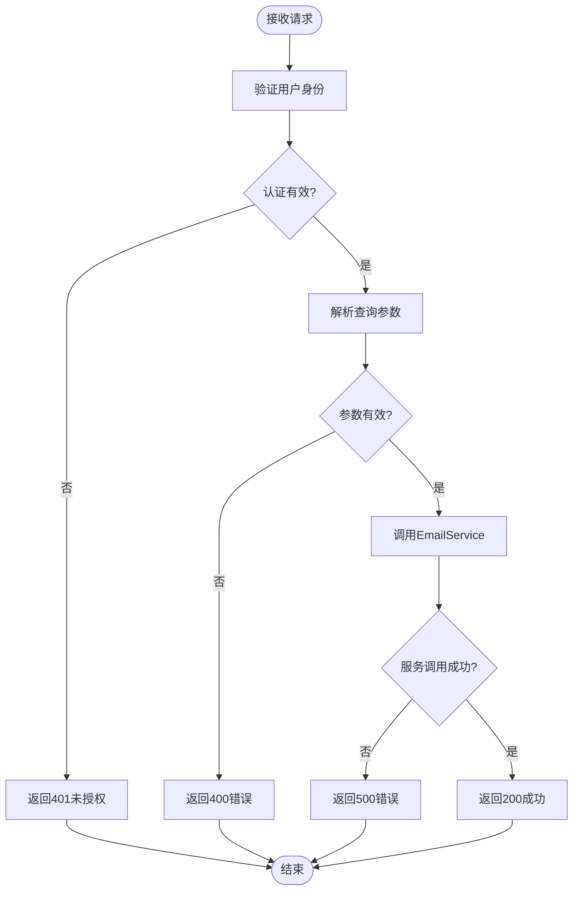

**图表来源**
- [email.go](file://backend/internal/handler/email.go#L31-L62)
- [email.go](file://backend/internal/handler/email.go#L66-L90)

**章节来源**
- [email.go](file://backend/internal/handler/email.go#L1-L108)

### 搜索Handler (search.go)

搜索Handler实现基于语义向量的智能搜索功能：

#### 搜索特性
- 语义相似度搜索
- 多维度过滤（发送者、时间范围、上下文）
- 可配置结果限制
- 性能监控和日志记录

#### 搜索流程
1. 验证用户身份
2. 解析查询参数
3. 应用过滤器
4. 执行向量搜索
5. 返回结果和统计信息

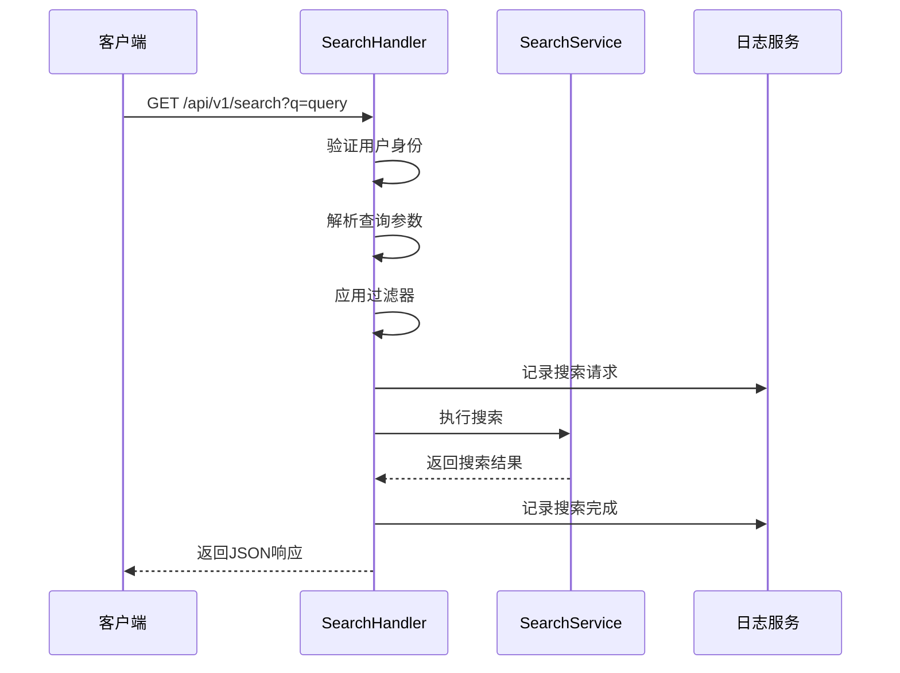

**图表来源**
- [search.go](file://backend/internal/handler/search.go#L32-L127)

**章节来源**
- [search.go](file://backend/internal/handler/search.go#L1-L128)

### 任务Handler (task.go)

任务Handler提供完整的任务管理功能，支持CRUD操作和状态变更：

#### 支持的操作
- 创建任务（标题、描述、截止日期、源邮件ID）
- 列出任务（支持状态和优先级过滤）
- 更新任务状态和属性
- 删除任务

#### 错误处理
- 详细的参数验证
- 业务逻辑错误区分
- 统一的状态码映射

**章节来源**
- [task.go](file://backend/internal/handler/task.go#L1-L235)

### 健康检查Handler (health.go)

健康检查Handler提供系统状态监控功能：

#### 监控指标
- 数据库连接状态
- PostgreSQL向量扩展状态
- 服务可用性

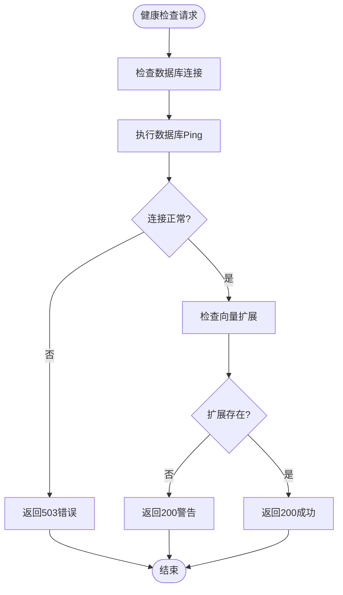

**图表来源**
- [health.go](file://backend/internal/handler/health.go#L18-L45)

**章节来源**
- [health.go](file://backend/internal/handler/health.go#L1-L46)

## 依赖注入机制

EchoMind使用Container模式实现依赖注入，通过构造函数传递Service层实例：

### Container设计

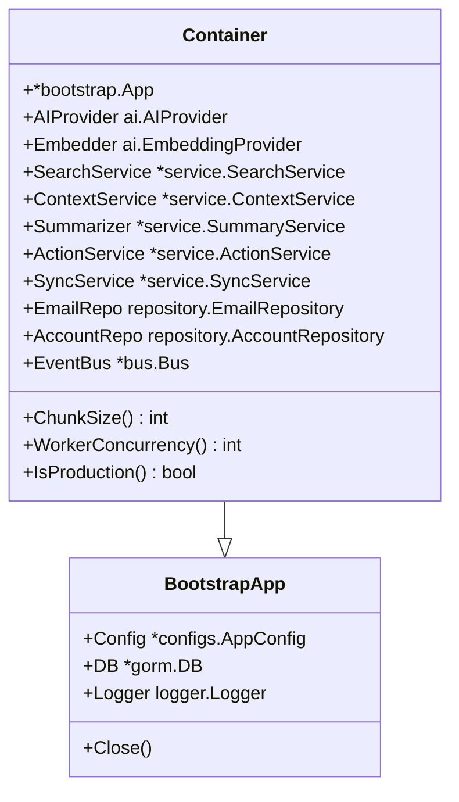

**图表来源**
- [container.go](file://backend/internal/app/container.go#L15-L29)

### Handler初始化流程

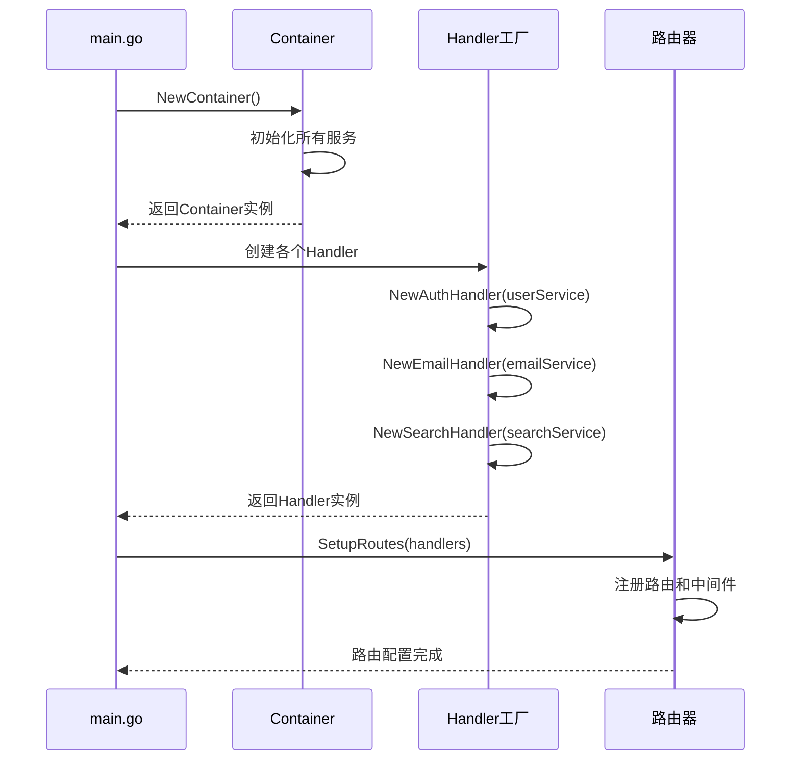

**图表来源**
- [main.go](file://backend/cmd/main.go#L69-L105)
- [container.go](file://backend/internal/app/container.go#L31-L100)

**章节来源**
- [container.go](file://backend/internal/app/container.go#L1-L122)
- [main.go](file://backend/cmd/main.go#L69-L105)

## 错误处理策略

EchoMind的Handler层采用统一的错误处理模式，确保一致的响应格式和状态码：

### 错误响应模式

| HTTP状态码 | 场景 | 响应格式 |
|-----------|------|----------|
| 200 | 成功操作 | `{data}` |
| 201 | 资源创建成功 | `{message, resource}` |
| 204 | 成功但无内容 | `{}` |
| 400 | 请求参数错误 | `{error: "message"}` |
| 401 | 未授权访问 | `{error: "message"}` |
| 403 | 权限不足 | `{error: "message"}` |
| 404 | 资源不存在 | `{error: "message"}` |
| 409 | 资源冲突 | `{error: "message"}` |
| 500 | 服务器内部错误 | `{error: "message"}` |

### 错误处理流程

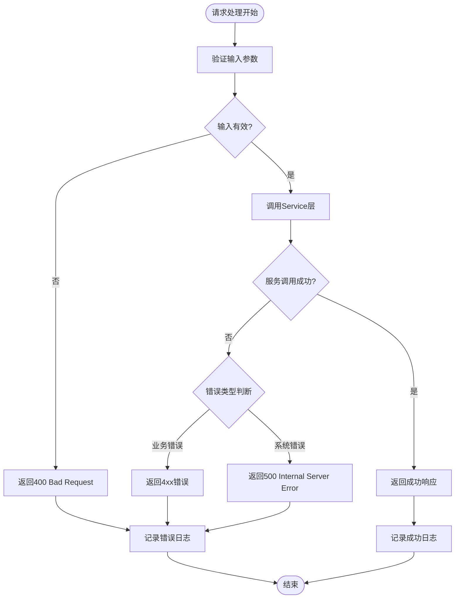

### 具体错误处理示例

#### 认证Handler错误处理
- 用户已存在：409 Conflict
- 凭据无效：401 Unauthorized  
- 服务错误：500 Internal Server Error

#### 邮件Handler错误处理
- 用户未认证：401 Unauthorized
- 邮件ID格式错误：400 Bad Request
- 邮件不存在：404 Not Found

**章节来源**
- [auth.go](file://backend/internal/handler/auth.go#L35-L42)
- [email.go](file://backend/internal/handler/email.go#L32-L36)
- [email.go](file://backend/internal/handler/email.go#L75-L78)

## 最佳实践指南

### 添加新API端点的完整示例

以下是如何为新的功能添加API端点的完整流程：

#### 1. 定义请求结构体

```go
// 新功能：创建新的上下文
type CreateContextRequest struct {
    Name        string `json:"name" binding:"required,min=1,max=100"`
    Description string `json:"description" binding:"max=500"`
    Type        string `json:"type" binding:"required,oneof=personal work project"`
}
```

#### 2. 实现Handler方法

```go
func (h *ContextHandler) CreateContext(c *gin.Context) {
    userID := c.MustGet("userID").(uuid.UUID)
    
    var req CreateContextRequest
    if err := c.ShouldBindJSON(&req); err != nil {
        c.JSON(http.StatusBadRequest, gin.H{"error": err.Error()})
        return
    }
    
    ctx, err := h.contextService.CreateContext(userID, model.ContextInput{
        Name:        req.Name,
        Description: req.Description,
        Type:        req.Type,
    })
    if err != nil {
        c.JSON(http.StatusInternalServerError, gin.H{"error": err.Error()})
        return
    }
    
    c.JSON(http.StatusCreated, ctx)
}
```

#### 3. 在Container中注册Service

```go
// 在container.go中添加
type Container struct {
    // ... 现有字段
    ContextService *service.ContextService
}

func NewContainer(configPath string, isProduction bool) (*Container, error) {
    // ... 现有初始化代码
    
    contextService := service.NewContextService(app.DB)
    
    return &Container{
        // ... 现有字段赋值
        ContextService: contextService,
    }, nil
}
```

#### 4. 在Handler工厂中创建Handler

```go
// 在main.go中添加
contextHandler := handler.NewContextHandler(container.ContextService)
```

#### 5. 在路由中注册端点

```go
// 在routes.go中添加
protected.POST("/contexts", h.Context.CreateContext)
```

### 中间件使用示例

#### JWT验证中间件

```go
// 在middleware.go中
func AuthMiddleware(jwtCfg configs.JWTConfig) gin.HandlerFunc {
    return func(c *gin.Context) {
        authHeader := c.GetHeader("Authorization")
        if authHeader == "" {
            c.JSON(http.StatusUnauthorized, gin.H{"error": "Authorization header required"})
            c.Abort()
            return
        }
        
        // 解析JWT令牌
        tokenString := strings.SplitN(authHeader, " ", 2)[1]
        claims, err := utils.ParseToken(tokenString, jwtCfg.Secret)
        if err != nil {
            c.JSON(http.StatusUnauthorized, gin.H{"error": "Invalid or expired token"})
            c.Abort()
            return
        }
        
        // 存储用户ID到上下文
        c.Set(ContextUserIDKey, claims.UserID)
        c.Next()
    }
}
```

### 参数验证最佳实践

#### 结构体标签验证
```go
type CreateUserRequest struct {
    Email    string `json:"email" binding:"required,email"`
    Password string `json:"password" binding:"required,min=8,max=100"`
    Name     string `json:"name" binding:"required,min=1,max=50"`
    Age      int    `json:"age" binding:"gte=18,lte=120"`
}
```

#### 自定义验证器
```go
func validateCustomField(field string) error {
    if field == "invalid_value" {
        return fmt.Errorf("custom validation failed")
    }
    return nil
}
```

## 故障排除指南

### 常见问题及解决方案

#### 1. 参数校验失败

**问题症状：**
- 返回400 Bad Request
- 错误信息显示字段验证失败

**解决方案：**
```go
// 检查结构体标签是否正确
type ExampleRequest struct {
    Field string `json:"field" binding:"required,min=5"` // 确保min值合理
}

// 检查请求体格式
// 正确：{"field": "value"}
// 错误：field=value 或 {"field": ""}
```

#### 2. 上下文传递错误

**问题症状：**
- 用户ID未找到
- 401 Unauthorized错误

**解决方案：**
```go
// 确保中间件正确设置用户ID
func (h *ExampleHandler) SomeMethod(c *gin.Context) {
    // 方法1：使用中间件提供的函数
    userID, ok := middleware.GetUserIDFromContext(c)
    if !ok {
        c.JSON(http.StatusUnauthorized, gin.H{"error": "User ID not found in context"})
        return
    }
    
    // 方法2：直接从上下文中获取
    userID := c.MustGet("userID").(uuid.UUID)
}
```

#### 3. 依赖注入问题

**问题症状：**
- Handler初始化失败
- 服务未找到错误

**解决方案：**
```go
// 确保在Container中正确初始化服务
func NewContainer(configPath string, isProduction bool) (*Container, error) {
    // 确保所有必需的服务都已初始化
    searchService := service.NewSearchService(app.DB, embedder)
    
    return &Container{
        SearchService: searchService,
        // ... 其他服务
    }, nil
}
```

#### 4. 路由注册问题

**问题症状：**
- 404 Not Found错误
- 路由未找到

**解决方案：**
```go
// 确保路由正确注册
func SetupRoutes(router *gin.Engine, h *Handlers, authMiddleware gin.HandlerFunc) {
    api := router.Group("/api/v1")
    {
        // 确保路径和方法匹配
        protected.POST("/contexts", h.Context.CreateContext)
    }
}
```

### 调试技巧

#### 启用调试日志
```go
// 在Handler中添加调试信息
func (h *ExampleHandler) DebugMethod(c *gin.Context) {
    h.logger.Debug("Debug information", 
        logger.String("param", c.Query("param")),
        logger.Any("context", c.Keys),
    )
}
```

#### 参数验证调试
```go
func (h *ExampleHandler) ValidateMethod(c *gin.Context) {
    var req SomeRequest
    if err := c.ShouldBindJSON(&req); err != nil {
        // 记录详细的验证错误
        h.logger.Error("Validation failed", 
            logger.Error(err),
            logger.String("raw_body", string(c.Request.Body)),
        )
        c.JSON(http.StatusBadRequest, gin.H{"error": err.Error()})
        return
    }
}
```

**章节来源**
- [auth.go](file://backend/internal/middleware/auth.go#L18-L60)
- [context.go](file://backend/internal/handler/context.go#L21-L36)

## 总结

EchoMind的Handler层展现了现代Go Web应用的最佳实践，通过以下关键特性实现了高质量的API设计：

### 核心优势

1. **清晰的架构分层**：Handler层专注于HTTP协议处理，与Service层保持职责分离
2. **统一的错误处理**：标准化的响应格式和状态码映射
3. **强大的依赖注入**：通过Container模式实现松耦合设计
4. **完善的中间件体系**：支持认证、CORS、请求追踪等功能
5. **类型安全的参数验证**：利用Gin的结构体标签实现自动验证

### 设计原则

- **单一职责**：每个Handler只负责特定功能域的API
- **依赖倒置**：Handler依赖抽象接口而非具体实现
- **开闭原则**：易于扩展新功能而无需修改现有代码
- **接口隔离**：最小化接口暴露，提高安全性

### 扩展建议

1. **API版本控制**：考虑引入版本号机制
2. **速率限制**：添加请求频率控制
3. **请求验证**：实现更复杂的业务规则验证
4. **性能监控**：集成APM工具进行性能分析

通过遵循这些设计原则和最佳实践，EchoMind的Handler层为构建可维护、可扩展的企业级Web应用提供了坚实的基础。