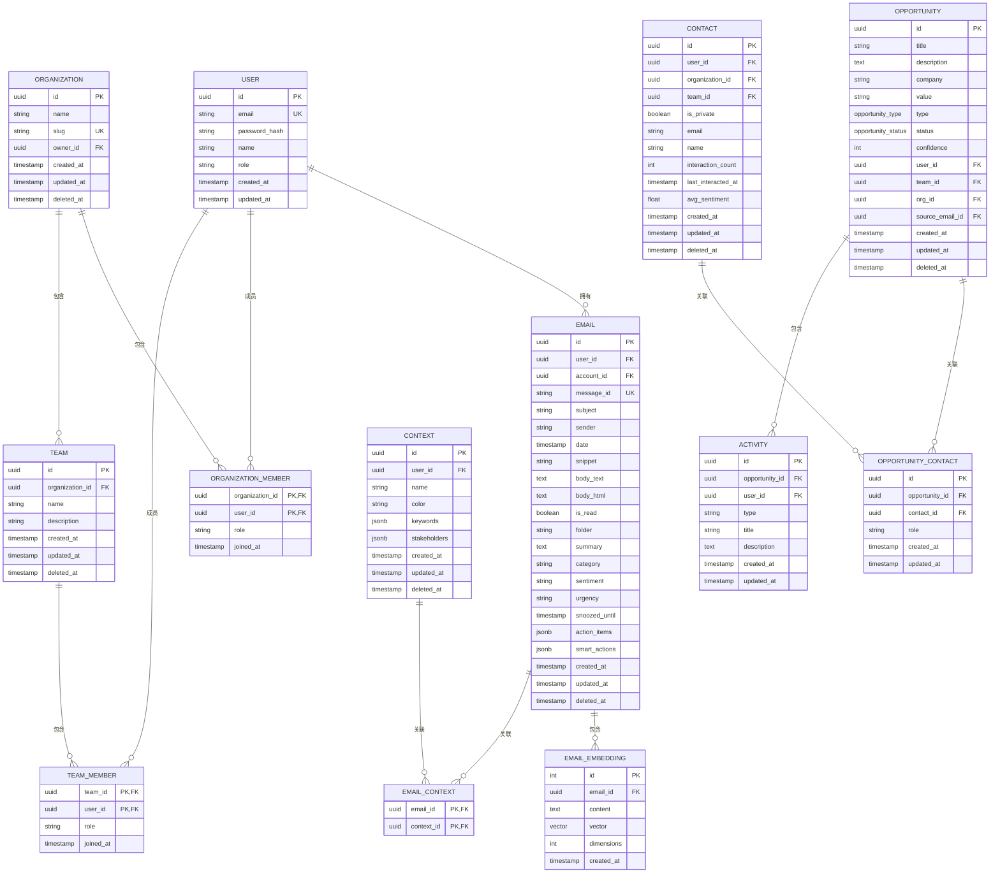

# Model层

<cite>
**本文档中引用的文件**  
- [email.go](file://backend/internal/model/email.go)
- [user.go](file://backend/internal/model/user.go)
- [organization.go](file://backend/internal/model/organization.go)
- [team.go](file://backend/internal/model/team.go)
- [member.go](file://backend/internal/model/member.go)
- [team_member.go](file://backend/internal/model/team_member.go)
- [context.go](file://backend/internal/model/context.go)
- [contact.go](file://backend/internal/model/contact.go)
- [task.go](file://backend/internal/model/task.go)
- [opportunity.go](file://backend/internal/model/opportunity.go)
- [embedding.go](file://backend/internal/model/embedding.go)
- [email_account.go](file://backend/internal/model/email_account.go)
- [account_input.go](file://backend/internal/model/account_input.go)
- [context_input.go](file://backend/internal/model/context_input.go)
- [001_update_vector_dimensions.sql](file://backend/migrations/001_update_vector_dimensions.sql)
</cite>

## 目录
1. [简介](#简介)
2. [核心数据模型](#核心数据模型)
3. [模型间关系与关联查询](#模型间关系与关联查询)
4. [输入模型与API参数校验](#输入模型与api参数校验)
5. [新数据模型定义流程](#新数据模型定义流程)
6. [总结](#总结)

## 简介
本文档全面介绍`backend/internal/model`目录下的所有数据结构定义，涵盖实体模型、输入模型、枚举类型及数据库迁移策略。重点分析`Email`、`User`、`Organization`等核心结构体的字段含义、GORM标签及其对应的数据库表结构，阐明模型间的关联关系与查询机制，并说明如何通过GORM进行高效的数据操作。

## 核心数据模型

### Email模型
`Email`结构体表示存储在数据库中的邮件消息，包含邮件的基本信息、AI生成的元数据以及用户交互状态。

**字段说明：**
- `ID`: 邮件唯一标识符，使用UUID类型，GORM标签`primary_key`指定为主键
- `UserID`: 所属用户ID，`not null`确保每封邮件必须关联一个用户
- `AccountID`: 关联的邮箱账户ID，用于多账户支持
- `MessageID`: 邮件唯一消息ID，`uniqueIndex`保证全局唯一性
- `Subject`, `Sender`, `Date`: 邮件主题、发件人和日期
- `BodyText`, `BodyHTML`: 邮件正文的纯文本和HTML内容，使用`type:text`指定数据库字段类型
- `IsRead`: 邮件已读状态，默认为`false`
- `Folder`: 邮件文件夹（如INBOX），默认值为'INBOX'
- `Summary`, `Category`, `Sentiment`, `Urgency`: AI生成的摘要、分类、情感分析和紧急程度
- `SnoozedUntil`: 邮件延迟提醒时间，`index`便于快速查询
- `ActionItems`, `SmartActions`: 存储提取的任务项和智能操作，使用`type:jsonb`支持JSONB类型

**数据库表结构：**
- 表名：`emails`
- 主键：`id`
- 索引：`user_id`, `account_id`, `message_id`, `snoozed_until`, `deleted_at`
- 唯一约束：`message_id`

**Section sources**
- [email.go](file://backend/internal/model/email.go#L11-L36)

### User模型
`User`结构体表示系统中的注册用户，包含用户的基本信息和身份认证数据。

**字段说明：**
- `ID`: 用户唯一标识符，UUID类型主键
- `Email`: 用户邮箱，`uniqueIndex`确保唯一性，`not null`为必填项
- `PasswordHash`: 密码哈希值，使用bcrypt算法加密存储
- `Name`: 用户姓名
- `Role`: 用户角色，默认为'manager'
- `Memberships`, `TeamMemberships`: 用户与组织、团队的关联关系

**数据库表结构：**
- 表名：`users`
- 主键：`id`
- 索引：`email`
- 唯一约束：`email`

**Section sources**
- [user.go](file://backend/internal/model/user.go#L10-L22)

### Organization模型
`Organization`结构体表示用户所属的组织，支持多组织架构。

**字段说明：**
- `ID`: 组织唯一标识符，UUID类型主键
- `Name`: 组织名称，`not null`为必填项
- `Slug`: URL友好标识符，`uniqueIndex`确保唯一性
- `OwnerID`: 组织所有者ID，指向`User`模型
- `Members`: 组织成员列表，通过`OrganizationMember`关联表实现多对多关系

**数据库表结构：**
- 表名：`organizations`
- 主键：`id`
- 索引：`slug`, `owner_id`, `deleted_at`

**Section sources**
- [organization.go](file://backend/internal/model/organization.go#L10-L21)

### Team模型
`Team`结构体表示组织内的团队，支持团队协作功能。

**字段说明：**
- `ID`: 团队唯一标识符，UUID类型主键
- `OrganizationID`: 所属组织ID，`not null;index`确保性能
- `Name`: 团队名称，`not null`为必填项
- `Description`: 团队描述
- `Organization`: 组织关联，`foreignKey:OrganizationID`指定外键
- `Members`: 团队成员列表，通过`TeamMember`关联表实现

**数据库表结构：**
- 表名：`teams`
- 主键：`id`
- 索引：`organization_id`, `deleted_at`

**Section sources**
- [team.go](file://backend/internal/model/team.go#L10-L22)

### Contact模型
`Contact`结构体表示联系人信息，支持个人和组织共享模式。

**字段说明：**
- `UserID`, `OrganizationID`, `TeamID`: 所有权标识，可为空表示共享联系人
- `IsPrivate`: 私有标志，默认为`true`
- `Email`, `Name`: 联系人邮箱和姓名
- `InteractionCount`, `LastInteractedAt`: 交互统计信息
- `AvgSentiment`: 平均情感得分，范围-1.0到1.0

**数据库表结构：**
- 表名：`contacts`
- 主键：`id`
- 索引：`user_id`, `organization_id`, `team_id`, `email`

**Section sources**
- [contact.go](file://backend/internal/model/contact.go#L10-L26)

### Task模型
`Task`结构体表示任务项，支持任务管理功能。

**字段说明：**
- `Status`, `Priority`: 任务状态和优先级，使用枚举类型
- `SourceEmailID`: 可选的源邮件ID，建立与邮件的关联
- `ContextID`: 可选的上下文ID，用于项目管理
- `DueDate`: 截止日期，可为空
- `NotifyWeChat`: 微信通知标志

**数据库表结构：**
- 表名：`tasks`
- 主键：`id`
- 索引：`user_id`, `source_email_id`, `context_id`, `deleted_at`

**Section sources**
- [task.go](file://backend/internal/model/task.go#L22-L44)

### Opportunity模型
`Opportunity`结构体表示商业机会，支持销售管理功能。

**字段说明：**
- `Type`, `Status`: 机会类型和状态，使用自定义数据库类型
- `Confidence`: 机会信心值，0-100范围
- `Contacts`: 关联的联系人列表，通过`opportunity_contacts`关联表实现多对多关系
- `Activities`: 关联的活动列表

**数据库表结构：**
- 表名：`opportunities`
- 主键：`id`
- 索引：`user_id`, `team_id`, `org_id`, `source_email_id`, `deleted_at`

**Section sources**
- [opportunity.go](file://backend/internal/model/opportunity.go#L31-L88)

### EmailEmbedding模型
`EmailEmbedding`结构体表示邮件内容的向量嵌入，用于语义搜索。

**字段说明：**
- `EmailID`: 关联的邮件ID，`index`便于查询
- `Content`: 文本片段内容
- `Vector`: 向量数据，使用`pgvector`扩展的`vector(1024)`类型
- `Dimensions`: 向量维度，固定为1024
- `Email`: 邮件关联，`OnDelete:CASCADE`确保级联删除

**数据库表结构：**
- 表名：`email_embeddings`
- 主键：`id`
- 索引：`email_id`

**Section sources**
- [embedding.go](file://backend/internal/model/embedding.go#L10-L24)

## 模型间关系与关联查询

### 模型关系图


**Diagram sources**
- [email.go](file://backend/internal/model/email.go#L11-L36)
- [user.go](file://backend/internal/model/user.go#L10-L22)
- [organization.go](file://backend/internal/model/organization.go#L10-L21)
- [team.go](file://backend/internal/model/team.go#L10-L22)
- [member.go](file://backend/internal/model/member.go#L17-L26)
- [team_member.go](file://backend/internal/model/team_member.go#L9-L18)
- [embedding.go](file://backend/internal/model/embedding.go#L10-L24)
- [context.go](file://backend/internal/model/context.go#L12-L29)
- [opportunity.go](file://backend/internal/model/opportunity.go#L31-L88)
- [contact.go](file://backend/internal/model/contact.go#L10-L26)

### 关联查询示例
通过GORM的Preload功能可以实现高效的关联查询：

```go
// 查询用户及其所有邮件
var user User
db.Preload("Emails").First(&user, userID)

// 查询组织及其所有成员和团队
var org Organization
db.Preload("Members.User").Preload("Teams").First(&org, orgID)

// 查询邮件及其向量嵌入
var email Email
db.Preload("Embeddings").First(&email, emailID)

// 查询机会及其联系人和活动
var opportunity Opportunity
db.Preload("Contacts").Preload("Activities").First(&opportunity, oppID)
```

**Section sources**
- [user.go](file://backend/internal/model/user.go#L20-L21)
- [organization.go](file://backend/internal/model/organization.go#L20)
- [email.go](file://backend/internal/model/email.go)
- [opportunity.go](file://backend/internal/model/opportunity.go#L49-L50)

## 输入模型与API参数校验

### 输入模型设计
输入模型（Input Models）与实体模型分离，专门用于API请求参数的接收和校验，位于`backend/internal/model`目录下。

#### EmailAccountInput模型
`EmailAccountInput`结构体定义了连接或更新邮箱账户的输入结构。

**字段说明：**
- `Email`: 邮箱地址，`binding:"required,email"`确保必填且格式正确
- `ServerAddress`, `ServerPort`: IMAP服务器地址和端口，`binding:"required"`确保必填
- `Username`, `Password`: 登录凭据，`binding:"required"`确保必填
- `TeamID`, `OrganizationID`: 可选的团队或组织ID

**API参数校验：**
- 使用Gin框架的binding标签进行自动校验
- `required`: 字段必填
- `email`: 邮箱格式校验
- `min`, `max`: 数值范围校验
- `binding`标签与Gin的ShouldBindJSON等方法配合使用

```go
func ConnectAccount(c *gin.Context) {
    var input model.EmailAccountInput
    if err := c.ShouldBindJSON(&input); err != nil {
        // 自动返回校验错误
        c.JSON(http.StatusBadRequest, gin.H{"error": err.Error()})
        return
    }
    // 处理有效输入
}
```

#### ContextInput模型
`ContextInput`结构体定义了创建或更新上下文的输入结构。

**字段说明：**
- `Name`: 上下文名称，`binding:"required,max=100"`确保必填且长度不超过100
- `Color`: 颜色标识，`binding:"max=20"`限制长度
- `Keywords`, `Stakeholders`: 关键词和利益相关者列表

**Section sources**
- [account_input.go](file://backend/internal/model/account_input.go#L4-L14)
- [context_input.go](file://backend/internal/model/context_input.go#L4-L9)

## 新数据模型定义流程

### 1. 字段设计
定义新的Go结构体，遵循以下规范：
- 使用有意义的字段名
- 添加必要的GORM标签
- 考虑软删除（`DeletedAt`）
- 定义适当的索引以优化查询性能

### 2. 索引添加
根据查询模式添加索引：
- 频繁查询的字段添加`index`
- 唯一性约束使用`uniqueIndex`
- 复合索引考虑查询模式

### 3. 迁移脚本编写
参考`migrations/`目录下的SQL脚本创建数据库迁移。

```sql
-- 示例：更新向量维度的迁移脚本
ALTER TABLE email_embeddings 
ALTER COLUMN vector TYPE vector(1024) 
USING vector::text::vector(1024);
```

迁移脚本应包含：
- 版本化命名（如`001_...`）
- 清晰的注释说明
- 可逆的操作（如果需要）

### 4. 单元测试
为新模型编写单元测试，确保：
- 模型定义正确
- 数据库操作正常
- 关联关系工作正常

```go
func TestEmailModel(t *testing.T) {
    // 测试自动迁移
    if err := db.AutoMigrate(&model.Email{}); err != nil {
        t.Fatalf("Failed to migrate: %v", err)
    }
    
    // 测试创建操作
    email := model.Email{
        ID:        uuid.New(),
        UserID:    uuid.New(),
        MessageID: "<123@example.com>",
        Subject:   "Test Subject",
    }
    
    if err := db.Create(&email).Error; err != nil {
        t.Fatalf("Failed to create email: %v", err)
    }
    
    // 测试查询操作
    var readEmail model.Email
    if err := db.First(&readEmail, "message_id = ?", "<123@example.com>").Error; err != nil {
        t.Fatalf("Failed to query email: %v", err)
    }
}
```

**Section sources**
- [001_update_vector_dimensions.sql](file://backend/migrations/001_update_vector_dimensions.sql)
- [email_test.go](file://backend/internal/model/email_test.go#L13-L58)

## 总结
Model层是整个系统的核心数据抽象，通过精心设计的Go结构体和GORM标签实现了与数据库的无缝映射。实体模型与输入模型的分离设计提高了系统的安全性和可维护性，而丰富的关联关系支持了复杂的业务场景。通过遵循标准化的模型定义流程，可以确保数据结构的一致性和可靠性。