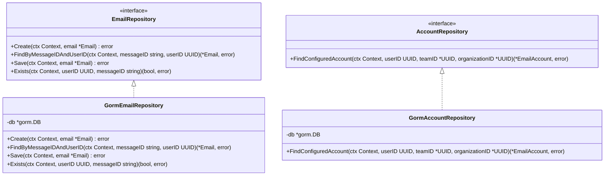
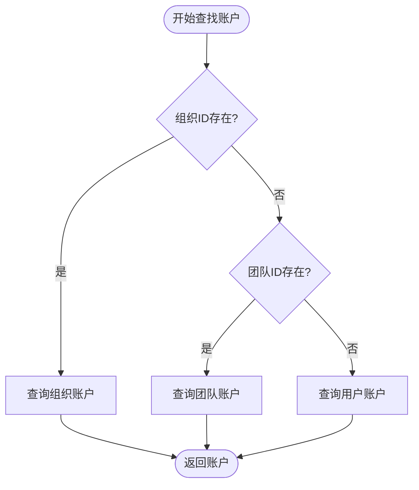
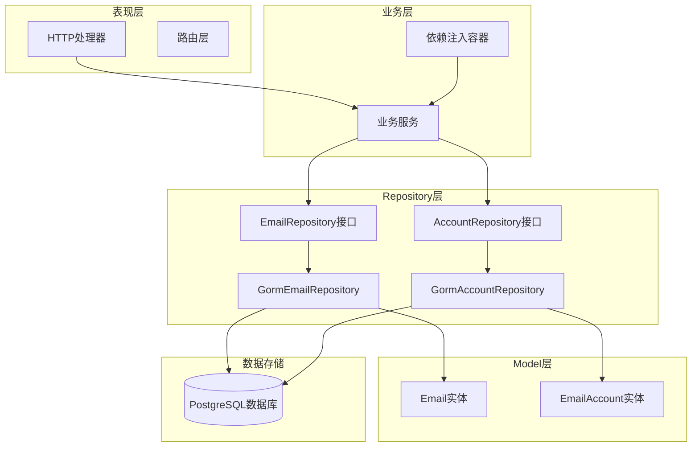
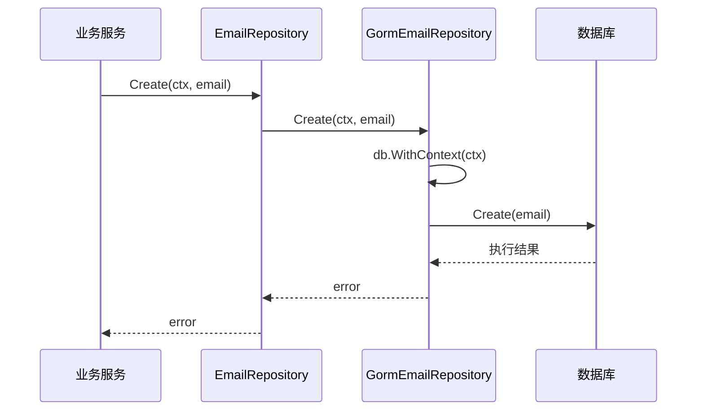
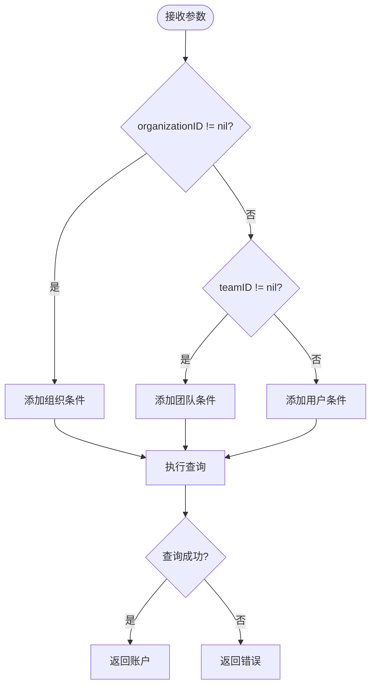
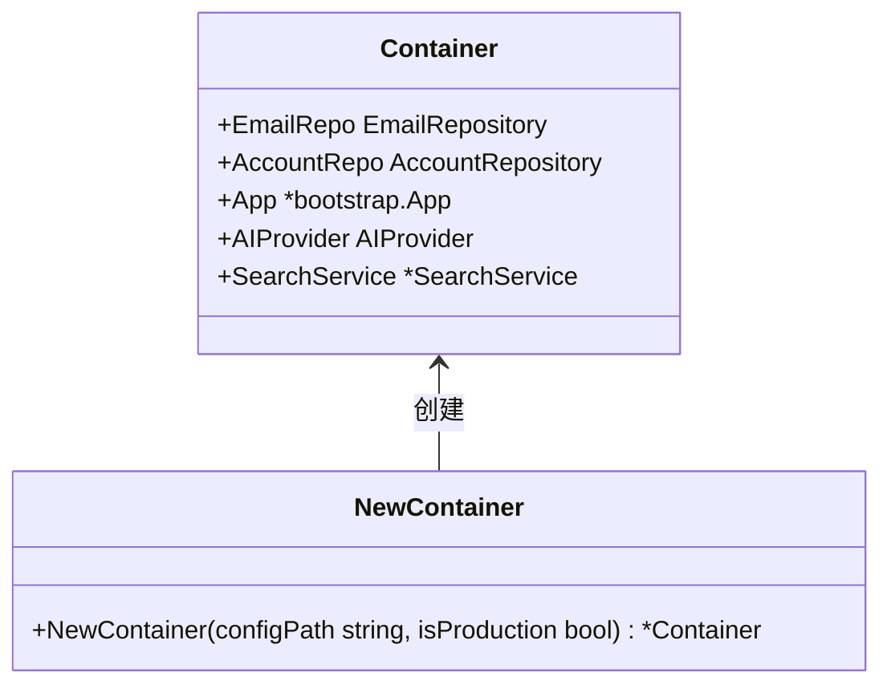
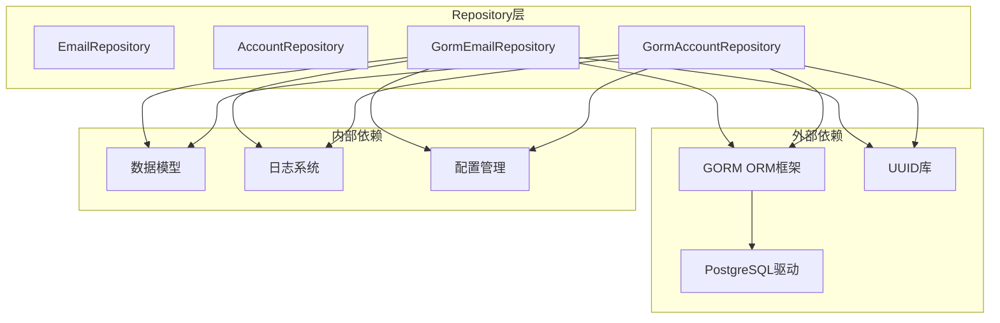

# Repository层技术文档

<cite>
**本文档中引用的文件**
- [email_repository.go](file://backend/internal/repository/email_repository.go)
- [account_repository.go](file://backend/internal/repository/account_repository.go)
- [email.go](file://backend/internal/model/email.go)
- [email_account.go](file://backend/internal/model/email_account.go)
- [email.go](file://backend/internal/service/email.go)
- [email_ingestor.go](file://backend/internal/service/email_ingestor.go)
- [sync.go](file://backend/internal/service/sync.go)
- [container.go](file://backend/internal/app/container.go)
- [postgres.go](file://backend/pkg/database/postgres.go)
</cite>

## 目录
1. [概述](#概述)
2. [Repository模式设计](#repository模式设计)
3. [核心组件分析](#核心组件分析)
4. [架构概览](#架构概览)
5. [详细组件分析](#详细组件分析)
6. [依赖关系分析](#依赖关系分析)
7. [最佳实践指南](#最佳实践指南)
8. [故障排除指南](#故障排除指南)
9. [总结](#总结)

## 概述

Repository层是EchoMind应用架构中的关键数据访问抽象层，负责将上层业务逻辑与底层数据库操作完全解耦。该层采用GORM作为ORM框架，通过接口抽象实现了数据访问的统一管理和可测试性。

Repository层的核心价值在于：
- **抽象数据访问逻辑**：将GORM的具体实现封装在接口之后
- **提高可测试性**：通过接口注入可以轻松进行单元测试
- **增强可扩展性**：支持多种数据库后端的切换
- **隔离业务逻辑**：确保业务服务专注于业务规则而非数据持久化细节

## Repository模式设计

### 接口设计原则

Repository层遵循Clean Architecture的设计原则，通过接口定义数据访问契约：



**图表来源**
- [email_repository.go](file://backend/internal/repository/email_repository.go#L11-L21)
- [account_repository.go](file://backend/internal/repository/account_repository.go#L11-L16)
- [email_repository.go](file://backend/internal/repository/email_repository.go#L23-L26)
- [account_repository.go](file://backend/internal/repository/account_repository.go#L18-L21)

### 设计模式特点

1. **单一职责原则**：每个Repository只负责特定实体的数据访问
2. **依赖倒置原则**：高层模块不依赖低层模块，都依赖于抽象
3. **接口隔离原则**：客户端不应该被迫依赖它们不需要的接口
4. **开闭原则**：对扩展开放，对修改关闭

**章节来源**
- [email_repository.go](file://backend/internal/repository/email_repository.go#L11-L21)
- [account_repository.go](file://backend/internal/repository/account_repository.go#L11-L16)

## 核心组件分析

### EmailRepository详解

EmailRepository是处理邮件数据的核心Repository，提供了完整的CRUD操作和业务查询方法。

#### 核心方法分析

| 方法名 | 功能描述 | 参数说明 | 返回值 |
|--------|----------|----------|--------|
| Create | 创建新邮件记录 | ctx: 上下文<br/>email: 邮件实体 | error |
| FindByMessageIDAndUserID | 按Message-ID和用户ID查找邮件 | messageID: 消息标识<br/>userID: 用户UUID | 邮件实体或错误 |
| Save | 更新现有邮件记录 | ctx: 上下文<br/>email: 邮件实体 | error |
| Exists | 检查邮件是否存在 | userID: 用户UUID<br/>messageID: 消息标识 | 存在状态和错误 |

#### 实现特点

1. **上下文支持**：所有方法都接受context.Context参数，支持超时和取消操作
2. **错误处理**：统一返回error类型，便于上层业务逻辑处理
3. **GORM集成**：直接使用GORM的链式查询语法，保持简洁性

**章节来源**
- [email_repository.go](file://backend/internal/repository/email_repository.go#L14-L20)
- [email_repository.go](file://backend/internal/repository/email_repository.go#L34-L66)

### AccountRepository详解

AccountRepository专门处理邮件账户配置数据，实现了基于权限层次的账户查找策略。

#### 权限优先级策略



**图表来源**
- [account_repository.go](file://backend/internal/repository/account_repository.go#L33-L40)

#### 查询逻辑特点

1. **层级优先**：Organization > Team > User，确保最合适的账户配置
2. **灵活参数**：teamID和organizationID都是可选参数
3. **空值安全**：正确处理nil指针情况

**章节来源**
- [account_repository.go](file://backend/internal/repository/account_repository.go#L14-L16)
- [account_repository.go](file://backend/internal/repository/account_repository.go#L29-L47)

## 架构概览

Repository层在整个应用架构中扮演着数据访问抽象层的角色，与Service层和Model层形成清晰的分层结构。



**图表来源**
- [container.go](file://backend/internal/app/container.go#L69-L72)
- [email_repository.go](file://backend/internal/repository/email_repository.go#L23-L26)
- [account_repository.go](file://backend/internal/repository/account_repository.go#L18-L21)

**章节来源**
- [container.go](file://backend/internal/app/container.go#L15-L29)
- [email_repository.go](file://backend/internal/repository/email_repository.go#L1-L10)
- [account_repository.go](file://backend/internal/repository/account_repository.go#L1-L10)

## 详细组件分析

### EmailRepository实现分析

#### Create方法实现

Create方法展示了Repository层的标准实现模式：



**图表来源**
- [email_repository.go](file://backend/internal/repository/email_repository.go#L34-L36)
- [email.go](file://backend/internal/service/email.go#L103-L105)

#### FindByMessageIDAndUserID方法

该方法体现了Repository层的查询封装能力：

1. **参数验证**：确保传入的有效性
2. **GORM查询**：使用链式语法构建查询
3. **错误处理**：区分记录不存在和其他错误
4. **上下文传递**：支持超时和取消机制

**章节来源**
- [email_repository.go](file://backend/internal/repository/email_repository.go#L38-L48)
- [email.go](file://backend/internal/service/email.go#L78-L88)

### AccountRepository实现分析

#### FindConfiguredAccount方法

该方法展示了Repository层处理复杂业务逻辑的能力：



**图表来源**
- [account_repository.go](file://backend/internal/repository/account_repository.go#L29-L47)

**章节来源**
- [account_repository.go](file://backend/internal/repository/account_repository.go#L29-L47)

### 依赖注入容器集成

Repository实例通过依赖注入容器创建和管理：



**图表来源**
- [container.go](file://backend/internal/app/container.go#L17-L28)
- [container.go](file://backend/internal/app/container.go#L31-L99)

**章节来源**
- [container.go](file://backend/internal/app/container.go#L69-L72)
- [container.go](file://backend/internal/app/container.go#L31-L99)

## 依赖关系分析

Repository层的依赖关系体现了良好的分层架构设计：



**图表来源**
- [email_repository.go](file://backend/internal/repository/email_repository.go#L3-L9)
- [account_repository.go](file://backend/internal/repository/account_repository.go#L3-L9)
- [postgres.go](file://backend/pkg/database/postgres.go#L1-L16)

### 循环依赖避免

Repository层通过以下方式避免循环依赖：

1. **单向依赖**：Repository依赖Model，但Model不依赖Repository
2. **接口抽象**：通过接口定义避免具体实现的循环依赖
3. **分层隔离**：严格遵循Clean Architecture的分层原则

**章节来源**
- [email_repository.go](file://backend/internal/repository/email_repository.go#L1-L10)
- [account_repository.go](file://backend/internal/repository/account_repository.go#L1-L10)

## 最佳实践指南

### 新增Repository方法指导

#### 1. 定义查询参数结构体

对于复杂的查询需求，建议定义专门的查询参数结构体：

```go
// 示例：邮件列表查询参数
type EmailListParams struct {
    UserID     uuid.UUID
    ContextID  string
    Folder     string
    Category   string
    Filter     string
    Limit      int
    Offset     int
    SortField  string
    SortOrder  string
}
```

#### 2. 实现查询方法

```go
// EmailRepository接口扩展
type EmailRepository interface {
    // 现有方法...
    
    // 新增方法
    ListEmails(ctx context.Context, params EmailListParams) ([]*model.Email, error)
}

// 实现方法
func (r *GormEmailRepository) ListEmails(ctx context.Context, params EmailListParams) ([]*model.Email, error) {
    var emails []*model.Email
    query := r.db.WithContext(ctx).Where("user_id = ?", params.UserID)
    
    // 应用过滤条件
    if params.ContextID != "" {
        query = query.Joins("JOIN email_contexts ON emails.id = email_contexts.email_id").
               Where("email_contexts.context_id = ?", params.ContextID)
    }
    
    // 应用排序
    sortField := params.SortField
    if sortField == "" {
        sortField = "date"
    }
    sortOrder := params.SortOrder
    if sortOrder == "" {
        sortOrder = "DESC"
    }
    query = query.Order(fmt.Sprintf("%s %s", sortField, sortOrder))
    
    // 分页处理
    if params.Limit > 0 {
        query = query.Limit(params.Limit)
    }
    if params.Offset > 0 {
        query = query.Offset(params.Offset)
    }
    
    if err := query.Find(&emails).Error; err != nil {
        return nil, err
    }
    
    return emails, nil
}
```

#### 3. 错误处理最佳实践

```go
// 统一错误处理包装
func (r *GormEmailRepository) Create(ctx context.Context, email *model.Email) error {
    err := r.db.WithContext(ctx).Create(email).Error
    if err != nil {
        return fmt.Errorf("failed to create email: %w", err)
    }
    return nil
}
```

#### 4. SQL性能优化建议

1. **索引优化**：确保查询字段上有适当的索引
2. **查询限制**：避免全表扫描，使用LIMIT和OFFSET
3. **连接优化**：合理使用JOIN，避免笛卡尔积
4. **批量操作**：对于大量数据操作，考虑使用批量插入/更新

### 测试策略

#### 单元测试示例

```go
func TestGormEmailRepository_Create(t *testing.T) {
    // 准备测试数据
    db, mock, err := sqlmock.New()
    assert.NoError(t, err)
    defer db.Close()
    
    gormDB, err := gorm.Open(mysql.New(mysql.Config{
        DriverName: "mysql",
        Conn:       db,
    }), &gorm.Config{})
    assert.NoError(t, err)
    
    repo := NewEmailRepository(gormDB)
    
    // 设置期望的SQL和结果
    mock.ExpectBegin()
    mock.ExpectExec("INSERT INTO emails").
        WillReturnResult(sqlmock.NewResult(1, 1))
    mock.ExpectCommit()
    
    // 执行测试
    email := &model.Email{ /* 测试数据 */ }
    err = repo.Create(context.Background(), email)
    
    // 验证结果
    assert.NoError(t, err)
    assert.NoError(t, mock.ExpectationsWereMet())
}
```

## 故障排除指南

### 常见问题及解决方案

#### 1. 连接池耗尽

**问题现象**：出现数据库连接超时或连接池耗尽错误

**解决方案**：
- 检查数据库连接池配置
- 确保Repository实例正确关闭
- 使用连接池监控工具

#### 2. 查询性能问题

**问题现象**：某些查询响应时间过长

**诊断步骤**：
1. 启用GORM查询日志
2. 分析慢查询日志
3. 检查索引使用情况
4. 优化查询条件

#### 3. 并发访问冲突

**问题现象**：出现数据竞争或事务冲突

**解决方案**：
- 使用适当的事务隔离级别
- 实现乐观锁机制
- 考虑使用分布式锁

**章节来源**
- [email_repository.go](file://backend/internal/repository/email_repository.go#L34-L36)
- [account_repository.go](file://backend/internal/repository/account_repository.go#L29-L47)

## 总结

Repository层作为EchoMind应用架构中的重要组成部分，成功实现了以下目标：

### 核心优势

1. **清晰的职责分离**：Repository专注于数据访问，业务服务专注于业务逻辑
2. **高度的可测试性**：通过接口抽象，可以轻松进行单元测试和集成测试
3. **良好的可扩展性**：支持多种数据库后端和不同的数据访问策略
4. **统一的错误处理**：提供一致的错误处理机制和错误信息格式

### 技术特色

1. **GORM深度集成**：充分利用GORM的强大功能，同时保持接口的简洁性
2. **上下文支持**：全面支持Go的上下文机制，便于实现超时和取消功能
3. **类型安全**：通过强类型接口确保编译时的类型检查
4. **性能优化**：合理的查询设计和索引策略

### 发展方向

1. **缓存集成**：考虑引入Redis等缓存层，提升查询性能
2. **读写分离**：为高并发场景提供读写分离支持
3. **分布式事务**：支持跨服务的分布式事务处理
4. **监控告警**：集成数据库性能监控和告警机制

Repository层的设计充分体现了现代软件架构的最佳实践，为整个应用系统的稳定性和可维护性奠定了坚实的基础。