# Service层设计与实现深度解析

<cite>
**本文档引用的文件**
- [ai_draft.go](file://backend/internal/service/ai_draft.go)
- [search.go](file://backend/internal/service/search.go)
- [sync.go](file://backend/internal/service/sync.go)
- [ai_factory.go](file://backend/internal/service/ai_factory.go)
- [account.go](file://backend/internal/service/account.go)
- [email.go](file://backend/internal/service/email.go)
- [context.go](file://backend/internal/service/context.go)
- [chat.go](file://backend/internal/service/chat.go)
- [search_test.go](file://backend/internal/service/search_test.go)
- [sync_test.go](file://backend/internal/service/sync_test.go)
- [account_test.go](file://backend/internal/service/account_test.go)
- [context_test.go](file://backend/internal/service/context_test.go)
- [email.go](file://backend/internal/model/email.go)
- [context.go](file://backend/internal/model/context.go)
- [app_config.go](file://backend/configs/app_config.go)
- [search_cache.go](file://backend/internal/service/search_cache.go)
- [search_clustering.go](file://backend/internal/service/search_clustering.go)
- [search_summary.go](file://backend/internal/service/search_summary.go)
- [otel.go](file://backend/pkg/telemetry/otel.go)
- [metrics.go](file://backend/pkg/telemetry/metrics.go)
</cite>

## 更新摘要
**变更内容**
- 新增了OpenTelemetry集成的详细说明，包括配置、初始化和分布式追踪实现
- 扩展了SearchService以支持AI搜索聚类和摘要功能，新增了enable_clustering、enable_summary等查询参数
- 新增了SearchCache服务的详细指标说明，包括GetLatency、SetLatency、DeleteLatency等9个核心缓存指标
- 扩展了监控与可观测性章节，详细描述了性能监控指标和分布式追踪的实现方式
- 更新了架构图以反映新的服务依赖关系

## 目录
1. [概述](#概述)
2. [Service层架构设计](#service层架构设计)
3. [核心业务逻辑模块](#核心业务逻辑模块)
4. [依赖注入与工厂模式](#依赖注入与工厂模式)
5. [事务管理与异步处理](#事务管理与异步处理)
6. [错误处理与日志记录](#错误处理与日志记录)
7. [单元测试最佳实践](#单元测试最佳实践)
8. [性能优化策略](#性能优化策略)
9. [开发指南与最佳实践](#开发指南与最佳实践)
10. [总结](#总结)

## 概述

EchoMind的Service层是整个应用架构的核心业务逻辑层，负责封装复杂的业务规则和数据处理逻辑。该层采用清晰的职责分离原则，将业务逻辑从控制器和数据访问层中抽象出来，提供了高度可测试性和可维护性的代码结构。

Service层的主要特点包括：
- **业务规则封装**：将复杂的业务逻辑集中管理
- **依赖注入**：通过构造函数注入实现松耦合
- **接口隔离**：定义清晰的接口边界
- **事务管理**：确保数据一致性
- **异步处理**：支持后台任务调度
- **错误处理**：统一的错误传播机制
- **可观测性**：通过OpenTelemetry实现全面的监控和追踪

## Service层架构设计

### 整体架构图

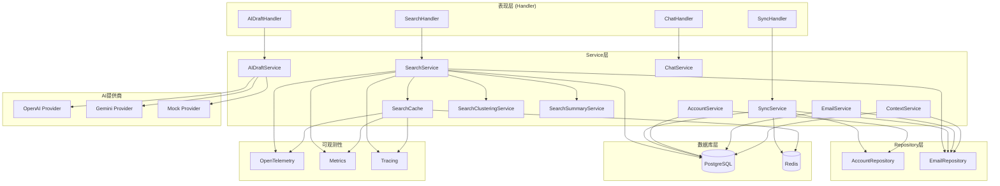

**图表来源**
- [ai_draft.go](file://backend/internal/service/ai_draft.go#L9-L20)
- [search.go](file://backend/internal/service/search.go#L17-L27)
- [sync.go](file://backend/internal/service/sync.go#L78-L101)
- [search_cache.go](file://backend/internal/service/search_cache.go#L21-L26)
- [search_clustering.go](file://backend/internal/service/search_clustering.go#L55-L55)
- [search_summary.go](file://backend/internal/service/search_summary.go#L11-L14)

### 核心组件关系图

```mermaid
classDiagram
class AIDraftService {
-aiProvider AIProvider
+GenerateDraftReply(ctx, emailContent, userPrompt) string
}
class SearchService {
-db *gorm.DB
-embedder EmbeddingProvider
-metrics *telemetry.SearchMetrics
-cache *SearchCache
+Search(ctx, userID, query, filters, limit) []SearchResult
+GenerateAndSaveEmbedding(ctx, email, chunkSize) error
}
class SyncService {
-accountRepo AccountRepository
-connector IMAPConnector
-ingestor *EmailIngestor
-bus *Bus
-accountService *AccountService
+SyncEmails(ctx, userID, teamID, orgID) error
+SyncEmailsForTask(ctx, userID) error
}
class ChatService {
-aiProvider AIProvider
-searchService ContextSearcher
-emailService EmailRetriever
+StreamChat(ctx, userID, messages, contextRefs, channel) error
}
class AccountService {
-db *gorm.DB
-config *SecurityConfig
+ConnectAndSaveAccount(ctx, userID, input) *EmailAccount
+GetAccountByUserID(ctx, userID) *EmailAccount
+UpdateAccountStatus(ctx, accountID, isConnected, errMsg, lastSync) error
+DisconnectAccount(ctx, userID) error
}
class EmailService {
-db *gorm.DB
+ListEmails(ctx, userID, limit, offset, contextID, folder, category, filter) []Email
+GetEmail(ctx, userID, emailID) *Email
+CreateEmail(ctx, email) error
+UpdateEmail(ctx, email) error
+DeleteAllUserEmails(ctx, userID) error
}
class ContextService {
-db *gorm.DB
+CreateContext(userID, input) *Context
+ListContexts(userID) []Context
+GetContext(id, userID) *Context
+UpdateContext(id, userID, input) *Context
+DeleteContext(id, userID) error
+MatchContexts(email) []Context
+AssignContextsToEmail(emailID, contextIDs) error
}
class SearchCache {
-redis *redis.Client
-ttl time.Duration
-metrics *telemetry.CacheMetrics
-tracer trace.Tracer
+Get(ctx, userID, query, filters, limit) []SearchResult
+Set(ctx, userID, query, filters, limit, results) error
+Invalidate(ctx, userID) error
+InvalidateAll(ctx) error
}
class SearchClusteringService {
+ClusterResults(results, clusterType) []SearchCluster
+ClusterAll(results) *ClusteredSearchResults
}
class SearchSummaryService {
-aiProvider AIProvider
+GenerateSummary(ctx, results, query) *SearchResultsSummary
+GenerateQuickSummary(results) *SearchResultsSummary
}
AIDraftService --> AIProvider
SearchService --> EmbeddingProvider
SearchService --> SearchCache
SearchService --> SearchClusteringService
SearchService --> SearchSummaryService
SyncService --> AccountRepository
SyncService --> IMAPConnector
SyncService --> EmailIngestor
ChatService --> AIProvider
ChatService --> ContextSearcher
ChatService --> EmailRetriever
AccountService --> SecurityConfig
EmailService --> GORMDB
ContextService --> GORMDB
SearchCache --> RedisClient
SearchCache --> CacheMetrics
SearchCache --> Tracer
SearchClusteringService --> ClusterType
SearchSummaryService --> AIProvider
```

**图表来源**
- [ai_draft.go](file://backend/internal/service/ai_draft.go#L9-L20)
- [search.go](file://backend/internal/service/search.go#L17-L27)
- [sync.go](file://backend/internal/service/sync.go#L78-L101)
- [chat.go](file://backend/internal/service/chat.go#L23-L35)
- [account.go](file://backend/internal/service/account.go#L18-L29)
- [email.go](file://backend/internal/service/email.go#L14-L23)
- [context.go](file://backend/internal/service/context.go#L14-L20)
- [search_cache.go](file://backend/internal/service/search_cache.go#L21-L26)
- [search_clustering.go](file://backend/internal/service/search_clustering.go#L55-L55)
- [search_summary.go](file://backend/internal/service/search_summary.go#L11-L14)

## 核心业务逻辑模块

### AI草稿生成功能 (AIDraftService)

AI草稿生成功能是Service层中最简洁但重要的模块之一，展示了典型的依赖注入和服务封装模式。

#### 核心特性
- **单一职责**：专注于AI草稿生成
- **接口抽象**：通过AIProvider接口解耦具体实现
- **上下文感知**：支持用户提示和邮件内容处理

#### 实现流程图

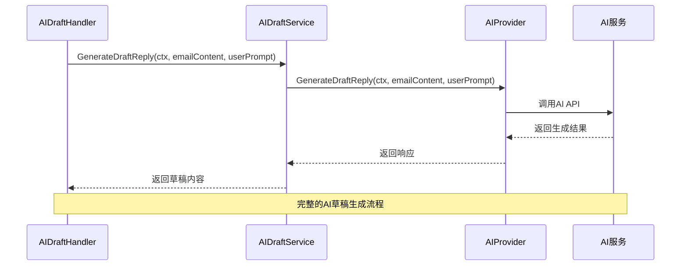

**图表来源**
- [ai_draft.go](file://backend/internal/service/ai_draft.go#L17-L19)

**节来源**
- [ai_draft.go](file://backend/internal/service/ai_draft.go#L1-L20)

### 向量搜索功能 (SearchService)

SearchService是系统中最复杂的服务之一，实现了基于向量相似度的智能搜索功能。

#### 核心功能模块

##### 1. 查询向量化处理
- **文本预处理**：清理HTML标签，组合主题和正文
- **分块处理**：将长文本分割为适合AI处理的块
- **批量嵌入**：使用超时控制的批量向量化

##### 2. 动态SQL查询构建
- **条件拼接**：根据过滤器动态构建WHERE子句
- **关联查询**：支持上下文、发件人、时间范围等多维度过滤
- **排序优化**：基于向量距离的相似度排序

##### 3. 性能优化策略
- **超时控制**：45秒的批量嵌入超时限制
- **维度验证**：确保向量维度一致性
- **缓存友好**：支持增量更新和删除重试

#### 搜索流程图

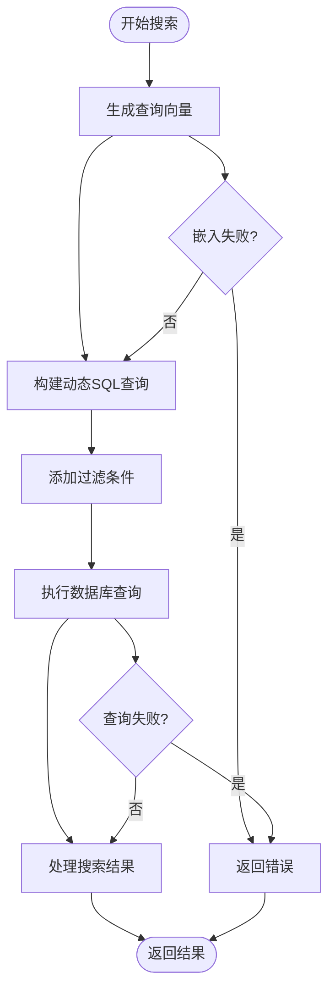

**图表来源**
- [search.go](file://backend/internal/service/search.go#L45-L106)

**节来源**
- [search.go](file://backend/internal/service/search.go#L1-L171)

### 邮件同步功能 (SyncService)

SyncService是系统的核心协调器，负责处理复杂的IMAP邮件同步任务。

#### 核心组件

##### 1. 接口抽象层
- **IMAPClient接口**：抽象IMAP客户端操作
- **EmailFetcher接口**：抽象邮件获取逻辑
- **AsynqClientInterface**：抽象异步任务队列

##### 2. 任务调度机制
- **事件发布**：通过事件总线发布邮件同步事件
- **异步处理**：支持后台任务队列
- **状态管理**：跟踪账户连接状态和同步历史

#### 同步流程图

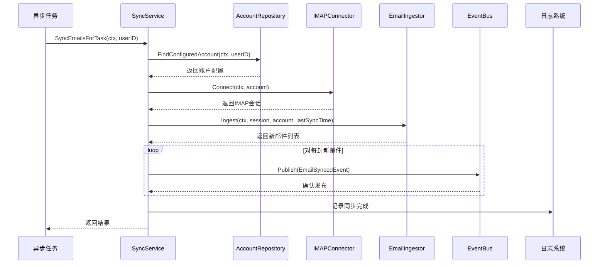

**图表来源**
- [sync.go](file://backend/internal/service/sync.go#L105-L157)

**节来源**
- [sync.go](file://backend/internal/service/sync.go#L1-L178)

### 聊天对话功能 (ChatService)

ChatService实现了基于检索增强生成(RAG)的智能聊天功能。

#### 核心算法

##### 1. 上下文检索策略
- **显式上下文优先**：优先使用用户指定的邮件作为上下文
- **自动搜索回退**：当无明确上下文时自动搜索相关邮件
- **混合检索**：结合关键词匹配和语义相似度

##### 2. 消息流处理
- **实时流式响应**：支持AI提供商的流式输出
- **系统提示构建**：动态构建包含上下文的系统提示
- **交互式组件**：支持生成任务列表、邮件草稿等交互式组件

#### 聊天流程图

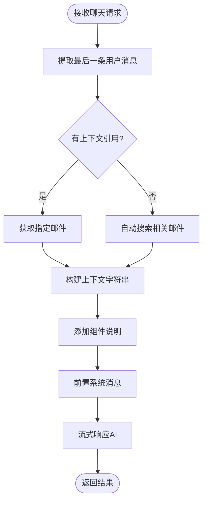

**图表来源**
- [chat.go](file://backend/internal/service/chat.go#L37-L118)

**节来源**
- [chat.go](file://backend/internal/service/chat.go#L1-L119)

### 账户管理功能 (AccountService)

AccountService负责用户邮箱账户的完整生命周期管理。

#### 核心功能
- **连接测试**：验证IMAP和SMTP服务器连通性
- **密码加密**：使用AES-256加密存储敏感信息
- **多层级归属**：支持用户、团队、组织三级归属
- **状态监控**：跟踪账户连接状态和错误信息

#### 连接流程图

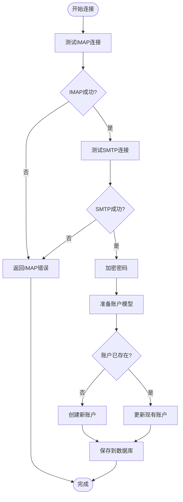

**图表来源**
- [account.go](file://backend/internal/service/account.go#L31-L111)

**节来源**
- [account.go](file://backend/internal/service/account.go#L1-L190)

### 邮件管理功能 (EmailService)

EmailService提供了完整的邮件CRUD操作和高级查询功能。

#### 核心特性
- **智能过滤**：支持上下文、文件夹、分类、智能过滤
- **权限控制**：基于用户ID的严格数据隔离
- **批量操作**：支持批量创建、更新、删除
- **级联删除**：自动清理关联的邮件嵌入

**节来源**
- [email.go](file://backend/internal/service/email.go#L1-L126)

### 上下文管理功能 (ContextService)

ContextService实现了基于关键词和利益相关者的智能邮件分类功能。

#### 匹配算法
- **关键词匹配**：在邮件主题和摘要中查找关键词
- **利益相关者匹配**：识别发件人是否属于预设的利益相关者
- **多维度匹配**：同时考虑关键词和利益相关者

#### 匹配流程图

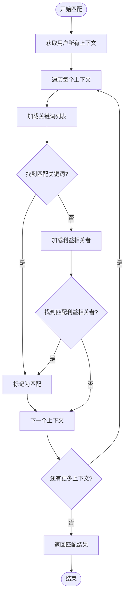

**图表来源**
- [context.go](file://backend/internal/service/context.go#L108-L152)

**节来源**
- [context.go](file://backend/internal/service/context.go#L1-L169)

### AI搜索增强功能

SearchService新增了AI驱动的搜索增强功能，包括结果聚类和智能摘要，显著提升了搜索结果的可读性和实用性。

#### 核心特性
- **AI聚类**：根据发件人、时间或主题自动分组搜索结果
- **智能摘要**：生成搜索结果的自然语言总结和关键信息提取
- **可配置性**：通过查询参数灵活控制增强功能的启用状态
- **性能优化**：缓存机制减少AI调用开销

#### 新增查询参数
- **enable_clustering**: 布尔值，控制是否启用结果聚类功能
- **enable_summary**: 布尔值，控制是否生成AI摘要
- **cluster_type**: 字符串，指定聚类类型（sender, time, topic）

#### 实现流程图

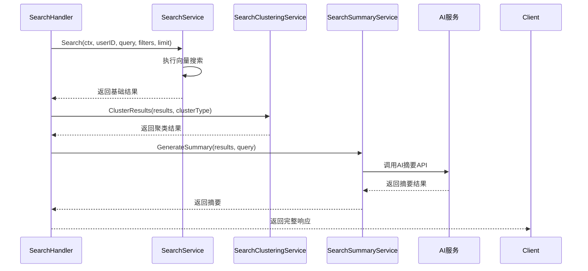

**节来源**
- [search.go](file://backend/internal/service/search.go#L62-L228)
- [search_clustering.go](file://backend/internal/service/search_clustering.go#L63-L74)
- [search_summary.go](file://backend/internal/service/search_summary.go#L32-L49)
- [search.go](file://backend/internal/handler/search.go#L107-L110)

## 依赖注入与工厂模式

### AI提供商工厂 (AIProvider Factory)

AI工厂模式展示了如何根据配置动态选择和创建AI服务实例。

#### 核心设计原则
- **协议抽象**：通过协议字段支持多种AI提供商
- **配置驱动**：完全基于配置文件的动态选择
- **接口统一**：CompositeProvider统一暴露AI和嵌入能力
- **性能优化**：相同提供商实例复用以减少资源消耗

#### 工厂流程图

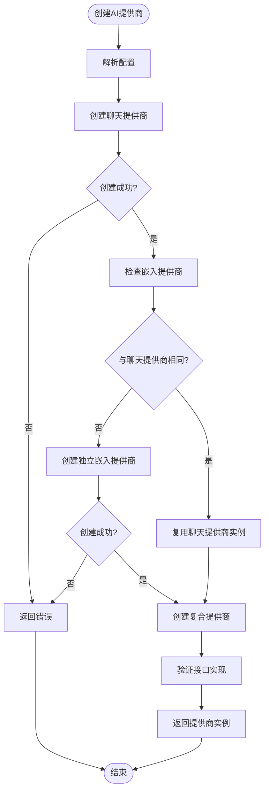

**图表来源**
- [ai_factory.go](file://backend/internal/service/ai_factory.go#L24-L96)

**节来源**
- [ai_factory.go](file://backend/internal/service/ai_factory.go#L1-L107)

### 依赖注入模式

Service层广泛采用构造函数注入模式，确保了良好的可测试性和可维护性。

#### 注入模式示例

```go
// SyncService的依赖注入
func NewSyncService(
    accountRepo repository.AccountRepository,
    connector IMAPConnector,
    ingestor *EmailIngestor,
    bus *bus.Bus,
    accountService *AccountService,
    config *configs.Config,
    log echologger.Logger,
) *SyncService {
    return &SyncService{
        accountRepo:    accountRepo,
        connector:      connector,
        ingestor:       ingestor,
        bus:            bus,
        accountService: accountService,
        config:         config,
        logger:         echologger.AsZapSugaredLogger(log),
    }
}
```

## 事务管理与异步处理

### 事务管理策略

Service层通过GORM的事务管理和上下文传播来确保数据一致性。

#### 事务边界
- **单个操作事务**：每个Service方法通常在一个事务中执行
- **批量操作事务**：对于批量操作，确保原子性
- **跨服务事务**：通过事件总线实现最终一致性

### 异步处理机制

#### Asynq集成
- **任务队列**：使用Asynq处理耗时任务
- **事件驱动**：通过事件总线触发异步处理
- **错误恢复**：支持任务重试和错误处理

#### 异步流程图

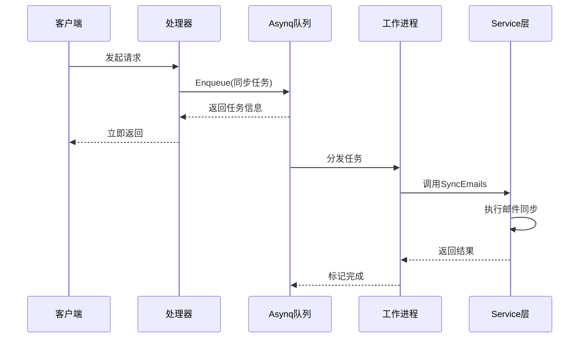

**图表来源**
- [sync.go](file://backend/internal/service/sync.go#L105-L157)

## 错误处理与日志记录

### 统一错误处理

Service层采用分层的错误处理策略：

#### 错误类型分类
- **业务错误**：如账户未配置、权限不足
- **技术错误**：如数据库连接失败、AI服务不可用
- **验证错误**：如输入参数无效

#### 错误传播模式
```go
// 标准错误包装模式
err := s.accountRepo.FindConfiguredAccount(ctx, userID, teamID, organizationID)
if err != nil {
    if errors.Is(err, gorm.ErrRecordNotFound) || strings.Contains(err.Error(), "record not found") {
        return ErrAccountNotConfigured
    }
    s.logger.Errorw("Failed to fetch email account",
        "user_id", userID,
        "team_id", teamID,
        "org_id", organizationID,
        "error", err)
    return fmt.Errorf("failed to retrieve email account: %w", err)
}
```

### 日志记录策略

#### 结构化日志
- **上下文信息**：记录用户ID、请求ID等上下文
- **错误详情**：包含完整的错误堆栈和调试信息
- **性能指标**：记录关键操作的执行时间

#### 日志级别使用
- **Error**：严重错误，需要立即关注
- **Warn**：警告信息，可能影响功能
- **Info**：一般信息，记录重要操作
- **Debug**：调试信息，用于问题排查

## 单元测试最佳实践

### 测试架构设计

Service层的测试遵循AAA（Arrange-Act-Assert）模式和测试金字塔原则。

#### Mock策略
- **接口Mock**：为外部依赖创建接口Mock
- **数据库Mock**：使用内存数据库进行快速测试
- **AI服务Mock**：模拟AI提供商的响应

### 测试示例分析

#### SearchService测试模式

```go
// 集成测试示例
func TestSearchService_Search_Integration(t *testing.T) {
    db := getIntegrationDB(t)
    if db == nil {
        t.Skip("Skipping integration test (requires Postgres with pgvector)")
    }
    
    // 设置测试数据
    userID := uuid.New()
    emailID := uuid.New()
    
    // 创建模拟嵌入器
    fixedEmbedder := &MockFixedEmbedder{Vector: embeddingVec}
    
    svc := service.NewSearchService(db, fixedEmbedder)
    
    // 执行测试
    results, err := svc.Search(context.Background(), userID, "Project", service.SearchFilters{}, 10)
    assert.NoError(t, err)
    assert.Len(t, results, 1)
}
```

#### SyncService测试模式

```go
// 单元测试示例
func TestSyncEmails(t *testing.T) {
    // 1. 设置内存数据库
    db, err := gorm.Open(sqlite.Open("file::memory:?cache=shared"), &gorm.Config{})
    assert.NoError(t, err)
    
    // 2. 设置Mock数据
    mockData := []imap.EmailData{
        {
            Subject:   "Sync Test",
            Sender:    "Sync Test <sync@test.com>",
            Date:      now,
            MessageID: "<sync@test.com>",
            BodyText:  "Test Body Content",
        },
    }
    
    // 3. 创建Mock连接器
    mockConnector := &MockIMAPConnector{
        ConnectFunc: func(ctx context.Context, account *model.EmailAccount) (service.IMAPSession, error) {
            return mockSession, nil
        },
    }
    
    // 4. 执行测试
    syncService := service.NewSyncService(accountRepo, mockConnector, ingestor, eventBus, accountService, config, logger)
    err = syncService.SyncEmails(ctx, userID, nil, nil)
    assert.NoError(t, err)
    
    // 5. 验证结果
    var count int64
    db.Model(&model.Email{}).Where("user_id = ?", userID).Count(&count)
    assert.Equal(t, int64(1), count)
}
```

### 测试覆盖率策略

#### 覆盖范围
- **核心业务逻辑**：90%以上的业务逻辑覆盖率
- **边界条件**：输入边界、错误情况的全面覆盖
- **集成测试**：关键组件间的集成验证

**节来源**
- [search_test.go](file://backend/internal/service/search_test.go#L1-L130)
- [sync_test.go](file://backend/internal/service/sync_test.go#L1-L170)
- [account_test.go](file://backend/internal/service/account_test.go#L1-L106)
- [context_test.go](file://backend/internal/service/context_test.go#L1-L107)

## 性能优化策略

### 嵌入生成性能瓶颈

#### 主要瓶颈点
- **网络延迟**：AI服务API调用的网络开销
- **批量大小**：单次请求的文本块数量限制
- **并发控制**：同时处理多个嵌入请求的资源消耗

#### 优化策略

##### 1. 超时控制
```go
// 45秒超时控制防止长时间阻塞
embeddingCtx, cancel := context.WithTimeout(ctx, 45*time.Second)
defer cancel()

vectors, err := s.embedder.EmbedBatch(embeddingCtx, chunks)
```

##### 2. 分块策略优化
```go
// 默认1000字符分块，平衡质量和性能
if chunkSize <= 0 {
    chunkSize = 1000
}
chunker := utils.NewTextChunker(chunkSize)
chunks := chunker.Chunk(fullText)
```

##### 3. 缓存机制
- **向量缓存**：避免重复计算相同的文本向量
- **连接池**：复用IMAP连接减少握手开销
- **预热机制**：提前初始化常用服务实例

### 数据库查询优化

#### 索引策略
- **向量索引**：使用pgvector的HNSW算法加速相似度搜索
- **复合索引**：为常用查询条件建立复合索引
- **分区表**：按时间或用户ID分区提高查询效率

#### 查询优化
```sql
-- 优化后的向量搜索查询
SELECT
    e.id as email_id,
    e.subject,
    ee.content as snippet,
    e.sender,
    e.date,
    1 - (ee.vector <=> ?) as score
FROM email_embeddings ee
JOIN emails e ON e.id = ee.email_id
WHERE e.user_id = ?
ORDER BY ee.vector <=> ? LIMIT ?
```

### 内存管理优化

#### 对象池化
- **连接池**：复用数据库和HTTP连接
- **缓冲区池**：重用字节缓冲区减少GC压力
- **切片池**：预分配固定大小的切片数组

#### 垃圾回收优化
- **避免大对象分配**：分批处理大数据集
- **及时释放资源**：使用defer确保资源正确释放
- **减少反射使用**：在性能关键路径避免反射

### 监控与可观测性

#### OpenTelemetry集成

SearchService和SearchCache服务已全面集成OpenTelemetry，提供完整的分布式追踪和性能监控能力。

##### 1. 配置初始化

```go
// 5. Telemetry (OpenTelemetry)
var tel *telemetry.Telemetry
if cfg.Telemetry.Enabled {
    telCfg := &telemetry.TelemetryConfig{
        ServiceName:     cfg.Telemetry.ServiceName,
        ServiceVersion:  cfg.Telemetry.ServiceVersion,
        Environment:     cfg.Telemetry.Environment,
        ExporterType:    cfg.Telemetry.Exporter.Type,
        TracesFilePath:  cfg.Telemetry.Exporter.File.TracesPath,
        MetricsFilePath: cfg.Telemetry.Exporter.File.MetricsPath,
        OTLPEndpoint:    cfg.Telemetry.Exporter.OTLP.Endpoint,
        OTLPInsecure:    cfg.Telemetry.Exporter.OTLP.Insecure,
        SamplingType:    cfg.Telemetry.Sampling.Type,
        SamplingRatio:   cfg.Telemetry.Sampling.Ratio,
    }

    tel, err = telemetry.InitTelemetry(context.Background(), telCfg)
    if err != nil {
        log.Warn("Failed to initialize telemetry, continuing without it",
            logger.Error(err))
    } else {
        log.Info("OpenTelemetry initialized",
            logger.String("service", telCfg.ServiceName),
            logger.String("version", telCfg.ServiceVersion),
            logger.String("exporter", telCfg.ExporterType))
    }
}
```

**节来源**
- [app.go](file://backend/internal/bootstrap/app.go#L99-L125)
- [otel.go](file://backend/pkg/telemetry/otel.go#L54-L107)
- [app_config.go](file://backend/configs/app_config.go#L68-L76)

##### 2. 分布式追踪实现

SearchService的Search方法实现了完整的分布式追踪，包含多个子Span：

- **根Span**：`SearchService.Search`
- **子Span**：`generate_query_embedding`
- **子Span**：`vector_database_search`
- **子Span**：`SearchCache.Get` (如果启用缓存)
- **子Span**：`SearchCache.Set` (如果启用缓存)

```go
func (s *SearchService) Search(ctx context.Context, userID uuid.UUID, query string, filters SearchFilters, limit int) ([]SearchResult, error) {
    // 创建根Span
    ctx, span := tracer.Start(ctx, "SearchService.Search",
        trace.WithAttributes(
            attribute.String("user.id", userID.String()),
            attribute.String("search.query", query),
            attribute.Int("search.limit", limit),
        ),
    )
    defer span.End()

    // 生成查询嵌入的子Span
    ctx, embedSpan := tracer.Start(ctx, "generate_query_embedding")
    queryVector, err := s.embedder.Embed(ctx, query)
    embedSpan.End()

    // 数据库查询的子Span
    ctx, dbSpan := tracer.Start(ctx, "vector_database_search")
    err = s.db.WithContext(ctx).Raw(sql, args...).Scan(&results).Error
    dbSpan.End()
}
```

**节来源**
- [search.go](file://backend/internal/service/search.go#L64-L71)
- [search.go](file://backend/internal/service/search.go#L114-L130)
- [search.go](file://backend/internal/service/search.go#L137-L202)

##### 3. 性能监控指标

###### SearchService核心指标

| 指标名称 | 类型 | 单位 | 说明 |
|---------|------|------|------|
| `search.latency` | Histogram | ms | 搜索请求端到端延迟 |
| `embedding.latency` | Histogram | ms | AI嵌入生成延迟 |
| `db.query.latency` | Histogram | ms | 数据库向量搜索延迟 |
| `search.requests.total` | Counter | - | 搜索请求总数 |
| `search.errors.total` | Counter | - | 搜索错误总数 |
| `cache.hits.total` | Counter | - | 缓存命中次数 |
| `cache.misses.total` | Counter | - | 缓存未命中次数 |
| `search.active` | UpDownCounter | - | 当前活跃搜索操作数 |
| `search.results.total` | Counter | - | 返回的搜索结果总数 |

###### SearchCache核心指标

| 指标名称 | 类型 | 单位 | 说明 |
|---------|------|------|------|
| `cache.get.latency` | Histogram | ms | 缓存获取操作延迟 |
| `cache.set.latency` | Histogram | ms | 缓存设置操作延迟 |
| `cache.delete.latency` | Histogram | ms | 缓存删除操作延迟 |
| `cache.operations.total` | Counter | - | 缓存操作总数 |
| `cache.errors.total` | Counter | - | 缓存错误总数 |
| `cache.key.size` | Histogram | bytes | 缓存键大小分布 |
| `cache.value.size` | Histogram | bytes | 缓存值大小分布 |
| `cache.hits.total` | Counter | - | 缓存命中次数 |
| `cache.misses.total` | Counter | - | 缓存未命中次数 |

```go
// CacheMetrics结构定义
type CacheMetrics struct {
    // 延迟直方图
    GetLatency    metric.Float64Histogram
    SetLatency    metric.Float64Histogram
    DeleteLatency metric.Float64Histogram
    
    // 操作计数器
    Operations metric.Int64Counter
    Errors     metric.Int64Counter
    
    // 大小直方图
    KeySize   metric.Int64Histogram
    ValueSize metric.Int64Histogram
    
    // 命中/未命中计数器
    Hits   metric.Int64Counter
    Misses metric.Int64Counter
}
```

**节来源**
- [metrics.go](file://backend/pkg/telemetry/metrics.go#L292-L310)
- [search_cache.go](file://backend/internal/service/search_cache.go#L117-L120)
- [search_cache.go](file://backend/internal/service/search_cache.go#L213-L217)

##### 4. 缓存服务指标详情

SearchCache服务提供了9个核心性能指标，全面监控缓存层的健康状况：

1. **GetLatency**: 记录缓存获取操作的延迟，用于监控缓存响应性能
2. **SetLatency**: 记录缓存设置操作的延迟，用于评估写入性能
3. **DeleteLatency**: 记录缓存删除操作的延迟，用于监控失效操作性能
4. **Operations**: 记录缓存操作总数，用于计算QPS
5. **Errors**: 记录缓存错误总数，用于监控服务稳定性
6. **KeySize**: 记录缓存键大小分布，用于优化键设计
7. **ValueSize**: 记录缓存值大小分布，用于评估内存使用
8. **Hits**: 记录缓存命中次数，用于计算命中率
9. **Misses**: 记录缓存未命中次数，用于计算未命中率

```go
// 记录Get操作延迟
if c.metrics != nil {
    c.metrics.RecordGetLatency(ctx, latency.Milliseconds())
    c.metrics.IncrementOperations(ctx, "get")
}

// 记录Set操作延迟
if c.metrics != nil {
    c.metrics.RecordSetLatency(ctx, latency.Milliseconds())
    c.metrics.IncrementOperations(ctx, "set")
    c.metrics.RecordValueSize(ctx, int64(len(data)))
}

// 记录Delete操作延迟
if c.metrics != nil {
    c.metrics.RecordDeleteLatency(ctx, latency.Milliseconds())
    c.metrics.IncrementOperations(ctx, "invalidate")
}
```

**节来源**
- [search_cache.go](file://backend/internal/service/search_cache.go#L117-L120)
- [search_cache.go](file://backend/internal/service/search_cache.go#L213-L217)
- [search_cache.go](file://backend/internal/service/search_cache.go#L304-L305)

## 开发指南与最佳实践

### 新服务方法开发规范

#### 1. 方法签名设计
```go
// 标准方法签名格式
func (s *Service) MethodName(
    ctx context.Context,           // 上下文传递
    param1 Type1,                 // 必需参数
    optionalParam2 Type2,         // 可选参数
    opts ...OptionType           // 可选配置
) (ReturnType, error) {
    // 实现细节
}
```

#### 2. 参数验证
```go
// 输入验证模式
if userID.IsNil() {
    return nil, fmt.Errorf("userID is required")
}

if limit < 1 || limit > 100 {
    return nil, fmt.Errorf("limit must be between 1 and 100")
}
```

#### 3. 错误处理模式
```go
// 统一错误处理模式
result, err := externalService.Call(ctx, params)
if err != nil {
    s.logger.Errorw("External service call failed",
        "operation", "methodName",
        "params", params,
        "error", err)
    return nil, fmt.Errorf("failed to call external service: %w", err)
}
```

### 事务管理最佳实践

#### 1. 事务边界设计
```go
// 单个操作的事务
func (s *Service) CreateEntity(ctx context.Context, entity *Entity) error {
    return s.db.Transaction(func(tx *gorm.DB) error {
        if err := tx.Create(entity).Error; err != nil {
            return err
        }
        
        // 关联操作
        if err := s.createRelatedEntities(tx, entity.ID); err != nil {
            return err
        }
        
        return nil
    })
}
```

#### 2. 批量操作优化
```go
// 批量插入优化
func (s *Service) BulkInsert(ctx context.Context, entities []*Entity) error {
    batchSize := 1000
    for i := 0; i < len(entities); i += batchSize {
        end := i + batchSize
        if end > len(entities) {
            end = len(entities)
        }
        
        if err := s.db.CreateInBatches(entities[i:end], batchSize).Error; err != nil {
            return err
        }
    }
    return nil
}
```

### 异步任务处理

#### 1. 任务队列集成
```go
// 使用Asynq触发异步任务
func (s *Service) TriggerAsyncTask(ctx context.Context, taskType string, payload map[string]interface{}) error {
    task := asynq.NewTask(taskType, payload)
    if _, err := s.asynqClient.Enqueue(task); err != nil {
        return fmt.Errorf("failed to enqueue task: %w", err)
    }
    return nil
}
```

#### 2. 事件发布模式
```go
// 通过事件总线发布事件
func (s *Service) PublishEvent(ctx context.Context, eventName string, eventData interface{}) error {
    event := events.NewCustomEvent(eventName, eventData)
    if err := s.eventBus.Publish(ctx, event); err != nil {
        s.logger.Errorw("Failed to publish event",
            "event", eventName,
            "error", err)
        return fmt.Errorf("failed to publish event: %w", err)
    }
    return nil
}
```

### 监控与可观测性

#### 1. 性能指标收集
```go
// Prometheus指标收集
var (
    searchDuration = prometheus.NewHistogramVec(
        prometheus.HistogramOpts{
            Name:    "search_duration_seconds",
            Help:    "Search operation duration",
            Buckets: prometheus.DefBuckets,
        },
        []string{"service", "operation"},
    )
)

func (s *Service) Search(ctx context.Context, query string) ([]SearchResult, error) {
    timer := prometheus.NewTimer(searchDuration.WithLabelValues("search_service", "search"))
    defer timer.ObserveDuration()
    
    // 实现细节
}
```

#### 2. 链路追踪
```go
// OpenTelemetry链路追踪
func (s *Service) ProcessEmail(ctx context.Context, email *model.Email) error {
    ctx, span := otel.Tracer("service").Start(ctx, "ProcessEmail")
    defer span.End()
    
    span.SetAttributes(
        attribute.String("email.id", email.ID.String()),
        attribute.String("email.sender", email.Sender),
    )
    
    // 实现细节
}
```

## 总结

EchoMind的Service层设计体现了现代Go应用程序的最佳实践，通过以下关键设计原则实现了高质量的业务逻辑封装：

### 核心优势

1. **清晰的职责分离**：每个Service专注于特定的业务领域，避免了功能耦合
2. **强大的依赖注入**：通过构造函数注入实现了松耦合和高可测试性
3. **灵活的扩展机制**：工厂模式和接口抽象支持多种AI提供商和数据源
4. **完善的错误处理**：分层的错误处理和日志记录确保了系统的可靠性
5. **高效的性能优化**：针对向量搜索和批量处理的专门优化策略
6. **全面的可观测性**：通过OpenTelemetry实现完整的分布式追踪和性能监控

### 技术亮点

- **AI集成**：无缝集成多种AI提供商，支持动态切换
- **向量搜索**：基于pgvector的高性能语义搜索
- **异步处理**：通过Asynq实现高效的后台任务处理
- **事件驱动**：基于事件总线的松耦合系统集成
- **测试友好**：完整的单元测试和集成测试覆盖
- **可观测性**：全面的OpenTelemetry集成，提供9个核心缓存指标和完整的分布式追踪

### 最佳实践总结

1. **遵循SOLID原则**：单一职责、开放封闭、里氏替换、接口隔离、依赖倒置
2. **重视测试质量**：单元测试、集成测试、性能测试的全面覆盖
3. **关注性能指标**：监控关键操作的执行时间和资源消耗
4. **保持代码简洁**：避免过度工程化，保持代码的可读性和可维护性
5. **持续优化改进**：根据实际使用情况不断优化性能和用户体验

这种设计不仅满足了当前的功能需求，还为未来的扩展和优化奠定了坚实的基础，是现代企业级应用开发的优秀范例。