# 分层架构详解

<cite>
**本文档中引用的文件**
- [auth.go](file://backend/internal/handler/auth.go)
- [email.go](file://backend/internal/handler/email.go)
- [ai_draft.go](file://backend/internal/service/ai_draft.go)
- [sync.go](file://backend/internal/service/sync.go)
- [email_repository.go](file://backend/internal/repository/email_repository.go)
- [email.go](file://backend/internal/model/email.go)
- [user.go](file://backend/internal/model/user.go)
- [email.go](file://backend/internal/service/email.go)
- [account.go](file://backend/internal/service/account.go)
- [routes.go](file://backend/internal/router/routes.go)
- [context.go](file://backend/internal/model/context.go)
- [opportunity.go](file://backend/internal/model/opportunity.go)
- [account_repository.go](file://backend/internal/repository/account_repository.go)
- [chat.go](file://backend/internal/service/chat.go)
- [health.go](file://backend/internal/handler/health.go)
</cite>

## 目录
1. [引言](#引言)
2. [项目架构概览](#项目架构概览)
3. [Handler层详解](#handler层详解)
4. [Service层详解](#service层详解)
5. [Repository层详解](#repository层详解)
6. [Model层详解](#model层详解)
7. [层间调用关系](#层间调用关系)
8. [新增功能开发指南](#新增功能开发指南)
9. [最佳实践与设计原则](#最佳实践与设计原则)
10. [总结](#总结)

## 引言

EchoMind后端采用经典的分层架构设计，将系统划分为Handler、Service、Repository和Model四个清晰的层次。这种架构模式遵循关注点分离原则，确保每一层都有明确的职责边界，提高了代码的可维护性、可测试性和可扩展性。

本文档将深入解析每个层次的职责、实现细节以及层间的交互关系，为开发者提供在每一层添加新功能的完整指导。

## 项目架构概览

EchoMind后端采用Go语言构建，使用Gin框架作为Web服务器，GORM作为ORM工具，PostgreSQL作为数据库。整个应用遵循Clean Architecture原则，实现了清晰的分层结构。

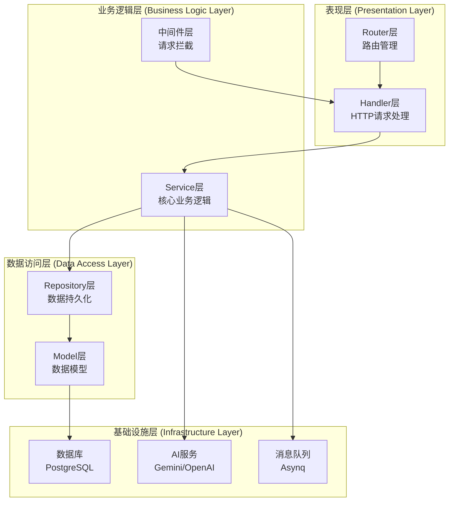

**图表来源**
- [routes.go](file://backend/internal/router/routes.go#L1-L99)
- [auth.go](file://backend/internal/handler/auth.go#L1-L127)
- [email.go](file://backend/internal/service/email.go#L1-L126)

## Handler层详解

Handler层是系统的入口点，负责处理HTTP请求和生成HTTP响应。它不包含任何业务逻辑，只负责参数验证、错误处理和调用Service层。

### 核心职责

1. **HTTP请求接收**：通过Gin框架接收和解析HTTP请求
2. **参数验证**：使用结构体标签进行输入验证
3. **错误处理**：统一的错误响应格式
4. **响应生成**：将Service层的结果转换为HTTP响应
5. **中间件集成**：处理认证、授权等横切关注点

### 主要组件

#### 认证处理器 (AuthHandler)

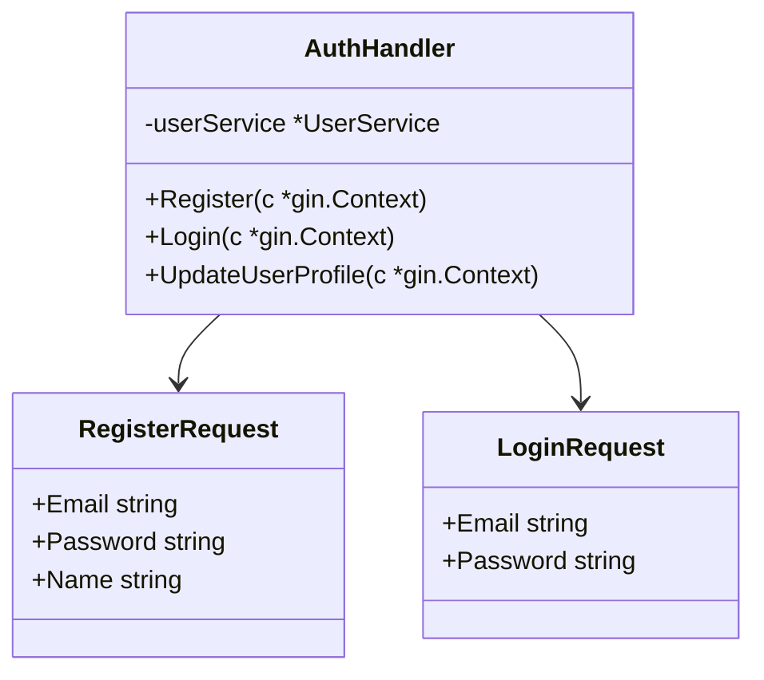

**图表来源**
- [auth.go](file://backend/internal/handler/auth.go#L11-L127)

#### 邮件处理器 (EmailHandler)

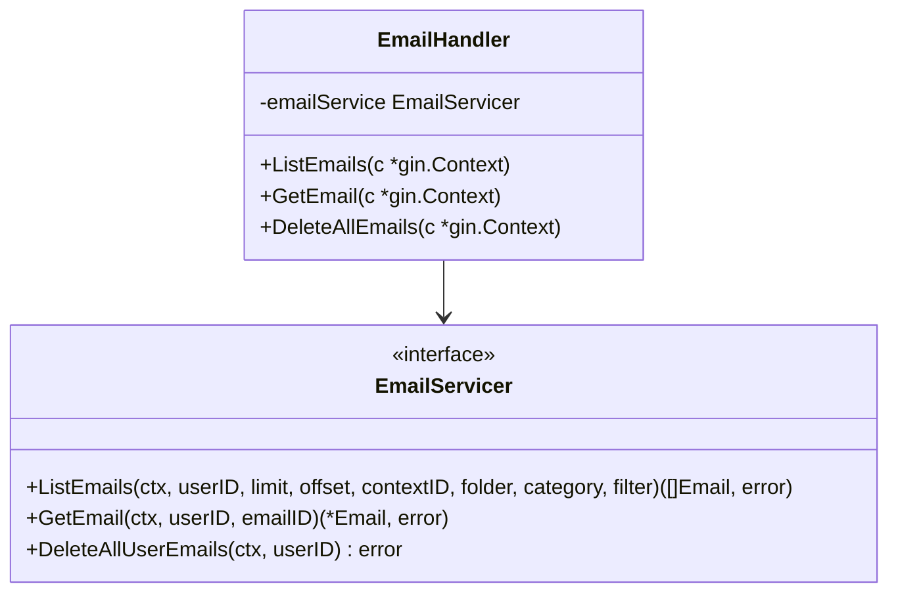

**图表来源**
- [email.go](file://backend/internal/handler/email.go#L15-L108)

### 设计特点

1. **依赖注入**：通过构造函数注入Service层依赖
2. **接口抽象**：使用接口定义Service层契约
3. **统一错误处理**：标准化的错误响应格式
4. **参数绑定**：利用Gin的自动参数绑定机制

**章节来源**
- [auth.go](file://backend/internal/handler/auth.go#L1-L127)
- [email.go](file://backend/internal/handler/email.go#L1-L108)

## Service层详解

Service层是系统的核心，包含了所有的业务逻辑和业务规则。它负责协调各个Repository的操作，实现复杂的业务流程。

### 核心职责

1. **业务逻辑实现**：执行具体的业务规则和流程
2. **事务管理**：协调多个Repository操作的事务性
3. **业务规则验证**：确保业务数据的一致性和有效性
4. **跨层协调**：连接Handler层和Repository层
5. **外部服务集成**：与AI服务、消息队列等外部系统交互

### 主要组件

#### AI草稿服务 (AIDraftService)

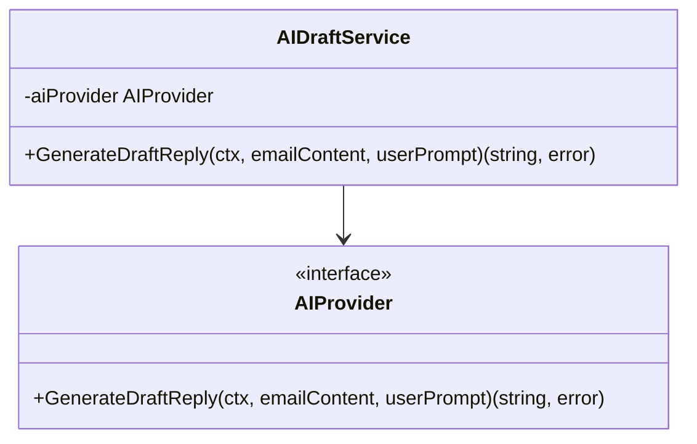

**图表来源**
- [ai_draft.go](file://backend/internal/service/ai_draft.go#L9-L20)

#### 同步服务 (SyncService)

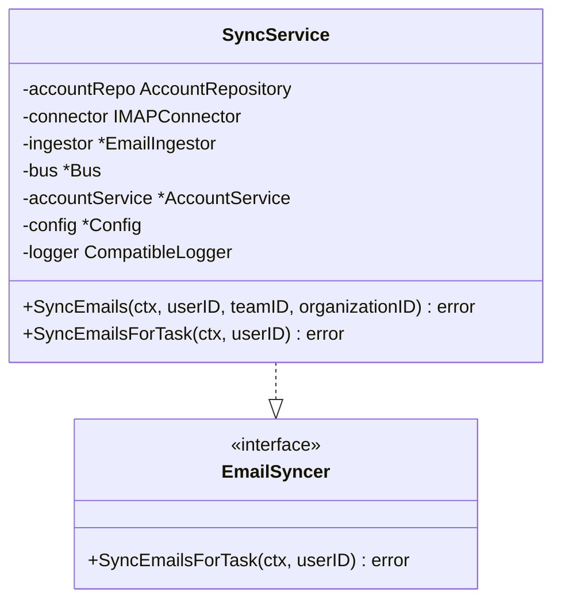

**图表来源**
- [sync.go](file://backend/internal/service/sync.go#L69-L178)

#### 账户服务 (AccountService)

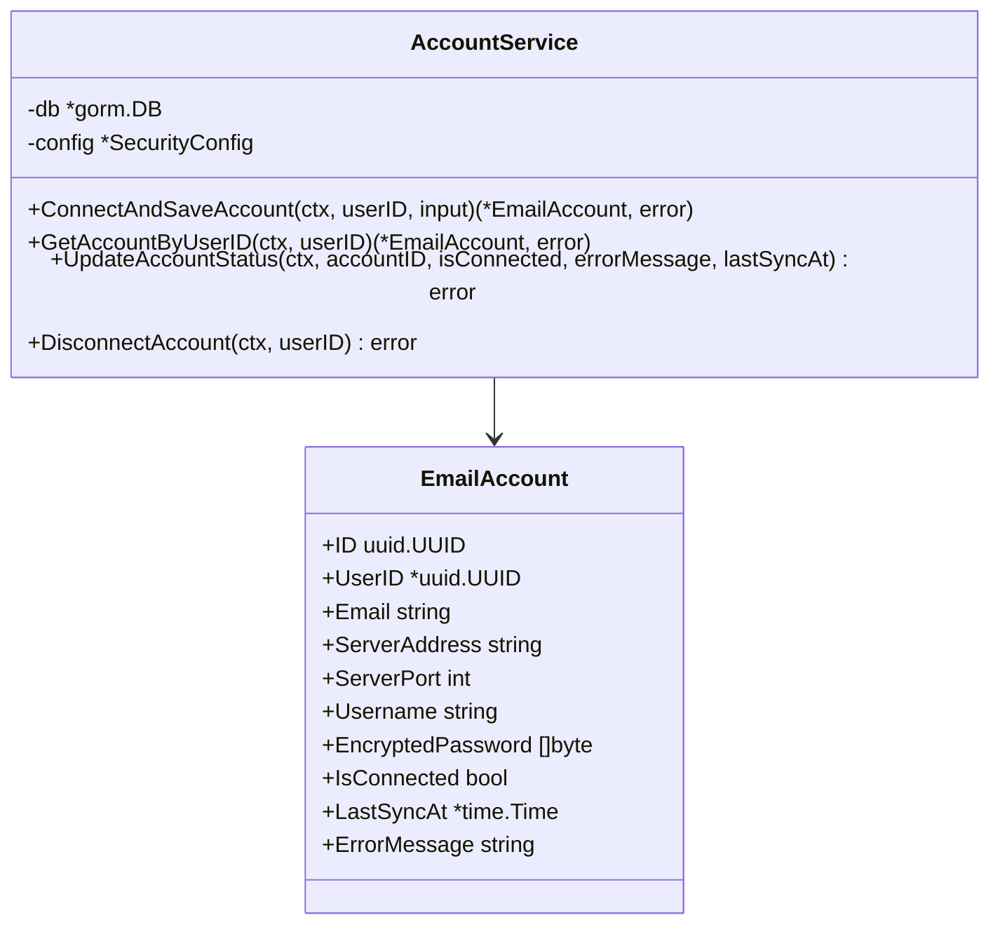

**图表来源**
- [account.go](file://backend/internal/service/account.go#L17-L190)

### 设计特点

1. **单一职责**：每个Service专注于特定的业务领域
2. **依赖注入**：通过构造函数注入所需依赖
3. **接口隔离**：使用接口定义清晰的服务契约
4. **错误传播**：向上传播业务异常而非处理异常
5. **测试友好**：易于单元测试和模拟

**章节来源**
- [ai_draft.go](file://backend/internal/service/ai_draft.go#L1-L20)
- [sync.go](file://backend/internal/service/sync.go#L1-L178)
- [account.go](file://backend/internal/service/account.go#L1-L190)

## Repository层详解

Repository层封装了所有对数据库的访问操作，隔离了上层业务逻辑与底层数据存储技术的耦合。

### 核心职责

1. **数据持久化**：提供CRUD操作的统一接口
2. **查询封装**：封装复杂的数据库查询逻辑
3. **事务隔离**：确保数据操作的原子性
4. **性能优化**：实现查询优化和缓存策略
5. **数据一致性**：维护数据的完整性约束

### 主要组件

#### 邮件仓库 (EmailRepository)

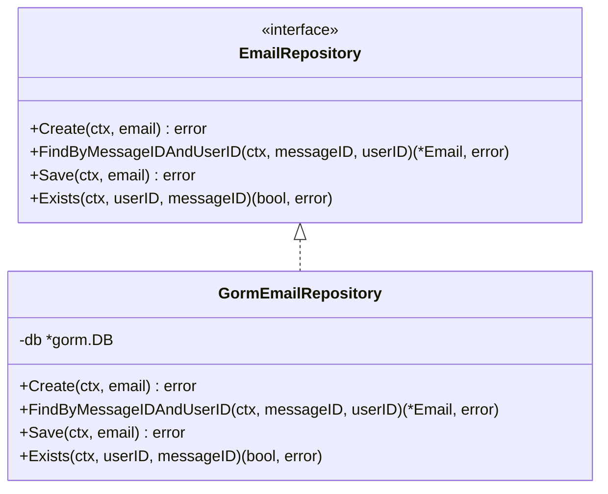

**图表来源**
- [email_repository.go](file://backend/internal/repository/email_repository.go#L11-L67)

#### 账户仓库 (AccountRepository)

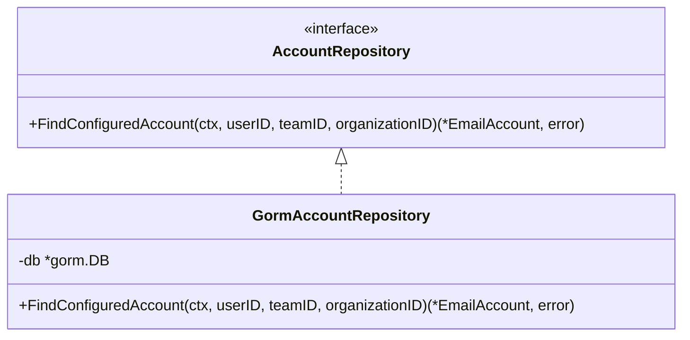

**图表来源**
- [account_repository.go](file://backend/internal/repository/account_repository.go#L11-L48)

### 设计特点

1. **接口抽象**：使用接口定义数据访问契约
2. **GORM集成**：基于GORM实现具体的数据访问逻辑
3. **上下文支持**：支持Go的context包进行超时控制
4. **错误处理**：统一的错误处理和返回机制
5. **查询优化**：实现高效的数据库查询

**章节来源**
- [email_repository.go](file://backend/internal/repository/email_repository.go#L1-L67)
- [account_repository.go](file://backend/internal/repository/account_repository.go#L1-L48)

## Model层详解

Model层定义了系统的数据结构和ORM映射，是数据持久化的基础。

### 核心职责

1. **数据建模**：定义实体对象和它们的关系
2. **ORM映射**：配置GORM的表结构和字段映射
3. **数据验证**：定义数据验证规则和约束
4. **关联关系**：建立实体之间的关联关系
5. **序列化支持**：支持JSON和其他格式的序列化

### 主要实体

#### 用户模型 (User)

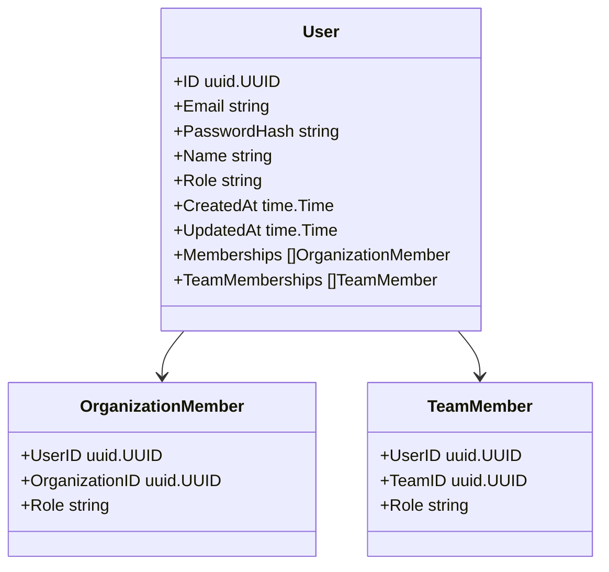

**图表来源**
- [user.go](file://backend/internal/model/user.go#L10-L23)

#### 邮件模型 (Email)

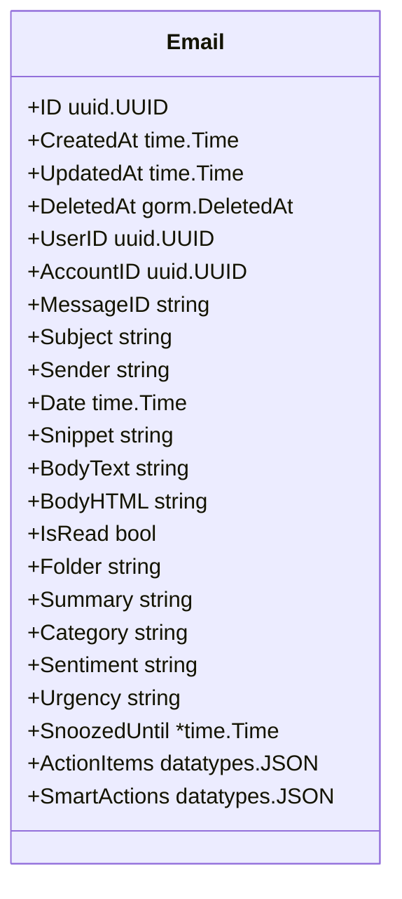

**图表来源**
- [email.go](file://backend/internal/model/email.go#L11-L37)

#### 上下文模型 (Context)

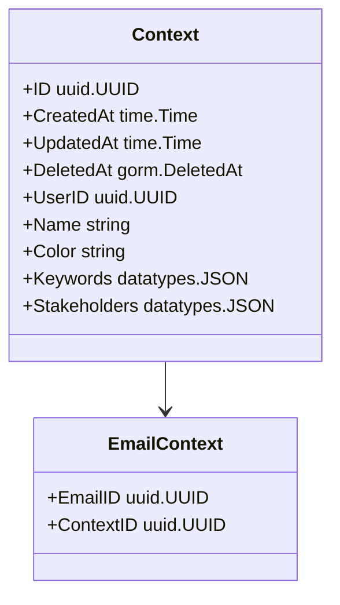

**图表来源**
- [context.go](file://backend/internal/model/context.go#L11-L30)

### 设计特点

1. **GORM标签**：使用GORM标签进行ORM配置
2. **JSON类型**：支持复杂数据类型的JSON序列化
3. **索引定义**：在数据库层面定义必要的索引
4. **关联关系**：建立实体之间的关联关系
5. **软删除**：支持GORM的软删除机制

**章节来源**
- [user.go](file://backend/internal/model/user.go#L1-L23)
- [email.go](file://backend/internal/model/email.go#L1-L37)
- [context.go](file://backend/internal/model/context.go#L1-L30)

## 层间调用关系

各层之间遵循严格的调用规则，确保架构的清晰性和可维护性。

### 调用流程图

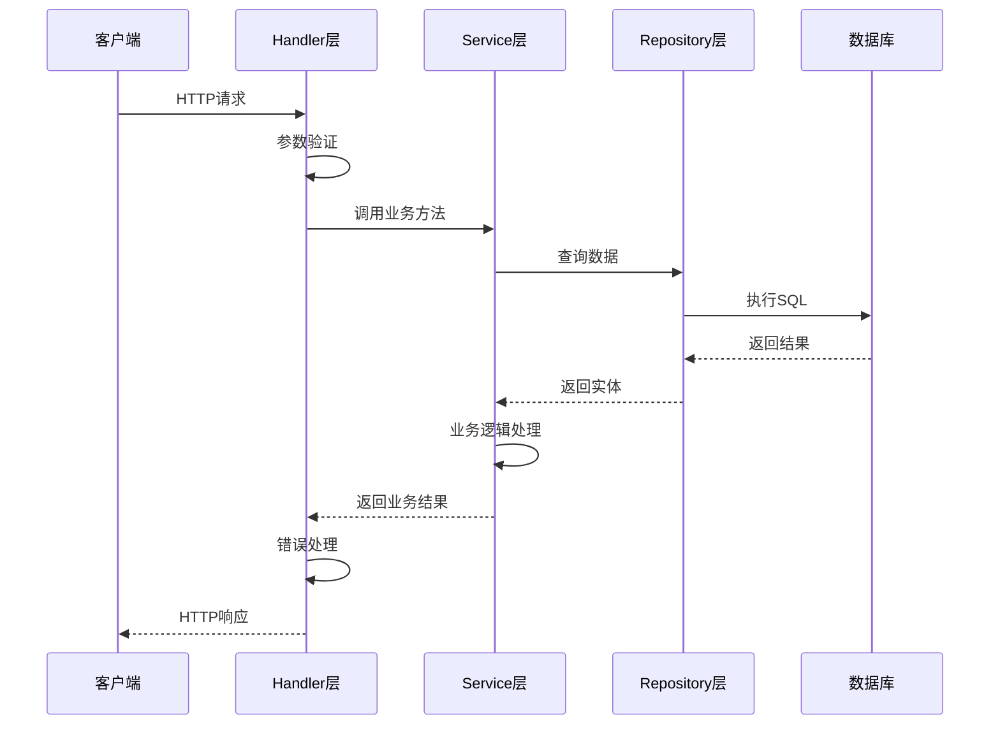

**图表来源**
- [auth.go](file://backend/internal/handler/auth.go#L28-L64)
- [email.go](file://backend/internal/service/email.go#L25-L76)

### 调用规则

1. **单向依赖**：上层可以调用下层，但下层不能调用上层
2. **接口隔离**：通过接口定义层间契约
3. **依赖注入**：使用构造函数注入依赖
4. **错误传播**：业务异常向上传播，不被处理
5. **数据传输**：层间传递的是数据对象而非实体

### 实际调用示例

以用户注册为例展示完整的调用链：

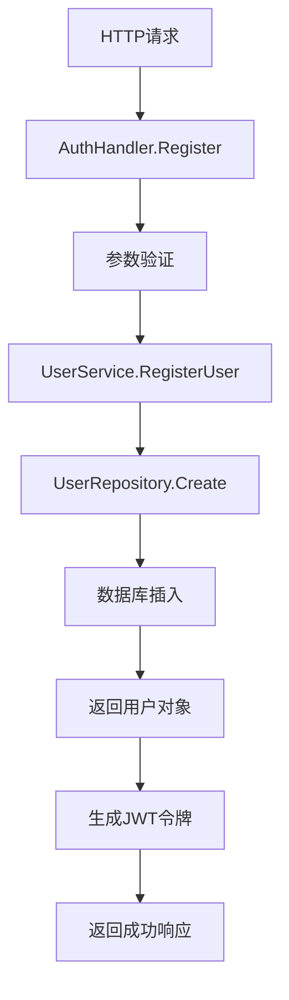

**图表来源**
- [auth.go](file://backend/internal/handler/auth.go#L28-L64)
- [email.go](file://backend/internal/service/email.go#L25-L76)

**章节来源**
- [auth.go](file://backend/internal/handler/auth.go#L28-L64)
- [email.go](file://backend/internal/service/email.go#L25-L76)

## 新增功能开发指南

### 在Handler层添加新功能

#### 步骤1：创建请求结构体

```go
// 示例：新建联系人请求结构体
type CreateContactRequest struct {
    Name     string `json:"name" binding:"required"`
    Email    string `json:"email" binding:"required,email"`
    Phone    string `json:"phone"`
    Company  string `json:"company"`
}
```

#### 步骤2：实现处理函数

```go
// 示例：联系人处理器
func (h *ContactHandler) CreateContact(c *gin.Context) {
    var req CreateContactRequest
    if err := c.ShouldBindJSON(&req); err != nil {
        c.JSON(http.StatusBadRequest, gin.H{"error": err.Error()})
        return
    }
    
    contact, err := h.contactService.CreateContact(c.Request.Context(), req)
    if err != nil {
        c.JSON(http.StatusInternalServerError, gin.H{"error": "Failed to create contact"})
        return
    }
    
    c.JSON(http.StatusCreated, contact)
}
```

#### 步骤3：注册路由

```go
// 在routes.go中添加路由
protected.POST("/contacts", h.Contact.CreateContact)
```

### 在Service层添加新功能

#### 步骤1：定义服务接口

```go
// 在contact.go中定义接口
type ContactService interface {
    CreateContact(ctx context.Context, req CreateContactRequest) (*model.Contact, error)
    ListContacts(ctx context.Context, userID uuid.UUID, filters ContactFilters) ([]model.Contact, error)
}
```

#### 步骤2：实现服务逻辑

```go
// 实现具体的服务逻辑
func (s *ContactServiceImpl) CreateContact(ctx context.Context, req CreateContactRequest) (*model.Contact, error) {
    // 业务逻辑验证
    if err := validateContact(req); err != nil {
        return nil, err
    }
    
    // 创建实体
    contact := &model.Contact{
        Name:    req.Name,
        Email:   req.Email,
        Phone:   req.Phone,
        Company: req.Company,
    }
    
    // 调用Repository保存
    if err := s.contactRepo.Create(ctx, contact); err != nil {
        return nil, err
    }
    
    return contact, nil
}
```

### 在Repository层添加新功能

#### 步骤1：定义Repository接口

```go
// 在contact_repository.go中定义接口
type ContactRepository interface {
    Create(ctx context.Context, contact *model.Contact) error
    FindByUserID(ctx context.Context, userID uuid.UUID) ([]model.Contact, error)
    Update(ctx context.Context, contact *model.Contact) error
    Delete(ctx context.Context, contactID uuid.UUID) error
}
```

#### 步骤2：实现Repository逻辑

```go
// 实现具体的Repository逻辑
func (r *GormContactRepository) Create(ctx context.Context, contact *model.Contact) error {
    return r.db.WithContext(ctx).Create(contact).Error
}

func (r *GormContactRepository) FindByUserID(ctx context.Context, userID uuid.UUID) ([]model.Contact, error) {
    var contacts []model.Contact
    err := r.db.WithContext(ctx).
        Where("user_id = ?", userID).
        Order("created_at DESC").
        Find(&contacts).Error
    return contacts, err
}
```

### 在Model层添加新功能

#### 步骤1：定义新实体

```go
// 在contact.go中定义新实体
type Contact struct {
    ID        uuid.UUID `gorm:"type:uuid;primary_key"`
    CreatedAt time.Time
    UpdatedAt time.Time
    DeletedAt gorm.DeletedAt `gorm:"index"`
    
    UserID    uuid.UUID `gorm:"type:uuid;not null;index"`
    Name      string    `gorm:"type:varchar(100);not null"`
    Email     string    `gorm:"type:varchar(255);uniqueIndex;not null"`
    Phone     string    `gorm:"type:varchar(20)"`
    Company   string    `gorm:"type:varchar(100)"`
    Notes     string    `gorm:"type:text"`
}
```

#### 步骤2：配置GORM映射

```go
// 确保实体正确配置GORM标签
type Contact struct {
    ID        uuid.UUID `gorm:"type:uuid;primary_key"`
    CreatedAt time.Time
    UpdatedAt time.Time
    DeletedAt gorm.DeletedAt `gorm:"index"`
    
    UserID    uuid.UUID `gorm:"type:uuid;not null;index"`
    Name      string    `gorm:"type:varchar(100);not null"`
    Email     string    `gorm:"type:varchar(255);uniqueIndex;not null"`
    Phone     string    `gorm:"type:varchar(20)"`
    Company   string    `gorm:"type:varchar(100)"`
    Notes     string    `gorm:"type:text"`
}
```

**章节来源**
- [auth.go](file://backend/internal/handler/auth.go#L28-L64)
- [email.go](file://backend/internal/service/email.go#L25-L76)
- [email_repository.go](file://backend/internal/repository/email_repository.go#L11-L67)

## 最佳实践与设计原则

### 架构设计原则

1. **单一职责原则**：每层只负责一个明确的职责
2. **依赖倒置原则**：高层模块不依赖低层模块的具体实现
3. **接口隔离原则**：使用小而专一的接口
4. **开闭原则**：对扩展开放，对修改关闭

### 代码质量保证

#### 错误处理策略

```go
// 统一的错误处理模式
func (s *Service) BusinessMethod(ctx context.Context) error {
    // 1. 参数验证
    if err := validateParams(params); err != nil {
        return fmt.Errorf("validation failed: %w", err)
    }
    
    // 2. 业务逻辑处理
    result, err := s.repo.Operation(ctx)
    if err != nil {
        return fmt.Errorf("repository operation failed: %w", err)
    }
    
    // 3. 业务规则验证
    if !isValid(result) {
        return ErrInvalidBusinessRule
    }
    
    return nil
}
```

#### 测试策略

```go
// 使用接口进行依赖注入，便于测试
type Service struct {
    repo Repository
}

func NewService(repo Repository) *Service {
    return &Service{repo: repo}
}

// 在测试中使用Mock实现
type MockRepository struct {
    // 模拟方法实现
}

func TestService(t *testing.T) {
    mockRepo := &MockRepository{}
    service := NewService(mockRepo)
    
    // 编写测试用例
}
```

### 性能优化建议

1. **批量操作**：对于大量数据操作，使用批量处理
2. **查询优化**：合理使用索引，避免N+1查询问题
3. **缓存策略**：对频繁访问的数据实施缓存
4. **连接池管理**：合理配置数据库连接池

### 安全考虑

1. **输入验证**：严格验证所有用户输入
2. **权限控制**：实现细粒度的权限检查
3. **数据加密**：敏感数据进行加密存储
4. **日志审计**：记录关键操作的日志

## 总结

EchoMind后端的分层架构设计体现了现代软件工程的最佳实践。通过清晰的职责分离，每一层都能够专注于自己的核心任务，同时保持良好的可测试性和可维护性。

### 架构优势

1. **清晰的职责划分**：每层都有明确的职责边界
2. **良好的可测试性**：依赖注入使得单元测试变得简单
3. **高度的可维护性**：层间松耦合，修改成本低
4. **优秀的扩展性**：新增功能只需在相应层添加代码

### 开发建议

1. **严格遵守分层规则**：不要跨越层间界限
2. **使用接口编程**：提高代码的灵活性和可测试性
3. **注重错误处理**：统一的错误处理策略
4. **持续重构**：保持代码质量和架构清晰

通过遵循本文档提供的指导原则和最佳实践，开发者可以高效地在EchoMind系统中添加新功能，同时保持系统的整体质量和稳定性。