# EchoMind后端架构文档

<cite>
**本文档中引用的文件**
- [main.go](file://backend/cmd/main.go)
- [container.go](file://backend/internal/app/container.go)
- [app.go](file://backend/internal/bootstrap/app.go)
- [routes.go](file://backend/internal/router/routes.go)
- [middleware.go](file://backend/internal/router/middleware.go)
- [auth.go](file://backend/internal/middleware/auth.go)
- [account.go](file://backend/internal/service/account.go)
- [auth.go](file://backend/internal/handler/auth.go)
- [user.go](file://backend/internal/model/user.go)
- [account_repository.go](file://backend/internal/repository/account_repository.go)
- [bus.go](file://backend/pkg/event/bus/bus.go)
- [app_config.go](file://backend/configs/app_config.go)
- [user.go](file://backend/internal/service/user.go)
- [email.go](file://backend/internal/handler/email.go)
- [email.go](file://backend/internal/service/email.go)
- [email.go](file://backend/internal/model/email.go)
</cite>

## 目录
1. [项目概述](#项目概述)
2. [整体架构设计](#整体架构设计)
3. [分层架构详解](#分层架构详解)
4. [依赖注入容器](#依赖注入容器)
5. [应用启动流程](#应用启动流程)
6. [路由与中间件系统](#路由与中间件系统)
7. [核心业务模块](#核心业务模块)
8. [事件驱动架构](#事件驱动架构)
9. [配置管理](#配置管理)
10. [开发指南](#开发指南)

## 项目概述

EchoMind是一个基于Go语言构建的企业级邮件智能处理平台，采用现代化的微服务架构设计。后端服务基于Gin Web框架，实现了完整的RESTful API接口，支持AI驱动的邮件分析、智能分类和自动化处理功能。

### 技术栈概览
- **Web框架**: Gin (高性能HTTP Web框架)
- **数据库**: PostgreSQL (支持向量扩展)
- **缓存/队列**: Redis (Asynq任务队列)
- **AI服务**: OpenAI、Gemini等多提供商支持
- **依赖注入**: 自定义容器实现
- **事件总线**: 内置事件发布订阅机制

## 整体架构设计

EchoMind后端采用经典的分层架构模式，清晰地分离了关注点，确保代码的可维护性和可扩展性。

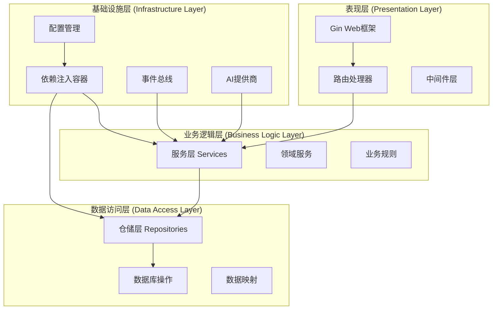

**图表来源**
- [main.go](file://backend/cmd/main.go#L22-L137)
- [container.go](file://backend/internal/app/container.go#L31-L122)

### 架构特点

1. **分层清晰**: 每一层都有明确的职责边界
2. **依赖倒置**: 上层依赖于抽象而非具体实现
3. **单一职责**: 每个组件专注于特定的功能领域
4. **可测试性**: 基于接口的设计便于单元测试
5. **可扩展性**: 支持插件式AI提供商和事件监听器

## 分层架构详解

### Handler层 - 表现层

Handler层负责处理HTTP请求和响应，是系统的入口点。每个Handler都对应一个特定的业务功能模块。

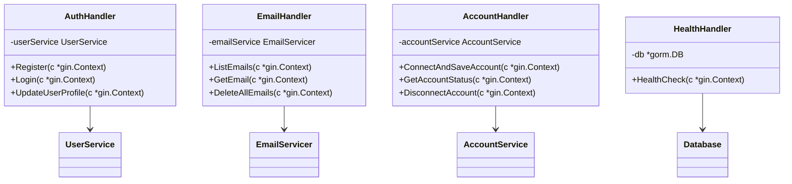

**图表来源**
- [auth.go](file://backend/internal/handler/auth.go#L11-L19)
- [email.go](file://backend/internal/handler/email.go#L22-L28)
- [account.go](file://backend/internal/handler/account.go)

#### Handler设计原则

1. **轻量级**: Handler只负责参数解析和结果返回
2. **依赖注入**: 通过构造函数注入服务依赖
3. **错误处理**: 统一的错误响应格式
4. **参数验证**: 使用Gin的绑定验证机制

**章节来源**
- [auth.go](file://backend/internal/handler/auth.go#L28-L127)
- [email.go](file://backend/internal/handler/email.go#L30-L108)

### Service层 - 业务逻辑层

Service层包含核心业务逻辑，协调多个Repository和外部服务的交互。

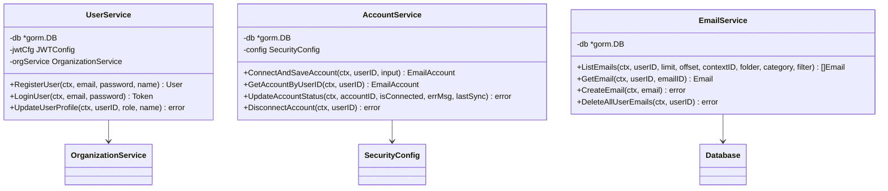

**图表来源**
- [user.go](file://backend/internal/service/user.go#L21-L35)
- [account.go](file://backend/internal/service/account.go#L17-L29)
- [email.go](file://backend/internal/service/email.go#L13-L20)

#### Service层职责

1. **业务规则**: 实现核心业务逻辑和约束
2. **事务管理**: 协调多个数据操作的原子性
3. **领域知识**: 封装业务领域的专业知识
4. **跨服务协调**: 调用多个Repository完成复杂业务场景

**章节来源**
- [user.go](file://backend/internal/service/user.go#L37-L140)
- [account.go](file://backend/internal/service/account.go#L31-L190)
- [email.go](file://backend/internal/service/email.go#L25-L126)

### Repository层 - 数据访问层

Repository层提供数据访问的抽象，隐藏底层数据库的具体实现。

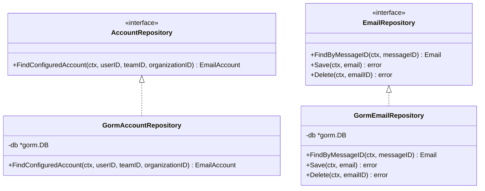

**图表来源**
- [account_repository.go](file://backend/internal/repository/account_repository.go#L11-L16)
- [email_repository.go](file://backend/internal/repository/email_repository.go#L1-L50)

#### Repository设计模式

1. **接口隔离**: 每个Repository只暴露必要的方法
2. **查询优化**: 针对不同查询场景提供专门的方法
3. **事务支持**: 支持数据库事务操作
4. **类型安全**: 强类型的参数和返回值

**章节来源**
- [account_repository.go](file://backend/internal/repository/account_repository.go#L28-L48)

### Model层 - 数据模型层

Model层定义了系统的数据结构和关系映射。

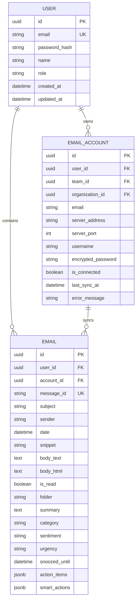

**图表来源**
- [user.go](file://backend/internal/model/user.go#L9-L22)
- [email.go](file://backend/internal/model/email.go#L11-L36)

**章节来源**
- [user.go](file://backend/internal/model/user.go#L1-L23)
- [email.go](file://backend/internal/model/email.go#L1-L37)

## 依赖注入容器

EchoMind采用自定义的依赖注入容器来管理所有服务的生命周期和依赖关系。

### Container架构设计

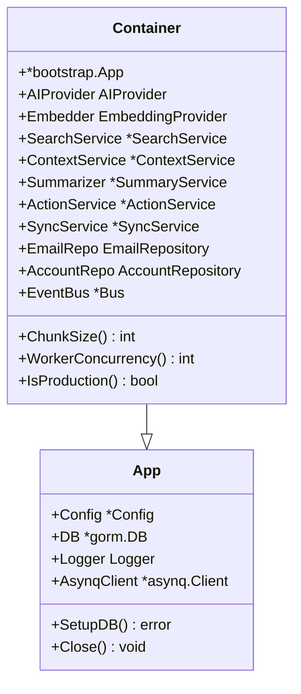

**图表来源**
- [container.go](file://backend/internal/app/container.go#L17-L29)
- [app.go](file://backend/internal/bootstrap/app.go#L17-L22)

### NewContainer初始化流程

NewContainer函数是整个应用的核心初始化入口，负责建立完整的依赖关系网络。

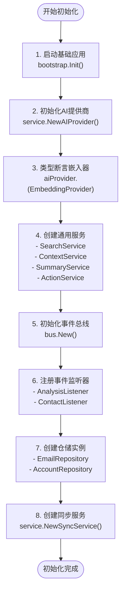

**图表来源**
- [container.go](file://backend/internal/app/container.go#L31-L100)

#### 关键初始化步骤

1. **基础应用启动**: 加载配置、初始化数据库连接
2. **AI提供商创建**: 根据配置选择合适的AI服务提供商
3. **通用服务创建**: 包括搜索、上下文、摘要等核心服务
4. **事件系统初始化**: 建立事件总线和监听器链
5. **仓储层建立**: 创建数据访问层的实例
6. **业务服务组装**: 将各个服务组装成完整的业务能力

**章节来源**
- [container.go](file://backend/internal/app/container.go#L31-L100)

## 应用启动流程

EchoMind的应用启动遵循严格的顺序，确保所有依赖项按正确的顺序初始化。

### 主程序启动序列

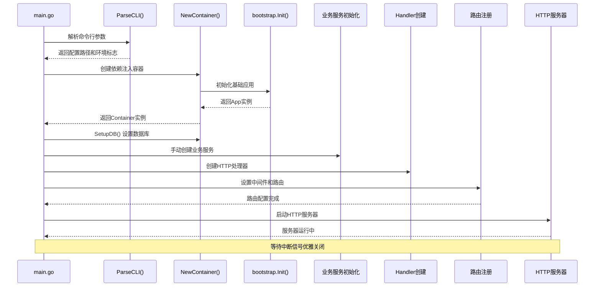

**图表来源**
- [main.go](file://backend/cmd/main.go#L22-L137)

### 启动阶段详解

#### 第一阶段：CLI配置解析
- 解析命令行参数确定配置文件路径
- 判断是否为生产环境
- 加载基础配置信息

#### 第二阶段：容器初始化
- 调用NewContainer创建依赖注入容器
- 完成所有核心服务的初始化
- 建立服务间的依赖关系

#### 第三阶段：数据库准备
- 执行数据库迁移确保表结构最新
- 创建必要的数据库索引和扩展
- 验证数据库连接状态

#### 第四阶段：业务服务创建
- 手动创建需要特殊配置的服务实例
- 设置组织迁移和用户初始化
- 配置AI服务和邮件处理服务

#### 第五阶段：HTTP服务器启动
- 创建Gin引擎实例
- 设置全局中间件
- 注册所有API路由
- 启动HTTP服务器监听端口

**章节来源**
- [main.go](file://backend/cmd/main.go#L22-L137)

## 路由与中间件系统

EchoMind使用Gin框架构建RESTful API，采用分组路由和中间件链来处理请求。

### 路由架构设计

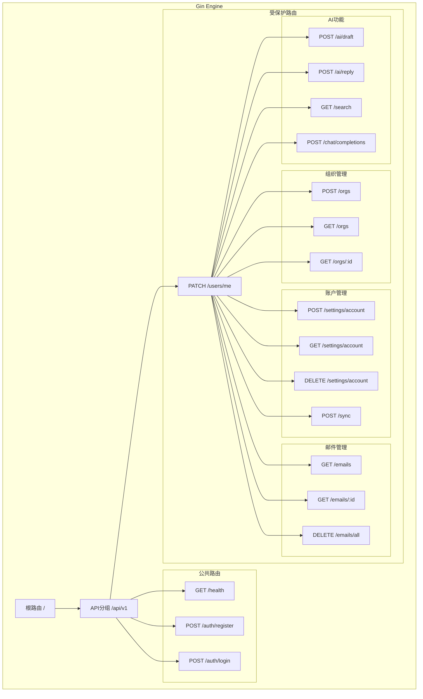

**图表来源**
- [routes.go](file://backend/internal/router/routes.go#L26-L99)

### 中间件系统

EchoMind实现了多层次的中间件系统，包括认证、CORS、请求追踪等功能。

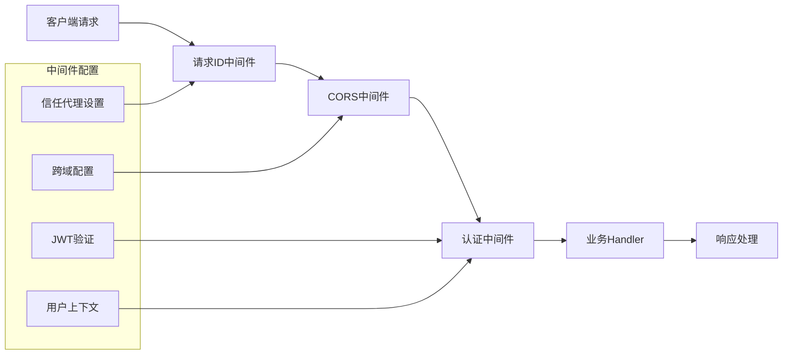

**图表来源**
- [middleware.go](file://backend/internal/router/middleware.go#L14-L44)
- [auth.go](file://backend/internal/middleware/auth.go#L18-L60)

#### 中间件功能详解

1. **请求ID追踪**: 为每个请求生成唯一标识符，便于调试和监控
2. **CORS配置**: 允许前端应用跨域访问API
3. **JWT认证**: 验证用户身份并提取用户信息
4. **环境配置**: 根据部署环境调整中间件行为

**章节来源**
- [middleware.go](file://backend/internal/router/middleware.go#L14-L44)
- [auth.go](file://backend/internal/middleware/auth.go#L18-L60)

## 核心业务模块

EchoMind的核心业务模块涵盖了邮件管理、用户管理、组织管理和AI智能处理等多个方面。

### 用户认证与授权

用户认证系统提供了完整的注册、登录和个人资料管理功能。

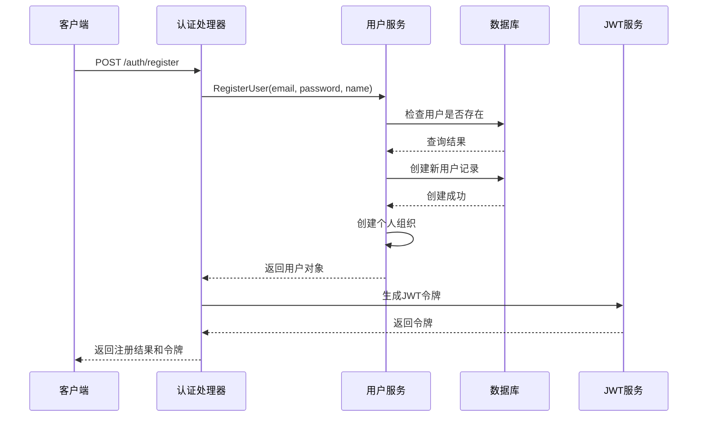

**图表来源**
- [auth.go](file://backend/internal/handler/auth.go#L28-L64)
- [user.go](file://backend/internal/service/user.go#L37-L79)

#### 认证流程特点

1. **密码加密**: 使用bcrypt算法加密存储密码
2. **JWT令牌**: 提供短期有效的访问令牌
3. **自动登录**: 注册成功后自动登录获取令牌
4. **个人组织**: 每个用户自动创建个人组织

**章节来源**
- [auth.go](file://backend/internal/handler/auth.go#L28-L127)
- [user.go](file://backend/internal/service/user.go#L37-L140)

### 邮件账户管理

邮件账户管理系统支持多种邮件提供商的连接和管理。

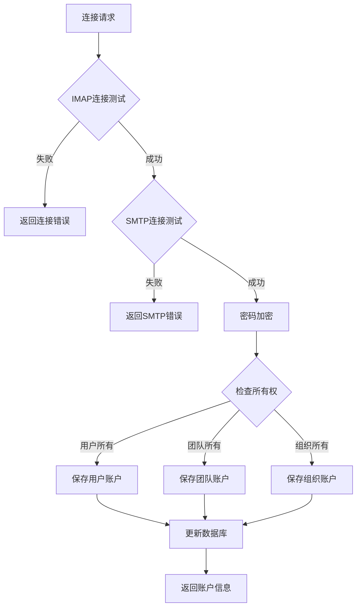

**图表来源**
- [account.go](file://backend/internal/service/account.go#L31-L111)

#### 账户管理特性

1. **多所有权**: 支持用户、团队、组织三种所有权模式
2. **安全加密**: 密码使用AES加密存储
3. **连接验证**: 自动测试IMAP和SMTP连接
4. **灵活配置**: 支持多种邮件提供商配置

**章节来源**
- [account.go](file://backend/internal/service/account.go#L31-L190)

### 邮件内容处理

邮件内容处理模块提供了邮件的增删改查和智能分析功能。

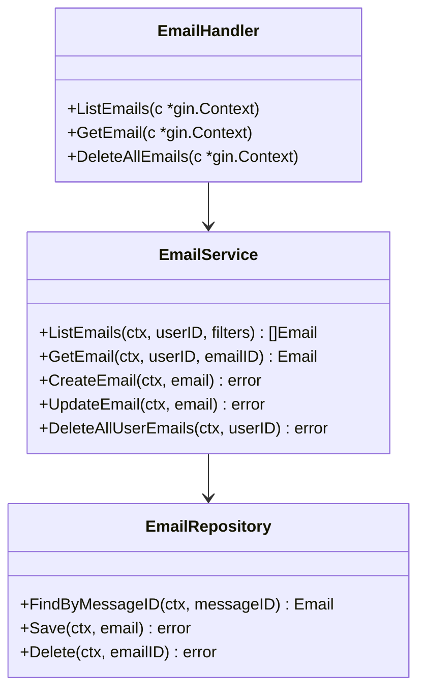

**图表来源**
- [email.go](file://backend/internal/service/email.go#L13-L20)
- [email.go](file://backend/internal/handler/email.go#L22-L28)

#### 邮件处理功能

1. **智能过滤**: 支持按文件夹、类别、智能标签过滤
2. **分页查询**: 大量邮件的高效分页处理
3. **全文检索**: 基于向量搜索的邮件内容检索
4. **批量操作**: 支持批量删除和标记操作

**章节来源**
- [email.go](file://backend/internal/service/email.go#L25-L126)
- [email.go](file://backend/internal/handler/email.go#L30-L108)

## 事件驱动架构

EchoMind采用事件驱动架构来处理异步任务和系统解耦。

### 事件总线设计

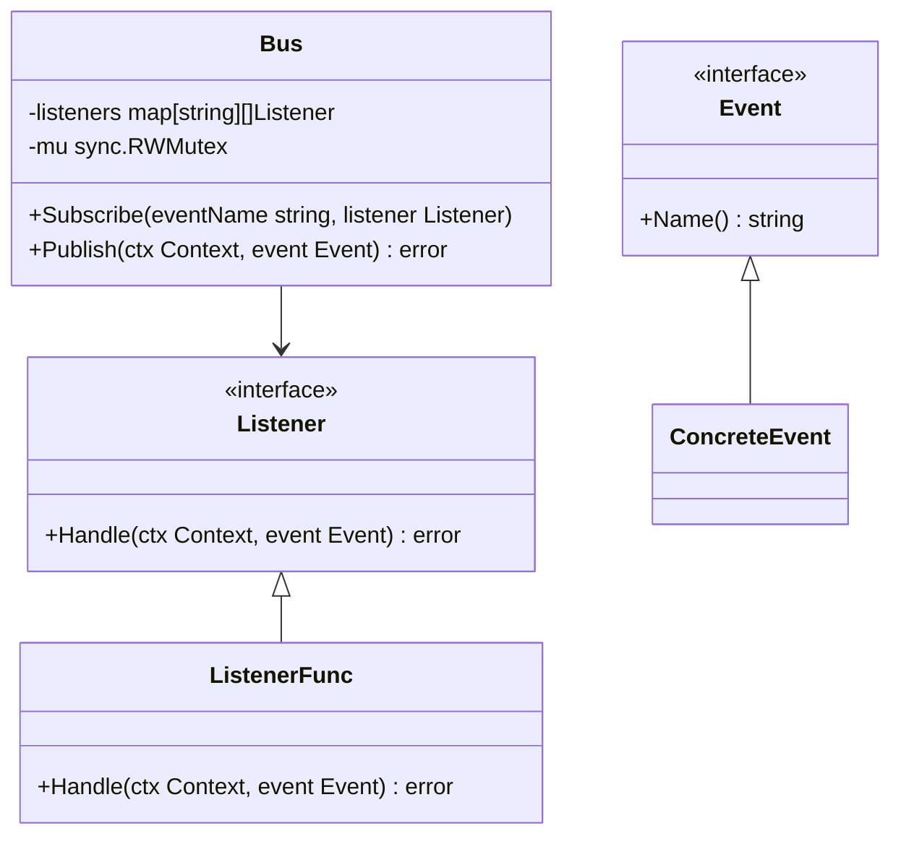

**图表来源**
- [bus.go](file://backend/pkg/event/bus/bus.go#L25-L63)

### 事件处理流程

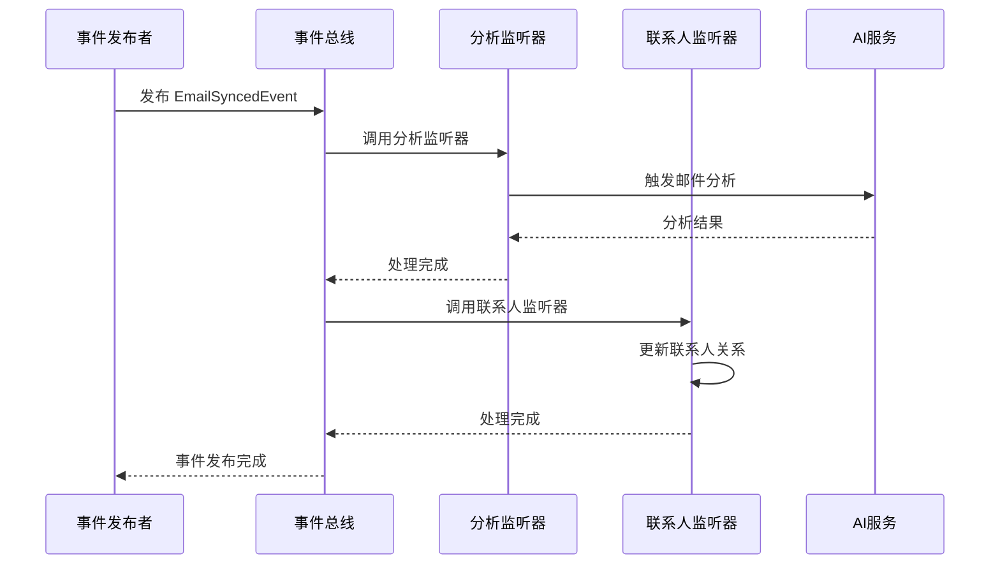

**图表来源**
- [bus.go](file://backend/pkg/event/bus/bus.go#L45-L62)

#### 事件系统特性

1. **内存事件总线**: 基于内存的事件发布订阅机制
2. **同步执行**: 当前版本采用同步方式执行监听器
3. **错误处理**: 事件处理失败时的错误传播机制
4. **类型安全**: 事件和监听器的强类型定义

**章节来源**
- [bus.go](file://backend/pkg/event/bus/bus.go#L8-L63)

## 配置管理

EchoMind采用分层配置管理，支持环境变量覆盖和动态配置更新。

### 配置结构

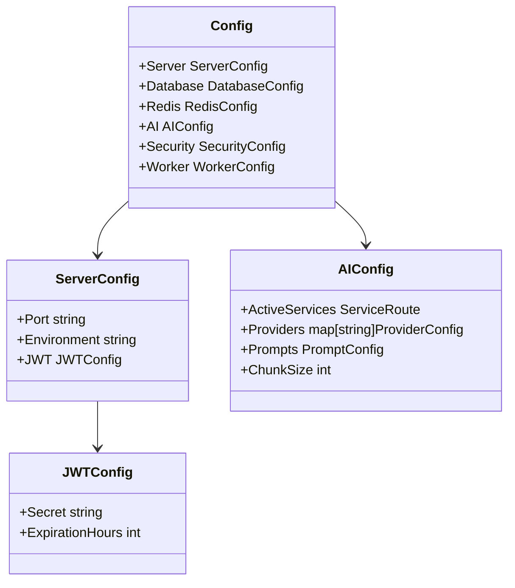

**图表来源**
- [app_config.go](file://backend/configs/app_config.go#L3-L66)

### 配置加载流程

1. **YAML配置**: 从配置文件加载基础配置
2. **环境变量**: 从环境变量覆盖配置值
3. **验证检查**: 验证配置的有效性和完整性
4. **动态更新**: 支持运行时配置更新

**章节来源**
- [app_config.go](file://backend/configs/app_config.go#L1-L66)

## 开发指南

### 添加新API端点

要添加一个新的API端点，请按照以下步骤操作：

#### 1. 创建Handler
```go
// 在internal/handler目录下创建新文件
type NewHandler struct {
    service NewService
}

func NewNewHandler(service NewService) *NewHandler {
    return &NewHandler{service: service}
}

func (h *NewHandler) NewEndpoint(c *gin.Context) {
    // 实现业务逻辑
}
```

#### 2. 创建Service
```go
// 在internal/service目录下创建新文件
type NewService struct {
    db *gorm.DB
}

func NewNewService(db *gorm.DB) *NewService {
    return &NewService{db: db}
}

func (s *NewService) BusinessLogic(params) (result, error) {
    // 实现业务逻辑
}
```

#### 3. 注册路由
```go
// 在internal/router/routes.go中添加路由
protected.POST("/new-endpoint", h.New.NewEndpoint)
```

#### 4. 注入依赖
```go
// 在main.go中注入新服务
newService := service.NewNewService(container.DB)
newHandler := handler.NewNewHandler(newService)
```

### 添加新数据模型

#### 1. 定义模型
```go
// 在internal/model目录下创建新文件
type NewModel struct {
    ID        uuid.UUID `gorm:"type:uuid;primary_key"`
    Name      string
    CreatedAt time.Time
    UpdatedAt time.Time
}
```

#### 2. 更新数据库迁移
```go
// 在bootstrap/app.go中添加模型
models := []interface{}{
    // ... 其他模型
    &model.NewModel{},
}
```

### 添加新事件

#### 1. 定义事件
```go
// 在internal/event目录下创建新文件
type NewEvent struct {
    UserID uuid.UUID
    Data   string
}

func (e NewEvent) Name() string {
    return "new.event"
}
```

#### 2. 创建监听器
```go
// 在internal/listener目录下创建新文件
type NewEventListener struct {
    service Service
    logger  logger.Logger
}

func NewNewEventListener(service Service, logger logger.Logger) *NewEventListener {
    return &NewEventListener{service: service, logger: logger}
}

func (l *NewEventListener) Handle(ctx context.Context, event event.Event) error {
    // 处理事件
}
```

#### 3. 注册监听器
```go
// 在container.go中注册监听器
eventBus.Subscribe(event.NewEventName, newListener)
```

### 性能优化建议

1. **数据库索引**: 为常用查询字段添加索引
2. **连接池**: 合理配置数据库连接池大小
3. **缓存策略**: 对频繁访问的数据使用缓存
4. **批量操作**: 减少数据库往返次数
5. **异步处理**: 使用事件总线处理耗时任务

### 测试策略

1. **单元测试**: 为每个Service编写单元测试
2. **集成测试**: 测试Handler和Service的集成
3. **端到端测试**: 使用Playwright进行UI测试
4. **性能测试**: 定期进行负载测试

## 总结

EchoMind后端架构体现了现代Go应用的最佳实践，通过清晰的分层设计、依赖注入、事件驱动等模式，构建了一个可扩展、可维护的企业级系统。该架构不仅支持当前的功能需求，还为未来的功能扩展提供了良好的基础。

开发者在使用该架构时，应遵循既定的设计原则和开发规范，确保代码质量和系统稳定性。通过合理的模块化设计和清晰的职责划分，可以快速响应业务需求的变化，同时保持系统的长期可维护性。