# 事件发布机制

<cite>
**本文档中引用的文件**
- [email_events.go](file://backend/internal/event/email_events.go)
- [sync.go](file://backend/internal/service/sync.go)
- [bus.go](file://backend/pkg/event/bus/bus.go)
- [email_listeners.go](file://backend/internal/listener/email_listeners.go)
- [container.go](file://backend/internal/app/container.go)
- [sync_test.go](file://backend/internal/service/sync_test.go)
</cite>

## 目录
1. [简介](#简介)
2. [系统架构概览](#系统架构概览)
3. [核心组件分析](#核心组件分析)
4. [事件结构体详解](#事件结构体详解)
5. [事件总线机制](#事件总线机制)
6. [SyncService中的事件发布流程](#syncservice中的事件发布流程)
7. [监听器处理机制](#监听器处理机制)
8. [依赖注入与配置](#依赖注入与配置)
9. [错误处理与日志记录](#错误处理与日志记录)
10. [最佳实践指南](#最佳实践指南)
11. [总结](#总结)

## 简介

事件发布机制是EchoMind系统中的核心通信模式，它通过事件驱动的方式实现了模块间的松耦合解耦。本文档深入分析了`SyncService.SyncEmails`方法如何在完成邮件同步后发布`EmailSyncedEvent`事件的完整流程，包括事件结构体定义、事件总线注入方式、发布流程以及监听器处理机制。

该机制的核心价值在于：
- 实现模块间的消息传递和状态同步
- 支持异步处理和任务队列集成
- 提供可扩展的事件处理架构
- 确保系统的可观测性和可维护性

## 系统架构概览

事件发布机制采用典型的发布-订阅模式，主要由以下组件构成：

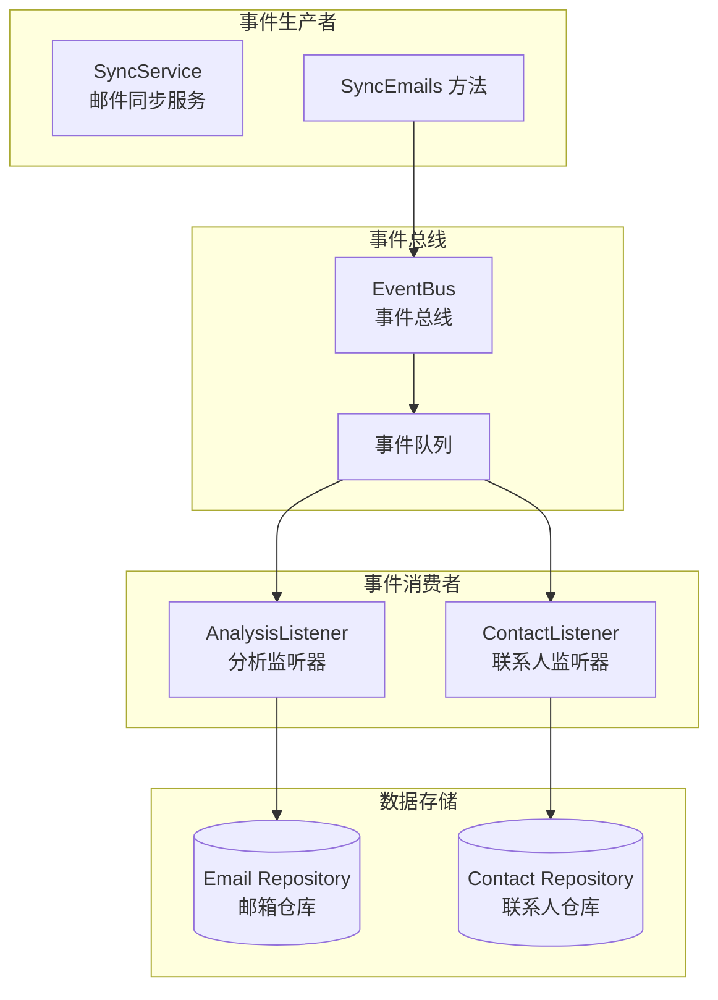

**图表来源**
- [sync.go](file://backend/internal/service/sync.go#L105-L156)
- [bus.go](file://backend/pkg/event/bus/bus.go#L25-L62)
- [email_listeners.go](file://backend/internal/listener/email_listeners.go#L22-L116)

## 核心组件分析

### 事件接口体系

事件发布机制基于统一的接口设计，确保类型安全和扩展性：

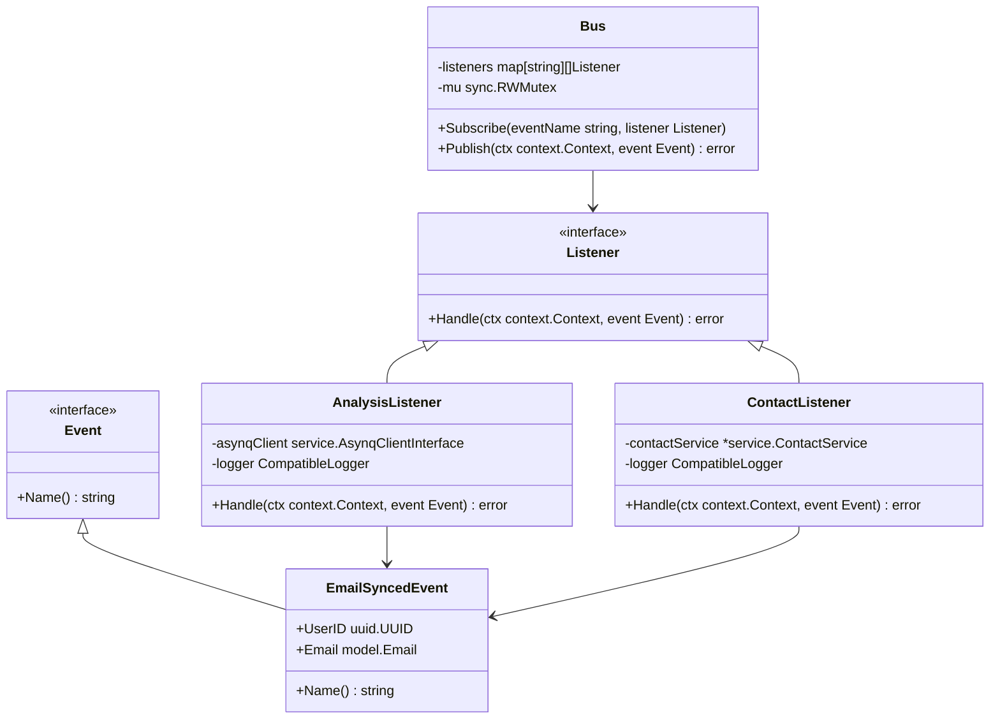

**图表来源**
- [bus.go](file://backend/pkg/event/bus/bus.go#L8-L23)
- [email_events.go](file://backend/internal/event/email_events.go#L10-L18)
- [email_listeners.go](file://backend/internal/listener/email_listeners.go#L22-L116)

**章节来源**
- [bus.go](file://backend/pkg/event/bus/bus.go#L1-L63)
- [email_events.go](file://backend/internal/event/email_events.go#L1-L19)

## 事件结构体详解

### EmailSyncedEvent 结构体

`EmailSyncedEvent`是邮件同步完成后发布的核心事件结构体，包含用户标识和邮件数据：

| 字段名 | 类型 | 描述 | 必需性 |
|--------|------|------|--------|
| UserID | uuid.UUID | 发布事件的用户唯一标识符 | 必需 |
| Email | model.Email | 同步成功的邮件实体对象 | 必需 |

### 事件名称常量

事件名称通过常量定义，确保全局一致性和避免字符串字面量重复：

| 常量名 | 值 | 用途 |
|--------|-----|------|
| EmailSyncedEventName | "email.synced" | 标识邮件同步完成事件 |

### Name() 方法实现

每个事件都必须实现`Name()`方法，这是事件识别的核心机制：

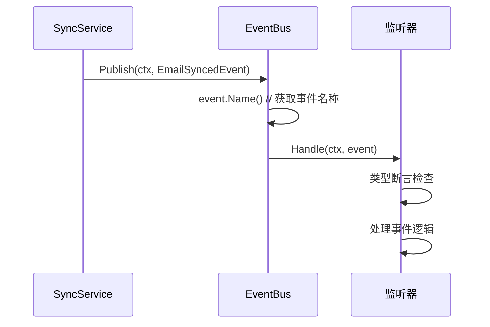

**图表来源**
- [sync.go](file://backend/internal/service/sync.go#L142-L154)
- [bus.go](file://backend/pkg/event/bus/bus.go#L48-L61)

**章节来源**
- [email_events.go](file://backend/internal/event/email_events.go#L1-L19)

## 事件总线机制

### EventBus 设计原理

事件总线采用内存中的简单实现，支持同步事件分发：

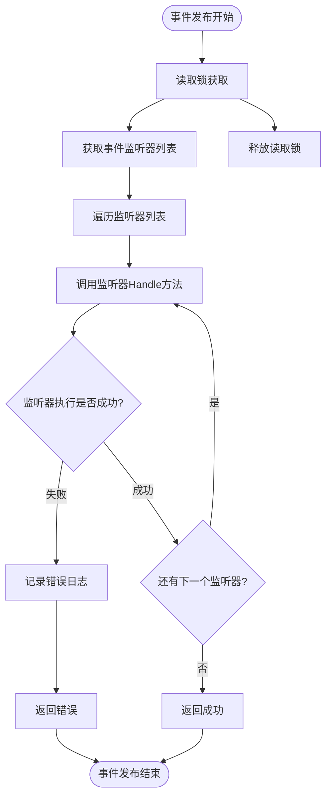

**图表来源**
- [bus.go](file://backend/pkg/event/bus/bus.go#L48-L61)

### 订阅机制

事件总线支持动态订阅和取消订阅：

| 方法 | 功能 | 线程安全性 |
|------|------|------------|
| Subscribe(eventName, listener) | 订阅特定事件 | 使用写锁保护 |
| Publish(ctx, event) | 发布事件到所有订阅者 | 使用读锁保护 |

### 错误处理策略

当前实现采用"失败即停止"的策略，后续可以扩展为异步处理或错误聚合：

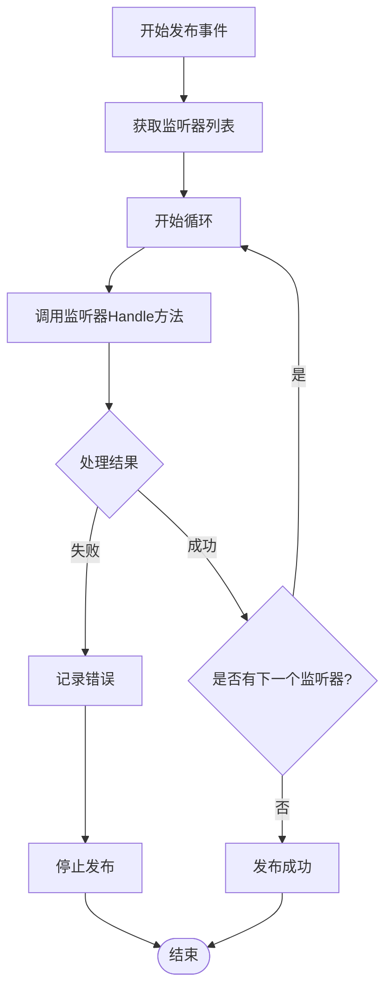

**图表来源**
- [bus.go](file://backend/pkg/event/bus/bus.go#L53-L60)

**章节来源**
- [bus.go](file://backend/pkg/event/bus/bus.go#L1-L63)

## SyncService中的事件发布流程

### SyncEmails 方法核心逻辑

`SyncService.SyncEmails`方法是事件发布的主要入口点，其完整流程如下：

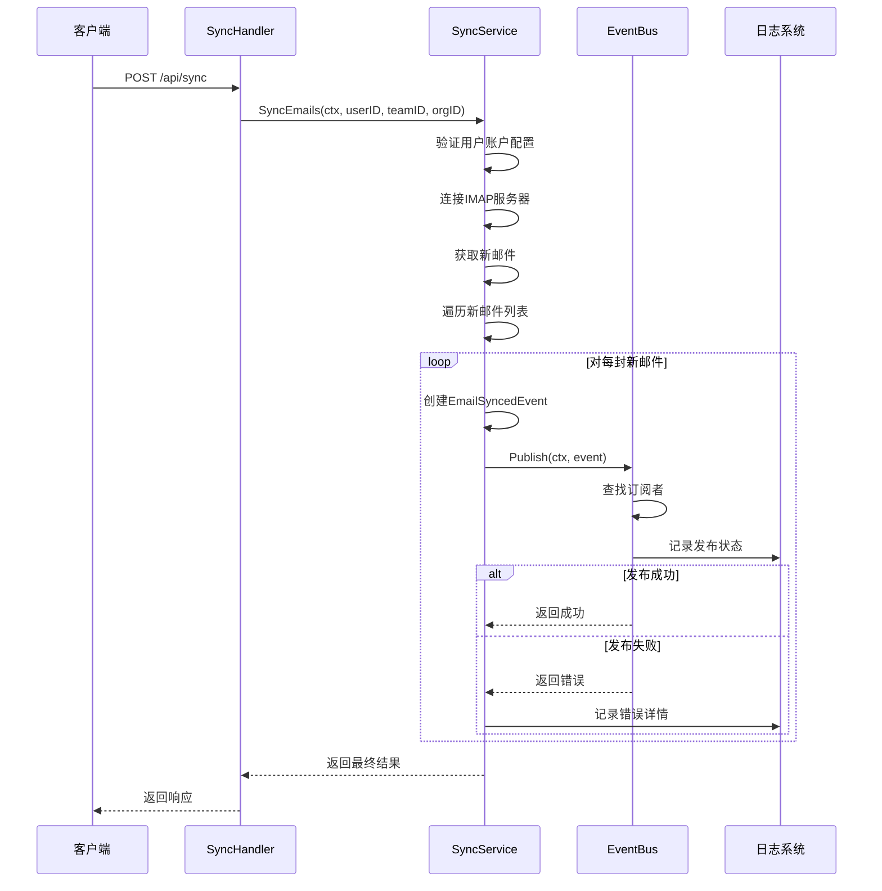

**图表来源**
- [sync.go](file://backend/internal/service/sync.go#L105-L156)
- [sync.go](file://backend/internal/service/sync.go#L142-L154)

### 事件创建与发布过程

事件发布的核心代码展示了完整的创建和分发流程：

| 步骤 | 代码位置 | 功能描述 |
|------|----------|----------|
| 1 | [sync.go](file://backend/internal/service/sync.go#L144-L146) | 创建EmailSyncedEvent实例 |
| 2 | [sync.go](file://backend/internal/service/sync.go#L148) | 调用EventBus.Publish方法 |
| 3 | [sync.go](file://backend/internal/service/sync.go#L149-L152) | 错误处理和日志记录 |

### 批量事件处理

对于批量同步的新邮件，系统采用逐个事件发布的方式：

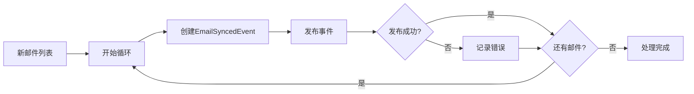

**图表来源**
- [sync.go](file://backend/internal/service/sync.go#L142-L154)

**章节来源**
- [sync.go](file://backend/internal/service/sync.go#L105-L156)

## 监听器处理机制

### AnalysisListener 分析任务监听器

AnalysisListener负责处理邮件分析任务的创建工作：

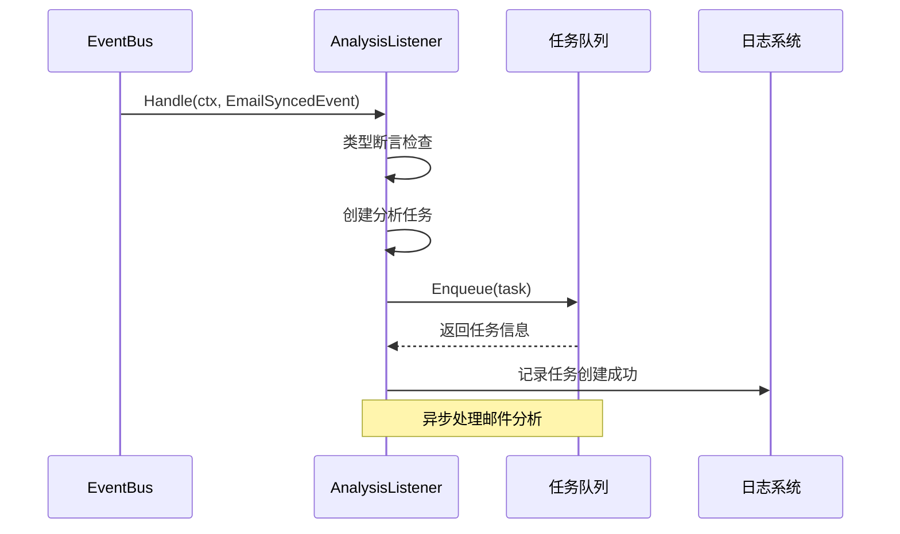

**图表来源**
- [email_listeners.go](file://backend/internal/listener/email_listeners.go#L35-L65)

### ContactListener 联系人更新监听器

ContactListener处理邮件发送者信息的联系人更新：

| 处理步骤 | 功能描述 | 错误处理 |
|----------|----------|----------|
| 1 | 解析发送者信息 | 跳过无效格式 |
| 2 | 更新联系人记录 | 记录警告日志 |
| 3 | 增加交互计数 | 继续处理下一事件 |

### 监听器注册机制

在应用启动时，所有监听器都会被注册到事件总线上：

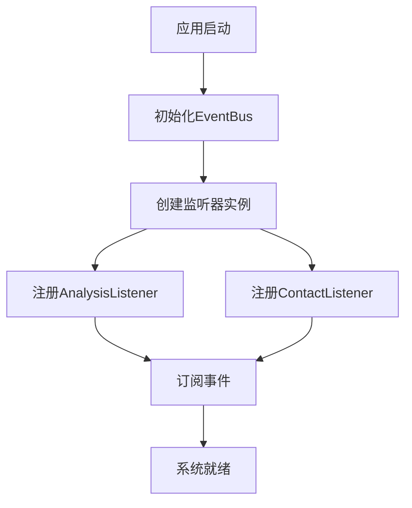

**图表来源**
- [container.go](file://backend/internal/app/container.go#L61-L67)

**章节来源**
- [email_listeners.go](file://backend/internal/listener/email_listeners.go#L1-L116)

## 依赖注入与配置

### Container 中的 EventBus 注入

依赖注入容器负责管理所有服务的生命周期和依赖关系：

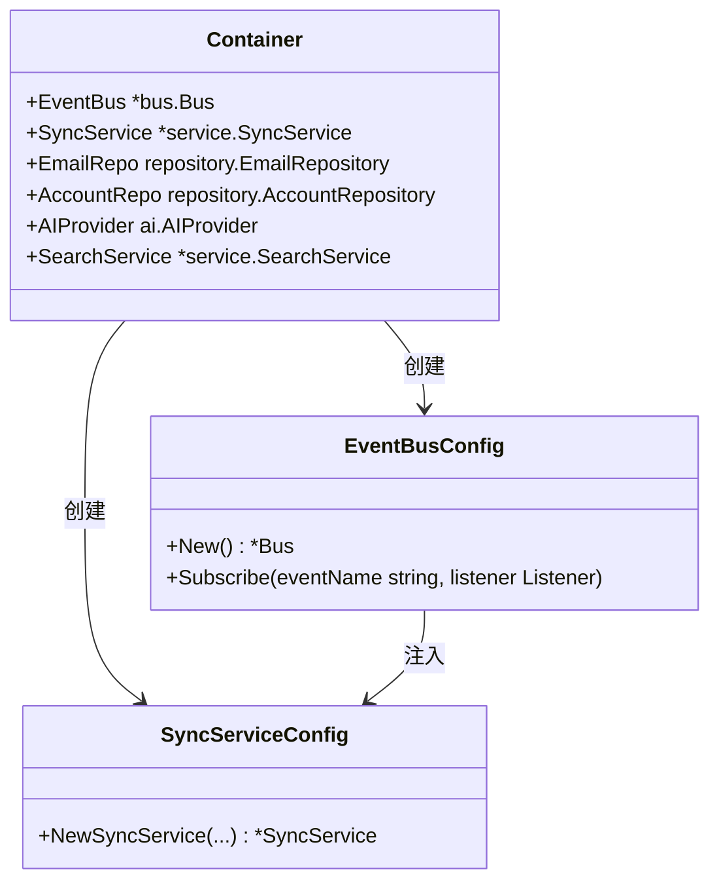

**图表来源**
- [container.go](file://backend/internal/app/container.go#L15-L29)

### EventBus 的初始化和配置

EventBus在应用启动时被创建并配置：

| 配置项 | 值 | 说明 |
|--------|-----|------|
| 初始容量 | 0 | 动态分配 |
| 并发控制 | RWMutex | 支持高并发读取 |
| 错误处理 | 同步阻塞 | 简化调试和错误追踪 |

### 监听器依赖注入

监听器通过构造函数注入所需的依赖：

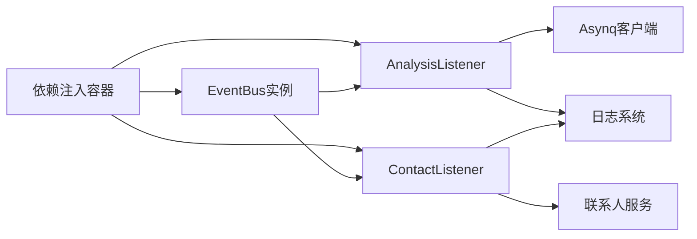

**图表来源**
- [container.go](file://backend/internal/app/container.go#L61-L67)

**章节来源**
- [container.go](file://backend/internal/app/container.go#L1-L122)

## 错误处理与日志记录

### 事件发布错误处理

事件发布过程中的错误处理遵循分级策略：

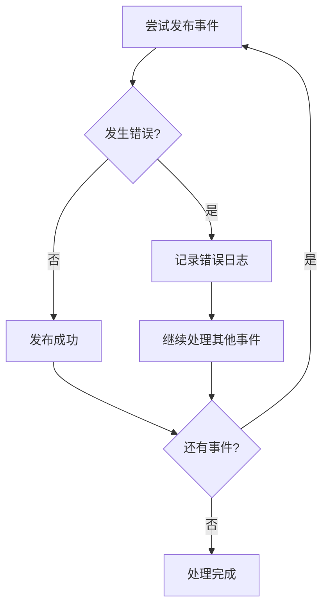

**图表来源**
- [sync.go](file://backend/internal/service/sync.go#L148-L152)

### 日志记录最佳实践

系统在关键节点记录详细的日志信息：

| 日志级别 | 记录内容 | 示例 |
|----------|----------|------|
| Error | 事件发布失败 | `"Failed to publish email synced event"` |
| Debug | 任务创建成功 | `"Enqueued analysis task"` |
| Warn | 可选操作失败 | `"Failed to update contact"` |

### 错误恢复策略

当前实现采用"失败不影响主流程"的策略：

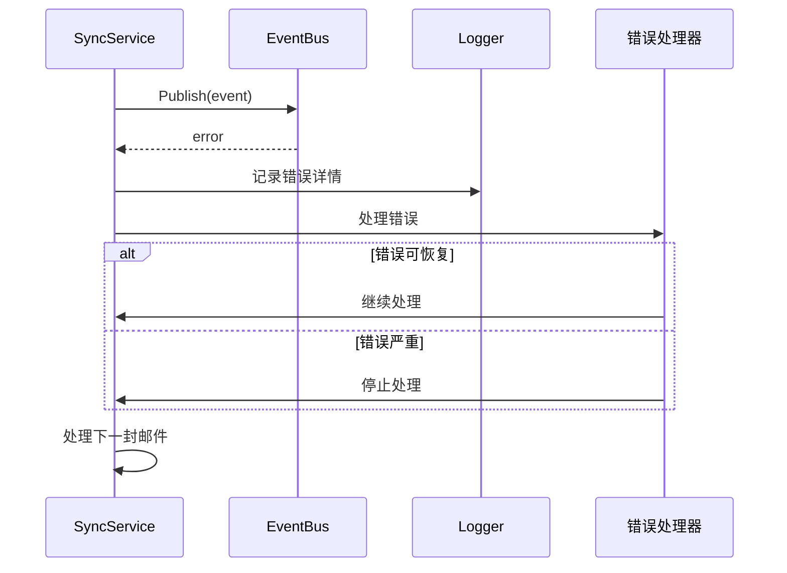

**图表来源**
- [sync.go](file://backend/internal/service/sync.go#L148-L152)

**章节来源**
- [sync.go](file://backend/internal/service/sync.go#L148-L152)

## 最佳实践指南

### 事件设计原则

1. **单一职责**：每个事件只描述一个具体的业务场景
2. **不可变性**：事件发布后不应修改其内容
3. **版本兼容**：新版本应向后兼容旧版本事件

### 性能优化建议

| 优化方向 | 实现方式 | 性能收益 |
|----------|----------|----------|
| 批量处理 | 合并相似事件 | 减少网络开销 |
| 异步处理 | 后台任务队列 | 提升响应速度 |
| 缓存机制 | 频繁访问事件缓存 | 降低计算成本 |
| 连接池 | 复用数据库连接 | 减少连接开销 |

### 监听器开发规范

1. **错误处理**：监听器应妥善处理各种异常情况
2. **幂等性**：确保多次处理同一事件不会产生副作用
3. **性能考虑**：避免在监听器中执行耗时操作
4. **日志记录**：适当记录处理过程和结果

### 测试策略

单元测试应覆盖以下场景：

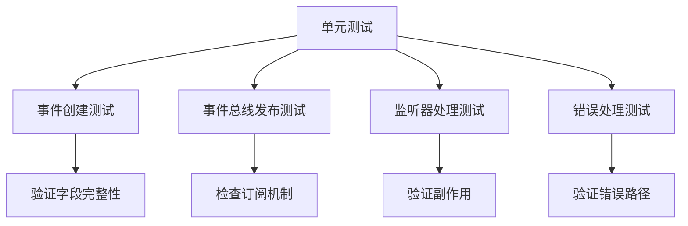

**图表来源**
- [sync_test.go](file://backend/internal/service/sync_test.go#L58-L169)

## 总结

EchoMind的事件发布机制展现了现代软件架构中事件驱动设计的优势：

### 核心优势

1. **松耦合架构**：生产者和消费者完全解耦
2. **可扩展性**：支持动态添加新的事件类型和监听器
3. **可观测性**：完整的事件流和日志记录
4. **可靠性**：完善的错误处理和恢复机制

### 技术特点

- 基于接口的设计确保了类型安全
- 内存中的事件总线提供了高效的本地通信
- 依赖注入容器简化了服务管理和配置
- 完善的测试覆盖保证了代码质量

### 应用价值

该事件发布机制不仅支持当前的邮件同步功能，还为未来的功能扩展奠定了坚实的基础。通过事件驱动的方式，系统能够灵活地响应各种业务需求，同时保持代码的清晰性和可维护性。

这种设计模式特别适用于需要实时处理和状态同步的应用场景，为构建可扩展的企业级应用提供了优秀的参考实现。