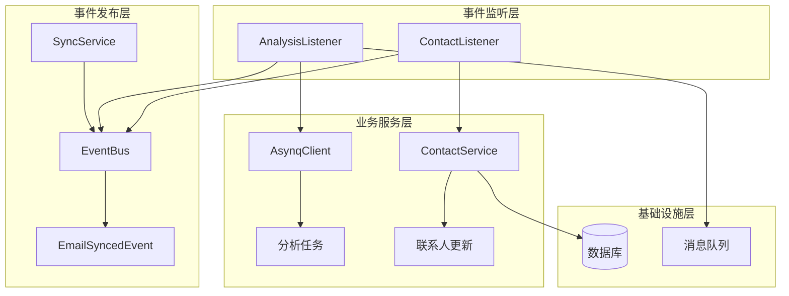
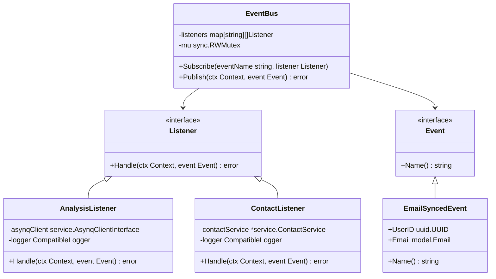
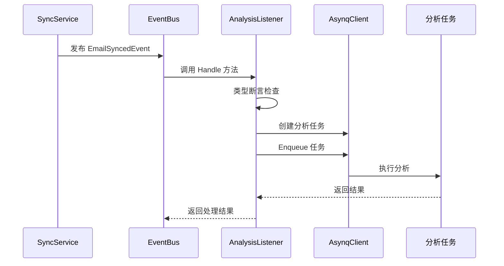
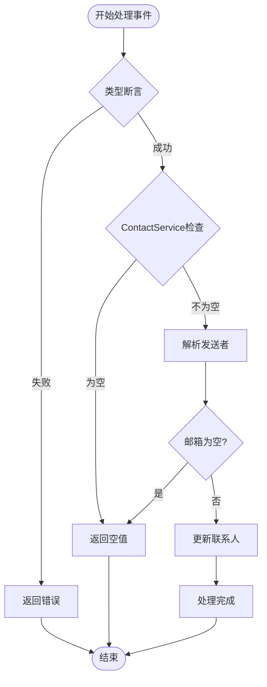
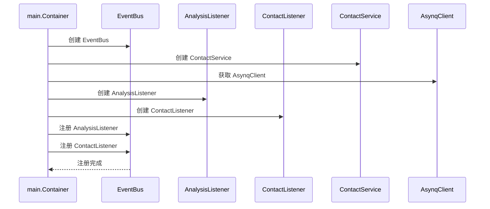
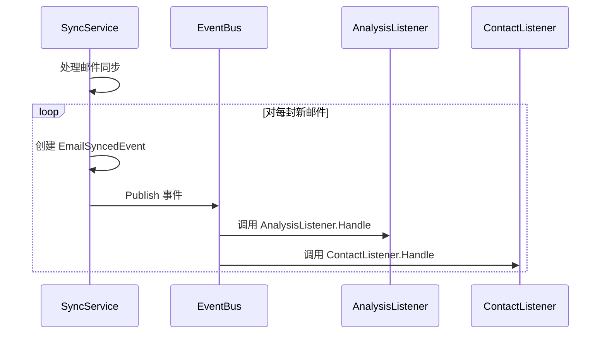
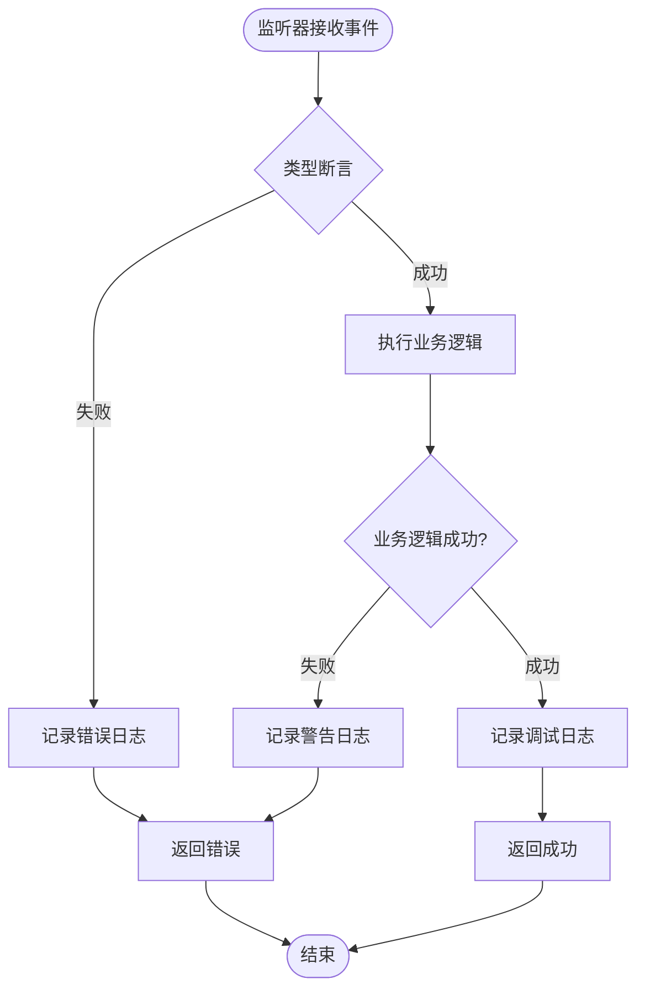

# 事件监听器

<cite>
**本文档中引用的文件**
- [email_listeners.go](file://backend/internal/listener/email_listeners.go)
- [email_events.go](file://backend/internal/event/email_events.go)
- [bus.go](file://backend/pkg/event/bus/bus.go)
- [container.go](file://backend/internal/app/container.go)
- [sync.go](file://backend/internal/service/sync.go)
- [contact.go](file://backend/internal/service/contact.go)
- [analyze.go](file://backend/internal/tasks/analyze.go)
</cite>

## 目录
1. [简介](#简介)
2. [事件系统架构](#事件系统架构)
3. [核心组件分析](#核心组件分析)
4. [事件监听器详解](#事件监听器详解)
5. [依赖注入与注册](#依赖注入与注册)
6. [事件发布流程](#事件发布流程)
7. [错误处理机制](#错误处理机制)
8. [最佳实践指南](#最佳实践指南)
9. [故障排除](#故障排除)
10. [总结](#总结)

## 简介

EchoMind 应用采用事件驱动架构，通过事件总线（EventBus）实现模块间的解耦通信。本文档重点介绍两个核心事件监听器：`AnalysisListener` 和 `ContactListener`，它们分别负责处理邮件分析任务和联系人信息更新。

事件监听器模式允许系统在特定事件发生时自动执行相应的业务逻辑，无需直接调用，从而提高了系统的可扩展性和维护性。

## 事件系统架构

### 整体架构图



**图表来源**
- [sync.go](file://backend/internal/service/sync.go#L140-L154)
- [bus.go](file://backend/pkg/event/bus/bus.go#L46-L62)
- [email_listeners.go](file://backend/internal/listener/email_listeners.go#L22-L116)

### 核心接口设计



**图表来源**
- [bus.go](file://backend/pkg/event/bus/bus.go#L8-L16)
- [email_events.go](file://backend/internal/event/email_events.go#L10-L18)
- [email_listeners.go](file://backend/internal/listener/email_listeners.go#L22-L116)

## 核心组件分析

### EmailSyncedEvent 事件结构

`EmailSyncedEvent` 是系统中最重要的事件类型，当邮件成功同步后触发：

| 字段 | 类型 | 描述 |
|------|------|------|
| UserID | uuid.UUID | 触发事件的用户ID |
| Email | model.Email | 同步的邮件数据 |

**章节来源**
- [email_events.go](file://backend/internal/event/email_events.go#L10-L18)

### EventBus 实现

事件总线提供了简单而有效的事件发布订阅机制：

| 方法 | 功能 | 特点 |
|------|------|------|
| Subscribe | 订阅事件 | 支持多监听器 |
| Publish | 发布事件 | 同步执行，顺序处理 |
| Handle | 处理事件 | 接口统一 |

**章节来源**
- [bus.go](file://backend/pkg/event/bus/bus.go#L38-L62)

## 事件监听器详解

### AnalysisListener 分析监听器

AnalysisListener 负责将邮件分析任务入队到异步任务队列中。

#### 核心功能

1. **任务创建与验证**
   - 验证事件类型是否为 `EmailSyncedEvent`
   - 检查 AsynqClient 是否可用
   - 创建分析任务实例

2. **任务入队**
   - 将分析任务添加到消息队列
   - 记录任务状态和错误信息

#### 实现细节



**图表来源**
- [email_listeners.go](file://backend/internal/listener/email_listeners.go#L35-L65)
- [analyze.go](file://backend/internal/tasks/analyze.go#L29-L35)

#### 错误处理策略

AnalysisListener 采用以下错误处理策略：

| 场景 | 处理方式 | 日志级别 |
|------|----------|----------|
| 无效事件类型 | 返回错误 | ERROR |
| AsynqClient 为空 | 忽略处理 | DEBUG |
| 任务创建失败 | 记录错误并返回 | ERROR |
| 入队失败 | 记录错误并返回 | ERROR |

**章节来源**
- [email_listeners.go](file://backend/internal/listener/email_listeners.go#L35-L65)

### ContactListener 联系人监听器

ContactListener 处理邮件发送者信息，更新或创建联系人记录。

#### 核心功能

1. **发送者解析**
   - 解析邮件发送者字符串格式
   - 提取邮箱地址和姓名

2. **联系人更新**
   - 更新现有联系人的交互统计
   - 创建新的联系人记录
   - 维护交互时间和频率

#### 实现流程



**图表来源**
- [email_listeners.go](file://backend/internal/listener/email_listeners.go#L81-L101)

#### 发送者解析算法

ContactListener 使用智能解析算法处理不同格式的发送者信息：

| 输入格式 | 输出 | 处理逻辑 |
|----------|------|----------|
| "Name <email@example.com>" | email@example.com, Name | 提取邮箱和名称 |
| "email@example.com" | email@example.com, "" | 只提取邮箱 |
| "Invalid Format" | email@example.com, "" | 默认邮箱格式 |

**章节来源**
- [email_listeners.go](file://backend/internal/listener/email_listeners.go#L104-L115)

## 依赖注入与注册

### 容器初始化流程

系统通过依赖注入容器管理所有组件的生命周期和依赖关系：



**图表来源**
- [container.go](file://backend/internal/app/container.go#L61-L67)

### 注册过程详解

在容器初始化过程中，监听器通过以下步骤注册到事件总线：

1. **创建监听器实例**
   ```go
   analysisListener := listener.NewAnalysisListener(app.AsynqClient, app.Logger)
   contactListener := listener.NewContactListener(contactService, app.Logger)
   ```

2. **注册到事件总线**
   ```go
   eventBus.Subscribe(event.EmailSyncedEventName, analysisListener)
   eventBus.Subscribe(event.EmailSyncedEventName, contactListener)
   ```

**章节来源**
- [container.go](file://backend/internal/app/container.go#L61-L67)

## 事件发布流程

### SyncService 中的事件发布

当邮件同步完成后，SyncService 会发布 `EmailSyncedEvent` 事件：



**图表来源**
- [sync.go](file://backend/internal/service/sync.go#L140-L154)

### 事件发布的关键步骤

| 步骤 | 功能 | 错误处理 |
|------|------|----------|
| 1. 创建事件 | 构建 EmailSyncedEvent 实例 | 记录错误日志 |
| 2. 发布事件 | 调用 EventBus.Publish | 返回错误信息 |
| 3. 同步执行 | 顺序调用所有监听器 | 停止后续执行 |

**章节来源**
- [sync.go](file://backend/internal/service/sync.go#L140-L154)

## 错误处理机制

### 监听器级别的错误处理

每个监听器都实现了完善的错误处理机制：



**图表来源**
- [email_listeners.go](file://backend/internal/listener/email_listeners.go#L35-L101)

### 日志记录策略

| 监听器 | 错误场景 | 日志级别 | 记录内容 |
|--------|----------|----------|----------|
| AnalysisListener | 无效事件类型 | ERROR | 事件类型信息 |
| AnalysisListener | 任务入队失败 | ERROR | 邮件ID、用户ID、错误详情 |
| ContactListener | 联系人更新失败 | WARN | 用户ID、邮箱地址、错误信息 |

**章节来源**
- [email_listeners.go](file://backend/internal/listener/email_listeners.go#L47-L59)
- [email_listeners.go](file://backend/internal/listener/email_listeners.go#L94-L98)

## 最佳实践指南

### 编写自定义事件监听器

基于现有监听器的设计模式，以下是编写自定义事件监听器的最佳实践：

#### 1. 实现 Listener 接口

```go
type CustomListener struct {
    // 依赖注入的服务
    service *SomeService
    logger  CompatibleLogger
}

func NewCustomListener(service *SomeService, logger echologger.Logger) *CustomListener {
    return &CustomListener{
        service: service,
        logger:  echologger.AsZapSugaredLogger(logger),
    }
}

func (l *CustomListener) Handle(ctx context.Context, e bus.Event) error {
    // 类型断言检查
    evt, ok := e.(CustomEvent)
    if !ok {
        return fmt.Errorf("invalid event type: %T", e)
    }
    
    // 业务逻辑处理
    if err := l.service.ProcessCustomEvent(ctx, evt); err != nil {
        l.logger.Errorw("Failed to process custom event",
            "event_id", evt.ID,
            "error", err)
        return err
    }
    
    return nil
}
```

#### 2. 事件定义规范

```go
const CustomEventName = "custom.event"

type CustomEvent struct {
    ID        uuid.UUID
    Data      string
    Timestamp time.Time
}

func (e CustomEvent) Name() string {
    return CustomEventName
}
```

#### 3. 注册到事件总线

```go
// 在容器初始化时注册
customListener := listener.NewCustomListener(customService, app.Logger)
eventBus.Subscribe(event.CustomEventName, customListener)
```

### 性能优化建议

1. **避免阻塞操作**
   - 监听器应快速处理事件
   - 复杂业务逻辑应异步处理

2. **错误隔离**
   - 单个监听器的错误不应影响其他监听器
   - 使用适当的错误处理策略

3. **资源管理**
   - 及时释放监听器使用的资源
   - 避免内存泄漏

## 故障排除

### 常见问题及解决方案

#### 1. 监听器未被调用

**症状**: 事件发布后监听器没有响应

**排查步骤**:
- 检查事件名称是否匹配
- 验证监听器是否正确注册
- 确认事件总线配置

**解决方案**:
```go
// 确保使用正确的事件名称常量
eventBus.Subscribe(event.EmailSyncedEventName, listener)
```

#### 2. 类型断言失败

**症状**: 监听器收到意外的事件类型

**排查步骤**:
- 检查事件发布方的事件类型
- 验证监听器的类型断言逻辑

**解决方案**:
```go
// 添加更详细的日志记录
l.logger.Debugw("Received event",
    "event_type", reflect.TypeOf(e),
    "event_name", e.Name())
```

#### 3. 依赖注入问题

**症状**: 监听器依赖的服务为空

**排查步骤**:
- 检查容器初始化顺序
- 验证服务注册逻辑

**解决方案**:
```go
// 在容器初始化时确保服务已创建
func NewContainer() (*Container, error) {
    // ... 创建服务 ...
    contactService := service.NewContactService(db)
    // ... 注册监听器 ...
    return &Container{
        EventBus:       eventBus,
        ContactService: contactService,
    }, nil
}
```

### 调试技巧

1. **启用详细日志**
   ```go
   logger.SetLevel(zap.DebugLevel)
   ```

2. **监控事件流**
   ```go
   // 在事件总线上添加中间件
   eventBus.Subscribe("debug", debugListener)
   ```

3. **单元测试**
   ```go
   func TestAnalysisListener_Handle(t *testing.T) {
       // 测试监听器的各种场景
   }
   ```

## 总结

EchoMind 的事件监听器系统通过以下关键特性实现了高效的事件驱动架构：

### 核心优势

1. **松耦合设计**
   - 监听器与事件发布者完全解耦
   - 支持动态添加新的监听器

2. **类型安全**
   - 强类型的事件定义
   - 运行时类型检查

3. **错误隔离**
   - 每个监听器独立处理错误
   - 不影响其他监听器的执行

4. **易于扩展**
   - 标准化的监听器接口
   - 简单的注册机制

### 设计原则

- **单一职责**: 每个监听器只处理一种类型的事件
- **开闭原则**: 易于添加新的监听器而不修改现有代码
- **依赖倒置**: 依赖抽象接口而非具体实现

### 应用价值

事件监听器系统为 EchoMind 提供了：
- **可扩展性**: 支持多种业务场景的事件处理
- **可维护性**: 清晰的职责分离和错误处理
- **性能**: 异步处理和资源隔离

通过遵循本文档提供的最佳实践和设计原则，开发者可以构建健壮、可扩展的事件驱动应用程序。