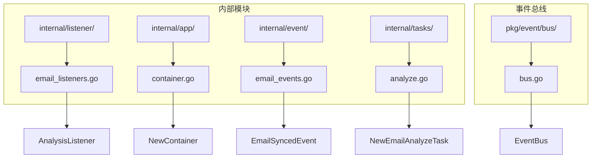
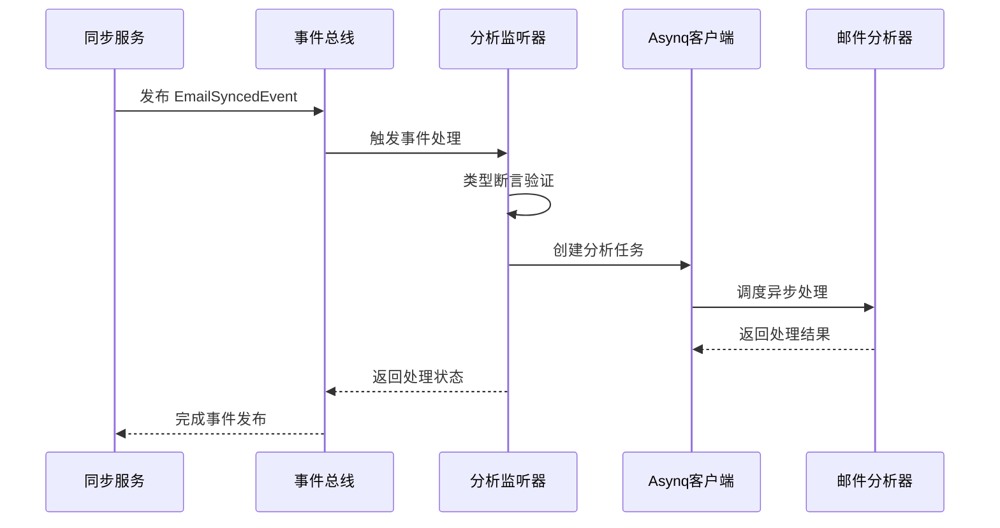
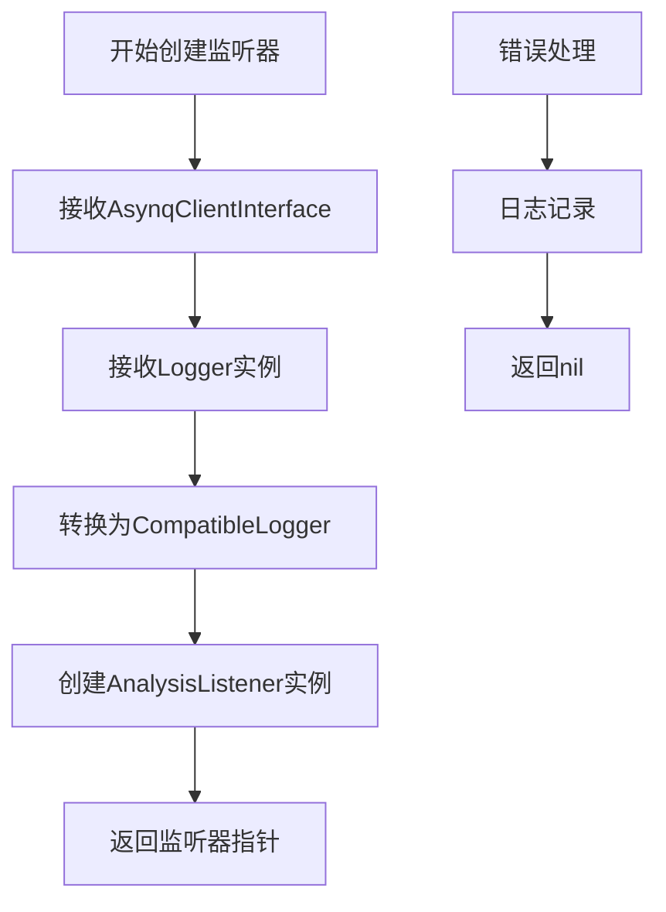
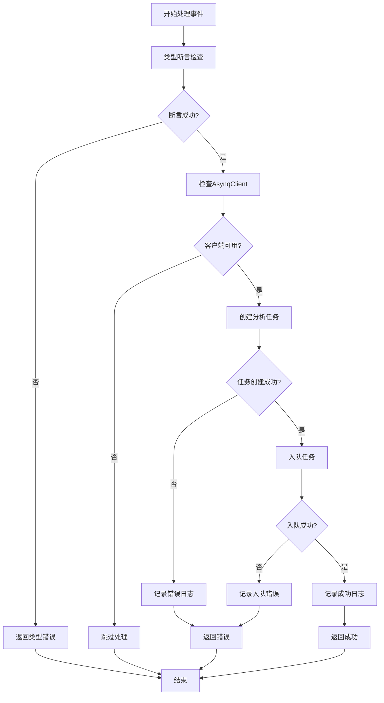
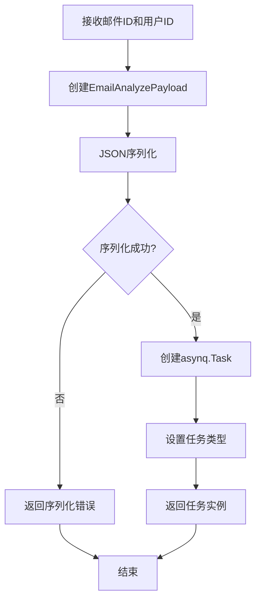
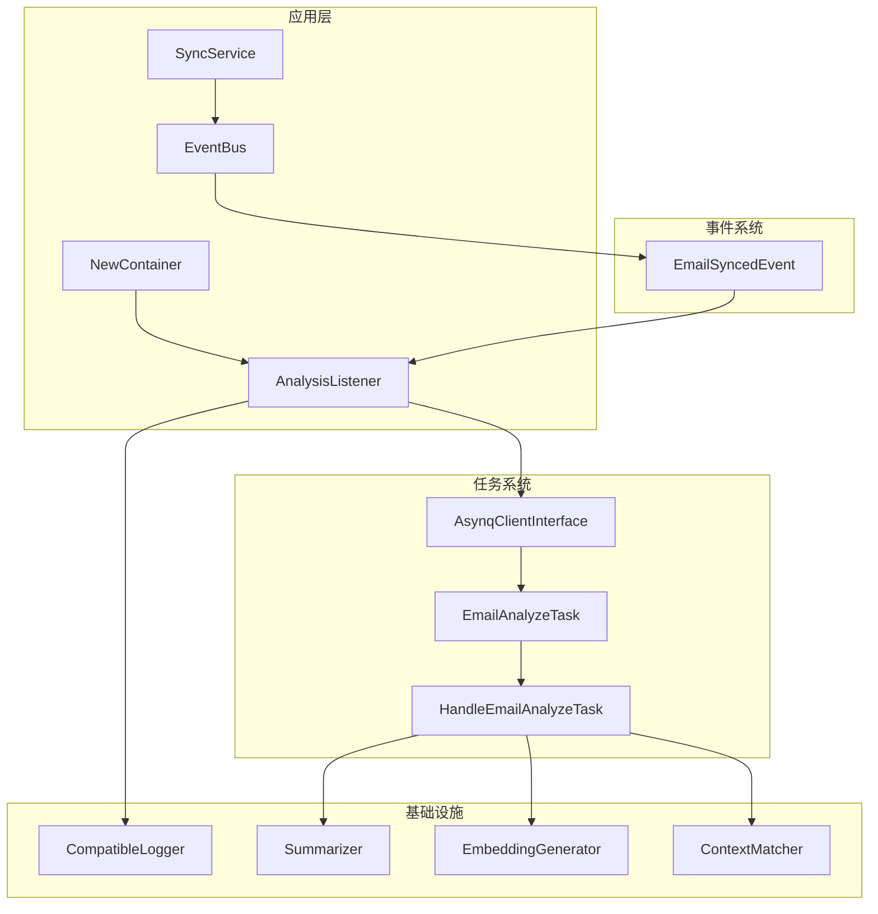

# 分析监听器

<cite>
**本文档中引用的文件**
- [email_listeners.go](file://backend/internal/listener/email_listeners.go)
- [container.go](file://backend/internal/app/container.go)
- [email_events.go](file://backend/internal/event/email_events.go)
- [analyze.go](file://backend/internal/tasks/analyze.go)
- [bus.go](file://backend/pkg/event/bus/bus.go)
</cite>

## 目录
1. [简介](#简介)
2. [项目结构](#项目结构)
3. [核心组件](#核心组件)
4. [架构概览](#架构概览)
5. [详细组件分析](#详细组件分析)
6. [依赖关系分析](#依赖关系分析)
7. [性能考虑](#性能考虑)
8. [故障排除指南](#故障排除指南)
9. [结论](#结论)

## 简介

`AnalysisListener`是EchoMind系统中的一个关键组件，负责监听`EmailSyncedEvent`事件并在邮件同步完成后触发异步分析任务。该监听器采用事件驱动架构，通过依赖注入模式实现松耦合设计，确保系统的可扩展性和可维护性。

## 项目结构

`AnalysisListener`位于以下目录结构中：



**图表来源**
- [email_listeners.go](file://backend/internal/listener/email_listeners.go#L1-L116)
- [container.go](file://backend/internal/app/container.go#L1-L122)
- [email_events.go](file://backend/internal/event/email_events.go#L1-L19)
- [analyze.go](file://backend/internal/tasks/analyze.go#L1-L260)
- [bus.go](file://backend/pkg/event/bus/bus.go#L1-L63)

**章节来源**
- [email_listeners.go](file://backend/internal/listener/email_listeners.go#L1-L116)
- [container.go](file://backend/internal/app/container.go#L1-L122)

## 核心组件

### AnalysisListener 结构体

`AnalysisListener`是一个专门用于处理邮件分析任务的监听器，其核心特性包括：

- **依赖注入设计**：通过构造函数接收`AsynqClientInterface`和日志记录器
- **事件类型断言**：确保只处理特定类型的事件
- **异步任务调度**：将分析任务放入队列等待后台处理
- **完善的错误处理**：提供详细的错误日志和回退机制

### EmailSyncedEvent 事件

`EmailSyncedEvent`是监听器关注的核心事件，包含以下关键信息：
- `UserID`：触发事件的用户标识
- `Email`：同步完成的邮件对象，包含完整邮件数据

### 任务队列集成

监听器与`Asynq`任务队列系统深度集成，支持：
- 异步任务处理
- 任务优先级管理
- 错误重试机制
- 性能监控

**章节来源**
- [email_listeners.go](file://backend/internal/listener/email_listeners.go#L22-L32)
- [email_events.go](file://backend/internal/event/email_events.go#L10-L18)

## 架构概览

`AnalysisListener`在系统架构中扮演着重要的桥梁角色，连接事件发布者和任务处理器：



**图表来源**
- [email_listeners.go](file://backend/internal/listener/email_listeners.go#L35-L65)
- [bus.go](file://backend/pkg/event/bus/bus.go#L48-L61)
- [analyze.go](file://backend/internal/tasks/analyze.go#L55-L183)

## 详细组件分析

### NewAnalysisListener 构造函数

`NewAnalysisListener`函数负责创建`AnalysisListener`实例，采用依赖注入模式：



**图表来源**
- [email_listeners.go](file://backend/internal/listener/email_listeners.go#L28-L32)

构造函数的关键特性：
- **类型安全**：明确指定参数类型，避免运行时错误
- **接口抽象**：使用`AsynqClientInterface`接口，提高测试性和灵活性
- **日志适配**：通过`AsZapSugaredLogger`适配器统一日志格式

### Handle 方法执行流程

`Handle`方法是监听器的核心逻辑，实现了完整的事件处理流程：



**图表来源**
- [email_listeners.go](file://backend/internal/listener/email_listeners.go#L35-L65)

#### 详细处理步骤

1. **事件类型验证**（第35-38行）
   - 使用类型断言确保事件是`EmailSyncedEvent`类型
   - 提供清晰的错误信息，便于调试

2. **客户端可用性检查**（第41-43行）
   - 防止空指针异常
   - 支持优雅降级

3. **任务创建**（第45行）
   - 调用`tasks.NewEmailAnalyzeTask`创建分析任务
   - 包含邮件ID和用户ID作为任务参数

4. **任务入队**（第54行）
   - 使用`asynqClient.Enqueue`将任务加入队列
   - 支持异步处理，不阻塞主线程

5. **日志记录策略**
   - **错误级别**：任务创建失败、入队失败
   - **调试级别**：任务成功入队
   - **结构化日志**：包含邮件ID、用户ID等关键信息

**章节来源**
- [email_listeners.go](file://backend/internal/listener/email_listeners.go#L35-L65)

### 任务创建和处理

#### NewEmailAnalyzeTask 函数

`NewEmailAnalyzeTask`负责创建邮件分析任务，其工作流程如下：



**图表来源**
- [analyze.go](file://backend/internal/tasks/analyze.go#L29-L35)

#### 任务处理流程

邮件分析任务的完整处理流程包括：

1. **任务解析**（第59-62行）
   - 反序列化任务载荷
   - 提取邮件ID和用户ID

2. **数据库查询**（第85-88行）
   - 验证邮件属于指定用户
   - 确保数据完整性

3. **垃圾邮件检测**（第90-109行）
   - 应用规则基础过滤器
   - 自动标记垃圾邮件并更新状态

4. **智能分析**（第112-135行）
   - 生成邮件摘要
   - 分析情感倾向
   - 评估紧急程度
   - 提取行动项

5. **上下文匹配**（第153-171行）
   - 匹配智能上下文
   - 分配相关标签

6. **嵌入向量生成**（第173-181行）
   - 生成语义嵌入
   - 支持向量搜索

**章节来源**
- [analyze.go](file://backend/internal/tasks/analyze.go#L55-L183)

### 日志记录和错误处理

#### 日志记录策略

监听器采用多层次的日志记录策略：

| 日志级别 | 记录场景 | 包含信息 |
|---------|---------|---------|
| Error | 任务创建失败、入队失败 | 邮件ID、用户ID、具体错误 |
| Debug | 任务成功入队 | 邮件ID、用户ID |
| Warn | 可选功能失败 | 相关上下文信息 |

#### 错误处理机制

1. **类型断言错误**：提供明确的类型不匹配信息
2. **任务创建错误**：记录序列化失败原因
3. **入队错误**：记录队列操作失败
4. **业务逻辑错误**：记录分析过程中的异常情况

**章节来源**
- [email_listeners.go](file://backend/internal/listener/email_listeners.go#L47-L62)

## 依赖关系分析

### 组件依赖图



**图表来源**
- [container.go](file://backend/internal/app/container.go#L61-L67)
- [email_listeners.go](file://backend/internal/listener/email_listeners.go#L28-L32)
- [analyze.go](file://backend/internal/tasks/analyze.go#L38-L53)

### 接口契约

#### AsynqClientInterface

```go
type AsynqClientInterface interface {
    Enqueue(task *asynq.Task, opts ...asynq.Option) (*asynq.TaskInfo, error)
}
```

该接口定义了任务队列的基本操作，确保监听器与具体实现解耦。

#### CompatibleLogger

```go
type CompatibleLogger interface {
    Errorw(msg string, keysAndValues ...interface{})
    Debugw(msg string, keysAndValues ...interface{})
    Warnw(msg string, keysAndValues ...interface{})
}
```

提供结构化日志记录能力，支持键值对格式的日志输出。

**章节来源**
- [email_listeners.go](file://backend/internal/listener/email_listeners.go#L15-L20)
- [container.go](file://backend/internal/app/container.go#L63-L64)

## 性能考虑

### 异步处理优势

1. **非阻塞设计**：事件处理不阻塞邮件同步流程
2. **资源隔离**：分析任务独立于同步服务执行
3. **负载均衡**：支持多Worker节点处理分析任务

### 内存优化

- **流式处理**：避免一次性加载大量邮件数据
- **延迟计算**：仅在需要时生成分析结果
- **缓存策略**：合理利用内存缓存减少重复计算

### 并发控制

- **事件总线**：支持多个监听器并行处理
- **任务队列**：通过Worker池控制并发度
- **资源限制**：防止内存溢出和CPU过载

## 故障排除指南

### 常见问题及解决方案

#### 1. 任务创建失败

**症状**：监听器返回`json.Unmarshal failed`错误

**原因**：任务载荷序列化失败

**解决方案**：
- 检查邮件ID和用户ID的有效性
- 验证JSON序列化库的版本兼容性
- 查看具体的序列化错误信息

#### 2. 任务入队失败

**症状**：监听器返回队列连接错误

**原因**：Asynq服务器不可用或网络问题

**解决方案**：
- 检查Asynq服务器状态
- 验证网络连接
- 查看队列配置参数

#### 3. 分析任务执行失败

**症状**：邮件分析未完成，数据库记录为空

**原因**：分析服务异常或依赖组件失效

**解决方案**：
- 检查AI服务提供商状态
- 验证数据库连接
- 查看分析服务日志

### 监控和调试

#### 关键指标

| 指标名称 | 描述 | 正常范围 |
|---------|------|---------|
| 事件处理延迟 | 从事件发布到处理完成的时间 | < 100ms |
| 任务入队成功率 | 成功入队的任务比例 | > 99% |
| 分析完成率 | 成功完成分析的邮件比例 | > 95% |

#### 调试技巧

1. **启用调试日志**：设置日志级别为Debug查看详细流程
2. **监控队列状态**：观察任务队列长度和处理速度
3. **性能分析**：使用pprof工具分析CPU和内存使用

**章节来源**
- [email_listeners.go](file://backend/internal/listener/email_listeners.go#L47-L62)
- [analyze.go](file://backend/internal/tasks/analyze.go#L59-L62)

## 结论

`AnalysisListener`是EchoMind系统中事件驱动架构的重要组成部分，通过精心设计的依赖注入模式和完善的错误处理机制，实现了高效、可靠的邮件分析任务调度。其主要优势包括：

1. **松耦合设计**：通过接口抽象实现组件间的低耦合
2. **异步处理**：支持高并发和高性能的邮件分析
3. **完善的监控**：提供详细的日志记录和错误处理
4. **可扩展性**：支持添加新的分析任务类型

对于开发者而言，理解`AnalysisListener`的工作原理有助于更好地扩展系统功能，例如添加新的分析算法或集成第三方分析服务。同时，遵循现有的设计模式和最佳实践能够确保新功能与现有系统的良好集成。