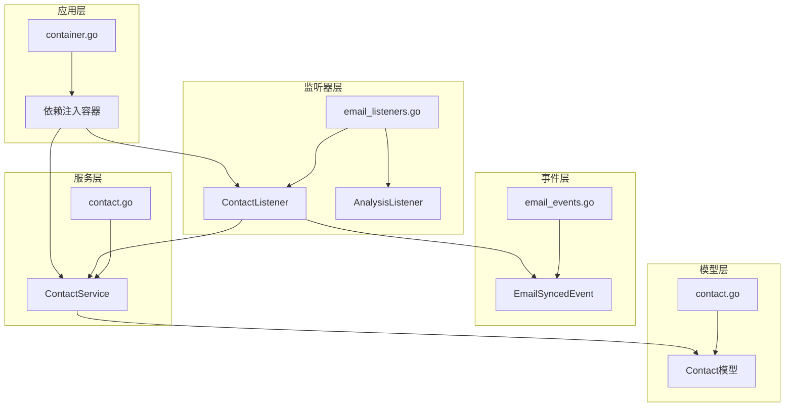
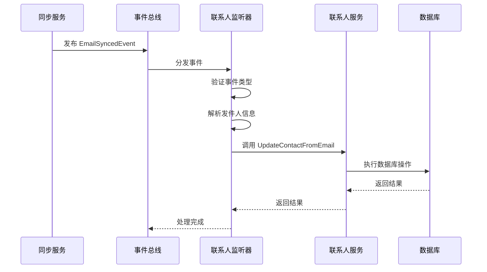
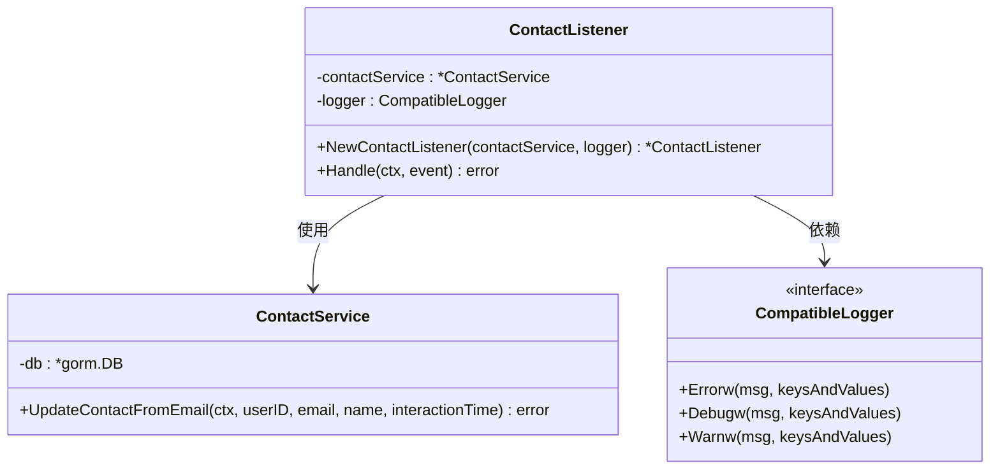
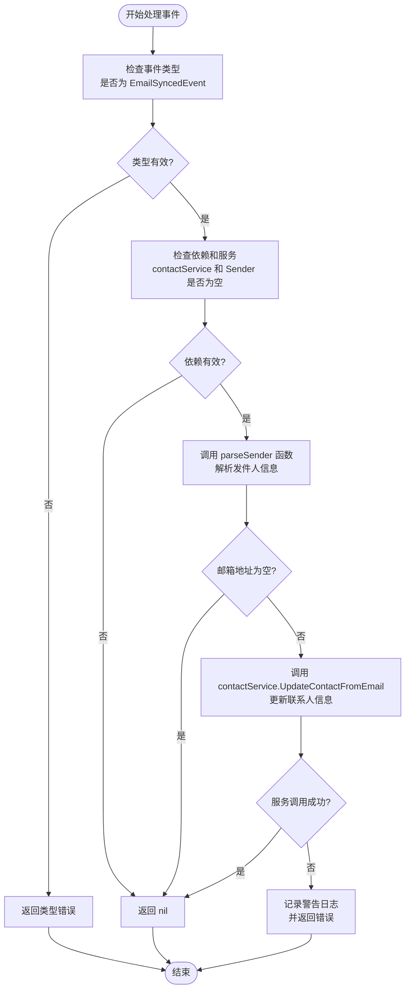
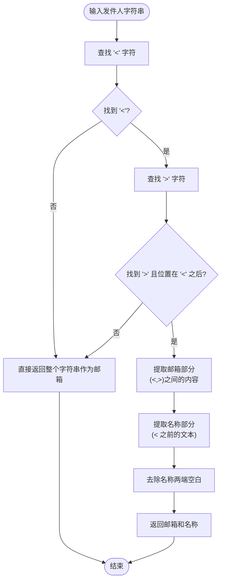
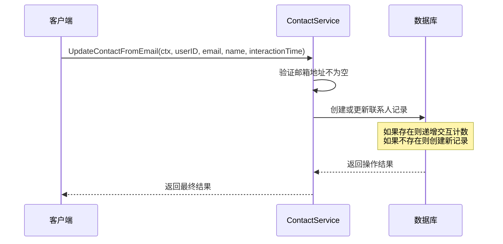
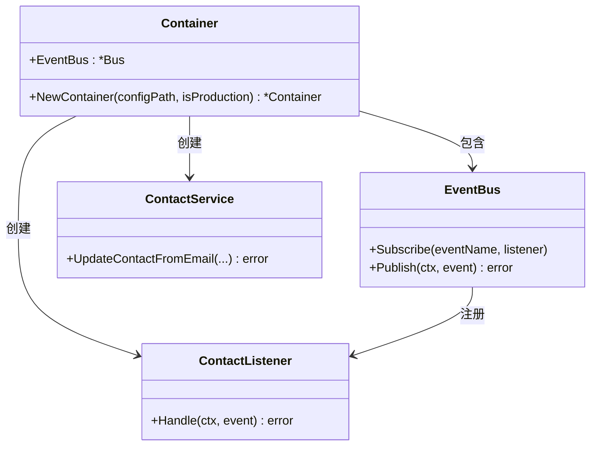
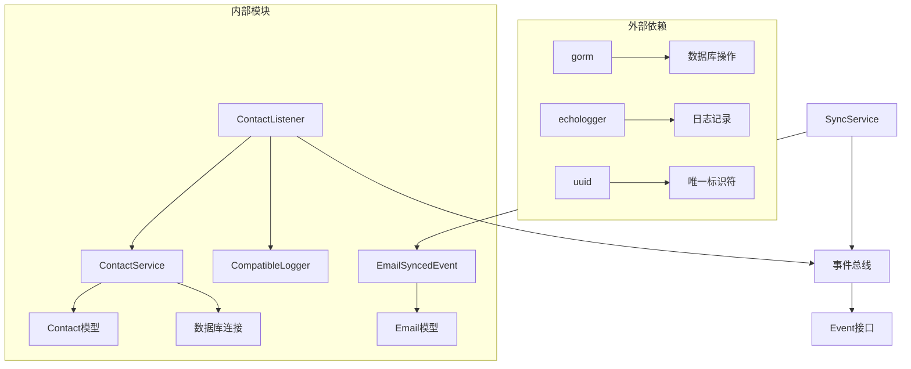

# 联系人监听器

<cite>
**本文档中引用的文件**
- [email_listeners.go](file://backend/internal/listener/email_listeners.go)
- [contact.go](file://backend/internal/model/contact.go)
- [contact.go](file://backend/internal/service/contact.go)
- [email_events.go](file://backend/internal/event/email_events.go)
- [container.go](file://backend/internal/app/container.go)
- [sync.go](file://backend/internal/service/sync.go)
- [sync_test.go](file://backend/internal/service/sync_test.go)
- [contact_test.go](file://backend/internal/service/contact_test.go)
</cite>

## 目录
1. [简介](#简介)
2. [项目结构](#项目结构)
3. [核心组件](#核心组件)
4. [架构概览](#架构概览)
5. [详细组件分析](#详细组件分析)
6. [依赖关系分析](#依赖关系分析)
7. [性能考虑](#性能考虑)
8. [故障排除指南](#故障排除指南)
9. [结论](#结论)

## 简介

联系人监听器（ContactListener）是EchoMind系统中的一个关键组件，负责响应`EmailSyncedEvent`事件并自动更新用户的联系人列表。当新的邮件被成功同步时，监听器会从发件人的信息中提取联系人数据，并将其存储到数据库中，从而维护用户联系人网络的实时性和准确性。

该监听器采用事件驱动架构，通过观察者模式实现了松耦合的设计，确保了系统的可扩展性和维护性。它与电子邮件同步服务紧密集成，为用户提供智能的联系人管理功能。

## 项目结构

联系人监听器相关的文件组织结构如下：



**图表来源**
- [email_listeners.go](file://backend/internal/listener/email_listeners.go#L68-L116)
- [email_events.go](file://backend/internal/event/email_events.go#L8-L18)
- [contact.go](file://backend/internal/service/contact.go#L12-L39)

**章节来源**
- [email_listeners.go](file://backend/internal/listener/email_listeners.go#L1-L116)
- [contact.go](file://backend/internal/model/contact.go#L1-L27)

## 核心组件

### ContactListener 结构体

ContactListener是联系人监听器的核心结构体，包含以下关键字段：

- **contactService**: 联系人服务实例，负责执行具体的联系人操作
- **logger**: 结构化日志记录器，用于记录监听器的运行状态和错误信息

### EmailSyncedEvent 事件

`EmailSyncedEvent`是监听器响应的主要事件类型，包含以下属性：

- **UserID**: 触发事件的用户标识符
- **Email**: 同步的邮件对象，包含发件人、主题、内容等信息

### Contact 模型

联系人数据模型定义了存储联系人信息的结构：

- **ID**: 唯一标识符
- **UserID**: 用户关联标识符
- **Email**: 联系人邮箱地址
- **Name**: 联系人姓名
- **InteractionCount**: 交互次数统计
- **LastInteractedAt**: 最后交互时间
- **AvgSentiment**: 平均情感值

**章节来源**
- [email_listeners.go](file://backend/internal/listener/email_listeners.go#L69-L72)
- [email_events.go](file://backend/internal/event/email_events.go#L11-L13)
- [contact.go](file://backend/internal/model/contact.go#L10-L26)

## 架构概览

联系人监听器在系统架构中扮演着重要的角色，作为事件驱动架构的一部分，它与其他组件协同工作：



**图表来源**
- [sync.go](file://backend/internal/service/sync.go#L142-L154)
- [email_listeners.go](file://backend/internal/listener/email_listeners.go#L81-L101)

## 详细组件分析

### ContactListener 构造函数

`NewContactListener`函数负责创建联系人监听器实例，它接受两个参数：



**图表来源**
- [email_listeners.go](file://backend/internal/listener/email_listeners.go#L74-L78)
- [contact.go](file://backend/internal/service/contact.go#L12-L18)

构造函数的实现细节包括：
- 接收`ContactService`实例作为依赖注入
- 将标准日志器转换为兼容的结构化日志接口
- 返回配置好的监听器实例

### Handle 方法逻辑分析

`Handle`方法是监听器的核心处理逻辑，其实现流程如下：



**图表来源**
- [email_listeners.go](file://backend/internal/listener/email_listeners.go#L81-L101)

#### 关键处理步骤

1. **事件类型验证**: 确保传入的事件是有效的`EmailSyncedEvent`
2. **空值检查**: 验证依赖项和服务的有效性
3. **发件人解析**: 使用`parseSender`工具函数提取邮箱和姓名
4. **服务调用**: 条件性地调用联系人服务进行更新
5. **错误处理**: 记录警告日志并返回适当的错误信息

### parseSender 工具函数

`parseSender`函数负责解析发件人字符串，支持两种格式：



**图表来源**
- [email_listeners.go](file://backend/internal/listener/email_listeners.go#L104-L115)

该函数能够处理以下格式的发件人字符串：
- `"Name <email@example.com>"` → 提取 `email@example.com` 和 `Name`
- `"email@example.com"` → 提取 `email@example.com` 和空字符串

### ContactService.UpdateContactFromEmail 方法

联系人服务的`UpdateContactFromEmail`方法实现了联系人数据的更新逻辑：



**图表来源**
- [contact.go](file://backend/internal/service/contact.go#L20-L39)

该方法的关键特性包括：
- **空邮箱检查**: 自动跳过空邮箱地址
- **UPSERT操作**: 支持创建新记录或更新现有记录
- **交互统计**: 维护交互次数和时间戳
- **事务安全**: 使用GORM的事务机制确保数据一致性

**章节来源**
- [email_listeners.go](file://backend/internal/listener/email_listeners.go#L74-L115)
- [contact.go](file://backend/internal/service/contact.go#L20-L39)

### 依赖注入和注册

在应用容器中，联系人监听器的实例化和注册过程如下：



**图表来源**
- [container.go](file://backend/internal/app/container.go#L60-L67)

注册过程包括：
1. 创建联系人服务实例
2. 创建联系人监听器实例
3. 将监听器注册到事件总线
4. 设置监听器处理`EmailSyncedEvent`事件

**章节来源**
- [container.go](file://backend/internal/app/container.go#L60-L67)

## 依赖关系分析

联系人监听器的依赖关系图展示了各组件之间的相互依赖：



**图表来源**
- [email_listeners.go](file://backend/internal/listener/email_listeners.go#L3-L13)
- [contact.go](file://backend/internal/service/contact.go#L3-L10)

### 主要依赖项

1. **ContactService**: 核心业务逻辑服务
2. **CompatibleLogger**: 结构化日志接口
3. **EmailSyncedEvent**: 事件数据结构
4. **GORM**: 数据持久化框架
5. **UUID**: 唯一标识符生成

### 循环依赖避免

系统设计中避免了循环依赖：
- 监听器依赖服务，但服务不依赖监听器
- 事件定义独立于处理逻辑
- 日志接口提供抽象层

**章节来源**
- [email_listeners.go](file://backend/internal/listener/email_listeners.go#L3-L13)
- [container.go](file://backend/internal/app/container.go#L15-L122)

## 性能考虑

### 异步处理

联系人监听器采用异步处理模式，避免阻塞主业务流程：
- 事件发布后立即返回
- 监听器独立处理事件
- 错误不会影响事件传播

### 数据库优化

联系人服务使用以下优化策略：
- UPSERT操作减少查询次数
- 索引优化提高查询性能
- 事务边界控制确保一致性

### 内存管理

- 及时释放事件处理资源
- 避免大对象的重复拷贝
- 合理使用缓存机制

## 故障排除指南

### 常见问题及解决方案

#### 1. 监听器未响应事件

**症状**: 新邮件同步后联系人未更新

**排查步骤**:
- 检查事件总线订阅是否正确设置
- 验证监听器实例是否成功创建
- 确认事件类型匹配

**解决方案**:
```go
// 确保正确注册监听器
eventBus.Subscribe(event.EmailSyncedEventName, contactListener)
```

#### 2. 联系人更新失败

**症状**: 日志中出现"Failed to update contact"警告

**排查步骤**:
- 检查数据库连接状态
- 验证邮箱地址格式
- 查看具体错误信息

**解决方案**:
- 实现重试机制
- 添加数据验证
- 提供降级处理方案

#### 3. 性能问题

**症状**: 事件处理延迟较高

**优化措施**:
- 考虑使用批量处理
- 实现背压控制
- 优化数据库索引

**章节来源**
- [email_listeners.go](file://backend/internal/listener/email_listeners.go#L93-L98)
- [contact.go](file://backend/internal/service/contact.go#L20-L39)

## 结论

联系人监听器是EchoMind系统中一个精心设计的组件，它通过事件驱动架构实现了高效的联系人管理功能。该组件具有以下优势：

1. **松耦合设计**: 通过事件机制实现组件间的解耦
2. **高可靠性**: 完善的错误处理和日志记录
3. **高性能**: 异步处理和数据库优化
4. **可扩展性**: 易于添加新的监听器和处理器

该监听器不仅满足了当前的功能需求，还为未来的功能扩展提供了良好的基础。通过持续的监控和优化，它可以为用户提供更加智能和高效的联系人管理体验。