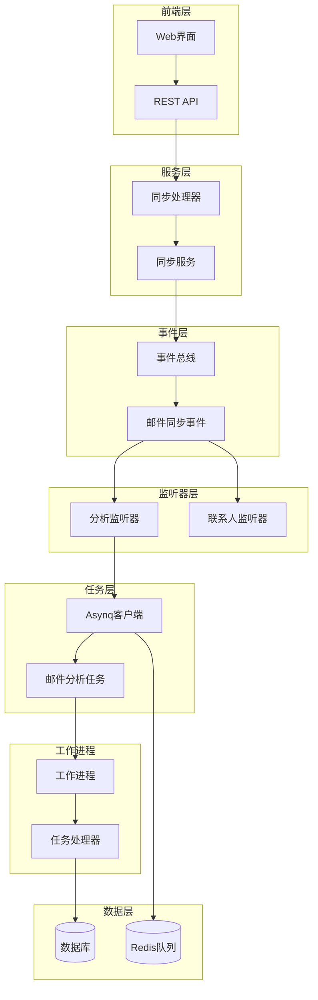
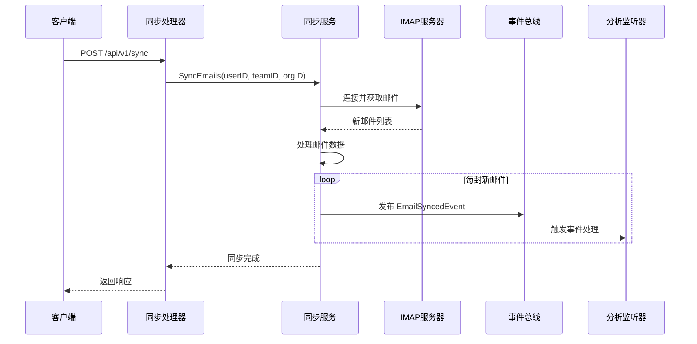
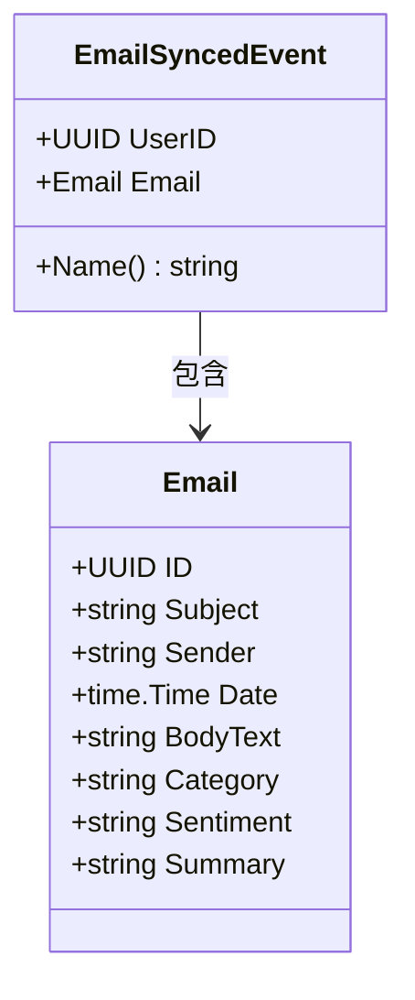
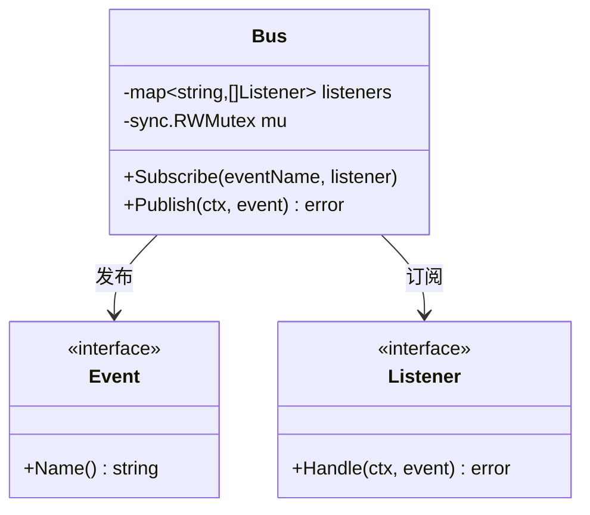
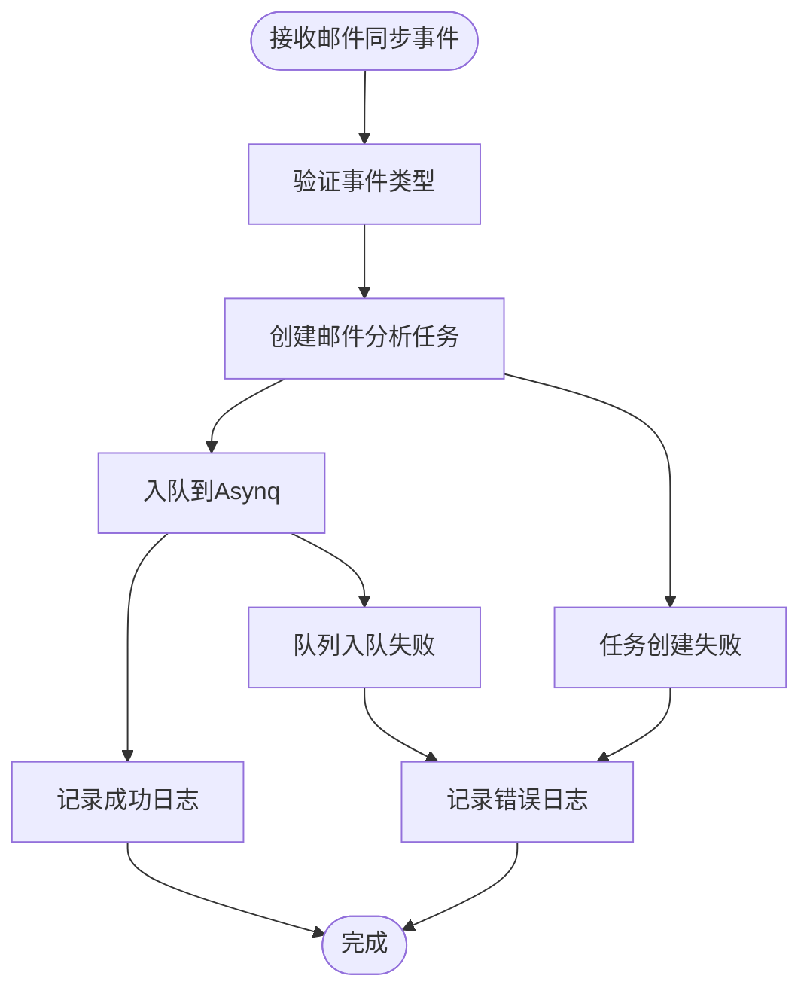
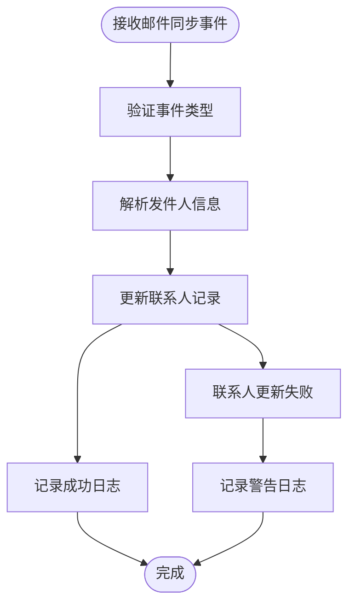
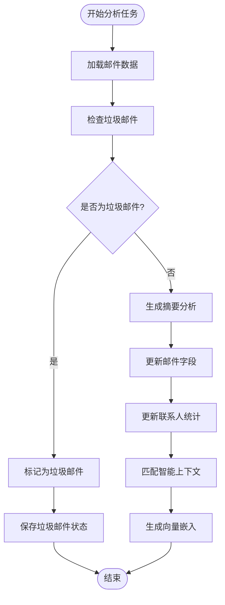
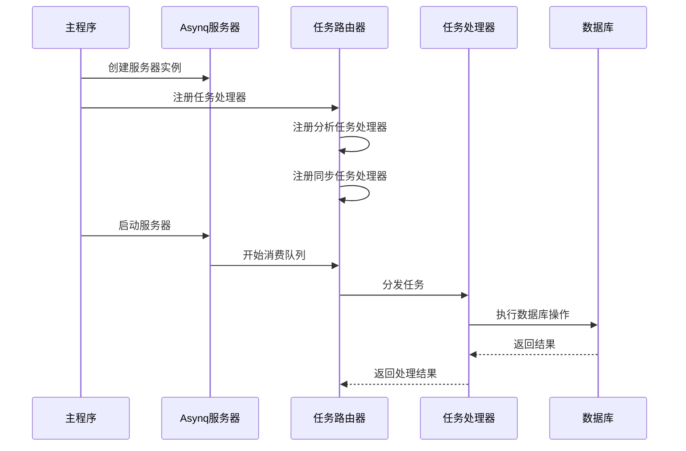
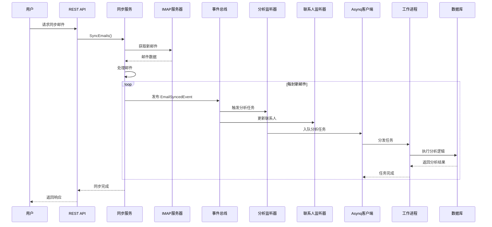

# 事件驱动异步流

<cite>
**本文档引用的文件**
- [sync.go](file://backend/internal/service/sync.go)
- [email_events.go](file://backend/internal/event/email_events.go)
- [email_listeners.go](file://backend/internal/listener/email_listeners.go)
- [analyze.go](file://backend/internal/tasks/analyze.go)
- [main.go](file://backend/cmd/worker/main.go)
- [bus.go](file://backend/pkg/event/bus/bus.go)
- [container.go](file://backend/internal/app/container.go)
- [sync.go](file://backend/internal/tasks/sync.go)
</cite>

## 目录
1. [简介](#简介)
2. [系统架构概览](#系统架构概览)
3. [邮件同步流程](#邮件同步流程)
4. [事件发布机制](#事件发布机制)
5. [事件监听器](#事件监听器)
6. [异步任务处理](#异步任务处理)
7. [工作进程架构](#工作进程架构)
8. [完整流程图](#完整流程图)
9. [性能考虑](#性能考虑)
10. [故障排除指南](#故障排除指南)
11. [总结](#总结)

## 简介

本文档详细描述了EchoMind系统中基于事件驱动的异步任务处理流程，重点关注邮件同步完成后触发的异步任务处理机制。该系统采用发布-订阅模式，通过事件总线实现解耦的组件通信，并使用Redis作为消息队列支持异步任务处理。

核心特性包括：
- 基于Go语言的高性能事件驱动架构
- 使用Asynq框架进行异步任务队列管理
- 实现了分析监听器和联系人监听器的事件订阅
- 支持邮件内容分析、联系人统计更新等异步处理

## 系统架构概览

系统采用分层架构设计，包含以下主要组件：

**图表来源**
- [sync.go](file://backend/internal/service/sync.go#L105-L156)
- [email_events.go](file://backend/internal/event/email_events.go#L8-L18)
- [email_listeners.go](file://backend/internal/listener/email_listeners.go#L22-L116)

## 邮件同步流程

### 同步服务的核心方法

`SyncService.SyncEmails`方法是整个流程的起点，负责从IMAP服务器获取邮件并触发后续的事件处理：

**图表来源**
- [sync.go](file://backend/internal/service/sync.go#L105-L156)
- [sync.go](file://backend/internal/handler/sync.go#L25-L58)

### 同步流程的关键步骤

1. **账户验证**：检查用户是否配置了有效的邮箱账户
2. **IMAP连接**：建立与邮件服务器的安全连接
3. **邮件获取**：从指定邮箱获取新的邮件内容
4. **数据处理**：解析邮件元数据和正文内容
5. **事件发布**：为每封新邮件发布同步完成事件

**节来源**
- [sync.go](file://backend/internal/service/sync.go#L105-L156)

## 事件发布机制

### 邮件同步事件定义

系统定义了专门的邮件同步事件类型，包含必要的上下文信息：

**图表来源**
- [email_events.go](file://backend/internal/event/email_events.go#L10-L18)

### 事件总线实现

事件总线提供了简单而高效的发布-订阅机制：

**图表来源**
- [bus.go](file://backend/pkg/event/bus/bus.go#L25-L62)

**节来源**
- [bus.go](file://backend/pkg/event/bus/bus.go#L46-L62)

## 事件监听器

### 分析监听器

分析监听器负责将邮件同步事件转换为异步分析任务：

**图表来源**
- [email_listeners.go](file://backend/internal/listener/email_listeners.go#L35-L66)

### 联系人监听器

联系人监听器负责更新联系人统计信息：

**图表来源**
- [email_listeners.go](file://backend/internal/listener/email_listeners.go#L81-L102)

**节来源**
- [email_listeners.go](file://backend/internal/listener/email_listeners.go#L35-L102)

## 异步任务处理

### 邮件分析任务

邮件分析任务包含了完整的邮件处理逻辑：

**图表来源**
- [analyze.go](file://backend/internal/tasks/analyze.go#L56-L184)

### 任务处理的关键阶段

1. **邮件验证**：确保邮件属于正确的用户
2. **垃圾邮件检测**：基于规则的垃圾邮件过滤
3. **内容分析**：使用AI生成摘要、情感分析等
4. **联系人更新**：维护联系人交互统计
5. **上下文匹配**：智能关联业务上下文
6. **向量嵌入**：生成可用于搜索的向量表示

**节来源**
- [analyze.go](file://backend/internal/tasks/analyze.go#L56-L184)

## 工作进程架构

### 工作进程启动

工作进程负责从队列中消费任务并执行实际的处理逻辑：

**图表来源**
- [main.go](file://backend/cmd/worker/main.go#L52-L85)

### 任务处理器注册

系统支持多种类型的任务处理器：

| 任务类型 | 处理器函数 | 功能描述 |
|---------|-----------|----------|
| `email:analyze` | `HandleEmailAnalyzeTask` | 邮件内容分析和处理 |
| `email:sync` | `HandleEmailSyncTask` | 邮件同步任务 |

**节来源**
- [main.go](file://backend/cmd/worker/main.go#L66-L85)

## 完整流程图

以下是整个事件驱动异步流的完整流程：

**图表来源**
- [sync.go](file://backend/internal/service/sync.go#L105-L156)
- [email_listeners.go](file://backend/internal/listener/email_listeners.go#L35-L102)
- [main.go](file://backend/cmd/worker/main.go#L66-L85)

## 性能考虑

### 并发处理能力

系统通过以下机制优化性能：

1. **异步处理**：邮件分析任务异步执行，不阻塞主线程
2. **批量操作**：多个邮件同步时批量发布事件
3. **连接池**：IMAP连接复用，减少连接开销
4. **任务队列**：使用Redis作为高吞吐量的消息队列

### 错误处理策略

- **事件发布失败**：记录错误但继续处理其他邮件
- **任务入队失败**：重试机制和错误日志
- **任务执行失败**：任务可重试，不影响整体流程

### 监控和日志

系统提供了完善的监控和日志记录：

- 任务执行时间统计
- 错误率监控
- 队列长度监控
- 用户ID和请求ID追踪

## 故障排除指南

### 常见问题及解决方案

1. **事件未被监听**
   - 检查事件名称是否正确
   - 确认监听器已正确注册
   - 验证事件总线配置

2. **任务队列积压**
   - 增加工作进程数量
   - 检查任务处理时间
   - 监控Redis连接状态

3. **邮件分析失败**
   - 检查AI服务可用性
   - 验证数据库连接
   - 查看详细错误日志

### 调试技巧

- 使用结构化日志记录关键操作
- 启用详细日志级别进行调试
- 监控关键指标和性能指标
- 使用分布式追踪跟踪请求链路

**节来源**
- [analyze.go](file://backend/internal/tasks/analyze.go#L56-L184)
- [email_listeners.go](file://backend/internal/listener/email_listeners.go#L35-L102)

## 总结

EchoMind系统的事件驱动异步流架构提供了高效、可扩展的邮件处理能力。通过精心设计的事件发布-订阅机制和异步任务处理，系统实现了以下优势：

### 核心优势

1. **解耦架构**：各组件通过事件通信，降低耦合度
2. **高并发处理**：异步任务处理支持高并发场景
3. **可扩展性**：易于添加新的事件监听器和任务处理器
4. **可靠性**：任务重试机制和错误处理保证系统稳定性

### 技术特色

- 基于Go语言的高性能实现
- 使用Redis作为可靠的消息队列
- 完善的错误处理和监控机制
- 支持多种AI服务提供商

这种架构设计不仅满足了当前的功能需求，还为未来的功能扩展和性能优化奠定了坚实的基础。开发者可以通过理解和掌握这套事件驱动架构，更好地维护和扩展系统功能。