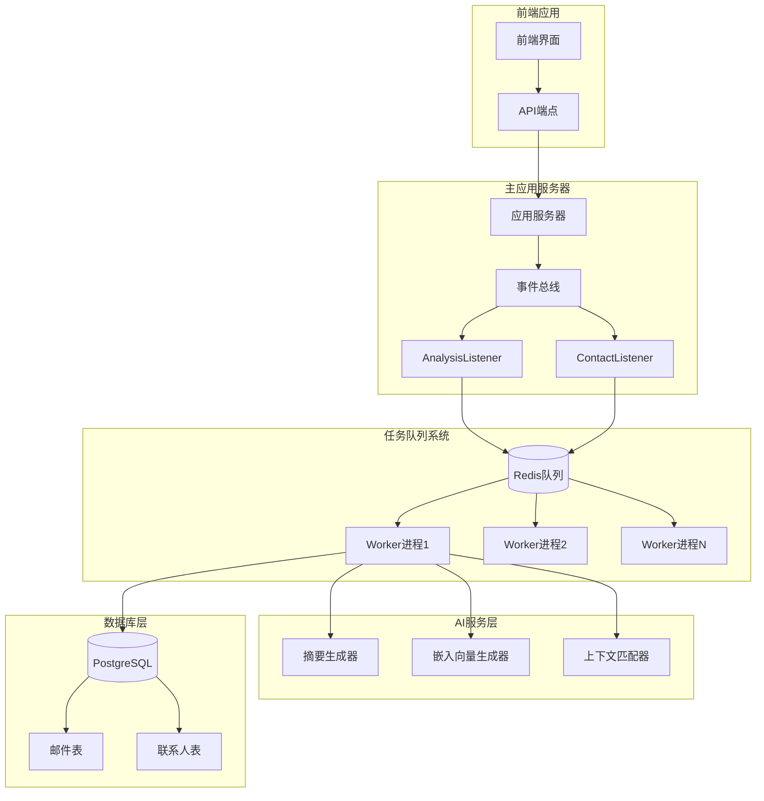
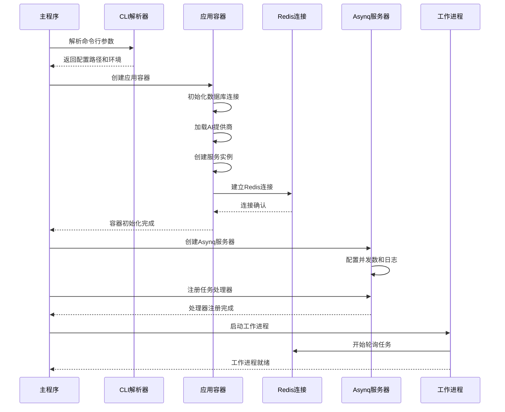
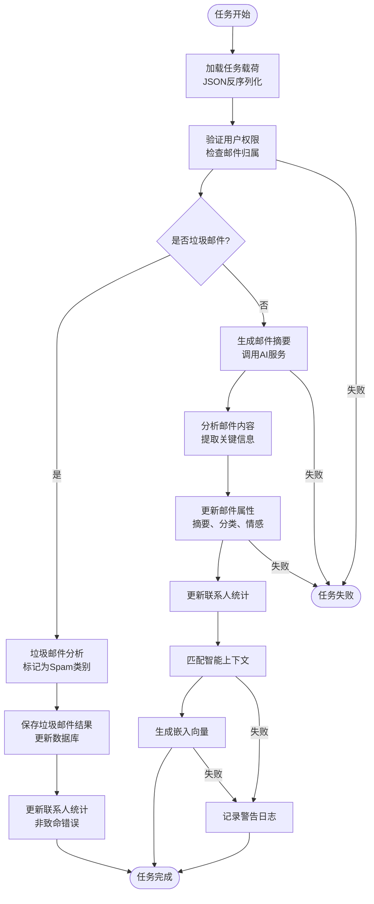
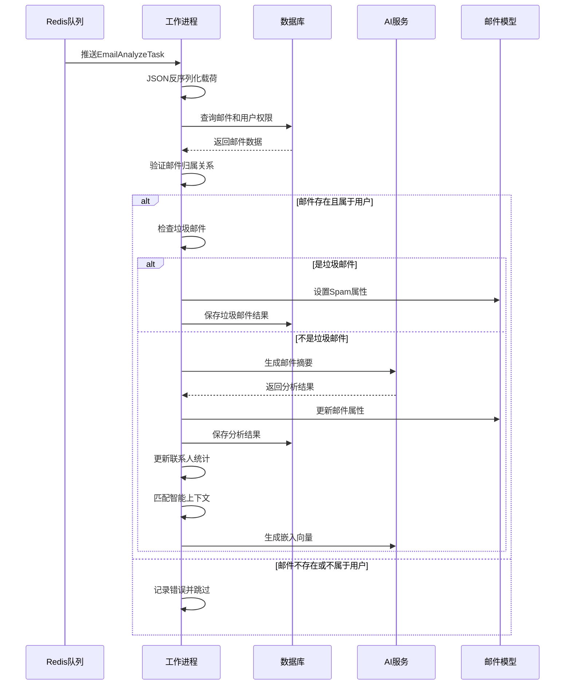
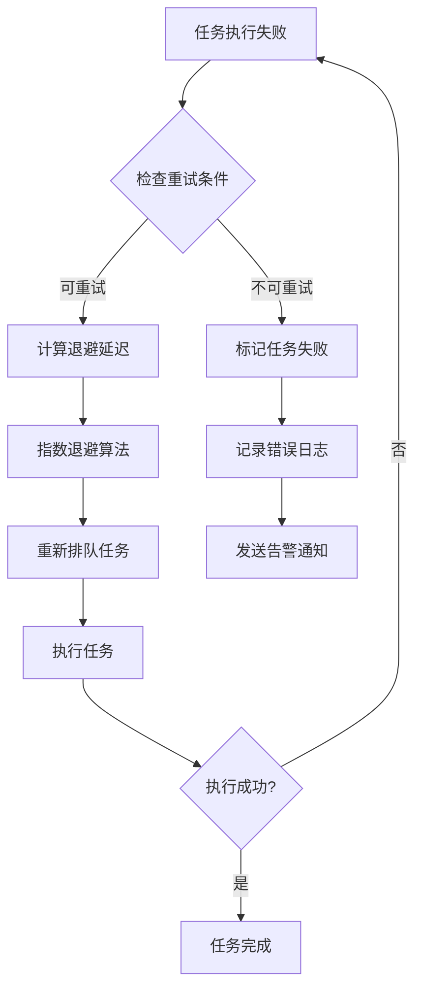
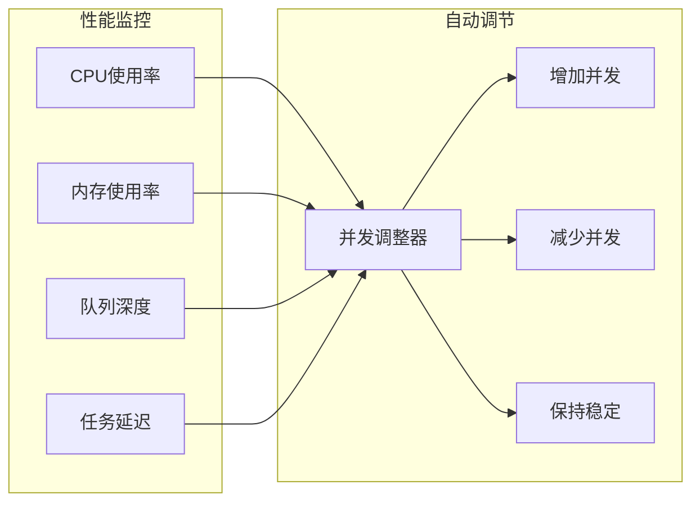

# 后台任务处理

<cite>
**本文档引用的文件**
- [backend/cmd/worker/main.go](file://backend/cmd/worker/main.go)
- [backend/internal/tasks/analyze.go](file://backend/internal/tasks/analyze.go)
- [backend/internal/listener/email_listeners.go](file://backend/internal/listener/email_listeners.go)
- [backend/internal/model/email.go](file://backend/internal/model/email.go)
- [backend/internal/app/container.go](file://backend/internal/app/container.go)
- [backend/internal/service/task.go](file://backend/internal/service/task.go)
- [backend/internal/spam/filter.go](file://backend/internal/spam/filter.go)
- [backend/configs/app_config.go](file://backend/configs/app_config.go)
- [backend/configs/config.example.yaml](file://backend/configs/config.example.yaml)
- [deploy/docker-compose.prod.yml](file://deploy/docker-compose.prod.yml)
</cite>

## 目录
1. [简介](#简介)
2. [系统架构概览](#系统架构概览)
3. [工作进程启动流程](#工作进程启动流程)
4. [任务队列与Redis集成](#任务队列与redis集成)
5. [Email分析任务处理](#email分析任务处理)
6. [错误处理与重试机制](#错误处理与重试机制)
7. [并发控制与性能优化](#并发控制与性能优化)
8. [监控与日志记录](#监控与日志记录)
9. [配置指南](#配置指南)
10. [扩展开发指南](#扩展开发指南)
11. [故障排除](#故障排除)

## 简介

EchoMind的后台任务处理系统是一个基于Redis的分布式任务队列解决方案，专门用于处理邮件分析、AI服务调用和数据处理等计算密集型任务。该系统采用异步处理模式，通过`worker`进程池高效处理由`AnalysisListener`生成的`EmailAnalyzeTask`任务。

核心特性包括：
- 基于Redis的可靠任务队列
- 可配置的并发工作进程
- 智能错误重试机制
- 实时监控和性能指标
- 支持多种任务类型的扩展架构

## 系统架构概览



**图表来源**
- [backend/cmd/worker/main.go](file://backend/cmd/worker/main.go#L41-L109)
- [backend/internal/listener/email_listeners.go](file://backend/internal/listener/email_listeners.go#L22-L66)
- [backend/internal/app/container.go](file://backend/internal/app/container.go#L15-L29)

## 工作进程启动流程

### 初始化阶段

工作进程的启动遵循严格的初始化顺序，确保所有依赖服务正确配置：



**图表来源**
- [backend/cmd/worker/main.go](file://backend/cmd/worker/main.go#L41-L109)
- [backend/internal/app/container.go](file://backend/internal/app/container.go#L31-L100)

### 关键启动步骤

1. **CLI参数解析**：从命令行获取配置文件路径和环境标识
2. **应用容器初始化**：建立数据库连接、加载AI服务、创建依赖注入容器
3. **Redis连接建立**：使用配置文件中的Redis地址、密码和数据库编号
4. **Asynq服务器配置**：设置并发数、日志适配器和任务处理器
5. **任务处理器注册**：为不同类型的邮件任务注册对应的处理函数
6. **工作进程启动**：在独立goroutine中运行Asynq服务器

**章节来源**
- [backend/cmd/worker/main.go](file://backend/cmd/worker/main.go#L41-L109)
- [backend/internal/app/container.go](file://backend/internal/app/container.go#L31-L100)

## 任务队列与Redis集成

### Asynq配置架构

系统使用Asynq作为任务队列管理器，通过Redis存储任务队列和状态信息：

```mermaid
classDiagram
class AsynqServer {
+RedisClientOpt redisConfig
+Config workerConfig
+Run(mux ServeMux) error
+Shutdown() void
}
class LoggerAdapter {
+logger Logger
+Debug(args ...interface{}) void
+Info(args ...interface{}) void
+Warn(args ...interface{}) void
+Error(args ...interface{}) void
+Fatal(args ...interface{}) void
}
class TaskHandler {
+HandleEmailAnalyzeTask() error
+HandleEmailSyncTask() error
}
class EmailAnalyzeTask {
+TypeEmailAnalyze string
+payload EmailAnalyzePayload
+enqueue() error
}
AsynqServer --> LoggerAdapter : 使用
AsynqServer --> TaskHandler : 注册
TaskHandler --> EmailAnalyzeTask : 处理
```

**图表来源**
- [backend/cmd/worker/main.go](file://backend/cmd/worker/main.go#L53-L77)
- [backend/internal/tasks/analyze.go](file://backend/internal/tasks/analyze.go#L20-L36)

### Redis连接配置

工作进程通过以下配置连接到Redis队列：

| 配置项 | 默认值 | 描述 |
|--------|--------|------|
| 地址 | localhost:6380 | Redis服务器地址和端口 |
| 密码 | 空字符串 | Redis认证密码（可选） |
| 数据库 | 0 | Redis数据库编号 |
| 并发数 | 10 | 工作进程并发处理任务数 |

**章节来源**
- [backend/cmd/worker/main.go](file://backend/cmd/worker/main.go#L53-L62)
- [backend/configs/config.example.yaml](file://backend/configs/config.example.yaml#L14-L18)

## Email分析任务处理

### 任务生命周期

Email分析任务的完整处理流程包括多个阶段，每个阶段都有明确的职责和错误处理机制：



**图表来源**
- [backend/internal/tasks/analyze.go](file://backend/internal/tasks/analyze.go#L56-L183)

### 核心处理逻辑

#### 1. 任务载荷解析
任务载荷包含`EmailID`和`UserID`，用于定位特定用户的特定邮件：



**图表来源**
- [backend/internal/tasks/analyze.go](file://backend/internal/tasks/analyze.go#L59-L183)

#### 2. 垃圾邮件检测
系统实现了基于规则的垃圾邮件检测机制：

| 检测项目 | 规则 | 优先级 |
|----------|------|--------|
| 主题关键词 | unsubscribe, promotion, marketing, verify your email | 高 |
| 正文关键词 | click here, limited time offer, no-reply | 中 |
| 内容长度 | 过短或过长的内容 | 中 |
| 发件人信誉 | 已知垃圾邮件发送者 | 高 |

**章节来源**
- [backend/internal/spam/filter.go](file://backend/internal/spam/filter.go#L16-L61)

#### 3. AI服务集成
邮件分析过程调用多个AI服务：

| 服务类型 | 功能 | 输入 | 输出 |
|----------|------|------|------|
| 摘要生成 | 生成邮件内容摘要 | 邮件正文 | 结构化分析结果 |
| 情感分析 | 识别邮件情感倾向 | 邮件正文 | Positive/Neutral/Negative |
| 上下文匹配 | 智能标签匹配 | 邮件内容 | 相关上下文列表 |
| 嵌入生成 | 向量化邮件内容 | 邮件文本 | 向量表示 |

**章节来源**
- [backend/internal/tasks/analyze.go](file://backend/internal/tasks/analyze.go#L112-L122)

### 错误处理策略

系统采用分层错误处理策略：

1. **任务级别错误**：JSON反序列化失败、权限验证失败
2. **业务级别错误**：邮件不存在、AI服务调用失败
3. **系统级别错误**：数据库连接失败、Redis通信异常

对于可恢复的错误，系统会记录警告并继续处理；对于致命错误，任务会被标记为失败并可能触发重试。

**章节来源**
- [backend/internal/tasks/analyze.go](file://backend/internal/tasks/analyze.go#L60-L62)
- [backend/internal/tasks/analyze.go](file://backend/internal/tasks/analyze.go#L120-L122)

## 错误处理与重试机制

### 重试策略配置

Asynq提供了内置的重试机制，支持指数退避和最大重试次数限制：



### 错误分类处理

| 错误类型 | 处理策略 | 重试次数 | 退避策略 |
|----------|----------|----------|----------|
| 网络超时 | 自动重试 | 3次 | 指数退避 |
| 权限不足 | 跳过重试 | 0次 | 立即失败 |
| 数据库锁定 | 延迟重试 | 5次 | 固定间隔 |
| AI服务不可用 | 降级处理 | 2次 | 线性增长 |

**章节来源**
- [backend/internal/tasks/analyze.go](file://backend/internal/tasks/analyze.go#L60-L62)

## 并发控制与性能优化

### 并发配置

工作进程的并发数可以通过配置文件进行调整：

```yaml
worker:
  concurrency: 10  # 默认并发数
```

系统提供了动态并发调整机制：



### 性能优化策略

1. **连接池管理**：数据库和Redis连接使用连接池
2. **批量操作**：联系人统计更新采用批量处理
3. **缓存机制**：频繁访问的数据使用内存缓存
4. **异步处理**：非关键任务采用异步方式处理

**章节来源**
- [backend/internal/app/container.go](file://backend/internal/app/container.go#L110-L116)
- [backend/configs/config.example.yaml](file://backend/configs/config.example.yaml#L19-L21)

## 监控与日志记录

### 日志系统架构

系统采用结构化日志记录，支持多级别日志输出：

```mermaid
classDiagram
class LoggerAdapter {
+logger Logger
+Debug(args ...interface{}) void
+Info(args ...interface{}) void
+Warn(args ...interface{}) void
+Error(args ...interface{}) void
+Fatal(args ...interface{}) void
}
class AsynqLogger {
<<interface>>
+Debug(args ...interface{}) void
+Info(args ...interface{}) void
+Warn(args ...interface{}) void
+Error(args ...interface{}) void
+Fatal(args ...interface{}) void
}
class TaskLogger {
+UserID string
+TaskID string
+Component string
+Level LogLevel
+Message string
+Fields map[string]interface{}
}
LoggerAdapter ..|> AsynqLogger
LoggerAdapter --> TaskLogger : 创建
```

**图表来源**
- [backend/cmd/worker/main.go](file://backend/cmd/worker/main.go#L16-L40)

### 关键监控指标

| 指标类型 | 监控项目 | 阈值建议 | 告警条件 |
|----------|----------|----------|----------|
| 任务处理 | 处理时间 | < 30秒 | 超过1分钟 |
| 队列状态 | 待处理任务数 | < 1000 | 超过5000 |
| 错误率 | 失败任务比例 | < 5% | 超过10% |
| 资源使用 | CPU使用率 | < 80% | 超过90% |
| 资源使用 | 内存使用率 | < 85% | 超过95% |

**章节来源**
- [backend/internal/tasks/analyze.go](file://backend/internal/tasks/analyze.go#L70-L82)

## 配置指南

### 基础配置

创建配置文件`config.yaml`：

```yaml
server:
  port: 8080
  environment: production

database:
  dsn: "host=localhost user=echomind password=secret dbname=echomind_db port=5432 sslmode=disable"

redis:
  addr: "localhost:6380"
  password: ""
  db: 0

worker:
  concurrency: 10

ai:
  active_services:
    chat: "openai"
    embedding: "openai"
  chunk_size: 1000
  providers:
    openai:
      api_key: "your-openai-api-key"
      base_url: "https://api.openai.com/v1"
```

### 生产环境配置

生产环境需要额外的安全配置：

```yaml
security:
  encryption_key: "your-64-character-hex-encryption-key"

server:
  environment: production
  jwt:
    secret: "your-jwt-secret"
    expiration_hours: 72
```

**章节来源**
- [backend/configs/config.example.yaml](file://backend/configs/config.example.yaml#L1-L46)

### Docker部署配置

使用Docker Compose部署：

```yaml
version: '3.8'
services:
  worker:
    image: echomind/worker:latest
    command: ["/app/worker"]
    environment:
      - ECHOMIND_CONFIG_PATH=/app/config.yaml
    volumes:
      - ./config.yaml:/app/config.yaml
    depends_on:
      - redis
      - postgres
```

**章节来源**
- [deploy/docker-compose.prod.yml](file://deploy/docker-compose.prod.yml#L18-L30)

## 扩展开发指南

### 添加新任务类型

1. **定义任务常量和载荷**：
```go
const TypeCustomTask = "custom:process"
type CustomTaskPayload struct {
    ID     uuid.UUID
    Params map[string]interface{}
}
```

2. **创建任务构建函数**：
```go
func NewCustomTask(id uuid.UUID, params map[string]interface{}) (*asynq.Task, error) {
    payload, err := json.Marshal(CustomTaskPayload{ID: id, Params: params})
    if err != nil {
        return nil, err
    }
    return asynq.NewTask(TypeCustomTask, payload), nil
}
```

3. **实现任务处理器**：
```go
func HandleCustomTask(ctx context.Context, t *asynq.Task, service *CustomService) error {
    var p CustomTaskPayload
    if err := json.Unmarshal(t.Payload(), &p); err != nil {
        return fmt.Errorf("json.Unmarshal failed: %v: %w", err, asynq.SkipRetry)
    }
    // 实现业务逻辑
    return nil
}
```

4. **注册任务处理器**：
```go
mux.HandleFunc(TypeCustomTask, func(ctx context.Context, t *asynq.Task) error {
    return HandleCustomTask(ctx, t, customService)
})
```

### 自定义AI服务

扩展AI服务接口以支持新的提供商：

```go
type CustomAIProvider struct {
    // 实现AIProvider接口
}

func (p *CustomAIProvider) GenerateSummary(ctx context.Context, text string) (ai.AnalysisResult, error) {
    // 实现摘要生成功能
}

func (p *CustomAIProvider) GenerateEmbedding(ctx context.Context, text string) ([]float64, error) {
    // 实现嵌入向量生成功能
}
```

**章节来源**
- [backend/internal/tasks/analyze.go](file://backend/internal/tasks/analyze.go#L20-L36)
- [backend/internal/tasks/sync.go](file://backend/internal/tasks/sync.go#L13-L33)

## 故障排除

### 常见问题及解决方案

#### 1. 工作进程无法启动

**症状**：工作进程启动后立即退出
**原因**：Redis连接失败或配置错误
**解决**：
- 检查Redis服务是否运行：`redis-cli ping`
- 验证配置文件中的Redis地址和密码
- 查看工作进程日志获取详细错误信息

#### 2. 任务处理缓慢

**症状**：任务队列积压严重，处理时间过长
**原因**：并发数不足或AI服务响应慢
**解决**：
- 增加worker.concurrency配置
- 监控AI服务响应时间
- 检查数据库连接池配置

#### 3. 垃圾邮件误判

**症状**：正常邮件被标记为垃圾邮件
**原因**：规则过于严格或关键词冲突
**解决**：
- 调整spam.filter.keywords配置
- 添加白名单规则
- 使用机器学习模型替代规则

#### 4. 内存使用过高

**症状**：工作进程内存占用持续增长
**原因**：任务处理过程中内存泄漏
**解决**：
- 检查任务处理器中的资源释放
- 增加垃圾回收频率
- 优化大对象的处理逻辑

### 调试工具

1. **任务状态查询**：
```bash
# 查看Redis中的任务队列
redis-cli llen asynq:tasks

# 查看失败的任务
redis-cli zrange asynq:scheduled 0 -1
```

2. **性能监控**：
```bash
# 监控工作进程CPU和内存
htop -p $(pgrep worker)

# 查看网络连接
netstat -an | grep 6380
```

3. **日志分析**：
```bash
# 查看最近的错误日志
tail -f logs/worker.log | grep ERROR

# 统计任务处理时间
grep "Task Completed" logs/worker.log | awk '{print $NF}'
```

**章节来源**
- [backend/cmd/worker/main.go](file://backend/cmd/worker/main.go#L98-L107)